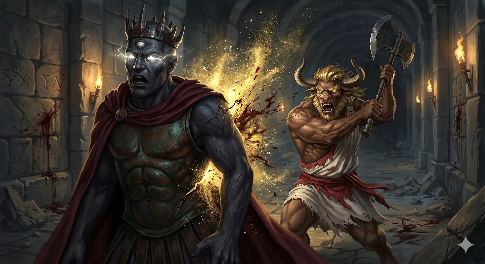
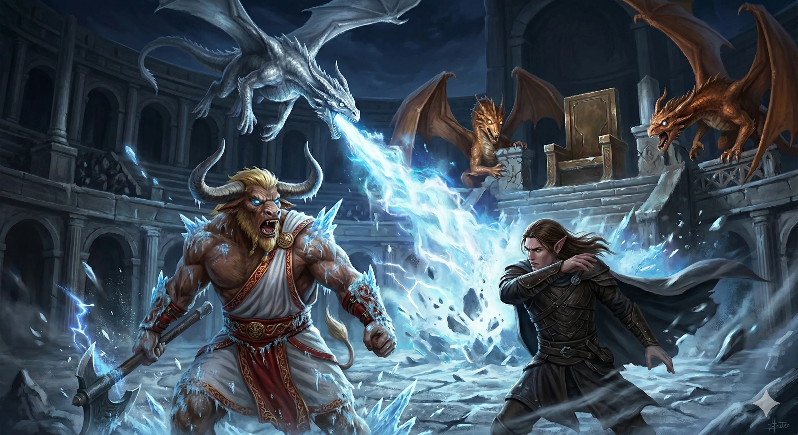
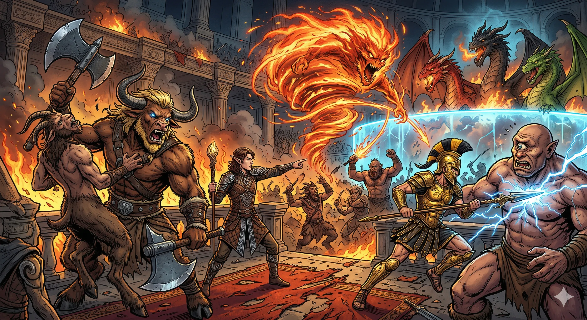
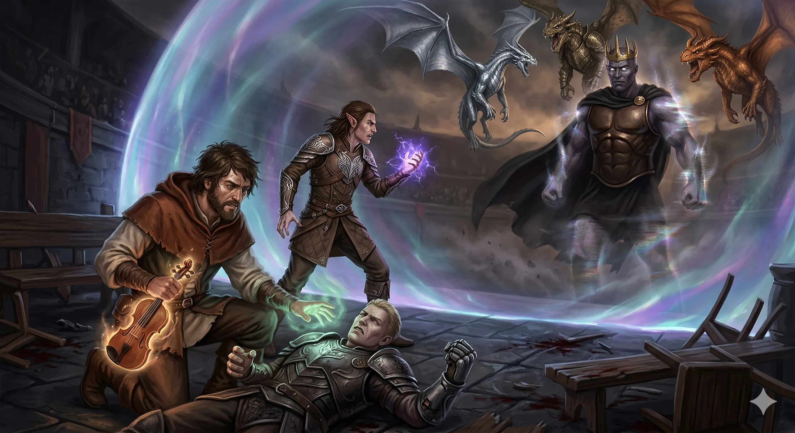
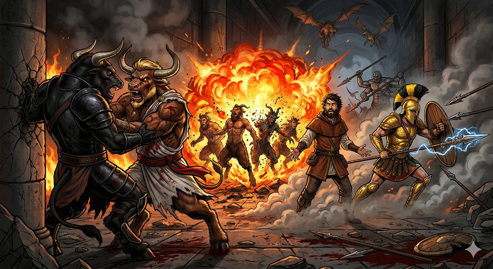
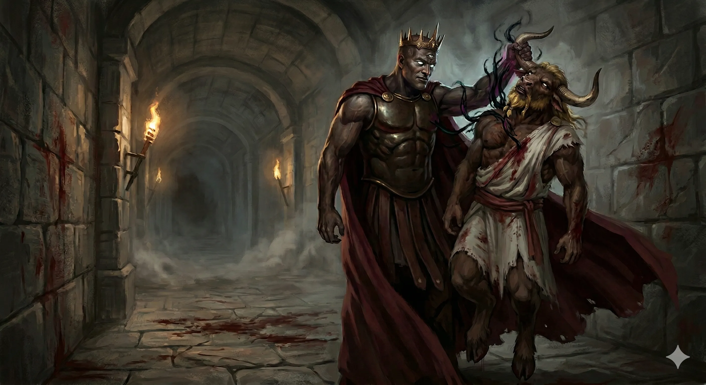
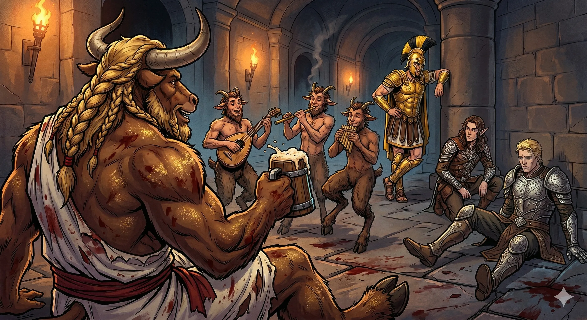
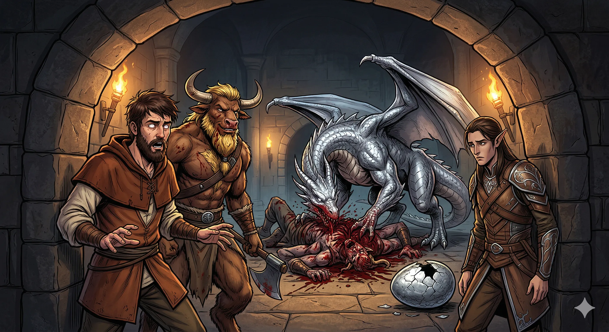
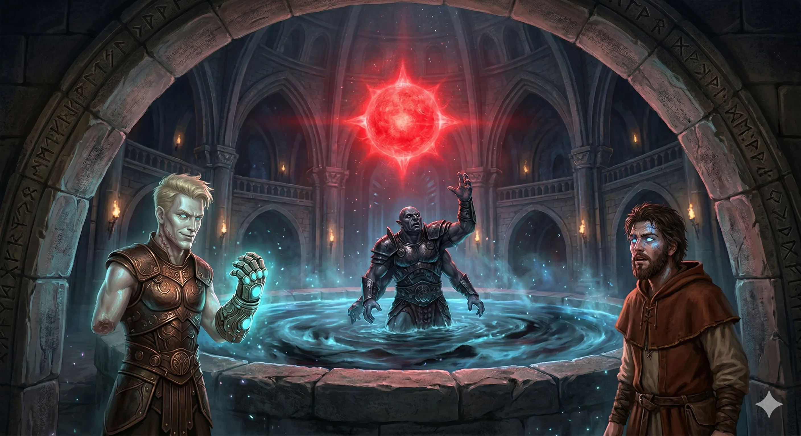

[Prompt](../assets/sessions/074/074_egzekucja_golorona_zloty_pyl.txt)

**Data:** 30.03.2026

## Podsumowanie

### Krwawa Arena [[Goloron|Golorona]] — Ogień, Lód i Szaleństwo Smoków

[Prompt](../assets/sessions/074/074_oddech_smoka_bitwa.txt)

Bohaterowie Przepowiedni znaleźli się w samym sercu areny **[[Goloron|Golorona]]**, szalonego syna [[Bliźniaczy Tytani|Bliźniaków]], na jednym z wyższych pięter wieży **[[Praxys]]**. Ogromna, prostokątna komnata rozciągała się przed nimi niczym antyczny amfiteatr — w zachodniej części, na podwyższeniu, stał masywny tron, wokół którego rozsiadła się widownia złożona z **cyklopów** i **koźlaków**. Całą tę sekcję od właściwej areny oddzielała niewidzialna, lecz absolutnie nieprzenikliwa bariera — **Wall of Force**. Na wschodnim krańcu komnaty ciężka krata skrywała trzy młode smoki — srebrnego, brązowego i miedzianego — których oczy płonęły szaleńczym blaskiem. Sam **[[Goloron]]** zasiadał na tronie niczym groteskowy sędzia własnych igrzysk, a gdy ogłosił rozpoczęcie widowiska, krata na wschodzie podniosła się z zgrzytem i bestie wdarły się na arenę.

Srebrny smok, najbardziej masywny z trójki, wzniósł się w powietrze i z gracją drapieżnika uderzył **Cold Breathem** prosto w zbite zbyt blisko siebie szeregi drużyny.Lodowe kryształy pokryły zbroję minotaura, a elf druid zacisnął zęby, czując jak mróz przenika do kości. Brązowy i miedziany smok podążyli za starszym bratem, siejąc dodatkowe spustoszenie kwasem i błyskawicami.

### Scatter — Ucieczka na Widownię

[Prompt](../assets/sessions/074/074_bitwa_na_widowni_elemental.txt)

W chwili, gdy sytuacja na arenie wyglądała coraz gorzej, **[[Felicjan Janus Twardowski|Felicjan]] Janus Twardowski** podjął decyzję, która odwróciła bieg bitwy. Czarodziej skupił moc i rzucił zaklęcie **Scatter**, które w jednym pulsie teleportacyjnej energii wyrwało całą drużynę z areny i przeniósło na podwyższenie po zachodniej stronie Wall of Force — wprost na widownię, tuż obok tronu [[Goloron|Golorona]]. Smoki, uwięzione po drugiej stronie bariery, mogły jedynie ryczeć z bezsilnej wściekłości, obserwując jak ich pan zostaje odcięty. Bohaterowie wylądowali pośród oszołomionych cyklopów i koźlaków, a **[[Goloron]]** po raz pierwszy stracił swój szalony uśmiech — igrzyska przerodziły się w coś, czego nie zaplanował.

Walka na widowni rozgorzała z pełną intensywnością. Koźlaki, oprócz walki fizycznej, sięgnęły po swoją najbardziej paskudną broń — **obelgi**. Jeden z nich wrzasnął do [[Orestes|Orestesa]]: „Tam byczku, jakiś niewyrośnięty jesteś!", a drugi dorzucił z reakcji: „Matka jebała się z niziołkiem?" — każda kolejna zniewaga pogłębiała wściekłość minotaura, nakładając na niego disadvantage do ataków. **[[Arevon Elorrenthi|Arevon]]** przywołał piąto-poziomowego **Elementala**, który zaczął siać spustoszenie w szeregach wroga, a **[[Orion Xul|Orion]]** ze swoją włócznią sunął między wrogami, szukając drogi do tytana.

### Szaleńczy Gambit Golorona — Stun, Ucieczka i Niewidzialność

[Prompt](../assets/sessions/074/074_niewidzialnosc_tytana_escape.txt)

Drużyna zaczęła wyraźnie dominować. [[Versir]] sypał ciosami z miecza wspartymi **Spirit Shroudem**, a z jego kikuta dłoni, straconej wcześniej w kontakcie ze Sferą Anihilacji, wystrzelił **Scorching Ray** — pięć promieni ognia wyłaniających się z pięciu płomiennych palców widmowej ręki. [[Goloron]] chwiał się pod naporem ataków, krew sączyła się z ran na jego tytanicznym ciele, a porażka zdawała się nieuchronna.

Wtedy szalony tytan sięgnął po ostateczny środek. Jego puste oczy zalała atramentowa czerń i skierował potężny **psioniczny atak** prosto w umysł **[[Versir|Versira]]**. Dwadzieścia osiem punktów psychicznych obrażeń wstrząsnęło pół-tytanem, a co gorsza — **stan ogłuszenia** kompletnie sparaliżował jego ciało. [[Versir]] zamarł jak posąg, niezdolny do działania, rzucania zaklęć czy choćby ruszenia palcem. Jego aura ochronna zgasła, Spirit Shroud rozwiał się, a drużyna straciła swojego najbardziej mobilnego wojownika. Korzystając z chwili chaosu, [[Goloron]] użył **legendarnej akcji**, by teleportować się za Wall of Force — z powrotem na arenę, pośród swoich smoków — po czym **stał się niewidzialny**, znikając z oczu i zmysłów bohaterów.

„Gdyby nie ten stun, to byłoby mega łatwe wszystko, co tu się dzieje” — syknął **[[Arevon Elorrenthi|Arevon]]** z goryczą. [[Versir]], świadomy swojej bezradności, zdołał jedynie wychrypieć przez zaciśnięte szczęki słowo „capriccio” — hasło aktywujące magiczne skrzypce [[Felicjan Janus Twardowski|Felicjana]], dające dodatkową kość do rzutu obronnego. Nawet ta pomoc okazała się niewystarczająca, a ogłuszenie trwało rundę za rundą. **[[Felicjan Janus Twardowski|Felicjan]]** w akcie desperacji użył **telekinezy**, by przesunąć sparaliżowanego [[Versir|Versira]] bliżej siebie — ciągnąc go po podłodze jak bezwładnego pionka.

### Korytarz Krwi — Cyklopy, Minotaury i Gygany

[Prompt](../assets/sessions/074/074_fireball_felicjana_korytarz.txt)

Po wyeliminowaniu większości koźlaków ognistym **Fireballem** [[Felicjan Janus Twardowski|Felicjana]], który zmiótł je bez rzutu obronnego, oraz po dobiciu ostatnich cyklopów skoordynowanymi atakami [[Orion Xul|Oriona]] i Elementala. Zza drzwi wyłonił się potężny **minotaur** — który natychmiast zaatakował [[Orestes|Orestesa]], próbując go nadziać rogami. Barbarzyńca, wciąż wściekły po obelgach koźlaków, złapał minotaura w uchwyt i zaczął ciągnąć go po podłodze „jak burą szmatę", waląc toporem na przemian w niego i w wszystko, co się ruszało.

Walka przeniosła się na **korytarz** za widownią, gdzie dołączyły kolejne **minotaury** oraz **sześciorękie Gygany** — potężne, wieloramienne olbrzymy, które ciskały javelinami z przerażającą celnością. Sytuacja robiła się coraz bardziej chaotyczna — [[Orestes]] walczył na jednym HP, [[Versir]] wciąż tkwił w stuporze, a [[Arevon Elorrenthi|Arevon]] i [[Felicjan Janus Twardowski|Felicjan]] próbowali jakoś utrzymać linię obrony, podczas gdy [[Orion Xul|Orion]] krążył po flankach, rażąc wrogów swoją włócznią.

### Śmierć i Przeznaczenie Orestesa

[Prompt](../assets/sessions/074/074_smierc_orestesa_goloron.txt)

Po jakimś czasie, z bocznego korytarza, znienacka wyłonił się ponownie **[[Goloron]]**. Skupił swoje ataki na najbardziej osłabionym celu — **Orestesie**. Nekrotyczna energia sączyła się z pustych oczu tytana, zatruwając krew minotaura, a kolejne ciosy systematycznie zdejmowały resztki jego wytrzymałości. [[Orestes]] padł, tracąc przytomność, a [[Goloron]] — korzystając z legendarnych akcji — uderzał konającego barbarzyńcę raz za razem, pieczętując los minotaura.

[[Goloron]] podniósł jedną ręką bezwładne ciało [[Orestes|Orestesa]], obejrzał je z pogardliwym zainteresowaniem i stwierdził: „Mama będzie ze mnie dumna". Potem odrzucił zwłoki za siebie jak szmacianą lalkę, unosząc się nad nimi z tryumfalnym śmiechem. [[Arevon Elorrenthi|Arevon]], nie kryjąc goryczy, mruknął: „Tato cię zostawił tutaj i nawet cię nie zabrał."

Lecz **[[Lutheria]]**, Pani Snów i matka [[Goloron|Golorona]], nałożyła na [[Orestes|Orestesa]] klątwę dawno temu — klątwę, która ironicznie okazała się teraz błogosławieństwem. Minotaur miał **dodatkowe życia**, wynikające z jej mrocznego przekleństwa. W ciemności, która pochłonęła jego świadomość, [[Orestes]] ujrzał **wizję** — pustą, czarną przestrzeń, lustro, w którym odbijała się jego twarz, pęknięcia biegnące po szkle niczym pajęczyna, a za nimi — **twarz [[Lutheria|Lutherii]]**, uśmiechającą się z okrutną satysfakcją. [[Orestes]] pokazał jej język — i otworzył oczy.

Wstał o połowę ruchu, z ostatnim **Rage'em** buzującym w żyłach, podszedł do odwróconego tyłem [[Goloron|Golorona]] i zamachnął się toporem od dołu. Ostrze przebiło się w górę z taką siłą, że — jak barwnie opisał to sam gracz — „wbiło mu się między pośladki, rozbiło worek mosznowy i przeleciało aż po nerki". Tytanowi zostało osiemnaście punktów życia — starczyło w sam raz. [[Goloron]] rozprysnął się w chmurę **złotego pyłu**, a [[Orestes]], stojąc pośród opadających drobinek, z krwią na pysku i szaleństwem w oczach, splunął na miejsce, gdzie przed chwilą stał tytan.

### Piwo, Satyry i Sekrety Wieży

[Prompt](../assets/sessions/074/074_satyry_piwo_odpoczynek.txt)

Po upadku [[Goloron|Golorona]] i likwidacji pozostałych gyganów na korytarzu zapanowała cisza. Za zamkniętymi drzwiami [[Orestes]] usłyszał znajomą muzykę. Gdy drzwi się otworzyły, ukazali się trzej **satyry-bardowie**, grający radosną melodię o piwie. Minotaur, jeszcze z krwią tytana na topórze, natychmiast dołączył do śpiewu i zaczął rekrutować muzyków do pracy w bliżej nieokreślonej gospodzie.

Drużyna przeprowadziła **krótki odpoczynek** przy piwie, po czym wznowiła ekspolracje piętra Heavens. Odkryto komnatę nimfy **[[Dianama|Dianamy]]** — kochanki [[Goloron|Golorona]] — a w niej klucz do zamkniętych drzwi. Znaleziono też salę treningową, koszary gyganów oraz fascynujący **portal** w ścianie wieży, za którym rozciągał się rajski widok — bujne polany, lazurowe niebo, kolorowe kwiaty i śpiew ptaków.

### Nephele (Smok) — Matka Smoków bez Duszy

[Prompt](../assets/sessions/074/074_uwolniona_nephele_brutalnosc.txt)

Największym odkryciem sesji było to, co kryło się za zamkniętymi na klucz drzwiami. Bohaterowie ujrzeli sporą komnatę, w której na łańcuchach przykuta była **potężna smoczyca** — srebrnołuska, majestatyczna, pilnowana przez dwóch uzbrojonych gyganów. Walka z wartownikami była krótka — **[[Versir]]** użył mocy rękawicy, by **zdominować umysł** jednego z nich (ochrzczonego pieszczotliwie **[[Zenek|Zenkiem]]**), a reszta drużyny szybko rozprawiła się z drugim, przy czym [[Orestes]] trafił krytycznym ciosem, zadając niemal sześćdziesiąt punktów obrażeń jednym zamachem.

Smoczyca przedstawiła się jako **[[Nephele (Smok)|Nephele]]** — „Matka Smoków" — i natychmiast zapytała o jedno: „Gdzie [[Sydon]]?" Jej pragnienie było proste: **uwolnienie** i **zemsta**. Gdy **[[Versir]]** próbował dociekać jej motywacji — „Czemu próbowałaś uciec? Co chciałaś? Czym jest wolność dla ciebie?" — [[Nephele (Smok)|Nephele]] mogła jedynie wskazać na trupa gygana i wzruszyć ramionami. Była istotą czystego instynktu.

W tym momencie **amulet [[Despina|Despiny]]** noszony przez **[[Felicjan Janus Twardowski|Felicjana]]** ożył i mentalnie przekazał czarodziejowi wstrząsającą informację: [[Nephele (Smok)|Nephele]] jest sztucznym klonem stworzonym przez [[Sydon|Sydona]] na bazie **[[Balmytria|Balmytrii]]**, legendarnej srebrnej smoczycy. „Ona nie ma duszy" — szepnął głos [[Despina|Despiny]]. [[Sydon]] pracował nad klonowaniem [[Balmytria|Balmytrii]] po Przysiędze Pokoju, tworząc idealną maszynę do produkcji smoczych dzieci, pozbawioną tego, co czyni istotę prawdziwie żywą.

[[Felicjan Janus Twardowski|Felicjan]], zaniepokojony perspektywą uwolnienia bezdusznego klona, wahał się. Reszta drużyny parła jednak do przodu. **[[Melania Twardowska|Melania]]** — żona [[Felicjan Janus Twardowski|Felicjana]] — podeszła, wskazała głową na [[Nephele (Smok)|Nephele]] i zapytała cicho, jak "oni" zareagują na widok smoczycy. Między małżonkami wywiązała się krótka, enigmatyczna wymiana zdań — [[Melania Twardowska|Melania]] przyglądała się raz [[Nephele (Smok)|Nephele]], raz czaszce [[Balmytria|Balmytrii]] dźwiganej przez **[[Pholon|Pholona]]**, raz Felicjanowi, jakby łącząc w głowie puzzle, których reszta drużyny nie potrafiła nawet dostrzec. Padło kilka tajemniczych uwag, a atmosfera między małżonkami gęstniała od niewypowiedzianych myśli. [[Felicjan Janus Twardowski|Felicjan]] w końcu powiedział: „Jej dalszy los to powinna być ich decyzja" — wskazując na [[Nephele (Smok)|Nephele]] — lecz widać było, że sam nie jest pewien własnych słów.

Topór [[Orestes|Orestesa]] z trzaskiem przeciął łańcuchy, a [[Nephele (Smok)|Nephele]] — wolna po raz pierwszy od nie wiadomo jak dawna — natychmiast rzuciła się na martwego gygana i zaczęła go pożerać z przerażającą brutalnością. Flaki latały we wszystkie strony, krew bryzgała na ściany, a bohaterowie patrzyli w milczeniu. Obok smoczycy odkryto jedno ocalałe **srebrne smocze jajo** pośród zgniecionych skorup — [[Nephele (Smok)|Nephele]] nie wykazała nim żadnego zainteresowania, co jedynie potwierdziło podejrzenia o jej bezdusznej naturze.

### Gwiazda, Zenek i Niewypełniona Misja

[Prompt](../assets/sessions/074/074_zenek_basen_astralny_gwiazda.txt)

Po spotkaniu z [[Nephele (Smok)|Nephele]], drużyna powróciła do tajemniczego **basenu z kosmiczną wyrwą**, gdzie wciąż pulsowała czerwona gwiazda o niepokojącej energii. **[[Versir]]** wysłał zdominowanego **[[Zenek|Zenka]]** do basenu z misją zbadania fenomenu. [[Zenek]] posłusznie wszedł do basenu i zbliżył się do pulsującego obiektu, lecz gwiazda jedynie okrążyła go dwukrotnie, po czym odleciała dalej, krążąc wokół gwiazd w hipnotycznym tańcu. Gygan wzruszył wszystkimi sześcioma ramionami w geście bezradności.

[[Versir]] spojrzał na swoją rękawicę z zamyśleniem — nadeszła kolejna wizja, w której pokazywała **jego samego** wchodzącego do basenu z pochodnią w ręku. Czy to on powinien tam wejść? Zagadka pozostała nierozwiązana.

Sesja zakończyła się z drużyną ładującą się do windy — z [[Nephele (Smok)|Nephele]] u boku, satyrami-bardami śpiewającymi o piwie, [[Zenek|Zenkiem]] pozostawionym samemu sobie w Morzu Astralnym, i Versirem wciąż wpatrującym się w swoją rękawicę. Przed bohaterami rozciągał się jeszcze poziom **Nobles**, ewakuacja więźniów i kluczowe pytanie: co zrobić z bezdusznym klonem [[Balmytria|Balmytrii]] — i czy [[Despina|Despinie]] można zaufać, że kryje klucz do nadania jej prawdziwej duszy?

## Kluczowe wydarzenia / decyzje

* Starcie z [[Goloron|Goloronem]]
* Śmierć i natychmiastowe wskrzeszenie [[Orestes|Orestesa]], zwieńczone brutalnym pokonaniem [[Goloron|Golorona]].
* Przeszukanie prywatnych komnat Tytana i odnalezienie nimfy oraz grupy satyrów-bardów.
* Odkrycie [[Nephele (Smok)|Nephele]] – potężnego klona [[Balmytria|Balmytrii]] – i dylemat [[Felicjan Janus Twardowski|Felicjana]] dotyczący jej braku duszy.
* Uwolnienie smoczycy [[Nephele (Smok)|Nephele]] przez [[Orestes|Orestesa]] i zyskanie krwiożerczego, choć niepewnego sojusznika.
* Zbadanie portalu prowadzącego do Morza Astralnego i mistyczna wizja [[Versir|Versira]] przy czerwonej gwieździe.

## Pamiętne Cytaty

* Dungeon Master: "Tam byczku, jakiś niewyrośnięty jesteś. Matka jebała się z niziołkiem?"
* [[Orestes]]: "Dzień dobry piękny panie, czas na pana zajebanie."
* [[Arevon Elorrenthi|Arevon]]: "Jedyna osoba w naszym party, która była w stanie dogonić i zabić [[Goloron|Golorona]], ma stan na forever."
* [[Nephele (Smok)|Nephele]]: "Jestem [[Nephele (Smok)|Nephele]]. Jestem matką smoków."
* [[Orestes]] *(o kuflu z piwem)*: "To jest najbardziej potężny i ważny dla [[Orestes|Orestesa]] magiczny item."

## Postacie Niezależne (NPC)

* [[Goloron]]
* [[Despina]]
* [[Nephele (Smok)|Nephele]]
* Satyrzy-bardowie
* Nimfa [[Dianama]]

## Lokacje

* Wieża [[Praxys]]

## Filmy

