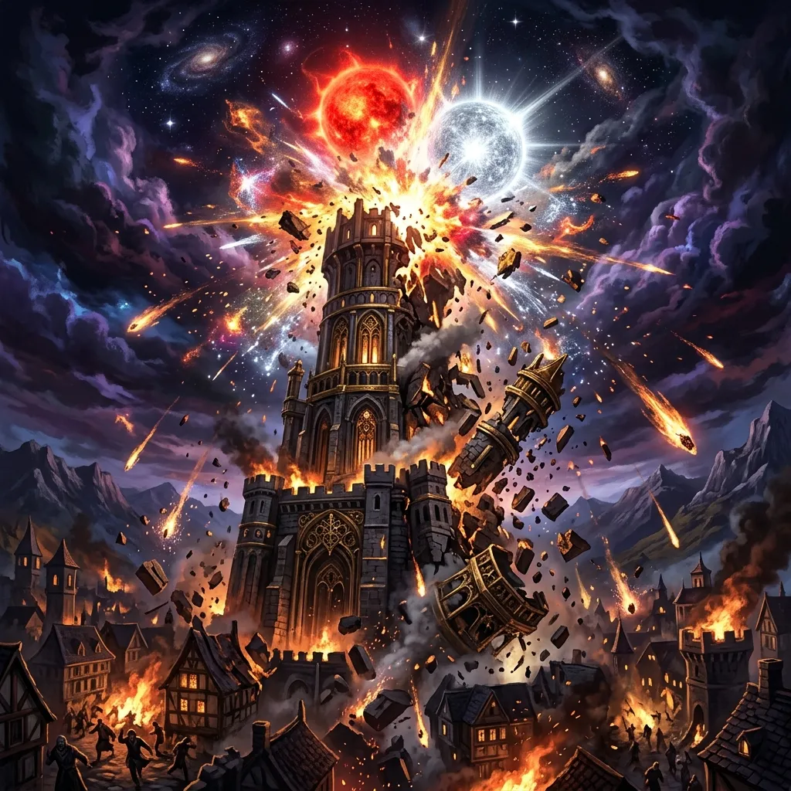
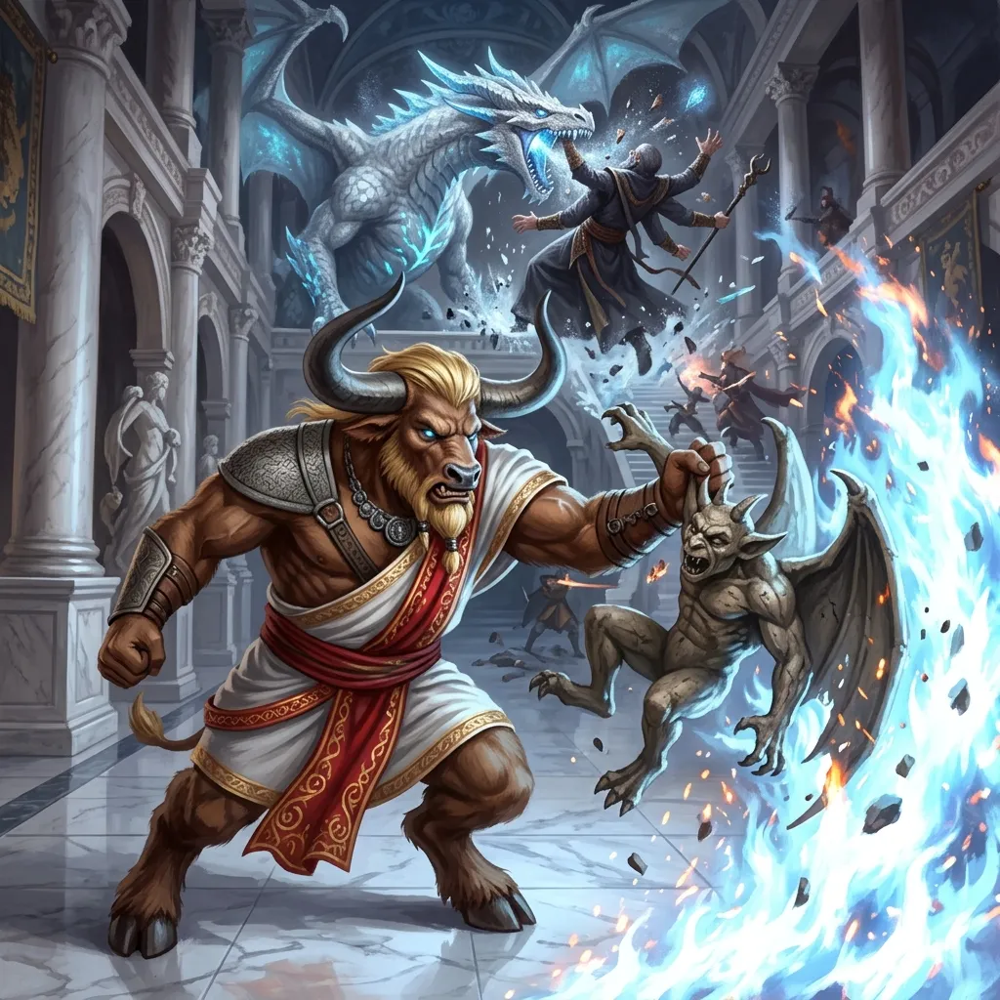
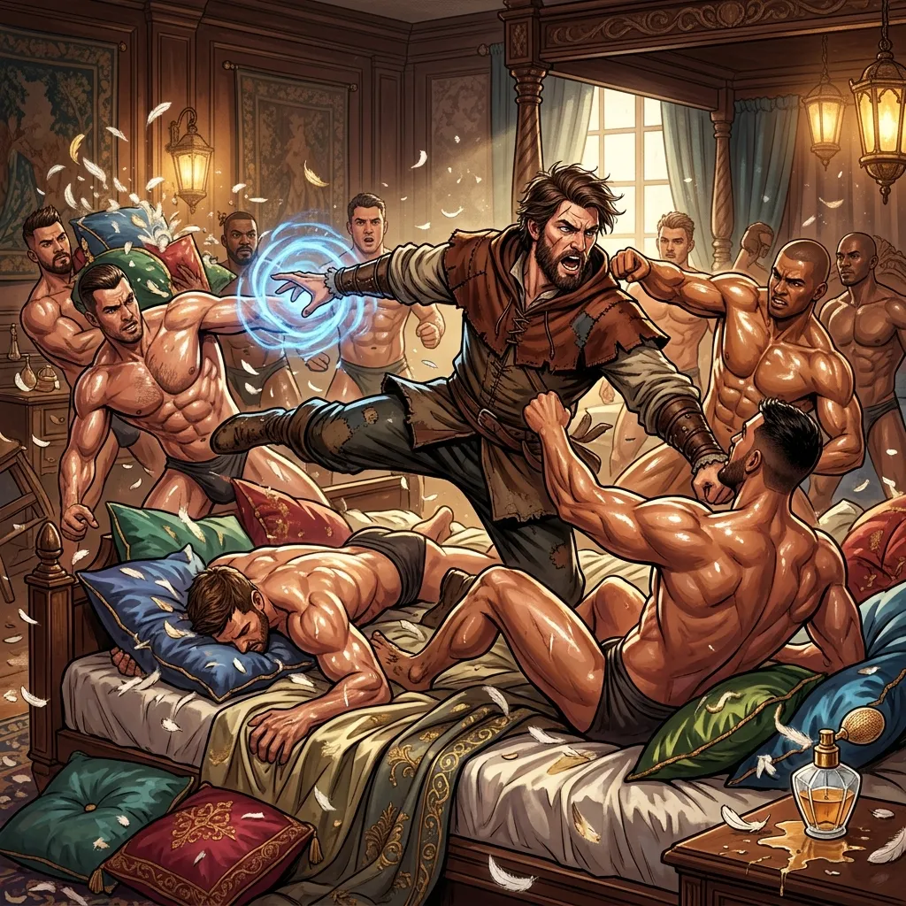
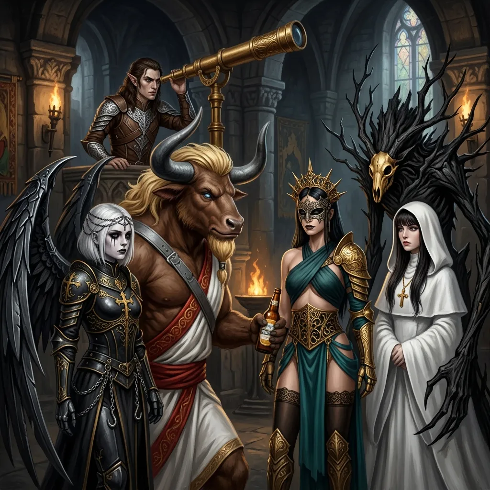
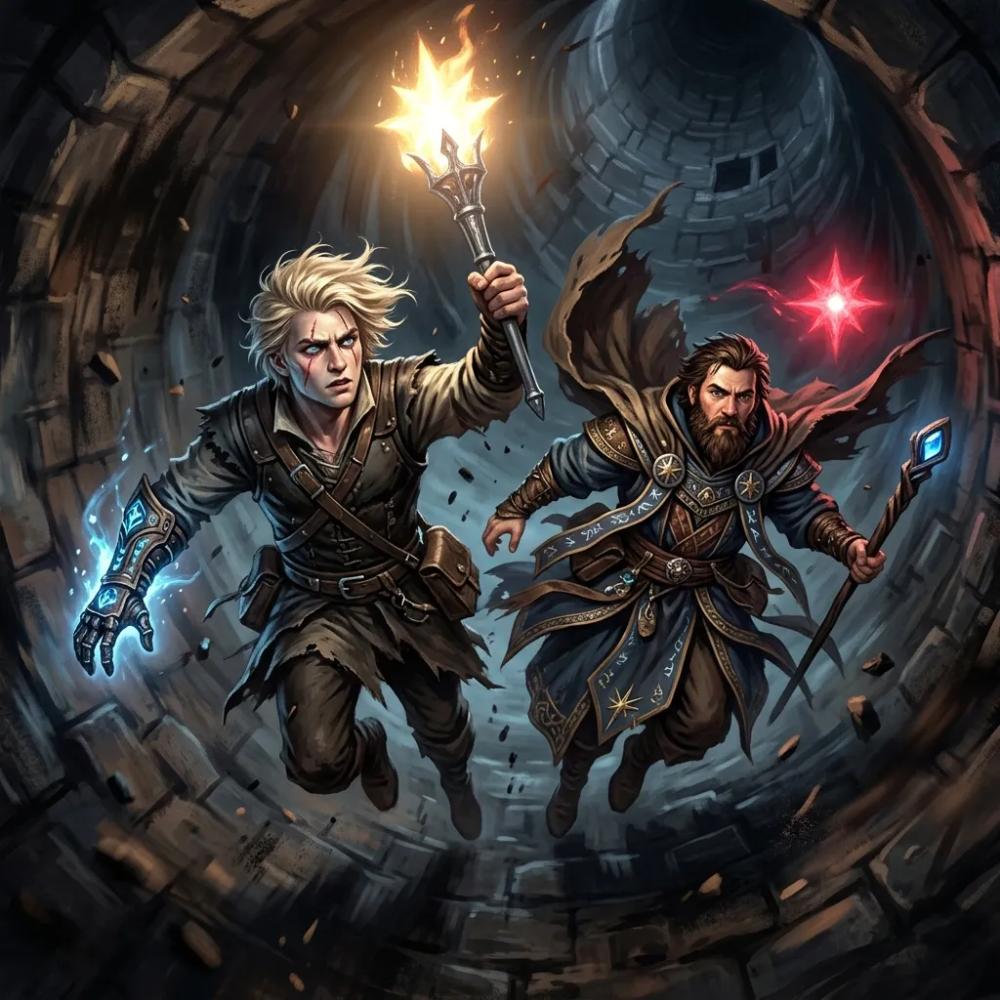
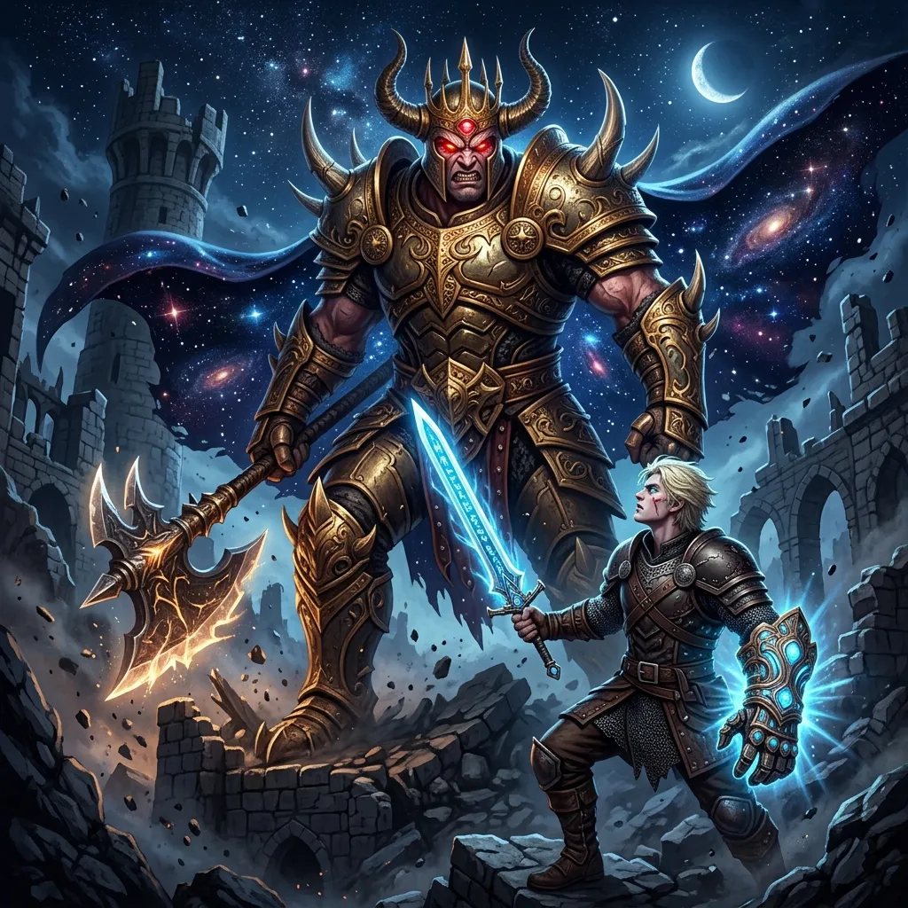
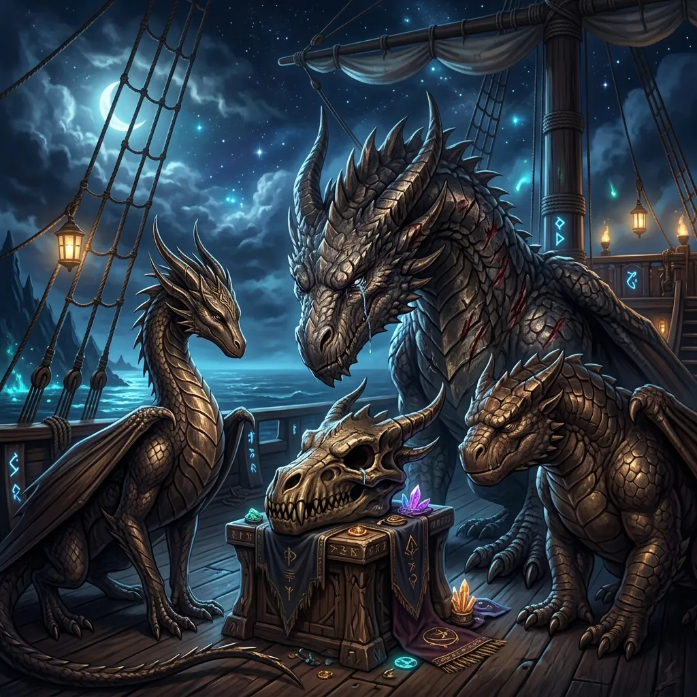
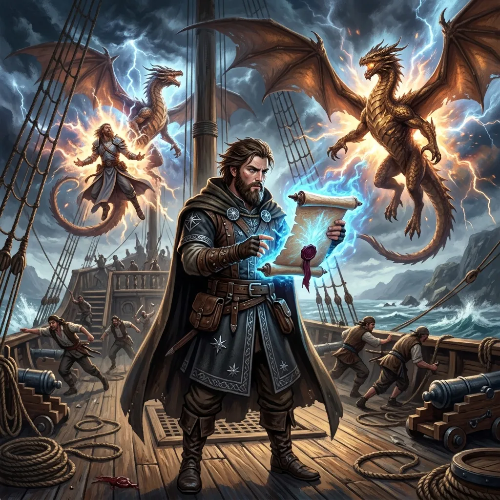

**Data:** 20.04.2026

## Podsumowanie

[Prompt](../assets/sessions/075/075_main_destruction.txt)
### Krwawe Powitanie na Piętrze Szlachty

[Prompt](../assets/sessions/075/075_section1_battle.txt)
Ciężkie, okute brązem drzwi windy rozsunęły się z metalicznym zgrzytem, wpuszczając drużynę na piętro wieży **[[Praxys]]** przeznaczone dla szlachty. Powietrze było tu inne niż poniżej – gęste, przesycone wonią kadzideł, starych pergaminów i tego nieuchwytnego chłodu, jaki towarzyszy zawsze miejscom, gdzie od wieków mieszka pycha. Nie zdążyli jednak nacieszyć się tym osobliwym majestatem, gdyż zza rogu wynurzył się potężny **[[Minotaur z Thylei|minotaur]]** – strażnik, którego bycze oczy błysnęły podejrzliwością na widok przybyszów. **[[Versir]]**, z właściwą sobie śliską elokwencją, próbował odegrać rolę zaufanego gościa pałacu, lecz minotaur nie dał się zwieść ani na chwilę. Mruknął coś pod nosem, uderzył pięścią w wyrzeźbiony w ścianie symbol, a wówczas dwie ogromne **czterorękie statuy gargulców**, dotąd stojące niewzruszenie po obu stronach korytarza, zatrzęsły się i z głuchym trzaskiem odrywającego się kamienia ożyły.

Bitwa rozgorzała niemal natychmiast. **[[Arevon Elorrenthi|Arevon]]**, czerpiąc z pradawnych mocy druida gwiazd, rozpalił pośrodku sali **magiczne ognisko**, którego płomienie tańczyły nienaturalnie zimnym, błękitno-białym blaskiem. **[[Orestes]]**, wykorzystując swoją minotaurzą posturę i siłę doprowadzoną do szału bitewnego, chwycił jednego z gargulców za czteroczłonkowy kadłub i – charcząc z wysiłku – wepchnął go wprost w ten czarodziejski pożar, gdzie kamień zaczął pękać i syczeć. Z północnych drzwi, wśród dymu, wynurzył się **sześcioręki [[Gyganie|Gygan]]**, mag o sześciu ramionach splatających gesty w przerażającym rytmie, ciskając zaklęciami z trzech kierunków jednocześnie. W tym momencie do walki włączyła się **[[Nephele]]** – uwolniona smoczyca, która rozwinęła skrzydła i z lodowatym rykiem zionęła mroźnym oddechem, sypiąc odłamkami lodu, które odłamywały gargulcom kończyny. Gdy ostatnia z kamiennych bestii roztrzaskała się na posadzce, smoczyca obróciła się ku magowi i – z gracją zarazem przerażającą i uwalniającą – po prostu go **pożarła**, kąsając potwora w pół i przełykając go z gygańskim krzykiem grzęznącym gdzieś w jej gardzieli.

### Sypialnia Chalcii i Falanga Czadów

[Prompt](../assets/sessions/075/075_section2_brawl.txt)
Ledwie ucichło echo bitwy, **[[Arevon Elorrenthi|Arevon]]** przyłożył szpiczaste ucho do ściany i wsłuchał się w szepty dobiegające z głębi korytarza. Za ostatnimi drzwiami ukrywało się coś niespodziewanego. Gdy drużyna wtargnęła do środka, stanęła oko w oko z **dziesięcioma nagimi, muskularnymi mężczyznami** o naoliwionych ciałach wypielęgnowanych na modłę posągów, lśniących od olejków. Byli to **Czady** – osobista kolekcja amantów **[[Chalcia|Chalcii]]**, martwej juz córki Bliźniaków, utrzymywana w zbytku jej prywatnej sypialni ku jej własnej uciesze. Scena miała w sobie coś komicznego, ale nie było czasu na żarty – mężczyźni rzucili się na intruzów z dzikością, próbując dusić **[[Orestes|Orestesa]]** i **[[Versir|Versira]]** gołymi rękami, ich napięte bicepsy zaciskając się na szyjach bohaterów. **[[Orion Xul|Orion]]**, który w tych trudnych chwilach nigdy nie tracił zimnej krwi, uniósł swoją niszczycielską broń i jednym zamaszystym cięciem powalił kilku przeciwników naraz, rozpryskując krew po jedwabnych prześcieradłach i perfumowanych poduszkach. Po walce drużyna spenetrowała komnatę, wyciągając z niej pokaźne worki złota, garści klejnotów i – co najcenniejsze – **[[Circlet of Blasting]]**, magiczny diadem iskrzący się zaklętą mocą.

### Spotkanie z Furiami i Sekret Gwiazdy

[Prompt](../assets/sessions/075/075_section3_furies.txt)
Eksplorując kolejne pomieszczenia, bohaterowie natrafili na komnatę zamieszkaną przez trzy siostry: **[[Megara|Megarę]], [[Alecto]] i [[Tyzyfone]]**. [[Furie]], boginie zemsty i strażniczki praw, powitały drużynę z powściągliwym szacunkiem. Wyjaśniły, że są starsze niż **[[Sydon]] i [[Lutheria]]** – zostały stworzone przez samą **[[Thylea|Thyleę]]** na początku świata. **[[Orestes]]**, niepoprawny w swoim zwyczaju, wyjął flaszę piwa i poczęstował boginie. Choć nie miały w zwyczaju pić, przyjęły dar, a uśmiechająca się spod kaptura Alecto skomentowała to słowami "zacny napój". 

Rozmowa z Furiami przyniosła wiele kluczowych odpowiedzi. Siostry przyznały, że obserwują poczynania drużyny i zasugerowały, że **[[Thylea]] potrzebuje leczenia, a bohaterowie mogą być na to lekarstwem**, przypominając im zarazem o konieczności dotrzymania złożonych przysiąg. Potwierdziły również, że **[[Mojry]]** miały bezpośredni udział w pierwszej wielkiej krzywdzie wyrządzonej w [[Thylea|Thylei]] – spisku, który doprowadził do uderzenia w **[[Versi Pierwsza|Versi Pierwszą]]**, matkę [[Versir|Versira]]. Furia [[Megara]] zwróciła się także do **[[Arevon Elorrenthi|Arevon Elorrenthi|Arevona]]**, ostrzegając go przed powrotem do jego rodzinnego świata ([[Eberron|Eberronu]]) i zwracając uwagę, że tamtejsi władcy, gdyby poznali bezpieczną drogę do Thylei, bez skrupułów złupiliby jej bogactwa.

Lecz największym darem sióstr była wiedza o samej wieży. Furie wyszeptały, że lśniąca **gwiazda unosząca się na szczycie [[Praxys]]** to w rzeczywistości **dziecko istot z **[[Morze Astralne|Morza Astralnego]]**, uwięzione tu przez [[Sydon|Sydona]] w charakterze boskiego trofeum. Jego rodzice wciąż go szukają pomiędzy konstelacjami – a drogę do syna wskaże pochodnia zapalona od jego światła i zaniesiona do **czerwonej gwiazdy** po drugiej stronie portalu, gdzie krąży jeden z zatroskanych rodziców. **Arevon**, niepoprawny astronom, nie mógł powstrzymać się przed zajrzeniem w potężny teleskop stojący w komnacie – i na ułamek sekundy zobaczył **[[Eberron]]**, swój rodzinny świat, błyszczący jak drobna perła w dalekim mroku. **Orestes**, człowiek bardziej przyziemny, wycelował teleskop w stronę **browaru swojego wujka**, sprawdzając, czy fortyfikacje nadal stoją. Stały. Wszystko było na swoim miejscu.

### Ewakuacja i Ogień na Szczycie

[Prompt](../assets/sessions/075/075_section4_escape.txt)
Czas naglił. Drużyna przebiła się schodami na parter, potem do doków **[[Praxys]]**, gdzie załadowała na statek wszystkich uwolnionych więźniów – **[[Krok|Kroka]]**, **[[Boi|Boia]]** (obsługę windy), **[[Satyr z Thylei|satyrów-bardów]]**, kucharza **[[Ramsus|Ramsusa]]** – a także **drużynę B** z **[[Pholon|Pholonem]]** i **czaszką [[Balmytria|Balmytrii]]** troskliwie trzymaną w ramionach. Bohaterowie nakazali ekipie odpłynąć **na bezpieczną odległość** i obserwować z horyzontu. Sami zaś pozostali, by dokonać tego, co musiało zostać dokonane.

**[[Versir]]** zbliżył się na szczycie wieży do lewitującej, lśniącej **gwiazdy** – istoty z [[Morze Astralne|Morza Astralnego]], więzionej przez stulecia. Gdy uniósł pochodnię, jej knot zajął się **srebrnym, drgającym światłem gwiezdnym**, buchając gorącym, magicznym płomieniem. W tym samym momencie **[[Felicjan Janus Twardowski|Felicjan]]** użył **[[Heart of the Gale]]**, by rzucić na siebie i [[Versir|Versira]] zaklęcie latania. Obaj wlecieli w dół przez komin na **piętro [[Sydon|Sydona]]**, prosto do komnaty z basenem będącym portalem do [[Morze Astralne|Morza Astralnego]]. Aby upewnić się, że [[Versir]] nie przepadnie w portalu, [[Felicjan Janus Twardowski|Felicjan]] obwiązał go liną, po czym bohater zanurkował do basenu. 

Czerwona gwiazda-rodzic, wyczuwszy światło dziecka z pochodni, zatrzymała się w swoim krążeniu i zaczęła podążać za [[Versir|Versirem]]. [[Felicjan Janus Twardowski|Felicjan]] wyciągnął go na linie z basenu, po czym obaj pospiesznie wrócili lotem na dach wieży. Gdy dotarli na szczyt, **obie gwiazdy zderzyły się ze sobą** w oślepiającym wybuchu. Czerwona gwiazda zapadła się w tę większą, a świat rozbłysł niszczącym, kosmicznym światłem. [[Versir|Wersira]] i [[Felicjan Janus Twardowski|Felicjana]] zalała fala wdzięczności i potężny efekt magii – **Foresight**. Uwolniona istota runęła w dół jak meteoryt, uderzając w **[[Praxys]]** i zmiatając z powierzchni świata wieżę, która przez milenia była dumą [[Sydon|Sydona]].

### Uwolnienie Hergerona i Dar Siły

[Prompt](../assets/sessions/075/075_section5_titan.txt)
Spośród pyłu i rumowiska, na tle zapadającej się wieży, wyłoniła się olbrzymia sylwetka. Był to **[[Hergeron]]**, tytan uwolniony z wielowiekowego więzienia – i, niestety, wciąż zagubiony i wrogo nastawiony. Nie rozpoznawał nikogo i zamierzył się na **[[Versir|Versira]]** z potężną siłą, chwytając go i dotkliwie raniąc. Początkowa perswazja [[Versir|Versira]] w pradawnym języku Sylvan nie przyniosła skutku – oszalały tytan wciąż napierał. Dopiero gdy reszta drużyny ruszyła do ataku, osłabiając potężnego przeciwnika, [[Versir]] zmienił taktykę. Wyciągnął odnowione ostrze, wykrzykując: *"Wujku, to ja, [[Versir]]! Miecz jest skończony! Bliźniaki zapłacą za to, co zrobiły!"*. 

Te argumenty, w połączeniu z osłabieniem Tytana zadanymi mu przez drużynę ciosami, w końcu zadziałały. W oczach [[Hergeron|Hergerona]] pojawiło się zrozumienie. [[Hergeron]] zamrugał, a jego twarz zmieniła się z furii w rozpoznanie. Zdał sobie sprawę z tego, kim jest stojący przed nim półbóg. Przyznał jednak, że jest zbyt słaby, by bezpośrednio pomóc w walce. *"Weź moją siłę i zabij [[Sydon|Sydona]]. To jedyny sposób, żeby osiągnąć pokój w [[Thylea|Thylei]] ponownie"* – przemówił. Następnie przekazał swoją esencję, a **[[Hand of Kentiname|Hand of Kentimane]]** rozbłysła na nowo, przyjmując do swego wnętrza kolejnego tytana. [[Hergeron]] rozpłynął się, dołączając do rodzeństwa ukrytego wewnątrz Rękawicy.

### Powrót na Ultros i Reakcja Bogów

[Prompt](../assets/sessions/075/075_section6_dragons.txt)
Bohaterowie wrócili na pokład **[[Ultros|Ultrosa]]**, wciąż pokryci pyłem [[Praxys]], wciąż lekko oszołomieni skalą tego, co właśnie dokonali. Jednak to reakcja **bogów** na ich widok była najbardziej osobliwa. **[[Volkan]]**, **[[Pythor]]** i **[[Kyrah]]**, gdy zobaczyli **[[Nephele]]** oraz **czaszkę Balmytrii** wyłożoną na pokładzie przez [[Pholon|Pholona]], zamarli. **[[Pythor]]**, zwykle porywczy i krzykliwy, zamilkł na chwilę, a potem wybuchł gniewem tak czystym, że niebo nad statkiem pociemniało – zapowiedział, że **„zerwie mięso z jego kości”** za wszystko, co zrobił. **[[Kyrah]]** odwróciła głowę, a jej oczy zalśniły wilgocią. **[[Volkan]]** dotknął czaszki z delikatnością, której nikt by się po bogu kowalstwa nie spodziewał.

Załoga i drużyna patrzyły zdumione. Dlaczego bogowie reagowali tak osobiście, tak głęboko, na widok czaszki dawno zmarłego smoka i kobiety, która do niedawna była smoczycą? Tylko **[[Felicjan Janus Twardowski|Felicjan]]** uśmiechał się smutno – on wiedział. Od tygodni składał w swoich notatkach elementy tej układanki: **bogowie to smoki**, a **[[Balmytria]] była żoną [[Volkan|Volkana]] i matką [[Kyrah]] oraz [[Pythor|Pythora]]**. To, co dla reszty było dopiero kiełkującą zagadką, dla niego było potwierdzeniem od dawna noszonej prawdy.

### Koniec Przysięgi Pokoju i Prawda Ujawniona

[Prompt](../assets/sessions/075/075_section7_oath.txt)
Następnego dnia, w samo południe, nadszedł moment, na który świat czekał – lub którego się lękał – od pięciu stuleci. **[[Przysięga Pokoju]] wygasała**. Wszyscy zebrali się na pokładzie **Ultrosa**, w milczeniu napiętym jak cięciwa łuku, obserwując, jak słońce osiąga zenit. **[[Volkan]]** poprosił [[Felicjan Janus Twardowski|Felicjana]] o zapieczętowany pojemnik na **[[Zwój Przysięgi Pokoju]]**, wydarty wcześniej ze skarbca [[Sydon|Sydona]] w [[Praxys]]. W środku spoczywał pergamin, który był fundamentem obecnego porządku [[Thylea|Thylei]]. **[[Felicjan Janus Twardowski|Felicjan]]**, na prośbę boga, wyraźnym głosem odczytał słowa zapisane krwią i magią:

> "Niech będzie wiadome wszystkim, i każdemu, kogo to dotyczy, że w minionych latach na Thylei szerzyła się niezgoda i wojna między Bogami a Tytanami.
>
> Na mocy niniejszej Przysięgi Pokoju, nie będzie prowadzona żadna wojna między Nowymi Bogami a Empirejskimi Tytanami. Bogowie i Tytani nie będą dopuszczać się przemocy ani wywoływać wojen przeciwko drugiej stronie, ani tym, którzy przysięgli im służyć, ani tym, których chronią, z wyjątkiem obrony własnej, swoich wyznawców lub swoich domostw. Tytani nie będą mścić się za wojnę na śmiertelnikach z Thylei.
>
> Na mocy tej Przysięgi, Tytani zachowają swoje prawo do wyznawców. Nowi Bogowie będą utrzymywać i otaczać czcią świątynie Szacownych Tytanów oraz zezwalać na składanie ofiar, tak jak to zawsze miało miejsce.
>
> Na mocy tej Przysięgi, poniższa część zostanie utrzymana w tajemnicy, a tajemnica ta nałożona będzie na wszystkich, którzy ją znają: smocze pochodzenie Nowych Bogów oraz źródło ich boskich domen pozostaną w ukryciu. Wraz z wygaśnięciem Przysięgi, Nowi Bogowie zwrócą portfolio, które skradli.
>
> Niech ta Przysięga Pokoju zostanie złożona pomiędzy Szacownymi Empirejskimi Tytanami a Nowymi Bogami, i niech będzie utrzymana we krwi i honorze przez 500 lat i jeden dzień.
>
> Przysięgę tę złożono pod auspicjami Furii, w cieniu Złotego Serca, w obecności Wyroczni oraz śmiertelnej duszy jako świadków."
>
> **Sygnatariusze:**
> Sydon, Władca Burz | Lutheria, Pani Snów | Vallus, Bogini Mądrości
> Volkan, Bóg Kuźni | Pythor, Bóg Bitwy | Kyrah, Bogini Muzyki

Słowa te, wypowiedziane na głos przez śmiertelnika, zadziałały jak ostateczny klucz w zamku przeznaczenia. W tym samym ułamku sekundy trójka bogów – **[[Volkan]]**, **[[Pythor]]** i **[[Kyrah]]** – zwinęła się z bólu, który wydawał się rozdzierać samą tkaninę ich istnienia. Na oczach przerażonej załogi ich ludzkie formy zaczęły pękać i rozszerzać się, aż w końcu, wśród huku pękającego powietrza, przeobrazili się w swoją prawdziwą, majestatyczną postać: trzy potężne, lśniące **brązowe smoki**. **Volkan** ujawnił swoje prawdziwe imię: **[[Sybolkorax]]**, smok [[Rizon Phobas]], pogrążony ongiś w rozpaczy po śmierci [[Balmytria|Balmytrii]]. **Pythor** stał się **[[Raspytrion|Raspytrionem]]**, zaprzysiężonym niegdyś **[[Adonis Neurdagon|Adonisowi Neurdagonowi]]**. **Kyrah** przybrała postać **[[Arkyrania|Arkyrani]]**, dawnej smoczycy **[[Estor Arkelander|Estora Arkelandera]]** – smoczycy, która opuściła swego Smoczego Lorda po jego krwawych rzeziach [[Gyganie|Gyganów]]. [[Felicjan Janus Twardowski|Felicjan]], patrząc na tę ostatnią, pokiwał głową – jego obsesyjne dociekania zostały potwierdzone w każdym detalu.

Smoki, łzawymi głosami zmieszanymi z grzmotem, opowiedziały pełną historię zawartą w legendach jako **[[09 Gra Bogów|Gra Bogów]]**. **[[Balmytria]]**, wiedząc, że nie pokona tytanów siłą, wyzwała ich na **Królewską Grę** na **[[Wyspa Złotego Serca|wyspie Złotego Serca]]**. Zagrała z nimi siedem partii, pierwszą wygrywając, co doprowadziło Sydona do szału i podwojenia stawki. Balmytria wygrała kolejnych pięć partii niezłomną cierpliwością, zmuszając rozwścieczonego Sydona do sięgnięcia po pomoc Lutherii w ostatniej, siódmej partii. Przegrywając ją **celowo** – w tej ostatniej, gdy [[Sydon]] i [[Lutheria]] wlali w kości swoją boską moc, by zapewnić sobie zwycięstwo, **[[Balmytria]] wbiła sztylet we własną pierś**, oddając w stawce własne życie. Jej krew rozlała się na planszę i związała z ich boskimi domenami ukrytymi w kościach, wykradając potęgę Tytanów i przekazując ją swojemu mężowi i dzieciom ([[Vallus]], [[Pythor|Pythorowi]], [[Arezja/Narsus|Narsusowi]] i [[Kyrah]]). Tak powstała Piątka. Teraz, wraz z końcem Przysięgi, **boskie domeny wróciły do bliźniaczych tytanów** – **[[Sydon]] i [[Lutheria]]** stali się potężniejsi niż kiedykolwiek, a nadchodząca **[[Bitwa o Mytros]]** może stać się najkrwawszym starciem w historii kontynentu.

Wiatr pchnął statek w stronę **[[Mytros|stolicy]]**, gdzie czekała ich konfrontacja z losem. W tej ciszy, pod gwiazdami [[Thylea|Thylei]], każdy z nich poczuł w swoim wnętrzu znajomy, gorący pulsujący impuls – **awans na trzynasty poziom doświadczenia**. Żadna ilość mocy nie wydawała się jednak wystarczająca na to, co miało nadejść.

## Kluczowe wydarzenia / decyzje

* Krwawe starcie z kamiennymi gargulcami oraz faworytami [[Chalcia|Chalcii]] w Komnacie Rozkoszy.
* Audiencja u Furii ([[Megara|Megary]], [[Alecto]] i [[Tyzyfone]]), które wyjawiły sekrety dotyczące zdrady Mojr i przekazały ostrzeżenia dla [[Arevon Elorrenthi|Arevona]] dotyczące jego ojczystego świata.
* Rytualne uwolnienie uwięzionej gwiazdy na szczycie wieży, co doprowadziło do widowiskowej destrukcji [[Praxys]].
* Ostatnie spotkanie [[Versir|Versira]] z wujem [[Hergeron|Hergeronem]] i przejęcie przez bohatera tytanicznej esencji siły.
* Oficjalne wygaśnięcie Przysięgi Pokoju, skutkujące odzyskaniem pełnej mocy przez [[Sydon|Sydona]] i [[Lutheria|Lutherię]].
* Ujawnienie prawdziwej tożsamości Pięciorga Bogów jako smoków (m.in. [[Sybolkorax]], [[Arkyrania|Arkyrani]]) i poznanie pełnej historii o krwawej ofierze [[Balmytria|Balmytrii]] podczas Królewskiej Gry ([[09 Gra Bogów]]).
* Podjęcie decyzji o natychmiastowej żegludze do [[Mytros]] w celu dołączenia do ostatecznej wojny.

## Pamiętne Cytaty

* Orestes: "A piłyście kiedyś piwo?"
* Megara: "Zostałyśmy stworzone razem z tym światem przez boginię matkę, samą Thyleę. Jesteśmy starsze niż Bliźniacy."
* Dungeon Master: "Thylea potrzebuje leczenia, a wy możecie być lekarstwem, ale pamiętajcie o złożonych przez was przysięgach."
* Versir: "Wiem czym jesteś, pozwól, że odpalę to światło, które oświetli drogę Twoim rodzicom."
* Versir: "Wujku, to ja, [[Versir]]! Twój miecz jest skończony! Bliźniaki zapłacą za to, co zrobiły! Usłysz mnie!"
* Hergeron: "Weź moją siłę i zabij [[Sydon|Sydona]]. To jedyny sposób, żeby osiągnąć pokój w [[Thylea|Thylei]] ponownie."
* Pythor: "Zerwę mięso z jego kości. Za to wszystko, co zrobił."
* Felicjan: "Smocze pochodzenie nowych bogów oraz źródło ich boskich domen pozostaną w ukryciu."
* Volkan: "Zdajemy sobie sprawę, że byliśmy beznadziejnymi bogami."
* Orion: "Zaczynam chuchać, ale nic nie wylatuje."

## Postacie Niezależne (NPC)

* [[Nephele]] (smoczy klon pomagający drużynie)
* [[Megara]], [[Alecto]] i [[Tyzyfone]] ([[Furie]], strażniczki praw)
* [[Hergeron]] (Tytan Siły, wuj [[Versir|Versira]])
* [[Volkan]] (Bóg Kowali, ujawniony jako smok [[Sybolkorax]])
* [[Pythor]] (Bóg Bitwy, ujawniony jako smok [[Raspytrion]])
* [[Kyrah]] (Bogini Muzyki, ujawniona jako smok [[Arkyrania|Arkyrani]])
* [[Balmytria]] (starożytna smoczyca)
* [[Ramsus]] (uratowany kucharz)
* [[Krok]] (uwolniony więzień)
* [[Boi]] (obsługa windy)
* [[Pholon]]
* [[Chalcia]]
* [[Sydon]] i [[Lutheria]]
* [[Satyr z Thylei|Satyrowie-bardowie]]

## Lokacje

* [[Praxys]] (wieża [[Sydon|Sydona]])
* Statek [[Ultros]]
* [[Morze Astralne]]
* [[Eberron]]
* [[Wyspa Złotego Serca]]
* [[Mytros]]

## Przedmioty

* [[Circlet of Blasting|Magiczny diadem]] z sypialni [[Chalcia|Chalcii]]
* Czaszka [[Balmytria|Balmytrii]]
* [[Zwój Przysięgi Pokoju]]
* [[Hand of Kentiname|Hand of Kentimane]]
* [[Heart of the Gale]]
