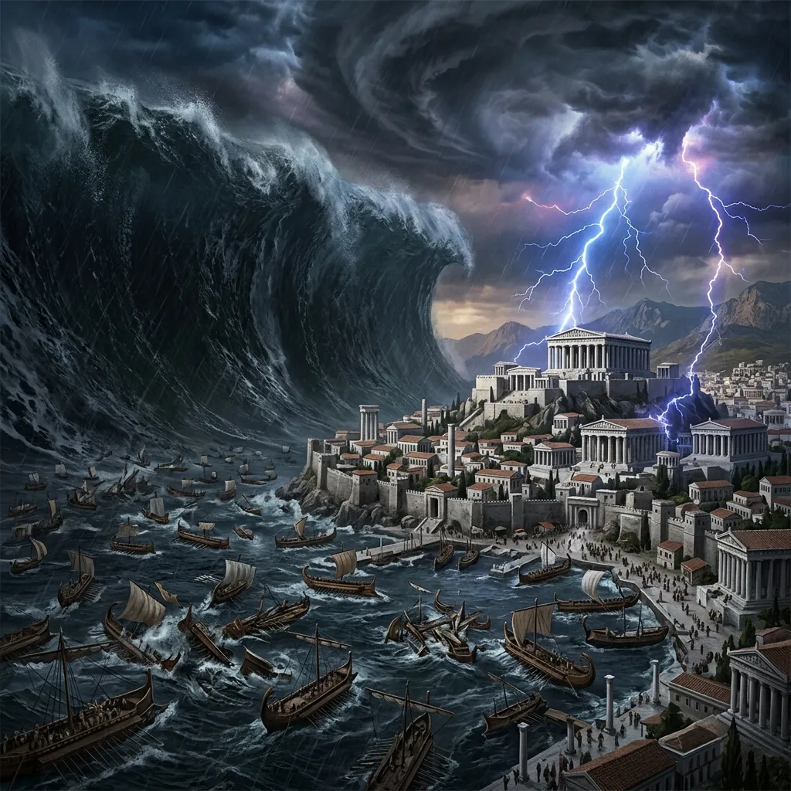
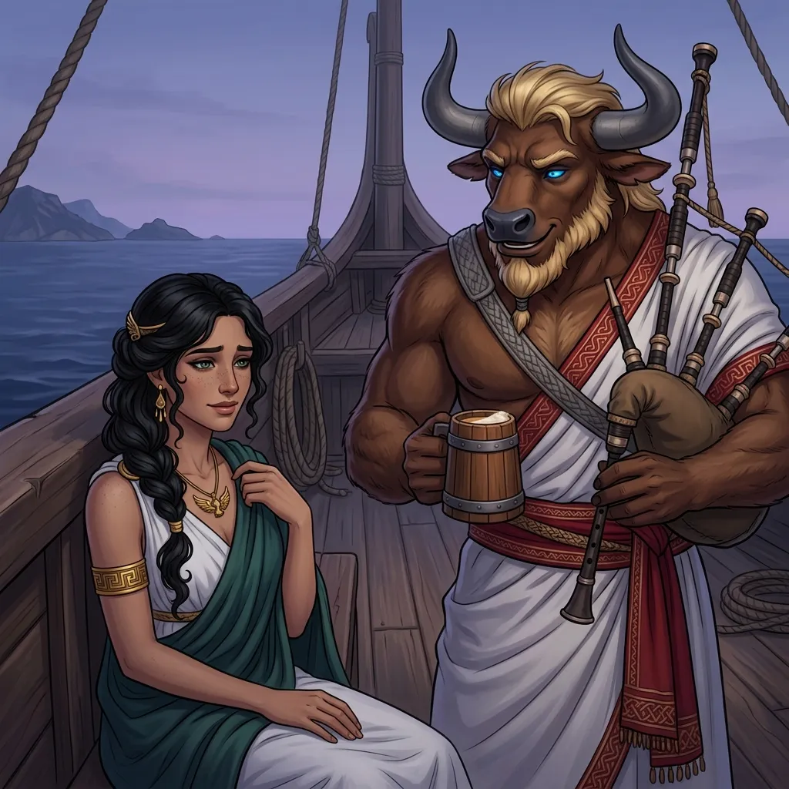
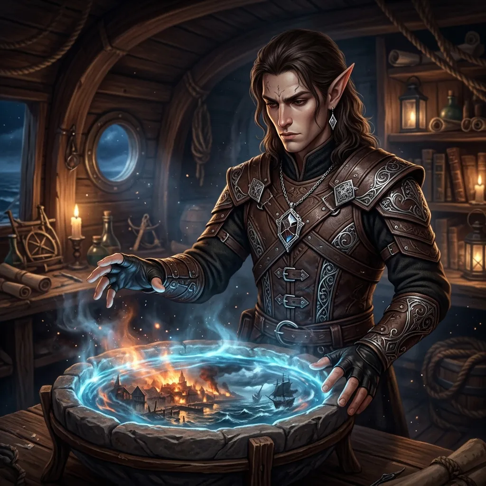
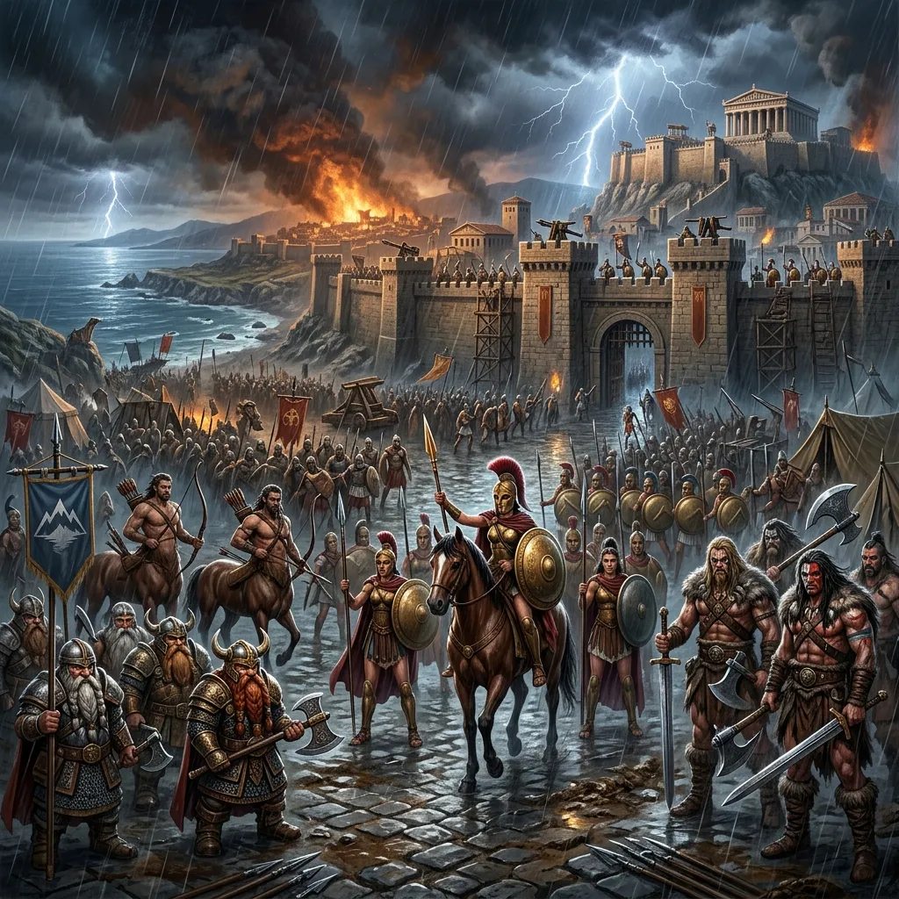
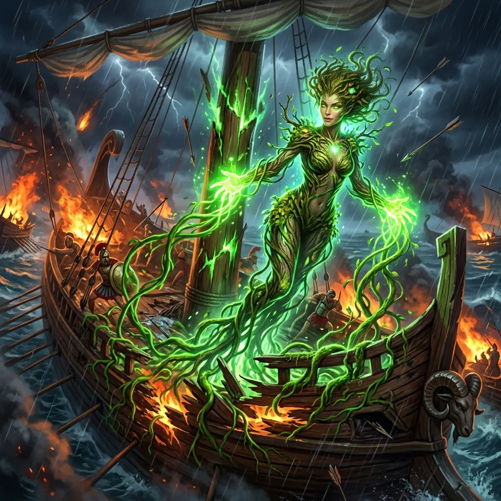
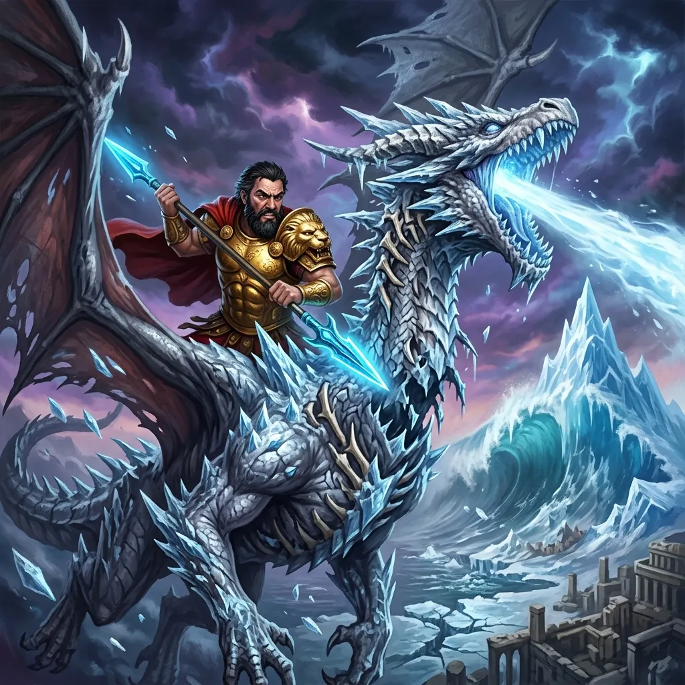
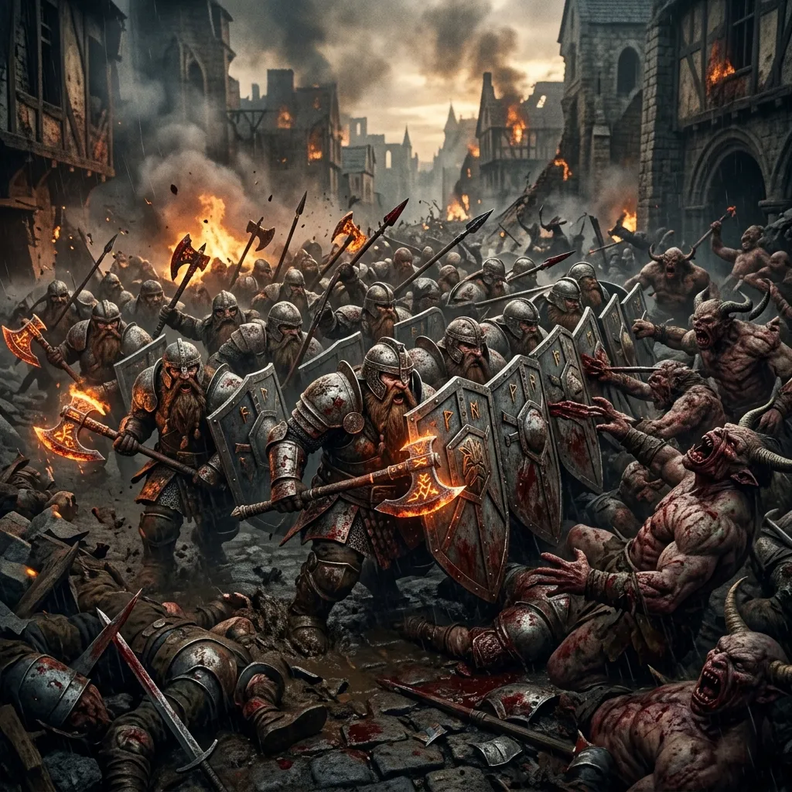
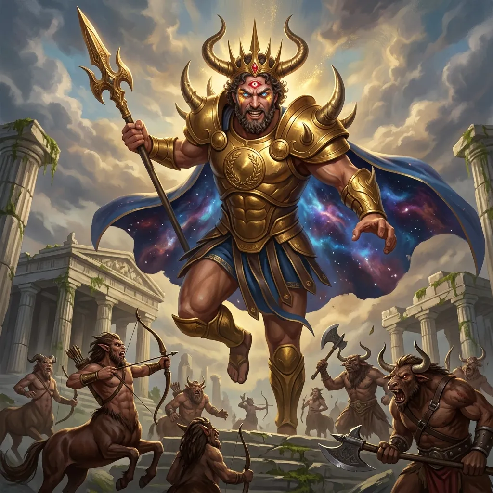
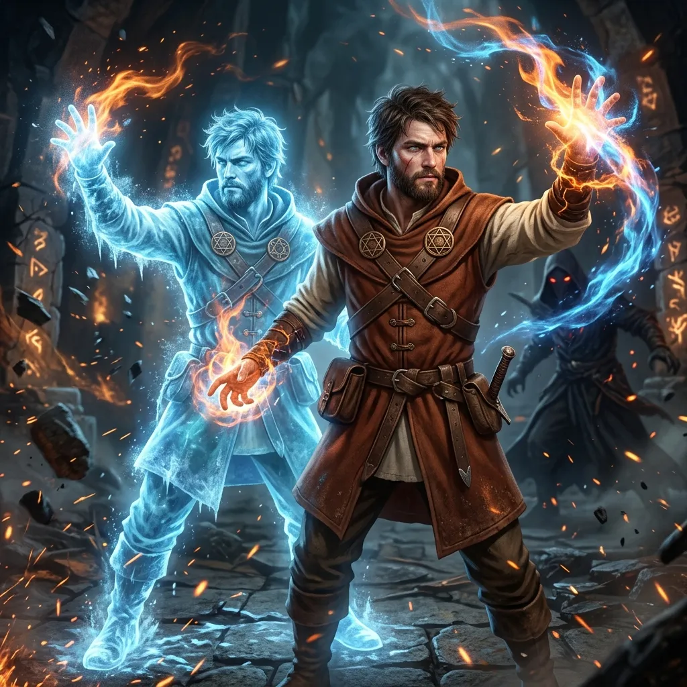

**Data:** 04.05.2026

## Podsumowanie

[Prompt](../assets/sessions/076/076_tsunami_mytros.txt)

### Ostatnie Chwile Spokoju na Pokładzie Ultrosa

[Prompt](../assets/sessions/076/076_kyrah_orestes.txt)

Zanim [[Ultros]] wpłynął w wody zatoki [[Mytros]], drużyna miała jeszcze chwilę, by zebrać myśli. **[[Versir]]**, dumny ze swojej nowej dłoni przywróconej dzięki magii **[[Arevon Elorrenthi|Arevona]]**, postanowił zbadać tajemniczą rękawicę zdobytą u [[Sydon|Sydona]]. Założył ją z ostrożnością – pod *Identify* wszystko wskazywało, że artefakt jest sprawny, ale w praktyce, gdy próbował go aktywować, magia rękawicy okazywała się jakby uśpiona, zepsuta. Szybko ją zdjął, odkładając zagadkę na później. **[[Felicjan Janus Twardowski|Felicjan]]** korzystał z tych ostatnich godzin, by ślęczeć nad księgami i finalizować swoje zaklęcia – mający świadomość, że w nadchodzącej bitwie liczyć się będzie każda iskra magicznej mocy.

W kącie pokładu, w postaci humanoidalnej, lecz pochmurna i zamyślona, siedziała **[[Kyrah]]**. **[[Orestes]]**, dzierżąc swoje wierne dudy i kufel piwa, podszedł do niej z prostodusznym minotaurzym uśmiechem. Smoczyca uśmiechnęła się słabo, lecz po chwili wyznała brzemię, które ją gniecie – wciąż widzi w sobie potwora, który przed wiekami u boku [[Sydon|Sydona]] i [[Estor Arkelander|Estora]] wypalał oddechem dziesiątki gyganów i centaurów. To **[[Versir]]** wygłosił wówczas najmocniejszą kwestię tej sceny, porównując Kyrę z jej bratem **[[Narsus|Narsusem]]**: „Może on jest największym głupcem, ale to ty popełniłaś największe błędy. Różnica między wami jest taka, że ty próbujesz się na nich czegoś nauczyć, a ten głupiec patrzy w lustro i widzi swoją piękną mordę i się uśmiecha." [[Versir]] zaoferował nawet miecz – ostatnią pamiątkę po [[Estor Arkelander|Estorze]] – do zniszczenia, gdyby tego pragnęła. Wzruszona [[Kyrah|Kyra]] podziękowała, choć przyznała, że odkupienia jeszcze nie znalazła.

### Wizje Płonącego Miasta

[Prompt](../assets/sessions/076/076_arevon_scrying.txt)

**[[Arevon Elorrenthi|Arevon]]**, korzystając ze swej druidzkiej mocy, rzucił serię zaklęć *Scrying*. Pierwszy cel – **[[Hergeron]]** – niestety nie udało się go szpiegować ledwo. Drugim, na którym nie istniał żaden rzut obronny, były same [[Port w Mytros|Doki Mytros]]. Obraz, który ujrzał elf, mroził krew w żyłach: zrujnowane nadbrzeża, biegający w panice ludzie i nieludzie, toczące się na każdym rogu walki, a u wejścia do portu morska barykada ze statków [[Zakon Sydona]], nad którą krążyły smoki z jeźdźcami na grzbietach. Trzeci *Scrying*, na **[[Yala|Yali]]**, ukazał córkę [[Sydon|Sydona]] siedzącą samotnie na klifie, wpatrującą się w odległe [[Mytros]] z zadumą. [[Arevon Elorrenthi|Arevon]] przekazał wszystkie informacje drużynie. By przyspieszyć rejs, drużyna przekonała smoki, by zaprzęgły się do lin [[Ultros|Ultrosa]] – widok smoków ciągnących okręt jak woły wóz wywołał wśród graczy salwy śmiechu („Kurczaki ledwo nam się podbieniły, bogowie na smoki i już praca niewolnicza!").

### Przybycie do Krwawiącej Stolicy

[Prompt](../assets/sessions/076/076_defenders_mytros.txt)

Im bliżej miasta, tym pogoda stawała się bardziej apokaliptyczna. Tam, gdzie powinno błyszczeć [[Mytros|Miasto Świtu]], kłębił się gęsty, czarny dym, padał lodowaty deszcz, a popiół zgrzytał w zębach. Nad [[Mytros]] wisiała nienaturalna, rycząca burza. Z hukiem na pokład [[Ultros|Ultrosa]] pikował brązowy smok, który po wylądowaniu zmienił się w **[[Vallus]]** – niegdyś Boginię Mądrości, teraz uosobienie wojennej desperacji. Jej raport był druzgocący: tsunami uderzyło w dolne dzielnice i Doki, lecz dzięki ostrzeżeniu drużyny udało się ewakuować większość cywilów (mimo początkowego oporu [[Acastus|Akastusa]]). W obronie miasta walczą zjednoczone siły: Amazonki **[[Darien]]** i **[[Hippolyta|Hippolyty]]**, Centaury z [[Mithralowa Kuźnia|Kopalni Mithralu]] pod wodzą **[[Hukar|Hukara]]**, Krasnoludy z [[Estoria|Estorii]] pod **[[Grimhilda|Grimhildą]]**, Barbarzyńcy z [[Wyspa Indygo]], Jaszczuroludzie z [[Wyspa Ognia]] oraz magowie [[Akademia Mytros|Akademii]]. Armia [[Arezja|Arezji]] powstrzymuje na północnym wschodzie centaury, które inaczej dołączyłyby do [[Sydon|Sydona]]. **[[Acastus]]** w końcu przejrzał na oczy – gdy pioruny zaczęły uderzać w jego pałac – i rzucił do walki **[[Egida Mytros|Egidę Mytros]]** oraz osobiście dosiada srebrnego smoka **[[Icarus|Icarusa]]**.

### Cud Delphi i Przebicie Blokady

[Prompt](../assets/sessions/076/076_delphia_magic.txt)

Drużyna, niewiele myśląc, wzięła rozbieg. **[[Arevon Elorrenthi|Arevon]]** rzucił *Gust of Wind* prosto w żagle, **[[Versir]]** zacisnął zęby, a **[[Orestes]]** osobiście dołączył do wiosłujących pod pokładem. Potężny głaz z trebusza wroga uderzył w burtę [[Ultros|Ultrosa]] z trzaskiem przypominającym krzyk rannego zwierzęcia – statek przechylił się niebezpiecznie. Wtedy z drewna głównego masztu wyłoniła się eteryczna postać **[[Delphia|Delphi]]**, driady zaklętej w maszcie. Z każdego pęknięcia wyrosły grube, pulsujące pnącza, zaciągając rozbite deski, uszczelniając dziury magicznym mchem i korą. [[Ultros]] wyprostował się jak ożywiony tytan i z dziobem-taranem roztrzaskał galeon [[Zakon Sydona]] na pół, otwierając drogę do zrujnowanego portu.

### Walka Acastusa i Szaleństwo Icarusa

[Prompt](../assets/sessions/076/076_icarus_mutated.txt)

W centrum portu doszło do sceny, która na zawsze odmieni Thyleę. Z dna zatoki wystrzelił gigantyczny, wirujący lej wody, w którym manifestował się **[[Sydon]]** – gargantuiczny, z brodą ze spienionych fal i glewią oplecioną piorunami. [[Acastus]] na [[Icarus|Icarusie]] krzyknął coś o złamanej umowie, lecz Tytan wyszydził go: „Z narzędziem nie zawiera się układów, śmiertelniku. Narzędzia się używa, a potem odrzuca, gdy zardzewieje." [[Sydon]] wyciągnął glewię, a na horyzoncie zaczęła rosnąć czarna ściana wody. W desperacji **[[Acastus]]** sięgnął za plecy i wyciągnął dziwną, pulsującą sinym światłem włócznię – i wbił ją w szyję swojego wiernego srebrnego smoka. Drużyna z grozą obserwowała, jak [[Icarus]] mutuje: kości trzaskają, mięśnie rwą się i grubieją, srebrne łuski pokrywają się ostrymi wypustkami. Zmutowany smok wypuścił strugę zimna, zamrażając tsunami w lodową górę. Triumf trwał chwilę – obca magia pożarła umysł [[Icarus|Icarusa]], smok oszalał, zrzucił [[Acastus|Acastusa]] (uratowanego w locie przez **[[Apasia|Apasię]]** na miedzianym smoku) i zaczął miotać się nad miastem, plując bezładnie lodem na cywilów i żołnierzy obu stron. Bogowie-smoki, poprosili drużynę, by zostawiła [[Icarus|Icarusa]] im – [[Mytros]] potrzebuje bohaterów na ulicach.

### Bitwa o Mytros

[Prompt](../assets/sessions/076/076_dwarf_charge.txt)

Rozpoczęła się **Bitwa o Mytros** – wieloetapowy system masowej wojny. Drużyna szybko poczuła ciężar mikromenedżmentu: tagi dowódców, sektory, statystyki Vitality/Morale/Wit, fazy Maneuver/Charge/Clash, miracle pointy, recovery checki. Po udanym **rekonesansie** (rzut 17, dający informacje o ruchach wszystkich legionów wroga) drużyna rozłożyła swoje siły. **[[Versir]]** lobbował za przeniesieniem **[[Corinna|Coriny]]** na pozycję dowódcy [[Egida Mytros|Egidy]], **[[Orestes]]** rzucił swojego herosa do wsparcia Amazonek, a **[[Felicjan Janus Twardowski|Felicjan]]** poszedł z [[Centurioni z Mytros|Centurionami]]. Pierwsze starcia poszły mieszanie – Krasnoludy z [[Estoria|Estorii]] zmiażdżyły Gyganów dzięki przewadze w fazach manewru i szarży. Amazonki obroniły się przy Dokach. Niestety, w starciu [[Egida Mytros|Egidy Mytros]] przeciwko automatonom [[Sydon|Sydona]] przyszedł cios prosto w serce drużyny – **[[Steros]]**, dowódca, poległ w boju. Drużyna przesunęła rezerwy do dziur w linii i odebrała splądrowane dzielnice, zachowując kruchą równowagę.

### Świątynia Pięciu i Iskry Półboga

[Prompt](../assets/sessions/076/076_hergeron_sparks.txt)

W trakcie walk drużynie wezwano pilną pomoc – **[[Świątynia Pięciu|świątynia pięciu]]** padła ofiarą ataku **[[Hergeron|Hergerona]]**, empyrejskiego syna [[Sydon|Sydona]]. Drużyna rzuciła się przez zrujnowane ulice, by ujrzeć makabryczny widok: posągi bogów leżały powalone, schody świątyni pokrywały zmasakrowane ciała akolitów, a [[Hergeron]] lewitował nad dachem, z oczu bijącymi oślepiającym, złotym światłem niestabilnych iskier. Towarzyszył mu odział złożony z centaurów, minotaurów i gyganów. [[Hergeron]] powitał drużynę pogardliwym monologiem: „Bohaterowie Przepowiedni... Szczury, które kąsają kostki prawdziwych władców! Zabiliście większość z mojego rodzeństwa. Dobrze, dobrze nie żyją. Więcej potęgi i boskości dla mnie!"

### Pojedynek z Synem Burzy

[Prompt](../assets/sessions/076/076_felicjan_simulacrum.txt)

Walka okazała się brutalna. **[[Versir]]** od razu wykorzystał zdolność rękawicy: *Dominate Monster*, próbując przejąć kontrolę nad jednym z centaurów, jednak bestia oparła się magii. **[[Felicjan Janus Twardowski|Felicjan]]** zagrał największą kartę w rękawie – wyjawił stworzone jeszcze na statku **Simulacrum**, wprowadzając do bitwy swojego klona, co od razu wywołało zachwyt drużyny i przerażenie DM-a („WTF, simulacrum jest OP!”). 

**[[Hergeron]]** nie pozostał dłużny – rzucił śmiercionośne **Steel Wind Strike**, teleportując się między wszystkimi członkami drużyny i tnąc z zawrotną prędkością. W odpowiedzi **[[Orestes]]** rozwinął skrzydła, wzbił się w powietrze i wpadł na lewitującego półboga z toporem, zadając brutalny **krytyczny cios** (dzięki połączeniu Rage, Reckless Attack i Great Weapon Master), zdejmując z niego ponad 50 punktów wytrzymałości jednym trafieniem. **[[Orion Xul|Orion]]** w międzyczasie zmasakrował wrogiego centaura.

Sytuację zmasowanego ataku [[Hergeron|Hergerona]] uratowało epickie kombo leczące: **[[Versir]]** rzucił **Beacon of Hope**, wymuszając maksymalne leczenie dla drużyny. Chwilę później **[[Arevon Elorrenthi|Arevon]]** rzucił potężne obszarowe zaklęcie leczące, przywracając każdemu w zasięgu aury po blisko 50 Punktów Wytrzymałości. Pod koniec rundy **[[Felicjan Janus Twardowski|Felicjan]]** spróbował osłabić półboga zaklęciem *Tasha's Mind Whip*, lecz Syn Burzy bez problemu zdał rzut obronny.

Sesja zakończyła się w środku tej epickiej walki. [[Hergeron]] wciąż stał, ale był już silnie poturbowany, a jego eskorta w większości wybita. Nad miastem przelatywały smoki, polujące na oszalałego [[Icarus|Icarusa]].

## Kluczowe wydarzenia / decyzje

* **Rozmowa z [[Kyrah|Kyrą]] na pokładzie [[Ultros|Ultrosa]]** – [[Versir]] wyznał smoczycy, że jej brat [[Narsus]] jest większym głupcem, ale to ona popełniła większe błędy; różnica polega na tym, że ona próbuje się na nich uczyć. Zaoferował też zniszczenie miecza Estora.
* **Trzy *Scrying* [[Arevon Elorrenthi|Arevona]]** – nieudane na [[Hergeron|Hergeronie]], na Dokach [[Mytros]] (obraz chaosu i blokady morskiej) oraz na [[Yala|Yali]] (siedzi samotnie na klifie patrząc na [[Mytros]]).
* **Smoki-bogowie ciągną [[Ultros|Ultrosa]] na linach**, by przyspieszyć rejs do [[Mytros]].
* **Cud [[Delphia|Delphi]]** – driada [[Ultros|Ultrosa]] naprawia statek pnączami po trafieniu trebusza, a okręt-taran przebija blokadę [[Zakon Sydona]].
* **[[Acastus|Akastus]] przebija swoją zdradziecką włócznią szyję [[Icarus|Icarusa]]**, mutując smoka, który zamraża tsunami [[Sydon|Sydona]] w lodową górę nad miastem.
* **[[Apasia]] na miedzianym smoku ratuje spadającego [[Acastus|Akastusa]]** w ostatniej chwili.
* **Smoki-bogowie podejmują walkę z oszalałym [[Icarus|Icarusem]]**, prosząc drużynę o skupienie się na obronie ulic.
* **Pierwsza runda Bitwy o [[Mytros]]**: zwycięstwa Krasnoludów z [[Estoria|Estorii]], Amazonek przy Dokach; przegrane Magów z [[Akademia Mytros|Akademii]] i [[Centurioni z Mytros|Mytros Centurions]]; tragiczna **śmierć [[Steros|Sterosa]]**
* **[[Felicjan Janus Twardowski|Felicjan]] ujawnia stworzone wcześniej Simulacrum**, wprowadzając do walki klona jako drugiego maga w drużynie.
* **[[Hergeron]] rzuca Steel Wind Strike** na całą drużynę, zadając potężne obrażenia m.in. [[Orion Xul|Orionowi]] i klonowi [[Felicjan Janus Twardowski|Felicjana]].
* **[[Orestes]] wznosi się w powietrze i zadaje [[Hergeron|Hergeronowi]] krytyczny cios** z połączeniem Rage, Reckless Attack i Great Weapon Master.
* **Epickie kombo leczące**: [[Versir]] rzuca *Beacon of Hope* wymuszając maksymalne leczenie, co [[Arevon Elorrenthi|Arevon]] od razu wykorzystuje potężnym zaklęciem leczącym, przywracając każdemu około 50 HP.

## Pamiętne Cytaty

* **[[Versir]] do [[Kyrah|Kyry]]:** *„Może on jest największym głupcem, ale to ty popełniłeś największe błędy. Różnica między wami jest taka, że ty się próbujesz na swoich błędach czegoś nauczyć, a ten głupiec patrzy w lustro i widzi swoją piękną mordę i się uśmiecha."*
* **[[Sydon]] do [[Acastus|Akastusa]]:** *„Z narzędziem nie zawiera się układów, śmiertelniku. Narzędzia się używa, a potem odrzuca, gdy zardzewieje. Byłeś politycznym pionkiem."*
* **[[Acastus|Akastus]] po zamrożeniu fali:** *„Wracaj! Zmierz się ze mną!"*
* **[[Hergeron]] do bohaterów:** *„Bohaterowie przepowiedni! Tfu! Szczury, które kąsają kostki prawdziwych władców. Zabiliście większość z mojego rodzeństwa. Dobrze, dobrze nie żyją. Więcej potęgi i boskości dla mnie!"*
* **[[Orestes]] (meta-komentarz)**: *„Ja zakładam, że [[Nephele]] pod koniec całej tej bitwy o [[Mytros]] odwali tę Daenerys Targaryen i niby wygra, ale zburzy, co się da."*
* **DM:** *„Zbieram pomysły, dzięki."*
* **[[Arevon Elorrenthi|Arevon]] o smokach ciągnących statek:** *„Kurczaki ledwo nam się podbieniły, bogowie na smoki i już praca niewolnicza – ciągniecie wozu!"*
* **[[Felicjan Janus Twardowski|Felicjan]] o sytuacji:** *„To był najlepszy deal życia – zamienić Glocka na ten róg."*
* **[[Versir]] o pojedynku z [[Hergeron|Hergeronem]]:** *„Idzie dobrze w tej walce, muszę powiedzieć."*

## Postacie Niezależne (NPC)

* **[[Vallus]] (Tyspohale)** – brązowa smoczyca, niegdyś Bogini Mądrości; przylatuje na pokład [[Ultros|Ultrosa]] z raportem taktycznym.
* **[[Sydon]]** – Tytan, Władca Burz; manifestuje się w porcie i zamierza zmyć [[Mytros]] tsunami.
* **[[Acastus|Akastus]]** – Król [[Mytros]], dosiada [[Icarus|Icarusa]], wbija zdradziecką włócznię w swojego smoka.
* **[[Icarus]]** – srebrny smok, wierzchowiec [[Acastus|Akastusa]], mutowany przez włócznię.
* **[[Apasia]]** – ratuje spadającego [[Acastus|Akastusa]] na miedzianym smoku.
* **[[Hergeron]]** – empyrejski syn [[Sydon|Sydona]] i [[Vallus]], niestabilny półbóg z dwiema boskimi iskrami.
* **[[Kyrah]] (Arkyrania)** – pokutująca smoczyca, dawniej towarzyszka [[Estor Arkelander|Estora]].
* **[[Sybolkorax]] ([[Volkan]])** – brązowy smok-kowal, walczy z [[Icarus|Icarusem]] w powietrzu.
* **[[Steros]]** – cyklop jancan, ginie w pierwszej rundzie bitwy.
* **[[Darien]] i [[Hippolyta]]** – dowódczynie Amazonek.
* **[[Hukar]]** – dowódca centaurów z Mithralowej Kopalni.
* **[[Delphia]]** – duch driady mieszkająca w maszcie [[Ultros|Ultrosa]].

## Lokacje

* **Pokład [[Ultros|Ultrosa]]** – statek-taran z driadą [[Delphia|Delphi]] w masztach.
* **[[Port w Mytros|Doki Mytros]]** – zniszczone tsunami, częściowo splądrowane.
* **[[Świątynia Pięciu]] (Wzgórze Świątynne)** – sceneria starcia z [[Hergeron|Hergeronem]].

## Przedmioty

* **Świetlista włócznia Akastusa** – pulsująca sinym, obcym światłem.
