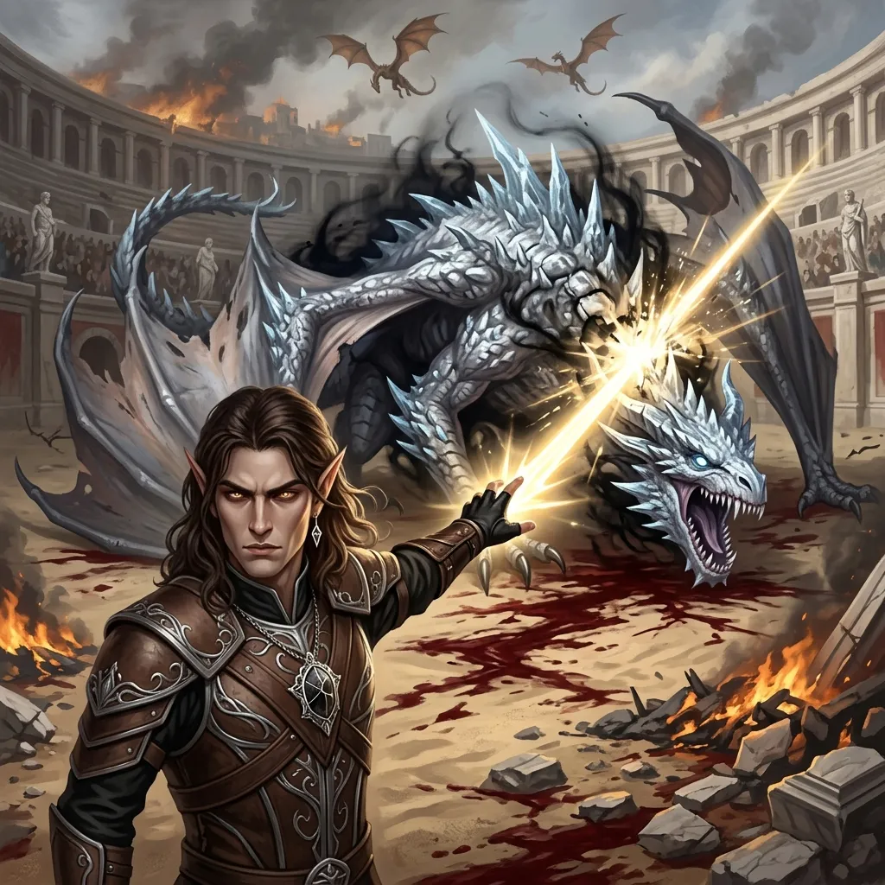
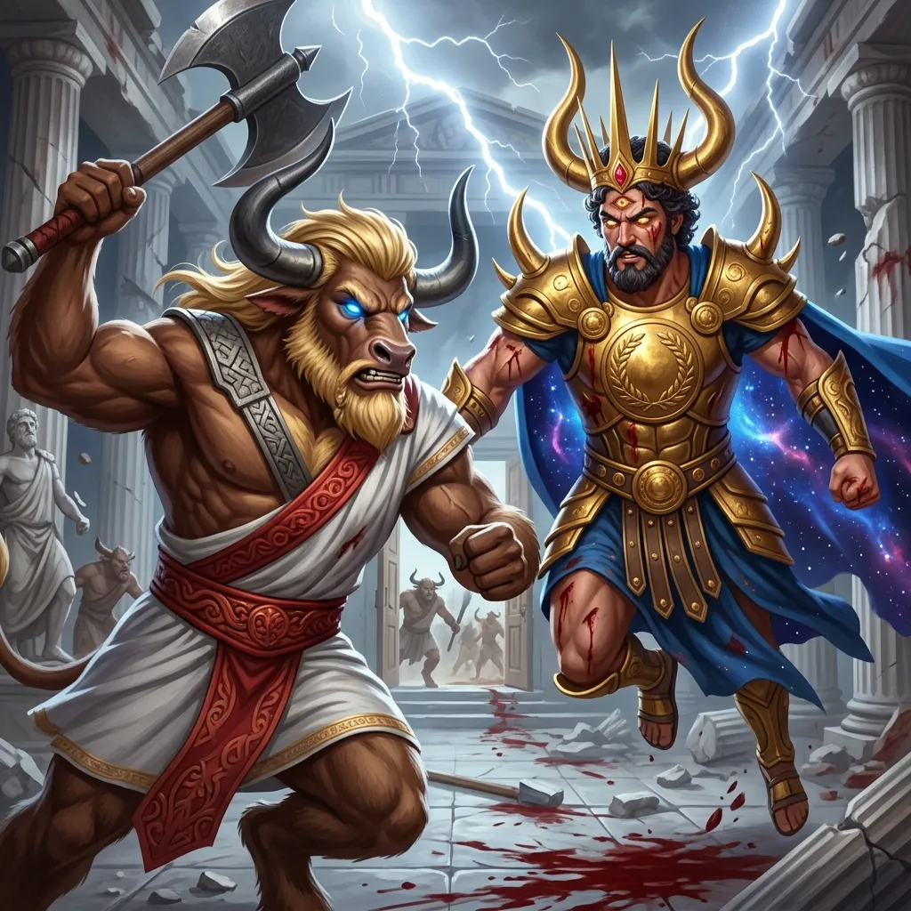
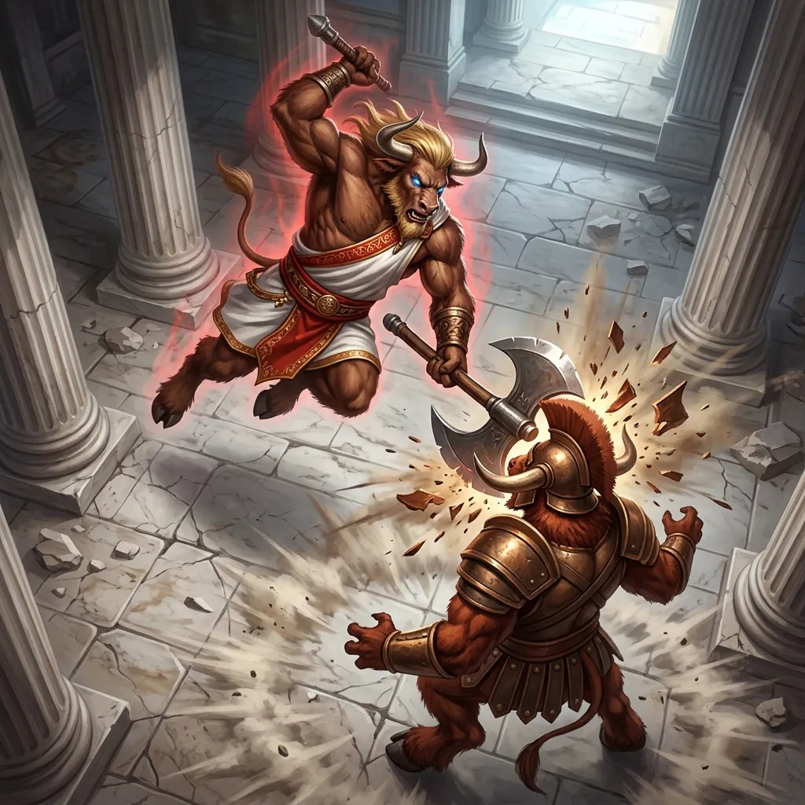
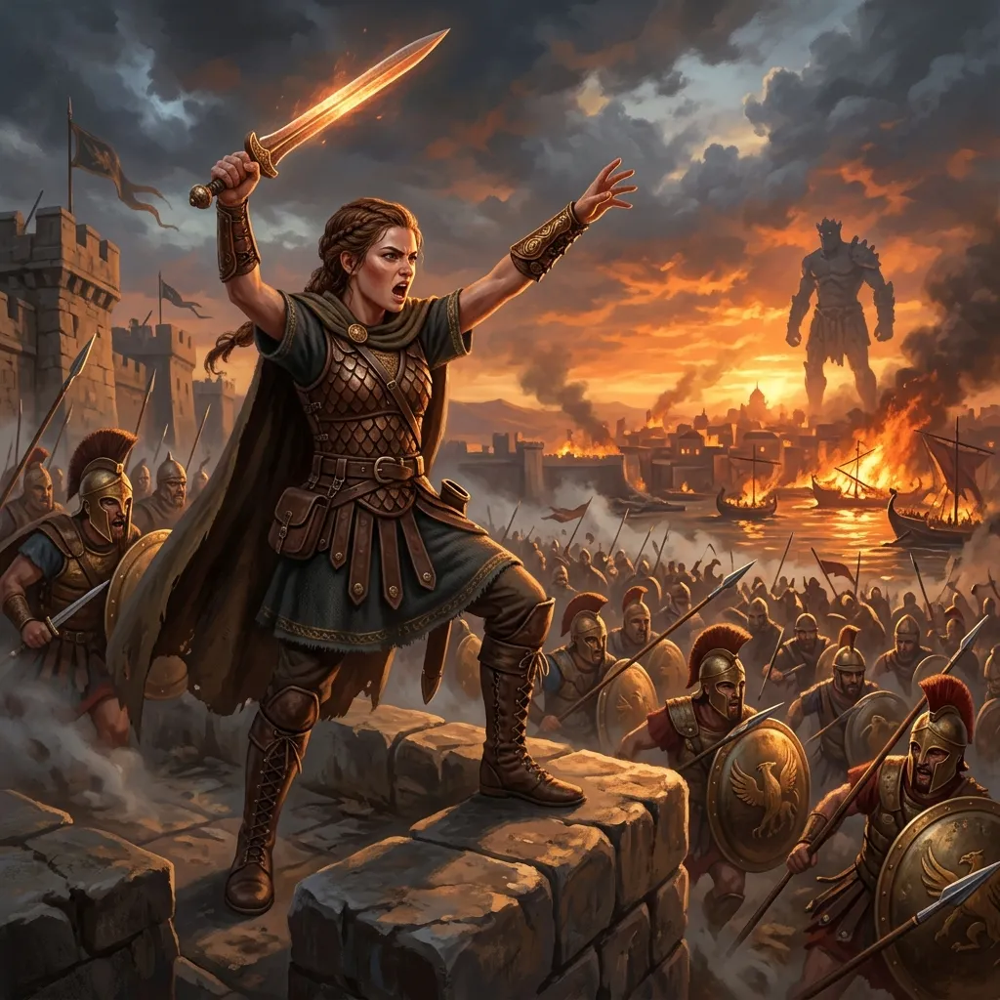
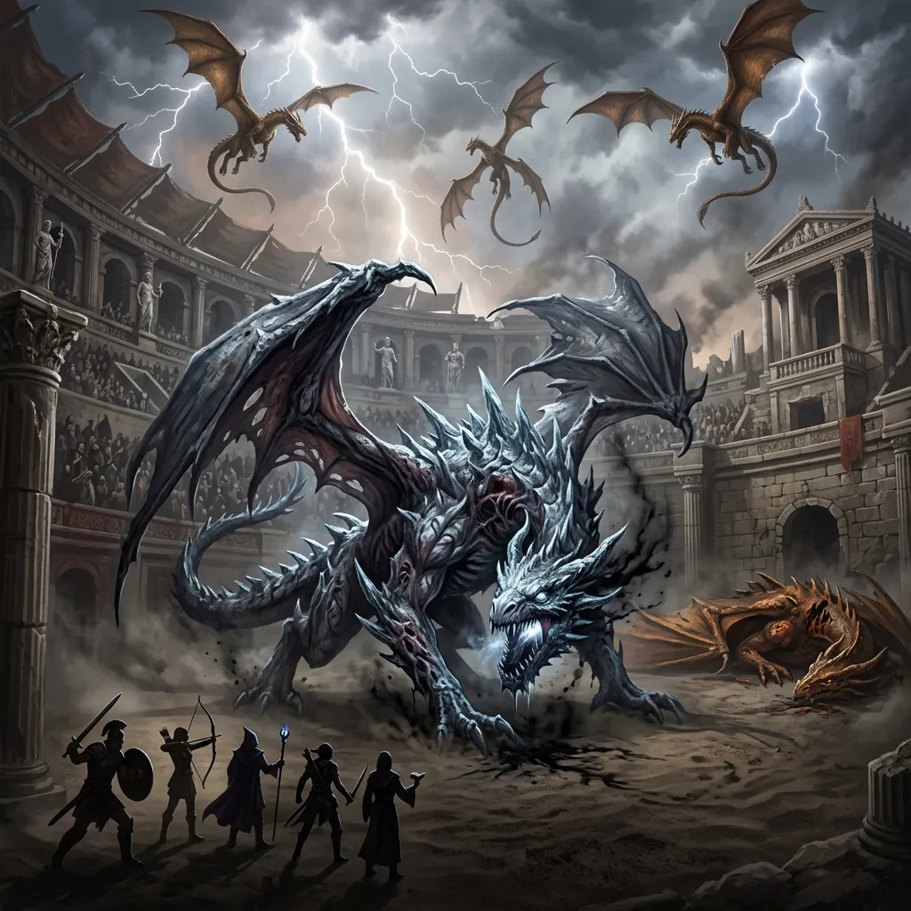
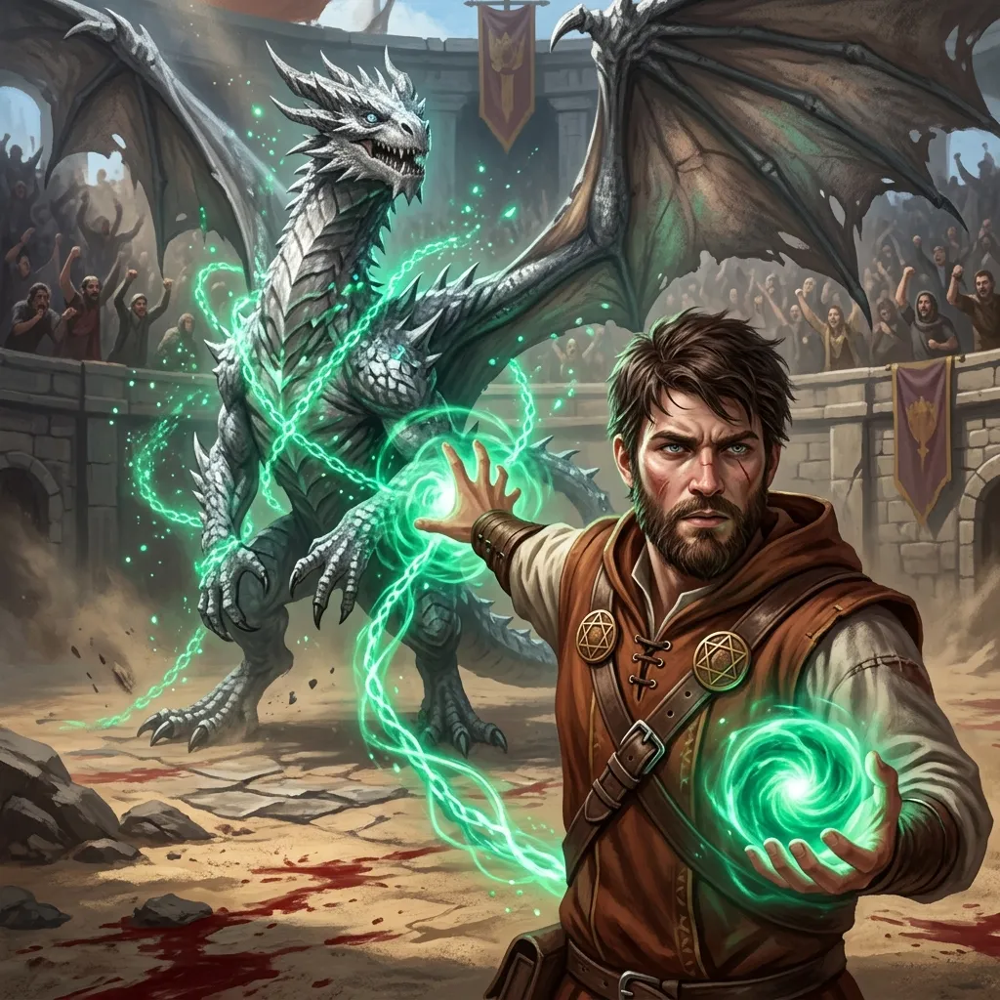
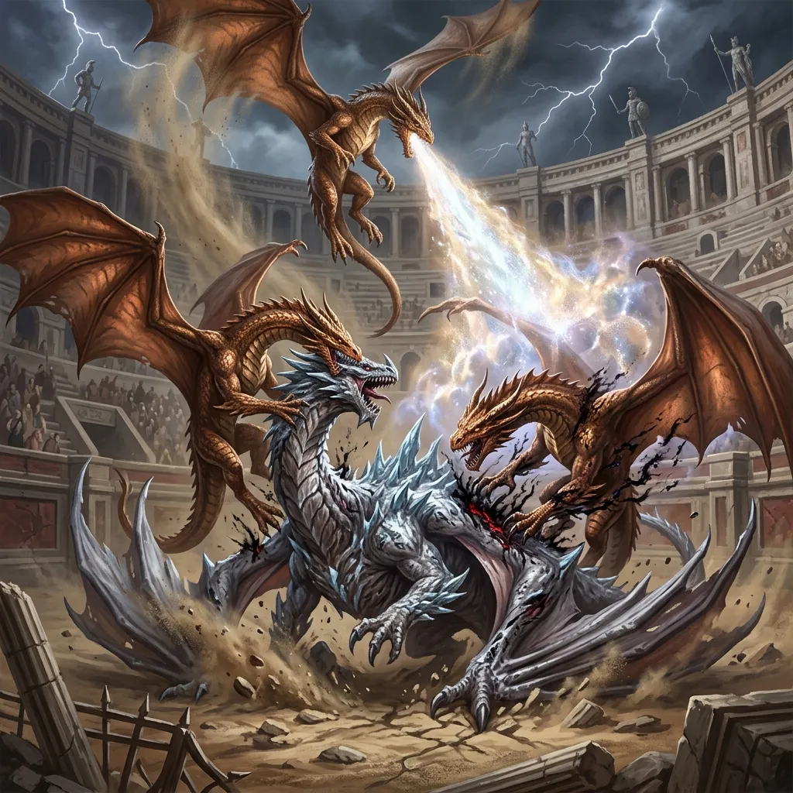
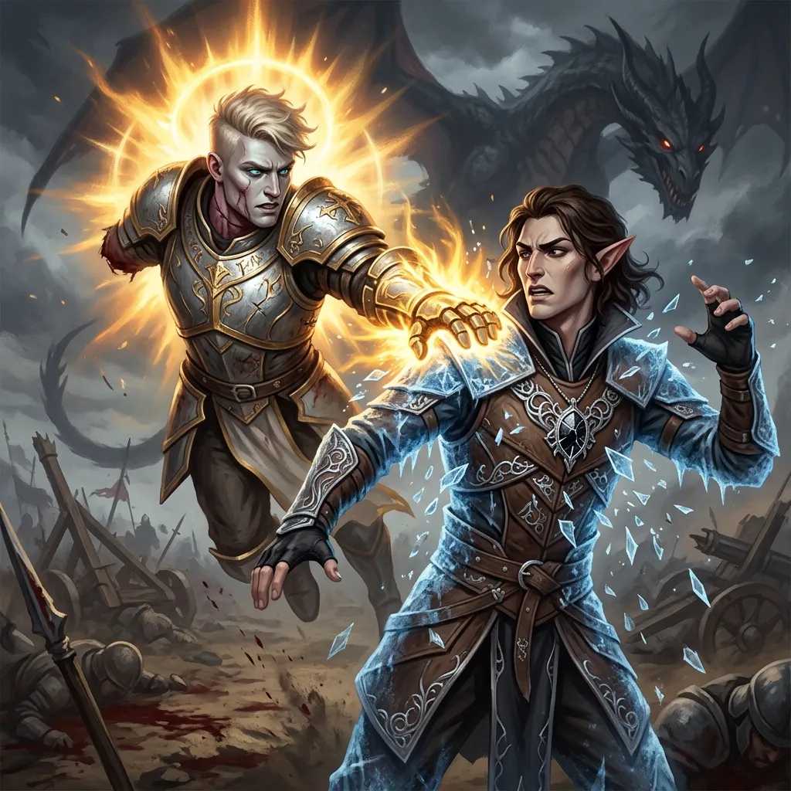
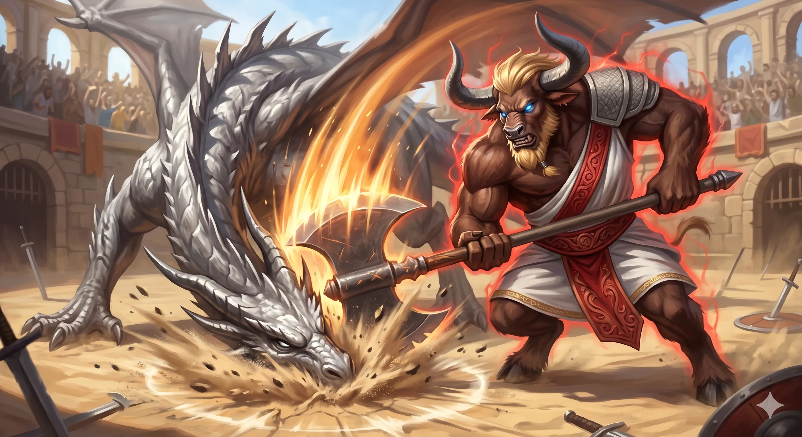
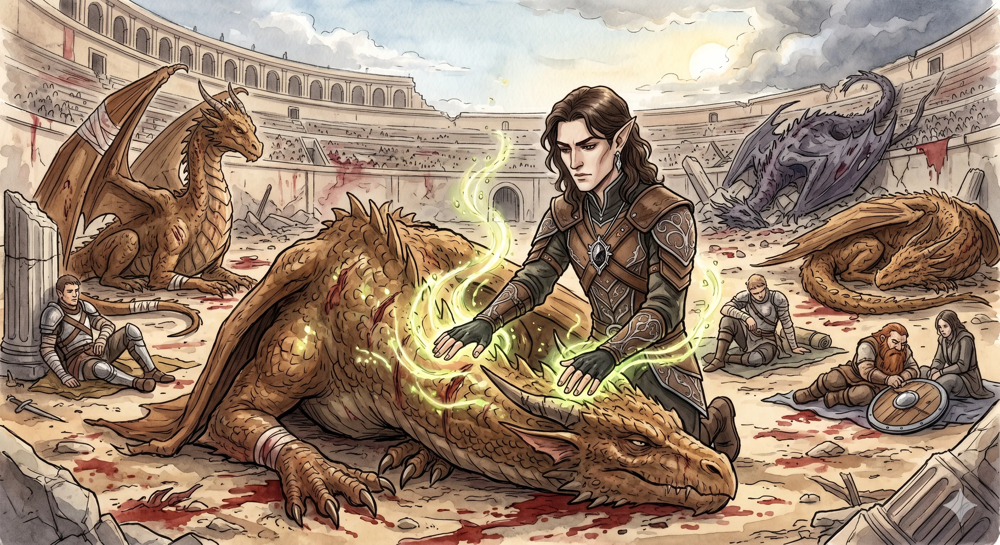

**Data:** 12.05.2026

[Prompt](../assets/sessions/077/077_icarus_radiant_death.txt)

## Podsumowanie

### Sztylety w tyłku Syna Burzy

[Prompt](../assets/sessions/077/077_temple_hergeron.txt)

[[Świątynia Pięciu]] w [[Mytros]] wciąż drżała od echa potężnych zaklęć i brzęku stali, gdy bohaterowie kontynuowali rozpaczliwą walkę z empyreanem **[[Hergeron|Hergeronem]]**, synem [[Sydon|Sydona]] i [[Lutheria|Lutherii]]. Sytuacja na polu bitwy była napięta jak cięciwa łuku — wokół centralnego oponenta krążyła resztka jego eskorty, a minotaury, które dotąd próbowały szarżować na drużynę, w panice rozpoczęły odwrót. [[Hergeron]], mimo licznych ran zadanych w poprzedniej rundzie, wciąż stał groźnie w powietrzu, dyszący gniewem, ze szpadą gotową do kolejnego zamachnięcia. **[[Orestes]]**, minotaur barbarzyńca, znalazł się w samym centrum jego wściekłości — empyrean uderzył go w pierś, zadając szesnaście punktów obrażeń kłutych oraz czternaście od chłodu, a chwilę później ponowił atak, dorzucając kolejne siedem punktów kłutych i dziewięć zimna.

Dzięki swojej legendarnej akcji [[Hergeron]] próbował dosięgnąć **[[Arevon Elorrenthi|Arevona]]**, lecz elficki druid w ostatniej chwili rzucił **Shield** — magiczna bariera odbiła ostrze i empyrean zaklął pod nosem. **[[Felicjan Janus Twardowski|Felicjan]]** zawahał się długo, czy spalić cenną, skondensowaną energię arkanową na **Disintegrate**, gdyż syn [[Sydon|Sydona]] miał aż osiemnaście w zręczności i imponujące plus dwanaście do rzutów obronnych — ostatecznie odpuścił rzucenie zaklęcia, oszczędzając zasoby na kolejne starcia, podczas gdy **Klonicjan** (jak żartobliwie ochrzczono **Simulacrum** [[Felicjan Janus Twardowski|Felicjana]]) wciąż raził empyreana ostrzałem z bezpiecznej odległości.

To jednak [[Arevon Elorrenthi|Arevon]] zadał ostateczny cios. Druid wyciągnął rękę ku załamaniom rzeczywistości i wezwał **fey'a** za pomocą **Conjure Fey** — pojedynczą, ulotną istotę z drugiej strony zasłony, która zmaterializowała się w rozbłysku zielonkawego światła. Stworzenie, słuchając głosu druida, **teleportowało się tuż za plecy [[Hergeron|Hergerona]] i wbiło mu dwa widmowe sztylety dosłownie w obydwa pośladki** — jeden w lewy, drugi w prawy. Empyrean otworzył usta szeroko ze zdumienia, jakby kompletnie nie pojmował, co się właśnie wydarzyło, i po chwili padł martwy. [[Hergeron]], syn [[Sydon|Sydona]] i [[Lutheria|Lutherii]], dołączył do swojego rodzeństwa w coraz większym klubie ofiar drużyny.

### Sprzątanie pobojowiska w Świątyni Pięciu

[Prompt](../assets/sessions/077/077_orestes_cleave.txt)

Po śmierci empyreana drużyna nie miała czasu na świętowanie — w okolicy wciąż łaziło kilku minotaurów oraz jedna szczególnie absurdalna postać: **centaur druid**, który w ferworze walki przeobraził się w **orkę** — zabójczego wieloryba — i miotał się teraz po świątynnej posadzce, najwyraźniej nie zorientowawszy się jeszcze, że jego pan padł. **[[Arevon Elorrenthi|Arevon]]** schylił się nad zwłokami [[Hergeron|Hergerona]] i wyłuskał spomiędzy fałd jego szat **[[Złota Moneta Hergerona|wielką, zdobioną złotą monetę]]** — drobiazg wyglądający jak okazały medalion, ale w istocie **klucz otwierający jedne z drzwi w wieży [[Praxys]]**. Tymczasem **Klonicjan** kontynuował ostrzał z dystansu, raziąc orkę-wieloryba i kolejne minotaury dziesiątkami punktów obrażeń.

Najbardziej spektakularne uderzenie należało jednak do **[[Orestes|Orestesa]]**, który wzbił się ponad pobojowisko i runął z impetem na jednego z minotaurów, masakrując go toporem prosto w pysk. Pojedynczy **krytyczny cios**, wsparty Reckless Attackiem, zadał oszałamiające **sześćdziesiąt sześć punktów obrażeń w jednym zamachu**, kładąc bestię trupem na kamiennej posadzce. Barbarzyńca, sam zaskoczony skalą rozlewu krwi, zażartował z dziecięcą radością — *„pierwszy raz sześćdziesiąt sześć w jednym ruchu"*. Sam [[Orion Xul|Orion]] podszedł spokojnie do leżącego wroga i bez specjalnych ceregieli dobił kolejną sztukę, **[[Versir]]** dorzucił dwa potężne uderzenia, i [[Świątynia Pięciu]] została w końcu oczyszczona z resztek oddziału [[Hergeron|Hergerona]].

### Krew na ulicach Mytros

[Prompt](../assets/sessions/077/077_corinna_commands.txt)

Mimo wewnętrznego triumfu w sanktuarium, wojna nad [[Mytros]] toczyła się dalej, a Mistrz Gry sprawnie przeszedł do kolejnej rundy bitewnej fazy. Dla drużyny i ich sojuszników była to chwila niepewności: jedna z jednostek wroga osiągnęła status **Routed** — jej morale spadło do zera, a ona sama zaczęła wycofywać się z linii frontu, by przegrupować się gdzieś z dala od głównego starcia. Niestety, chwilę później to **Legion drużyny** również dostał status **Routed**. [[Orestes]] natychmiast zaproponował, by ruszyć z odsieczą tam, gdzie sytuacja jest najbardziej krytyczna.

Drużyna zabrała się za strategiczne przesunięcia. Najważniejszą zmianą było objęcie przez **[[Corinna|Corinnę]]** dowództwa nad jednym z legionów. **Falana** zastąpiła dotychczasowego dowódcę krasnoludów, **[[Felicjan Janus Twardowski|Felicjan]]** osobiście dołączył do magów.

Bitwa o [[Mytros]] toczyła się falami, a każda runda przynosiła sceny wyjęte z najmroczniejszych mitów. Krasnoludzkie topory zwarły się z gigantami w błyskach [[Sydon|Sydonowej]] burzy, a **targeted strike [[Versir|Versira]]** dał obrońcom miasta krytyczny moment przewagi — sojusznicy [[Sydon|Sydona]] zostali odepchnięci w morze ognia i krwi, zostawiając na placu boju zbroje pożłobione ostrzami. Magowie, prowadzeni teraz osobiście przez **[[Felicjan Janus Twardowski|Felicjana]]**, miażdżyli kolejne fale **Yugolothów** i [[Centurioni z Mytros|Centurionów]] wroga.

Sukcesy mieszały się jednak z porażkami. Doki, choć podszarpane, nie były już istotne — większość konstrukcji i tak zburzyły wcześniejsze fale tsunami, a śmierć stu pięćdziesięciu obrońców została odnotowana jak suchy raport w księdze padłych. [[Orestes]] zapytał, ilu w ogóle mieszkańców liczy [[Mytros]], a [[Arevon Elorrenthi|Arevon]] odparł cierpko: *„zanim ta bitwa się skończy, nie zostanie tam nikt żywy"*. [[Mytros]] tonęło — ulica po ulicy, dzielnica po dzielnicy.

### Kolosseum i Icarus

[Prompt](../assets/sessions/077/077_arena_icarus.txt)

Po dwóch rundach żelaznego rzemiosła bitewnego Mistrz Gry przerwał kalkulacje. *„Czas na ciekawsze rzeczy"*, oznajmił, a bohaterowie wciągnęli powietrze. Akcja przeniosła się do **[[Stadion Mytros|kolosseum]]**, gdzie w samym centrum piaskowej areny miotał się **zmutowany [[Icarus]]** — ogromny, pokryty obrzydliwymi, krzywymi kolcami, niegdyś dumny srebrny smok [[Acastus|Acastusa]], teraz koszmar ciała przeobrażony obcą magią. **[[Sybolkorax]]** — niegdyś bóg-kowal [[Volkan]], dziś już tylko brązowy smok pozbawiony swojej dawnej boskiej mocy — leżał w stanie **near-death** na boku piaskowej areny, oddychając ciężko, łuski osmalone i poszarpane. Pozostała trójka smoków-niegdyś-bogów — **[[Raspytrion]]** (dawniej [[Pythor]]), **[[Arkyrania]]** (dawniej [[Kyrah]]) i **[[Tysophale]]** (dawniej [[Vallus]]) — utrzymywała się jeszcze w niezłej kondycji, lecz wszyscy widzieli, że bez wsparcia drużyny obrońcom [[Mytros]] zabraknie sił.

Drużyna stanęła do inicjatywy z pełnym **bless**em ([[Felicjan Janus Twardowski|Felicjan]] w poprzedniej walce użył specjalnego rogu, by udzielić tego błogosławieństwa całej drużynie) i **Klonicjanem** wciąż w grze.

### Hold Monster bumerangiem

[Prompt](../assets/sessions/077/077_felicjan_redirect.txt)

Pierwsze legendarne akcje bestii spadły jak grom. [[Icarus]], rozwarłszy paszczę, wytoczył ku obrońcom **paraliżujący oddech** — stożek lodowatego tchnienia, który najpierw nakładał **inkapacytację**, a dopiero potem rzeczywisty **paraliż** — i nawet z dwoma rzutami obronnymi szanse na uniknięcie obu efektów były znikome. *„Jeśli zrobi tak ponownie, wszyscy nie żyjemy"* — padło stwierdzenie [[Arevon Elorrenthi|Arevona]], suche jak piasek areny.

Jakby tego było mało, [[Icarus]] rzucił także **Hold Monster** — zaklęcie wymagające koncentracji, mogące unieruchomić bohatera na całe rundy. I wtedy do akcji wkroczył **[[Felicjan Janus Twardowski|Felicjan]]**. Czarodziej posiadał zdolność **przekierowania zaklęcia**, a Hold Monster nadawał się do tego wręcz idealnie. Przez chwilę rozważał, czy nie posłać czaru na swojego familiara **Huberta** — drobne ptaszysko, którego paraliż byłby względnie tani — ale ostatecznie wybrał o niebo bardziej elegancie rozwiązanie i **przekierował zaklęcie z powrotem na samego [[Icarus|Icarusa]]**. Smok nie zdał rzutu obronnego, sparaliżował się własną mocą, a koncentracja prysła w tym samym ułamku sekundy. Ten jeden manewr wytrącił bestii kluczowe narzędzie kontroli i kupił drużynie cenne sekundy.

### Ogień, strzała i pomoc smoków

[Prompt](../assets/sessions/077/077_dragons_attack_icarus.txt)

**[[Arevon Elorrenthi|Arevon]]** podpalił wszystko, co mógł — **Wall of Fire** rozlewał się przez piasek, odgradzając [[Icarus|Icarusa]] od reszty świata płonącą barierą. **[[Versir]]** uzbroił 30-stopową aurę emanacji i przygotowywał swoje **Channel Divinity**, świecąc jak chodząca latarnia świętej mocy. **[[Orestes]]** sięgnął po szczególny relikt swojego kołczana — **[[Arrow of Dragon Slaying|Arrow of Dragon Slaying]]**, magiczną strzałę przeznaczoną do zabijania smoków. Łowiecki gest barbarzyńcy wypadł jednak nieszczęśliwie: strzała trafiła w łuskę [[Icarus|Icarusa]], lecz nie zdołała się przebić, odbijając się bezsilnie i opadając na piasek.

Pomoc nadeszła ze strony smoków. **[[Tysophale]]** i **[[Raspytrion]]** zanurkowali na zmutowanego [[Icarus|Icarusa]], zatapiając w jego skażonym ciele kły i pazury, a **[[Arkyrania]]** uzupełniła atak, zioniąc na bestię potężnym oddechem. Strumień smoczycy zalał część areny — łapiąc też leżącego near-death **[[Sybolkorax|Sybolkoraxa]]** w obszarze niejako mimochodem, choć stary smok ledwo to odczuł. **[[Orion Xul|Orion]]**, z trudem wstając do walki, użył **Second Wind** za czternaście punktów i poszybował z dodatkowymi dwudziestoma stopami ruchu w stronę bestii. Z błogosławieństwem **bless** wybił dwadzieścia trzy do trafienia, później kolejne dwadzieścia dwa, korzystając z bonusowych akcji. [[Icarus]] zaczął odczuwać pierwsze prawdziwe ciosy.

### Drugi oddech mutanta

[Prompt](../assets/sessions/077/077_arevon_heals_versir.txt)

[[Icarus]], choć już osłabiony, raz jeszcze rozwarł obrzmiałą paszczę i ze świstem powietrza wytoczył ku obrońcom potworny stożek paraliżującego tchnienia. **[[Versir]]**, dzierżąc świętą aurę, dwukrotnie czuł na karku zimny dotyk paraliżu — i dwukrotnie, choć niespiesznie, zdołał oprzeć się jego mocy. Mniej szczęścia mieli **[[Arevon Elorrenthi|Arevon]]** i sobowtór [[Felicjan Janus Twardowski|Felicjana]]: niemoc zatrzasnęła ich ciała jak pancerz, pozbawiając oddechu i woli. Inkapacytacja przerwała koncentrację czarownika i przez chwilę zdawało się, że los bitwy znów się odwraca przeciw drużynie.

[[Icarus]] wykorzystał moment słabości i z furią rzucił się ku [[Versir|Versirowi]], próbując dorwać go zębami i pazurami. Lecz tym razem łaskawość losu (lub raczej jego niełaska wobec mutanta) zaskoczyła wszystkich — smok **trzy razy wyrzucił jedynkę na kostce do trafienia**, jakby same niebiosa odpychały jego pazury od świętego kapłana. [[Versir]], otoczony aurą boskiego światła, stał nieporuszony, a [[Icarus]] zacharczał z bezsilności. Paraliż tymczasem niemiłosiernie zaczynał zamrażać [[Arevon Elorrenthi|Arevona]]. W tej krytycznej chwili **[[Versir]]**, świadom, że bez wsparcia drużyna nie dożyje końca rundy, doleciał ku druidowi i nałożył nań **Lesser Restoration**, zdejmując duchową kotwicę paraliżu. Aura kapłana znów otoczyła sojuszników, a wokół niego krystalizowała się wola walki.

### Ostateczny cios

[Prompt](../assets/sessions/077/077_orestes_hill_giant.txt)

Już wcześniej w starciu **[[Orestes]]**, pełen barbarzyńskiej werwy, wykorzystał moment chaosu i ruszył do szarży. Z gniewem Rage'a płonącym w piersi dopadł zmutowanego smoka, uderzył toporem za trzydzieści punktów obrażeń, a potem dorzucił **Strike of the Hill Giant** — i mimo monstrualnych rozmiarów bestii **sprowadził [[Icarus|Icarusa]] do parteru**. **[[Arkyrania]]** wykorzystała moment i nadciągnęła z górnego pułapu, wbijając w odsłonięty grzbiet pazury i kły z pełnią smoczej furii.

Mutant jednak nie odpuścił. Wstając z rykiem, smok pochylił łeb i **z furią wgryzł się w [[Orestes|Orestesa]]** — krytyczny atak z advantage'em rozszarpał barbarzyńcę. Zaraz potem [[Icarus]] użył legendarnej akcji i wzbił w powietrze kolejny ciężki oddech. **[[Sybolkorax]]** wciąż leżał bez ruchu, dysząc w pyle areny, a **Klonicjan** trzymał się na resztkach życia.

Wtedy nadszedł czas **[[Arevon Elorrenthi|Arevona]]**. Druid sięgnął najpierw po **Wrath of the Dragon Gods** — jedną z **Mytros Actions** dostępnych drużynie dzięki zawartym sojuszom. Linia mocy smoków przeleciała przez arenę, raniąc [[Icarus|Icarusa]] potężnym piorunem, a [[Orestes]] odzyskał dwadzieścia punktów życia, by stanąć z mutantem twarzą w twarz. Lecz to dopiero przygotowanie. W swojej regularnej turze [[Arevon Elorrenthi|Arevon]] zaatakował [[Icarus|Icarusa]] **radiantnym ostrzem** — pierwszy cios trafił czysto za osiemnaście punktów, a kolejny eksplodował **radiantną energią**, która wbiła się w aurę ciemności otaczającą bestię. *„Today is my day!"* — wyszeptał druid, a mrok pożerający łuski [[Icarus|Icarusa]] **rozbłysnął i wybuchł**, gdy radiantna moc zabiła jego mrok. *„Flaki polecą wszędzie"* — jak sam [[Arevon Elorrenthi|Arevon]] z satysfakcją opisał scenę. Zmutowany smok zachłysnął się ostatnim oddechem, jego cielsko zwaliło się ciężko na piasek areny i znieruchomiało.

### Cisza po bestii i głos starego smoka

[Prompt](../assets/sessions/077/077_arevon_healing.txt)

[Prompt](../assets/sessions/077/077_sybolkorax_prophecy.txt)

Gdy ciało [[Icarus|Icarusa]] zastygło wreszcie na zakrwawionym piasku, **[[Arevon Elorrenthi|Arevon]]** pochylił się nad zwłokami, kalkulując zimno — róg, łuski, składniki ciała, wszystko warte zachowania na późniejsze rytuały. Sama **[[Mytros (Bogini)|Mytros, Bogini Świtu]]**, uhonorowała zwycięstwo darem dwóch nowych **Miracle Pointów**, dosypując drużynie świeżych zasobów na to, co miało jeszcze nadejść. **[[Sybolkorax]]** wciąż leżał na granicy śmierci, a **[[Raspytrion]]** dychał ciężko opodal. [[Arevon Elorrenthi|Arevon]] podjął decyzję rozpoczęcia maratonu uzdrowień: kolejne czary leczące lały się z jego rąk raz po raz, wlewając życie kolejno w smoki, w **[[Felicjan Janus Twardowski|Felicjana]]**, w [[Orestes|Orestesa]].

Gdy ostatnie oddechy uzdrowień opadały, do drużyny przemówił sam **[[Sybolkorax]]**, dziwiąc się, że głupiec **[[Acastus]]** nie wpadł na to wcześniej. *„Najwyższy czas..."* — zachrypiał stary smok — przypominając im o **wielkim posągu [[Pythor|Pythora]], boga wojny**, którego potężny korpus stał na południu [[Mytros]]. [[Kolos Pythora|Kolos]] miał zostać obudzony i poprowadzony do bitwy niczym pradawny mecha-bóg. Był jednak haczyk: do aktywacji giganta potrzebne było **[[Rod of Rulership]]** — starożytne berło dzierżone przez samego króla **[[Acastus|Acastusa]]**, ukryte gdzieś w królewskim pałacu. Drużyna miała więc przed sobą nie tylko marsz do statui, ale i konieczność wymuszenia na monarchii oddania regaliów, których władca nie zamierza z pewnością wypuścić z ręki.

Mimo tej komplikacji pomysł podchwycili natychmiast. Padały żarty o Megazordzie, o sterowaniu kolosem, o **[[Ismene Neurdagon|córce Tarana Neurdagona]]** albo o **[[Moxena|Moxenie]]** jako kandydatkach do roli pilota — ktoś mądry, kto mógłby zasiąść w sercu giganta i poprowadzić go przeciwko siłom oblegającym miasto. Bitwa o [[Mytros]] nadal wrzała, a niektóre dzielnice były już stracone — czas naglił. Postanowili najpierw ruszyć do bitwy, by ratować pozostałe ulice, potem upomnieć się w [[Pałac Królewski w Mytros|pałacu]] o **[[Rod of Rulership]]**, a dopiero na końcu udać się po [[Kolos Pythora|kolosa Pythora]]. Sesja zakończyła się tu, z planem przebudzenia mecha wiszącym w powietrzu jak kurz nad piaskową areną.

## Kluczowe wydarzenia / decyzje

* **Śmierć [[Hergeron|Hergerona]]** — [[Arevon Elorrenthi|Arevon]] wezwał fey'a (**Conjure Fey**), który teleportował się za plecy syna [[Sydon|Sydona]] i [[Lutheria|Lutherii]] i wbił mu dwa widmowe sztylety w pośladki, kładąc empyreana na ziemi.
* **Trzecia runda Bitwy o [[Mytros]]**
* **Hold Monster bumerangiem** — [[Icarus]] rzuca Hold Monster na drużynę, [[Felicjan Janus Twardowski|Felicjan]] rozważa skierowanie czaru na familiara Huberta, ale ostatecznie **przekierowuje zaklęcie z powrotem na samego [[Icarus|Icarusa]]**, który nie zdaje rzutu — koncentracja smoka pryska natychmiast.
* **Wall of Fire [[Arevon Elorrenthi|Arevona]]** odgradza [[Icarus|Icarusa]]; [[Orestes]] nieskutecznie próbuje **[[Arrow of Dragon Slaying]]** (strzała się nie przebija); [[Tysophale]] i [[Raspytrion]] gryzą i drapią mutanta, **[[Arkyrania]]** dorzuca smoczy oddech.
* **Drugi oddech paraliżujący**: [[Versir]] wytrzymuje (dzięki aurze), [[Arevon Elorrenthi|Arevon]] i Klonicjan zostają zinkapacytowani; [[Versir]] leczy [[Arevon Elorrenthi|Arevona]] Lesser Restoration; [[Icarus]] **trzykrotnie wyrzuca jedynkę** na atakach na [[Versir|Versira]].
* **[[Orestes]] Strike of the Hill Giant** powala [[Icarus|Icarusa]] na ziemię (mimo monstrualnych rozmiarów smoka).
* **[[Arevon Elorrenthi|Arevon]] zadaje ostateczny cios** — najpierw odpala **Wrath of the Dragon Gods** (Mytros Action), potem trafia [[Icarus|Icarusa]] radiantnym ostrzem, którego energia rozbija aurę ciemności mutanta i kończy walkę. **Bogini [[Mytros (Bogini)|Mytros]]** przyznaje 2 nowe Miracle Pointy.
* **Maraton uzdrowień** — [[Arevon Elorrenthi|Arevon]] leczy magią smoki i całą drużynę.
* **[[Sybolkorax]] ujawnia plan [[Kolos Pythora|kolosa Pythora]]** — wielką statuę boga wojny na południu [[Mytros]] można obudzić jak mecha-boga; do aktywacji potrzebne jest **[[Rod of Rulership]]** dzierżone przez [[Acastus|Acastusa]] w [[Pałac Królewski w Mytros|pałacu królewskim]]. Drużyna rozważa [[Moxena|Moxenę]] lub [[Ismene Neurdagon|córkę Tarana Neurdagona]] jako pilotkę.

## Pamiętne Cytaty

* **[[Orestes]] (po krytycznym uderzeniu na minotaurzą dowódczynię):** *„Pierwszy raz sześćdziesiąt sześć w jednym ruchu."*
* **[[Arevon Elorrenthi|Arevon]] (o losie [[Mytros]]):** *„Zanim ta bitwa się skończy, nie zostanie tam nikt żywy."*
* **[[Arevon Elorrenthi|Arevon]] (przed walką z [[Icarus|Icarusem]], o oddechu paraliżującym):** *„Jeśli zrobi tak ponownie, wszyscy nie żyjemy."*
* **Dungeon Master (przerywając kalkulacje bitwy systemowej):** *„Czas na ciekawsze rzeczy."*
* **[[Arevon Elorrenthi|Arevon]] (zadając killing blow [[Icarus|Icarusowi]]):** *„Today is my day! Radiant energia zabija jego darkness, jego darkness wybucha. I flaki polecą wszędzie."*
* **[[Sybolkorax]] (po pokonaniu [[Icarus|Icarusa]]):** *„Najwyższy czas... [[Acastus]] powinien był na to wpaść dawno temu."*

## Postacie Niezależne (NPC)

* **[[Hergeron]]** (empyrean, syn [[Sydon|Sydona]] i [[Lutheria|Lutherii]]) — pokonany w [[Świątynia Pięciu|Świątyni Pięciu]] po wbiciu mu dwóch widmowych sztyletów w pośladki przez fey'a [[Arevon Elorrenthi|Arevona]].
* **[[Icarus]]** — zmutowany srebrny smok [[Acastus|Acastusa]], oszalały, zabity radiantnym ciosem [[Arevon Elorrenthi|Arevona]] na piaskowej arenie [[Stadion Mytros|kolosseum]].
* **[[Sybolkorax]]** (niegdyś [[Volkan]], dziś tylko brązowy smok) — leżał w stanie near-death, ocalony maratonem uzdrowień [[Arevon Elorrenthi|Arevona]]; ujawnił drużynie plan przebudzenia [[Kolos Pythora|kolosa Pythora]].
* **[[Raspytrion]]** (niegdyś [[Pythor]], dziś brązowy smok) — wspierał drużynę z powietrza, zatapiał kły i pazury w [[Icarus|Icarusie]].
* **[[Arkyrania]]** (niegdyś [[Kyrah]], dziś brązowa smoczyca) — użyła smoczego oddechu na zmutowanego [[Icarus|Icarusa]].
* **[[Tysophale]]** (niegdyś [[Vallus]], dziś brązowa smoczyca) — wraz z [[Raspytrion|Raspytrionem]] nurkowała na [[Icarus|Icarusa]].

## Lokacje

* **[[Świątynia Pięciu]]** w [[Mytros]] — miejsce ostatniego starcia z [[Hergeron|Hergeronem]] i jego eskortą.
* **[[Stadion Mytros|Kolosseum Mytros]]** (piaskowa arena) — scena walki ze zmutowanym [[Icarus|Icarusem]].
* **[[Mytros]]** — miasto trwające w Bitwie o [[Mytros]]; doki w gruzach, dzielnice tonące w ogniu i krwi.
* **[[Kolos Pythora|Statua Pythora]]** (kolos) — wielki posąg boga wojny na południu [[Mytros]], czekający na przebudzenie i aktywację [[Rod of Rulership]].
* **[[Pałac Królewski w Mytros|Pałac królewski Mytros]]** — siedziba [[Acastus|Acastusa]]; tu drużyna ma się upomnieć o [[Rod of Rulership]].

## Przedmioty

* **[[Złota Moneta Hergerona]]** — wielka, zdobiona moneta wyglądająca na medalion, w istocie klucz otwierający jedne z drzwi w wieży [[Praxys]].
* **[[Arrow of Dragon Slaying]]** — magiczna strzała [[Orestes|Orestesa]]; nie przebiła łuski zmutowanego [[Icarus|Icarusa]].
* **[[Rod of Rulership]]** — starożytne berło dzierżone przez [[Acastus|Acastusa]], klucz do aktywacji [[Kolos Pythora|kolosa Pythora]]; cel kolejnej wizyty drużyny w pałacu królewskim.

## Filmy

