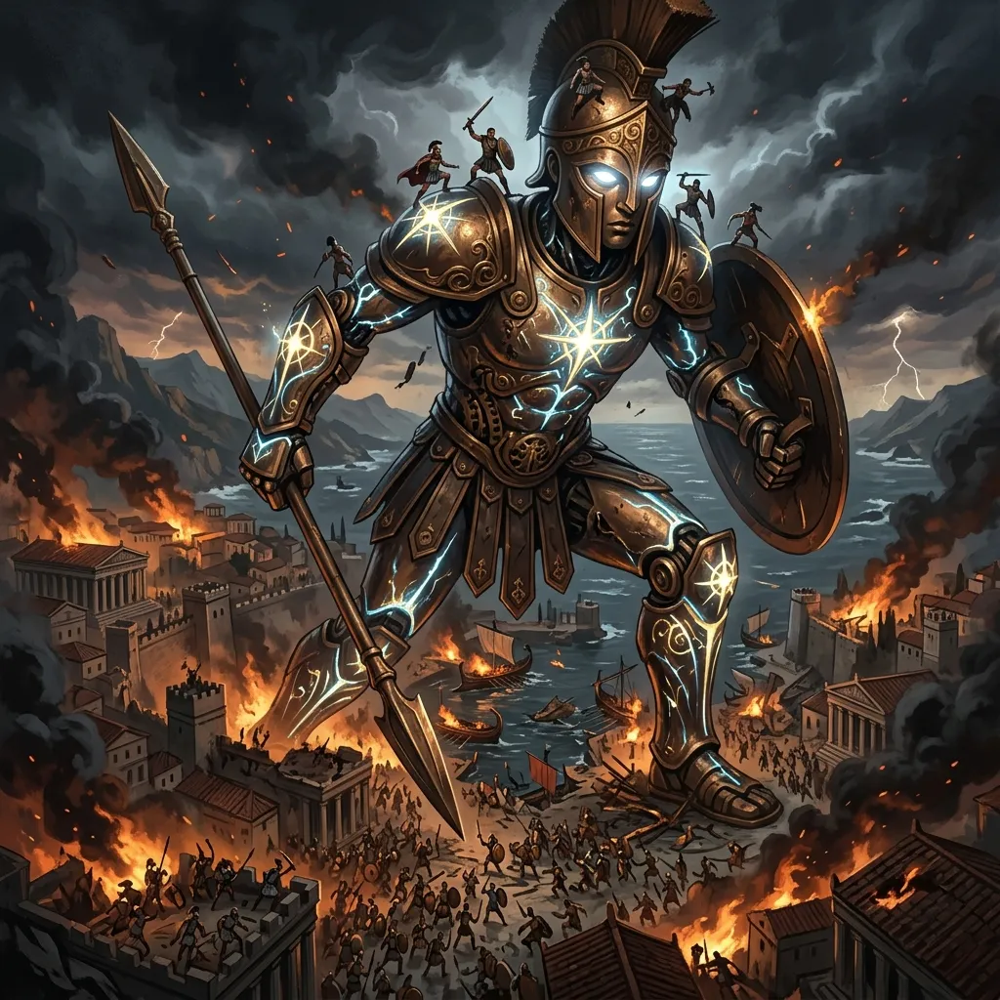
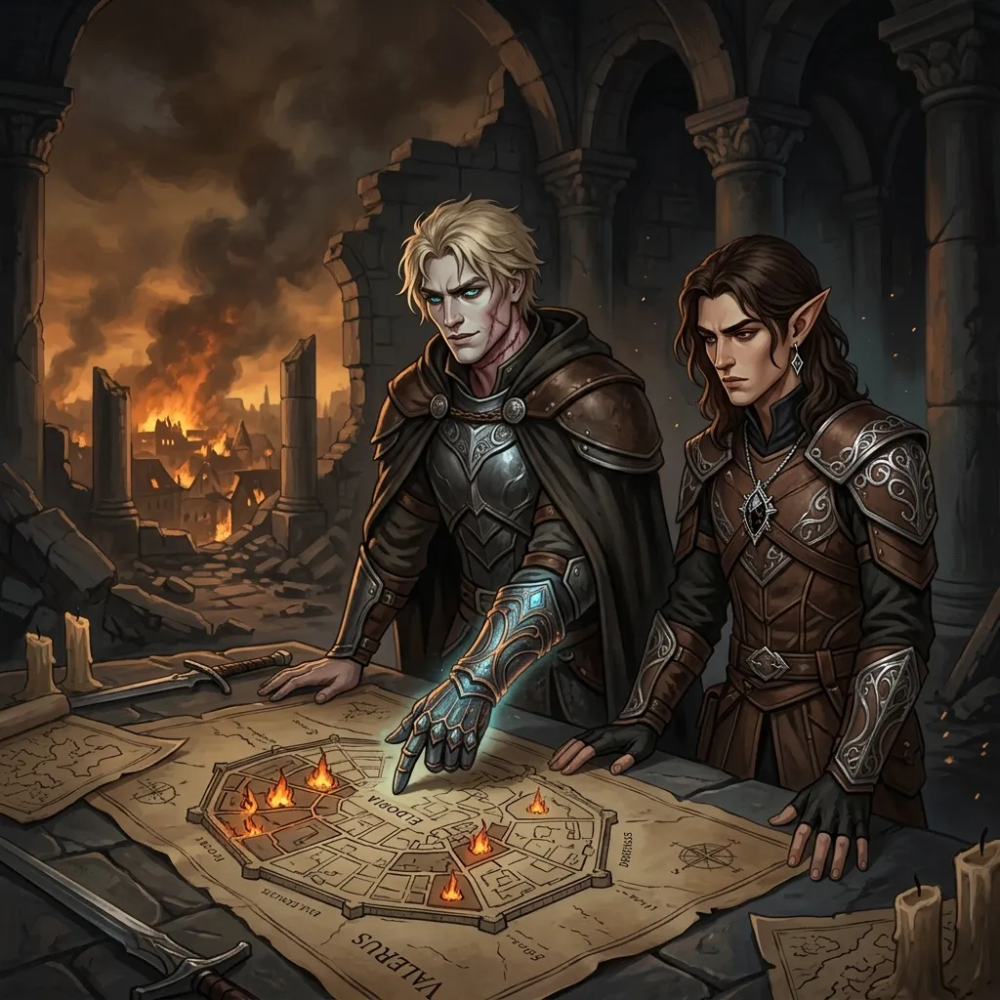
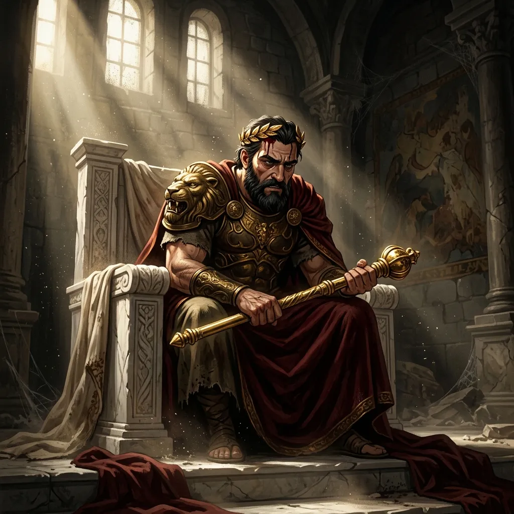
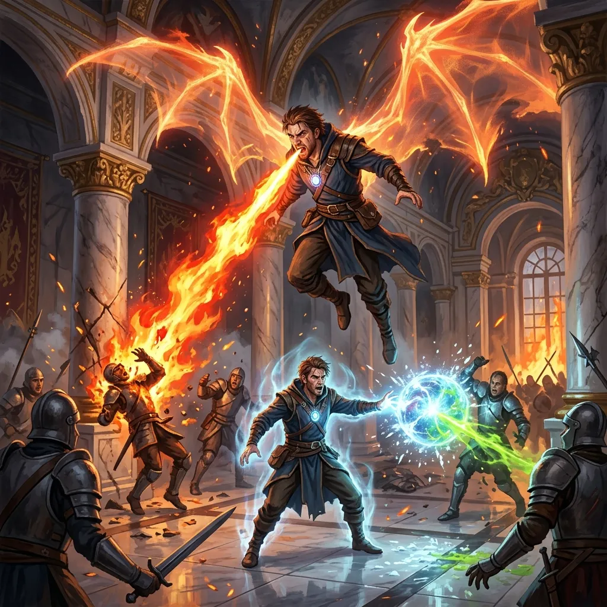
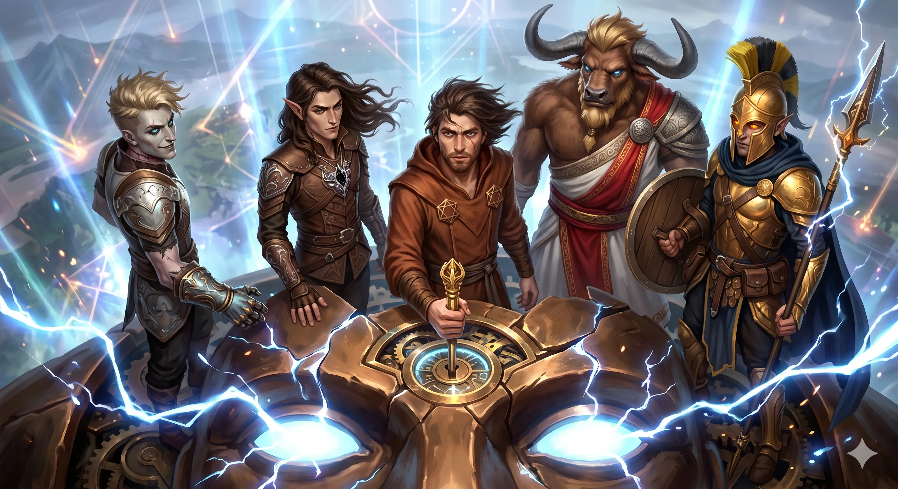
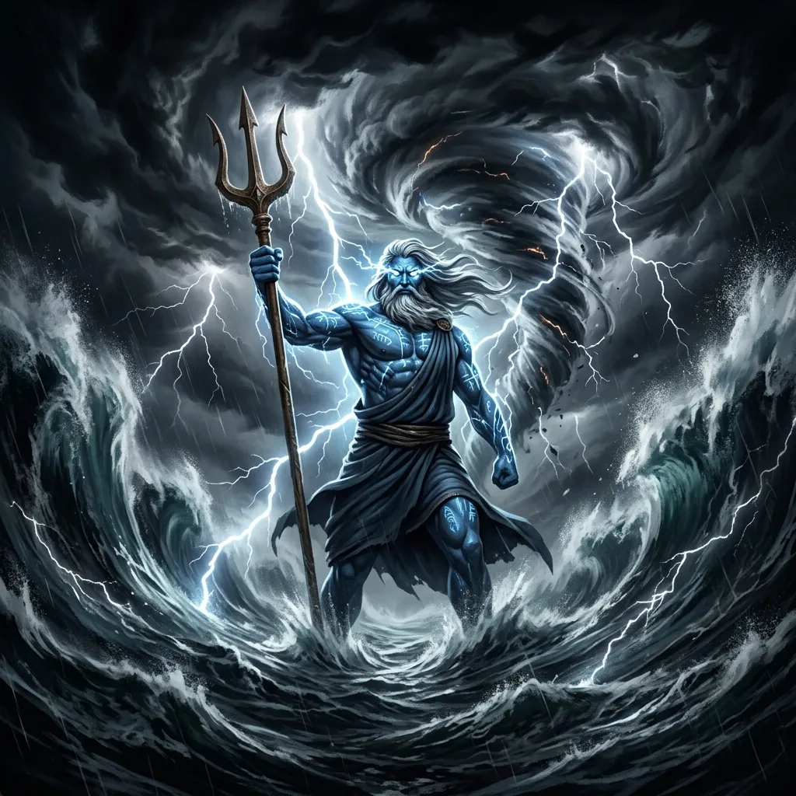

**Data:** 25.05.2026

[Prompt](../assets/sessions/078/078_main_1.txt)

## Podsumowanie

### Chaos na Ulicach Płonącego Mytros

[Prompt](../assets/sessions/078/078_chaos_1.txt)

Oblężenie [[Mytros]] trwało w najlepsze, a ulice stolicy spływały krwią. [[Bohaterowie Przepowiedni]], zaledwie chwilę po wyczerpującym starciu z potwornym [[Icarus|Icarusem]] i [[Hergeron|Hergeronem]] w [[Świątynia Pięciu|Świątyni Pięciu]], musieli przejąć dowodzenie nad obrońcami miasta. Stojąc nad strategiczną mapą zniszczeń, niczym bogowie wojny zsyłali rozkazy dla ocalałych oddziałów. Sytuacja była iście dramatyczna. [[Egida Mytros]], choć potężna, z trudem utrzymywała pozycje, podczas gdy zuchwali Barbarzyńcy z [[Wyspa Indygo|plemienia Indygo]], wspierani magią bitewną, ścierali się z przerażającymi, mosiężnymi automatonami [[Sydon|Sydona]]. 

Gdzie indziej, w dzielnicy winnic i w pobliżu starożytnych świątyń, Magowie z [[Akademia Mytros|Akademii]] oraz [[Centurioni z Mytros|Centurioni]] desperacko próbowali utrzymać morale, które z każdą chwilą ulatywało wraz z dymem płonących budowli. Niektóre legiony, wykrwawione i złamane, musiały ratować się ucieczką, by uniknąć całkowitej anihilacji, pozostawiając za sobą bezbronnych cywilów. Bohaterowie, korzystając ze swoich zdolności, starali się łatać dziury w obronie, świadomi jednak, że żołnierze nie wygrają tej wojny sami. Kluczem do ocalenia stolicy było przebudzenie [[Kolos Pythora|Kolosa Pythora]] – gigantycznej statuy boga wojny – a do tego potrzebowali [[Rod of Rulership|Berła Władzy]], które spoczywało w rękach króla.

### Szalony Król

[Prompt](../assets/sessions/078/078_krol_1.txt)

Nie tracąc cennych sekund, herosi ruszyli do [[Pałac Królewski w Mytros|Pałacu Królewskiego]]. Przebijając się przez puste korytarze, dotarli do sali tronowej, gdzie zastali wstrząsający widok. Król [[Acastus]] siedział bezpośrednio na swoim tronie, z koroną wciśniętą głęboko na głowę, aż krew sączyła się spod jej krawędzi – jakby wepchnął ją tam siłą w przypływie szaleństwa lub rozpaczy. Choć poturbowany i zakrwawiony, wciąż kurczowo ściskał magiczne [[Rod of Rulership|Berło Władzy]].

Zamiast jednak prosić o ratunek czy ukorzyć się przed przybyłymi, zjadliwy władca od razu przeszedł do ataku, oskarżając bohaterów o sprowadzenie całego tego kataklizmu. Zarzucił im, że to przez ich działania zakończył się pokój między śmiertelnikami a Tytanami, ściągając na [[Mytros]] ostateczną zgubę. Bohaterowie nie zamierzali jednak wysłuchiwać jego oskarżeń. [[Versir]] i [[Arevon Elorrenthi|Arevon]] natychmiast ucięli te żale, przypominając królowi, że to jego własna nieudolność sprowadziła nieszczęście na królestwo.

[[Versir]], patrząc na monarchę z mieszaniną pogardy i chłodu, postawił sprawę jasno: drużyna nie potrzebuje jego berła dla własnej chwały, lecz by tchnąć życie w [[Kolos Pythora|Kolosa]] i ocalić miasto. Zapytał wprost, czy [[Acastus]] chce zostać zapamiętany w historii jako żałosny tchórz, który trzymał w dłoniach jedyne narzędzie ocalenia, ale bał się go użyć. Wtedy do rozmowy włączyła się jego matka, [[Idylla]]. Wezwała syna, by wreszcie przestał ślepo ufać przepowiedniom, przestał się nad sobą użalać i choć raz w życiu zrobił to, co słuszne.

Te słowa, przepełnione matczynym autorytetem, ostatecznie kruszą pychę monarchy. W oczach [[Acastus|Acastusa]] błysnęła nowa, desperacka determinacja. Wstał ciężko z tronu, przyznając, że choć przepowiedziano mu bycie kimś o niewielkiej wartości, nadszedł czas, by odłożył dumę na bok i postawił swój lud na pierwszym miejscu. Z głębokim westchnieniem wyciągnął dłoń, oddając [[Rod of Rulership|Berło Władzy]] w ręce drużyny, wyrażając nadzieję na ocalenie miasta. Następnie, wraz z wiernym [[Tarchon|Tarchonem]] dosiadającym młodego smoka, [[Acastus]] skierował się w stronę swojego własnego, dorosłego wierzchowca, gotów osobiście stanąć do walki.

### Zdrada Tarchona

[Prompt](../assets/sessions/078/078_zdrada_2.txt)

Zanim jednak bohaterowie zdołali opuścić salę tronową z bezcennym artefaktem, rozległ się ogłuszający trzask pękającego szkła. Sklepienie pałacu zapadło się, a do środka wpadli elitarni jeźdźcy [[Zakon Sydona]] dosiadający trzech młodych smoków, dowodzeni między innymi przez bezlitosnego [[Leopardas|Leopardasa]]. Komnata natychmiast wypełniła się zapachem ozonu i palącego się powietrza, gdy bestie zionęły niszczycielskimi żywiołami ognia, błyskawic oraz lodowatego zimna.

W samym środku bitewnego zamętu doszło do wstrząsającego zwrotu akcji. [[Tarchon]], dotychczasowy dowódca obrony i doradca królewski, który miał wraz z [[Acastus|Acastusem]] stanąć do walki, ujawnił swoje prawdziwe, zdradzieckie oblicze. Dosiadając swojego młodego smoka, z fanatycznym okrzykiem „Chwała Sydonowi!” na ustach, gwałtownie zaatakował zaskoczonego [[Orestes|Orestesa]], przechodząc na stronę najeźdźców.

Bohaterowie zareagowali natychmiast, stawiając czoła podwójnemu zagrożeniu. [[Arevon Elorrenthi]] przyjął swoją lśniącą, gwiezdną formę, otaczając się astralną energią i z niezwykłą płynnością zsyłając magiczne pociski. [[Felicjan Janus Twardowski]] sięgnął po potężną magię, rzucając zaklęcie *Smoczej Transformacji (Draconic Transformation)*. Plecy maga ozdobiły potężne skrzydła, a on sam wzbił się w powietrze, zionąc niszczycielskim smoczym oddechem na napastników. W tym samym czasie jego magiczny klon, [[Klonicjan|Simulacrum]] pieszczotliwie zwany „[[Klonicjan|Klonicjanem]]”, wspierał go na ziemi, ciskając odbijające się *Chromatyczne Kule*, które z niszczycielską siłą raziły wrogich jeźdźców i smoki lodem oraz kwasem.

[[Versir]], wznosząc dłoń naznaczoną potęgą Tytanów, wypowiedział słowo nasycone boskim autorytetem. Potężna *Komenda* uderzyła we wrogie bestie, zmuszając gigantyczne gady do uległości i przygniawając je do marmurowej posadzki. [[Orestes]] początkowo strzelał z łuku, wspierając towarzyszy z dystansu. Jednak gdy ujawniła się zdrada [[Tarchon|Tarchona]], minotaur natychmiast skupił całą swoją uwagę na zdradzieckim dowódcy i jego wierzchowcu. Wpadając w szał berserkera, [[Orestes]] ruszył w ich kierunku, po czym zdołał fizycznie pochwycić i unieruchomić smoka. Po spętaniu bestii, zaczął zadawać powalającemu gadowi potężne, oburęczne cięcia swoim wielkim toporem, krusząc łuski i kości. Do walki aktywnie włączył się także król [[Acastus]] – gdy jeden z wrogich minotaurów szarżował na niego, monarcha ciął go swoim magicznym mieczem, z którego wystrzeliło mroczne światło, wysysając esencję życiową napastnika i natychmiast go zabijając.

[[Orion Xul]] z furią i precyzją atakował wrogie smoki oraz ich jeźdźców, jednak swój najstraszliwszy gniew zachował na sam koniec. [[Tarchon]], zaciekle walczący u boku sił [[Sydon|Sydona]], został pokonany jako ostatni z przeciwników. [[Orion Xul|Orion]] z gracją półboga wybił się w powietrze i z bezbrzeżną pogardą oraz intencją maksymalnego upokorzenia wroga, wbił tępy trzonek swojej włóczni prosto w gardło zdradzieckiego dowódcy. Używając nadludzkiej siły, przebił gardło [[Tarchon|Tarchona]] na wylot, grzebiąc ostatecznie jego zdradę i kładąc kres starciu w sali tronowej.

### Przebudzenie Kolosa Pythora

[Prompt](../assets/sessions/078/078_kolos_2.txt)

Po błyskawicznym wyeliminowaniu zuchwałych zabójców, drużyna zebrała swoje siły. Lecząc powierzchowne rany potężną magią [[Arevon Elorrenthi|Arevona]] i [[Versir|Versira]], bohaterowie wezwali swoje zaprzyjaźnione smoki – [[Sybolkorax|Sybolkoraxa]], [[Raspytrion|Raspytriona]], [[Tysophale]] oraz [[Arkyrania|Arkyranię]]. Wzbijając się w przestworza nad zrujnowanym [[Mytros]], popędzili w stronę portu, gdzie dumnie i nieruchomo stał [[Kolos Pythora]], górując nad horyzontem niczym obietnica wyzwolenia.

Lot nad miastem trwał zaledwie chwile, ale ukazał ogrom zniszczeń. Po dotarciu na szczyt posągu, wylądowali bezpośrednio na masywnej, mechanicznej głowie boga bitwy. Wewnątrz odnaleźli sferę kontrolną – skomplikowany mechanizm z idealnie dopasowaną szczeliną. Kiedy [[Rod of Rulership|Berło Władzy]] zostało wsunięte w mechanizm, cała platforma pod ich stopami zaczęła wibrować. Starożytne tryby, uśpione przez wieki, zazębiły się z głuchym, potężnym rykiem, który przetoczył się przez całe miasto. Oczy [[Kolos Pythora|Kolosa]] rozbłysły niebiańskim światłem, a z ulic poniżej dobiegł ich ogłuszający ryk ocalałych mieszkańców. Ludzie, widząc ożywiony pomnik, wybuchnęli łzami radości i okrzykami triumfu, wierząc, że oto sam bóg [[Pythor]] zstąpił, by ocalić ich przed ostateczną zagładą.

### Węże Morskie i Widmo Ostatecznej Bitwy

[Prompt](../assets/sessions/078/078_weze_2.txt)

Przebudzenie [[Kolos Pythora|Kolosa]] odwróciło szalę zwycięstwa na ulicach. Gigantyczna machina wojenna ruszyła naprzód, miażdżąc wrogie legiony. Jednak radość herosów była przedwczesna. Rzut oka na [[Zatoka Cerulańska|Zatokę Cerulańską]] ujawnił nowe, śmiertelne zagrożenie. Z mrocznych wód wynurzyły się gigantyczne węże morskie wysłane przez [[Sydon|Władcę Burz]], które natychmiast skierowały się ku zadokowanemu [[Ultros|Ultrosowi]]. Legendarny statek drużyny, brzemienny w zgromadzone skarby i obsadzony jedynie szkieletową załogą, znalazł się pod potężnym atakiem wodnych bestii. Po chwili [[Ultros]] zaczął opadać na dno.

Co gorsza, z oddali dochodziły echa nieopisanej rzezi. [[Sydon]] we własnej osobie wkroczył na pole bitwy. Każdy krok Tytana zwiastował śmierć, a żaden zwykły żołnierz, mag czy nawet [[Kolos Pythora|Kolos]] nie miał szans w starciu z jego nieokiełznanym gniewem. Świadomi, że to oni, [[Bohaterowie Przepowiedni]], muszą stanowić ostateczną tarczę dla [[Thylea|Thylei]], wojownicy postanowili przegrupować się. Otrzymali krótką, zesłaną przez opatrzność chwilę na zebranie sił i uleczenie najcięższych ran. Burza nadciągała, a ostateczna konfrontacja ze stąpającym po ziemi [[Sydon|Panem Oceanów]] była już nieunikniona.

## Kluczowe wydarzenia / decyzje

* Przejęcie strategicznego dowodzenia nad obroną [[Mytros]] i koordynacja działań różnych frakcji przeciwko armii [[Sydon|Sydona]].
* Konfrontacja z królem [[Acastus|Acastusem]], odparcie jego oskarżeń i przekonanie go do oddania [[Rod of Rulership|Berła Władzy]].
* Odparcie krwawej zasadzki jeźdźców smoków [[Zakon Sydona]] w sali tronowej pałacu.
* Niespodziewana zdrada [[Tarchon|Tarchona]], który w trakcie zasadzki w sali tronowej wraz ze swoim smokiem zaatakował [[Orestes|Orestesa]] z okrzykiem „Chwała Sydonowi!”.
* Zgładzenie zdradzieckiego [[Tarchon|Tarchona]] przez [[Orion Xul|Oriona Xula]], który z pogardą wbił trzonek włóczni w jego gardło.
* Przelot na smokach przez płonące miasto do portu w celu dotarcia do monumentu boga wojny.
* Aktywacja [[Kolos Pythora|Kolosa Pythora]] przy użyciu [[Rod of Rulership|Berła Władzy]], co podniosło morale mieszkańców i odwróciło losy bitwy na lądzie.
* Dostrzeżenie gigantycznych węży morskich wysłanych przez [[Sydon|Sydona]] do [[Zatoka Cerulańska|Zatoki Cerulańskiej]].
* Wejście samego tytana [[Sydon|Sydona]] na pole bitwy, zwiastujące ostateczną konfrontację z [[Sydon|Panem Oceanów]].

## Pamiętne Cytaty

* [[Felicjan Janus Twardowski|Felicjan]]: "Punkty cudów są dla zarządu na Longresty, nie dla areczków tam na polu bitwy."
* [[Arevon Elorrenthi|Arevon]]: "Kosztem cywilów. Some of you may die."
* [[Arevon Elorrenthi|Arevon]]: "Obstawiam, że leży pijany pod tronem."
* [[Idylla]]: "Zawsze przykładałeś zbyt wiele uwagi do tego, co mówią przepowiednie. Sekarang skończ użalać się nad sobą i zrób chociaż raz w życiu to, co słuszne."
* [[Versir]]: "Acastusie, chcesz być zapamiętany na kartach historii jako tchórz, który miał broń w ręku i jej nie użył?"
* [[Acastus]]: "Może i przepowiedziano mi, że będę kimś o niewielkiej wartości, ale nadszedł czas, abym odłożył dumę na bok i postawił lud na pierwszym miejscu."
* [[Orion Xul|Orion]]: "Z pogardą i z wielkim upokorzeniem dla niego. Przebijam mu klasycznie gardło."
* Dungeon Master: "Zdecydowanie wzrośnie popyt na piwo, jeśli winnice zostaną spalone. Jeśli będzie komu pić to piwo potem."
* Dungeon Master: "Wznoszą głowy ku niebu, krzycząc 'Kolos się przebudził! Bóg bitwy przybył ocalić miasto!'"

## Postacie Niezależne (NPC)

* [[Acastus]] (Król [[Mytros]] przekazujący [[Rod of Rulership|Berło Władzy]].)
* [[Idylla]] (Matka [[Acastus|Acastusa]] obecna w pałacu.)
* [[Tarchon]] (Zdradziecki dowódca [[Mytros]] zgładzony włócznią.)
* [[Leopardas]] (Dowódca jeźdźców [[Sydon|Sydona]] zgładzony w walce.)
* [[Klonicjan]] (Magiczny klon [[Felicjan Janus Twardowski|Felicjana]] wspierający drużynę.)
* [[Sybolkorax]] (Sprzymierzony smok transportujący drużynę do portu.)
* [[Arkyrania]] (Sprzymierzona smoczyca biorąca udział w transporcie.)

## Lokacje

* [[Mytros]] (stolica [[Thylea|Thylei]], miejsce głównej bitwy)
* [[Świątynia Pięciu]] (miejsce, w którym bohaterowie przejęli dowodzenie po walce z [[Hergeron|Hergeronem]])
* [[Pałac Królewski w Mytros]] (miejsce konfrontacji z [[Acastus|Acastusem]] i zasadzki jeźdźców smoków)
* [[Port w Mytros]] (lokacja, w której stoi potężny [[Kolos Pythora]])
* [[Zatoka Cerulańska]] (akwen wodny, z którego wyłoniły się węże morskie [[Sydon|Sydona]])

## Przedmioty

* [[Rod of Rulership|Berło Władzy]] (artefakt niezbędny do uruchomienia i kontrolowania [[Kolos Pythora|Kolosa Pythora]])
* [[Kolos Pythora]] (gigantyczna, mechaniczna statua boga wojny, pełniąca rolę potężnej machiny bojowej)
