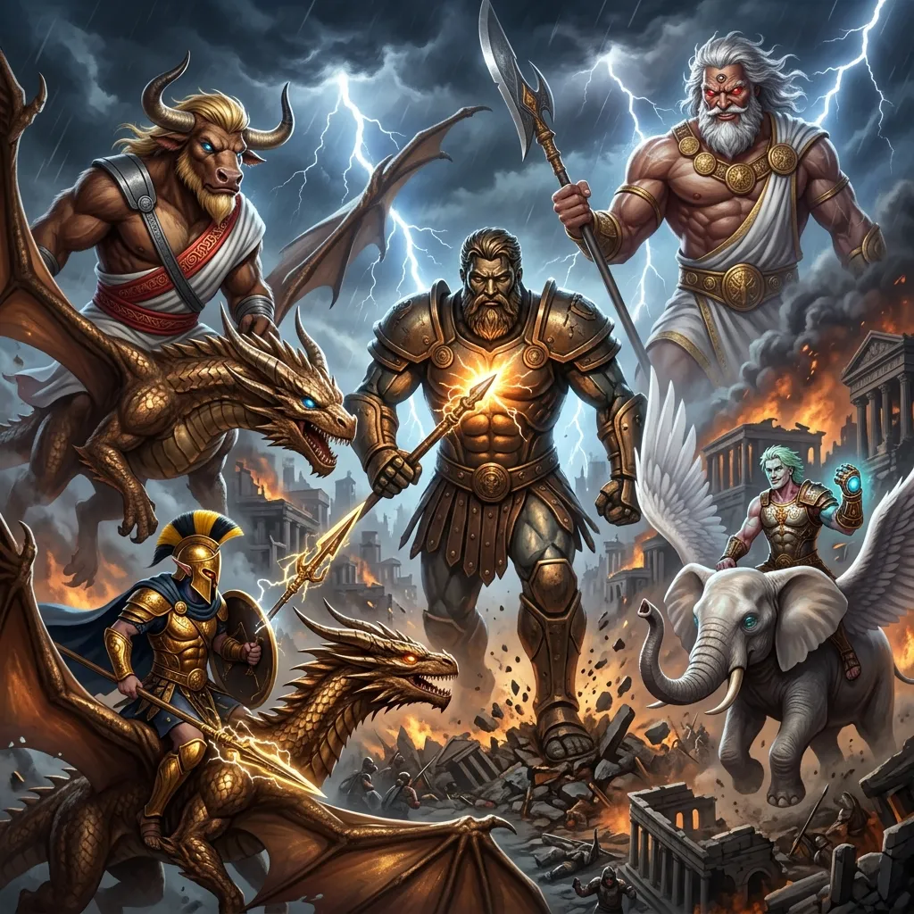
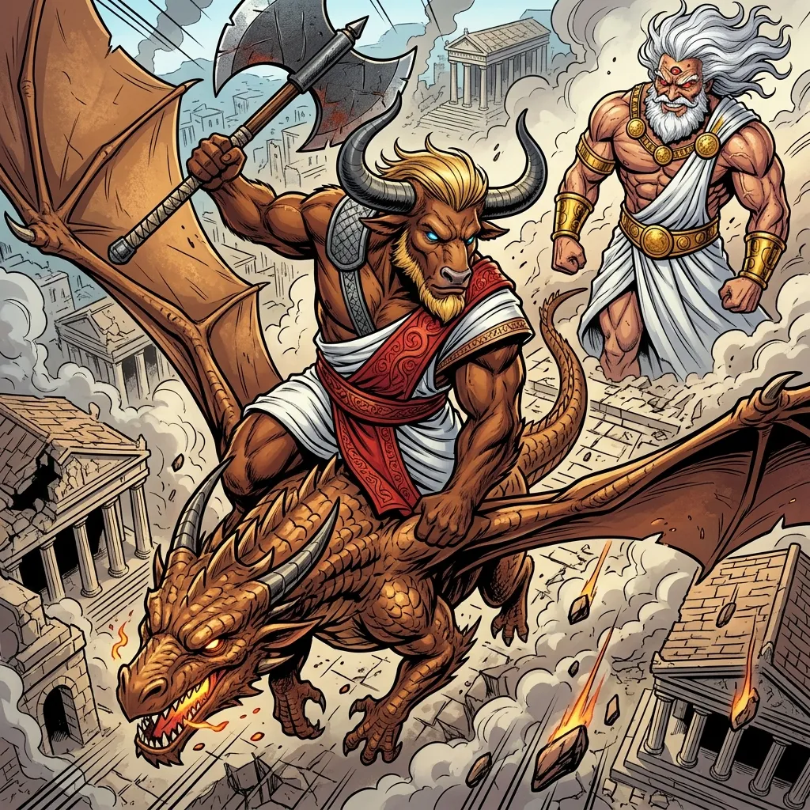
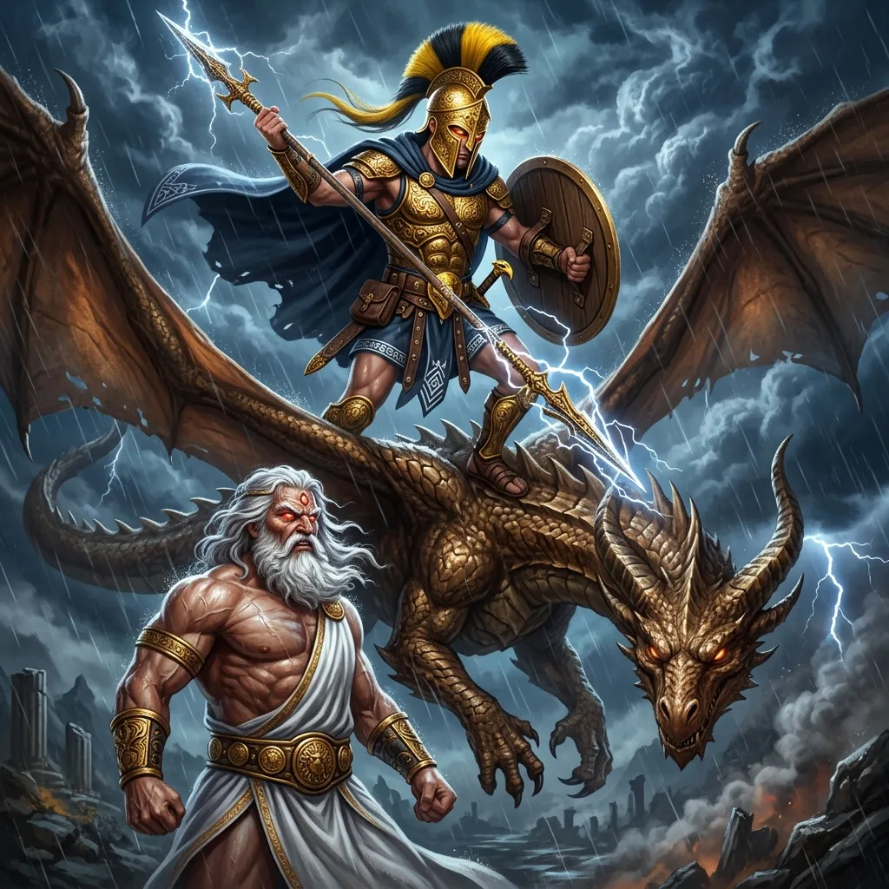
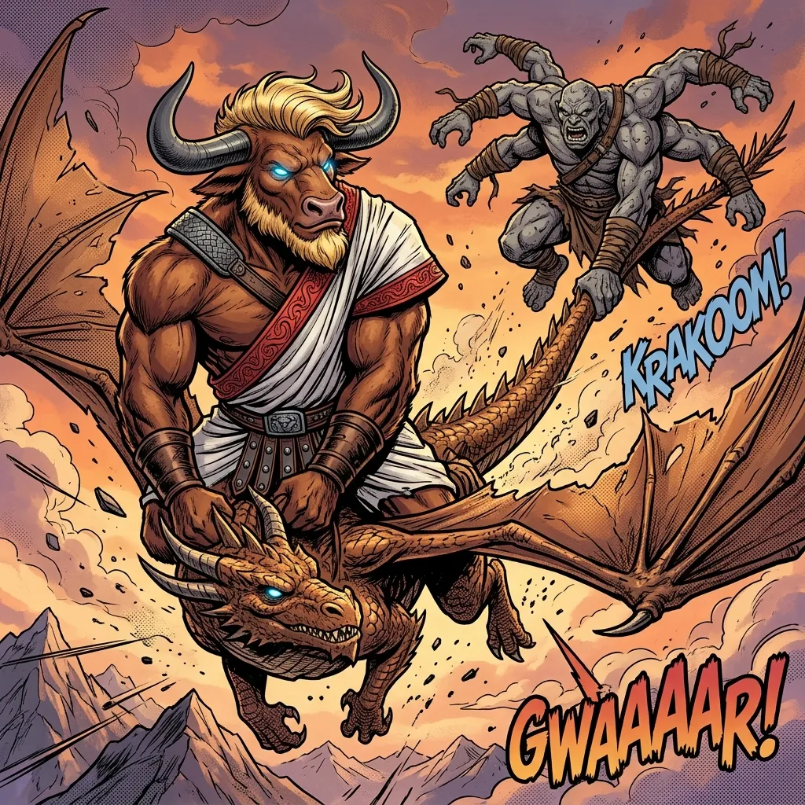
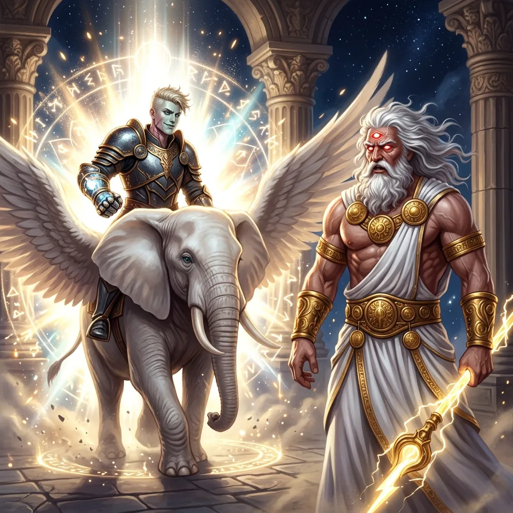

**Data:** 08.06.2026

## Podsumowanie

[Prompt](../assets/sessions/079/main_1.txt)

### Bóg Wojny i Smoczy Jeźdźcy na Linii Frontu

[Prompt](../assets/sessions/079/frontline_2.txt)

Nad zrujnowanymi ulicami **[[Mytros]]**, skąpanymi w dymie i pyle zniszczonych budynków, rozpościerał się widok budzący jednocześnie grozę i bezbrzeżny podziw. [[Bohaterowie Przepowiedni]], zjednoczeni w ostatecznym starciu o losy [[Thylea|Thylei]], dosiadali potężnych smoków, które swymi ogromnymi skrzydłami rozcinały gęste od bitewnego zgiełku powietrze. Wśród nich kroczył majestatyczny, ożywiony magią i wiarą **[[Kolos Pythora]]** – mechaniczny bóg wojny, w którego wnętrzu pulsowała potęga **[[Rod of Rulership|Berła Władzy]]**. Gigantyczny konstrukt, sterowany wespół z siłami drużyny, stawiał kroki, od których drżała ziemia, niosąc zagładę sługom [[Sydon|Pana Burz]]. Cel był jeden, a jego imię brzmiało **[[Sydon]]**. Władca Oceanów i Niebios znajdował się w pobliżu zrujnowanego [[Targ Rybny|Targu Rybnego]], otoczony przez gwardię latających minotaurów, cyklopów oraz potężnych [[Gyganie|Gyganów]]. [[Sydon|Tytan]], dzierżąc w dłoniach swoją straszliwą [[Glewia Sydona|glewię]], obserwował zbliżających się herosów z pogardliwym, mrożącym krew w żyłach uśmiechem, w pełni gotów na konfrontację.

Gdy tylko smoki zbliżyły się na odległość strzału, czas zdawał się zwolnić. **[[Arevon Elorrenthi]]**, elficki druid znany jako [[Epickie Ścieżki#The Seeking One (Poszukujący)|Poszukujący]], natychmiast sięgnął po kosmiczną magię, przybierając swoją lśniącą, Gwiezdną Formę. Jego sylwetka zapłonęła konstelacjami z odległych światów, rzucając mistyczne światło na spowite cieniem pole bitwy. W tym samym czasie **[[Orestes]]**, [[Orestes|Przeklęty Minotaur]], którego serce biło w rytm wojennych bębnów, poprowadził swojego smoka do szaleńczej szarży. Z furią w oczach i potężnym toporem w dłoni, wkrótce ruszył na **[[Sydon|Sydona]]**. Ciosy [[Orestes|Orestesa]], wzmocnione nadludzką furią barbarzyńcy, spadły na [[Sydon|Tytana]] jak grad meteorytów. Jednakże [[Sydon|Władca Burz]] ledwie drgnął, przyjmując uderzenia z arogancką pewnością siebie, która uświadomiła bohaterom, jak potężnym bytem jest uwolniony z okowów [[Przysięga Pokoju|Przysięgi Pokoju]] [[Sydon|Tytan]].

### Furia Niebios i Gniew Pana Burz

[Prompt](../assets/sessions/079/furia_1.txt)

Nieustraszony **[[Orion Xul]]**, Półbóg i dziedzic boskiej krwi [[Pythor|Pythora]], dostrzegł okazję w chaosie bitwy. Dosiadając brązowego smoka **[[Raspytrion|Raspytriona]]**, który podniósł go na dogodną wysokość, wycelował swoją legendarną włócznię w jednego z latających minotaurów, ośmielającego się zbliżyć do ich szyku. Celnym pchnięciem [[Orion Xul|Orion]] poważnie zranił bestię — choć ta, mimo upływu posoki, zdołała utrzymać się w powietrzu. Nie zważając na to, Półbóg z hardą miną wyciągnął ramię, celując grotem prosto w serce **[[Sydon|Sydona]]**. „Będziesz następny! Widzę strach w jego oczach!” – krzyknął, a w jego głosie pobrzmiewała obietnica ostatecznej zemsty. [[Sydon|Tytan]] nie okazał jednak ani cienia lęku, o którym mówił Półbóg. W odpowiedzi na jego słowa po obliczu [[Sydon|Władcy Burz]] przemknął jedynie lekki, pogardliwy uśmiezek, jakby cała brawura herosów była dla niego niczym więcej niż błahą rozrywką.

Brawura **[[Orestes|Orestesa]]** nie pozostała bez odpowiedzi. Za to, że [[Orestes|Przeklęty]] podleciał tak blisko [[Sydon|Władcy Burz]], spotkała go sroga kara — potężne uderzenie rozdarło powietrze z hukiem, który niemal zrzucił minotaura z siodła. Zbroja i ciało wojownika przyjęły straszliwe obrażenia, a jego wierzchowiec zachwiał się w locie. Jednakże [[Orestes|Przeklęty]], siłą samej tylko woli i zwierzęcego uporu, utrzymał się na grzbiecie smoka, choć jego oddech stał się płytki i rzężący. „Stary, trzymaj się. Dorwiemy dziada” – wycharczał do bestii, klepiąc [[Sybolkorax|Sybolkoraxa]] po karku. [[Sydon|Tytan]] pokazał właśnie ułamek swojej prawdziwej, nieokiełznanej potęgi.

### Ogień Czarodzieja i Żelazny Uścisk Gygana

[Prompt](../assets/sessions/079/fire_1.txt)

Słudzy [[Sydon|Tytana]] nie zamierzali biernie przyglądać się walce swojego pana. Jeden z cyklopów, stojący na pokładzie pobliskiego statku, złapał masywny głaz i cisnął nim w powietrze, celując w **[[Orestes|Orestesa]]** i jego smoka **[[Sybolkorax|Sybolkoraxa]]**. Kamień z potężnym świstem przeciął powietrze, lecz chybił, roztrzaskując się gdzieś w ruinach. Mniej szczęścia gad miał chwilę później: ogromny [[Gyganie|Gygan]], dysponujący nienaturalną siłą, wzbił się w powietrze i pochwycił ogon **[[Sybolkorax|Sybolkoraxa]]** w potężny, miażdżący uścisk. Bestia ryknęła z bólu i frustracji, gdy wieloręki potwór przygwoździł ją w miejscu, drastycznie ograniczając mobilność drużyny. Tymczasem jeden ze sług ostrzeliwujących drużynę z pokładu statku wypuścił skoncentrowany promień energii, który uderzył z trzaskiem w pancerz **[[Kolos Pythora]]**, sprawdzając wytrzymałość starożytnej machiny.

Na ten akt agresji błyskawicznie odpowiedział **[[Felicjan Janus Twardowski]]**. Jego magiczny duplikat, pieszczotliwie zwany **[[Klonicjan|Klonicjanem]]** rzucił zaklęcie przyspierzenia (Haste) na kolosa i pokierował go do ataku, precyzyjnie dźgając **[[Sydon|Sydona]]** włócznią. Prawdziwy [[Epickie Ścieżki#The Gifted One (Utalentowany)|Utalentowany]], widząc zmagania na dole, splótł dłonie w skomplikowanych gestach i wyrzekł słowa prastarej inkantacji. W ułamku sekundy wokół rzucającego głazami cyklopa wykwitła gigantyczna, rycząca **Ściana Ognia (Wall of Fire)**. Płomienie buchnęły w górę na kilkadziesiąt stóp, paląc wszystko na swojej drodze i zamykając sługę [[Sydon|Tytana]] w piekielnym więzieniu, z którego nie było łatwej ucieczki.

### Konfrontacja Wiecznego i Cienie Przeszłości

[Prompt](../assets/sessions/079/confrontation_1.txt)

[Prompt](../assets/sessions/079/confrontation_2.txt)

Podczas gdy żywioły szalały na polu bitwy, **[[Versir]]**, znalazł się w opałach — jego wierny wierzchowiec, **[[Trąba|Tromba]]**, wciąż tkwił spętany nienaturalnymi wirami powietrza z poprzedniej rundy. Nie tracąc rezonu, Versir przywołał potężne zaklęcie Leczenia Ran (Cure Wounds), kierując uzdrawiającą energię na samego siebie; mocą swego boskiego dziedzictwa ta sama fala mistycznego światła zasklepiła również rany **[[Trąba|Tromby]]**, przywracając wierzchowca do pełni sił. Wzmocniony, Versir wykorzystał mistyczną więź i teleportował się wraz z [[Trąba|Trombą]] tuż przed oblicze samego [[Sydon|Władcy Burz]]. Powietrze wokół nich zgęstniało od magii, gdy Versir dwukrotnie ciął [[Sydon|Tytana]] swym ostrzem, a następnie spojrzał mu prosto w oczy. „Inaczej cię zapamiętałem, Sydonie” – przemówił spokojnym, lecz stanowczym głosem, który przebił się przez zgiełk bitwy. „Powiedz mi, dlaczego tak bardzo nienawidzisz śmiertelników?”.

**[[Sydon]]**, zamiast wpaść w furię, odpowiedział mu jedynie chłodnym, przepełnionym arogancją tonem. „To ostrze już raz zawiodło, chłopcze” – wycedził [[Sydon|Tytan]], patrząc na broń [[Versir|Versira]]. „Ja wciąż tu stoję”. Mimo całej buty [[Sydon|Władcy Oceanów]] cios niósł ze sobą klątwę, która odcięła [[Sydon|Tytana]] od jakiegokolwiek uzdrowienia. Sydon nie pozostawał jednak bierny — wykorzystując swą tytaniczną szybkość, wyprowadził błyskawiczne cięcie potężną [[Glewia Sydona|glewią]], które dosięgło smoka **[[Raspytrion|Raspytriona]]**. Ostrze rozdarło powietrze z ogłuszającym trzaskiem, wyrywając z gada bolesny ryk, lecz bestia zdołała utrzymać się w locie i nie legła pod naporem uderzenia.

> [!warning] Sesja przerwana
> Starcie z Sydonem nie zostało rozstrzygnięte. Tuż po pierwszej rundzie mistrz gry musiał nagle odejść w poszukiwaniu zaginionego kota — i już nie wrócił do gry. Pojedynek z Władcą Burz zostanie kontunuowany na następnej sesji.

## Kluczowe wydarzenia / decyzje

* Skoordynowany atak [[Bohaterowie Przepowiedni|Bohaterów Przepowiedni]] na [[Sydon|Sydona]] przy użyciu smoków i [[Kolos Pythora|Kolosa Pythora]].
* [[Gyganie|Gygan]] unieruchamia smoka [[Sybolkorax|Sybolkoraxa]], chwytając go za ogon; cyklop chybia głazem rzuconym w [[Orestes|Orestesa]].
* [[Felicjan Janus Twardowski|Felicjan Twardowski]] neutralizuje cyklopa za pomocą Ściany Ognia, podczas gdy jego duplikat ([[Klonicjan]]) nęka [[Sydon|Tytana]] sterując [[Kolos Pythora|Kolosem]].
* [[Versir]] leczy siebie i [[Trąba|Trombę]], teleportuje się przed oblicze [[Sydon|Sydona]], zadaje mu dwa cięcia (klątwa odcinająca [[Sydon|Tytana]] od uzdrowień) i prowadzi z nim napięty dialog o przeszłości.
* [[Sydon]] dotkliwie rani smoka [[Raspytrion|Raspytriona]] uderzeniem [[Glewia Sydona|glewii]] (akcja legendarna), lecz gad utrzymuje się w powietrzu.
* Sesja przerwana po pierwszej rundzie — mistrz gry odszedł w poszukiwaniu zaginionego kota i nie wrócił; starcie pozostaje nierozstrzygnięte.

## Pamiętne Cytaty

* [[Orion Xul|Orion]]: "Tylko wskazuję palcem na Sydona i mówię, będziesz następny. Ale widzę strach w jego oczach."
* [[Versir]]: "Powiedz mi Sydonie, dlaczego ty nienawidzisz tak bardzo śmiertelników?"
* Dungeon Master ([[Sydon]]): "To ostrze już raz zawiodło, chłopcze. Ja wciąż stoję."
* [[Felicjan Janus Twardowski|Felicjan]]: "Lepiej statek niż my."
* [[Arevon Elorrenthi|Arevon]]: "Minotaur lata?"
* [[Arevon Elorrenthi|Arevon]]: "Nienawidzę być pierwszy."
* [[Orestes]]: "Stary, trzymaj się. Dorwiemy dziada."

## Postacie Niezależne (NPC)

* [[Sydon]]
* [[Raspytrion]]
* [[Sybolkorax]]
* [[Trąba|Tromba]]
* [[Klonicjan]]

## Lokacje

* [[Mytros]]

## Przedmioty

* [[Kolos Pythora]] (potężny mechaniczny konstrukt sterowany przez drużynę)
* [[Rod of Rulership|Berło Władzy]] (artefakt zasilający wnętrze Kolosa)
* [[Glewia Sydona]] (straszliwa broń Tytana)
