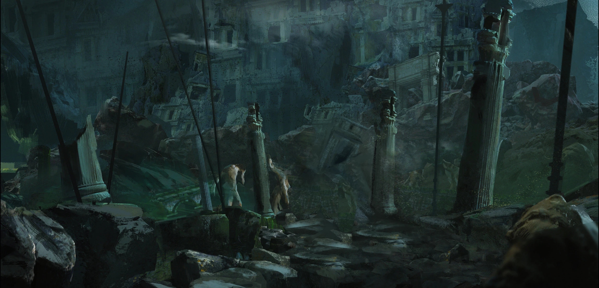

# Sesja 8: Ścieżka Umarłych

**Data:** 11.03.2024

## Podsumowanie

Bohaterowie wyruszyli do [[Nekropolia w Telamok|Telamok]], aby zdobyć broń [[Smoczy Lordowie|Smoczych Lordów]]. Po drodze spotkali jeźdźca na srebrnym smoku, [[Gaius|Commandera Gaiusa]], który ostrzegł ich przed kontynuowaniem misji. Następnie zostali zaatakowani przez hordę centaurów. Podczas wspinaczki natknęli się na skały w kształcie dłoni, zwane [[Ręce Kentimane|rękami Kentimane]]. Walczyli z harpiami, gryfami i Coldlight Walkerem. Dotarli do mauzoleum, gdzie spotkali tajemniczą postać strzegącą wejścia. Rozpoczęli eksplorację [[Nekropolia w Telamok|Nekropolii]], oglądając grobowce [[Smoczy Lordowie|Smoczych Lordów]].

## Kluczowe wydarzenia / decyzje

* Spotkanie z [[Gaius|Commanderem Gaiusem]] i atak centaurów.
* Odkrycie [[Ręce Kentimane|rąk Kentimane]].
* Walka z harpiami, gryfami i Coldlight Walkerem.
* Dotarcie do mauzoleum i spotkanie z tajemniczą postacią ([[Damon]]).
* Rozpoczęcie eksploracji [[Nekropolia w Telamok|Nekropolii]].

## Postacie Niezależne (NPC)

* [[Gaius|Commander Gaius]]
* [[Damon]]

## Lokacje

* [[Nekropolia w Telamok|Telamok]]
* [[Ścieżka Umarłych]]

## Szczegółowy opis wydarzeń

Bohaterowie wyruszyli w niebezpieczną podróż do [[Nekropolia w Telamok|Telamok]], aby zdobyć broń [[Smoczy Lordowie|Smoczych Lordów]]. Ubrali się w ciepłe ubrania, przygotowując się na śnieg na szczycie góry. Mieli ze sobą [[Burnished Dragonlord Coin]] dla [[Damon|Damona]], strażnika [[Nekropolia w Telamok|Nekropolii]].

Podczas wspinaczki spotkali jeźdźca na srebrnym smoku, [[Gaius|Commandera Gaiusa]], który ostrzegł ich przed kontynuowaniem misji. Chwilę później zostali zaatakowani przez hordę centaurów z wymalowanym trzecim okiem na czole.

W dalszej drodze natknęli się na skały w kształcie dłoni, zwane [[Ręce Kentimane|rękami Kantimane]]. Dowiedzieli się, że miejsce to jest celem pielgrzymek dla ludzi poszukujących odosobnienia. 

Bohaterowie musieli stawić czoła harpiom wabiącym swoje ofiary, gryfom i Coldlight Walkerowi. W końcu dotarli do mauzoleum, gdzie na moście spotkali samotną, tajemniczą postać. Za nim znajdowała się tabliczka z napisem: "Idź, powiedz niebu i otchłani, ty, który przechodzisz obok, że tutaj, wbrew ich prawom, leżymy."

Bohaterowie rozpoczęli eksplorację [[Nekropolia w Telamok|Nekropolii]], oglądając grobowce [[Smoczy Lordowie|Smoczych Lordów]]: [[Telamok Arkelander|Telamoka Arkelandera]], [[Dorion Neurdagon|Doriona Neurdagona]], [[Estor Arkelander|Estora Arkelandera]], [[Adonis Neurdagon|Adonisa Neurdagona]], [[Rizon Phobas|Rizona Phobasa]], [[Cosmo|Cosmo Phobasa]], [[Nicholas Phobas|Nicholasa Phobasa]], [[Gregor Huorath|Gregora Huoratha]], [[Myrto Wspaniały|Myrto Wspaniałego]], [[Isadore Huorath|Isadore'a Huoratha]], [[Lyssis Arkelander|Lysisa Arkelandera]] i [[Ochos Arkelander|Ochosa Arkelandera]].
