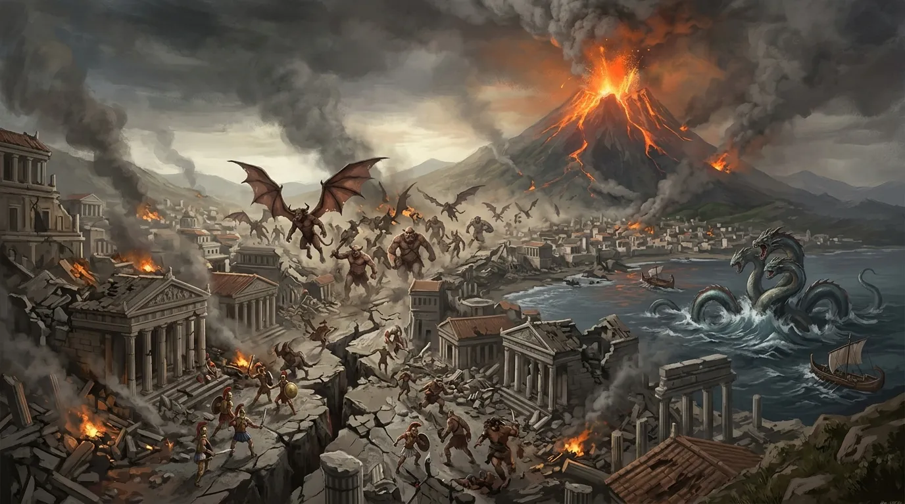
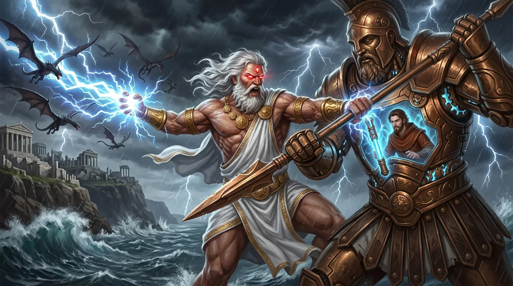
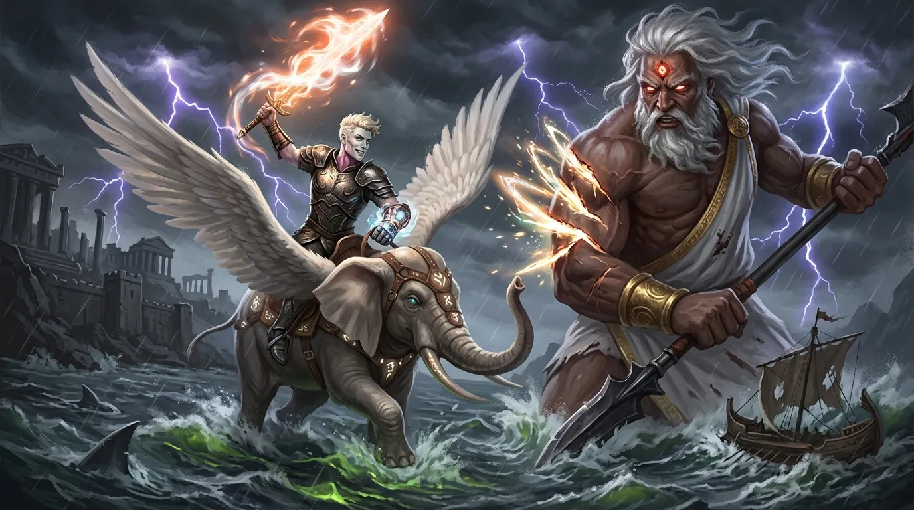
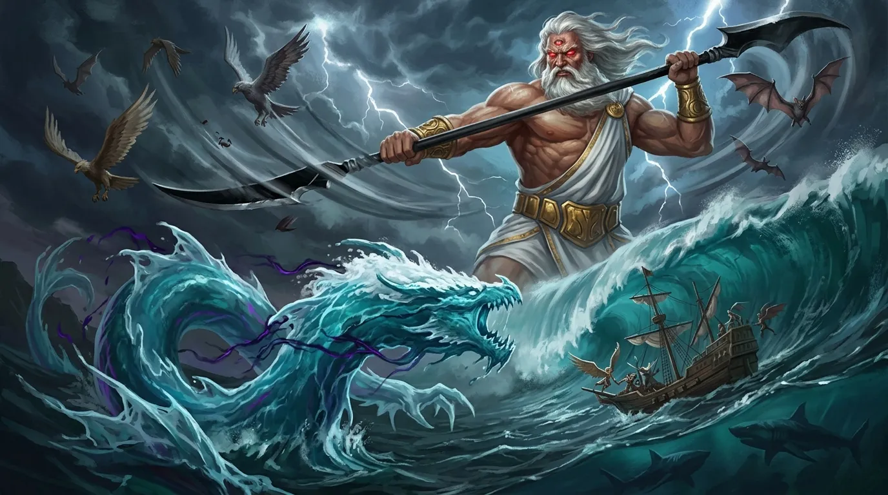
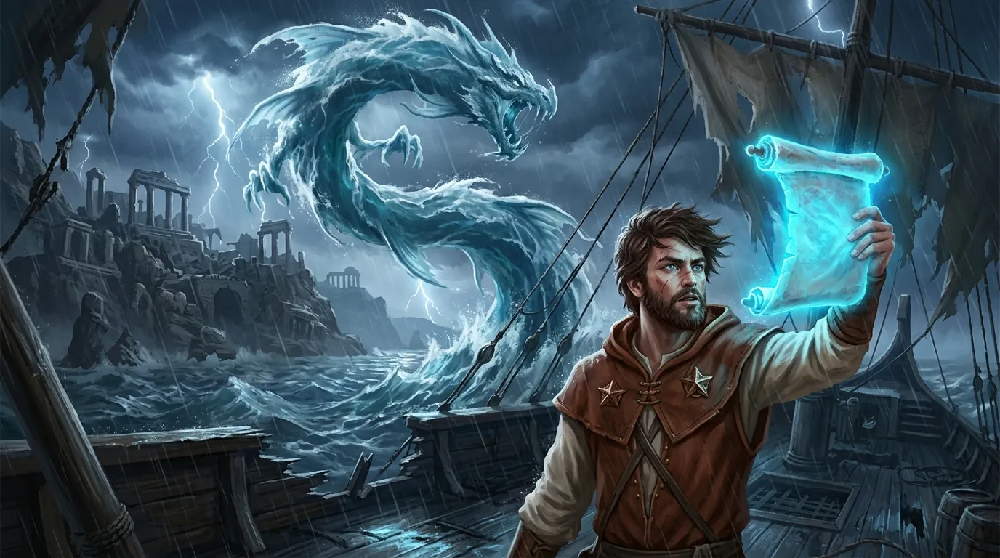
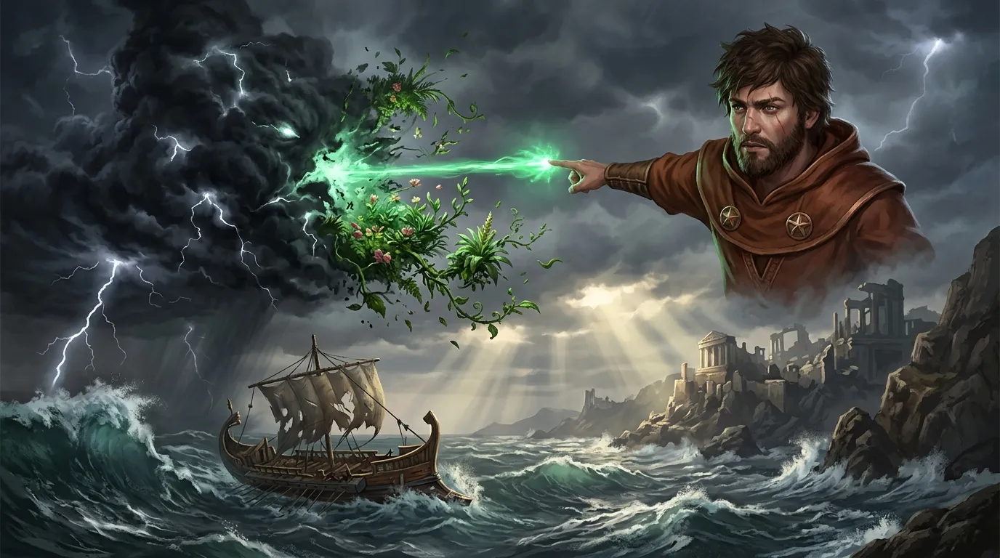
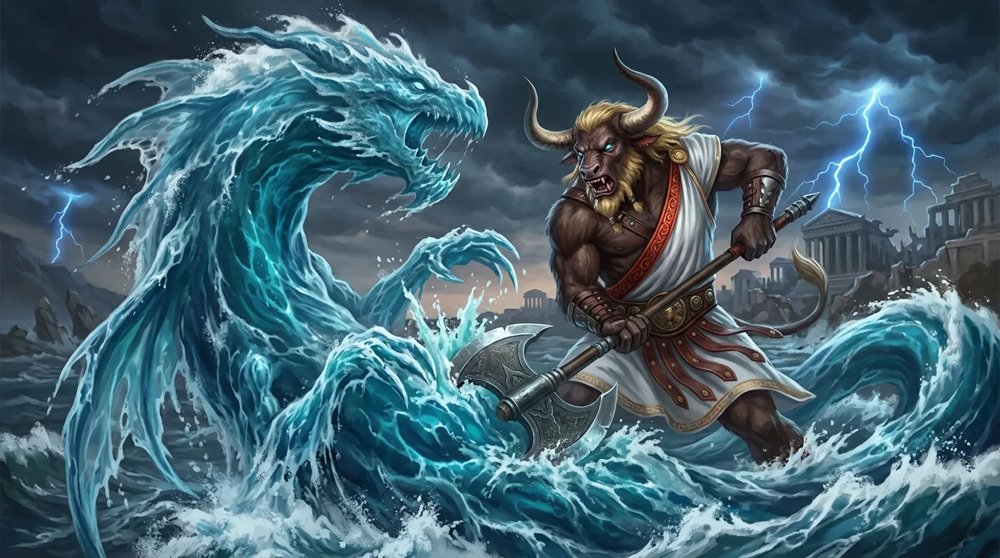
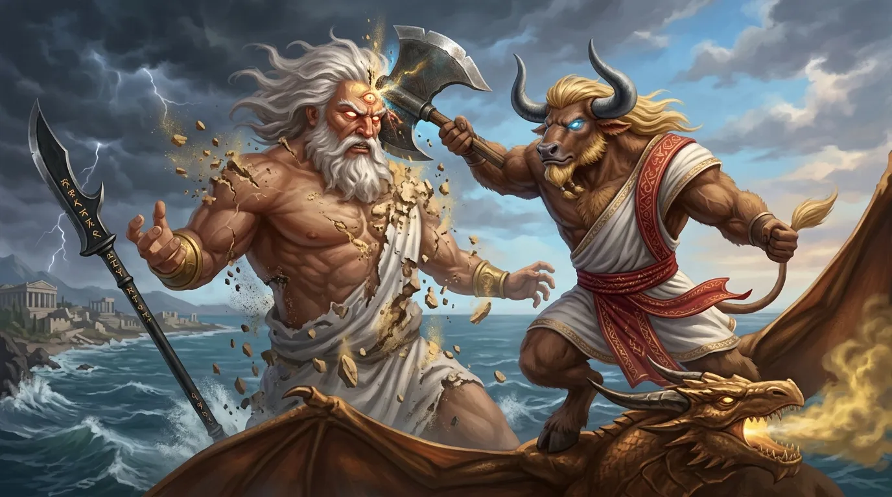
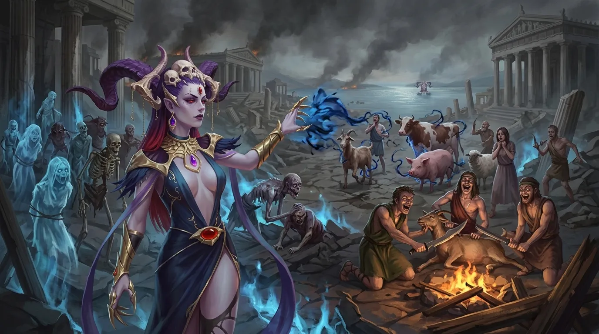

**Data**: 07.07.2026

[Prompt](../assets/sessions/080/tapniecie_mount_volkan_1.txt)

## Podsumowanie

### Powietrzna Ofensywa Smoków i Odwet Sydona

[Prompt](../assets/sessions/080/odwet_sydona_2.txt)

Bitwa o [[Mytros]] wciąż szalała nad wzburzonymi wodami zatoki u wybrzeży miasta, gdzie z odmętów wyłaniało się gigantyczne, zatopione oblicze **[[Sydon|Sydona]]**, Władcy Burz. Rozwścieczona smoczyca **[[Nephele (Smok)|Nephele]]** jako pierwsza przypuściła atak, zionąc w Tytana potężną falą przenikliwego mrozu, która owinęła jego postać lodowatym całunem. Chwilę później **[[Arevon Elorrenthi]]**, czerpiąc z magii smoczej przemiany, cisnął we wroga falą czystej, niszczycielskiej energii. Do ofensywy dołączyła smoczyca **[[Arkyrania]]**, dosiadana przez **Arevona**, przecinając przestrzeń oślepiającą linią błyskawic wymierzoną prosto w giganta. Nie pozostał w tyle **[[Orestes]]**, który dosiadając **[[Sybolkorax|Sybolkoraxa]]** podleciał bliżej i wspólnie ze swoim skrzydlatym wierzchowcem obrócił zionięcie przeciwko otaczającym ich sługom Tytana.

**Sydon** odpowiedział zimną furią, ciskając kataklizmiczne pociski energii, które dotkliwie poraziły jego smoczych prześladowców. W tym samym czasie **[[Kolos Pythora]]**, sterowany przez **[[Klonicjan|Klonicjana]]**, wyprowadził potężne pchnięcie swą gigantyczną włócznią, przebijając obronę Tytana i głęboko go raniąc. Zirytowany bliskością nieustępliwego konstruktu, który krok w krok podążał za nim, Władca Burz wezwał wiatry i wzbił się wysoko w powietrze, hen poza zasięg ramion olbrzyma. Wcześniej jeszcze **[[Felicjan Janus Twardowski]]** posłał w jego stronę chromatyczną kulę energii — ta jednak rozprysła się w powietrzu, nie dosięgając celu.

### Szarża Versira i Furia Orestesa na Wodach Mytros

[Prompt](../assets/sessions/080/szarza_versira_1.txt)

**[[Versir]]** kontynuował bezlitosne natarcie, dosiadając swego wierzchowca **[[Trąba|Trąby]]**. Skrzydlaty hefalump raz za razem uderzał w Tytana z niesłabnącą zaciekłością, a sam mag bitewny nasycił ostrze **[[Zguba Tytanów|Zguby Tytanów]]** żywym ogniem i wyprowadził serię świetlistych, radiantnych cięć, które rozdarły cielsko **[[Sydon|Sydona]]**. Władca Burz odpłacił mściwym wyładowaniem błyskawic, którego pełną moc **Versir** przyjął na siebie, nie ustępując. Widząc rany sojusznika, **[[Arevon Elorrenthi|Arevon]]** przybrał gwiezdną formę Kielicha i uleczył **Versira** kojącą magią, która dzięki mistycznej więzi łączącej jeźdźca z wierzchowcem zregenerowała również siły **Trąby**. Druid dopełnił turę kolejnym uderzeniem smoczej energii wymierzonym we wroga.

Zdesperowany **Sydon** spróbował zamachnąć się swą czarną **[[Glewia Sydona|Glewią]]** na **Trąbę**, lecz cios całkowicie chybił — ani rekiny, ani sam Tytan nie zdołali dosięgnąć nietykalnego rumaka. Tymczasem niżej, tuż nad falami roiącymi się od krwiożerczych rekinów, **[[Orestes]]** postanowił wyładować gniew na jednym z nich. Minotaur chwycił **[[Topór Xandera]]** i runął na gigantycznego rekina, wyprowadzając serię brutalnych, druzgocących cięć, które dosłownie rozsiekły morską bestię na strzępy. W tym momencie **Sydon** przywołał żywiołowy sztorm, z którego zaczął spływać palący, rujnujący deszcz, dosięgający zarówno smoków, jak i bohaterów.

### Kwasowa Ulewa i Gniew Władcy Burz

[Prompt](../assets/sessions/080/gniew_wladcy_burz_2.txt)

Nad polem bitwy wciąż wisiała mroczna chmura pierwotnej energii, z której lał się deszcz płonącego kwasu. **[[Versir]]**, jego wierzchowiec **[[Trąba]]** oraz **[[Arevon Elorrenthi|Arevon]]** znaleźli się w samym sercu tego niszczycielskiego zjawiska. Żrąca ulewa dosięgła magicznego rumaka najboleśniej — by nie pozwolić, aby kwas przywarł do **Trąby** i palił ją w nieskończoność, **Versir** rozwiał więź ze swoim wierzchowcem i runął kilkadziesiąt stóp w dół, twardo lądując na pokładzie **[[Tranquility]]**. **Arevonowi** udało się przetrwać najgorsze skutki opadu. W tym czasie **[[Orion Xul]]** skupił się na gigantycznych rekinach okrążających statek: ciskając **[[Odkupienie Pythora|Odkupieniem Pythora]]**, które za każdym razem magicznie wracało do jego dłoni, raz za razem przebijał cielsko bestii, aż dobił ją ciosem tępego końca włóczni. Widząc rany sojuszników, **Arevon** otoczył **[[Orestes|Orestesa]]** i **Versira** ochronną, życiodajną energią, wzmacniając ich przed nadchodzącymi ciosami.

**[[Sydon]]** nie pozostał dłużny. Władca Burz wyprowadził potężne cięcie swą czarną glewią, raniąc **Orestesa**, po czym wzniecił gwałtowne prądy powietrzne, które odbierały siłę skrzydłom wszystkich latających istot w pobliżu. **Arevon** oraz smoczyca **[[Arkyrania]]** straciły równowagę i runęły w dół. **[[Kolos Pythora]]** kontynuował nieustępliwy szturm, wbijając w Tytana swą ogromną włócznię, podczas gdy **[[Felicjan Janus Twardowski|Felicjan]]** cisnął w **Sydona** kulą żywiołowej energii, tym razem trafiając w cel. Niezrażony upadkiem **Versir** przyzwał na nowo swojego wierzchowca, tym razem w niebiańskiej, promiennej postaci **Trąby**, i natychmiast wrócił do walki. **Sydon**, rozdrażniony smokiem, który wczepił się w jego cielsko, jednym zamachem glewii zranił **[[Sybolkorax|Sybolkoraxa]]**. Chwilę później smoczyca **[[Nephele (Smok)|Nephele]]** owiała mroźnym zionięciem zarówno Tytana, jak i wiszącą nad pokładem burzową chmurę. W tym samym czasie **Orion** dostrzegł pod powierzchnią wody gigantyczny cień płynący szybko od strony miasta. Był to potężny **[[Lewiatan]]**, który zmierzał do bitwy, by wesprzeć Władcę Burz. Chwilę później bestia wyłoniła się z głębin i wzburzyła gigantyczną falę pływową, która runęła na **Oriona**, **Orestesa**, **Felicjana** i **Kolosa**. **Orion** resztką woli utrzymał się na nogach pod naporem miażdżącej wody.

### Odwrócona Grawitacja i Zionięcia Smoków

[Prompt](../assets/sessions/080/odwrocona_grawitacja_1.txt)

**[[Arevon Elorrenthi|Arevon]]**, korzystając z aktywnej od początku walki smoczej przemiany (*Draconic Transformation*), znajdował się na grzbiecie **[[Arkyrania|Arkyranii]]** i zionął niszczycielską energią, starając się dosięgnąć Władcy Burz. Wtedy **[[Orestes]]**, ignorując niebezpieczeństwo, zaszarżował na **[[Sydon|Sydona]]** z **[[Topór Xandera|Toporem Xandera]]** i zadał mu brutalny cios; każde trafienie w cielsko Władcy Burz wyzwalało jednak mściwe wyładowania elektryczne, które raziły napastnika. Burzowa chmura przestała lać deszczem i zaczęła ciskać pierwotnymi gromami — najpierw raniąc **Arkyranię** i **[[Versir|Versira]]**, a potem uderzając żywiołowym ciosem w **Arevona**, który w porę zasłonił się barierą magicznej siły, oraz w **Versira**, który zwinnie wymknął się trafieniu. **[[Orion Xul|Orion]]** w tym czasie precyzyjnym rzutem dobił ostatniego z wielkich rekinów. **Sydon** odpowiedział gradem pocisków niszczycielskiej energii oraz przywołaną burzą, która raziła **[[Kolos Pythora|Kolosa]]**, **[[Nephele (Smok)|Nephele]]** i **Versira**, podczas gdy **Kolos** wbił włócznię w cielsko **[[Lewiatan|Lewiatana]]**, ciężko go raniąc. Szukając sposobu na unieszkodliwienie wodnej bestii, **[[Felicjan Janus Twardowski|Felicjan]]** odczytał magiczny zwój i odwrócił grawitację — potężny **Lewiatan** został bezradnie wyrwany z wody i uniesiony wysoko w powietrze, a **[[Klonicjan]]** spłynął łagodnie dzięki magii spowalniającej upadek.

Wykorzystując zamęt, **[[Versir]]** na grzbiecie **[[Trąba|Trąby]]** natarł na **Sydona** i uwolnił w jego stronę serię ognistych promieni — istny grad płonącej energii, który zalał Tytana świetlistym żarem i zadał mu ogromne obrażenia. Zaraz potem sięgnął po **[[Zguba Tytanów|Zgubę Tytanów]]**, a każde cięcie klingi wypalało w ciele Władcy Burz rany, które nie chciały się już zasklepić, dławiąc jego nadprzyrodzoną zdolność do regeneracji. Mimo świętego ognia i mroźnych zionięć sprzymierzonych smoków **Sydon** wciąż stał na nogach, a wokół niego szalał żywioł burzowej chmury, gotów odpowiedzieć kolejnymi wyładowaniami.

### Podmuch Tytana i Śmierć Nephele

[Prompt](../assets/sessions/080/smierc_nephele_2.txt)

**[[Arevon Elorrenthi|Arevon]]**, krążąc w powietrzu na grzbiecie **[[Arkyrania|Arkyranii]]**, nękał przeciwników swoimi atakami, lecz zarówno **[[Sydon]]**, jak i szalejący wokół niego burzowy żywiołak w większości oparli się jego furii. Bohaterowie raz po raz okładali samą burzową chmurę, choć magiczne ostrza z trudem chwytały jej nieuchwytną, elektryczną materię. Rozwścieczony Władca Burz uwolnił wówczas niszczycielski podmuch pierwotnej siły. Potężna fala uderzenia zepchnęła **[[Felicjan Janus Twardowski|Felicjana]]** wstecz, a **[[Versir|Versira]]** strąciła całkowicie z pokładu **[[Tranquility]]**, posyłając go prosto w spienione fale zatoki. W tej samej chwili magiczna anomalia grawitacyjna wygasła — potężny **[[Lewiatan]]**, dotychczas bezradnie zawieszony w powietrzu, runął ze stu stóp z powrotem w wodną głębię. **Sydon** kontynuował swój morderczy taniec z czarną **[[Glewia Sydona|Glewią Sydona]]**, lecz w obronie bohaterów stanął **[[Kolos Pythora]]**, przebijając Tytana swą gigantyczną włócznię. Wściekły Tytan skupił całą swoją furię na smoczycy **[[Nephele (Smok)|Nephele]]** – po potężnym uderzeniu, które ją powaliło, Władca Burz bezlitośnie ją dobił, uśmiercając na miejscu. Martwe ciało smoczycy dryfowało w kierunku plaży. Widząc to, **Felicjan** gorączkowo analizował możliwości leczenia i zabezpieczenia jej zwłok, lecz w obliczu szalejącego sztormu musiał skupić się na walce. Chwilę później wyładowania z przyzwanej przez Sydona burzy uśmierciły również niebiańskiego wierzchowca **Versira**, **[[Trąba|Trąbę]]**.

Unoszący się w powietrzu **Felicjan** wycelował palec w nadwątlonego burzowego żywiołaka i wypowiedział słowa potężnego zaklęcia dezintegracji. Cienki, szmaragdowy promień trafił idealnie w cel, obracając chmurę w nicość. W akcie śmierci żywiołak eksplodował burzliwym wybuchem stworzenia — w miejscu jego zgonu wykiełkowała bujna roślinność, jednak owa cudowna eksplozja życia rozegrała się osiemdziesiąt stóp nad pokładem i nie zdołała uleczyć nikogo na statku. Tymczasem w wodzie **Versir**, nie zważając na upadek i utratę wierzchowca, błyskawicznie przywołał kolejną, trzecią już inkarnację **Trąby**. Dosiadłszy jego grzbietu, zaszarżował po falach prosto na **Sydona**, tnąc go **[[Zguba Tytanów|Zgubą Tytanów]]** i pozostawiając na ciele boga świetliste rany. Triumf trwał jednak krótko — z głębin wynurzył się **Lewiatan**. Morska bestia uderzyła w **Versira** swym masywnym cielskiem, oblewając go żrącym kwasem, który mag bitewny zdołał częściowo zneutralizować ochronnym zaklęciem. Chwilę później potwór poprawił miażdżącym ciosem ogona, podczas gdy na pokładzie **Sydon** ponownie zamachnął się swą mroczną glewią — a **Versir**, oszołomiony, wysunął się z siodła i bezwładnie zawisł na powierzchni wody.

### Magia Gwiazd i Zguba Lewiatana

[Prompt](../assets/sessions/080/zguba_lewiatana_2.txt)

Widząc rannych sojuszników, **[[Arevon Elorrenthi]]** przybrał świetlistą, gwiezdną formę i posłał ku towarzyszom uzdrawiającą magię, przywracając unoszącego się na falach **[[Versir|Versira]]** do przytomności. Następnie cisnął w **[[Sydon|Sydona]]** drobiną gwiezdnego światła. Władca Burz odpowiedział natychmiast, ciskając niszczycielski pocisk energii — nie w samego druida, lecz prosto w jego smoczą towarzyszkę, **[[Arkyrania|Arkyranię]]**. Walka w zwarciu nie ustawała: **[[Orestes]]** z furią uderzył Tytana **[[Topór Xandera|Toporem Xandera]]**, podczas gdy **[[Orion Xul]]** raz za razem ciskał z dystansu swą powracającą bronią, **[[Odkupienie Pythora|Odkupieniem Pythora]]** — choć błyskawice, którymi próbował razić boga, spływały po Panu Burz bez najmniejszego skutku. **Sydon**, niewzruszony, otoczył się trzaskającą aurą żywiołowej burzy, a starcie na wzburzonym morzu wciąż trwało w najlepsze.

**[[Kolos Pythora]]** kontynuował natarcie, wbijając swą gigantyczną włócznię głęboko w cielsko **Sydona** i zadając mu potężne rany. Tytan nie pozostawał dłużny — cisnął w **Orestesa** kolejnym kataklizmicznym pociskiem, który zdruzgotał obronę minotaura i strącił go z powrotem w spienioną wodę. **Versir** zareagował błyskawicznie, splatając rozdwojoną moc leczącą, która jednocześnie odnowiła siły jego i **Orestesa**. W tej samej chwili wynurzający się z odmętów **[[Lewiatan]]** runął na minotaura, miażdżąc go swoim cielskiem i smagając ogonem ociekającym żrącym kwasem. **Arevon**, widząc, jak krucho wygląda sytuacja, uwolnił szeroką falę uzdrawiającej energii, która obmyła całą drużynę wraz ze smoczycą **Arkyranią** oraz **[[Sybolkorax|Sybolkoraxem]]**, po czym zionął w morską bestię smoczą mocą. Wpadłszy w szał, **Orestes** dopłynął do **Lewiatana** i wyprowadził morderczą serię lekkomyślnych cięć **Toporem Xandera**. Ostrze, którego przeznaczeniem jest niszczenie olbrzymów i tytanów, zagłębiało się raz za razem, aż brutalne uderzenia ostatecznie zakończyły żywot potwora. Triumfujący minotaur natychmiast wskoczył na grzbiet **Sybolkoraxa** i z okrzykiem ruszył z powrotem w stronę **Sydona**.

### Ostrza, Błyskawice i Śmierć Władcy Burz

[Prompt](../assets/sessions/080/smierc_wladcy_burz_2.txt)

Starcie z Władcą Burz wchodziło w decydującą fazę. **[[Orion Xul|Orion]]** raził Tytana ciskaną i powracającą do dłoni bronią, lecz każde trafienie prowokowało **[[Sydon|Sydona]]** do mściwej riposty — wyładowanie elektryczne uderzało zwrotnie w wojownika, choć ten zdołał złagodzić jego siłę. Chwilę później Tytan zamachnął się swą potężną **[[Glewia Sydona|Glewią Sydona]]** i dwukrotnie ciął **[[Sybolkorax|Sybolkoraxa]]**, ogłuszając smoka w locie. **[[Versir]]** dopadł wroga, tnąc go **[[Zguba Tytanów|Zgubą Tytanów]]**, po czym przyśpieszonym zaklęciem wypaczającym przestrzeń przeniósł **[[Volkan|Volkana]]** o dobre kilkadziesiąt kroków na północ, z dala od wiru walki. **Sydon** odpowiedział przywołaniem lokalnej burzy z piorunami, która spadła na **Versira**, **[[Orestes|Orestesa]]** i **[[Klonicjan|Klonicjana]]**. **[[Arevon Elorrenthi|Arevon]]** ponownie zionął w Tytana smoczą energią, a gdy ten uchylił się przed falą, cisnął weń świetlistym pociskiem, znacząc cel jaskrawym blaskiem, który miał otworzyć drogę następnemu ciosowi. Wykorzystując ten moment, szarżujący na smoczym grzbiecie **Orestes** zamierzył się toporem prosto w twarz **Sydona**.

Unosząc się w powietrzu tuż nad taflą wody, **Orestes** wziął potężny zamach **[[Topór Xandera|Toporem Xandera]]**, by zadać ostateczny cios. Minotaur wymierzył uderzenie z chirurgiczną precyzją, trafiając prosto w czoło Tytana. Ostrze zagłębiło się z niszczycielską siłą, idealnie rozcinając trzecie oko **Sydona** i zatrzymując się dopiero w połowie jego nosa. Ciało Władcy Burz nie wytrzymało tego uderzenia. Zaczęło rozpadać się od środka, warstwa po warstwie, niczym chmura rozdzierana przez wiatr. Z potężnego Tytana został jedynie popiół i złoty pył, który rozwiał się na wietrze i opadł do morza, znikając bez śladu. Nienaturalna burza, która od wielu godzin dręczyła [[Mytros]], gwałtownie i przeciwnie do wszelkich praw natury zaczęła cichnąć. Zapadła głęboka cisza. **Sydon** został pokonany — Tytan padł, a po jego potędze pozostała jedynie porzucona, nietknięta **Glewia Sydona**.

### Koszmar Pani Śmierci

[Prompt](../assets/sessions/080/koszmar_lutherii_2.txt)

Z oddalonego miasta zaczęły dobiegać okrzyki triumfu. W chwilę po śmierci Władcy Burz okolicą wstrząsnęło jednak nagłe, potężne tąpnięcie i gwałtowne trzęsienie ziemi, a z oddalonego szczytu **[[Kuźnia Volkana|Mount Volkan]]** zaczął unosić się gęsty dym i płomienie. Pozbawione swojego wodza, część oddziałów armii **[[Sydon|Sydona]]** wpadła w popłoch i rzuciła się do ucieczki, choć w ulicach **[[Mytros]]** walka wciąż trwała, a ostatni wielki potwór morski wcale nie odpłynął, lecz nadal krążył w wodach zatoki, siejąc wokół zamęt. Radość ze zwycięstwa okazała się jednak boleśnie krótka. Ciszę przerwał inny dźwięk — upiorny śmiech. Na czele makabrycznego orszaku kroczyła **[[Lutheria]]**, dzierżąc swą kryształową kosę. Za nią wlokła się koszmarna świta rodem ze snu: nieumarli, spętane duchy i rzeczy bez nazwy. Tam, gdzie **Pani Śmierci** przechodziła, machnięciem dłoni zamieniała ocalałych z wojny w kozy, krowy i świnie. Tych, których oszczędziła, sam jej widok doprowadzał do obłędu. Padali na kolana, rycząc ze śmiechu, i rzucali się na przemienione bydło, ćwiartując zwierzęta, w których uwięzieni byli żołnierze i mieszczanie, by piec ich mięso na ogniskach rozpalonych z resztek własnych domów. Z bruku i gruzu powoli podnosili się zmarli, a szaleństwo pożerało miasto szybciej niż ogień — bohaterowie czuli je nawet z tej odległości. I wtedy z daleka spojrzenie **Lutherii** odnalazło ich na powierzchni wody, posyłając im nieme, mroczne zaproszenie. Śmierć była już blisko.

## Kluczowe wydarzenia

* Bohaterowie Przepowiedni kontynuują powietrzno-morskie starcie z Tytanem **Sydonem** nad wodami **Mytros** przy okręcie **Tranquility**, dosiadając smoków i sterując **Kolosem Pythora**.
* **Sydon** dobija smoczycę **Nephele**, której martwe ciało dryfuje ku plaży.
* **Sydon** przywołuje burzowego żywiołaka (chmurę) siejącego palącym kwasem i pierwotnymi gromami; kolejne inkarnacje niebiańskiego wierzchowca **Versira**, **Trąby**, giną jedna po drugiej.
* **Felicjan** odwraca grawitację magicznym zwojem, wyrywając **Lewiatana** z wody wysoko w powietrze, a później dezintegruje burzowego żywiołaka.
* **Orestes** zabija **Lewiatana** serią cięć **Toporem Xandera**.
* **Versir** przenosi **Volkana** w bezpieczne miejsce zaklęciem wypaczającym przestrzeń.
* **Orestes**, szarżując na smoczym grzbiecie, zadaje **Sydonowi** cios ostateczny — **Topór Xandera** rozcina trzecie oko Tytana; Władca Burz rozsypuje się w popiół i złoty pył. Śmierć boga wywołuje tąpnięcie i trzęsienie ziemi, a wulkan **Mount Volkan** budzi się do życia, plując dymem i ogniem.
* Zaraz po zwycięstwie przybywa **Lutheria** z koszmarną świtą, zamienia ocalałych mieszkańców w bydło i pogrąża miasto w obłędzie — sesja kończy się cliffhangerem.

## Cytaty

* [[Orestes]] (szarżując na Sydona): "Załatwiam lewiatana, wskakuję na Sybolkoraxa, lecę w kierunku SYdona i krzyczę: jesteś następny!"
* [[Orestes]] (cios ostateczny): "Biorę głęboki zamach i idealnie go przepoławiam. Walę mu prosto w czoło, przecinając to jego trzecie oko — i wbijam topór aż do połowy nosa."
* Dungeon Master (śmierć [[Sydon|Sydona]]): "Jego ciało rozpada się od środka, warstwa po warstwie, jak chmura rozdarta wiatrem. Zostaje tylko popiół i złoty pył, który rozwiewa się na wietrze i spada do morza. Sydon jest martwy. Zabiliście Tytana."
* Dungeon Master (nadejście [[Lutheria|Lutherii]]): "Na przedzie orszaku kroczy ona — Lutheria z kryształową kosą. Za nią wlecze się świta z koszmaru: nieumarli, spętane duchy, rzeczy bez nazwy."
* [[Felicjan Janus Twardowski|Felicjan]] (gdy Sydon ląduje tuż przed nim): "Przytulnie trochę. Cześć."
* [[Arevon]] (po śmierci Nephele): "Ona nie żyje. To jest RIP."
* [[Orestes]] (ostatnia szarża): "Lecimy, trzeba to kończyć. Do Sydona — hyc!"

## Postacie

* [[Sydon]]
* [[Lutheria]]
* [[Lewiatan]]
* [[Nephele (Smok)|Nephele]]
* [[Arkyrania]]
* [[Sybolkorax]]
* [[Trąba]]
* [[Klonicjan]]
* [[Volkan]]

## Lokacje

* [[Mytros]]
* [[Tranquility]]
* [[Kuźnia Volkana|Mount Volkan]]

## Przedmioty

* [[Zguba Tytanów]] (Titansbane)
* [[Topór Xandera]]
* [[Odkupienie Pythora]]
* [[Glewia Sydona]]
* [[Kolos Pythora]]
