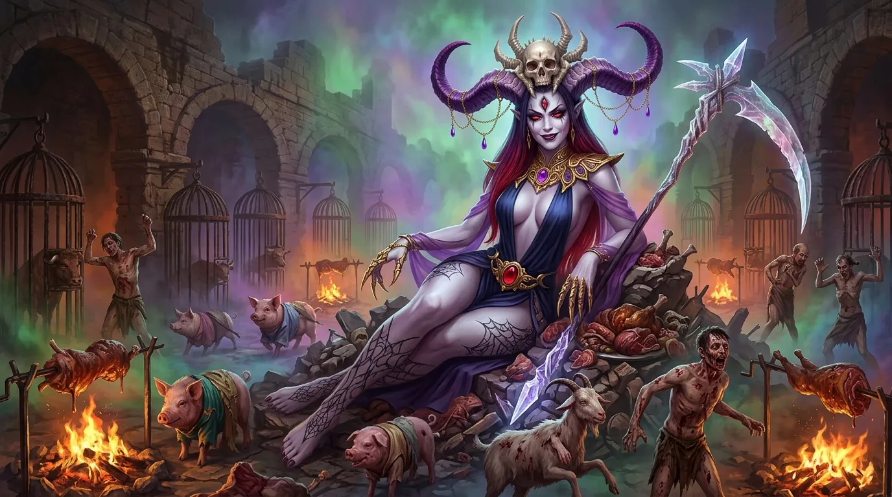
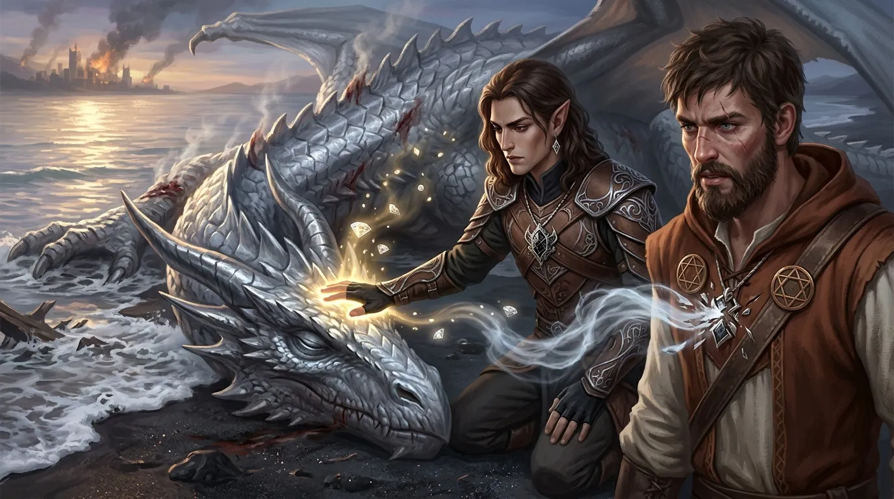
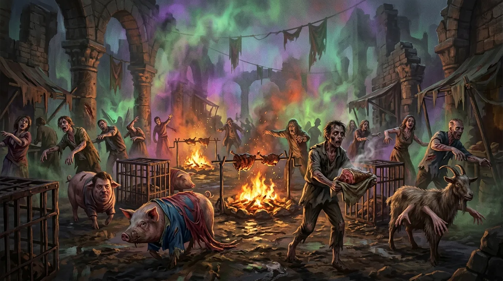
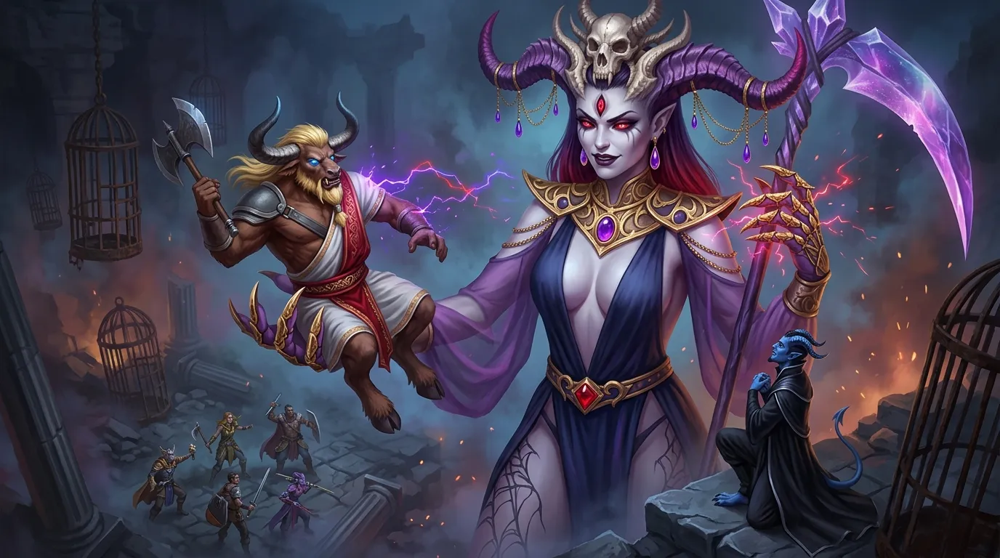
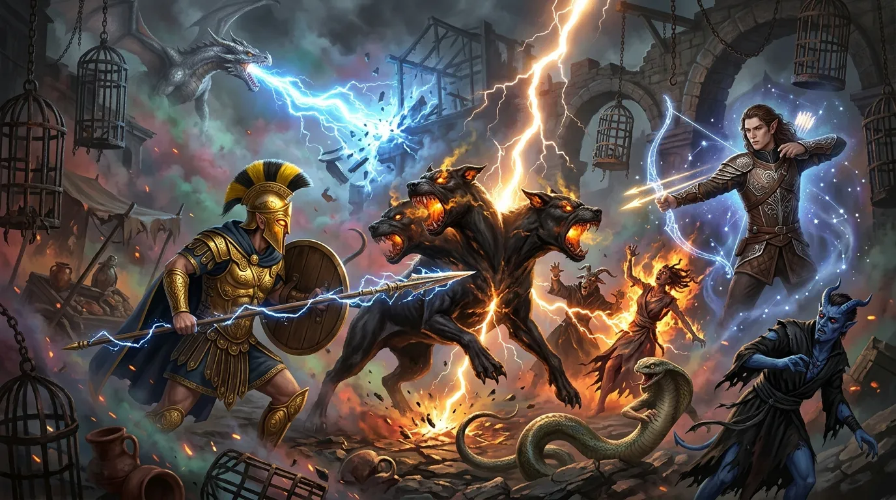
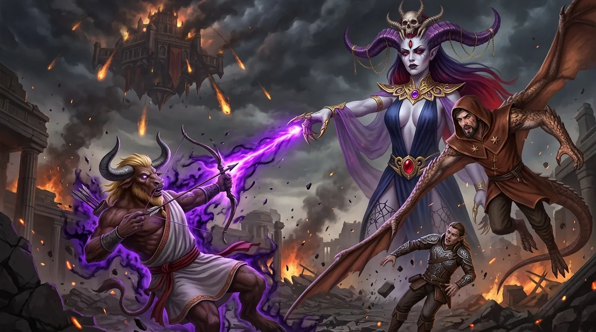
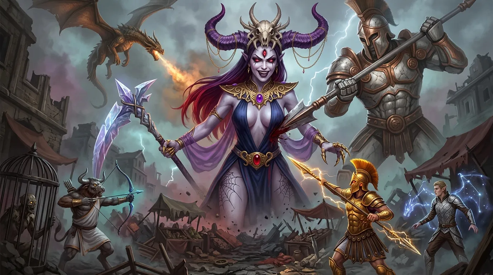
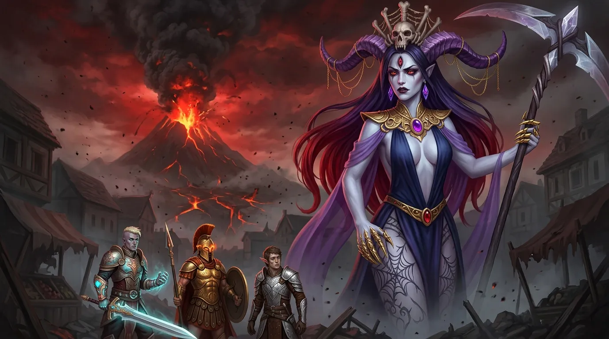

**Data**: 13.07.2026

## Podsumowanie

[Prompt](../assets/sessions/081/081_theme_nightmare_market.txt)

### Nowe naczynie Despiny i obrona Mytros

[Prompt](../assets/sessions/081/081_theme_resurrection.txt)

Gdy tylko opadł bitewny pył po starciu z [[Sydon|Sydonem]], a jego martwe cielsko osunęło się w fale, wzrok bohaterów przyciągnęło dryfujące na falach zatoki martwe ciało srebrnej smoczycy [[Nephele (Smok)|Nephele]]. Ponieważ czas na uratowanie bestii nieubłaganie dobiegał końca, po krótkiej naradzie [[Arevon Elorrenthi|Arevon]] postanowił zaryzykować. Wydobył cenne diamenty i rzucił zaklęcie *Revivify*, kierując uzdrawiający dotyk ku martwemu stworzeniu. Gdy magia pochłonęła klejnoty, okazało się, że dusza samej smoczycy nie może powrócić do ciała. Zamiast tego, chętną i gotową do powrotu duszą była [[Despina|Despina]] spoczywająca w amulecie [[Felicjan Janus Twardowski|Felicjana]]. Amulet czarodzieja pękł pod wpływem gwałtownego przepływu mocy, a uwolniona dusza prababki z siłą huraganu wstąpiła w puste naczynie. Olbrzymia bestia zaczęła gwałtownie i ciężko oddychać, powoli unosząc powieki. Nephele – będąca teraz naczyniem dla [[Despina|Despiny]] – zaczęła nieporadnie prostować potężne skrzydła i testować swą paszczę, podczas gdy roztropny [[Arevon Elorrenthi|Arevon]] odsunął się na bezpieczną odległość. Gdy smoczyca przemówiła głosami prababki, [[Felicjan Janus Twardowski|Felicjan]] przeprosił ją za swój wcześniejszy brak zaufania i chorobliwą ostrożność, a Despina podziękowała im za ocalenie. Ponieważ nowe ciało miało zaledwie 1 punkt życia i wymagało odpoczynku, bohaterowie zostawili ją na plaży, a sami ruszyli w kierunku centrum [[Mytros]].

Sama śmierć władcy mórz, [[Sydon|Sydona]], nie przyniosła jednak natychmiastowego pokoju, lecz wywołała szereg gwałtownych wstrząsów wtórnych, które zatrzęsły posadami trawionego wojną [[Mytros]]. [[Bohaterowie Przepowiedni]] musieli błyskawicznie przejąć ster i skoordynować rozpaczliwe wysiłki obrońców miasta, nim chaos ostatecznie pochłonie metropolię. Rozpoczęła się skomplikowana gra taktyczna, w której stawką było życie tysięcy mieszkańców. Zdecydowano o roszadach na stanowiskach dowódczych — między innymi [[Boreas]] został zastąpiony przez mężnego [[Brax|Braxa]], a [[Apasia]] otrzymała nowe wytyczne. Wojska Amazonek, krasnoludów z [[Estoria|Estorii]] oraz Centurionów z [[Mytros]] zostały rozdzielone na kluczowe odcinki frontu. Wyczerpany wcześniejszymi zmaganiami [[Orion Xul|Orion]] wykorzystał tę krótką chwilę wytchnienia, by udać się na odpoczynek i zregenerować nadwątlone siły.

Bitwa rozgorzała w kilku punktach miasta z dramatyczną zmiennością szczęścia. W pobliżu Akademii [[Mytros]] doszło do katastrofy; legiony Egidy [[Mytros]] starły się z drugą falą brązowych automatonów i po krwawej walce zostały rozbite i zmuszone do bezładnego odwrotu. Klęska ta przyniosła tragiczną śmierć około stu dwudziestu pięciu cywilom, a najeźdźcy zniszczyli morale obrońców. Lepsze wieści nadeszły z okolic pałacu, gdzie pierwszy legion Centurionów z [[Mytros]] zdołał powstrzymać i rozgromić gigantów, minimalizując straty w ludziach do zaledwie kilku osób. Tymczasem w rejonie teatru krasnoludowie z [[Estoria|Estorii]] ulegli przeważającym siłom brązowych automatonów, co kosztowało życie kolejnych siedemdziesięciu pięciu cywilów. Szczęśliwie, w pobliżu Wspólnego Paleniska drugi legion centurionów odparł natarcie krwiożerczych merrowów. Mimo ciężkich strat i zrujnowanych dzielnic, zorganizowana obrona pozwoliła w końcu ustabilizować chwiejną sytuację w mieście.

W czasie, gdy bohaterowie byli pochłonięci walkami w mieście i zabezpieczaniem ulic, leżąca na plaży smoczyca ukończyła krótki odpoczynek. Odzyskawszy siły, [[Nephele (Smok)|Nephele]] – z duszą [[Despina|Despiny]] – rozpostarła potężne skrzydła, wzbiła się w powietrze i zataczając krąg, odleciała na południowy wschód, opuszczając granice miasta. Jej nagły odlot dostrzegł spostrzegawczy [[Arevon Elorrenthi|Arevon]], a [[Felicjan Janus Twardowski|Felicjan]] niezwłocznie wysłał do niej magiczną wiadomość pytając dokąd się kieruje. W odpowiedzi [[Despina]] przekazała, że nie może walczyć z [[Lutheria|Lutherią]], przeprosiła i powiedziała, że być może jeszcze kiedyś się spotkają. [[Arevon Elorrenthi|Arevon]] zażartował potem, że wskrzeszona prababka jest mu winna trzysta sztuk złota za zużyte diamenty.

Podczas gdy obrońcy liczyli rannych i zabezpieczali ulice, nad miastem zawisło nowe, jeszcze potworniejsze zagrożenie. [[Lutheria]], okrutna Pani Snów, kroczyła bez pośpiechu przez zrujnowane dzielnice, aż zatrzymała się w rejonie [[Targ Minotaurów|Targu Minotaurów]]. Wokół niej zaczęła gwałtownie gęstnieć nienaturalna mgła, która odcięła targowisko od reszty miasta nieprzeniknionym całunem. Z mrocznych oparów zaczęły dobiegać niepokojące odgłosy — obłąkańcze śmiechy, makabryczne pieśni oraz odgłosy dzikich, bestialskich orgii, w których radosne okrzyki mieszały się z przerażającymi rykami potworów. Bogini śmierci, otoczona stosami pieczonego mięsa o wielce podejrzanym pochodzeniu, rozsiadła się wygodnie na gruzach, cierpliwie i z drwiącym uśmiechem czekając, aż [[Bohaterowie Przepowiedni]] sami przybędą stawić jej czoła. Drużyna zyskała cenną godzinę na przygotowania i naradę, wiedząc, że nadchodzące starcie rozstrzygnie losy całego świata [[Thylea|Thylei]].

### Makabryczna uczta na Targu Minotaurów

[Prompt](../assets/sessions/081/081_sec2_macabre_banquet.txt)

Świadomi niebezpieczeństw gęstej zabudowy [[Mytros]], wiszącej w powietrzu kolorowej, nienaturalnej mgły oraz czyhających pułapek, bohaterowie zdecydowali się ruszyć ku [[Targ Minotaurów|Targowi Minotaurów]] pieszo, pozostawiając olbrzymiego [[Kolos Pythora|Kolosa Pythora]] sterowanego przez [[Klonicjan|Klonicjana]], by ten powoli torował sobie drogę wąskimi uliczkami, nieuchronnie krusząc ściany okolicznych budynków. Zanim jednak wkroczyli w mgłę, [[Versir]] uniósł swój magiczny miecz i rzucił na siebie czar *True Seeing*, chcąc przejrzeć wszelkie iluzje Pani Snów.

Gdy stopy bohaterów dotknęły bruku [[Targ Minotaurów|Targu Minotaurów]], ich oczom ukazał się widok rodem z najgłębszych otchłani koszmaru. Mieszkańcy [[Mytros]], pogrążeni w obłędzie, poruszali się szarpanymi, nienaturalnymi ruchami niczym zepsute marionetki w dłoniach pijanego lalkarza. Ich ciała były półnagie, pokryte głębokimi ranami i śladami ludzkich ugryzień, które najwyraźniej zadali sobie nawzajem w amoku. Niektórzy z nich zostali uwięzieni w połowie makabrycznej transformacji – ludzkie twarze krzywiły się na świńskich kadłubach, a delikatne kobiece dłonie wyrastały z baranich boków. W powietrzu unosił się słodki, mdlący zapach pieczonego mięsa skapującego z rożnów, a wokół pustych klatek, w których niegdyś więziono minotaury, biegały świnie przyodziane w resztki jedwabnych szat. Mimo tego koszmaru, obłąkani obywatele wiwatowali na cześć nadchodzących bohaterów, krzycząc, że [[Sydon]] nie żyje, a miasto zostało ocalone. Jeden z mieszkańców podbiegł do drużyny, wpychając im w dłonie gorący kawałek pieczeni i zachęcając do świętowania, gdyż sama królowa zaświatów, [[Lutheria]], pragnie uczcić ich czyny wielką paradą, tańcem i śpiewem.

### Podstęp Orestesa i wybuch walki

[Prompt](../assets/sessions/081/081_sec3_orestes_gambit.txt)

W samym sercu tego plugawego święta, pośród rzędów klatek, spoczywała [[Lutheria]]. Jej kryształowa kosa opierała się leniwie o ramię, a za podnóżek służył jej klęczący na czworakach [[Chondrus]], który z wyrazem absolutnego zachwytu znosił ciężar obcasów swojej bogini na plecach. Na widok [[Bohaterowie Przepowiedni|Bohaterów Przepowiedni]] twarz [[Lutheria|Lutherii]] rozbłysła dziecięcą radością. Rozłożyła ramiona, jakby witała dawno niewidzianą rodzinę, i zaczęła mamić ich słodkimi słowami o pokoju, twierdząc, że nigdy nie była ich wrogiem. [[Orestes]] postanowił wykorzystać tę chwilę. Ukrywając nienawiść pod maską uległości, naoliwił się, zbliżył się do niej i zaczął prawić komplementy. A następnie zaczął się do niej dobierać. Zaskoczona, lecz wyraźnie zadowolona bogini pochwyciła potężnego minotaura w swoje ramiona i posadziła go sobie na kolanach niczym małe dziecko, po czym z uśmiechem odgryzła kęs pieczeni, która – jak sama drwiąco zauważyła – była niegdyś poborcą podatkowym. [[Orestes]] czekał właśnie na ten moment bliskości. Będąc tuż przy jej piersi, zamierzał dobyć topora i uderzyć prosto w gardło bogini w akcie zemsty za swoich rodziców. [[Lutheria]] przejrzała jednak jego intencje i zanim [[Orestes]] zdołał zadać cios, pierwsza rzuciła się do ataku, co rozpoczęło brutalne starcie.

Reagując błyskawicznie, [[Lutheria]] użyła magii, zmuszając [[Orestes|Orestesa]] do upadku w niekontrolowanym, obezwładniającym napadzie śmiechu za pomocą zaklęcia Tasha's Hideous Laughter. [[Orestes]] runął na ziemię, całkowicie obezwładniony i niezdolny do walki. Wykorzystując tę chwilę, [[Lutheria]] puściła go i wzbiła się wysoko w górę oraz lekko w tył, zawisając nad polem bitwy. Widząc, że walka rozgorzała na dobre, [[Chondrus]] natychmiast ruszył z pomocą swojej pani. Skupiając swą mroczną wolę, rzucił zaklęcie Wall of Force, wznosząc niewidzialną, nieprzenikalną barierę, która odcięła drużynę od bogini i uniemożliwiła przenikanie czarów. Bohaterowie znaleźli się w pułapce – ich barbarzyńca leżał na ziemi, wijąc się ze śmiechu, a wrogie siły dyktowały warunki starcia.

Wznoszący się nad placem bój szybko pogrążył się w krwawym chaosie, a gęste powietrze [[Targ Minotaurów|Targu Minotaurów]] zaczęło wibrować od wrogiej magii. Jedna z podległych bogini menad, porwana szałem walki, rozpoczęła zmysłowy, uwodzicielski taniec mający zniewolić umysły bohaterów. Jednakże [[Versir]], [[Orion Xul|Orion]] oraz [[Arevon Elorrenthi|Arevon]] wykazali się niezłomną siłą woli i oparli się temu podstępnemu urokowi. Chwile potem trójgłowy [[Cerber]] rzucił się z kłami na [[Orion Xul|Oriona]], lecz potężny wojownik zdołał przetrzymać bolesne ukąszenia bestii. [[Versir]] nie zamierzał stać bezczynnie – zacieśniając chwyt na legendarnym ostrzu [[Zguba Tytanów|Titansbane]], wyprowadził dwa szybkie i potężne cięcia w stronę [[Chondrus|Chondrusa]], starając się za wszelką cenę rozproszyć jego koncentrację i zniszczyć barierę dzielącą pole bitwy. Choć ciosy dosięgły celu, wierny sługa bogini zacisnął zęby i utrzymał zaklęcie.

[[Arevon Elorrenthi]] natychmiast ruszył z odsieczą, ciskając w stronę wrogów świetlisty pocisk Guiding Bolt i aktywując swoją gwiezdną formę pod postacią łucznika, z której raz po raz słał jasne strzały. [[Orion Xul]] bez wytchnienia miotał swą włócznią, [[Odkupienie Pythora|Odkupieniem Pythora]], która posłusznie wracała do jego dłoni, po czym wzniósł magiczny mur tarcz dzięki zdolności Shield Wall, osłaniając swoich towarzyszy. Widząc to wszystko, wznosząca się nad placem [[Lutheria]] spojrzała na [[Klonicjan|Klonicjana]] oraz majaczącego w oddali [[Kolos Pythora|Kolosa Pythora]]. Na jej ustach wykwitł kpiący, jadowity uśmiech, gdy ironicznie pogratulowała bohaterom potężnego wsparcia. W tym samym czasie [[Felicjan Janus Twardowski]], czując narastające wycieńczenie walką, odepchnął nacierającą na niego menadę, po czym wypowiedział inkantację zaklęcia Blink i zniknął z materialnego planu, przenosząc się w bezpieczniejsze, eteryczne sfery.

### Upadek Cerbera i ucieczka Lamii

[Prompt](../assets/sessions/081/081_sec4_cerberus_down.txt)

Tymczasem [[Orestes]] wciąż leżał bezwładnie na bruku, uwięziony w sidłach obezwładniającego czaru, który paraliżował jego mięśnie i torturował umysł. [[Chondrus]] cisnął ognistym pociskiem Fire Bolt w [[Versir|Versira]], zadając mu bolesne oparzenia. W tym samym czasie przerażająca lamia oraz [[Cerber]] ponowili wściekły atak na [[Orion Xul|Oriona]]. Chociaż lamia próbowała skazić umysł [[Orion Xul|Oriona]] swoim jadowitym dotykiem, wojownik stawił czoła mrocznej magii, opierając się klątwie trucizny i zauroczenia, choć bestia zdołała drasnąć jego pancerz. Osłaniany przez wzniesiony wcześniej mur tarcz, heros utrzymał się na nogach.

[[Arevon Elorrenthi]] zdecydował się na zmianę układu sił na placu boju. Druid przyzwał z Feywildu ducha pod postacią jaskrawej, tęczowej pixie dzierżącej wielką kosę — istoty będącej całkowitym przeciwieństwem mrocznej estetyki [[Lutheria|Lutherii]]. W tym samym czasie [[Versir]] uderzył w [[Chondrus|Chondrusa]] zaklęciem Toll the Dead, zadając mu bolesne rany i ostatecznie zabijając go, przez co niewidzialna bariera Wall of Force runęła. Następnie [[Arevon Elorrenthi|Arevon]] przybrał gwiezdną formę, zasypując wrogów świetlistymi strzałami. [[Orion Xul|Orion]] wykorzystał ten moment i wyprowadził morderczą serię ataków [[Odkupienie Pythora|Odkupieniem Pythora]], poważnie raniąc [[Cerber|Cerbera]]. Dzieła zniszczenia dopełniły smoki, które wyzwalając potężną błyskawicę, która nie tylko uleczyła rany [[Orion Xul|Oriona]], ale też spopieliła okolicznych koźlaków, uśmierciła groźnego [[Cerber|Cerbera]] i spaliła jedną z menad.

Śmierć [[Cerber|Cerbera]] i niszczycielska potęga drużyny zasiały popłoch w szeregach wroga. [[Versir]] rzucił na Lamię zaklęcie *Command*, rozkazując jej uciekać (*Flee*). Zmuszona magią bestia rzuciła się do desperackiego biegu, by oddalić się jak najdalej. Ten ruch okazał się jednak zgubny – czujny [[Orion Xul]] błyskawicznie wykorzystał odsłonięcie przeciwniczki i wyprowadził potężny cios swoim legendarnym [[Odkupienie Pythora|Odkupieniem Pythora]], głęboko raniąc uciekającą bestię w plecy. W tym samym czasie [[Felicjan Janus Twardowski]], pragnąc oczyścić pole walki z wrogich uroków krępujących towarzyszy, powrócił z planu eterycznego i rzucił zaklęcie *Dispel Magic* na [[Klonicjan|Klonicjana]]. Zaklęcie zadziałało poprawnie, dzięki czemu klon został uwolniony spod wpływu obezwładniającego szaleństwa (*Madness*) nałożonego wcześniej przez [[Lutheria|Lutherię]].

Uwolniony od szaleństwa [[Klonicjan]] przygotowywał [[Kolos Pythora|Kolosa Pythora]] do włączenia się do walki, podczas gdy szala zwycięstwa zaczęła przechylać się na stronę [[Bohaterowie Przepowiedni|Bohaterów Przepowiedni]]. Widząc upadek swoich sług, [[Lutheria]] – wciąż uśmiechając się szaleńczo, choć z widocznym smutkiem, że bohaterowie tak uparcie odrzucają jej wizję wspólnego budowania nowego świata – ponownie zaatakowała [[Versir|Versira]] niszczycielskim czarem Blight, lecz ten po raz kolejny wykazał się odpornością i przyjął na siebie tylko ułamek niszczycielskiej mocy. Tymczasem nieszczęsny [[Orestes]], wciąż niezdolny do wykonania najmniejszego ruchu, mógł jedynie z wściekłością i bezradnością obserwować starcie ze swego miejsca na ziemi.

### Ostrzał z niebios i śmierć Orestesa

[Prompt](../assets/sessions/081/081_sec5_orestes_death.txt)

Chwile później inicjatywę przejął [[Arevon Elorrenthi|Arevon]]. Nakazał on swojej przyzwanej fey – świetlistej pixie – teleportować się tuż obok [[Lutheria|Lutherii]]. Istota ta uderzyła w Panią Snów falą czystej energii psychicznej, która boleśnie zachwiała koncentracją bogini. [[Arevon Elorrenthi|Arevon]] nie poprzestał na tym; sięgając po głębokie pokłady magii, rzucił potężne Cure Wounds, przelewając życiodajną energię w swoich towarzyszy – zasklepił głębokie rany [[Orion Xul|Oriona]] i postawił na nogi leżącego wciąż na ziemi [[Orestes|Orestesa]]. Pchnięty tą nagłą falą wsparcia, [[Orion Xul|Orion]] ponowił swoje natarcie, raz po raz ciskając [[Odkupienie Pythora|Odkupieniem Pythora]] w stronę bogini. Dwa z trzech ciosów dosięgły celu z chirurgiczną precyzją, przebijając mroczną aurę [[Lutheria|Lutherii]], podczas gdy trzeci przeciął jedynie powietrze. Aby przygotować się na nadchodzący odwet, wojownik zaczerpnął głęboki oddech, zbierając siły na dalsze starcie.

[[Lutheria]] nie pozostała dłużna. Skierowała w stronę [[Arevon Elorrenthi|Arevona]] morderczy promień uwiądu – zaklęcie Blight. Choć druid desperacko próbował osłonić się swoją kosmiczną mocą oka galaktycznego smoka, tym razem obrona zawiodła, a mrok bogini okazał się silniejszy. Fala nekrotycznej energii wyssała z elfa siły witalne. Nie dając się jednak złamać, [[Arevon Elorrenthi|Arevon]] wezwał na pomoc potęgę krążącej nad miastem Latającej Fortecy Smoczych Lordów. Na rozkaz druida z nieba runęło niszczycielskie bombardowanie, które uderzyło w [[Lutheria|Lutherię]] oraz kręcącego się w pobliżu koźlaka, obracając centralną część placu w usiany gruzem, trudny do przebycia teren. Chwile potem [[Felicjan Janus Twardowski]] uwolnił tkane dotąd potężne zaklęcie – Draconic Transformation. Przemieniając się w majestatyczną, smoczą postać, uniósł się nad pole bitwy i zionął w boginię niszczycielskim tchnieniem energii.

Wtedy jednak [[Lutheria]] skupiła morderczy wzrok na [[Orestes|Orestesie]]. Skierowała w jego stronę jeden palec – Finger of Death. Ciało minotaura przeszył potworny ból, gdy jego siły życiowe zostały gwałtownie wyrwane, a on sam padł bez życia. Świadomość [[Orestes|Orestesa]] osunęła się w mroczną, lodowatą pustkę, w której stanął przed spękanym lustrem. Ujrzał w nim swoje własne, zniekształcone, zombifikowane zwłoki podnoszące topór przeciwko [[Arevon Elorrenthi|Arevonowi]], a z tyłu, z ciemności dobiegły go ciche, łagodne głosy zmarłych rodziców, wzywających go do przejścia na drugą stronę i zakończenia cierpień. [[Orestes]] jednak odrzucił tę wizję i z całą wściekłością uderzył w lustro, rozbijając je na kawałki. Choć w świecie fizycznym jego ciało powstało jako nieumarły sługa, minotaur odzyskał władanie nad własnym ciałem – zamiast zaatakować przyjaciół, napiął cięciwę swojego magicznego łuku i posłał dwie strzały w stronę [[Lutheria|Lutherii]], z których druga celnie ugodziła boginię. W odwecie bogini, uśmiechając się z nutą szaleństwa i smutku, że minotaur wciąż odrzuca jej zaproszenie do wspólnej zabawy i budowy nowego świata, zasiała w umyśle [[Arevon Elorrenthi|Arevona]] koszmarne szaleństwo. Druid, mimo wsparcia błogosławieństw, nie zdołał obronić umysłu i pogrążył się w szale. Na szczęście [[Versir]] nie zamierzał bezczynnie patrzeć na cierpienie przyjaciół. Ruszył do przodu z legendarnym ostrzem [[Zguba Tytanów|Titansbane]], z potężnym okrzykiem bojowym trafiając [[Lutheria|Lutherię]] i natychmiast nakładając na nią potężne porażenie Shining Smite.

### Taniec z Panią Śmierci i gniew Kolosa

[Prompt](../assets/sessions/081/081_sec6_colossus_wrath.txt)

Walka na targu w [[Mytros]] osiągnęła punkt wrzenia. [[Orion Xul]], nie zważając na dzielący ich dystans, cisnął [[Odkupienie Pythora|Odkupieniem Pythora]] w stronę bogini. Po dwóch chybionych ciosach trzeci wreszcie dosięgnął celu, głęboko raniąc przeciwniczkę.

Sytuację na polu bitwy zaogniło przybycie potężnego sojusznika. Brązowy smok [[Sybolkorax]] wzbił się w powietrze i zionął niszczycielskim oddechem prosto w [[Lutheria|Lutherię]], zadając jej olbrzymie obrażenia, którym bogini ledwie zdołała się oprzeć, strząsając z siebie najgorsze skutki błyskawicy. [[Arevon Elorrenthi|Arevon]], starając się odzyskać kontrolę nad sytuacją, płynnie zmienił swoją gwiezdną formę na konstelację Smoka. W odpowiedzi [[Lutheria]] podleciała bliżej i rzuciła na [[Versir|Versira]] zaklęcie Otto's Irresistible Dance. Półtytan całkowicie uległ magii i zaczął komicznie tańczyć w miejscu, niezdolny do wykonania jakiegokolwiek kontrolowanego ruchu. Mimo to, nieumarły [[Orestes]] nie przerywał ostrzału. Walcząc jako zombie, minotaur posłał z magicznego łuku dwie celne strzały, które boleśnie ugodziły boginię, zmuszając ją do walki o utrzymanie koncentracji.

[[Lutheria]] ponownie spróbowała uderzyć w [[Arevon Elorrenthi|Arevona]] czarem Blight, lecz tym razem druid zdołał stawić czoła magii, przyjmując tylko ułamek niszczycielskiej siły. Równolegle Lamia, która zdołała już powrócić na pole walki, rzuciła się na [[Orion Xul|Oriona Xula]], próbując skazić go swoim jadowitym dotykiem, by zatruć i zauroczyć herosa. Wola półboga okazała się jednak niezłomna – [[Orion Xul|Orion]] oparł się mrocznej klątwie, a choć potwór zdołał drasnąć go swoimi pazurami, wojownik pozostał niewzruszony. Wkrótce potem [[Versir]] zmobilizował wszystkie siły i ostatecznie przełamał narzucony mu przez boginię przymus tańca, odzyskując pełną swobodę ruchów. [[Arevon Elorrenthi|Arevon]] wykorzystał ten moment, by rzucić na siebie Cure Wounds, uleczając rany, po czym przemieścił się bliżej towarzyszy, szukając schronienia w zasięgu ich aur ochronnych.

Wojna na wyniszczenie trwała w najlepsze. [[Orion Xul]] kontynuował swój morderczy taniec z [[Odkupienie Pythora|Odkupieniem Pythora]], trafiając [[Lutheria|Lutherię]] dwoma potężnymi ciosami i ostatecznie dobijając Lamię uderzeniem końcem włóczni. Bogini, osaczona i ciężko ranna, w mgnieniu oka teleportowała się na bezpieczniejszą odległość. Nie uciekła jednak przed gniewem [[Kolos Pythora|Kolosa Pythora]]. Gigantyczny konstrukt, sterowany przez [[Klonicjan|Klonicjana]], wzniósł swoją monumentalną włócznię i wyprowadził dwa potężne uderzenia, zadając bogini olbrzymie obrażenia. Chwile później [[Felicjan Janus Twardowski]] posłał w kierunku bogini lodową kulę energii z czaru Chromatic Orb, która uderzyła w nią z pełnym impetem.

### Ostrzeżenie przed sturękim koszmarem

[Prompt](../assets/sessions/081/081_sec7_volcano_warning.txt)

Mimo trudnego położenia, szalona [[Lutheria]] uśmiechnęła się tylko szerzej i sięgnęła po swoją najbardziej przerażającą, obszarową moc – Disrupt Life. Fala czystej energii śmierci rozlała się po agorze, uderzając we wszystko, co żywe. Podczas gdy nieumarły [[Orestes]] pozostał całkowicie niewrażliwy na ten nekrotyczny wybuch, [[Versir]], [[Arevon Elorrenthi|Arevon]] oraz [[Orion Xul|Orion]] musieli walczyć o przetrwanie. Dzięki wsparciu magii i własnej odporności, wszyscy trzej bohaterowie zdołali oprzeć się najgorszemu skutkom.

Ziemią wstrząsnęły gwałtowne drżenia zwiastujące przebudzenie góry Volkan, z oddali zaczął unosić się dym i ogień. Spoglądając na wybuchający wulkan, [[Lutheria]] po raz pierwszy tego wieczoru przestała się uśmiechać, a na jej twarzy odmalował się wyraźny niepokój. Chwilę później Pani Śmierci, odzyskując na moment swój kpiący ton, przemówiła do Bohaterów Przepowiedni głosem pełnym mrocznej satysfakcji. Wyśmiała ich starania i oznajmiła, że zabijając [[Sydon|Sydona]], ściągnęli na siebie ostateczną zgubę. Ujawniła, że władca mórz był ukochanym synem sturękiego i pięćdziesięciogłowego tytana [[Kentimane|Kentimane'a]]. Śmierć syna rozbudziła niewyobrażalny gniew ojca, który teraz zmierza ku nim, by wymierzyć okrutną karę. [[Lutheria]] z drwiną przyznała, że choć bohaterom udało się nabić jej brata na włócznię i być może zdołają pokonać również ją samą, to w starciu z nadchodzącym sturękim koszmarem nie mają szans na zwycięstwo – ich jedyną nadzieją będzie próba przetrwania jego gniewu. Na tych złowieszczych słowach, w atmosferze narastającej grozy, starcie zostało zawieszone.

## Kluczowe wydarzenia
* Uzdrowienie srebrnej smoczycy [[Nephele (Smok)|Nephele]] za pomocą zaklęcia *Revivify* rzuconego przez [[Arevon Elorrenthi|Arevona]] tuż po śmierci Sydona; z powodu braku jej własnej duszy, ciało zamieszkuje uwolniona z pękniętego amuletu [[Felicjan Janus Twardowski|Felicjana]] dusza jego prababki [[Despina|Despiny]].
* Krótka rozmowa z nowo wskrzeszoną smoczycą i pozostawienie jej na plaży z 1 HP w celu odbycia odpoczynku (*Short Rest*).
* Stabilizacja sytuacji w płonącym [[Mytros]] po śmierci tytana Sydona i koordynacja ruchów obronnych na kluczowych odcinkach frontu.
* Odlot smoczycy [[Nephele (Smok)|Nephele]] (z duszą Despiny) na południowy wschód w trakcie walk w mieście, zauważony przez [[Arevon Elorrenthi|Arevona]].
* Dotarcie na [[Targ Minotaurów]], gdzie bohaterowie zastali zmutowanych, pogrążonych w obłędzie mieszkańców ucztujących na rozkaz bogini śmierci.
* Próba zdradzieckiego ataku [[Orestes]]a na [[Lutheria|Lutherię]], która przejrzała podstęp i obezwładniła go zaklęciem *Tasha's Hideous Laughter*.
* Rozbicie bariery *Wall of Force* [[Chondrus]]a przez [[Versir]]a za pomocą zaklęcia *Toll the Dead*.
* Uśmiercenie trójgłowego Cerbera przez [[Arevon Elorrenthi|Arevona]] i [[Orion Xul|Oriona]].
* Zmuszenie Lamii do ucieczki zaklęciem *Command (Flee)* rzuconym przez [[Versir]]a; bestia po pewnym czasie powróciła do walki, po czym została ostatecznie dobita przez [[Orion Xul|Oriona]].
* Skuteczne rzucenie *Dispel Magic* przez [[Felicjan Janus Twardowski|Felicjana]] na [[Klonicjan|Klonicjana]], co uwolniło go spod wpływu szaleństwa (*Madness*) nałożonego przez [[Lutheria|Lutherię]].
* Śmierć [[Orestes]]a od zaklęcia *Finger of Death* rzuconego przez [[Lutheria|Lutherię]] i jego powstanie jako nieumarłego zombie, który mimo wrogiego czaru wspomagał drużynę strzałami z łuku.
* Wsparcie drużyny przez [[Kolos Pythora|Kolosa Pythora]] i brązowego smoka [[Sybolkorax]], co zadało bogini dotkliwe rany.
* Ostrzeżenie rzucone przez zepchniętą do obrony [[Lutheria|Lutherię]] przed nadejściem sturękiego tytana [[Kentimane]]'a, pragnącego pomścić śmierć swojego syna Sydona.

## Cytaty
* Dungeon Master: "Słyszeć dźwięki, które brzmią trochę jakby orgie, tylko, że dużo jakichś zwierzętych odgłosów się przebija przez tę orgie."
* Arevon: "Zwierzęce orgie..."
* Orion: "Myślałem, że chce się podpalić, tylko że to barbarzyńca, a nie mnich."
* Arevon: "Jestem pod wrażeniem jak bardzo można sfejlować save'y mając plus miliard, jeszcze ja mogę mu dodać kurwa szóstkę do tego za free i jeszcze on miał d4."
* Lutheria: "Powiedziałam, że w końcu zrozumiecie, że nie jestem waszym wrogiem. No chodź tu, obejmę cię."
* Lutheria: "Orestes, no, muszę powiedzieć, że nie spodziewałam się tego. Ubrałam moje nawet wojenne fatałaszki, podobają się wam?"
* Lutheria: "Zawsze byli tylko bydłem. Ja jedynie zdejmuję ich maski. Świnia nie udaje, że jest kimś więcej niż obiadem."
* Lutheria (podsuwając pieczeń Orestesowi): "Ten był poborcą podatkowym."
* Orestes (atakując toporem): "Za moich rodziców!"
* Lutheria: "Jeśli mam być sama, to niech tak będzie."
* Versir: "Właśnie dlatego urządzasz tę ucztę. Nie po to, żeby uczcić nasze zwycięstwo. Nie po to, żeby uczcić śmierć Sydona. Tylko po to, żeby jeszcze raz przez chwilę uwierzyć, że nie zostałaś sama."
* Lutheria: "Mogliśmy zbudować nowy świat razem. Ale nie. Zrobię to sama."
* Lutheria (o Kentimane): "Nie nazywają go Sturękim dla żartu. Sto rąk, pięćdziesiąt głów. Tyle samo wygłodniałych gęb. Mojego brata mogliście nabić na włócznie. Ze mną? Pfff, może też się wam uda? A z nim? Z nim się nie da walczyć. Z nim się można próbować przetrwać."

## Postacie
* [[Lutheria]]
* [[Chondrus]]
* [[Despina]]
* [[Nephele (Smok)|Nephele]]
* [[Tassos]]
* [[Sybolkorax]]
* [[Klonicjan]]

## Lokacje
* [[Mytros]]
* [[Targ Minotaurów]]

## Przedmioty
* [[Zguba Tytanów|Titansbane]]
* [[Odkupienie Pythora]]
* [[Pierścień Orestesa]]
* [[Kolos Pythora]]
