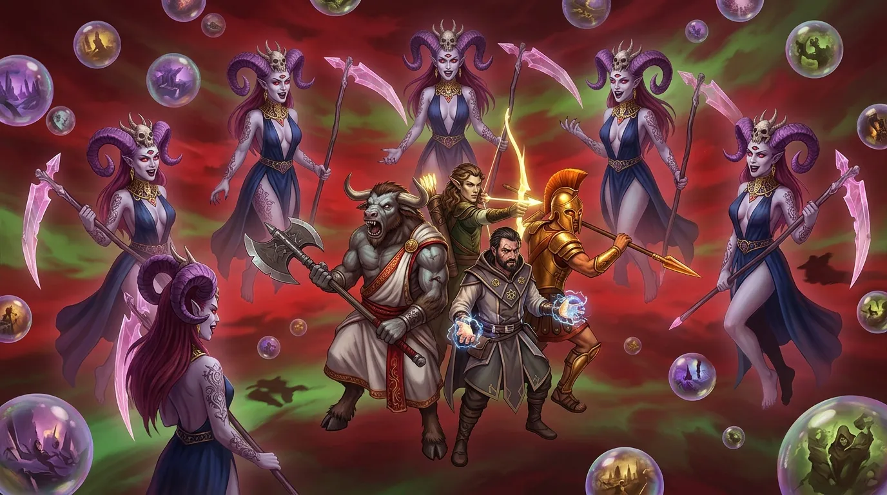
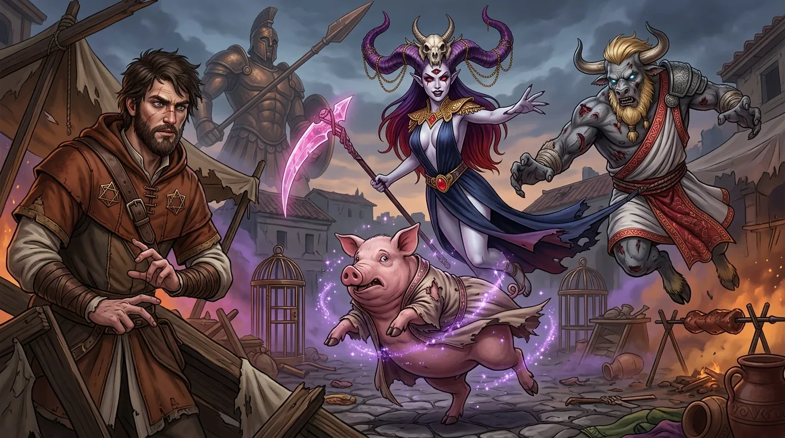
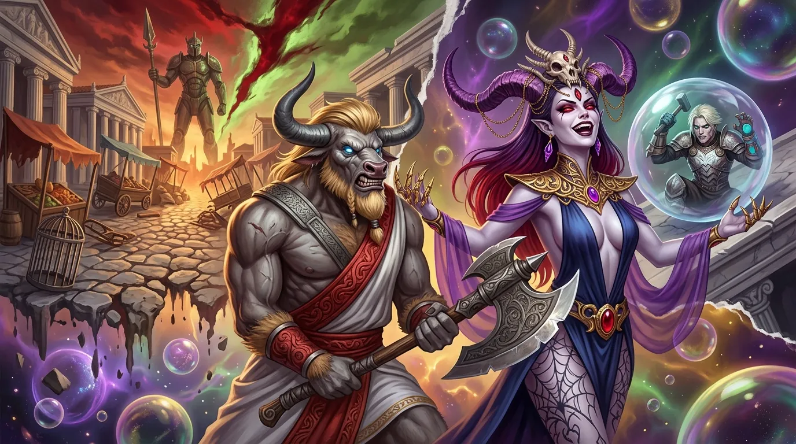
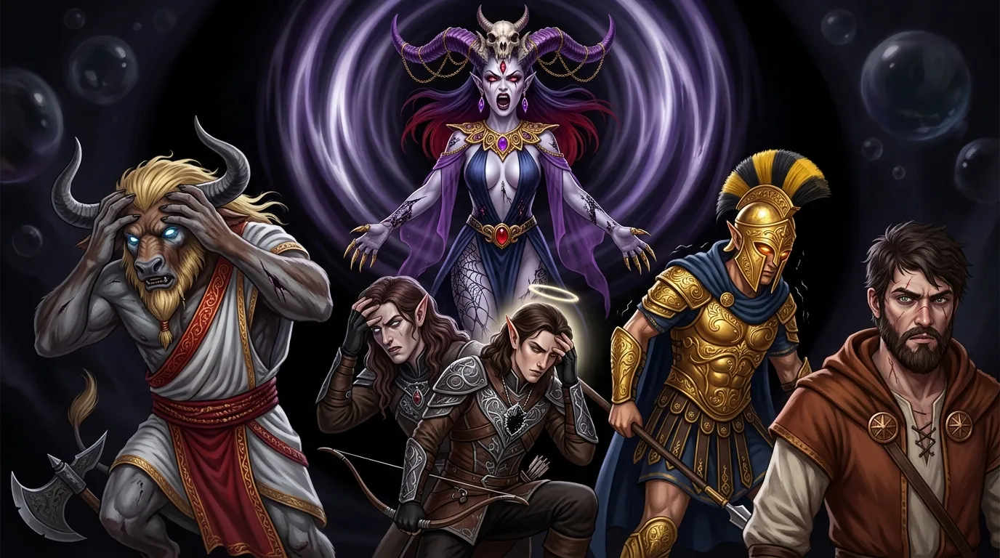
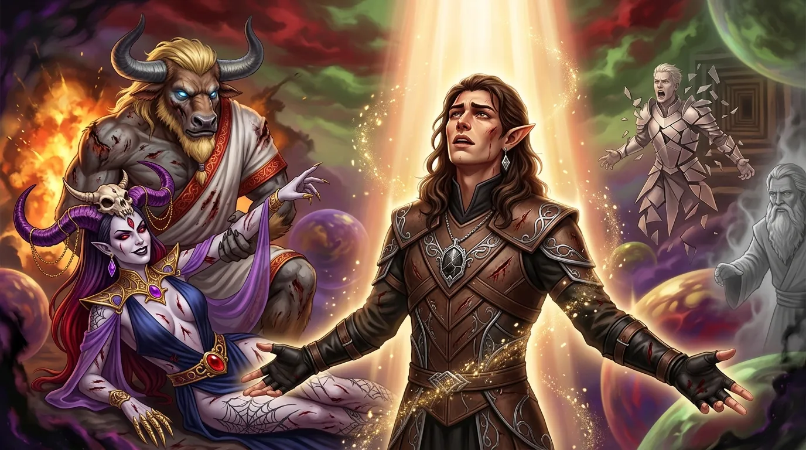
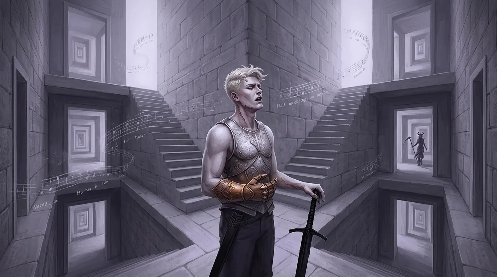
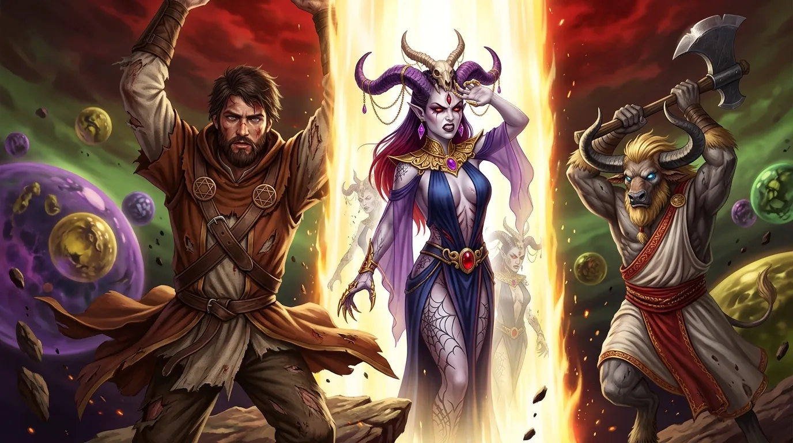
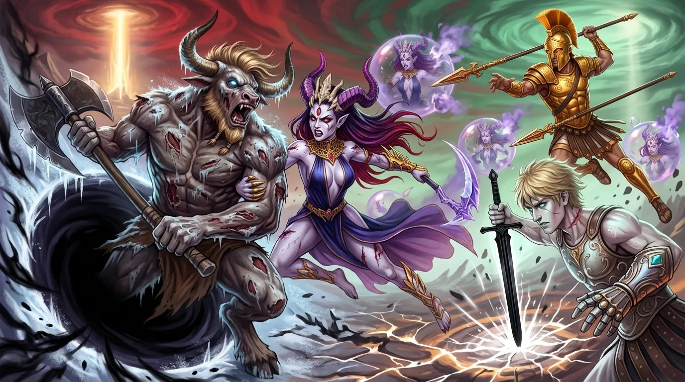
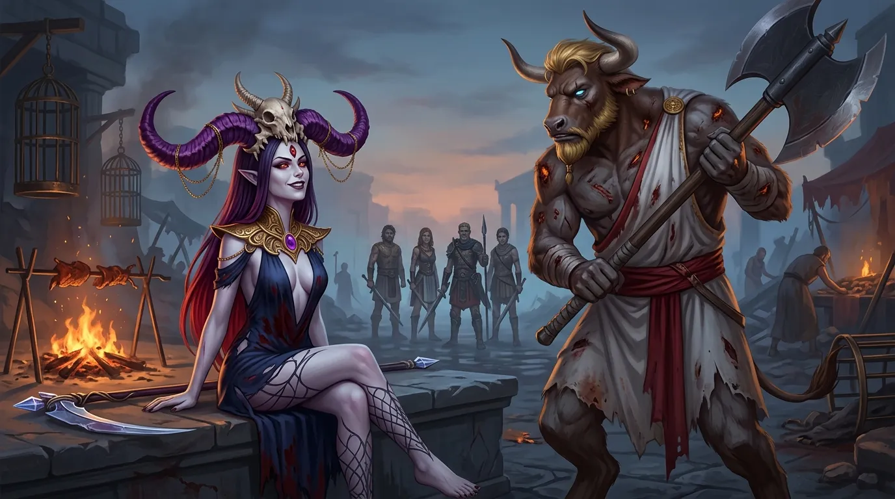
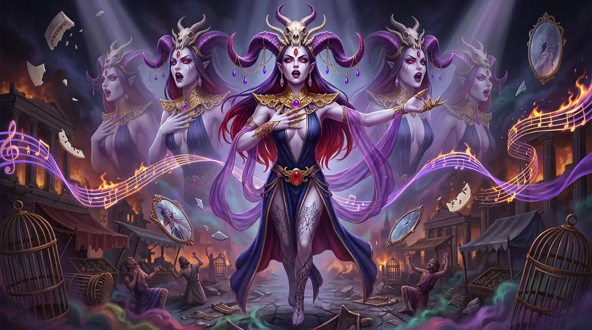

**Data**: 20.07.2026

## Podsumowanie

[Prompt](../assets/sessions/082/082_theme_seven_reflections.txt)

### Taniec Świni

[Prompt](../assets/sessions/082/082_sec1_dancing_pig.txt)

Walka na targu trwała w najlepsze. [[Lutheria]], Pani Snów, wyciągnęła dłoń w stronę [[Klonicjan|Klonicjana]] — magicznego sobowtóra [[Felicjan Janus Twardowski|Felicjana]] — i splotła zaklęcie mające skrępować go w niepowstrzymanym pląsie. Prawdziwy czarodziej wykazał się jednak niezwykłym refleksem: pojmując strukturę czaru w locie, płynnie przekierował go gdzie indziej. Lamia stała za daleko, by przyjąć na siebie magię, więc cała moc spłynęła na przypadkową świnię błąkającą się między straganami. Zwierzę natychmiast uległo zaklęciu i wpadło w rytmiczny, groteskowy taniec, którego nie potrafiło przerwać.

[[Orestes]], w swojej nowej, nieumarłej formie, wziął rozbieg, skoczył i spróbował złapać lewitującą boginię, by ściągnąć ją na bruk. [[Lutheria]] wywinęła się jednak z jego rąk — nieumarły minotaur zacisnął palce na pustce, tam gdzie jeszcze przed chwilą był skraj jej szaty. Niezrażony, zsunął z pleców łuk i z bliska, stojąc niemal pod nią, posłał dwie strzały, które przebiły się przez obronę Pani Snów.

Do zwarcia ruszył **[[Versir]]**, tnąc boginię ostrzem **[[Zguba Tytanów|Zguby Tytanów]]** dwukrotnie i wyrywając z niej głęboką ranę. [[Lutheria]] odpowiedziała mroczną magią, zaszczepiając w umyśle pół-tytana szaleństwo, które całkowicie rozstroiło jego zmysły. [[Arevon Elorrenthi|Arevon]] w tym czasie zamknął magią własne rany, przeniósł się błyskiem w dogodniejsze miejsce i uderzył w Tytankę psychicznym atakiem, który przelał się przez nią falą wyjącego bólu. Pani Snów nie pozostała dłużna — płynnym ruchem [[Kryształowa Kosa Lutherii|kryształowej kosy]] rozorała zdezorientowanego [[Versir|Versira]], choć tym razem zadana rana nie nakarmiła jej samej.

Do ofensywy dołączył **[[Orion Xul|Orion Xul]]**. Dzierżąc **[[Odkupienie Pythora]]**, półbóg wyprowadził serię morderczych pchnięć, z których każde znajdowało cel — a na koniec obrócił włócznię drugim końcem i jednym uderzeniem dobił Lamię, pozbawiając [[Lutheria|Lutherię]] ostatniego wsparcia na targu. Bogini odpowiedziała kolejnym cięciem kosy w [[Versir|Versira]], jeszcze głębszym niż poprzednie. Chwilę później sama przyjęła cios, jakiego nikt na tym placu nie mógłby jej zadać: **[[Klonicjan]]**, sterujący z wnętrza **[[Kolos Pythora|Kolosa Pythora]]**, opuścił gigantyczną włócznię mecha-boga i dwoma potężnymi uderzeniami przebił Panią Snów na wylot.

[[Lutheria]] opadła z sił. Wyglądała, jakby lada moment miała paść martwa — a jednak wciąż unosiła się nad ziemią, trzymając się w powietrzu wbrew wszelkiej logice ran. Stało się jasne, że jej ciało nie zamierza ustąpić przed zwykłym orężem; ostateczny cios musiał zostać zadany bronią godną Tytanki. I mimo wszystko, przez zaciśnięte zęby, bogini się uśmiechała.

### Świat Snów

[Prompt](../assets/sessions/082/082_sec2_dream_world.txt)

[[Felicjan Janus Twardowski|Felicjan]], widząc, że oszalały [[Versir]] stanowi zagrożenie dla siebie i drużyny — a przy tym że [[Lutheria]] patrzy na niego wyjątkowo złowrogo — sięgnął po zwój i otoczył pół-tytana ochronną sferą. Instynkt podpowiedział [[Versir|Versirowi]], by się nie opierać: czuł potrzebę, by cokolwiek osłoniło go przed spojrzeniem Pani Snów. Kryształowa kula zamknęła się wokół niego i powoli sturlała z dachu, izolując go od walki.

[[Orestes]] zamachnął się **[[Topór Xandera|Toporem Xandera]]** i wbił ostrze w boginię. W tym samym ułamku sekundy rzeczywistość pękła. Bruk targowiska zniknął spod stóp bohaterów, choć żaden z nich nie zaczął spadać, a niebo przybrało barwy krwistej czerwieni i chorobliwej, zaraźliwej zieleni. [[Lutheria]] wciągnęła ich do swojej domeny — [[Świat Snów|Świata Snów]]. Jej domu. Jej zasad. Zamiast jednej przeciwniczki drużynę otoczyło siedem identycznych sylwetek, unoszących się w kręgu, każda z kryształową kosą, każda uśmiechnięta tym samym uśmiechem. Przemówiły naraz, jednym głosem rozszczepionym na siedem, drwiąc z herosów: myśleli, że pójdzie tak łatwo, a to jeszcze nie koniec. [[Klonicjan]] wraz z **[[Kolos Pythora|Kolosem Pythora]]** został po drugiej stronie — do onirycznej domeny nie przeszedł.

Bohaterowie musieli zgadywać, która z siedmiu postaci jest z krwi i kości. Pierwszy odpowiedzi udzielił [[Orestes]] — zamaszyste cięcie **[[Topór Xandera|Toporem Xandera]]** trafiło jedną z sylwetek, a ta rozpłynęła się w powietrzu jak dym, nie zostawiając po sobie nawet echa. Złudzenia dawały się rozbijać; problem polegał na tym, że było ich sześć więcej. [[Arevon Elorrenthi|Arevon]], poobijany po poprzednich starciach, zasklepił zaklęciem własne rany, po czym przybrał gwiaździstą postać łucznika — jego ciało pokryła konstelacja świetlnych punktów, a z dłoni posłał w Panią Snów pocisk czystego blasku. [[Orion Xul|Orion]] cisnął **[[Odkupienie Pythora|Odkupieniem Pythora]]**; włócznia przebiła jedną z [[Lutheria|Lutherii]], która zgasła jak zdmuchnięty płomień, i posłusznie wróciła do dłoni właściciela. Bogini odpowiedziała nekromantyczną falą, która obmyła najpierw [[Felicjan Janus Twardowski|Felicjana]], a potem [[Orion Xul|Oriona]], wysysając z nich wilgoć i siły witalne — czarodziej przyjął ją w pełni, półbóg zdołał oprzeć się temu więdnięciu.

Wtedy głos zabrał czarodziej. **[[Felicjan Janus Twardowski|Felicjan]]** raz za razem ciskał kulami żywiołowej energii, a każda z nich gasiła kolejny fantazm — trzeci, czwarty, piąty. Aż w końcu jedna z kul uderzyła w cel, który **nie zniknął**. Sfera energii rozbiła się o prawdziwą Tytankę, wyrywając z niej krzyk i głęboką ranę. Mag odnalazł Panią Snów wśród jej własnych odbić.

### Psioniczny Krzyk

[Prompt](../assets/sessions/082/082_sec3_psionic_scream.txt)

[[Lutheria]] odpłaciła się z bezwzględnością godną Tytanki. Nie sięgnęła po kosę ani po iluzje — uwolniła czysty krzyk swojego umysłu, magię, która rozdarła myśli [[Orestes|Orestesa]], [[Arevon Elorrenthi|Arevona]] i [[Orion Xul|Oriona]] naraz. Fala psionicznej energii wdarła się do ich czaszek, zadając potworne cierpienie; żaden z trzech nie zdołał się jej oprzeć — nawet [[Orion Xul|Orion]], który stawił jej najtwardszy opór z całej trójki. Ból odebrał im władzę nad ciałami — stali sparaliżowani, ogłuszeni, niezdolni podnieść broni.

Jakby tego było mało, bogini spowiła ich kulą magicznej ciemności o promieniu kilkunastu kroków, odbierając bohaterom ostatnią przewagę: wzrok. [[Versir]], wciąż uwięziony w ochronnej sferze, otrząsnął się wreszcie z szaleństwa, które trawiło jego umysł — lecz odzyskana jasność myśli była gorzkim darem. Mógł jedynie patrzeć, jak trzej jego towarzysze stoją bezwolnie w mroku.

[[Felicjan Janus Twardowski|Felicjan]] został sam. Jako jedyny zachował pełnię władz umysłowych i swobodę ruchu, a wokół niego kołysała się ciemność, w której kryła się ranna, wściekła bogini. Czarodziej sięgnął po magię rozpraszającą i skierował ją na **[[Orestes|Orestesa]]** — uwolnienie minotaura, który miał zaraz działać, dawało im największą szansę na przetrwanie tego koszmaru. Pierwsza próba rozbiła się o potęgę Pani Snów — lecz wtedy [[Versir]], wciąż zamknięty w swojej sferze, oddał towarzyszowi ostatnie okruchy własnego natchnienia, by mag mógł spróbować raz jeszcze. Tym razem klątwa pękła jak przemarznięte szkło, a Przeklęty Minotaur wciągnął powietrze i odzyskał władzę nad ciałem.

Ciemność wciąż dławiła pole bitwy — jedynym punktem światła pozostawał magiczny blask towarzyszący [[Arevon Elorrenthi|Arevonowi]], rozświetlający mrok tylko tam, gdzie sam się znajdował. Z tej czerni wynurzała się [[Kryształowa Kosa Lutherii|kryształowa kosa]] [[Lutheria|Lutherii]]. Ostrze raz po raz sięgało [[Felicjan Janus Twardowski|Felicjana]], rozcinając ciało i wypijając z niego życie, którym bogini natychmiast leczyła własne rany. Odpowiedział jej [[Orestes]]: **[[Topór Xandera]]**, wykuty po to, by zabijać olbrzymów i Tytanów, spadł na Panią Snów potężnym cięciem, po nim zaś drugie, a minotaur natychmiast rzucił się naprzód, próbując pochwycić boginię gołymi rękami.

W tej samej chwili [[Felicjan Janus Twardowski|Felicjan]] rozpuścił ochronną sferę więżącą [[Versir|Versira]]. Półtytan runął naprzód przez grząski, oniryczny grunt, biegnąc ile sił ku towarzyszom, a kiedy dopadł ich zasięgu, spalił resztki swojej mocy na **Aurę Czystości** — krąg czystego blasku, w którym umysły sojuszników twardniały przeciw strachowi i odrętwieniu. To wystarczyło: [[Arevon Elorrenthi|Arevon]] i [[Orion Xul|Orion]] otrząsnęli się z psionicznego szoku. [[Lutheria]] zrewanżowała się natychmiast, rzucając w nich falę fantazmatycznych obrazów najgorszych lęków — lecz aura [[Versir|Versira]] obejmowała już całą drużynę, hartując ich umysły przeciw czarowi i grozie, i bohaterowie ustali w miejscu. Samego minotaura chronił nadto **[[Pierścień Orestesa]]**, wykuty z smoczej kości — dar, który od dawna bronił go przed urokiem i strachem.

### Dar Mytros

[Prompt](../assets/sessions/082/082_sec4_gift_of_mytros.txt)

[[Felicjan Janus Twardowski|Felicjan]] przeszedł do ofensywy, ciskając w skłębione sylwetki bogini kulę ognia. Eksplozja rozdarła magiczny mrok i ogarnęła Panią Snów, która wciąż szamotała się w żelaznym uścisku [[Orestes|Orestesa]] — minotaur dopiął swego i przygwoździł Tytankę, nie pozwalając jej odpłynąć w cień.

Niezrażona [[Lutheria]] wybrała najprostszą zemstę: spojrzała na [[Versir|Versira]] i wypowiedziała słowo, które wygnało go z pola bitwy do wielowymiarowego labiryntu bez wyjścia. Półtytan, który już raz stracił stulecia w plątaninie korytarzy, zniknął z areny, a wraz z nim zgasła aura chroniąca umysły towarzyszy. [[Orestes]] nie ustępował. Sięgnął po pełnię mocy uśpionej w **[[Topór Xandera|Toporze Xandera]]**, uwalniając cały ładunek zaklętej w broni furii — powietrze zawyło, a ostrze wgryzło się w boginię jednym potężnym wyładowaniem, po którym minotaur wciąż nie rozluźnił chwytu. [[Felicjan Janus Twardowski|Felicjan]] tymczasem, ranny i odsłonięty, ześlizgnął się na plan eteryczny. Świat wokół niego wyblakł w odcienie szarości, a wściekła bogini straciła go z oczu.

[[Arevon Elorrenthi|Arevon]], sponiewierany i pozbawiony niemal całej mocy, sięgnął po ostatnią deskę ratunku — drużyna spaliła wszystkie pozostałe **Punkty Cudów**, dar bogini [[Mytros (Bogini)|Mytros]], by druid mógł w środku bitwy odzyskać pełnię sił, jakby przespał całą noc. Odnowiony, natychmiast rozlał falę uzdrawiającej energii, która obmyła [[Orion Xul|Oriona]] i [[Orestes|Orestesa]]. [[Lutheria]] odpowiedziała mu nekromantyczną klątwą, która wyssała z elfa wilgoć i witalność, zostawiając go wysuszonym i chwiejnym.

[[Orion Xul|Orion]] cisnął w boginię **[[Odkupienie Pythora|Odkupieniem Pythora]]**; ostrze przeszyło mrok i posłusznie wróciło do jego dłoni. Kosa Pani Snów odnalazła go w odwecie, rozcinając bok i znów karmiąc ją cudzym życiem. Wtedy [[Felicjan Janus Twardowski|Felicjan]] poprawił drugą kulą ognia — i to uderzenie okazało się objawieniem: płomienie przemiotły kilka sylwetek Tytanki, a trzy z nich rozwiały się jak dym, obnażając kolejną warstwę jej złudzeń. Prawdziwa [[Lutheria]] leżała powalona na wznak, wciąż przyszpilona przez minotaura. Powalona, lecz nie pokonana — bogini zebrała w sobie resztki gniewu i cisnęła w środek pola bitwy eksplozję czystej energii psionicznej, która rozerwała myśli bohaterów. [[Arevon Elorrenthi|Arevon]] i [[Orion Xul|Orion]] zdołali częściowo osłonić się przed uderzeniem, lecz [[Orestes]] przyjął je w całości: myśli minotaura zamgliły się, ręce zaczęły błądzić, a każdy ruch stał się o ułamek chwili spóźniony.

### Słowa Rzucone w Pustkę

[Prompt](../assets/sessions/082/082_sec5_words_into_the_void.txt)

Mimo otępienia zwierzęca furia nie opuściła [[Orestes|Orestesa]] — przeciwnie, wzięła nad nim górę. Minotaur zgiął się wpół, jego kark spuchł, kości zatrzeszczały i przelały się w nową formę: masywne, rozjuszone bydlę o karku grubszym niż ludzki tors. W tej postaci runął pełnym pędem prosto na [[Lutheria|Lutherię]], lecz zamglony umysł zawiódł go i ani rogi, ani kopyta nie znalazły celu, przecinając jedynie powietrze. Bogini odpowiedziała szerokim zamachem [[Kryształowa Kosa Lutherii|kryształowej kosy]], tnąc materię snu i ciało zarazem, i raz jeszcze wypiła z zadanej rany życiodajną energię dla siebie.

Tymczasem daleko stamtąd, w wielowymiarowym labiryncie, [[Versir]] zdał sobie sprawę, że tej zagadki nie rozwiąże. W jego głowie wciąż krążyła ta sama pieśń, wracając do początku raz za razem, a w jednym z jej fragmentów odzywał się głos, który nazywał go siostrzeńcem i wyrzucał mu, że miał rację. Półtytan przemówił więc w pustkę, z nadzieją, że Pani Snów usłyszy go nawet stąd: „To nie dlatego mnie nienawidzisz. Nienawidzisz mnie, bo wypowiedziałem na głos to, przed czym uciekałaś przez całą wieczność". A po chwili dodał ciszej: „Nie boję się spotkać z matką. To ty od tysięcy lat boisz się samotności". Słowa te ugodziły boginię — lecz nie na tyle, by wytrącić ją z rytmu. Bawiła się zbyt dobrze, by pozwolić sobie na przerwanie zabawy.

W odwecie [[Lutheria]] wypaczyła samą przestrzeń [[Świat Snów|Świata Snów]]. Rzeczywistość zafalowała, umysły bohaterów zapiekły, a ziemia pod ich stopami przestała być pewna — bogini mogła teraz przerzucić każdego z nich, dokądkolwiek zechce. [[Arevon Elorrenthi|Arevon]] uznał, że dłużej nie mogą sobie na to pozwolić, skupił moc i zamknął siebie i towarzyszy w niewidzialnej klatce z czystej siły, tak ciasnej, że stanęli ramię przy ramieniu, niemal się do siebie tuląc. Bariera obejmowała także podłoże, odcinając [[Lutheria|Lutherii]] drogę zarówno z góry, jak i z dołu. W tej krótkiej chwili wytchnienia [[Orion Xul|Orion]] i [[Felicjan Janus Twardowski|Felicjan]] pospiesznie wychylili mikstury lecznicze.

Wewnątrz bariery znaleźli się jednak tylko [[Arevon Elorrenthi|Arevon]], [[Orestes]], [[Felicjan Janus Twardowski|Felicjan]] i [[Orion Xul|Orion]] — [[Versir]] wciąż błądził w labiryncie, a niewidzialna klatka odcinała go od reszty drużyny. [[Lutheria]] dostrzegła w tym okazję i rozegrała ją z okrutną precyzją: zamiast dobijać się do bariery, po prostu przerwała zaklęcie trzymające pół-tytana w plątaninie korytarzy. [[Versir]] runął z powrotem na pole bitwy — sam, poza ochronną ścianą, dokładnie tam, gdzie bogini go chciała — i natychmiast przyjął na siebie jej cios. [[Arevon Elorrenthi|Arevon]] nie miał wyboru: żeby ratować towarzysza, musiał rozpuścić własną ścianę mocy, oddając Pani Snów całe pole bitwy z powrotem.

### Świt Przeciwko Pani Snów

[Prompt](../assets/sessions/082/082_sec6_dawn_against_the_dream_lady.txt)

[[Lutheria]] skierowała gniew na [[Felicjan Janus Twardowski|Felicjana]], zsyłając na niego nekromantyczną energię wysysającą z ciała wilgoć i siły witalne. Czarodziej wytrzymał, a odpowiedź, jakiej udzielił, rozświetliła cały [[Świat Snów]]: z góry opadł na pole bitwy słup palącego, oczyszczającego blasku, wypalający wszystko, co znalazło się w jego obrębie. Jedno po drugim odbicia [[Lutheria|Lutherii]] zaczęły znikać w tym świetle, a bogini raz po raz musiała zbierać rozsypującą się koncentrację. [[Felicjan Janus Twardowski|Felicjan]] zaś, gdy tylko blask zaczął przygasać, znów rozmył się i przeniknął na plan eteryczny.

Bogini zdetonowała w umysłach bohaterów ładunek psychicznej energii, która rozbłysła między nimi jak cicha eksplozja — [[Versir]], [[Orestes]], [[Orion Xul|Orion]] i [[Arevon Elorrenthi|Arevon]] poczuli, jak myśli rwą im się na strzępy. [[Orestes]], z głową wciąż ciężką od poprzedniego uderzenia, zignorował ból i rzucił się na Panią Snów z **[[Topór Xandera|Toporem Xandera]]**. Pierwszy cios rozorał jej bok raną, z której nie płynęła krew, lecz coś ciemniejszego; drugi spadł zaraz po nim. Nie poprzestając na tym, minotaur odrzucił ostrożność i sięgnął po nią gołymi rękami, próbując zewrzeć ją w żelaznym uścisku i przygwoździć do ziemi.

### Taniec Boginii Śmierci

[Prompt](../assets/sessions/082/082_sec7_dance_of_the_death_goddess.txt)

Bogini wykonała morderczy zamach [[Kryształowa Kosa Lutherii|kryształową kosą]], tnąc materię snu i wyszarpując z ran przeciwnika ciemną, ożywczą energię dla siebie. Wtedy jednak [[Versir]] sięgnął po **[[Zguba Tytanów|Zgubę Tytanów]]** i wyprowadził uderzenie, którego moc zdławiła zdolność [[Lutheria|Lutherii]] do sycenia się cudzym cierpieniem — ostrze wypaliło w niej coś, co dotąd zamykało każdą zadaną jej ranę. [[Arevon Elorrenthi|Arevon]], widząc słabnącego [[Orestes|Orestesa]], posłał ku niemu jedno krótkie, słowo mocy, po którym minotaur wyprostował się z ulgą i mruknął podziękowanie; druid cisnął jeszcze świetlisty pocisk w stronę wroga i przezornie odsunął się poza zasięg kosy.

[[Lutheria]] odpowiedziała atakiem na umysł — sięgnęła do najgłębszych lęków [[Arevon Elorrenthi|Arevona]] i przyoblekła je w widmowy kształt, widoczny tylko dla niego, lecz druid odepchnął zjawę siłą woli. Potem zamachnęła się na [[Orion Xul|Oriona]], a kosa rozorała mu bok raną zimna i stali.

[[Felicjan Janus Twardowski|Felicjan]] cisnął chromatyczną kulą, podtrzymując jednocześnie słup palącego światła, a zdesperowana bogini otworzyła wyrwę ku mrokowi między gwiazdami. Kula absolutnej ciemności, przeraźliwego zimna i cichych, mlaskających szeptów pochłonęła część pola bitwy. [[Orestes]] ryknął z bólu, wyrwał się z tej otchłani biegiem, dopadł [[Lutheria|Lutherii]] i uderzył **[[Topór Xandera|Toporem Xandera]]** — dwa razy, bez osłony, z całą furią. A potem zacisnął dłonie na bogini i wreszcie ją utrzymał. „Zostajesz tu ze mną, suko" — warknął.

[[Versir]] wpadł tymczasem na pomysł, jakiego nikt się nie spodziewał: przestał celować w [[Lutheria|Lutherię]] i zamachnął się **[[Zguba Tytanów|Zgubą Tytanów]]** w sam grunt pod stopami — w tkankę snu, w strukturę koszmaru, licząc, że rozbicie domeny zakończy marzenie i odeśle ich z powrotem do [[Mytros]]. Ostrze wgryzło się w iluzoryczną rzeczywistość i wszystkie Lutherie naraz wykrzywiły się w jednym drgnieniu, jakby świat przez moment stracił równowagę. [[Orion Xul|Orion]] tego nie zobaczył — wciąż tkwił w ciemności zrodzonej z otchłani. [[Arevon Elorrenthi|Arevon]] uwolnił falę magii leczącej, która obmyła sojuszników, po czym znów przeniósł się o kilka kroków, wymykając się kosie w ostatniej chwili. [[Orion Xul|Orion]] natomiast nie ustawał: raz za razem ciskał **[[Odkupienie Pythora|Odkupieniem Pythora]]**, a włócznia posłusznie wracała mu do dłoni, by po chwili znów wbić się w kolejne odbicie bogini; gdy przeciwniczka znalazła się w zwarciu, dobił ją jeszcze uderzeniem drzewca. [[Felicjan Janus Twardowski|Felicjan]] sypnął mrozem. I wtedy zaczęło się to, na co drużyna pracowała przez cały wieczór: klony pękały jedno po drugim, cicho i bez oporu, jak bańki mydlane nakłuwane po kolei. Każde kolejne odbicie znikało szybciej niż poprzednie, a wraz z nimi ubywało samego snu.

### Ostatnie Słowa Pani Snów

[Prompt](../assets/sessions/082/082_sec8_last_words.txt)

Gdy zgasło ostatnie odbicie, świat poszedł za nimi. Krwiste niebo pękło wzdłuż niewidzialnych szwów, chorobliwa zieleń spłynęła w dół jak farba zmywana z płótna, a grunt — do tej pory miękki i nieszczery — zaczął się zapadać pod ciężarem własnej iluzji. Sen nie miał już z czego się utkać. Przez chwilę bohaterowie wisieli w rozsypującej się pustce, a potem poczuli pod stopami twardy bruk: byli z powrotem na [[Targ Minotaurów|Targu Minotaurów]], pośród przewróconych straganów, pustych klatek i dogasających rożnów. Wrócili do [[Mytros]].

Wróciła z nimi [[Lutheria]]. Górująca dotąd nad nimi postać, rozdęta do rozmiarów własnej domeny, opadła i skurczyła się w locie, aż stanęła przed nimi jako kobieta ich wzrostu — drobna, ranna, bez świty odbić, bez nieba, które by jej słuchało. I w tym momencie po prostu przestała walczyć. Uśmiechnęła się lekko, podeszła do pobliskiego podestu, przysiadła na nim i spuściła nogi w dół, jak dziecko na brzegu pomostu.

— No to była dobra partia. Na pewno was wszystkich zapamiętam — powiedziała i znieruchomiała, czekając na to, co zrobi [[Orestes]].

Minotaur widział jej śmierć w oczach i bardzo chciał ją zadać. Ruszył z **[[Topór Xandera|Toporem Xandera]]** — ale bogini nawet nie drgnęła, nie próbowała się uchylić, i właśnie ta całkowita bierność wybiła go z rytmu; pierwszy zamach poszedł w powietrze. [[Orestes]] wziął głęboki oddech, obrócił się w pełnym kole i wyprowadził drugie, czyste cięcie. Głowa [[Lutheria|Lutherii]] odleciała i uderzyła o bruk z głuchym impetem.

Ciało Pani Snów zaczęło się rozpadać, rozświetlone od środka złotym blaskiem, aż rozsypało się po okolicy jako złoty pył. Została po niej tylko [[Kryształowa Kosa Lutherii|kryształowa kosa]], leżąca na ziemi — [[Orestes]] od razu zapowiedział, że rozbije ją toporem. Wraz ze śmiercią bogini jej magia zaczęła się rozpływać w całej okolicy: zwierzęta z powrotem przybierały ludzkie kształty, oszalali odzyskiwali zmysły, mgła się rozwiewała. A potem, gdy triumf jeszcze nie zdążył wybrzmieć, horyzont rozdarł potężny huk — wybuchł wulkan, zwiastując, że jeden z [[Tytani|Tytanów]] wciąż czeka na swoją kolej.

### Pieśni Pani Snów

[Prompt](../assets/sessions/082/082_theme_final_song.txt)

Wraz z wygaśnięciem [[Przysięga Pokoju|Przysięgi Pokoju]] do [[Lutheria|Lutherii]] wróciło to, co odebrano jej przed wiekami — jej muzyka, sam rdzeń jej mocy, odzyskany po pięciu stuleciach milczenia. Przez całe starcie bogini nie przestawała śpiewać: każdemu z [[Bohaterowie Przepowiedni|Bohaterów Przepowiedni]] poświęciła osobną pieśń, drwiącą, intymną i okrutnie dobrze poinformowaną, wyśpiewaną pięcioma nakładającymi się głosami.

| Pieśń | Tekst | Nagranie |
|---|---|---|
| Kołysanka Otchłani | [tekst](../assets/sessions/082/songs/kolysanka.txt) | [mp3](../assets/sessions/082/songs/Ko%C5%82ysanka%20Otch%C5%82ani.mp3) |
| Pieśń dla Arevona | [tekst](../assets/sessions/082/songs/arevon.txt) | [mp3](../assets/sessions/082/songs/Arevon.mp3) |
| Pieśń dla Felicjana | [tekst](../assets/sessions/082/songs/felicjan.txt) | [mp3](../assets/sessions/082/songs/Felicjan.mp3) |
| Pieśń dla Orestesa | [tekst](../assets/sessions/082/songs/orestes.txt) | [mp3](../assets/sessions/082/songs/Orestes.mp3) |
| Pieśń dla Oriona | [tekst](../assets/sessions/082/songs/orion.txt) | [mp3](../assets/sessions/082/songs/Orion.mp3) |
| Pieśń dla Versira | [tekst](../assets/sessions/082/songs/versir.txt) | [mp3](../assets/sessions/082/songs/Versir.mp3) |

## Kluczowe wydarzenia
* [[Felicjan Janus Twardowski|Felicjan]] przekierował zaklęcie [[Lutheria|Lutherii]] wymierzone w [[Klonicjan|Klonicjana]] na przypadkową świnię, która wpadła w niepowstrzymany taniec.
* [[Orion Xul|Orion]] dobił Lamię [[Odkupienie Pythora|Odkupieniem Pythora]], pozbawiając [[Lutheria|Lutherię]] ostatniego wsparcia na [[Targ Minotaurów|Targu Minotaurów]].
* [[Klonicjan]], sterujący [[Kolos Pythora|Kolosem Pythora]], przebił [[Lutheria|Lutherię]] gigantyczną włócznią mecha-boga dwoma uderzeniami.
* Ujawniono, że mimo skrajnych obrażeń [[Lutheria]] nie padnie, dopóki finalnego ciosu nie zada broń godna Tytanki ([[Zguba Tytanów]] lub [[Topór Xandera]]).
* [[Lutheria]] wciągnęła drużynę do swojej domeny — [[Świat Snów|Świata Snów]] — otaczając się siedmioma identycznymi projekcjami; [[Klonicjan]] i [[Kolos Pythora]] zostali poza domeną.
* Odzyskawszy po wygaśnięciu [[Przysięga Pokoju|Przysięgi Pokoju]] swoją domenę muzyki, [[Lutheria]] przez całe starcie śpiewała — osobną, szyderczą pieśń dla każdego z [[Bohaterowie Przepowiedni|Bohaterów Przepowiedni]].
* [[Felicjan Janus Twardowski|Felicjan]] serią kul żywiołowej energii wygasił kolejne fantazmaty i odnalazł prawdziwą [[Lutheria|Lutherię]] wśród jej odbić.
* Psioniczny krzyk bogini sparaliżował naraz [[Orestes|Orestesa]], [[Arevon Elorrenthi|Arevona]] i [[Orion Xul|Oriona]]; [[Felicjan Janus Twardowski|Felicjan]] jako jedyny zachował swobodę ruchu i magią rozpraszającą uwolnił minotaura (dzięki natchnieniu oddanemu przez [[Versir|Versira]]).
* [[Versir]], uwolniony z ochronnej sfery, rzucił Aurę Czystości, która postawiła sparaliżowanych towarzyszy na nogi.
* [[Lutheria]] wygnała [[Versir|Versira]] do wielowymiarowego labiryntu; półtytan przemówił stamtąd w pustkę, wytykając bogini jej strach przed samotnością.
* Drużyna spaliła wszystkie pozostałe Punkty Cudów, by [[Arevon Elorrenthi|Arevon]] odzyskał w środku walki pełnię magii.
* [[Arevon Elorrenthi|Arevon]] zamknął drużynę w ścianie mocy; [[Lutheria]] przerwała koncentrację na labiryncie, by ściągnąć [[Versir|Versira]] z powrotem i zaatakować go poza barierą, zmuszając druida do zniesienia ściany.
* [[Felicjan Janus Twardowski|Felicjan]] przywołał słup palącego światła, który zaczął systematycznie wygaszać kolejne klony bogini.
* Uderzenie [[Zguba Tytanów|Zgubą Tytanów]] zdławiło zdolność [[Lutheria|Lutherii]] do leczenia się cudzymi ranami.
* [[Versir]] zaatakował samą strukturę [[Świat Snów|Świata Snów]], próbując rozbić domenę bogini.
* Gdy pękły ostatnie klony, [[Świat Snów]] załamał się i odesłał drużynę z powrotem na [[Targ Minotaurów]] w [[Mytros]]; [[Lutheria]] wróciła z nimi i zmniejszyła się do ich rozmiaru.
* [[Lutheria]] dobrowolnie przerwała walkę, usiadła na podeście i pożegnała bohaterów; [[Orestes]] chybił pierwszym ciosem, po czym drugim cięciem [[Topór Xandera|Topora Xandera]] odciął jej głowę.
* Ciało bogini rozsypało się w złoty pył, zostawiając jedynie [[Kryształowa Kosa Lutherii|kryształową kosę]]; jej magia rozwiała się nad [[Mytros]], przywracając zwierzętom ludzkie kształty, a szaleńcom zmysły.
* Sesja zakończyła się erupcją wulkanu — zapowiedzią nadejścia [[Kentimane]]'a.

## Cytaty
* Orestes: "Ojej, tańcz, świnio, tańcz. Tańcz jak pojebana."
* Versir: "Ja jestem... te piosenki i ten tekst jest tak zajebisty, że ja jestem za Lutherią. Jako gracz, ja jestem team Luterion."
* Versir (z labiryntu): "To nie dlatego mnie nienawidzisz. Nienawidzisz mnie, bo wypowiedziałem na głos to, przed czym uciekałaś przez całą wieczność."
* Versir (z labiryntu): "Nie boję się spotkać z matką. Ty od tysięcy lat boisz się samotności."
* Orestes: "Zostajesz tu ze mną, suko."
* Lutheria: "No to była dobra partia. Na pewno was wszystkich zapamiętam."

## Postacie
* [[Lutheria]]
* [[Klonicjan]]
* [[Kentimane]]

## Lokacje
* [[Mytros]]
* [[Targ Minotaurów]]
* [[Świat Snów]]

## Przedmioty
* [[Topór Xandera]]
* [[Zguba Tytanów]]
* [[Odkupienie Pythora]]
* [[Pierścień Orestesa]]
* [[Kolos Pythora]]
* [[Kryształowa Kosa Lutherii]]
