**Data**: 03.08.2026

## Podsumowanie

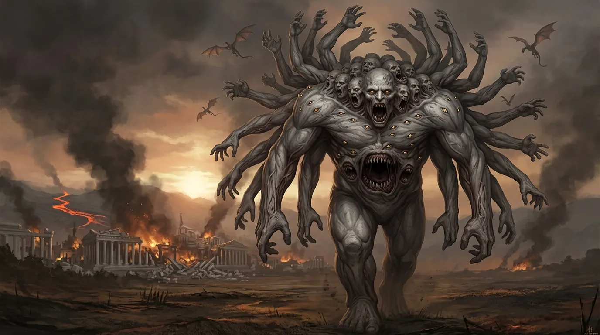
[Prompt](../assets/sessions/083/083_theme_hundred_handed.txt)

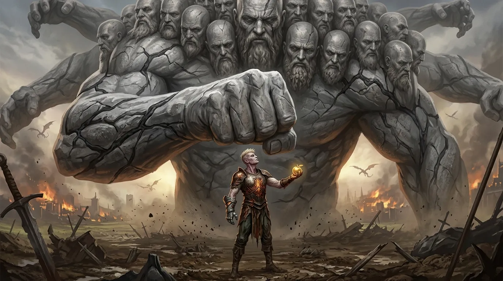
[Prompt](../assets/sessions/083/083_theme_fist_that_stopped.txt)

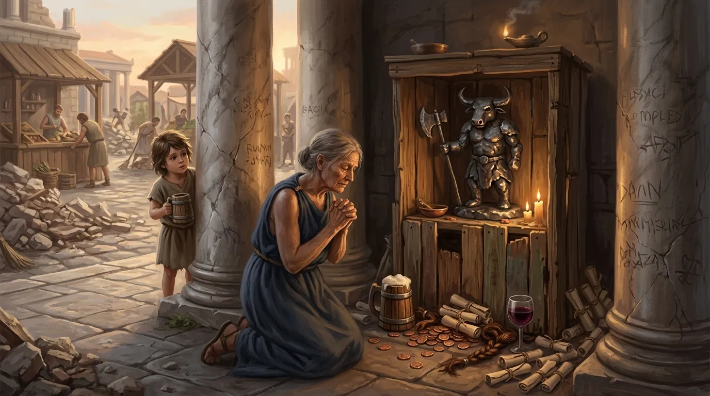
[Prompt](../assets/sessions/083/083_theme_birth_of_a_cult.txt)

### Łaska Mytros i Wezwanie Felicjana

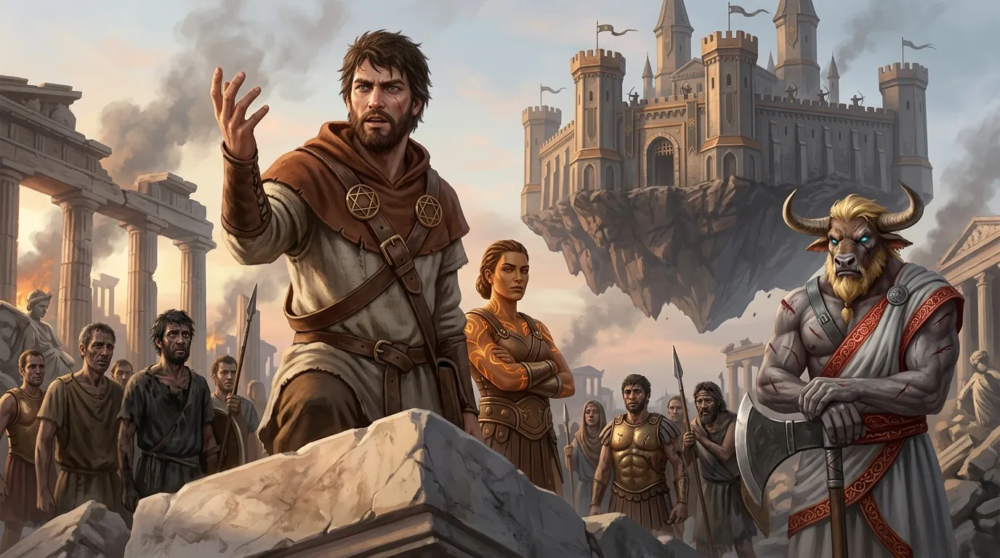
[Prompt](../assets/sessions/083/083_sec1_call_to_the_survivors.txt)

Ledwie opadł kurz po śmierci **[[Lutheria|Lutherii]]**, a nad zgliszczami stolicy zawisła cisza cięższa od wszystkiego, co bohaterowie znosili tej nocy. Nie trwała długo. Ze wschodu, zza dymiących [[Winnice Mytros|winnic]], nadchodziło coś, czego nie dało się pomylić z niczym innym — **[[Kentimane]]**, **[[Kentimane|Mąż Thylei]]**, **[[Kentimane|Ojciec Tytanów]]**, sturęki strażnik kontynentu, ruszył po nich dokładnie tak, jak zapowiedziała umierająca Pani Snów. Nie spieszył się. Nie musiał. Pierwsza wypatrzyła go **[[Arkyrania]]** — smoczym wzrokiem naliczyła z oddali niepokojącą liczbę głów, o wiele więcej niż jedną, i las ramion kołyszących się nad horyzontem jak wędrujący gaj. Ona też oceniła tempo: był ogromny, ale powolny, więc mieli może godzinę. Potem pokręciła głową — sama nie wiedziała, czy da się mu stawić czoła, choć, jak zauważyła, obrońców wciąż było więcej, niż on miał rąk. Z ulic dochodziły już tylko odgłosy drobnych potyczek: gdy do wrogich legionów dotarło wreszcie, że **[[Sydon|Sydona]]** nie ma i nie będzie, zaczęły się rozpraszać jak dym.

Godzinę tę wykorzystali co do minuty. **[[Arevon Elorrenthi|Arevon]]**, wciąż otoczony aurą uzdrowienia, dotknął **[[Orion Xul|Oriona]]** i zamknął jego rany magią, po czym sam pociągnął z fiolki eliksiru. **[[Felicjan Janus Twardowski|Felicjan]]**, **[[Orestes]]** i **[[Orion Xul|Orion]]** usiedli wprost na gruzach i odpoczęli krótko, po zwyczajnemu. Jedynie **[[Versir]]** — pusty, wypalony do dna po walce z **[[Lutheria|Lutherią]]** — sięgnął po łaskę **[[Mytros (Bogini)|Mytros]]**: dar Bogini Świtu pozwolił mu odpocząć pełnią i odzyskać wszystko, co stracił. **[[Klonicjan]]** tymczasem pochylił się nad [[Kryształowa Kosa Lutherii|kryształową kosą]] wydartą martwej Tytance i wyczytał z niej prawdę: broń była potężna, ale jej długotrwałe używanie niosło mroczne, wyniszczające skutki. **[[Orestes]]** zważył ją w dłoni, przyjrzał się jej z ukosa i odłożył bez żalu. „To właśnie ten topór zabił dwóch tytanów" — mruknął, poklepując **[[Topór Xandera]]**.

Wtedy właśnie nad zgliszczami pojawiła się **[[Yala]]**. Przyleciała do **[[Mytros]]** na krótko przed nadejściem **[[Kentimane|Kentimane'a]]** i stanęła wśród obrońców — ostatnie żyjące dziecko **[[Tytani|Tytanów]]** po stronie miasta, przeciw własnemu ojcu. Rada, jaką im przyniosła, brzmiała jak zagadka. Można było **[[Kentimane|Sturękiemu]]** się poddać. Można było kruszyć go powoli, jak kruszy się górę — bo choć jest niczym góra, góry też da się zniszczyć — ale na to trzeba by sił, których być może już nie mieli, chyba że zebraliby przy sobie wszystkich sojuszników. I była droga trzecia: stanąć przed nim dumnie, okazać mu opór, dowieść własnej potęgi, a potem rozkazać mu odejść. Jeśli wykażą się prawdziwą determinacją, **[[Tytani|Tytan]]** okaże im szacunek i zawróci. Brzmiało to absurdalnie — śmiertelnik rozkazujący **[[Kentimane|Sturękiemu]]** — ale wszyscy rozumieli, że bez wcześniejszej demonstracji siły same słowa będą tylko szelestem. **[[Orestes]]** żartobliwie zaproponował, by przyjąć **[[Kentimane|Boga Zniszczenia]]** wśród [[Winnice Mytros|winnic]]. Sam wyjść do ludzi nie chciał — jako nieumarły uznał, że to zły pomysł, a i krasomówcą nigdy nie był. Wyszedł więc **[[Felicjan Janus Twardowski|Felicjan]]**. Bez pompy, bez trąb, stanął przed garstką ocalałych i wezwał ich, by nie uciekali, lecz zebrali siły do ostatniej obrony miasta. Mówił tak, że ludzie zostali — i na wezwanie **[[Felicjan Janus Twardowski|Felicjana]]** zaczęli się schodzić ochotnicy, a rozproszone oddziały obrońców zaczęły zbierać się w [[Latająca Forteca Smoczych Lordów|Latającej Fortecy Smoczych Lordów]].

### Sturęki Nadszedł

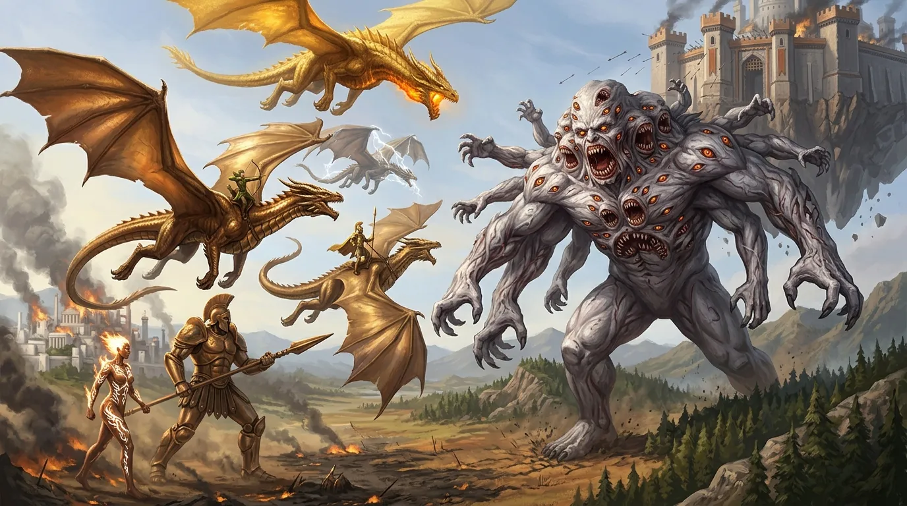
[Prompt](../assets/sessions/083/083_sec2_the_titan_arrives.txt)

Gdy **[[Kentimane]]** przekroczył linię wzgórz, niebo nad **[[Mytros]]** należało już do obrońców. Bohaterowie wzbili się na grzbietach smoczych sojuszników — **[[Sybolkorax]]**, **[[Arkyrania]]**, **[[Tysophale]]** i **[[Raspytrion]]** rozpostarli skrzydła nad ruinami — a **[[Klonicjan]]** ponownie zajął miejsce w sercu **[[Kolos Pythora|Kolosa Pythora]]**, i posadził stalowego olbrzyma na froncie. Obok stanęła **[[Yala]]**, a nad wszystkim krążył złoty smok **[[Helios]]**. **[[Orestes]]** pierwszy naciągnął cięciwę i posłał w **[[Tytani|Tytana]]** strzałę; zaraz po nim strzelił **[[Arevon Elorrenthi|Arevon]]**. Grot elfa trafił w cel, wbił się w skórę pradawnego olbrzyma. Za to pięćdziesiąt głów obróciło się ku niemu naraz, w jednej, doskonale zsynchronizowanej ciszy, i sto oczu zmierzyło elfa spojrzeniem, które nie było gniewem, tylko czymś znacznie gorszym: uwagą.

**[[Helios]]** wygiął szyję i wypuścił z paszczy falę ognia. **[[Orion Xul|Orion]]**, stojąc w strzemionach nad grzbietem [[Raspytrion|Raspytriona]], cisnął magicznym oszczepem, wykrzykując przy tym słowo rozkazu — broń w locie zamieniła się w oślepiającą kolumnę błyskawicy, a zaraz po niej poszła druga; grzmot przetoczył się nad miastem dwukrotnie. **[[Kolos Pythora]]** ruszył naprzód ciężkim, dudniącym krokiem, torując sobie drogę ku **[[Tytani|Tytanowi]]**. **[[Yala]]** uwolniła moc wypaloną w jej skórze — z tatuaży na plecach buchnęła płomienna burza, która rozlała się wokół niej szerokim kręgiem ognia i sięgnęła **[[Kentimane|Sturękiego]]**. Wokół nich smoki nurkowały i zionęły — **[[Tysophale]]** przeciął powietrze białą linią pioruna.

**[[Kentimane]]** przyjął to wszystko tak, jak góra przyjmuje deszcz. Potem zaczął odpowiadać. Dziesiątki ramion wystrzeliły w górę, każde grube jak wieża, i zaczęły łapać — smoki, jeźdźców, wszystko, co znalazło się w zasięgu. Chwytał, ściskał, a potem po prostu szedł dalej, wlokąc pochwyconych za sobą jak człowiek wlokący gałęzie. Nie było w tym złości. Była w tym metodyczność strażnika, który sprząta swój kontynent.

### W Paszczy Tytana

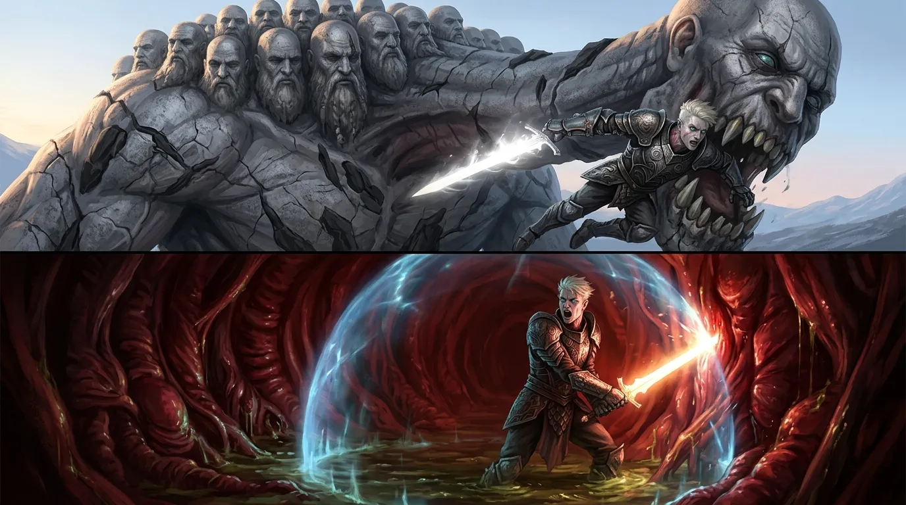
[Prompt](../assets/sessions/083/083_sec3_in_the_maw.txt)

**[[Versir]]** nie czekał. Ze **[[Zguba Tytanów|Zgubą Tytanów]]** w dłoni rzucił się wprost na **[[Kentimane|Ojca Tytanów]]**, a ostrze rozbłysło oślepiającym światłem, gdy wyprowadził cięcie — jedno z dwóch, bo drugie ześlizgnęło się po kamiennej skórze. Krzyknął przy tym w sylvańskim — w tym starym sylvańskim, którym mówili [[Tytani]], zanim jeszcze istniało **[[Mytros]]** — że [[Bliźniaczy Tytani|Bliźniacy]] zasłużyli na wszystko, co ich spotkało. **[[Kentimane|Sturęki]]** wysłuchał tego w milczeniu. A potem jedna z pięćdziesięciu paszcz opadła w dół, kły zwarły się na **[[Versir|Versirze]]** i **[[Kentimane|Bóg Zniszczenia]]** połknął go w całości.

Widok ten wyrwał z **[[Orestes|Orestesa]]** wściekłość, jakiej nie okiełznałby żaden przeklęty los. Minotaur zaszarżował na oślep, odrzucając wszelką ostrożność, i **[[Topór Xandera]]** spadł z siłą, która roztrzaskała żebro **[[Tytani|Tytana]]** — ostrze wyszarpnęło krew ciemną jak roztopiony bazalt. Dwa kolejne zamachy poszły już w powietrze; **[[Kentimane]]** nawet ich nie zauważył. W tym samym czasie ramiona **[[Kentimane|Sturękiego]]** oplotły **[[Helios|Heliosa]]**, a złoty smok, przygwożdżony w uścisku, zaczął rozdzierać pazurami wszystko, do czego mógł sięgnąć.

Powietrzna bitwa rozsypywała się w chaos. Jedno z uderzeń **[[Kentimane|Ojca Tytanów]]** dosięgło **[[Raspytrion|Raspytriona]]** — smok zwiotczał w locie i runął, tracąc przytomność, a **[[Orion Xul|Orion]]** poleciał w dół razem z nim. Uratowała go zbroja: uderzenie o ziemię pochłonęła niemal w całości i wojownik podniósł się z gruzu niemal bez szwanku, tuż u stopy **[[Tytani|Tytana]]**. Stamtąd rozpoczął swój własny, uparty ostrzał. **[[Odkupienie Pythora]]** raz za razem opuszczało jego dłoń, przecinało powietrze i wracało samo. Każde trafienie zostawiało w ciele **[[Kentimane|Sturękiego]]** ranę — i za każdym razem kolejne z pięćdziesięciu oblicz **[[Kentimane|Kentimane'a]]** obracało się powoli w stronę drobnej figurki na dole. **[[Kentimane|Bóg Zniszczenia]]** odpowiedział w sposób, na jaki stać istotę tak starą jak sam kontynent: plunął strumieniem żrącego kwasu, który zasyczał na zielonej macierzy i zamienił ją w czarny popiół. **[[Orion Xul|Orion]]** zdążył jednak odruchowo przywołać dar chromatycznego smoka i uderzenie straciło połowę mocy, spływając po nim zamiast go strawić.

Głęboko wewnątrz, tam gdzie nie docierało żadne światło, **[[Versir]]** wcale nie zamierzał ustąpić. Otoczywszy się magią, która chłonęła żrące soki, ciął wnętrzności **[[Kentimane|Sturękiego]]** **[[Zguba Tytanów|Zgubą Tytanów]]**, a klinga wgryzała się w żywe ściany raz za razem. Rąbiąc, mówił — nie do **[[Kentimane|Kentimane'a]]**, bo nie wierzył, że ten go usłyszy, lecz do siebie, jak ktoś, kto od stuleci prowadzi jedną kłótnię: że to sama **[[Thylea]]** pokazała im, iż prawdziwym zagrożeniem są **[[Bliźniaczy Tytani]]**, i że upór strażnika kontynentu jest ślepotą.

### Sto Rąk i Żniwo Uścisków

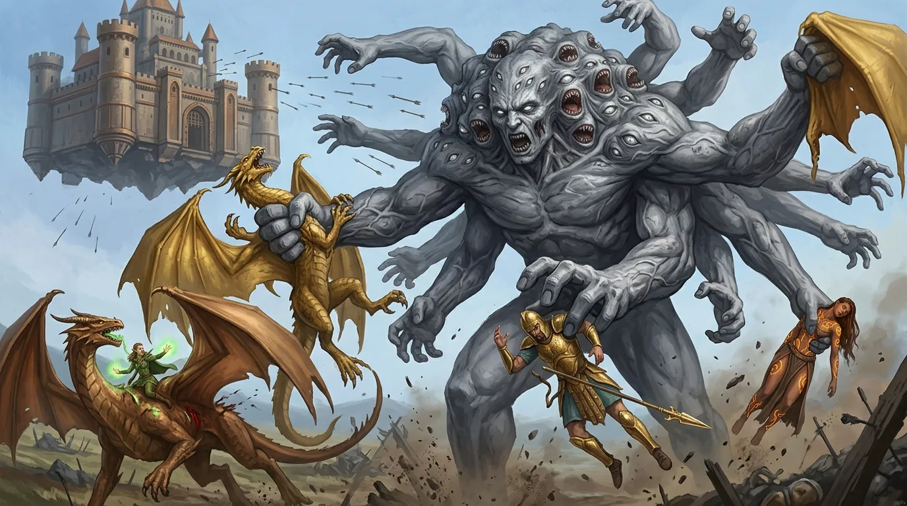
[Prompt](../assets/sessions/083/083_sec4_harvest_of_hands.txt)

Wtedy **[[Tytani|Tytan]]** ruszył się naprawdę — i pole bitwy zaczęło pustoszeć. Sto kamiennych ramion wystrzeliło jednocześnie w kilkunastu kierunkach, a to, co chwyciły, przestawało istnieć jako siła bojowa. **[[Yala]]** znalazła się w jednej z dłoni pierwsza; miażdżący uścisk odebrał jej przytomność, lecz **[[Kentimane]]** nie wypuścił bezwładnego ciała — wlókł ją dalej za sobą przez pola, obojętny, jakby niosło się przypadkowo zerwaną gałąź. **[[Helios]]** też nie zdołał się wyrwać. **[[Orion Xul|Orion]]**, wciąż ciskający włócznią z dołu, usłyszał świst powietrza o chwilę za późno: palce zacisnęły się na nim i wojownik osunął się bez tchu, zawieszony między życiem a śmiercią, a zaraz potem zniknął w jednej z pięćdziesięciu paszcz. **[[Arkyrania]]** dostała prosto w bok — utrzymała się w powietrzu, ale **[[Arevon Elorrenthi|Arevon]]** musiał natychmiast sięgnąć po uzdrawiającą magię, by smoczyca nie osunęła się w dół.

**[[Orestes]]** wszedł w to wszystko z toporem. **[[Topór Xandera]]** spadał na **[[Kentimane|Sturękiego]]** raz po raz, wyrąbując w nim bruzdy, choć minotaur widział doskonale, ilu towarzyszy już zniknęło w pięćdziesięciu paszczach. Ostatecznie oszczędził jeden zamach i zamienił go na krzyk: wrzasnął **[[Kentimane|Kentimane'owi]]** w twarz, że wybije wszystkich, że wybił już jego dzieci i wybije jego samego — a zaraz potem podbił tę groźbę ciosem, który rozpłatał **[[Tytani|Tytana]]** aż do kości. Groza minotaura nie złamała **[[Kentimane|Ojca Tytanów]]**; taka istota nie zna strachu przed śmiertelnikiem. Ale jedna z pięćdziesięciu głów odwróciła się powoli ku niemu i zatrzymała na nim wzrok — i to samo w sobie było czymś więcej, niż osiągnęli do tej pory inni.

**[[Arevon Elorrenthi|Arevon]]** robił, co mógł, by nadążyć za żniwem. Słowem uzdrowienia wyrywał towarzyszy z ciemności, w którą już odpływali. A gdy kolejna dłoń wystrzeliła w jego stronę, druid zdążył jeszcze rzucić zaklęcie, które zasiało w **[[Tytani|Tytanie]]** ułamek wahania — i to nie wystarczyło. Palce zamknęły się na elfie mimo wszystko, a chwilę później **[[Kentimane|Sturęki]]** przełknął go równie obojętnie jak poprzednich. W trzewiach **[[Kentimane|Ojca Tytanów]]** było już trzech **[[Bohaterowie Przepowiedni|Bohaterów Przepowiedni]]**. Z pokładów **[[Latająca Forteca Smoczych Lordów|Latającej Fortecy Smoczych Lordów]]** raz za razem spadała za to ciężka salwa sojuszniczych sił zebranych mową **[[Felicjan Janus Twardowski|Felicjana]]** — deszcz strzał i pocisków przetaczał się nad przedpolem przy każdym natarciu, ginąc w ogromie sylwetki **[[Kentimane|Męża Thylei]]** jak ulewa na zboczu góry.

### Miecz Losu i Nieudane Wygnanie

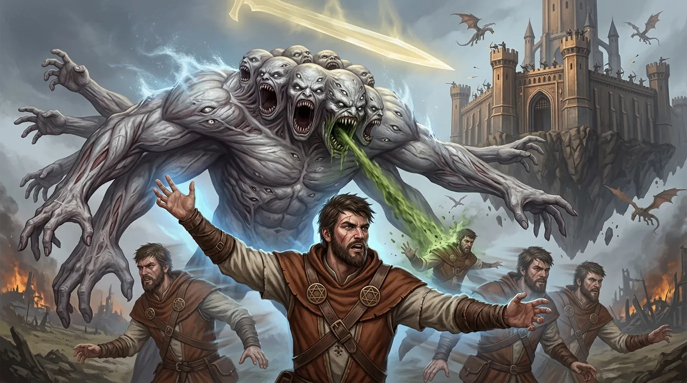
[Prompt](../assets/sessions/083/083_sec5_sword_of_fate.txt)

Wewnątrz, w dusznym mroku pełnym syku trawiących soków, **[[Versir]]** dostrzegł nowego towarzysza niedoli: bezwładnego, połkniętego w całości **[[Orion Xul|Oriona]]**. Nie zawahał się ani chwili. Krótkim, magicznym krokiem przeniósł się do niego przez trzewia **[[Kentimane|Sturękiego]]**, uniósł mu głowę i wlał w usta miksturę leczącą, aż wojownik zakrztusił się i odzyskał oddech.

Na zewnątrz **[[Felicjan Janus Twardowski|Felicjan]]**, otoczony chmarą własnych iluzorycznych sobowtórów, które przesuwały się i mieszały tak, że nie sposób było wskazać czarodzieja prawdziwego, sięgnął po broń, jakiej **[[Kentimane]]** się nie spodziewał. Jeszcze w środku bitwy nad głową **[[Kentimane|Boga Zniszczenia]]** zawisł widmowy miecz losu, widoczny dla wszystkich prócz samego **[[Tytani|Tytana]]**, a wraz z nim wykrzyczany zakaz — warunek rzucony pradawnemu olbrzymowi prosto w twarz, ostrze czekające na złamanie słowa. Kilka natarć później, zbierając całą moc, jaką w sobie miał, **[[Felicjan Janus Twardowski|Felicjan]]** cisnął zaklęciem wygnania, próbując wyrwać **[[Kentimane|Sturękiego]]** z tego świata i odesłać go tam, skąd przyszedł.

**[[Kentimane]]** nie ustąpił. Magia rozpłynęła się na nim jak fala na skale, a **[[Kentimane|Mąż Thylei]]** odpowiedział natychmiast — strumień kwasu poszybował ku **[[Felicjan Janus Twardowski|Felicjanowi]]** i strawił jednego z jego złudnych bliźniaków, który rozwiał się z sykiem. Zaraz potem kolejne ramiona wyciągnęły się po następnych bohaterów, a nad przedpolem znów przetoczył się huk sojuszniczej salwy z twierdzy, bezsilny wobec góry ciała, która wciąż szła naprzód.

### Ostatni Amok Minotaura

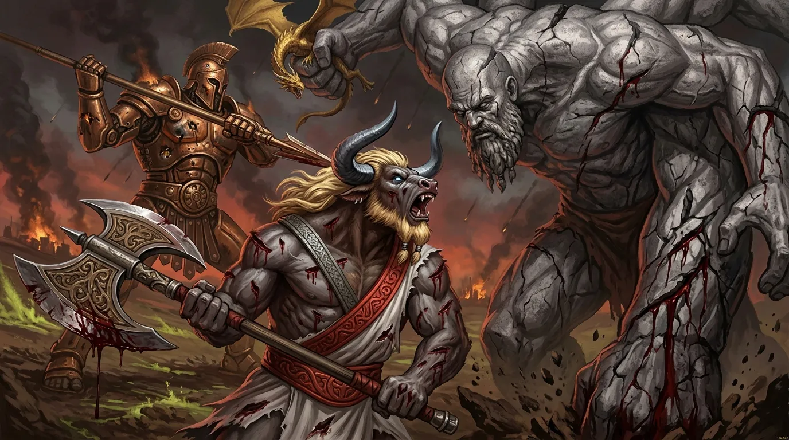
[Prompt](../assets/sessions/083/083_sec6_last_rage_of_the_minotaur.txt)

**[[Orestes]]** nie ustawał w morderczym amoku. **[[Topór Xandera]]** raz po raz wgryzał się w kamienną skórę **[[Kentimane|Sturękiego]]**, a minotaur, brocząc i rycząc, wykrzykiwał **[[Tytani|Tytanowi]]** prosto w jedną z pięćdziesięciu twarzy, że to on położył trupem jego syna i jego córkę — że **[[Sydon]]** i **[[Lutheria]]** zginęli pod tym właśnie ostrzem. Groźba nie zrobiła na **[[Kentimane|Ojcu Tytanów]]** żadnego wrażenia; pradawny olbrzym przyjął ją tak, jak przyjmuje się szum wiatru. **[[Kolos Pythora]]**, prowadzony ręką **[[Klonicjan|Klonicjana]]**, dwukrotnie wbił swą gigantyczną włócznię w bok **[[Kentimane|Kentimane'a]]**, a **[[Kentimane|Bóg Zniszczenia]]** odpowiadał kwasem, chwytał **[[Helios|Heliosa]]** w zaciskającą się dłoń i kąsał wszystko, co znalazło się w zasięgu jego paszcz.

Wewnątrz **[[Tytani|Tytana]]** trwała tymczasem osobna, dużo bardziej samotna wojna. **[[Orion Xul]]**, oślepiony ciemnością i trawiony sokami, oberwał tak, że ledwie utrzymał się na nogach — magiczna odporność, którą w sobie obudził, ocaliła go przed najgorszym. Nie widząc niczego, wojownik dźgał na oślep **[[Odkupienie Pythora|Odkupieniem Pythora]]**, aż włócznia w końcu znalazła miękkie mięso i wróciła mu do ręki, a on sam zaczerpnął z resztek własnego oddechu i zaleczył rany.

Uderzył też **[[Arevon Elorrenthi|Arevon]]** — z tego samego mroku, przemieniony smoczą mocą. Fala czystej siły rozeszła się od niego we wszystkie strony i wstrząsnęła **[[Kentimane|Sturękim]]** od stóp po czubki karków; żołądek **[[Tytani|Tytana]]** dosłownie się zagotował. Elf spróbował jeszcze nastraszyć **[[Kentimane|Ojca Tytanów]]** z wnętrza jego własnych trzewi, co nie zrobiło na pradawnym olbrzymie najmniejszego wrażenia — ale cios owszem. Przez ogromne cielsko przebiegł skurcz tak gwałtowny, że **[[Kentimane]]** zwymiotował, i to właśnie **[[Arevon Elorrenthi|Arevona]]** wyrzucił z siebie na pola, ciśniętego w błoto razem z falą żrącej treści. Pole bitwy wyglądało jednak coraz gorzej: **[[Yala]]** i **[[Arkyrania]]** leżały gdzieś w pyle, walcząc o każdy oddech, a ich życie wisiało na włosku dłużej, niż ktokolwiek chciał liczyć.

### Pięść, Która Się Zatrzymała

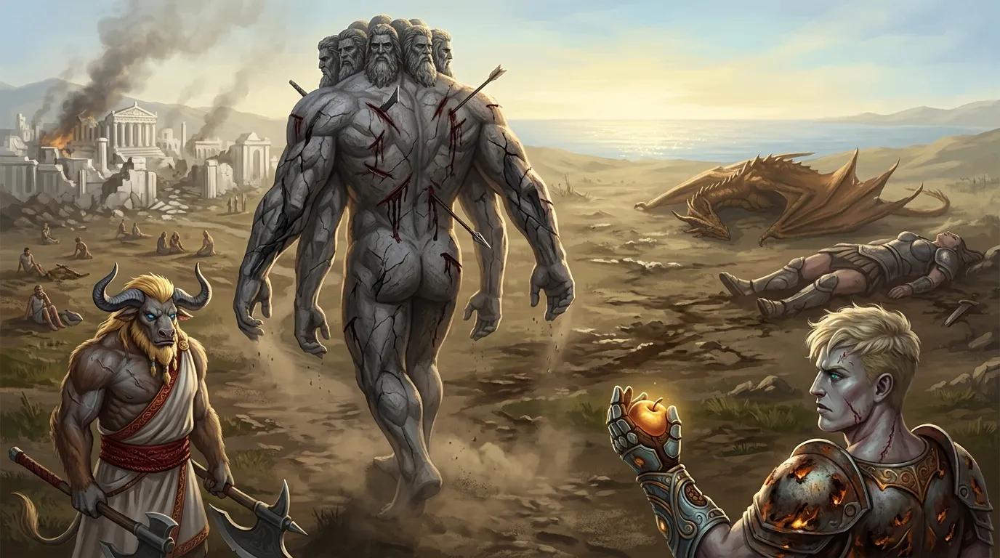
[Prompt](../assets/sessions/083/083_sec7_the_titan_turns_away.txt)

**[[Versir]]**, wciąż uwięziony w trzewiach, miał wreszcie dość. „Orionie, zmiatajmy stąd" — rzucił i rozdarł przestrzeń zaklęciem przejścia, wyrywając siebie i **[[Orion Xul|Oriona]]** z wnętrza **[[Tytani|Tytana]]** w ostatnie miejsce, które pamiętał z zewnętrznego świata. Nie potrafił zostawić towarzysza za sobą. Zaraz potem, nie tracąc tempa, przeniósł się jeszcze raz — prosto przed oblicze **[[Kentimane|Kentimane'a]]**, tak blisko, że sto pradawnych oczu mogło policzyć każdą bruzdę na jego twarzy.

**[[Versir]]** wyciągnął **[[Zlote Owoce|złoty owoc]]**. I przemówił — nie jako petent, lecz jako krewny. Powiedział **[[Kentimane|Sturękiemu]]**, że **[[Bohaterowie Przepowiedni]]** spełniają wolę samej **[[Thylea|Thylei]]**, że to ona pokazała im, jakim zagrożeniem stali się **[[Bliźniaczy Tytani]]**, i że zabili ich po to, by chronić kontynent. Że jeśli **[[Kentimane|Mąż Thylei]]** tego nie zrozumie, zginie tu dzisiaj. I że on, **[[Versir]]**, nie chce już patrzeć na kolejnego członka własnej rodziny pochłoniętego szaleństwem. Pierwsze słowa nie chwyciły. Dopiero gdy sięgnął w głąb siebie i powtórzył je z niezachwianą, absolutną pewnością, coś w **Tytanie** drgnęło.

Pięść wielkości okrętu, cios, który zmiażdżyłby każdego z bohaterów, uniosła się — i zatrzymała w połowie. Zawisła o włos nad głową **[[Versir|Versira]]**. Pięćdziesiąt głów obróciło się jednocześnie, sto pradawnych oczu zmierzyło go w ciszy straszniejszej niż jakikolwiek ryk. Przez chwilę, która trwała wieczność, **[[Kentimane|Kentimane Stu Ręki]]** rozważał. Bo oni też byli dziećmi **[[Thylea|Thylei]]**, krwią tej ziemi — i właśnie zrobili coś, co **[[Kentimane|Sturęki]]** potrafi zrozumieć. Nie ugięli się. Coś tak małego stanęło przed czymś tak wielkim i kazało temu czemuś ustąpić, nie cofając się o krok. Pięść opadła. Powoli. Ramię wyprostowało się. **[[Kentimane|Bóg Zniszczenia]]** odwrócił pięćdziesiąt twarzy ku wschodowi, skąd przyszedł, i bez jednego słowa ruszył okrężną drogą z powrotem ku morzu. Apokaliptyczna bitwa o **[[Mytros]]** skończyła się nie triumfalnym ciosem, lecz aktem zrozumienia między bogiem a garstką śmiertelników. **[[Orestes]]** kwitował to niemal z żalem — liczył na trzeciego **[[Tytani|Tytana]]** pod swoim toporem.

### Popiół, Igrzyska i Pierwsze Kapliczki

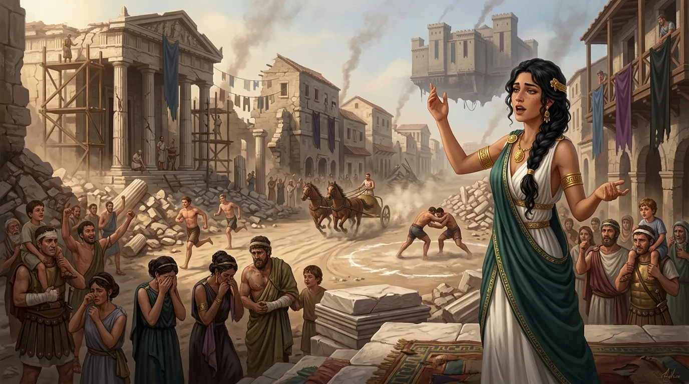
[Prompt](../assets/sessions/083/083_sec8_funeral_games.txt)

Po raz pierwszy od wielu godzin nad **[[Mytros]]** zapadła prawdziwa cisza — nie cisza grozy, lecz cisza po burzy. Gdzieś z dymu dobiegł dźwięk, którego nikt się już nie spodziewał: ktoś się roześmiał. Nie był to obłąkany chichot narzucony magią **[[Lutheria|Lutherii]]**, tylko zwyczajny, ludzki śmiech ulgi. Część ocalałych wciąż wypatrywała następnego zagrożenia, ale następne zagrożenie nie nadeszło. Wylew lawy udało się opanować bez udziału bohaterów — strumień poszedł na północ, wypalił pola i zabudowania, lecz samo miasto nie spłonęło. Przed wojną **[[Mytros]]** liczyło jakieś pięćdziesiąt tysięcy dusz; zginęło ponad trzy tysiące. Był to prawdopodobnie najlepszy wynik bitwy przeciwko **[[Tytani|Tytanom]]** w dziejach **[[Kontynent Thylea|Thylei]]** — a i tak każdy z tych trzech tysięcy miał imię i na każdego z nich ktoś czekał. Wśród nich była **[[Darien]]** — prawowita królowa [[Amazonki|Amazonek]], która przypłynęła ze swoimi Lwicami bronić cudzego miasta i poległa na płonącym nabrzeżu doków, prowadząc łuczniczki, jeszcze zanim zapadł zmierzch pierwszego i jedynego dnia tej wojny. Panowała ledwie kilka miesięcy.

Jeszcze zanim opadł pył, przez zawalone ulice przedarł się do **[[Orestes|Orestesa]]** **[[Brax]]** — na grzbiecie **[[Nessa|Nessy]]**, centaurzycy z **[[Przeklęte Plemię|Przeklętego Plemienia]]**, kuzynki **[[Pholon|Pholona]]**, obnażonej i z gołym torsem, sadzącej przez rumowisko wielkimi skokami. **[[Brax]]** dopadł minotaura rozgorączkowany i jednym tchem wyrzucił z siebie historię, którą zdążył już od kogoś usłyszeć: o tym, jak **[[Orestes]]** zabił **[[Lutheria|Panią Snów]]**. Opowieść zdążyła nabrać barw jeszcze zanim dotarła do ucha samego bohatera. **[[Orestes]]** nie miał najmniejszego zamiaru jej prostować — przeciwnie, dorzucił od siebie, że jej brata też położył pod tym samym toporem i że **[[Sydon]]** kwiczał przy tym jak wieprzek. „Tak było, nie zmyślam" — zapewniał. „Widzisz, Brax, problem jest taki, że suka mnie zabiła, ale nie do końca. A ja ją zrobiłem tak do końca". Legenda rosła w oczach, a bohaterowie sami dokładali do niej opału.

Żałoba w **[[Mytros]]** wyglądała inaczej, niż można było się spodziewać: w mieście zabrakło i drewna na stosy, i kapłanów do obrzędów. Przez dwadzieścia dni trwały za to igrzyska pogrzebowe — biegi, zapasy, wyścigi rydwanów po odgruzowanym odcinku głównej drogi. **[[Kyrah]]**, w ludzkiej postaci, śpiewała; nie tak pięknie jak niegdyś, ale wciąż pięknie. Śpiewała o czynach bohaterów i o bohaterstwie obrońców miasta, a pieśń o ich odysei rosła z tygodnia na tydzień, za każdym razem odrobinę inna. Nikt nie prostował faktów. Legenda puchła sama.

Wdzięczność szybko przerodziła się w cześć. W **[[Mytros]]**, w **[[Estoria|Estorii]]** i w okolicznych osadach zaczęły wyrastać pomniki przedstawiające piątkę bohaterów. Jakieś cztery tygodnie po bitwie, w bocznym załomie **[[Targ Minotaurów|Targu Minotaurów]]**, stanęła pierwsza kapliczka — zbita z desek, mało imponująca, z figurką z kawałka metalu, dzierżącą topór. Ktoś postawił przed nią kufel. Tydzień później takich miejsc było już kilka, a ostatecznie na każdego z **[[Bohaterowie Przepowiedni|Bohaterów Przepowiedni]]** przypadły ze trzy. Ludzie zostawiali tam monety, wino, kosmyki włosów i prośby zapisane na pergaminach — o powrót męża z wojny, o dziecko, o zdjęcie klątwy, o to, żeby brat wreszcie przestał pić. Prosili o rzeczy, których żaden z bohaterów nigdy nie obiecał.

### Spłacony Dług

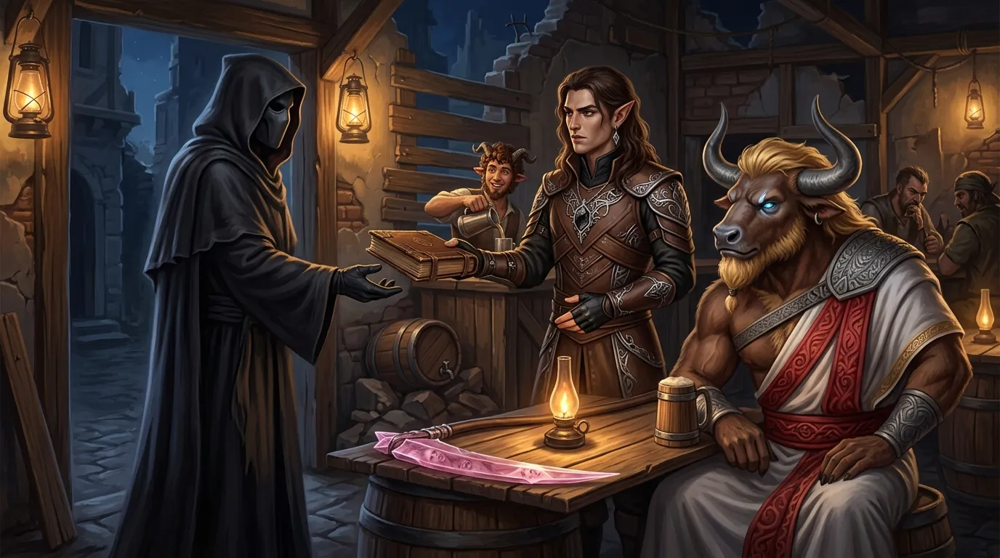
[Prompt](../assets/sessions/083/083_sec9_the_debt_collected.txt)

Zanim jeszcze opadł kurz po naradach, padło pytanie, czy **[[Orestes|Orestesa]]** da się w ogóle przywrócić do życia. **[[Vallus]]** z wyraźną niechęcią przyznała, że pomóc mogłyby chyba tylko **[[Mojry]]**. **[[Arevon Elorrenthi|Arevon]]** wątpił, czy w ogóle ocalał na kontynencie kapłan dość potężny, by dokonać tego inaczej.

**[[Brax]]** wraz z pomocnikami zdołał sklecić w ruinach prowizoryczny **[[Super Bar]]**. **[[Orestes]]**, choć jako nieumarły nie czuł już smaku piwa, i tak zaglądał tam niemal co wieczór — opowiadając kolejnym słuchaczom tę samą, coraz bardziej rozrośniętą historię o śmierci **[[Lutheria|Lutherii]]**. Pewnego wieczoru do baru wszedł ktoś w ciemnym kapturze. **[[Mistrz Cieni]]** przybył upomnieć się o dług, za który zapłacił z góry jeszcze przed bramą **[[Wiszące Ogrody|Wiszących Ogrodów]]** w **[[Arezja|Arezji]]**: jedna księga ze skarbca **[[Praxys]]** i zero pytań. Wieża **[[Sydon|Sydona]]** padła, ale księga nie — **[[Traktat o Prawach i Zobowiązaniach Krwi]]** leżał w bagażu drużyny od dnia, w którym runęła. **[[Arevon Elorrenthi|Arevon]]** oddał go bez sprzeciwu — targ to targ — prosząc jedynie, by nieznajomy wyjaśnił, co właściwie czyni tę księgę wartą tak wysokiej ceny, bo drużyna sama niczego szczególnego w niej nie znalazła. Odpowiedzi nie dostał, a wszelkie próby wybadania nieznajomego rozbiły się o osłonę, którą ten nosił na sobie.

Przy okazji **[[Mistrz Cieni]]** złożył jednak ofertę. Doszły go, jak rzekł, słuchy o nieszczęsnej przypadłości minotaura — i mógłby pomóc. Ceną za powrót **[[Orestes|Orestesa]]** do świata żywych miała być **[[Kryształowa Kosa Lutherii]]**, wciąż spoczywająca w rękach drużyny. Zapytany, czy artefakt musi być w jednym kawałku, zastanowił się chwilę i z wyraźną łaskawością przystał: odłamki też się nadadzą, byle komplet. Odbiór miał nastąpić w **[[Arezja|Arezji]]**, a decyzji nie trzeba było podejmować od razu — oferta miała pozostać ważna przez rok. **[[Orestes]]** jej nie odrzucił, ale zaznaczył, że najpierw musi się naradzić z towarzyszami. Sama cena nie kłóciła się z jego obietnicą — roztrzaskanie kosy i tak uwolniłoby uwięzione w ostrzu dusze, a wśród nich dusze jego własnych rodziców, a **[[Mistrz Cieni|Mistrzowi Cieni]]** wystarczyłyby odłamki. Problem był inny: nikt nie wiedział, po co nieznajomemu ta kosa, a nikt z drużyny mu nie ufał.

Rozmowy ciągnęły się jeszcze długo po odejściu zakapturzonego gościa. **[[Orestes]]** ważył ponuro, czy pośpiech się opłaca: z jednej strony wizja przyszłości, w której prowadzi własny bar i sprzedaje piwo, wymagała żywego ciała; z drugiej — jako nieumarły przetrwałby wszystkich towarzyszy i sam jeden zbierałby modlitwy wyznawców, kiedy ich kult dawno by już przeminął. Wolałby jednak nie zgnić, zanim się zdecyduje. W tle majaczyły już następne cele: **[[Morze Otchłani]]**, **[[Talieus]]** i konieczność znalezienia nowych **[[Mojry|Mojr]]**, na które trudno o ochotników.

## Kluczowe wydarzenia
* Na [[Bohaterowie Przepowiedni]] spłynęła łaska bogini [[Mytros (Bogini)|Mytros]], dając im siły do ostatecznej obrony miasta przed nadejściem [[Kentimane|Kentimane'a]].
* [[Klonicjan]] zidentyfikował [[Kryształowa Kosa Lutherii|Kryształową Kosę Lutherii]] — potężną, ale wyniszczającą przy długim używaniu; [[Orestes]] odłożył ją i został przy [[Topór Xandera|Toporze Xandera]].
* [[Yala]] przedstawiła trzy drogi wobec [[Kentimane|Kentimane'a]]: poddać się, skruszyć go siłą wszystkich sojuszników, albo okazać mu potęgę i godnie rozkazać mu odejść.
* [[Felicjan Janus Twardowski|Felicjan]] wygłosił mowę do ocalałych mieszkańców [[Mytros]] i zebrał ochotników oraz rozproszone oddziały — ich salwy z [[Latająca Forteca Smoczych Lordów|Latającej Fortecy Smoczych Lordów]] wspierały drużynę przez całą bitwę.
* Bitwa rozegrała się nad polami na wschód od [[Mytros]]; drużyna walczyła ze smoczych grzbietów, wspierana przez [[Latająca Forteca Smoczych Lordów|Latającą Fortecę Smoczych Lordów]], [[Kolos Pythora|Kolosa Pythora]] pilotowanego przez [[Klonicjan|Klonicjana]], złotego smoka [[Helios|Heliosa]] i [[Yala|Yalę]].
* [[Kentimane]] połknął kolejno [[Versir|Versira]], [[Orion Xul|Oriona]] i [[Arevon Elorrenthi|Arevona]]; [[Versir]] walczył w trzewiach [[Zguba Tytanów|Zgubą Tytanów]] i teleportował się do nieprzytomnego [[Orion Xul|Oriona]], by wlać mu miksturę leczącą.
* [[Arevon Elorrenthi|Arevon]] uwolnił z wnętrza [[Tytani|Tytana]] falę czystej siły — [[Kentimane]] zwymiotował i wyrzucił druida z powrotem na pola.
* [[Felicjan Janus Twardowski|Felicjan]] zawiesił nad [[Kentimane|Kentimane'em]] widmowy miecz losu z wykrzyczanym warunkiem, a następnie spróbował wygnać [[Tytani|Tytana]] z tego świata — bezskutecznie.
* [[Orestes]] wykrzyczał [[Kentimane|Kentimane'owi]], że to on zabił jego dzieci — jedna z pięćdziesięciu głów [[Tytani|Tytana]] odwróciła się ku niemu.
* [[Versir]] wyrwał siebie i [[Orion Xul|Oriona]] z trzewi [[Tytani|Tytana]], stanął przed jego obliczem ze złotym owocem i w imię woli [[Thylea|Thylei]] zażądał, by [[Kentimane]] przerwał walkę.
* [[Kentimane]] zatrzymał pięść o włos nad [[Versir|Versirem]], uznał w bohaterach dzieci [[Thylea|Thylei]], które się nie ugięły — i bez słowa odszedł na wschód ku morzu. Bitwa o [[Mytros]] dobiegła końca.
* [[Mytros]] ocalało: z około pięćdziesięciu tysięcy mieszkańców zginęło ponad trzy tysiące — prawdopodobnie najlepszy wynik bitwy przeciwko [[Tytani|Tytanom]] w dziejach [[Thylea|Thylei]].
* Wśród poległych była [[Darien]], królowa Amazonek, która zginęła na płonącym nabrzeżu doków, prowadząc łuczniczki.
* [[Brax]] na grzbiecie [[Nessa|Nessy]] przedarł się przez ruiny do [[Orestes|Orestesa]] z zasłyszaną, już podkoloryzowaną opowieścią o śmierci [[Lutheria|Lutherii]] — minotaur jej nie prostował, tylko dorzucił własne przechwałki.
* Przez dwadzieścia dni trwały igrzyska pogrzebowe; [[Kyrah]] w ludzkiej postaci śpiewała rosnącą z tygodnia na tydzień pieśń o odysei bohaterów.
* W [[Mytros]] i [[Estoria|Estorii]] zaczęły powstawać pomniki i kapliczki — pierwsza, poświęcona [[Orestes|Orestesowi]], stanęła na [[Targ Minotaurów|Targu Minotaurów]] cztery tygodnie po bitwie. Narodził się kult [[Bohaterowie Przepowiedni|Bohaterów Przepowiedni]].
* [[Mistrz Cieni]] odebrał dług — [[Traktat o Prawach i Zobowiązaniach Krwi]] ze skarbca [[Praxys]] — i zaproponował [[Orestes|Orestesowi]] powrót do świata żywych w zamian za [[Kryształowa Kosa Lutherii|Kryształową Kosę Lutherii]], dostarczoną do [[Arezja|Arezji]] (wystarczą odłamki, byle komplet); oferta jest ważna przez rok.
* [[Vallus]] przyznała, że przywrócić [[Orestes|Orestesowi]] żywe ciało mogłyby chyba tylko [[Mojry]].

## Cytaty
* Yala (o Kentimane): "On jest wielki. Jest niczym góra. Ale górę też się da zniszczyć — drążąc powoli."
* Yala: "Musicie okazać mu swoją siłę. Stanąć przed nim dumnie, stawić mu opór, a potem rozkazać mu odejść. Jeśli wykażecie się prawdziwą determinacją, okaże wam szacunek i odejdzie."
* Orestes: "Właśnie, dlatego ten topór zabił dwóch tytanów."
* Orestes: "Napiłbym się piwa, ale jednocześnie nie napiłbym się piwa. Na mnie nie patrzcie, ja już jestem martwy."
* Versir (z trzewi Tytana): "Czego nie rozumiesz, ty skończony, uparty głupcze! To ta Thylea nam pokazała, że bliźniacy są zagrożeniem, ty skończony idioto!"
* Orestes: "Zajebie wszystkich! Zajebałem twoje dzieci, zajebie i ciebie."
* Orion (z wnętrza Kentimane'a): "Odejdź. Zostaw nas w spokoju. Wracaj do twojego leża."
* Versir (w żołądku Tytana): "Mam tego dość. Orionie, zmiatajmy stąd."
* Versir (przed obliczem Kentimane'a, ze złotym owocem w dłoni): "Spełniamy wolę Thylei, głupcze. Ona nam pokazała, jakim zagrożeniem są bliźniacy. Zrobiliśmy to, żeby chronić kontynent. Zrozum to. A jeśli tego nie zrozumiesz, to zginiesz tu dzisiaj."
* Orestes: "Widzisz, Brax, problem jest taki, że suka mnie zabiła, ale nie do końca. A ja ją zabiłem tak do końca."
* Mistrz Cieni (o Kryształowej Kosie): "To jest cena. Za twój powrót do żywych."
* Arevon (o pośpiechu z przywróceniem Orestesa do życia): "Ja nie wiem, czy zombie jest lepszy niż szkielet, więc..."

## Postacie
* [[Kentimane]]
* [[Yala]]
* [[Helios]]
* [[Klonicjan]]
* [[Arkyrania]]
* [[Sybolkorax]]
* [[Tysophale]]
* [[Raspytrion]]
* [[Mytros (Bogini)]]
* [[Kyrah]]
* [[Vallus]]
* [[Darien]]
* [[Brax]]
* [[Nessa]]
* [[Mistrz Cieni]]

## Lokacje
* [[Mytros]]
* [[Targ Minotaurów]]
* [[Super Bar]]
* [[Latająca Forteca Smoczych Lordów]]
* [[Estoria]]
* [[Arezja]]
* [[Morze Otchłani]]

## Przedmioty
* [[Topór Xandera]]
* [[Zguba Tytanów]]
* [[Odkupienie Pythora]]
* [[Kryształowa Kosa Lutherii]]
* [[Kolos Pythora]]
* [[Traktat o Prawach i Zobowiązaniach Krwi]]
