**Data**: 10.08.2026

## Podsumowanie

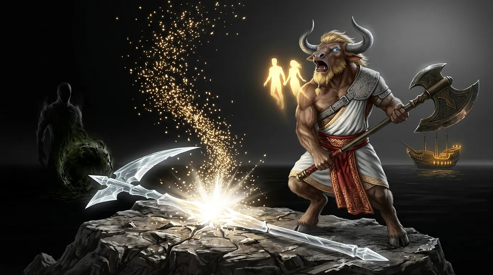
[Prompt](../assets/sessions/084/084_theme_shattering_the_scythe.txt)

### Smak Ciepłego Piwa

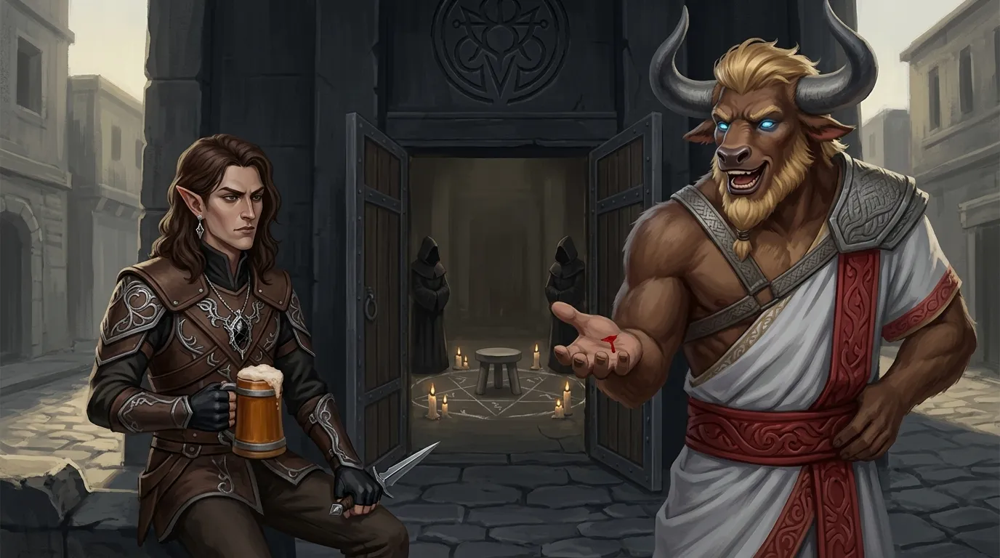
[Prompt](../assets/sessions/084/084_sec1_taste_of_warm_beer.txt)

Pierwsze dni po zakończonej bitwie o **[[Mytros]]** nie przyniosły bohaterom spokoju, lecz naradę, która ciągnęła się z uporem godnym rady starszych. **[[Orestes]]** — wciąż zamknięty w martwym, powoli obumierającym ciele — podniósł kwestię, która paliła go najbardziej: rozbicie **[[Kryształowa Kosa Lutherii|Kryształowej Kosy Lutherii]]** i odzyskanie żywego cielska. Minotaur nie owijał w bawełnę, nazywając zmarłą Tytankę słowami znacznie mniej dwornymi niż jej tytuły, a jego argumentacja była równie prosta co skuteczna: skoro **[[Mistrz Cieni]]** potrafi przeprowadzić odpowiedni rytuał, to warto oddać mu odłamki, a gdyby kiedykolwiek okazał się zagrożeniem — są przecież **[[Bohaterowie Przepowiedni|Bohaterami Przepowiedni]]** i poradzili sobie z gorszymi.

Reszta drużyny nie podzielała tej beztroski. **[[Felicjan Janus Twardowski|Felicjan]]** deklarował, że rozbicie kosy popiera, ale samego artefaktu nikomu nie odda: zbyt wyraźnie widział, że w **[[Arezja|Arezji]]** ktoś systematycznie zbiera relikwie po dawnych bogach, a domeny boskie stoją teraz puste i kuszą. Oddanie kosy mogłoby po prostu wynieść nowego pretendenta na miejsce, które zwolniła **[[Lutheria]]**. **[[Arevon Elorrenthi|Arevon]]** wtórował mu ostrożnym „jeszcze nie", żądając kilku dni na rozmowy z tymi, którzy mogliby cokolwiek wiedzieć — z **[[Vallus]]**, z **[[Yala|Yalą]]**, nawet z **[[Helios|Heliosem]]**. **[[Versir]]** ostatecznie opowiedział się za zniszczeniem ostrza, a **[[Orion Xul|Orion]]** machnął ręką i zgodził się, byle sprawa ruszyła z miejsca. Ustalono kompromis: najpierw kosa idzie w drzazgi i dusze odzyskują wolność, a dopiero potem rozmawia się o tym, co zrobić z odłamkami.

Padły też inne propozycje przywrócenia Orestesowi życia — takie, które wymagałyby czekania długich lat, aż ktokolwiek w [[Kontynent Thylea|Thylei]] sięgnie po magię dostatecznie potężną. Minotaur odrzucił je z obrzydzeniem: piętnaście lat gnicia to piętnaście lat bez smaku piwa, a tego żaden argument nie przebijał.

Pozostała logistyka. **[[Ultros]]** był zbyt poharatany, by wyjść w morze, i wymagałby zwołania od nowa ogromnej załogi, więc wybór padł na **[[Tranquility]]** — galeon z [[Eberron|Eberronu]], w którego kadłubie uwięziony jest żywiołak służący za napęd. Statek nie ma ani żagli, ani wioseł: normalnie prowadzi go ten, kto nosi Znamię Burzy — a jedynym nosicielem był kapitan **[[Tars d’Lyrandar|Tars d'Lyrandar]]**. Okazało się jednak, że przez czas spędzony w rękach **[[Sydon|Sydona]]** okręt został przerobiony: ludzie Tytana Znamienia nie mieli, a mimo to statek dla nich pływał. **[[Arevon Elorrenthi|Arevon]]** stanął za kołem sterowym, przekonał się, że napęd słucha także jego, i dzięki temu mógł zostawić [[Tars d’Lyrandar|Tarsa]] na lądzie zamiast wciągać go w kolejną awanturę. Zapowiedział przy tym, że spróbuje raczej dogadać się z żywiołakiem w pierwotnej mowie niż poganiać go batem. Zabrano też ze sobą przedmiot związany z rodzimym planem — awaryjną furtkę powrotną, gdyby Otchłań okazała się mniej gościnna, niż zapowiadano.

**[[Morze Otchłani]]** przywitało ich tak, jak zwykle wita żywych: głuchą ciszą i światłem, które nie pochodzi znikąd. Drużyna wybrała na miejsce egzekucji jedną z wysepek i tam **[[Orestes]]** dopełnił obietnicy. Jeden zamach, prosto w środek kryształu. Przez pierwszą chwilę wydawało się, że nie stało się nic — a potem wzdłuż ostrza pobiegła cienka rysa, coraz szersza, aż **[[Kryształowa Kosa Lutherii]]** pękła z hukiem i rozbłyskiem białego światła. Razem z hukiem rozległo się westchnienie tysięcy głosów naraz, a z rozbitego kryształu wyroiły się niezliczone punkty blasku, unosząc się ku górze niczym iskry z rozbitego ogniska.

Dwie z nich zatrzymały się przy minotaurze. Nie przemówiły ani nie przybrały kształtu — poczuł jedynie, jakby ktoś położył mu dłoń na barku, a chwilę potem, jakby ktoś ucałował go w czoło. Znał te gesty. Znał tych, którzy je wykonywali. „W końcu jesteście wolni" — wykrztusił, gdy światła zaczęły blednąć i odpływać gdzieś dalej, tam, dokąd nie sięga już żaden targ ani żadna kosa. Świętowanie trwało jednak krótko, bo z resztek artefaktu wypełzło światło zupełnie innego rodzaju: mroczniejsza kula energii, która na moment przybrała półmaterialny kształt postaci górującej nad drużyną. Przez kilka uderzeń serca zdawała się ich obserwować, po czym rozwiała się bez słowa. Bohaterowie pozbierali wszystkie odłamki co do jednego — zajęło im to sporo czasu — i ruszyli dalej.

Powrót na kontynent nie uciszył wątpliwości. **[[Felicjan Janus Twardowski|Felicjan]]** wciąż powtarzał, że oddając odłamki, wzmacniają potencjalnego wroga, na co **[[Versir]]** odpowiadał, że nieufność to jeszcze nie wrogość. **[[Arevon Elorrenthi|Arevon]]** wtrącił do sporu swoją własną, eberrońską teologię: bogowie to dalekie istoty, które żyją własnym życiem i nie powinny mieszać się w losy śmiertelników, a jedyne, w co on sam wierzy, to niezliczone tysiące przodków, radzące wspólnie po drugiej stronie — cały panteon zmarłych. Minotaur skwitował to prychnięciem, że oto człowiek z zadymionego **[[Eberron|Eberronu]]** ogłasza, że bogów nie ma.

Skoro jednak nikt nie potrafił wskazać lepszego wyjścia, ustalono plan awaryjny: **[[Versir]]** zaproponował, by wypytać **[[Kyrah]]** o znajomości w **[[Arezja|Arezji]]** i po cichu rozwinąć tam siatkę szpiegowską, która z czasem odpowie na pytanie, po co [[Mistrz Cieni|Mistrzowi Cieni]] relikwie po dawnych bogach.

**[[Felicjan Janus Twardowski|Felicjan]]** koniecznie chciał zobaczyć sam rytuał — nie po to, by go przerwać, lecz by zrozumieć, co dokładnie robią zakapturzeni. Rozważano magiczne podglądanie, **[[Arevon Elorrenthi|Arevon]]** oferował, że osłoni się przed wykryciem. Wszystko na nic: ludzie [[Mistrz Cieni|Mistrza Cieni]] są równie dobrzy w szpiegowaniu, co w niedopuszczaniu do siebie szpiegów, a magia przekraczająca granice ich posiadłości nie miała szans przejść niezauważona.

Zanim **[[Orestes]]** przekroczył próg **[[Świątynia Cieni|Świątyni Cieni]]**, wymógł jeszcze na gospodarzach przysięgę — twardą gwarancję, że rytuał zadziała aż do śmierci. Poszli mu na rękę. Drzwi otworzyły się wyłącznie przed nim; towarzyszy nie wpuszczono, więc **[[Arevon Elorrenthi|Arevon]]** usiadł na murze świątyni i postanowił czekać, aż minotaur wyjdzie.

Sam rytuał okazał się rozczarowująco nudny. Wpuszczono minotaura dopiero po zmierzchu, posadzono na kamiennym taborecie pośrodku sali, wokół rozrysowano glify, zapalono świece — i tak minęło dziewięć godzin. Postacie w czerni pojawiały się w pozornie przypadkowych momentach, wznosząc pieśni w nieznanym języku; **[[Orestes]]**, nie mając nic lepszego do roboty, zapamiętywał melodię, bo wpadała w ucho. W końcu przysnął. A gdy otworzył oczy, poczuł, że musi wziąć oddech — czego nie robił od bardzo dawna. Zaraz potem rozbolało go wszystko: każdy mięsień, każda kość. Ból sprawiał mu satysfakcję.

Na zewnątrz czekał **[[Arevon Elorrenthi|Arevon]]** — ze sztyletem w jednej ręce i kuflem w drugiej. Zamiast powitania dźgnął minotaura w dłoń, żeby sprawdzić, czy krwawi; krwawił, więc druid uleczył ranę magią i podał piwo. Było ciepłe i wygazowane, a mimo to okazało się jednym z najlepszych trunków, jakie **[[Orestes]]** pił w życiu, bo po raz pierwszy od dawna poczuł smak. Minotaur dziękował wylewnie wszystkim naokoło, zapewniał, że w świątyni nie widział ani jednego trupa, tylko stołek i długie nucenie, i zapowiadał, że z zapamiętanej melodii ułoży kiedyś piosenkę. Zdecydowanie szczęśliwszy — i zdecydowanie żywszy niż dziewięć godzin wcześniej — wrócił do **[[Mytros]]**.

### Wyzwolenie Talieusa Pierwszego

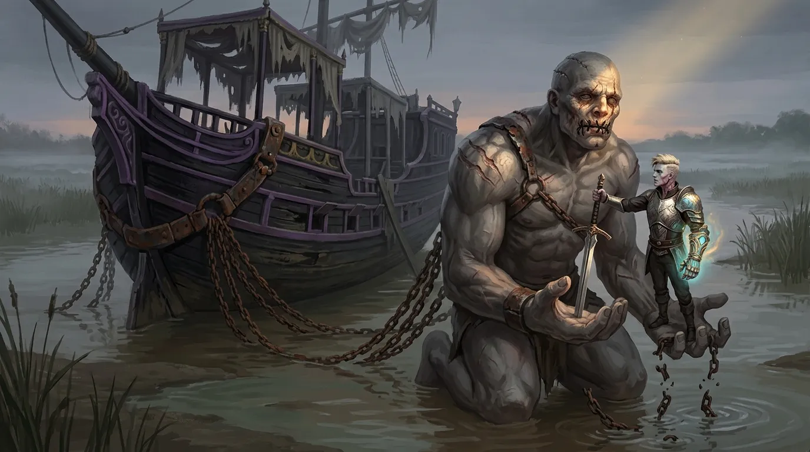
[Prompt](../assets/sessions/084/084_sec2_freeing_the_blind_titan.txt)

Niedaleko ujścia [[Rzeka Lethe|rzeki Lethe]] odnaleźli zacumowany **[[Hypnos]]**, barkę **[[Lutheria|Lutherii]]**. Do kadłuba wciąż przykuty był **[[Talieus Pierwszy]]** — Tytan Rzemiosła, wuj **[[Versir|Versira]]** — oślepiony, z zaszytymi ustami, zaprzęgnięty w łańcuchy dokładnie tam, gdzie go zostawiono. Barka nie miała innego napędu niż on: ogromny i wciąż potwornie silny, ciągnął **[[Hypnos|Hypnosa]]** za sobą jak zwierzę pociągowe. **[[Versir]]** zbił okowy i wyprzągł Tytana z łańcuchów, choć na rozmowę nie było już co liczyć; **[[Talieus Pierwszy]]** był w stanie wydobyć z siebie najwyżej pojedyncze słowa. Włożył mu w dłoń ostrze — ostatnie dzieło, jakie wyszło spod rąk Tytana Rzemiosła — i powiedział mu spokojnie, że jego oprawcy nie żyją, że wyrok dobiegł końca i że może wreszcie odpocząć. Na zniszczonej twarzy pojawiło się rozpoznanie. „Tak, już czas" — odparł Tytan. Wtedy **[[Versir]]** uruchomił swoją magiczną rękawicę i wchłonął jego esencję, kończąc mękę, która trwała stulecia.

Przy okazji zadeklarował, że sam zaopiekuje się porzuconym okrętem i — jeśli nikt inny nie zgłosi pretensji — przygarnie także **[[Glewia Sydona|Glewię Sydona]]**. Skoro miał doglądać **[[Hypnos|Hypnosa]]**, obiecał też przez najbliższe miesiące, a może i lata, zaglądać do więziennych **[[Sześcian Więzienny|Sześcianów]]**; nic tam się nie zmieniało i nic nie zapowiadało zmiany.

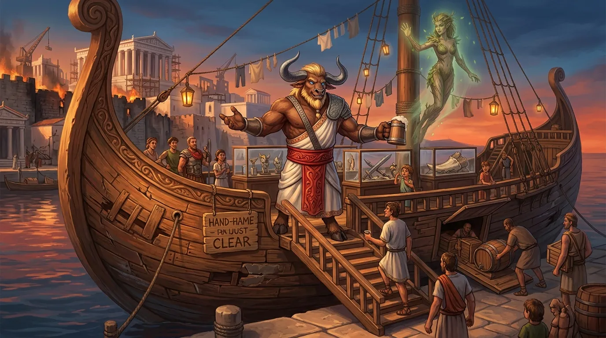
[Prompt](../assets/sessions/084/084_theme_ultros_becomes_a_bar.txt)

### Ostatnia Warta Ultrosa i Browar Orestesa

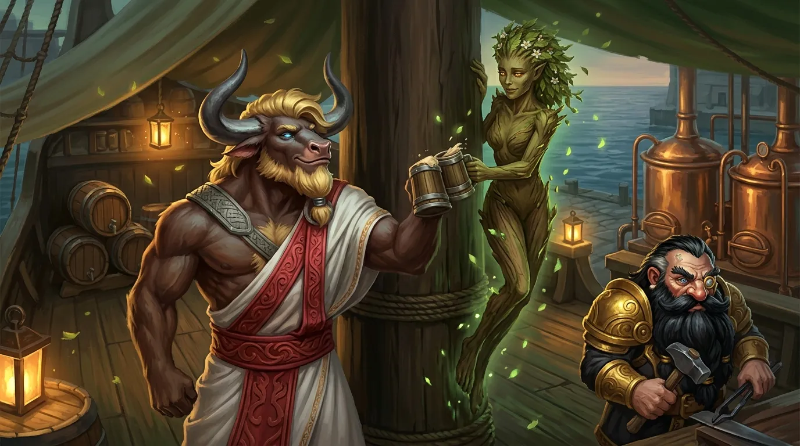
[Prompt](../assets/sessions/084/084_sec3_farewell_to_the_dryad.txt)

Sam **[[Ultros]]** swoje odsłużył. Wrak wyciągnięto z wody i rozpoczęto żmudny, długi proces napraw, ale prawda była taka, że okręt utracił swoje magiczne, ochronne właściwości i stał się po prostu bardzo dużym, mało praktycznym statkiem — **[[Tranquility]]** wygrywała z nim pod każdym względem. [[Orestes]] miał na to własną odpowiedź, i to taką, do której szykował się chyba od pierwszego dnia na pokładzie: legendarny okręt zacumuje w porcie na stałe i stanie się barem. Barem z magazynem piwa pod pokładem, z kącikiem pamiątek i z muzeum — bar z muzeum brzmiało jeszcze lepiej — mobilnym wyłącznie w tym sensie, że w razie czego zawsze można go przesunąć.

Przy okazji minotaur pożegnał się z **[[Delphia|Delphią]]**, driadą związaną z masztem **[[Ultros|Ultrosa]]**. Uznał, że i ona może wreszcie odejść ze statku. Podziękował jej za owocną współpracę, zaprosił na pożegnalne piwo i wypił jej zdrowie, życząc szerokiej drogi.

**[[Volkan]]** — po tym, jak przez pierwsze lata kierował odbudową i naprawami — w końcu poszukał miejsca dla siebie i znalazł je u boku [[Orestes|Orestesa]], w osadzie zwanej niegdyś **[[Orestessos Zythikē|Rosos]]**, przemianowanej z czasem na cześć minotaura i jego rzemiosła: **[[Orestessos Zythikē]]**, czyli Orestesja Piwowarska. Nazwy nikt nie potrafił wymówić, ale trafiła na mapy. **[[Orestes]]** rozdzielał udziały w browarze — **[[Pholon|Pholonowi]]** przypadło jakieś dwanaście i pół procent.

### Nowa Władza w Mytros

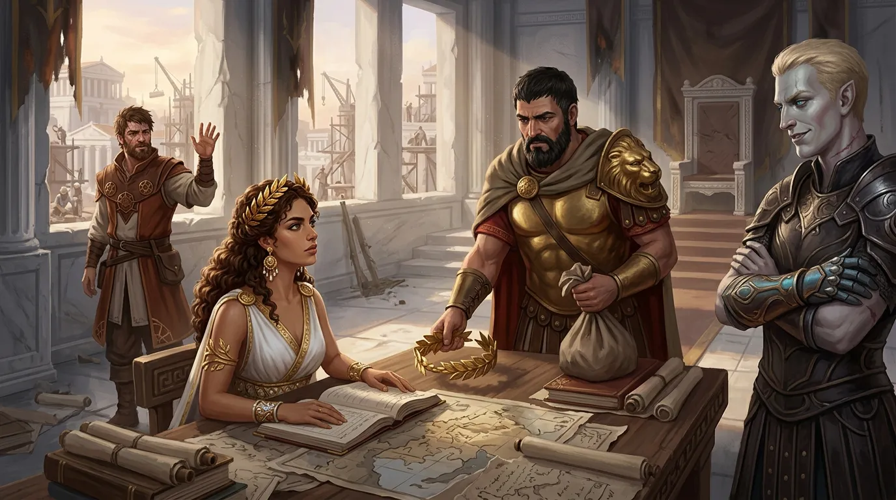
[Prompt](../assets/sessions/084/084_sec4_the_abdication.txt)

W sali, w której jeszcze niedawno decydowały się losy oblężonego miasta, nad stosem papierów siedziała **[[Vallus]]** — to ona przeglądała dokumenty, unosiła wzrok znad nich i wyglądała, jakby na coś czekała. Czekała na **[[Acastus|Acastusa]]**. Ten wszedł już ubrany do drogi, z tobołkiem w ręku, i w takim właśnie stroju ogłosił swoją abdykację: korona **[[Mytros]]** przechodziła w ręce jego żony. **[[Versir]]**, nie pozwalając odejść byłemu królowi zbyt lekko, zasugerował, by na koniec oficjalnie uznał **[[Felicjan Janus Twardowski|Felicjana]]** za prawowitego lidera i odnowiciela **[[Smoczy Lordowie|Zakonu Smoczych Lordów]]** — w końcu [[Acastus]] sam kiedyś przypisał sobie ten tytuł, więc wypadałoby, żeby lud nie miał wątpliwości, kto jest kim. **[[Arevon Elorrenthi|Arevon]]** skwitował to półgłosem uwagą, że półtytan wyraźnie chce dopełnić upokorzenia. Sam [[Felicjan Janus Twardowski|Felicjan]] machnął ręką — mieszkańcy [[Mytros]] i tak wiedzą, komu zawdzięczają życie, a ceremonia nie będzie konieczna. Zamiast tego czarodziej powiedział ustępującemu władcy coś, co zabrzmiało niemal jak rozgrzeszenie: że wykazał się rozsądkiem i schował dumę do kieszeni.

[[Acastus]] miał tylko jedną prośbę — nie prośbę króla, lecz człowieka, który wie, że nie ma już prawa niczego żądać. Poprosił, by ludzi, którzy stanęli po stronie **[[Sydon|Sydona]]**, nie wieszano. Sądy, grzywny, mniej drastyczne kary — cokolwiek, byle nie kolejne trupy. „Dość już nakarmiliśmy Otchłań", stwierdził, dodając od razu, że nikt nie musi tej prośby respektować.

Potem odszedł, a przy stole rozgorzała dyskusja o tym, kto właściwie ma teraz rządzić. Padały propozycje półżartem i całkiem serio: że [[Mytros]] mogłoby przejść reformację ku radzie albo republice, że mogłoby nim zarządzać odnowione bractwo smoczych jeźdźców — albo, przeciwnie, że [[Smoczy Lordowie|Zakon]] powinien pozostać neutralnym arbitrem, ponad polityką. Rozważano nawet, kto z drużyny mógłby się z [[Vallus]] ożenić i tym samym rozwiązać problem sukcesji; [[Arevon Elorrenthi|Arevon]] wykpił się tym, że nie jest tutejszy, **[[Orion Xul|Orion]]** jest z królową w miarę spokrewniony, a na [[Versir|Versira]] i **[[Orestes|Orestesa]]** czekały już inne powołania. Ostatecznie stanęło na tym, że przez najbliższy czas rządzi [[Vallus]], stopniowo dzieląc się władzą z radą, która z każdym rokiem zyskiwałaby na znaczeniu.

W samym mieście trzeba było jednak rozliczyć żywych. Nad losem fanatyków drużyna targowała się długo i skończyła na kompromisie: czystki umiarkowane, tak umiarkowane, jak tylko się da. Ci, którzy zajmowali się rozbojem, mieli skończyć jak rozbójnicy; kilku byłych dowódców, wciąż fanatycznych i wciąż niebezpiecznych, miało zniknąć publicznie, dla przykładu — reszta miała dostać kilka lat przymusowych prac, konfiskatę majątku i szansę, by się opamiętać. [[Felicjan Janus Twardowski|Felicjan]] upierał się przy jednym: niech poniosą karę, ale niech to nie będzie śmierć.

**[[Vallus]]** rządziła dalej z **[[Mytros]]**, coraz więcej obowiązków oddając w ręce innych, ale samego miasta nie opuściła.

Zupełnie inny rachunek wystawiał **[[Taran Neurdagon]]**. Kupiec hojnie finansował odbudowę stolicy i robił to zdecydowanie nie bezinteresownie — podpisywano kontrakty, dziesięcinę z zysków portowych na następną dekadę, kolejne przywileje. [[Felicjan Janus Twardowski|Felicjan]] i [[Orestes]] doszli do wniosku, że oligarsze trzeba patrzeć na ręce: dopóki tylko zarabia i pomaga, niech zarabia, ale nikt nie chciał, by za dziesięć lat okazało się, że [[Mytros]] ma nowego władcę, tyle że bez korony.

Gdy pierwsze lata pokoju zaczęły układać się w rutynę, **[[Felicjan Janus Twardowski|Felicjan]]** wrócił do tematu, który nie dawał mu spokoju — rosnącej potęgi **[[Taran Neurdagon|Tarana Neurdagona]]**. Nie chodziło o wrogość; czarodziej wyraźnie zaznaczył, że to burza mózgów, a nie propozycja, ale w człowieku, który finansuje odbudowę stolicy, widział zarodek problemu, jaki lepiej rozwiązać zawczasu. **[[Orestes]]** bronił kupca — jak dotąd chętnie pomagał, a poza tym, przyznał uczciwie, sam nie jest obiektywny, skoro jego browar robi interesy z rodziną Neurdagonów.

**[[Felicjan Janus Twardowski|Felicjan]]** przypomniał jednak, czym rodzina Neurdagonów zajmowała się naprawdę: bioautomatonami, fuzją brązu i ludzkiego ciała, z której narodziła się **[[Egida Mytros]]**. Geneza tych konstruktów pozostawała moralnie więcej niż wątpliwa — nawet jeśli to właśnie one pomogły potem obronić miasto.

**[[Orion Xul|Orion]]** zaproponował rozwiązanie żołnierskie i proste: stała obserwacja, ludzie donoszący o każdym kroku i zamiarze, oraz gotowość do działania, gdyby coś poszło nie tak. **[[Felicjan Janus Twardowski|Felicjan]]** dorzucił rozwiązanie urzędnicze — zaostrzenie podatków dla najbogatszych i sprawdzenie, jak [[Taran Neurdagon|Taran]] zareaguje: czy będzie walczył, buntował się, czy przełknie to dla zasady. W regulaminie nowej rady, dodał sucho, wszelka korupcja, o której mu nie wiadomo, jest surowo zabroniona.

Rzeczywistość okazała się bardziej prozaiczna od najczarniejszych obaw. **[[Taran Neurdagon|Taran]]** z czasem załatwił sobie miejsce w radzie, a kilku innych jej członków utrzymywało się z jego hojności — nigdy jednak nie na tyle, by zbudować większość, i nigdy w sposób, który dałoby się nazwać po imieniu. Lukratywna posada dla córki nie jest przecież korupcją. **[[Arevon Elorrenthi|Arevon]]** zauważył, że gdy raz zaczyna się opłacać miejsca w radzie, nepotyzm przestaje być pytaniem, a staje się kwestią czasu — po czym machnął na to ręką: dopóki nikt nie zacznie proponować wojny z **[[Arezja|Arezją]]**, wszystko jest w porządku — a jeśli jakiś głupiec zacznie, druid obiecywał, że kilka statków dziwnym trafem pójdzie na dno.

**[[Mytros]]** tymczasem rozrastało się w morską potęgę, a **[[Ismene Neurdagon]]**, architektka **[[Egida Mytros|Egidy Mytros]]**, doczekała się cichej satysfakcji: zlecenie, którego bohaterowie nigdy nie dokończyli, ostatecznie pomogło ocalić miasto.

### Akademia Mytros

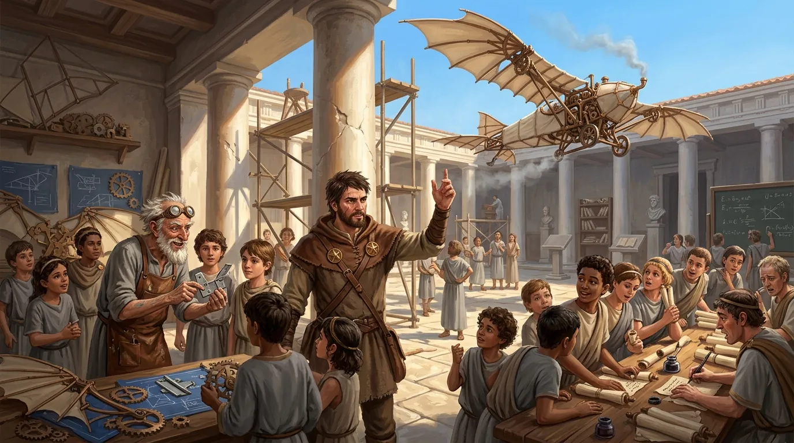
[Prompt](../assets/sessions/084/084_sec5_the_academy_rebuilds.txt)

**[[Akademia Mytros]]** straciła sporo kadry — ci, którzy dzielnie bronili murów, w większości nie wrócili — a jednak pierwszy semestr po **[[Sesja 83 - Zmierzch Ery Tytanów|Bitwie o Mytros]]** przyniósł rekordową liczbę rekrutów.

**[[Dedal]]**, wierny sobie, opracowywał kolejne wersje swojej latającej machiny — tej, która swego czasu utonęła — a każda następna radziła sobie w powietrzu, i zwłaszcza przy lądowaniu, coraz lepiej; **[[Felicjan Janus Twardowski|Felicjan]]** wystarał się dla niego o miejsce w **[[Akademia Mytros|Akademii Mytros]]**, gdzie stary wynalazca dostał warsztat do dłubania w zamian za uczenie studentów artificerstwa.

### Nowa Wiara i Kulty Bohaterów

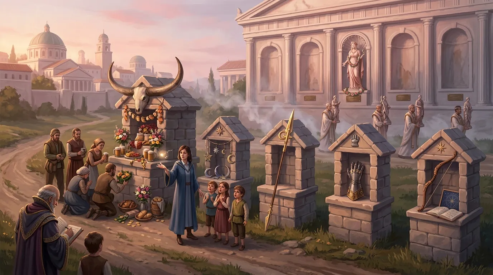
[Prompt](../assets/sessions/084/084_sec6_shrines_and_new_faith.txt)

**[[Mytros (Bogini)|Bogini Mytros]]**, choć zesłała nieco wsparcia podczas bitwy, pozostała bóstwem raczej milczącym — jej magia kapłańska jednak działała niezawodnie, co w rozchwianym krajobrazie religijnym [[Kontynent Thylea|Thylei]] znaczyło więcej niż jakikolwiek cud.

Najgłębsza zmiana zaszła jednak nie w radzie, lecz w świątyniach. Kapłani dawnych bogów zaczęli zadawać sobie pytania egzystencjalne, na które byli bogowie nie potrafili udzielić satysfakcjonującej odpowiedzi. Magia tych kapłanów nie przestała działać — i to było najdziwniejsze — ale wiara powoli przenosiła się gdzie indziej. Z każdym rokiem coraz większa ich część przechodziła pod znak **[[Mytros (Bogini)|Bogini Mytros]]**, aż kult dawnych bóstw zanikł niemal całkowicie, spychany do kategorii legend sprzed lat. **[[Świątynia Pięciu]]** przestała być świątynią [[Pięciu Bogów|Pięciu]]; stała się świątynią **[[Mytros (Bogini)|Mytros]]**, a zarazem kaplicą pamięci.

Kapliczki, które zaczęły samorzutnie wyrastać wokół **[[Mytros]]**, nie były przy tym poświęcone jednemu bohaterowi — stawiano je całej piątce, każdemu z **[[Bohaterowie Przepowiedni|Bohaterów Przepowiedni]]** z osobna. Najszybciej rósł jednak kult **[[Orestes|Orestesa]]**, bo minotaur sam działał w tym kierunku: w samej okolicy stolicy przybyły kolejne dwie kapliczki. Reakcje w drużynie były mieszane — **[[Versir]]** nie był zachwycony, **[[Felicjan Janus Twardowski|Felicjanowi]]** trochę to schlebiało, a **[[Orion Xul|Orion]]** zbywał własne kapliczki obojętnością: mogą sobie stać, ale ani nie zamierzał ich zwalczać, ani specjalnie się nimi cieszyć.

**[[Felicjan Janus Twardowski|Felicjan]]** miał za to pomysł na przyszłość. Skoro ludzie i tak gromadzą się przy kapliczkach, można to wykorzystać: uczyć przy nich prostych sztuczek, prostowania i światła, a wysłannicy **[[Akademia Mytros|Akademii Mytros]]** mieliby przy okazji wyławiać talenty i zapraszać obiecujących na dalsze nauki.

### Zakon Smoczych Lordów i Młode Smoki

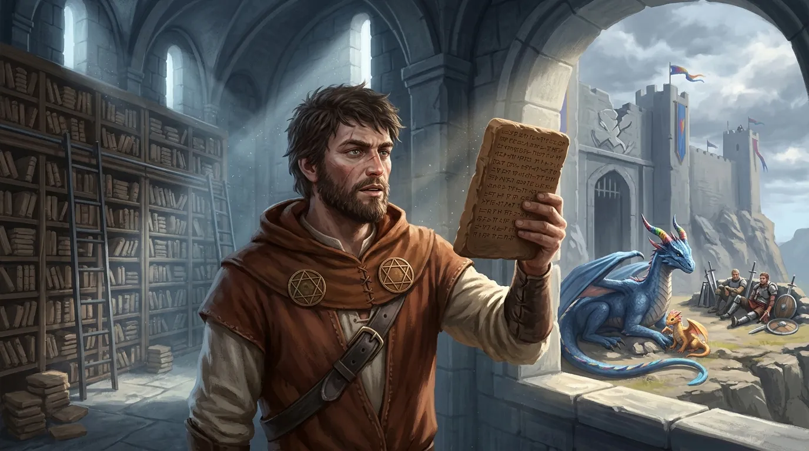
[Prompt](../assets/sessions/084/084_sec7_the_order_reborn.txt)

**[[Felicjan Janus Twardowski|Felicjan]]** miał ambitny plan. [[Smoczy Lordowie|Zakon Smoczych Lordów]] zamierzał odbudować naprawdę — smoki były, potężni ludzie byli, brakowało tylko siedziby. Tę zamierzał zdobyć: **[[Wyspa Yonder]]**, dawna warownia **[[Zakon Sydona|Zakonu Sydona]]**, stała niemal pusta, z garstką zdezorientowanych ludzi i niedobitkami fanatyków, którzy raczej wygrzewali się w słońcu, niż knuli zemstę. Prawdziwym łupem była jednak tamtejsza biblioteka — zbiory tak stare, że zapisane nie na zwojach, lecz na wypalanych glinianych tabliczkach, w językach, których nikt już nie zna.

**[[Arevon Elorrenthi|Arevon]]** rozważał propozycję dołączenia do odrodzonego przez [[Felicjan Janus Twardowski|Felicjana]] **[[Smoczy Lordowie|Zakonu Smoczych Lordów]]**. Skłaniał się ku „tak", ale zastrzegał, że zanim cokolwiek podpisze, przeczyta wszystkie szczegóły umowy.

Rosło też nowe pokolenie. Wykluła się smocza samica, a **[[Paradoks]]**, mimo swojego osobliwego pochodzenia i imienia, rósł zupełnie standardowo i był już niewiele mniejszy od **[[Kairos|Kairosa]]** — teoretycznie ktoś mógłby na nim zasiąść. Teoretycznie, bo jedyny, który kiedyś go sobie wybrał, spotkał się z odmową: **[[Orestes]]** wskazał wtedy na [[Paradoks|Paradoksa]], a [[Paradoks]] minotaura nie chciał. [[Felicjan Janus Twardowski|Felicjan]] złośliwie przypominał, że [[Orestes]] wybrał sobie najtrudniejszego z możliwych wierzchowców — smoka, który potrzebuje wyjątkowo mądrego jeźdźca.

Po piętnastu latach nowo narodzona smoczyca miała już liczyć się jako młody, pełnoprawny smok, więc i dla niej trzeba było znaleźć jeźdźca — padła propozycja, by przypadła komuś z drugiego szeregu towarzyszy, na przykład **[[Corinna|Corinnie]]**, która niejedną dobrą radą zdążyła się już drużynie przysłużyć.

Propozycji własnego smoka **[[Orestes]]** odmówił bez wahania i bez żalu: ma browar, dogaduje się z **[[Volkan|Volkanem]]**, razem budują kadzie — smok jest mu do szczęścia zbędny.

**[[Despina]]** odleciała i przepadła gdzieś bez śladu, nie paląc się do powrotu.

### Pythor, Orion i Hexia

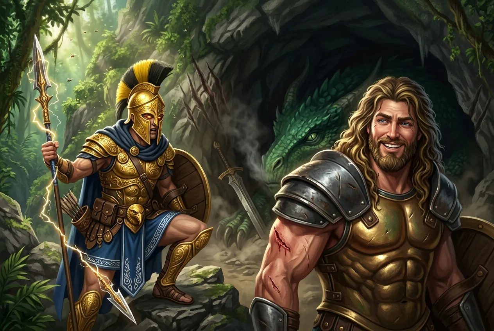
[Prompt](../assets/sessions/084/084_sec8_five_hundred_years_later.txt)

**[[Pythor]]** nigdzie nie osiadł. Tron **[[Estoria|Estorii]]** zostawił **[[Anora|Anorze]]** jeszcze zanim **[[Ultros]]** wypłynął, a po wojnie pomagał w **[[Mytros]]** na tyle, na ile mógł, nie mając już ani korony, ani wojny, ani pomysłu na siebie. Alkoholu nie odstawił — przez chwilę próbował nawet idei całkowitej abstynencji, ale szybko stwierdził, że to jednak nie dla niego — przestał jednak zalewać się na umór, jak dawniej, i zaczął zachowywać coś na kształt rozsądku.

[[Orion Xul|Orion]] zadawał mu trudne pytania, na które bóg nie potrafił odpowiedzieć: czy jest człowiekiem, czy półbogiem po ludzkiej formie ojca, czy może kryje się w nim coś smoczego. [[Pythor]] przyznał szczerze, że bardzo chciałby powiedzieć coś sensownego, ale prawda jest skomplikowana — a skrzydła synowi jak dotąd nie wyrosły.

[[Orion Xul|Orion]] mówił mu też o sobie: że był żołnierzem, który zabijał na rozkaz, potem przestał być żołnierzem, bo nie chciał już zabijać, a skończył jako najemnik bogów, który zabijał na rozkaz; że chciałby wreszcie znaleźć drogę, na której nie chodzi o zabijanie. Zaproponował ojcu wspólną podróż po tym świecie — i przypomniał, że mimo wszystko to [[Pythor]] uratował mu życie, i że **[[Odkupienie Pythora]]** naprawdę coś w nim zmieniło. Z tej propozycji wyrósł zwyczaj: przez kolejne lata ojciec i syn spędzali razem coraz więcej czasu, wędrując po **[[Kontynent Thylea|Thylei]]**. Dla [[Pythor|Pythora]], który nie potrafił się odnaleźć w świecie bez wojny, okazało się to jedyną rzeczą, która naprawdę wyszła — był szczerze szczęśliwy, że wreszcie udaje mu się budować relację z synem.

Najtrudniejszą sprawą pozostawała **[[Hexia]]**. Zaraz po rozprawie z **[[Talieus Pierwszy|Talieusem Pierwszym]]** **[[Versir]]** poleciał na **[[Wyspa Smoka|Wyspę Smoka]]** oddać smoczycy jej miecz — bez ceremonii i bez filozofii, po prostu dlatego, że dał słowo. [[Hexia]] była lekko pozytywnie zaskoczona, że ktoś tego słowa dotrzymał, i na tym się skończyło.

Dopiero potem [[Orion Xul|Orion]] namówił ojca, by spróbował dojść do porozumienia z kobietą, którą kiedyś porzucił, nie próbując nawet niczego załagodzić — czym [[Pythor]], jak sam przyznał, wcale się nie chlubił. Polecieli razem. [[Orion Xul|Orion]] musiał zaczekać na zewnątrz jaskini i słyszał ze środka dźwięki na tyle niepokojące, że rozważał rzucenie się ojcu na ratunek. W końcu jednak ucichło, a z groty wyszedł [[Pythor]] ze świeżym śladem po ugryzieniu — na który, jak sam uważał, sobie zasłużył — i z miną człowieka zadowolonego. Jak na rozmowę po pięciuset latach poszło całkiem nieźle: [[Hexia]] obiecała zaniechać kolejnych akcji zemsty, a więc następna kobieta u boku [[Pythor|Pythora]] miała już szansę przeżyć. Do pojednania było wciąż daleko — pięć wieków nienawiści nie mija w jedno popołudnie — ale rozejm był rozejmem.

**[[Orion Xul|Orion]]** dopytywał o **[[Ophea|Opheę]]** — po pogodzeniu się z **[[Hexia|Hexią]]** rozmowa z matką stała się teoretycznie możliwa, ale sam **[[Pythor]]** pewnie by się jej bał, bo musiałby wytłumaczyć, dlaczego nie ruszył jej na ratunek od razu, a do takich rzeczy bóg bitwy nigdy nie był szczególnie odważny.

### Sojusznicy, Wyspy i Sąsiedzi

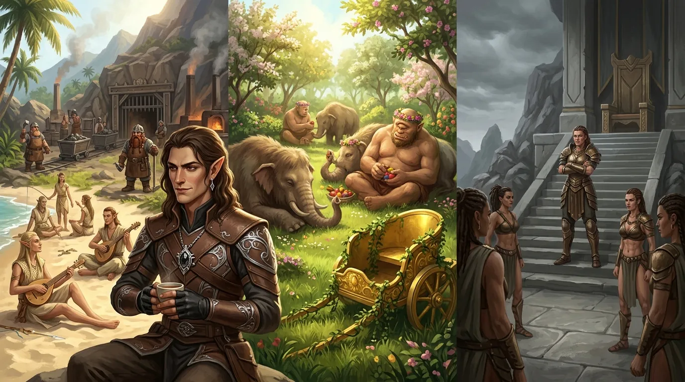
[Prompt](../assets/sessions/084/084_sec9_islands_after_the_war.txt)

Świat wokół układał się w nowe kształty powoli, przez kolejne piętnaście lat. W **[[Arezja|Arezji]]** **[[Królowa Helena]]** przyjęła podziękowania bohaterów z zadowoleniem i mówiła z dumą o bohaterskiej ofierze tysiąca dwustu żołnierzy, których wysłała pod [[Mytros]] — ale w następnych latach jej państwo miało być nękane przez plemiona centaurów, a duma nie zastąpi wojska. [[Arevon Elorrenthi|Arevon]] uznał, że skoro [[Mytros]] jest [[Arezja|Arezji]] dłużne, to jeśli tylko poproszą, należy im pomóc, choćby po cichu i partyzancko; problem w tym, że Arezyjczycy prędzej daliby się wybić, niż o taką pomoc poprosili.

W samej **[[Arezja|Arezji]]** nastroje były cięższe: wielu mieszkańców kwestionowało zasadność wysłania wojsk i głośno bolało nad stratą tysiąca dwustu żołnierzy poległych w obronie cudzego miasta. **[[Królowa Helena]]** łagodziła emocje z cierpliwością, na jaką ją było stać, ale nie pomagała jej narastająca — początkowo lekka, z czasem coraz ostrzejsza — wojna handlowa o żelazo. **[[Arevon Elorrenthi|Arevon]]** rozważał wysłanie misji dyplomatycznej z pytaniem, czy dałoby się jakoś pomóc, i szybko zrozumiał, że nie ma nic konkretnego do zaoferowania.

Został jeszcze dług, którego nie dało się spłacić monetą — **[[Yala]]**. Mimo udziału w odparciu **[[Kentimane|Kentimane'a]]** amazonka wciąż nie była mile widziana przez mieszkańców [[Mytros]]; pojawiła się na chwilę po wszystkim, ale widać było, że źle się tu czuje, i szybko zniknęła. [[Versir]] nie zamierzał zmieniać opinii tłumu, uznał to za stratę czasu — zamiast tego zabrał się za kronikarzy i historyków, dopilnowując, by na kartach historii zapisała się wersja prawdziwa, ta, w której [[Yala]] pomogła obronić miasto. Nie przyjęła również władzy nad [[Amazonki|Amazonkami]], pozostając jedynie strażniczką pokoju na wyspie.

Na **[[Themis]]** [[Amazonki]] wróciły do domu, ale tron pozostał pusty na długie lata. Największą częścią wyspy zarządzała jako regentka **[[Hippolyta]]** — ta sama, która niegdyś pomogła bohaterom — choć sama nie paliła się do zasiadania na tronie. [[Themis]] podzieliła się na dwie frakcje: większą, wierną regentce, i mniejszą, tęskniącą za dawnymi czasami i kwestionującą reformy wprowadzone przez **[[Darien]]**. Ta druga grupa nie zdobyła znaczącej przewagi, a **[[Hippolyta]]** twardo stała na straży dziedzictwa poprzedniczki.

Na wyspie **[[Helios|Heliosa]]** zapanował za to spokój niemal absurdalny: cyklopy rozwinęły ruch pacyfistyczny i hipisowski, chillując beztrosko w towarzystwie hefalumpów, sam **[[Helios]]** nie upominał się o zwrot [[Chariot of Dawn|rydwanu]] do swojego skarbca, a **[[Furie]]** nie przyszły po niego ponownie.

Spośród wszystkich wysp **[[Arevon Elorrenthi|Arevon]]** najbardziej upodobał sobie **[[Wyspa Indygo|Wyspę Indygo]]**. Mieszkało tam bowiem **[[Plemię Delfina]]** — niemal jedyne elfy w całej **[[Kontynent Thylea|Thylei]]**, sympatyczne i wyluzowane, może nawet odrobinę zbyt wyluzowane — a druid postanowił się z nimi zakolegować. W górach w głębi wyspy siedziało z kolei krasnoludzkie **[[Plemię Wieloryba]]**, wciąż trzymające straż nad jedyną **[[Kopalnia Żelaza|Kopalnią Żelaza]]** w [[Kontynent Thylea|Thylei]].

**[[Mithralowa Kuźnia]]** na kontynencie straciła sporo ze swoich możliwości — nie był w niej już zaklęty magiczny elemental — ale krasnoludzcy rzemieślnicy okazali się na tyle zmyślni, że kuźnia pracowała dalej, tyle że na mniejszych obrotach. Obowiązki **[[Volkan|Volkana]]** przy kowadle przejął **[[Bront]]** — cyklop, którego bohaterowie uwolnili niegdyś z lochów **[[Więzienie Kieł|Kła]]** — i okazał się kowalem na tyle dobrym, że godnie zastąpił boga. Jego syn **[[Steros]]**, jankan i lepszy rzemieślnik od ojca, tego czasu nie doczekał: zginął w pierwszej fali **[[Sesja 76 - Bitwa o Mytros: Pierwsza Fala|Bitwy o Mytros]]**.

### Versir i Astra

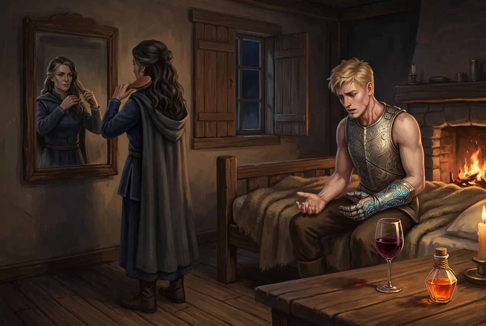
[Prompt](../assets/sessions/084/084_sec10_the_one_who_does_not_age.txt)

Piętnaście lat dobrobytu ma jednak swoją cenę, i **[[Versir]]** zapłacił ją pierwszy: po kilku latach wspólnego, szczęśliwego życia dotarło do niego, że **[[Astra]]** się starzeje, a on nie.

**[[Arevon Elorrenthi|Arevon]]** skomentował to ze smutną znajomością rzeczy — to problem, z którym elfy zmagają się od wielu tysiącleci, ilekroć zwiążą się z ludźmi, i sporo już na ten temat napisano. Druid przyznał, że ma w swoich zbiorach eliksir młodości; sam go nigdy nie wypije, bo jako elf go nie potrzebuje, a rzecz ma potencjalne skutki uboczne. Sam **[[Arevon Elorrenthi|Arevon]]**, jak wyznał półżartem, szuka sobie partnerki wśród elfów właśnie po to, by nie mieć problemu, który ma **[[Versir]]** — choć elfiego wyboru w [[Kontynent Thylea|Thylei]] było, delikatnie mówiąc, niewiele.

### Dawni Towarzysze

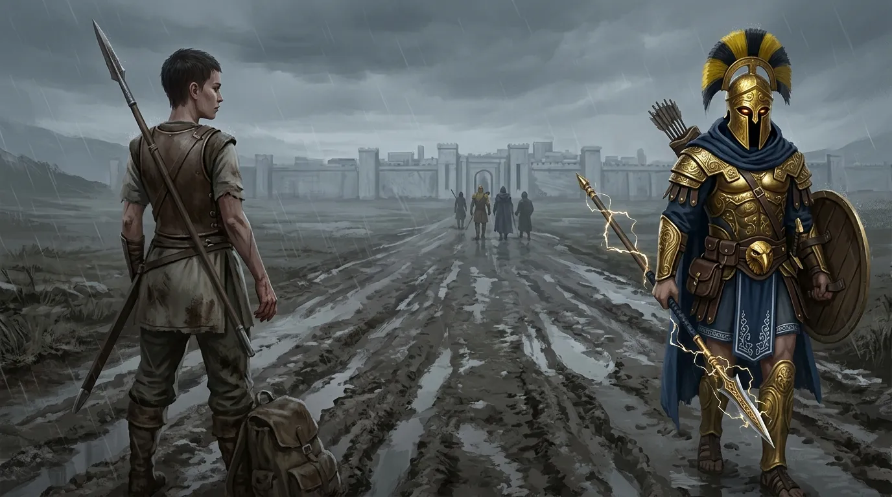
[Prompt](../assets/sessions/084/084_sec11_the_one_left_behind.txt)

Osobna rachuba należała się dawnym towarzyszom broni. Padło imię **[[Lyra|Lyry]]** — wojowniczki, której lojalność wobec [[Orion Xul|Oriona]] nigdy nie miała granic i którą drużyna wykorzystywała raz za razem, nie dając nic w zamian. [[Arevon Elorrenthi|Arevon]] ujął rzecz precyzyjnie: przygarnąć ją, a dać jej nadzieję to dwie zupełnie różne rzeczy. [[Orion Xul|Orion]] nie zrobił ani jednego, ani drugiego. Zostawił ją tak, jak przed pięciuset laty **[[Pythor]]** zostawił **[[Hexia|Hexię]]** — bez rozmowy, bez wyjaśnienia, bez zamknięcia. Syn, który przez cały ten czas pchał ojca do naprawiania dawnych krzywd, popełnił dokładnie ten sam błąd.

**[[Loreus]]** wędrował od miasta do miasta i, jak można było przewidzieć, znów zakochał się nieszczęśliwie w kimś innym.

**[[Iolaah]]** przez pierwsze lata pomagała przy odbudowie od strony morza, na ile mogła, by ostatecznie wrócić do swojego ludu z całym workiem historii do opowiedzenia.

### Niedokończone Sprawy

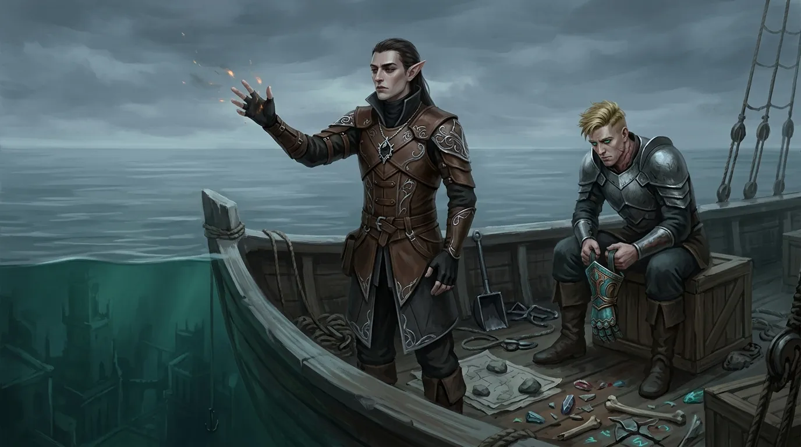
[Prompt](../assets/sessions/084/084_sec12_the_sunken_kingdom.txt)

Głównym celem **[[Arevon Elorrenthi|Arevona]]** na te piętnaście lat stało się **[[Królestwo Syren|Zatopione Królestwo Syren]]**. **[[Versir]]** przyłączył się do poszukiwań, ale morze nie chciało oddać sekretu: wyprawa za wyprawą, zbieranie informacji na wodzie, próby dosięgnięcia magią kogoś, o kim wiadomo, że tam jest — choćby wuja [[Versir|Versira]] — rzucanie wszystkich zaklęć, jakie przyszły do głowy. Efektów było mało, frustracji dużo. Po dwóch, trzech, pięciu latach zapał **[[Arevon Elorrenthi|Arevona]]** przygasł i druid zajął się także innymi sprawami, ale nigdy nie porzucił poszukiwań całkowicie — po prostu przestał poświęcać im całe życie.

Pozostały wreszcie zagadki, które nie doczekały się rozwiązania. Wszyscy wiedzieli, że boskie domeny stoją puste, ale nikt nie miał pojęcia, jak się za nie zabrać — byli bogowie tłumaczyli, że **[[Balmytria]]** przed wiekami po prostu wykradła moc [[Tytani|Tytanom]], i sugerowali, że jedynie **[[Mojry]]** wiedzą, jak powtórzyć tę sztukę.

**[[Versir]]** prowadził własną, długofalową grę: szukał ochotniczek na nowe **[[Mojry]]**. Przypomniano przy tej okazji, że **[[Wiedźma Lotosu|Wiedźmę Lotosu]]** zapytał o to już dawno temu i że wstępnie była chętna. Padła też propozycja, by drugą z nowych tkaczek losu została **[[Versi|Versi Wyrocznia]]** — ta, która całą tę historię rozpoczęła, stawiając przed bohaterami przepowiednię, i która jako córka **[[Sydon|Sydona]]** sprzeciwiła się ojcu, wywróżywszy mu upadek.

**[[Felicjan Janus Twardowski|Felicjan]]** zaproponował, by czaszkę **[[Balmytria|Balmytrii]]** złożyć wreszcie w **[[Nekropolia w Telamok|Nekropolii w Telamok]]**, obok szczątków **[[Xander|Xandera]]**.

Niebieskiej tiefling, której szukali przez pół kampanii, nie znaleźli i nigdy już nie znajdą — a jak się okazało, kryła się za kolejnymi drzwiami w **[[Kanały Mytros|Kanałach Mytros]]**, tych, przez które nie odważyli się kiedyś przejść.

**[[Arevon Elorrenthi|Arevon]]** postanowił poświęcić część swoich lat na spisanie wszystkich dziejów, których był świadkiem, zamykając tym własną, najdawniejszą obietnicę.

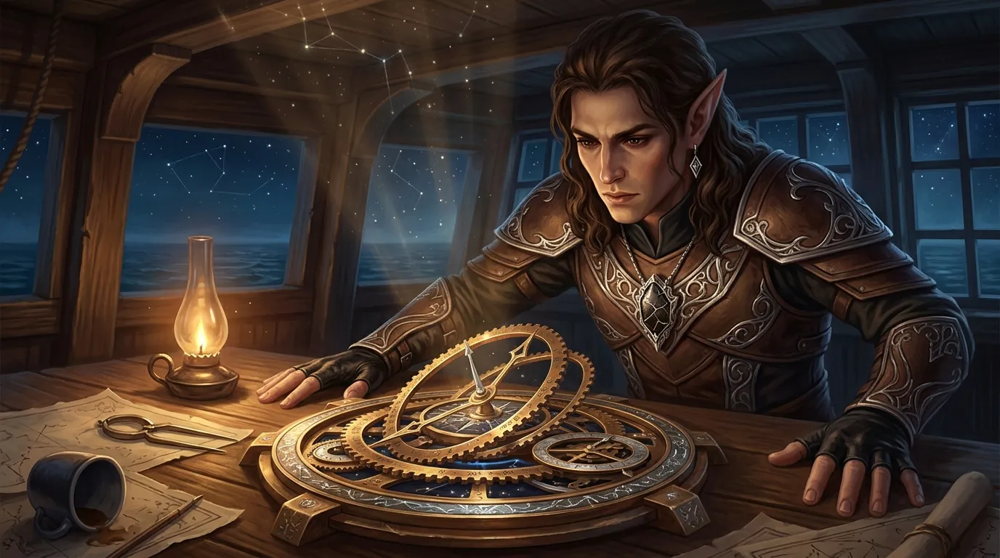
[Prompt](../assets/sessions/084/084_theme_new_course.txt)

### Kurs Antikythery

[Prompt](../assets/sessions/084/084_sec13_course_to_eberron.txt)

**[[Antikythera]]** zrobiła coś, czego dotąd nie robiła. Mechanizm zaczął klikać sam z siebie, ząb wchodził za ząb, pierścienie obracały się jeden po drugim jak w ożywającym zegarze. [[Arevon Elorrenthi|Arevon]], patrząc na to okiem nawigatora, zrozumiał, że kompas z jakiegoś powodu wyznaczył kurs. [[Arevon Elorrenthi|Arevon]] wiedział, że to kurs do [[Eberron|Eberronu]].

**[[Arevon Elorrenthi|Arevon]]** musiał odbyć rozmowę, którą odkładał od dawna — z **[[Tars d’Lyrandar|Tarsem d'Lyrandarem]]** i resztą ocalałych z **[[Eberron|Eberronu]]**. Wyłożył im sprawę bez owijania: nie było ich dłuższy czas, wróciliby na obcym statku, bez połowy załogi, a ich wyprawa była zbyt głośna, by ktokolwiek przeoczył, że nikt z niej nie wrócił. Wystarczy, że jeden z nich się wygada, a wpływowi ludzie zaczną drążyć — i będą drążyć tak długo, aż wyciągną drogę do [[Kontynent Thylea|Thylei]]. Wtedy do tego świata przypłyną nie garstka rozbitków, lecz flota chętnych, by go sobie podzielić. Argument trafił. [[Tars d’Lyrandar|Tars]], który zdążył już poznać tu ludzi i uznać to miejsce za swoje, nie chciał ściągać kłopotów na nowy dom; przekonał się też **[[Garrick Vanalan]]**, pokładowy mag. **[[Lia Amakiir]]** pozostała nie do końca przekonana.

Najgorzej zniósł to **[[Ivello Ostren]]** — po wszystkim, co przeszedł, wciąż powtarzał jedno: że tam czeka na niego syn, który miał jedenaście lat, kiedy ojciec wypływał. Padły pomysły, by po prostu wymazać mu wspomnienia o drodze powrotnej, ale zwykła magia tego nie potrafiła, a jedyne, co przychodziło do głowy, to prosić o przysługę **[[Mojry]]**. [[Arevon Elorrenthi|Arevon]] nie podjął decyzji tego dnia — dał sobie i [[Ivello Ostren|Ivellowi]] czas.

Kiedy w końcu **[[Arevon Elorrenthi|Arevon]]** podjął decyzje o zorganizowaniu wyprawy do **[[Eberron|Eberronu]]**, zlecił budowę statku, który wyglądał jak jednostka z jego rodzinnego świata, ale bez elementalnego napędu — zwykły, wiosłowy, zbudowany tak, by nikt w [[Eberron|Eberronie]] nie pytał, co to właściwie jest. Popłynęli we dwoje — **[[Ivello Ostren]]**, któremu druid ostatecznie nie odmówił powrotu do syna, i **[[Lia Amakiir]]**, zdecydowanie chętna; reszta wykruszyła się, gdy tylko wyliczono im potencjalne komplikacje.

Przed odpłynięciem oboje przeszli długie wykłady o tym, co wolno mówić, a czego nie — na tyle intensywne, żeby im się we łbach pokręciło i żeby zapomnieli, co tu naprawdę się działo. **[[Arevon Elorrenthi|Arevon]]** nie miał złudzeń: oboje wydawali się mieć dobre intencje i nie planowali na tym zarobić, ale gdyby na szali stanęło ich życie lub życie ich bliskich, sprzedaliby wszystko. Dlatego zostawił im najostrzejszą przestrogę, na jaką było go stać — jeśli ktokolwiek dowie się o [[Kontynent Thylea|Thylei]], ucierpią oni i ich rodziny, a sama sugestia, że coś takiego mogło się wydarzyć, wystarczy, by zaczęły dziać się rzeczy nieodwracalne. Była też spora szansa, że po prostu coś ich po drodze zje, bo łódź powstała w dwa dni i wcale nie było pewne, że dotrą. To była, jak sam stwierdził, ofiara, którą był gotów ponieść.

## Kluczowe wydarzenia
* Drużyna ustala kompromis: najpierw **[[Kryształowa Kosa Lutherii]]** idzie w drzazgi i dusze odzyskują wolność, a dopiero potem rozmawia się o oddaniu odłamków **[[Mistrz Cieni|Mistrzowi Cieni]]**.
* Poharatany **[[Ultros]]** zostaje w porcie — do **[[Morze Otchłani|Morza Otchłani]]** drużyna płynie **[[Tranquility]]**, bo [[Arevon Elorrenthi|Arevon]] odkrywa, że przerobiony przez **[[Sydon|Sydona]]** żywiołak słucha także jego, bez Znamienia Burzy.
* Na wysepce **[[Morze Otchłani|Morza Otchłani]]** [[Orestes]] rozbija kosę jednym ciosem — ulatują tysiące dusz, w tym dusze jego rodziców; z resztek artefaktu wyłania się na moment mroczna, górująca nad drużyną postać.
* [[Versir]] uwalnia z okowów **[[Hypnos|Hypnosa]]** oślepionego **[[Talieus Pierwszy|Talieusa Pierwszego]]**, wkłada mu w dłoń ostatnie wykute przez Tytana ostrze i kończy jego mękę, wchłaniając esencję magiczną rękawicą; przejmuje też opiekę nad barką i **[[Glewia Sydona|Glewię Sydona]]**.
* Dziewięciogodzinny, rozczarowująco nudny rytuał w **[[Świątynia Cieni|Świątyni Cieni]]** w **[[Arezja|Arezji]]** przywraca [[Orestes|Orestesa]] do życia — minotaur znów oddycha, krwawi i czuje smak ciepłego, wygazowanego piwa.
* **[[Ultros]]**, pozbawiony magicznych właściwości, zostaje na stałe zacumowany i przerobiony przez [[Orestes|Orestesa]] na bar z muzeum; **[[Delphia]]** odchodzi z masztu, a **[[Volkan]]** dołącza do minotaura w browarze w **[[Orestessos Zythikē]]**.
* **[[Acastus]]** abdykuje, prosząc jedynie o łagodne kary dla stronników **[[Sydon|Sydona]]**; koronę przejmuje **[[Vallus]]**, stopniowo dzieląc władzę z radą, a czystki w mieście wychodzą umiarkowane.
* **[[Taran Neurdagon]]** finansuje odbudowę stolicy, wchodzi do rady [[Mytros]] i po cichu opłaca część jej członków, nigdy jednak nie zdobywając większości.
* **[[Akademia Mytros]]** — mimo strat w kadrze — notuje rekordowy nabór; **[[Dedal]]** dostaje tam warsztat w zamian za uczenie artificerstwa.
* Kult dawnych bogów zanika na rzecz **[[Mytros (Bogini)|Bogini Mytros]]**, **[[Świątynia Pięciu]]** staje się kaplicą pamięci, a wokół stolicy wyrastają kapliczki wszystkich **[[Bohaterowie Przepowiedni|Bohaterów Przepowiedni]]** — najszybciej te poświęcone [[Orestes|Orestesowi]], przy których [[Felicjan Janus Twardowski|Felicjan]] chce wyławiać magiczne talenty.
* **[[Felicjan Janus Twardowski|Felicjan]]** odbudowuje **[[Smoczy Lordowie|Zakon Smoczych Lordów]]** i bierze na jego siedzibę **[[Wyspa Yonder|Wyspę Yonder]]** wraz z tamtejszą biblioteką glinianych tabliczek.
* Za namową [[Orion Xul|Oriona]] **[[Pythor]]** dogaduje się z **[[Hexia|Hexią]]** po pięciuset latach — smoczyca obiecuje zaniechać zemsty; ojciec i syn zaczynają wspólnie wędrować po **[[Kontynent Thylea|Thylei]]**.
* **[[Versir]]** odkrywa, że **[[Astra]]** się starzeje, a on nie; **[[Arevon Elorrenthi|Arevon]]** wspomina o eliksirze młodości ze swoich zbiorów.
* [[Orion Xul|Orion]] porzuca **[[Lyra|Lyrę]]** bez słowa wyjaśnienia — dokładnie tak, jak **[[Pythor]]** przed wiekami porzucił **[[Hexia|Hexię]]**.
* Piętnaście lat poszukiwań **[[Królestwo Syren|Zatopionego Królestwa Syren]]** kończy się niczym; **[[Versir]]** prowadzi za to własną grę o nowe **[[Mojry]]** — proponuje miejsce **[[Wiedźma Lotosu|Wiedźmie Lotosu]]**, pada też kandydatura **[[Versi|Versi Wyroczni]]**.
* **[[Antikythera]]** ożywa sama z siebie i wyznacza kurs do **[[Eberron|Eberronu]]**.
* [[Arevon Elorrenthi|Arevon]] przekonuje ocalałych z **[[Eberron|Eberronu]]**, by nie wracali do domu, ostatecznie jednak buduje niepozorny wiosłowy statek i wysyła nim **[[Ivello Ostren|Ivella Ostrena]]** oraz **[[Lia Amakiir|Lię Amakiir]]** w niemal samobójczy rejs powrotny — po długich instruktażach o tym, o czym nie wolno im mówić.

## Cytaty
* **[[Orestes]]**: „Dzień dobry, jako główny zainteresowany w danym wątku rozjebania kosy burej suki Lutherii oraz odzyskania jakby żywego ciała mojej postaci, chciałbym podnieść kwestię, byśmy właśnie to zrobili."
* **[[Felicjan Janus Twardowski|Felicjan]]**: „Pomalujemy cię."
* **[[Orestes]]**: „Jaki alkoholizm? To jest entuzjazm. Orestes jest alkoholowym entuzjastą."
* **[[Orestes]]** (o [[Mistrz Cieni|Mistrzu Cieni]]): „Może to jest po prostu banda takich nadzianych kolekcjonerów. Mówię ci, następne sprzedam im moje przepocone skarpety."
* **[[Arevon Elorrenthi|Arevon]]**: „Nie ma bogów. Bogowie to są dalekie istoty, które żyją własnym życiem i nie wpływają na losy śmiertelników."
* **[[Orestes]]** (o rytuale): „Nie widziałem żadnego trupa. Siedziałem sobie na stołeczku i nawet przysnąłem pod koniec tego ich nucenia, tak długo nucili. Ale przynajmniej jakieś nuty mogę sobie zapisać. Może piosenka z tego wyjdzie… O, już wiem: Deszcze niespokojne. [zaczyna śpiewać]"
* **[[Acastus]]**: „Dość już nakarmiliśmy Otchłań."
* **[[Felicjan Janus Twardowski|Felicjan]]**: „Po prostu nie chcę mieć zaraz Trumpa w Mytros."
* **[[Felicjan Janus Twardowski|Felicjan]]**: „Zdecydowanie w regulaminie Rady Mytros jest zabroniona wszelka korupcja, o której mi nie wiadomo."
* **[[Orion Xul|Orion]]** (o kapliczkach ku swojej czci): „Może sobie być, ale nic z tym nie robię — ani nie mówię jak Wojtyła, żeby nie budować pomników, ani nie cieszę się z tego jakoś mocno."
* **[[Arevon Elorrenthi|Arevon]]**: „Paradoksem trzeba być, żeby się z Paradoksem dogadać."
* **[[Orion Xul|Orion]]**: „Byłem kiedyś żołnierzem i zabijałem ludzi na rozkaz, potem nie byłem żołnierzem, bo nie chciałem zabijać — i zostałem najemnikiem bogów, który zabijał na rozkaz."
* **[[Arevon Elorrenthi|Arevon]]** (o [[Lyra|Lyrze]]): „Przygarnąć, a dać jej nadzieję to dwie różne rzeczy." / **[[Arevon Elorrenthi|Arevon]]**: „A zrobiłbyś jak Pythor, że nie odzywasz się przez pięćset lat?" / **[[Orion Xul|Orion]]**: „Raczej bym się nie odzywał po prostu."
* **[[Arevon Elorrenthi|Arevon]]** (o szansach rejsu do [[Eberron|Eberronu]]): „But this is a sacrifice I'm willing to make."

## Postacie
* [[Acastus]]
* [[Vallus]]
* [[Talieus Pierwszy]]
* [[Mistrz Cieni]]
* [[Tars d’Lyrandar|Tars d'Lyrandar]]
* [[Lia Amakiir]]
* [[Ivello Ostren]]
* [[Garrick Vanalan]]
* [[Delphia]]
* [[Yala]]
* [[Taran Neurdagon]]
* [[Ismene Neurdagon]]
* [[Pythor]]
* [[Anora]]
* [[Hexia]]
* [[Ophea]]
* [[Królowa Helena]]
* [[Hippolyta]]
* [[Darien]]
* [[Wiedźma Lotosu]]
* [[Versi|Versi (Wyrocznia)]]
* [[Mojry]]
* [[Dedal]]
* [[Loreus]]
* [[Lyra]]
* [[Iolaah]]
* [[Pholon]]
* [[Corinna]]
* [[Kyrah]]
* [[Astra]]
* [[Helios]]
* [[Despina]]
* [[Volkan]]
* [[Bront]]
* [[Steros]]
* [[Paradoks]]
* [[Kairos]]
* [[Mytros (Bogini)|Bogini Mytros]]

## Lokacje
* [[Morze Otchłani]]
* [[Hypnos]]
* [[Arezja]]
* [[Świątynia Cieni]]
* [[Mytros]]
* [[Akademia Mytros]]
* [[Świątynia Pięciu]]
* [[Wyspa Yonder]]
* [[Themis]]
* [[Wyspa Smoka]]
* [[Mithralowa Kuźnia]]
* [[Kuźnia Volkana]]
* [[Wyspa Indygo]]
* [[Kopalnia Żelaza]]
* [[Estoria]]
* [[Orestessos Zythikē|Rosos (Orestessos Zythikē)]]
* [[Ogród Heliosa]]
* [[Nekropolia w Telamok]]
* [[Kanały Mytros]]
* [[Królestwo Syren|Zatopione Królestwo Syren]]
* [[Eberron]]

## Przedmioty
* [[Kryształowa Kosa Lutherii]] (zniszczona)
* [[Glewia Sydona]]
* [[Antikythera]]
* [[Hand of Kentiname|Hand of Kentimane]]
* [[Odkupienie Pythora]]
* Eliksir młodości
* Czaszka [[Balmytria|Balmytrii]]
* [[Ultros]]
* [[Tranquility]]
