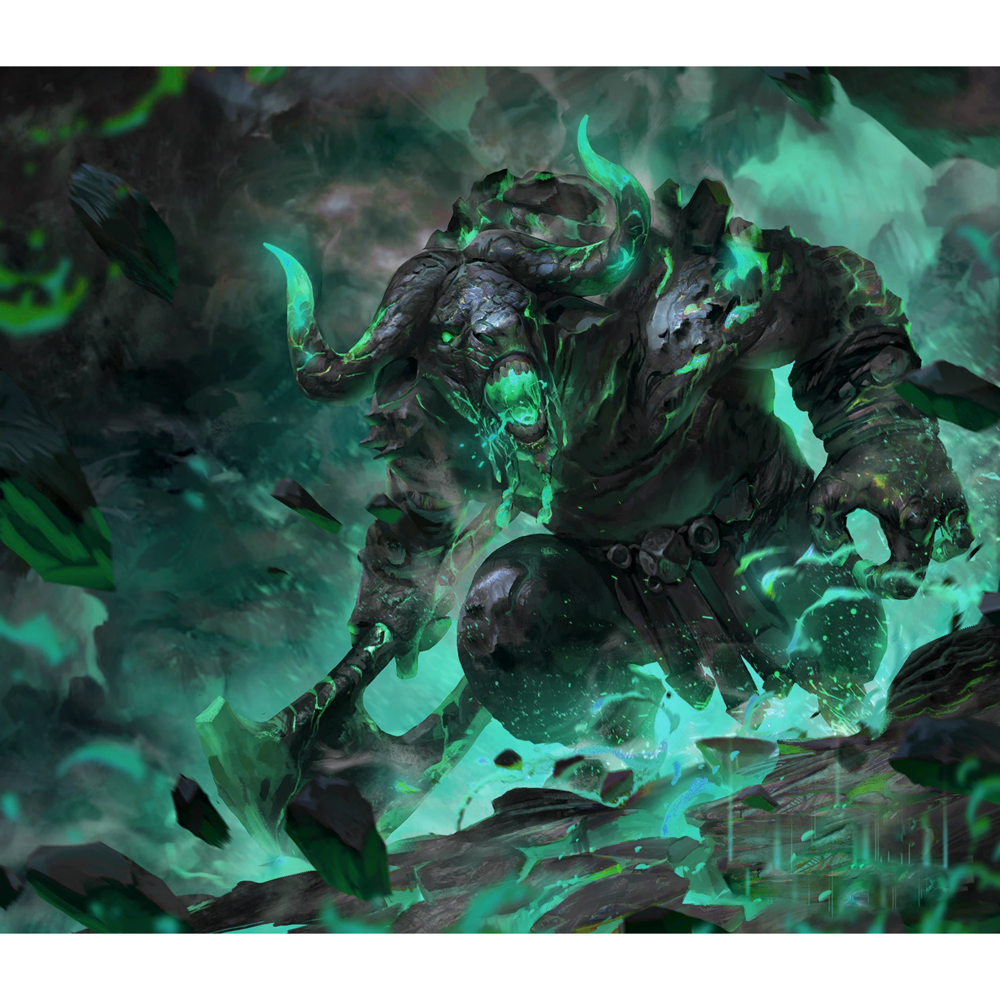

# Sesja 9: W Głębi Grobowca Xandera

**Data:** 18.03.2024

## Podsumowanie

Bohaterowie weszli do [[Labirynt w Nekropolii|labiryntu]] w [[Nekropolia w Telamok|Nekropolii]], pokonując nieumarłe minotaury i odnajdując [[Grobowiec Xandera|grobowiec Xandera Houratha]]. Po otwarciu drzwi do grobowca, stoczyli walkę ze szkieletami i stanęli przed [[Graxis Rzeźnik|Graxisem Rzeźnikiem]], strażnikiem grobowca. Po pokonaniu go, [[Xander|Xander Hourath]] ukazał się bohaterom i przekazał im [[Topór Xandera]], [[Tarcza Volkana|Tarczę Xandera]] i [[Korona Smoczych Lordów|Koronę Smoczych Lordów]]. Następnie bohaterowie weszli do [[Tomb of Balmytria|grobowca Balmytrii]]. [[Arevon Elorrenthi|Arevon]] doświadczył wizji związanej z [[Zakład Smoczego Lorda|Zakładem Smoczego Lorda]].

## Kluczowe wydarzenia / decyzje

* Wejście do [[Labirynt w Nekropolii|labiryntu]] i pokonanie nieumarłych minotaurów.
* Odnalezienie [[Grobowiec Xandera|grobowca Xandera Houratha]].
* Otwarcie drzwi do grobowca i walka ze szkieletami.
* Spotkanie z [[Graxis Rzeźnik|Graxisem Rzeźnikiem]], strażnikiem grobowca.
* Pokonanie Graxisa i spotkanie z [[Xander|Xandrem Hourathem]].
* Otrzymanie [[Topór Xandera|Topora Xandera]], [[Tarcza Volkana|Tarczy Xandera]] i [[Korona Smoczych Lordów|Korony Smoczych Lordów]].
* Wejście do [[Tomb of Balmytria|grobowca Balmytrii]].
* Wizja [[Arevon Elorrenthi|Arevona]] związana z [[Zakład Smoczego Lorda|Zakładem Smoczego Lorda]].

## Postacie Niezależne (NPC)

* [[Graxis Rzeźnik]]
* [[Xander|Xander Hourath]]

## Lokacje

* [[Labirynt w Nekropolii]]
* [[Grobowiec Xandera|Grobowiec Xandera Houratha]]
* [[Tomb of Balmytria|Grobowiec Balmytrii]]

## Szczegółowy opis wydarzeń

Bohaterowie, kontynuując eksplorację [[Nekropolia w Telamok|Nekropolii]], weszli do [[Labirynt w Nekropolii|labiryntu]]. Podążając ścieżką, pokonali nieumarłe minotaury i dotarli do [[Grobowiec Xandera|grobowca Xandera Houratha]]. Napis na drzwiach głosił "Poznaj siebie i mów". [[Felicjan Janus Twardowski|Felicjan]], kładąc rękę na [[Tarcza Volkana|tarczy Xandera]], patrząc mu w oczy i przedstawiając się, otworzył drzwi.

Wewnątrz grobowca stoczyli walkę ze szkieletami, a następnie stanęli przed [[Graxis Rzeźnik|Graxisem Rzeźnikiem]], strażnikiem grobowca. Po pokonaniu go, ukazał się im sam [[Xander|Xander Hourath]]. Przekazał bohaterom [[Topór Xandera]], [[Tarcza Volkana|Tarczę Xandera]] i [[Korona Smoczych Lordów|Koronę Smoczych Lordów]], a następnie zniknął.

Bohaterowie weszli do [[Tomb of Balmytria|grobowca Balmytrii]], wychodząc [[Damon]] przekazał [[Arevon Elorrenthi|Arevonowi]] artefakt, z pomocą którego doświadczył wizji związanej z [[Zakład Smoczego Lorda|Zakładem Smoczego Lorda]].
