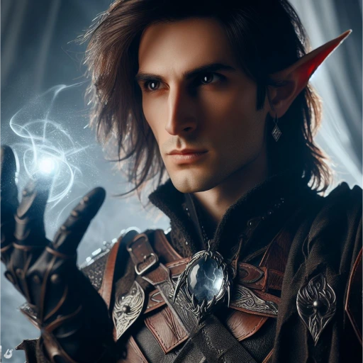

_Elf Druid, [[Epickie Ścieżki#The Seeking One (Poszukujący)|The Seeking One]]_
_**Poszukujący**, który przybył z odległych krain i odnalazał ukryte tajemnice [[Thylea|Thylei]]._

## Historia

Arevon Elorrenthi, elficki druid z domu Phiarlan w Eberron, wychował się pośród wojennych intryg i sztuki, lecz odnalazł powołanie wśród Strażników Lasu i gwiazd. Jako nawigator na statku "The Tranquility" badał granice magicznej mgły Mournlandu, gdy potężny sztorm przeniósł go do innego wymiaru. Rozbił się u wybrzeży mitycznej krainy Thylea, tracąc załogę i wszystko co znał.

Ocalały z katastrofy, Arevon szybko zaadaptował się do nowej rzeczywistości, wykorzystując swoje ocalałe zasoby, by przetrwać w obcym mieście Mytros. Zgłębiając historię i kulturę Thylei, otrzymał niespodziewane wezwanie od Wyroczni, która obiecała odpowiedzi na dręczące go pytania o los jego świata i przyczynę przybycia. Wyruszył więc w podróż, wierząc, że gwiazdy i przeznaczenie wskażą mu drogę powrotną lub nowy cel w tym dziwnym świecie.

Podczas pobytu w [[Estoria|Estorii]], Arevon wykazał się sporą naiwnością wynikającą z nieznajomości lokalnych praw i klątw. Na [[Agora w Estorii|Agorze]] natknął się na [[Claus|Clausa]], rabusia grobów, i o mały włos nie dał się namówić na kupno przeklętego naszyjnika, co mogło sprowadzić na niego gniew bogów.

W [[Sesja 21 - Ukryte pragnienia Ismene]] znalazł w Akademii książkę "Golemy i Automatony", z której dowiedział się o [[Keledone]].

W trakcie poszukiwań statku [[Ultros]] przy [[Martwe Wodospady]], Arevon stanął do walki z kapitanem widmo - [[Estor Arkelander|Estorem Arkelanderem]]. Padłszy ofiarą jego mrocznej mocy, został tymczasowo zabity, lecz interwencja bogini [[Kyrah]] przywróciła go do życia.

W [[Sesja 39 - Tajemnice Wyspy Złotego Serca]] z niezwykłą precyzją sterował [[Ultros|Ultrosem]] podczas sztormu zesłanego przez [[Sydon|Sydona]], ratując statek przed zniszczeniem.

W [[Sesja 41 - Wiedźma Lotosu]] w wieży [[Wiedźma Lotosu|Wiedźmy Lotosu]] odnalazł zaginionego członka swojej załogi, [[Garrick Vanalan|Garricka Vanalana]]. Dowiedział się od Wiedźmy, że Thylea jest kieszonkowym planem. Zakręcił magicznym Kołem Fortuny, zyskując zdolność przemiany w drzewca.

W [[Sesja 47 - Wyspa Mojr]] ujrzał wizję własnej śmierci w paszczy smoka. Odrzucił ofertę [[Mojry|Mojr]], które proponowały mu potężne zaklęcia w zamian za jego szybkość.

W [[Sesja 48 - Pakty z Mojrami i Zew Chimery]] ostatecznie ugiął się i poświęcił swoją legendarną szybkość w zamian za ulepszenie artefaktu (dodanie potężnych zaklęć).

W [[Sesja 49 - Wielkie Gęsie Powstanie]] podejrzewał [[Althaia|Althaię]] od samego początku. Został zamieniony w gęś, ale też na chwilę uśpiony podczas walki. Po odzyskaniu postaci zmienił się w gigantycznego orła, by odzyskać ekwipunek drużyny ze szczytu góry.

W [[Sesja 64 - Pieśń dla Smoczycy]], gdy zbliżali się do Wyspy Smoka, jego umysł stał się naczyniem dla wspomnień samej [[Hexia|Hexii]]. Zobaczył świat jej oczami - miłość do [[Ochos Arkelander|Ochosa]], pieśń, i moment, w którym [[Zguba Tytanów|Titansbane]] zawiódł, nie mogąc zabić Sydona. Ta wizja pozwoliła drużynie zrozumieć ból smoczycy.

W [[Sesja 65 - Wyprawa w Otchłań]] popisał się mistrzowską nawigacją, przeprowadzając [[Ultros|Ultrosa]] przez wir [[Charybda]] na [[Morze Otchłani]]. Wewnątrz [[Sześcian Więzienny|Sześcianu Więziennego]] odczytał starożytne runy w języku Primordial, odkrywając przerażającą prawdę o uśpionym wewnątrz [[Tarrasque]].
