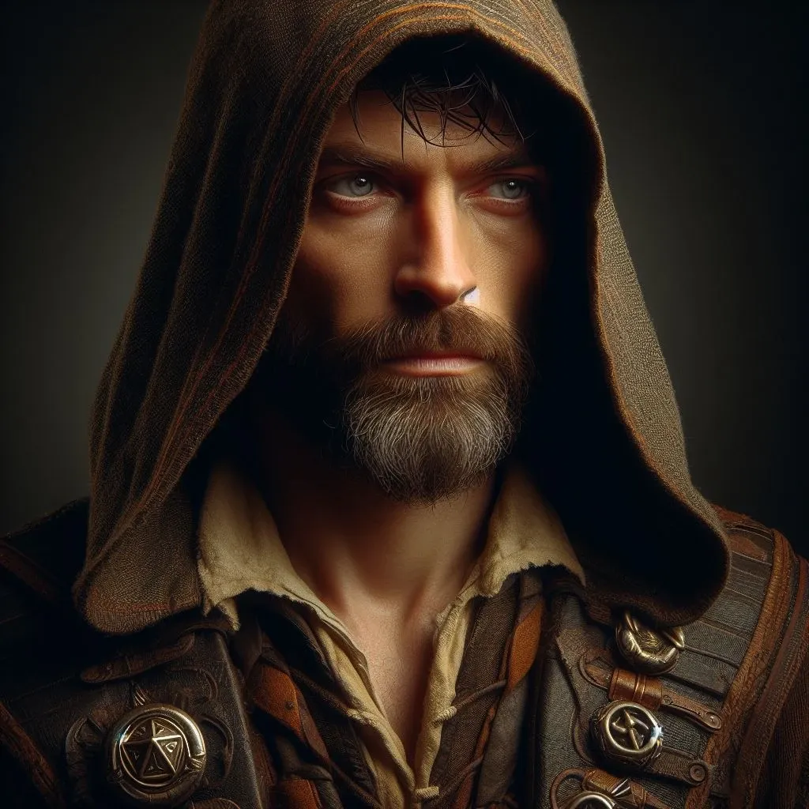

_Human Wizard, [[Epickie Ścieżki#The Gifted One (Utalentowany)|The Gifted One]]_
_**Utalentowany**, który odkrył źródło swoich zdolności i doprowadził do odrodzenia Zakonu._

## Historia

Felicjan Janus Twardowski, urodzony w Mytros syn kowala, od najmłodszych lat wykazywał niezwykły talent do nauki i filozofii, co zaprowadziło go do Akademii pod skrzydła samego Epikura. Mimo ukończenia studiów jako najlepszy uczeń, presja i strach przed porażką sprawiły, że porzucił karierę naukową, wracając do rodzinnego warsztatu i marnując swój potencjał na proste życie.

Dopiero po dziesięciu latach, w obliczu nadciągającej wojny i poczucia zmarnowanego losu, Felicjan postanowił przełamać swój strach. Wspierany przez żonę, kapłankę Mytros, oraz pamięć o dawnych ambicjach, zdecydował się w końcu zaryzykować i wykorzystać swój magiczny dar, by stać się bohaterem, jakim zawsze miał być, stawiając czoła przeznaczeniu jako "Obdarowany".

W [[Sesja 15 - W kanałach Mytros]] dowiedział się od Mistrza [[Chalcodon|Chalcodona]] o swojej prababce [[Despina|Despinie]] i jej związku z Wybrzeżem Mieczy.

W [[Sesja 18 - Cienie Mytros]] odwiedził mędrca [[Vitalis|Vitalisa]], który zdradził mu, że aby znaleźć Fortecę Smoczych Lordów, musi odszukać tytana [[Talieus|Talieusa]].

W [[Sesja 21 - Ukryte pragnienia Ismene]] znalazł w Akademii zwój o Tytanach oraz przeprowadził zwiad w piwnicy [[Posiadłość Neurdagonów|Posiadłości Neurdagonów]].

W [[Sesja 22 - Taniec z Meduzą]] użył zaklęcia Fireball, aby powstrzymać statek [[Varkon|Varkona]].

W [[Sesja 24 - Ultros]] to właśnie Felicjan zadał ostateczny cios potężnemu [[Estor Arkelander|Estorowi Arkelanderowi]], uwalniając załogę statku [[Ultros]] od tyranii ich przeklętego kapitana. Wykazał się potężną magią, która zdołała zranić istotę, która uważała się za nieśmiertelną.

W [[Sesja 41 - Wiedźma Lotosu]] zobaczył w [[Korytarz Światów|Korytarzu Światów]] wizję swojej śmierci oraz śmierci żony [[Melania Twardowska|Melanii]] z ręki Behemota w płonącym Mytros. Po zakręceniu Kołem Fortuny stał się wytrzymalszy i inteligentniejszy.

W [[Sesja 47 - Wyspa Mojr]] odrzucił ofertę [[Mojry|Mojr]], które chciały wzmocnić jego koronę w zamian za jego szczęście. Używając daru jasnowidzenia, potwierdził, że układ z Mojrami w sprawie smoków mógłby przynieść korzyść, choć cena była wysoka.

W [[Sesja 48 - Pakty z Mojrami i Zew Chimery]] zawarł pakt z [[Mojry|Mojrami]], poświęcając swoje zdrowie (połowa efektywności leczenia) w zamian za ulepszenie korony. Oddał również swoją różdżkę wykonaną ze smoczego rogu, aby pomóc zdjąć klątwę z jaj. Dowiedział się, że jego prababka [[Despina]] była siostrą [[Adonis Neurdagon|Adonisa Neurdagona]] i zdradziła Smoczych Lordów. Po opuszczeniu wyspy, był świadkiem wyklucia się smoka [[Kairos|Kairosa]], z którym się związał. Przystępując do rytuału więzi, **wypowiedział słowa starożytnej przysięgi [[Smoczy Lordowie|Smoczych Lordów]]** — pierwszy raz od upadku Zakonu, gdy formuła komuś zadziałała. Na [[Wyspa Forlorn|Wyspie Forlorn]] o mało nie zginął w walce z Płonącymi Czaszkami, które nieświadomie wypuścił z Worka Bez Dna.

W [[Sesja 49 - Wielkie Gęsie Powstanie]] na wraku statku znalazł Amulet Krakena. Po przemianie w gęś wykazał się sprytem, pisząc dziobem na ziemi prośbę o pomoc ("Wiedźma Klątwa"), co pozwoliło nawiązać sojusz z ludźmi Tarana.

W [[Sesja 71 - Infiltracja Praxys]] przygotował z pomocą nawozu od [[Volkan|Volkana]] swoje czary, po czym wziął na akcję infiltracyjną młodego smoka [[Kairos|Kairosa]]. Pod osłoną eterycznej formy w gęstym odpływie rur kanalizacyjnych, wraz z [[Orion Xul|Orionem]] mistrzowsko użył gigantycznej iluzji dźwiękowej głośnej biegunki, by pozbyć się cyklopa sprzątacza z toalety i swobodnie zinfiltrować dalej wieżę. Kiedy sytuacja wymknęła się spod kontroli wraz ze zmutowanymi owadami wokół spętanej [[Królowa Myrmeków|Królowej Myrmeków]], pomógł położyć skuteczną Ścianę Ognia, dołączając do ataku dławiącego groźną zarazę.

W [[Sesja 72 - Śniadanie u Tytana Bochenek Przeznaczenia]] odegrał kluczową rolę strategiczną przy użyciu sprytu i magii. Zaatakował Tytana w jego własnej twierdzy używając wezwanego Widmowego Smoka zaświatów. Wykorzystał genialny refleks przeciwko [[Chalcia|Chalci]] i odbił jej zabójczy *Łańcuch Piorunów*, by porazić samą dziedziczkę. Zidentyfikował również potężne przedmioty zrabowane z cyklopiego skarbca w sekrecie przed właścicielem [[Praxys]].

W [[Sesja 82 - Bitwa o Mytros: Śmierć Pani Snów]] odegrał rolę kluczową dla zwycięstwa. Przekierował zaklęcie [[Lutheria|Lutherii]] wymierzone w [[Klonicjan|Klonicjana]] na przypadkową świnię, a serią kul żywiołowej energii wygasił kolejne fantazmaty bogini, aż odnalazł wśród nich **prawdziwą** [[Lutheria|Lutherię]]. Gdy psioniczny krzyk sparaliżował [[Orestes|Orestesa]], [[Arevon Elorrenthi|Arevona]] i [[Orion Xul|Oriona]], został jedynym w pełni władnym członkiem drużyny i magią rozpraszającą uwolnił minotaura. Przywołał też słup palącego światła, który systematycznie wygaszał odbicia bogini, a przed jej kosą krył się na planie eterycznym.

W [[Sesja 83 - Zmierzch Ery Tytanów]] to on zebrał obrońców: gdy [[Orestes]] odmówił wystąpienia przed ludźmi, sam stanął przed garstką ocalałych i przemówił tak, że zamiast uciekać, zaczęli się schodzić ochotnicy, a rozproszone oddziały zebrały się w [[Latająca Forteca Smoczych Lordów|Latającej Fortecy Smoczych Lordów]] — ich salwy wspierały drużynę przez całą bitwę. W starciu z [[Kentimane|Kentimane'em]] osłaniał się chmarą iluzorycznych sobowtórów, zawiesił nad głową [[Tytani|Tytana]] widmowy miecz losu z wykrzyczanym warunkiem, a następnie cisnął zaklęciem wygnania, próbując odesłać [[Kentimane|Sturękiego]] z tego świata. Magia rozpłynęła się po [[Tytani|Tytanie]] jak fala na skale.

W [[Sesja 84 - Świt Nowej Ery]] zajął się polityką i instytucjami. Nie chciał oddawać [[Kryształowa Kosa Lutherii|Kryształowej Kosy]] [[Mistrz Cieni|Mistrzowi Cieni]], widząc w [[Arezja|Arezji]] kogoś, kto systematycznie zbiera relikwie po dawnych bogach i mógłby sięgnąć po opuszczone domeny — ustąpił dopiero wobec kompromisu drużyny. Odbudował naprawdę [[Smoczy Lordowie|Zakon Smoczych Lordów]] i wziął na jego siedzibę [[Wyspa Yonder|Wyspę Yonder]] wraz z tamtejszą biblioteką glinianych tabliczek. Pilnował, by powojenne czystki nie kończyły się śmiercią, a rosnącą potęgę [[Taran Neurdagon|Tarana Neurdagona]] proponował trzymać w ryzach podatkami i obserwacją — przypominając, czym rodzina Neurdagonów zajmowała się naprawdę: bioautomatonami i [[Egida Mytros|Egidą Mytros]]. Wystarał się też o miejsce w [[Akademia Mytros|Akademii Mytros]] dla [[Dedal|Dedala]] i wpadł na pomysł, by przy wyrastających wokół stolicy kapliczkach uczyć prostej magii i wyławiać dla Akademii talenty.
