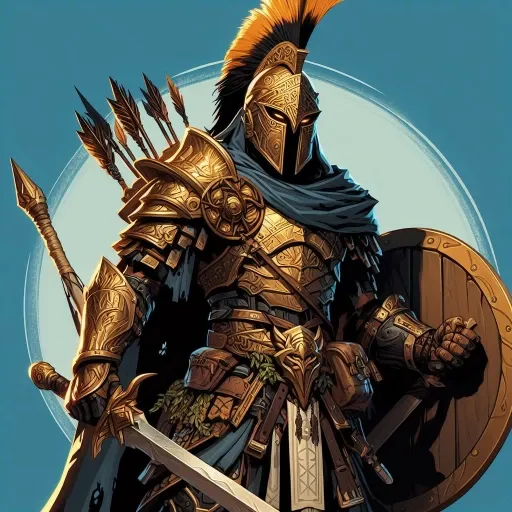

_Half-Elf Fighter, [[Epickie Ścieżki#The Demi-God (Półbóg)|Demigod]]_
_**Półbóg**, który odnalazł własną matkę i dorównał w boskości swojemu ojcu._

## Historia

Orion Xul, pół-elfi wojownik, dorastał w cieniu tajemnicy swojego pochodzenia, czując w żyłach płynącą boską krew. Jako syn jednego z bogów Piątki, zawsze czuł się wyobcowany wśród zwykłych śmiertelników, a jego nadludzka siła i talent do walki były zarówno darem, jak i ciężarem naznaczającym go od urodzenia.

Gdy [[Versi|Wyrocznia]] ogłosiła nadejście końca Pokoju, Orion zrozumiał, że jego przeznaczenie jest nierozerwalnie splecione z losami Thylei. Wyruszył w podróż, by dowieść swojej wartości, odkryć pełnię swojego dziedzictwa i stanąć do walki z Tytanami jako prawdziwy półbóg, gotów wstrząsnąć posadami świata, by chronić to, co kocha.

W [[Sesja 11 - Mithralowa Kuźnia]] poległ w walce z młodym cerberem. Został wskrzeszony przez swojego ojca, [[Pythor|Pythora]], w [[Sesja 12 - Furia Boga Bitwy]]. Wspólnie z [[Volkan|Volkanem]] wykuł włócznię [[Odkupienie Pythora]] w [[Sesja 13 - Wezwani przez Króla]].

W [[Sesja 47 - Wyspa Mojr]] zawarł pakt z [[Nona|Noną]], jedną z [[Mojry|Mojr]]. W zamian za spędzenie z nią nocy i spłodzenie potomka, otrzymał ulepszenie swojej włóczni. Był jedynym bohaterem, który zgodził się na indywidualny układ z Paniami Losu.

W [[Sesja 49 - Wielkie Gęsie Powstanie]] zadał ostateczny cios Chimerze, przebijając jej serce włócznią. Później został przemieniony w gęś przez klątwę [[Althaia|Althai]], ale walczył dzielnie w gęsim powstaniu przeciwko wiedźmie.

W [[Sesja 71 - Infiltracja Praxys]] wsławił się aktorsko-złodziejskim popisem w latrynie wieży - chcąc prześlizgnąć się poza cyklopem [[Krok|Krokiem]] zaczął głośno jęczeć i odgrywać uciążliwe problemy żołądkowe, krzycząc do zdezorientowanego cyklopa z zamkniętej kabiny żądania na papier toaletowy. Cyklop w konsternacji zrezygnował z dalszych pytań i zgodnie z jego prośbą, by nie patrzeć na "problemy żołądkowe", odszedł by zjeść wcześniej przygotowaną kanapkę. W dalszej części zadał ostateczny, morderczy cios spętanej [[Królowa Myrmeków|Królowej Myrmeków]].

W [[Sesja 72 - Śniadanie u Tytana Bochenek Przeznaczenia]] dołożył swoją niebiańską precyzję, by powstrzymać z ukrycia rządy uzurpatora Władcy Burz w wieży [[Praxys]]. W bezpośrednim starciu raził przeciwników ostrym zakończeniem włóczni ojca zadając dotkliwe obrażenia, pomagając ostatecznie odpędzić go pod kopułę mytrońskiej świątyni.

W [[Sesja 82 - Bitwa o Mytros: Śmierć Pani Snów]] dobił Lamię [[Odkupienie Pythora|Odkupieniem Pythora]], pozbawiając [[Lutheria|Lutherię]] ostatniego wsparcia na [[Targ Minotaurów|Targu Minotaurów]]. Przez całe starcie raz za razem ciskał włócznią w kolejne odbicia bogini w [[Świat Snów|Świecie Snów]], a broń posłusznie wracała mu do dłoni. Jako jedyny z trójki trafionych psionicznym krzykiem stawił mu najtwardszy opór.

W [[Sesja 83 - Zmierzch Ery Tytanów]] walczył z grzbietu [[Raspytrion|Raspytriona]], ciskając magicznym oszczepem zamieniającym się w locie w kolumnę błyskawicy. Gdy [[Kentimane]] strącił smoka z nieba, spadł razem z nim — od śmierci uratowała go zbroja, która pochłonęła niemal całe uderzenie o ziemię. Z ziemi, tuż u stopy [[Tytani|Tytana]], prowadził uparty ostrzał [[Odkupienie Pythora|Odkupieniem Pythora]], aż setka ramion pochwyciła go i [[Kentimane|Sturęki]] połknął go w całości. Nieprzytomnego ocucił w trzewiach [[Versir]] miksturą leczącą; oślepiony i trawiony sokami [[Orion Xul|Orion]] dźgał dalej na oślep, a nawet krzyczał w ciemność, by [[Kentimane]] zostawił ich w spokoju i wracał do swojego leża. Z wnętrza [[Tytani|Tytana]] wyrwał go dopiero [[Versir]] zaklęciem przejścia.

W [[Sesja 84 - Świt Nowej Ery]] zajął się swoim ojcem. Zadawał [[Pythor|Pythorowi]] pytania, na które ten nie umiał odpowiedzieć — czy jest człowiekiem, półbogiem, czy kryje się w nim coś smoczego — i opowiedział mu o sobie: że był żołnierzem, który zabijał na rozkaz, potem przestał nim być, bo nie chciał już zabijać, a skończył jako najemnik bogów, który zabijał na rozkaz. Zaproponował ojcu wspólną podróż po świecie i namówił go, by po pięciuset latach stanął przed [[Hexia|Hexią]]. Z tej propozycji wyrósł zwyczaj: przez kolejne lata ojciec i syn wędrowali razem po [[Kontynent Thylea|Thylei]].

Własnych kapliczek nie zwalczał, ale i nie cieszył się z nich. Jednej rzeczy jednak nie naprawił: [[Lyra|Lyrę]], której lojalność wobec niego nigdy nie miała granic, zostawił bez rozmowy, bez wyjaśnienia i bez zamknięcia — dokładnie tak, jak [[Pythor]] zostawił [[Hexia|Hexię]]. Syn, który przez całą kampanię pchał ojca do naprawiania dawnych krzywd, popełnił dokładnie ten sam błąd.
