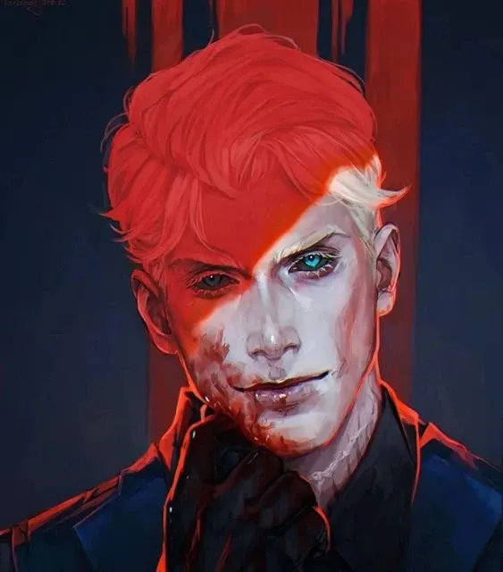

_Aasmiar Paladin/Sorcerer, [[Epickie Ścieżki#The Timeless One (Wieczny)|The Timeless One]]_
_**Wieczny**, który po stuleciach powrócił do [[Thylea|Thylei]] i odkrył los Zaginionych Tytanów._

## Historia

Versir, aasimar o paladyńskim powołaniu, spędził lata na Wyspie Czasu, szkolony przez Sfinksa do wypełnienia swojej misji przeciwko bliźniaczym tytanom, Sydonowi i Lutherii. Powróciwszy do Thylei, ukrył swą tożsamość, sprzymierzając się z Kultem Węża i Panią Monet, co zmusiło go do współpracy z nieufną Astrą. Ich początkowo szorstka relacja, pełna podejrzeń, zmieniła się podczas pułapki na cmentarzu.

Tam, nad grobem brata Astry ofiarowanego tytanom, wspólna nienawiść do Sydona i Lutherii połączyła ich sojuszem. Versir wyjawił swą naturę pół-tytana i cel zemsty, zyskując wierną przyjaciółkę. Od tego czasu budował swą reputację i wpływy w cieniu, cierpliwie czekając na przepowiedziany przez Sfinksa znak od Wyroczni, by ostatecznie uderzyć w swych odwiecznych wrogów.

W [[Sesja 21 - Ukryte pragnienia Ismene]] dowiedział się od [[Astra|Astry]], że jego sojuszniczka [[Moxena]] zdradziła go i zawarła układ z Tytanami (Hexią).
W [[Sesja 22 - Taniec z Meduzą]] doszło do konfrontacji z Moxeną.
W [[Sesja 23 - Nowe Przymierze]] wynegocjował nowe warunki współpracy z Moxeną. Wymusił na niej zaprzestanie porywania artystów oraz obietnicę pomocy w walce z Hexią w przyszłości, w zamian za wsparcie drużyny w obaleniu fałszywej królowej Themis.

W [[Sesja 39 - Tajemnice Wyspy Złotego Serca]] ogłosił swoje przybycie przy [[Drzewo Serca|Drzewie Serca]], co uruchomiło portal i wizję historii Tytanów.

W [[Sesja 47 - Wyspa Mojr]] doświadczył wizji swojej śmierci z rąk [[Lutheria|Lutherii]]. Prowadził negocjacje z [[Mojry|Mojrami]], oferując im nawet [[Sydon|Sydona]], ale ostatecznie odrzucił propozycję rocznej służby.

W [[Sesja 48 - Pakty z Mojrami i Zew Chimery]] oddał [[Mojry|Mojrom]] potężny artefakt - Kostur [[Sydon|Sydona]], jako część zapłaty za zdjęcie klątwy ze smoczych jaj.

W [[Sesja 49 - Wielkie Gęsie Powstanie]] został przemieniony w gęś. Po walce zdołał wykraść list z kieszeni ludzi [[Taran Neurdagon|Tarana Neurdagona]], ujawniając jego zlecenie na głowę [[Althaia|Althai]].

W [[Sesja 60 - Typhon Symfonia Potępienia i Brama do Hadesu]] doznał wizji od matki, która wskazała mu drogę do uwięzionej w Hadesie ciotki Yali.

W [[Sesja 61 - Yala, Arezja i Żółw]] odnalazł w Hadesie swoją ciotkę [[Yala Pierwsza|Yalę]]. Uwolnił ją z pęt szaleństwa i kamiennego więzienia. Jej esencja dobrowolnie wstąpiła do jego [[Rękawica Versira|Rękawicy]], wzmacniając go w walce przeciwko bliźniakom.

W [[Sesja 65 - Wyprawa w Otchłań]] popisał się skuteczną dyplomacją (za pomocą telepatii) w starciu z [[Kraken|Krakenem]], przekonując potwora, że są wrogami [[Sydon|Sydona]]. Niestety, podczas eksploracji [[Sześcian Więzienny|Sześcianu Więziennego]] na Morzu Otchłani, popełnił fatalny błąd. Dotknął sfery anihilacji, co skutkowało trwałym odcięciem dłoni, którą wcześniej chroniła magiczna Rękawica.
