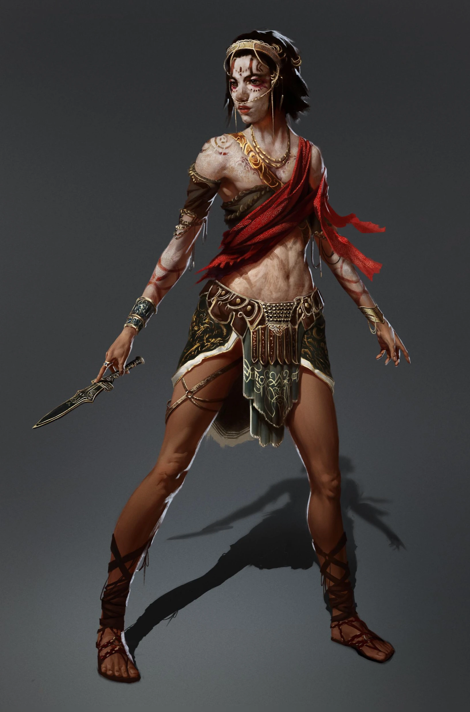

# Darien

_Prawowita dziedziczka tronu Amazonek, więziona przez lata w Kłach._

## Opis
Długotrwale więziona, osłabiona psychicznie i fizycznie.

## Osobowość
Zniszczona przez lata niewoli, ma problemy z komunikacją, ale powoli odzyskuje siły i sprawczość jako władczyni.

## Historia
Jest córką prawdziwej królowej Amazonek, [[Thessilea|Thessilei]], która została zamordowana kilkanaście lat temu podczas przewrotu dokonanego przez [[Moxena|Moxenę]], [[Leah|Leę]] i [[Nastura|Nasturę]]. Podczas gdy Nastura przybrała postać zmarłej królowej i przejęła jej imię, Darien została wtrącona do lochów w fortecy [[Więzienie Kieł|Kieł]].

Spędziła w zamknięciu wiele lat, aż do momentu, gdy została uwolniona przez drużynę w [[Sesja 32 - Kieł]]. Dopiero po udanej rewolucji w [[Sesja 36 - Królowa, Dziedzic i Generał]], wspieranej przez skruszoną Moxenę i bohaterów, zasiadła na tronie jako prawowita spadkobierczyni. Ogłosiła liczne reformy mające na celu uzdrowienie społeczeństwa [[Themis]].

