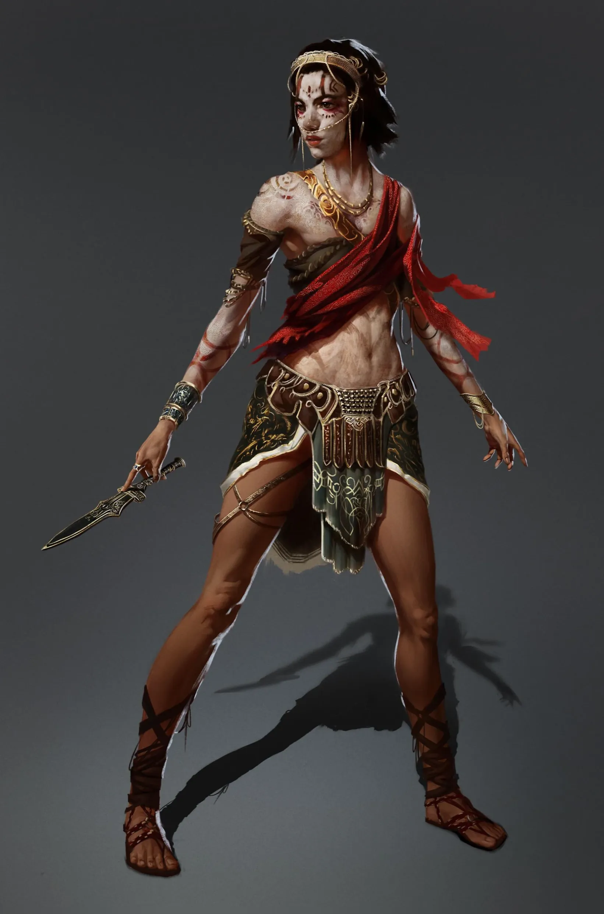

_Prawowita dziedziczka tronu Amazonek, więziona przez lata w Kłach. Królowa [[Themis]] po rewolucji — poległa w obronie [[Mytros]]._

## Opis
Długotrwale więziona, osłabiona psychicznie i fizycznie.
Przez 13 lat była zamknięta w celi zaklętej czarem *Silence*, przez co nie mogła mówić.

## Osobowość
*   **Pełna ducha:** Mimo uwięzienia, pragnie przygód i zemsty.
*   **Nieśmiała:** Ma braki w umiejętnościach społecznych. Czuje się niezręcznie.
Zniszczona przez lata niewoli, ma problemy z komunikacją, ale powoli odzyskuje siły i sprawczość jako władczyni.

## Historia
Jest córką prawdziwej królowej Amazonek, [[Thessilea|Thessilei]], która została zamordowana kilkanaście lat temu (gdy Darien miała 5 lat) podczas przewrotu dokonanego przez jej doradczynie (siostry): [[Moxena|Moxenę]], [[Leah|Leę]] i [[Nastura|Nasturę]], które zmieniły się w meduzy. Podczas gdy Nastura przybrała postać zmarłej królowej i przejęła jej imię, Darien została wtrącona do lochów w fortecy [[Więzienie Kieł|Kieł]]. Matka wymusiła na zabójczyniach przysięgę, że nie skrzywdzą Darien aż do jej pełnoletności.

Spędziła w zamknięciu wiele lat, aż do momentu, gdy została uwolniona przez drużynę w [[Sesja 32 - Kieł]]. Dopiero po udanej rewolucji w [[Sesja 36 - Królowa, Dziedzic i Generał]], wspieranej przez skruszoną Moxenę i bohaterów, zasiadła na tronie jako prawowita spadkobierczyni. Ogłosiła liczne reformy mające na celu uzdrowienie społeczeństwa [[Themis]].

## Reformy
Przemówienie tronowe wygłoszone tuż po rewolucji zaskoczyło nawet jej własne wojowniczki. Kobieta, która przez trzynaście lat nie mogła wydać z siebie głosu, użyła pierwszej publicznej mowy, by zerwać z fundamentami dotychczasowego porządku:

*   **Zniesienie niewolnictwa mężczyzn** na [[Themis]] — najgłębsza zmiana ustrojowa w dziejach wyspy.
*   **Wygnanie zamiast zabijania** dorosłych synów rodzonych przez Amazonki.
*   **Odbudowa relacji z barbarzyńskimi plemionami** z [[Wyspa Indygo|Wyspy Indygo]], zerwanych za rządów uzurpatorki.
*   **Deklaracja udziału Amazonek w wojnie z Tytanami** po stronie [[Mytros]].

Na swoją doradczynię przyjęła [[Moxena|Moxenę]] — meduzę, która zamordowała jej matkę i przez trzynaście lat pilnowała jej celi — zwolnioną z przysięgi wobec bohaterów za ich zgodą.

## Śmierć
Darien dotrzymała słowa danego w sali tronowej. Gdy [[Sydon]] uderzył na [[Mytros]], Amazonki przypłynęły na wojnę, a Darien i [[Hippolyta]] osobiście objęły dowodzenie obroną **Doków** ([[Sesja 76 - Bitwa o Mytros: Pierwsza Fala]]). Ich odcinek był jednym z nielicznych, które wytrzymały pierwsze fale natarcia — podczas gdy [[Egida Mytros]] traciła dowódcę, a magowie z [[Akademia Mytros|Akademii]] cofali się w gruzy.

**Darien poległa w obronie Mytros.** Zginęła nie na własnej wyspie i nie o własną koronę, lecz broniąc miasta, którego mieszkańcy w większości nie wiedzieli nawet, kim jest.

Ironia jej losu jest trudna do zniesienia. Bohaterowie wyciągnęli ją z celi zaklętej czarem *Silence*, w której spędziła trzynaście lat bez prawa do własnego głosu. Posadzili ją na tronie. Dali jej dokładnie tyle wolności, ile potrzeba, by mogła oddać za nich życie — a ona zapłaciła tę cenę w całości, dowodząc łucznicami na płonącym nabrzeżu cudzego portu. Jej łuk, który przez ponad dekadę leżał poza jej zasięgiem, wypuścił strzały w obronie ich miasta.

Jej śmierć pozostawia **otwartą kwestię sukcesji na [[Themis]]**. Naturalną następczynią wydaje się [[Hippolyta]], przywódczyni plemienia Lwic, która walczyła u boku Darien do końca. W tle pozostaje jednak [[Yala]] — patronka Amazonek i ostatnie żyjące dziecko Tytanów, dotąd niezdecydowana, czy w ogóle przyjąć jakąkolwiek rolę.

