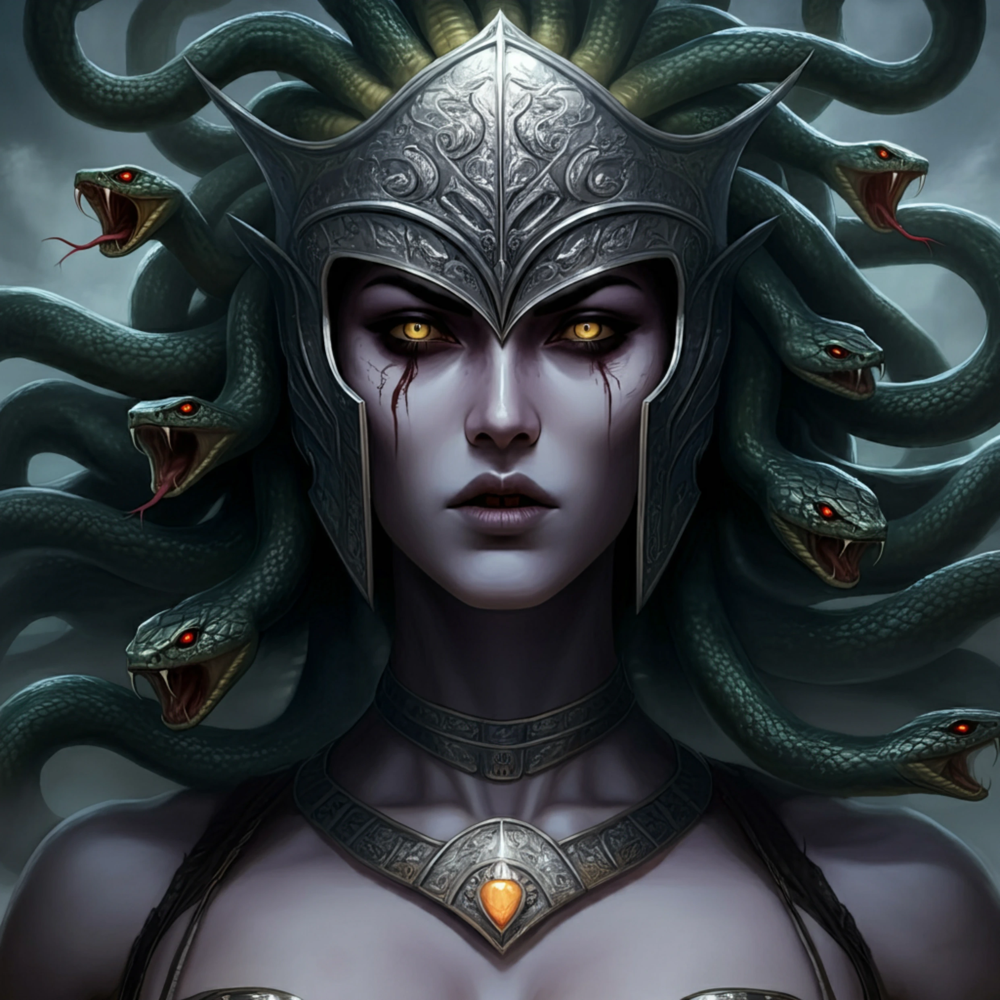

# Leah

_Siostra Moxeny, Meduza i Amazonka._

## Opis
Jedna z sióstr Meduz, które zinfiltrowały Amazonki.

## Historia
Kilkanaście lat temu, wraz z [[Moxena|Moxeną]] i [[Nastura|Nasturą]], brała udział w zamordowaniu prawdziwej królowej Amazonek, [[Thessilea|Thessilei]], i przejęciu władzy na [[Themis]]. Nastura przejęła postać zabitej królowej i jej imię, a jej córkę i dziedziczkę, [[Darien]], uwięziono w Kłach.

W [[Sesja 33 - W Szponach Bazyliszków]] wzmiankowana jako ta, która opuściła fortecę Kieł przed przybyciem drużyny.

W [[Sesja 35 - W Wężowym Uścisku]] poprowadziła oddział Amazonek przeciwko drużynie w obronie uzurpacji. Została pokonana przez [[Felicjan Janus Twardowski|Felicjana]].
