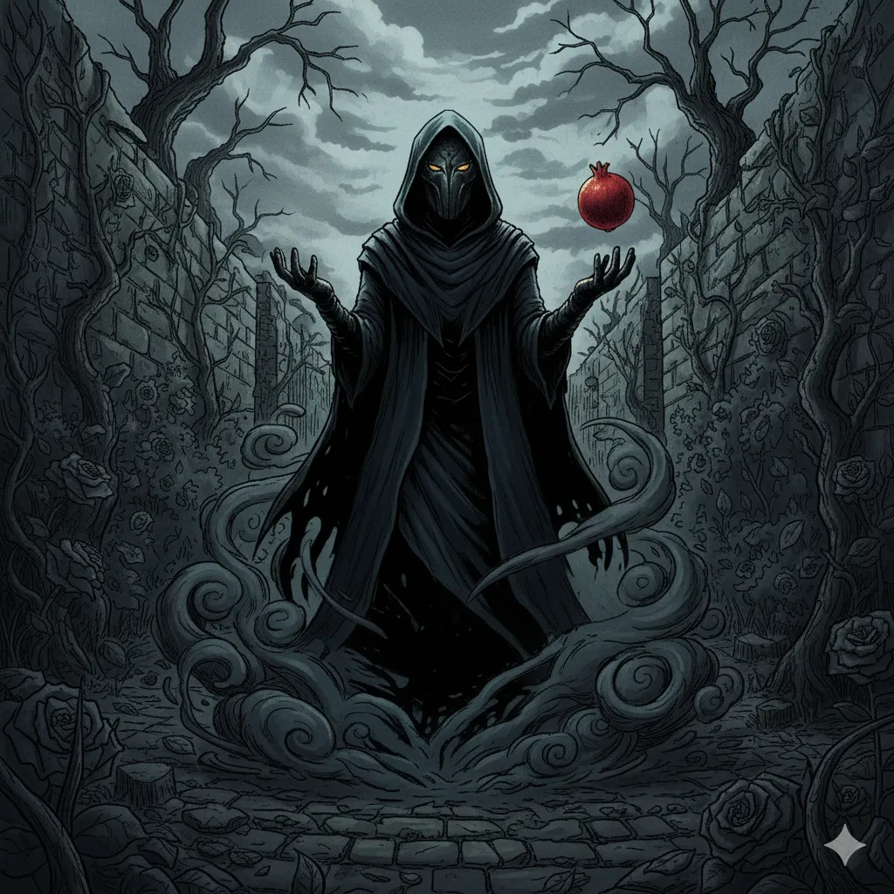

_Tajemnicza postać zarządzająca Świątynią Cienia i siatką szpiegowską Arezji._

## Opis
Postać zawsze skryta za maską i kapturem. Nikt nie zna prawdziwej tożsamości Mistrza Cieni.

## Osobowość
Cyniczny, pragmatyczny i niezwykle skuteczny.

## Historia
Zarządza [[Świątynia Cieni|Świątynią Cieni]].
W [[Sesja 63 - Werdykt Arezji]] ujawnia się bohaterom w Wiszących Ogrodach, oferując im [[Słoneczny Granat]] w zamian za przysługę - kradzież księgi z [[Praxys]] w przyszłości. Na Radzie Pięciu Mistrzów zagłosował za uderzeniem na armię Tytanów. Zna [[Despina|Despinę]].

W [[Sesja 83 - Bitwa o Mytros: Odejście Sturękiego]] przyszedł po swój dług. Wszedł w ciemnym kapturze do prowizorycznego [[Super Bar|Super Baru]] sklecionego w ruinach [[Mytros]] i odebrał od [[Arevon Elorrenthi|Arevona]] [[Traktat o Prawach i Zobowiązaniach Krwi]] ze skarbca [[Praxys]] — zgodnie z umową zawartą przed bramą [[Wiszące Ogrody|Wiszących Ogrodów]]: jedna księga i zero pytań. Nie wyjaśnił, co czyni ją tak cenną, a wszelkie próby wybadania go rozbiły się o osłonę, którą nosił. Przy okazji złożył [[Orestes|Orestesowi]] ofertę: powrót do świata żywych w zamian za [[Kryształowa Kosa Lutherii|Kryształową Kosę Lutherii]], dostarczoną do [[Arezja|Arezji]]. Zapytany, przystał, by artefakt był w odłamkach — byle komplet. Oferta ma pozostać ważna przez rok. Nikt z drużyny nie wie, po co mu kosa, i nikt mu nie ufa.
