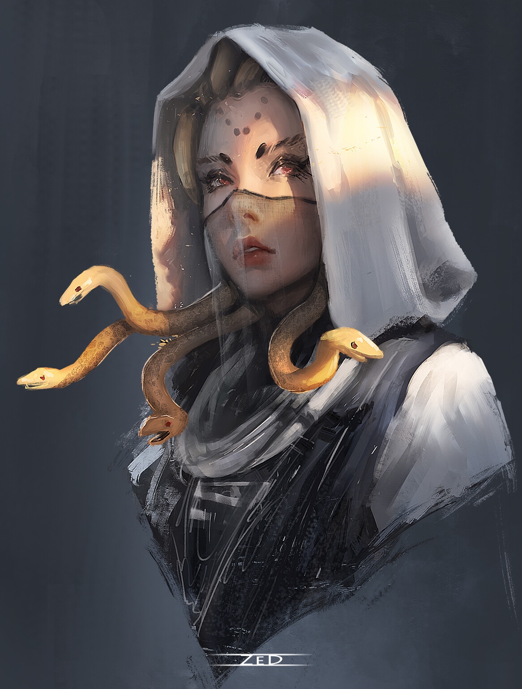

_Tajemnicza "Pani Monet", okazała się być Meduzą porywającą artystów, która teraz szuka odkupienia._

## Opis
Moxena jest Meduzą, choć przez długi czas ukrywała swoją naturę pod kapturami i maskami.

## Osobowość
Przebiegła, zdeterminowana, ale też trawiona poczuciem winy. Twierdzi, że jej cele są "szlachetne".

## Historia
Pochodzi z [[Themis|Wyspy Themis]]. Jest siostrą fałszywej królowej Amazonek. Wraz z siostrami dokonała krwawego przewrotu, zabijając prawdziwą królową Amazonek i więżąc jej córkę [[Darien]]. Moxena przez lata żyła z poczuciem winy z powodu tych wydarzeń, co stało się zarzewiem jej dążenia do naprawienia wyrządzonych krzywd.
Jako **Pani Monet** (*The Lady of Coins*) założyła [[Kult Węża]] (gildia złodziei), okradając bogatych, by wykupować niewolników (np. minotaury), ale tylko po to, by zbudować własną armię.
Pragnie zemsty na siostrze i [[Lutheria|Lutherii]].
Nienawidzi mężczyzn i traktuje ich z pogardliwą wyższością. Woli rozmawiać z kobietami.

### Działalność w Mytros
W [[Mytros]] znana była jako "Pani Monet". Współpracowała z [[Hexia|Hexią]], porywając i sprzedając jej skamieniałych artystów (za pośrednictwem [[Varkon|Varkona]]). Do jej współpracowników należała [[Rhea]] oraz [[Versir]] (który ją zdradził).

W [[Sesja 21 - Ukryte pragnienia Ismene]] jej działalność została ujawniona przez [[Astra|Astrę]], która doniosła [[Versir|Versirowi]] o układzie Moxeny z [[Hexia|Hexią]]. Drużyna odkryła również jej siatkę szpiegowską ([[Greciosa]] i [[Nera]]) oraz miejsce spotkań ([[Satyrzy Ogon]]).

### Sojusz z Drużyną
W [[Sesja 22 - Taniec z Meduzą]], po zdemaskowaniu przez drużynę, znalazła się w potrzasku, zawarła z bohaterami nowe przymierze. Bohaterowie zobowiązali się pomóc jej wrócić na [[Themis|Wyspę Themis]] i obalić panującą tam fałszywą królową. W zamian Moxena przysięgła natychmiast zaprzestać porywania artystów w Mytros, przekazać informacje o [[Posiadłość Neurdagonów]] oraz w przyszłości pomóc drużynie w walce z [[Hexia|Hexią]].
W [[Sesja 23 - Nowe Przymierze]] sformalizowała układ w [[Kolos Pythora|Kolosie Pythora]] i przekazała drużynie mapę [[Posiadłość Neurdagonów|Posiadłości Neurdagonów]].

W [[Sesja 64 - Pieśń dla Smoczycy]] przybyła na [[Wyspa Smoka]], realizując przysięgę pomocy. Przekazała bohaterom informacje o sytuacji na wyspie. Po pomyślnych negocjacjach ze smokiem, zabrała na swój statek "użytecznych" uchodźców z [[Latająca Forteca Smoczych Lordów]].
