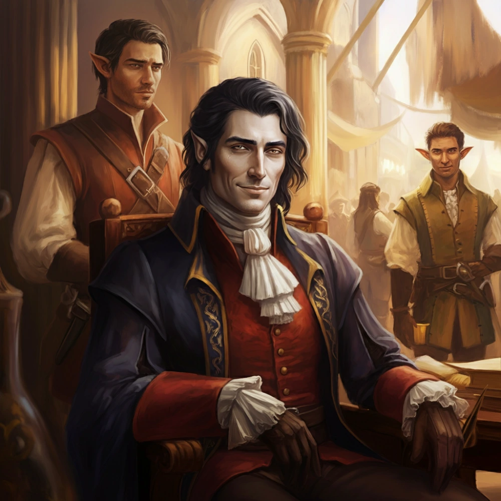

# Quinn

_Szlachcic-rozbitek z innego świata, syn Barona Alarica_

## Opis
Ubrany w łachmany i wodorosty, ale zachowujący pozory wielkiego pana.

## Osobowość
Próżny, narcystyczny, pozornie nieświadomy powagi swojej sytuacji. Obraził prawie całą drużynę przy pierwszym spotkaniu.

## Historia
Przybył do Thylei po tym, jak jego statek 'Sen Kasandry' został zniszczony przez wieloręką bestię (prawdopodobnie [[Kentimane|Kentimane'a]]).

Odnaleziony na wraku statku w [[Sesja 36 - Królowa, Dziedzic i Generał]]. Wcielony do załogi Ultrosa (zmuszony do wiosłowania pod pokładem).
