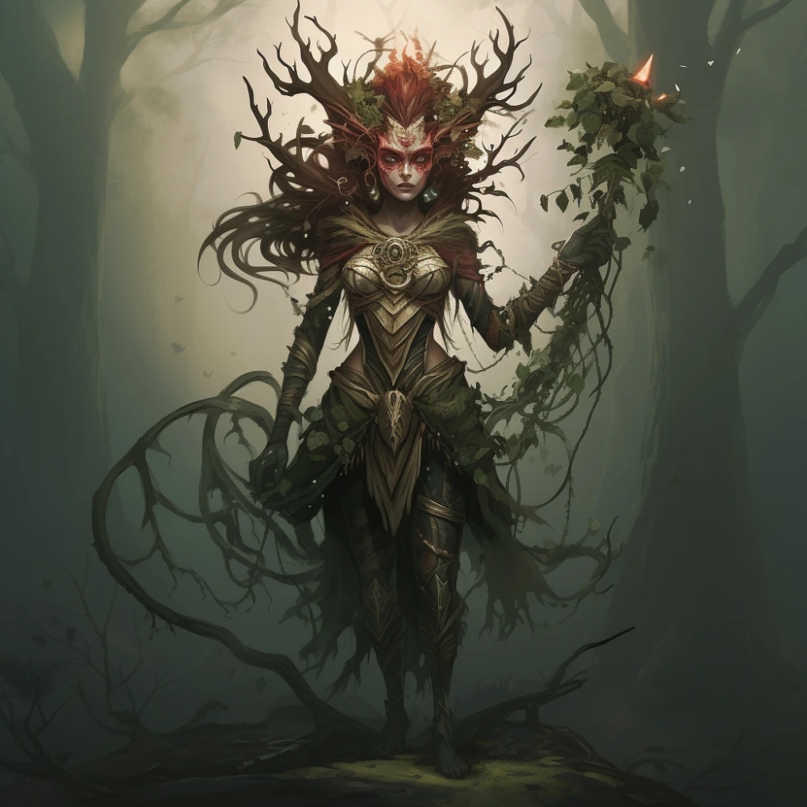

# Demetria

_Mściwa driada, władczyni Świątyni w Starym Lesie_

## Opis
Demetria jest driadą, która uległa szaleństwu i nienawiści. Jej niegdyś piękny wygląd stał się mroczny i niepokojący, odzwierciedlając zepsucie jej serca przez [[Lutheria|Lutherię]].

## Osobowość
Nienawidzi śmiertelników, zwłaszcza mieszkańców [[Mytros]] i [[Estoria]]. Jest pała żądzą zemsty za czyny [[Smoczy Lordowie|smoczych lordów]]. Jest niezwykle piękna i potrafi czarować słowami, wabiąc nieostrożnych w pułapkę.

## Historia
Wieki temu [[Estor Arkelander]] ściął dąb jej siostry, aby z jego drewna zbudować maszt, stępkę i dziobnice swojego statku, [[Ultros|Ultrosa]]. Demetria oszalała z żalu i nienawiści. Złożyła przysięgę wierności [[Lutheria|Lutherii]], która podsyciła jej gniew.

Demetria zaczęła porywać młodych ludzi z okolic [[Estoria]], obiecując im wieczną młodość i piękno. W rzeczywistości kobiety zamieniała w krwiożercze [[Menaidy]], a mężczyzn zabijała i zjadała podczas rytualnych uczt. Skradła również [[Róg Balmytrii]], aby wykarmić swoje rosnące sługi. W Świątyni trzymała również mroczną księgę [[Tome of Maenads]], przekazaną jej przez [[Lutheria|Lutherię]].

W [[Sesja 4 - Mroczne sekrety Świątyni]] została ostatecznie pokonana przez Bohaterów Przepowiedni, którzy odzyskali skradziony Róg.
