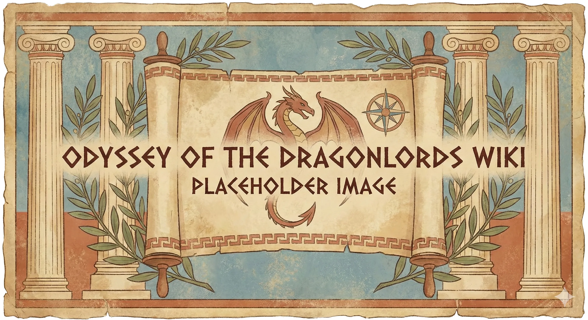

_Sturęki (The Hundred Handed)_

## Opis
Gargantuiczny tytan, gigant o setce rąk i pięćdziesięciu głowach. Najbrutalniejszy z bogów, którego uspokoić mogła tylko [[Thylea]].
Podczas gdy Thylea jest opiekunką, Kentimane jest uosobieniem gniewu: jest huraganem, trzęsieniem ziemi i wulkanem. Gdy Thylea potrzebuje obrony, Kentimane nie zważa na tych, którzy znajdą się w zasięgu jego niszczycielskiej furii.

## Historia
Mąż i obrońca [[Thylea|Thylei]]. Kiedy Thylea stała się lądem, on stał się jego strażnikiem. Po jej ofierze oszalał z bólu, wywołując burze, ale został ukojony przez jej ducha. Związał się przysięgą, by chronić wyspy i ich dzieci przed światem zewnętrznym.
Ojciec ośmiorga Tytanów (w tym [[Sydon|Sydona]] i [[Lutheria|Lutherii]]).
W [[Sesja 59 - Koniec Imprezy]] przemierzał dno oceanu, ignorując statek bohaterów. Jego przebudzenie zwiastuje wielkie zmiany.
