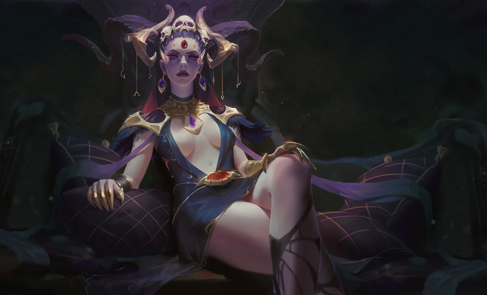

_Siostra Sydona_

## Opis
Lutheria przyjmuje postać pięknej kobiety o czarnych oczach, która lunatykuje przez zaświaty, witając duchy zmarłych. Na czole posiada trzecie oko, które zazwyczaj pozostaje zamknięte, lecz gdy je otwiera, widzi oczami zmarłych w zaświatach – wtedy porusza się ono niezależnie od jej pozostałych oczu. Dzierży kryształową kosę, której używa do zbierania dusz tych, którzy nie spodobali jej się za życia.

## Osobowość
*   **Ciekawska:** Interesuje się światami poza Thyleą, cywilizacjami i bogami.
*   **Pozornie Empatyczna:** Rozumie nadzieje i lęki śmiertelników. Jest czarująca i przystępna (z nutą szaleństwa), rzadko oceniająca. Złodzieje i mordercy czczą ją, licząc na wybaczenie.
*   **Manipulująca:** Lubi paktować, oferując spełnienie marzeń za przerażającą cenę.
Uważa rasy śmiertelne za zabawki i czerpie satysfakcję ze sprowadzania ich do poziomu bestii. Stworzyła menady i koźludzi (goatlings) jako kpinę z ludzkich osadników.

## Historia
Niegdyś bogini wielu rzeczy, mówi się, że stworzyła rasy fey, w tym satyrów, nimfy i driady. Jako siostra-żona [[Sydon|Sydona]] ucierpiała równie mocno, gdy ludzkość przybyła do Thylei – jej dzieci zostały wymordowane, a moc ukradziona przez [[Pięciu Bogów]].
Jest Panią Snów (*The Lady of Dreams*), Królową Hypnos, Panią Śmierci, Boginią Podziemi, Królową [[Morze Otchłani|Morza Otchłani]].

W [[Sesja 25 - Inauguracja Wielkich Igrzysk]] przybyła na stadion w [[Mytros]] przez wyrwę w rzeczywistości, przyprowadzając ze sobą nieumarłych czempionów i drwiąc z zasad króla [[Acastus|Acastusa]].

W [[Sesja 80 - Bitwa o Mytros: Śmierć Pana Burz]] pojawiła się tuż po śmierci [[Sydon|Sydona]], zamieniając triumf bohaterów w koszmar. Na czele makabrycznego orszaku nieumarłych, spętanych duchów i rzeczy bez nazwy wkroczyła do [[Mytros]], dzierżąc kryształową kosę. Machnięciem dłoni zamieniała ocalałych mieszkańców w bydło, a sam jej widok doprowadzał pozostałych do obłędu i ludożerczego szału. Z daleka jej spojrzenie odnalazło bohaterów na wodzie, posyłając im nieme, mroczne zaproszenie — sesja zakończyła się cliffhangerem.

W [[Sesja 81 - Bitwa o Mytros: Koszmar na Targu Minotaurów]] zorganizowała makabryczną ucztę na [[Targ Minotaurów|Targu Minotaurów]], zmuszając mieszkańców do ludożerstwa i obłędu. Przejrzała podstępny atak [[Orestes|Orestesa]] i po brutalnej walce zabiła go czarem *Finger of Death*. Ostatecznie, ranna w starciu z bohaterami, [[Kolos Pythora|Kolosem Pythora]] oraz smokiem [[Sybolkorax|Sybolkoraxem]], teleportowała się, ostrzegając ich przed nadchodzącym gniewem sturękiego tytana [[Kentimane|Kentimane'a]].

W [[Sesja 82 - Bitwa o Mytros: Śmierć Pani Snów]] **zginęła**. Po wygaśnięciu [[Przysięga Pokoju|Przysięgi Pokoju]] odzyskała odebraną jej przed wiekami domenę muzyki i przez całe starcie śpiewała, poświęcając osobną, szyderczą pieśń każdemu z [[Bohaterowie Przepowiedni|Bohaterów Przepowiedni]]. Gdy zwykły oręż okazał się niewystarczający, wciągnęła drużynę do [[Świat Snów|Świata Snów]] — swojej domeny — otaczając się siedmioma identycznymi odbiciami. Raniła bohaterów [[Kryształowa Kosa Lutherii|kryształową kosą]], lecząc się ich krwią, paraliżowała psionicznymi krzykami i wygnała [[Versir|Versira]] do wielowymiarowego labiryntu. Gdy [[Felicjan Janus Twardowski|Felicjan]] odnalazł ją wśród fantazmatów, a kolejne odbicia zaczęły pękać, [[Świat Snów]] załamał się i odesłał wszystkich z powrotem na [[Targ Minotaurów]]. Pozbawiona domeny, odbić i nieba, które by jej słuchało, skurczyła się do rozmiarów zwykłej kobiety, usiadła na podeście i **dobrowolnie przestała walczyć** — „No to była dobra partia. Na pewno was wszystkich zapamiętam". [[Orestes]] odciął jej głowę [[Topór Xandera|Toporem Xandera]], a jej ciało rozsypało się w złoty pył, zostawiając jedynie kosę. Wraz z jej śmiercią magia nad [[Mytros]] rozwiała się: zwierzęta odzyskały ludzkie kształty, a szaleńcy zmysły.
