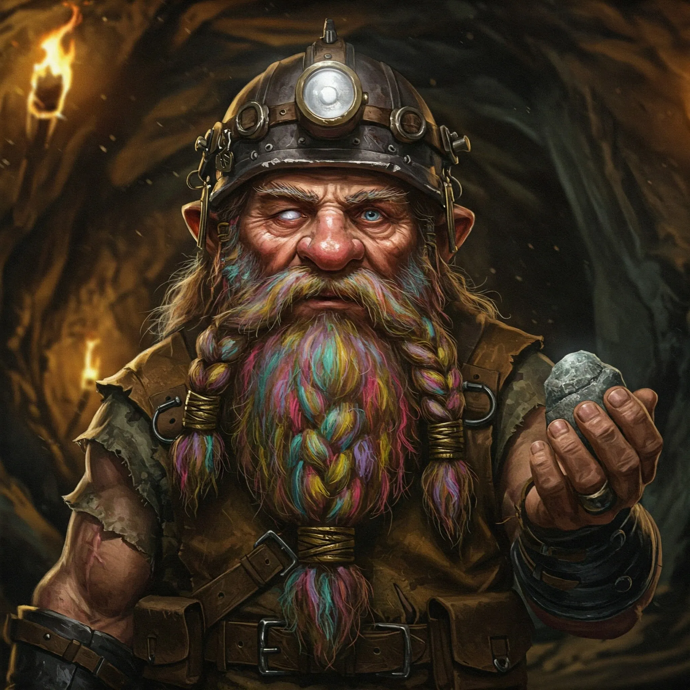

_Krasnolud z plemienia Wieloryba, widzący na jedno oko, mówiący zagadkami._

## Opis
Borinn to krasnolud z jednym okiem, noszący górniczy kask ze śladami uderzenia.

## Osobowość
Mówi zagadkami, jest nieco ekscentryczny i nerwowy, prawdopodobnie na skutek traumy związanej z atakiem smoka. Ma obsesję na punkcie swojego zagubionego kilofa oraz szacunku do żelaza.

## Historia
Był jednym z krasnoludów, którzy przetrwali atak smoczycy [[Ventis]] na [[Kopalnia Żelaza]]. Ukrywał się przed bestią, ostrzegając bohaterów przed jej gniewem. Poprowadził ich do obozu swojego plemienia, a następnie naszkicował plan leża smoka, pomagając w przygotowaniu akcji ratunkowej.
