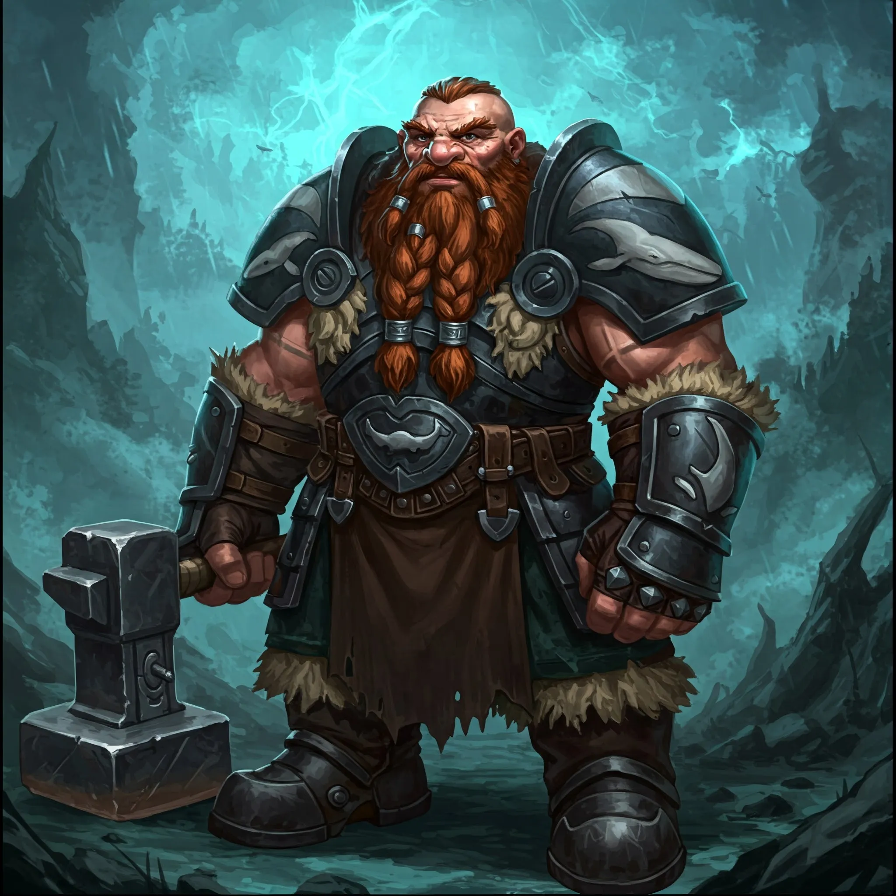

_Zdesperowany przywódca krasnoludów z plemienia Wieloryba._

## Opis
Potężny krasnolud, którego twarz nosi ślady troski i bezsilności.

## Osobowość
Jest odpowiedzialnym przywódcą, ale sytuacja z porwaniem córki złamała go. Został zmuszony do posłuszeństwa wobec smoka, bojąc się o życie swojego dziecka.

## Historia
Gdy [[Ventis]] zaatakowała [[Kopalnia Żelaza|Kopalnię Żelaza]], Delg nie mógł się jej przeciwstawić, ponieważ smoczyca porwała jego córkę, [[Brenna|Brennę]]. Został zmuszony do podporządkowania się woli bestii, dopóki nie przybyli Bohaterowie Przepowiedni, dając mu nadzieję na ratunek.
