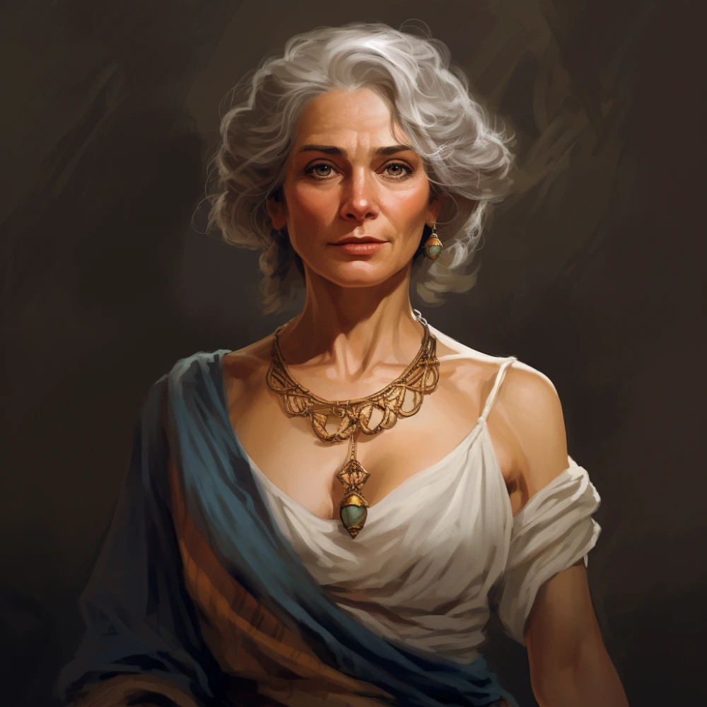

_Matka Króla Acastusa, wygnana na wyspę._

## Opis
Bardzo piękna kobieta w średnim wieku, zadbana mimo trudnych warunków. Nosi się z godnością.

## Osobowość
Manipulantka, politycznie uzdolniona. Dba o pozory, ale bez mrugnięcia okiem poświęciłaby sojusze dla własnej korzyści.

## Historia
Wygnana z Mytros przez szlachtę za zbyt duży wpływ na swojego syna, [[Acastus|Acastusa]]. Na wyspie rywalizuje o wpływy, choć oficjalnie zachowuje dystans. W [[Sesja 46 - Morderca z Wyspy Wygnańców]] opuściła wyspę na pokładzie [[Ultros]]a wraz z bohaterami.

