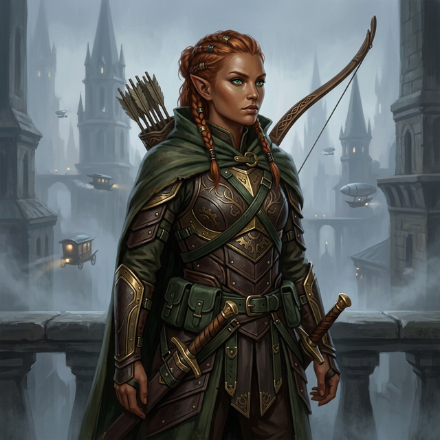

_Wojowniczka z załogi Arevona, pochodząca z Sharn w Eberronie._

## Opis
**Lia Amakiir** to elfka leśna o miedzianej skórze i przenikliwym spojrzeniu zielonych oczu. W przeciwieństwie do wielu swoich pobratymców, wychowała się w metropolii [[Sharn]] (Breland), co nadało jej miejskiego sznytu i praktycznego podejścia do walki. Jako wojowniczka specjalizuje się w walce łukiem oraz szybkimi ostrzami, łącząc elficką grację z bezwzględnością niezbędną do przetrwania na ulicach Miasta Wież.

## Historia
Lia była kluczowym członkiem oryginalnej załogi [[Arevon Elorrenthi|Arevona]] w świecie Eberron, służąc na statku "The Tranquility". Przed dołączeniem do załogi prawdopodobnie krążyła po najniższych poziomach Sharn jako najemniczka lub strażniczka. 

Zaginęła wraz z resztą załogi, gdy statek rozbił się u brzegów [[Thylea|Thylei]]. Jej obecny status był długo nieznany, lecz w [[Sesja 73 - Praxys - Skarbiec Sydona]] została odnaleziona i uwolniona z więzienia w wieży [[Praxys]]. Przekazała Arevonowi informację, że resztki ich statku The Tranquility znajdują się w dokach wieży.
