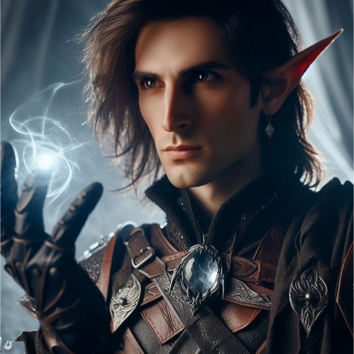

# Arevon Elorrenthi

_Elf Druid, [[Epic Paths#The Seeking One (Poszukujący)|The Seeking One]]_
_**Poszukujący**, który przybył z odległych krain i odnalazał ukryte tajemnice [[Thylea|Thylei]]._

## Historia

Arevon Elorrenthi, elficki druid z domu Phiarlan w Eberron, wychował się pośród wojennych intryg i sztuki, lecz odnalazł powołanie wśród Strażników Lasu i gwiazd. Jako nawigator na statku "The Tranquility" badał granice magicznej mgły Mournlandu, gdy potężny sztorm przeniósł go do innego wymiaru. Rozbił się u wybrzeży mitycznej krainy Thylea, tracąc załogę i wszystko co znał.

Ocalały z katastrofy, Arevon szybko zaadaptował się do nowej rzeczywistości, wykorzystując swoje ocalałe zasoby, by przetrwać w obcym mieście Mytros. Zgłębiając historię i kulturę Thylei, otrzymał niespodziewane wezwanie od Wyroczni, która obiecała odpowiedzi na dręczące go pytania o los jego świata i przyczynę przybycia. Wyruszył więc w podróż, wierząc, że gwiazdy i przeznaczenie wskażą mu drogę powrotną lub nowy cel w tym dziwnym świecie.
