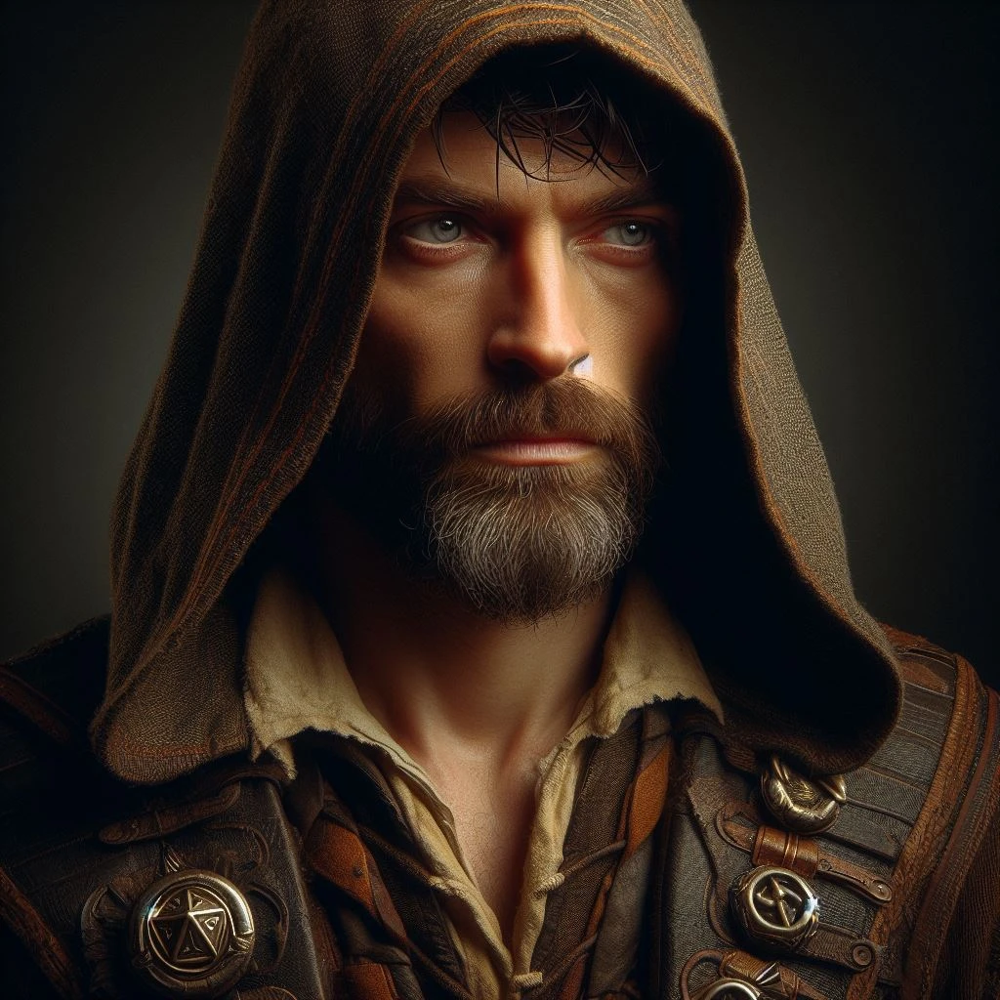

# Felicjan Janus Twardowski

_Human Wizard, [[05-Lore/Epic Paths#The Gifted One (Utalentowany)|The Gifted One]]_
_**Utalentowany**, który odkrył źródło swoich zdolności i doprowadził do odrodzenia Zakonu._

## Historia

Felicjan Janus Twardowski, urodzony w Mytros syn kowala, od najmłodszych lat wykazywał niezwykły talent do nauki i filozofii, co zaprowadziło go do Akademii pod skrzydła samego Epikura. Mimo ukończenia studiów jako najlepszy uczeń, presja i strach przed porażką sprawiły, że porzucił karierę naukową, wracając do rodzinnego warsztatu i marnując swój potencjał na proste życie.

Dopiero po dziesięciu latach, w obliczu nadciągającej wojny i poczucia zmarnowanego losu, Felicjan postanowił przełamać swój strach. Wspierany przez żonę, kapłankę Mytros, oraz pamięć o dawnych ambicjach, zdecydował się w końcu zaryzykować i wykorzystać swój magiczny dar, by stać się bohaterem, jakim zawsze miał być, stawiając czoła przeznaczeniu jako "Obdarowany".
