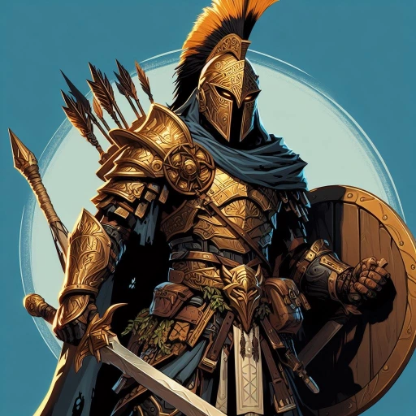

# Orion Xul

_Half-Elf Fighter, [[Epic Paths#The Demi-God (Półbóg)|Demigod]]_
_**Półbóg**, który odnalazł własną matkę i dorównał w boskości swojemu ojcu._

## Historia

Orion Xul, pół-elfi wojownik, dorastał w cieniu tajemnicy swojego pochodzenia, czując w żyłach płynącą boską krew. Jako syn jednego z bogów Piątki, zawsze czuł się wyobcowany wśród zwykłych śmiertelników, a jego nadludzka siła i talent do walki były zarówno darem, jak i ciężarem naznaczającym go od urodzenia.

Gdy Wyrocznia ogłosiła nadejście końca Pokoju, Orion zrozumiał, że jego przeznaczenie jest nierozerwalnie splecione z losami Thylei. Wyruszył w podróż, by dowieść swojej wartości, odkryć pełnię swojego dziedzictwa i stanąć do walki z Tytanami jako prawdziwy półbóg, gotów wstrząsnąć posadami świata, by chronić to, co kocha.
