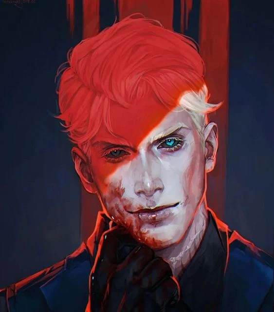

# Versir

_Aasmiar Paladin/Sorcerer, [[05-Lore/Epic Paths#The Timeless One (Ponadczasowy)|The Timeless One]]_
_**Wieczny**, który po stuleciach powrócił do [[Thylea|Thylei]] i odkrył los Zaginionych Tytanów._

## Historia

Versir, aasimar o paladyńskim powołaniu, spędził lata na Wyspie Czasu, szkolony przez Sfinksa do wypełnienia swojej misji przeciwko bliźniaczym tytanom, Sydonowi i Lutherii. Powróciwszy do Thylei, ukrył swą tożsamość, sprzymierzając się z Kultem Węża i Panią Monet, co zmusiło go do współpracy z nieufną Astrą. Ich początkowo szorstka relacja, pełna podejrzeń, zmieniła się podczas pułapki na cmentarzu.

Tam, nad grobem brata Astry ofiarowanego tytanom, wspólna nienawiść do Sydona i Lutherii połączyła ich sojuszem. Versir wyjawił swą naturę pół-tytana i cel zemsty, zyskując wierną przyjaciółkę. Od tego czasu budował swą reputację i wpływy w cieniu, cierpliwie czekając na przepowiedziany przez Sfinksa znak od Wyroczni, by ostatecznie uderzyć w swych odwiecznych wrogów.
