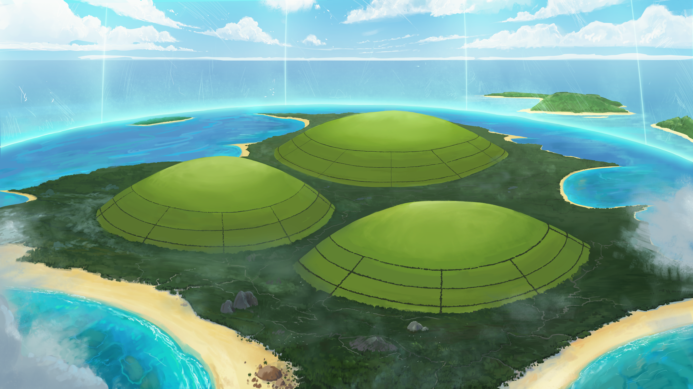

# Wyspa Myrmeków (Titan's Folly / Szaleństwo Tytana)

Dziwna wyspa składająca się z trzech idealnie uformowanych zielonych wzgórz otoczonych niemożliwą szklaną kopułą, która wyrasta z Zatoki Cerulańskiej. Szklana kopuła obejmuje całą wyspę.

## Ciekawe Miejsca
- **Szklana Kopuła (Wall of Dreams)**: Niezniszczalna bariera. Każdy, kto ją zobaczy, ma dziwne sny o przedmiotach, których pragnie najbardziej.
- **Trzy Wzgórza**: Pokryte idealnie ułożonymi polami trzciny cukrowej.
- **Jaskinie**: Pod dębami znajdują się wejścia do sieci jaskiń i tuneli.

## Mieszkańcy
- **[[Myrmeki]]**: Rasa inteligentnych, owadopodobnych humanoidów. Żyją w jaskiniach, gdzie magazynują żywność i chronią swoją królową.

## Historia
Wyspa została zapieczętowana przez Kentimane'a Tysiącrękiego pięć tysiącleci temu. Legendy sugerują, że pierwotna wojna między Tytanami była bezpośrednim wynikiem tego, co się tutaj wydarzyło.
Odkryta przez Bohaterów w [[Sesja 50 - Nawałnica Tytanów i Szepty Yonder]].
