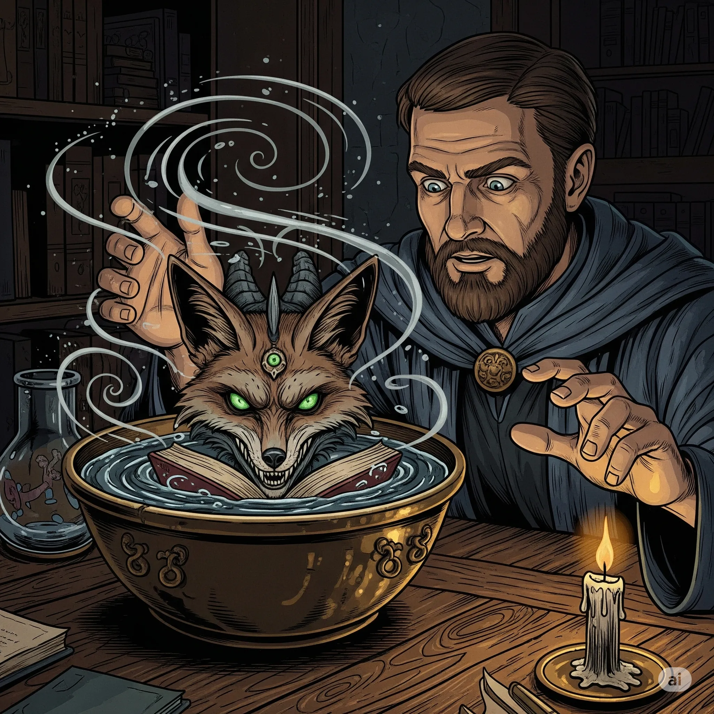

_Misa pozwalająca na komunikację z Kustoszem._

## Opis
Zwykła z wyglądu mosiężna misa. Gdy napełni się ją wodą, ukazuje się w niej twarz [[Kustosz|Kustosza]].

## Historia
Znaleziona w Bibliotece Yonder w [[Sesja 53 - Koniec Yonder]].
