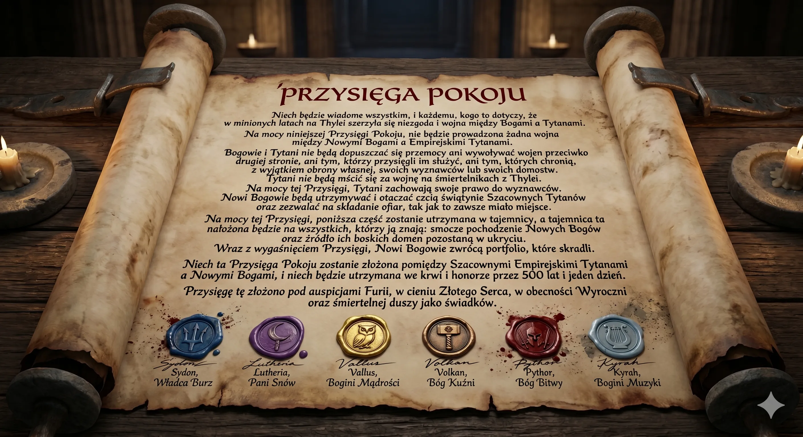

> Niech będzie wiadome wszystkim, i każdemu, kogo to dotyczy, że w minionych latach na Thylei szerzyła się niezgoda i wojna między Bogami a Tytanami.
> 
> Na mocy niniejszej Przysięgi Pokoju, nie będzie prowadzona żadna wojna między Nowymi Bogami a Empirejskimi Tytanami. Bogowie i Tytani nie będą dopuszczać się przemocy ani wywoływać wojen przeciwko drugiej stronie, ani tym, którzy przysięgli im służyć, ani tym, których chronią, z wyjątkiem obrony własnej, swoich wyznawców lub swoich domostw. Tytani nie będą mścić się za wojnę na śmiertelnikach z Thylei.
> 
> Na mocy tej Przysięgi, Tytani zachowają swoje prawo do wyznawców. Nowi Bogowie będą utrzymywać i otaczać czcią świątynie Szacownych Tytanów oraz zezwalać na składanie ofiar, tak jak to zawsze miało miejsce.
> 
> Na mocy tej Przysięgi, poniższa część zostanie utrzymana w tajemnicy, a tajemnica ta nałożona będzie na wszystkich, którzy ją znają: smocze pochodzenie Nowych Bogów oraz źródło ich boskich domen pozostaną w ukryciu. Wraz z wygaśnięciem Przysięgi, Nowi Bogowie zwrócą portfolio, które skradli.
> 
> Niech ta Przysięga Pokoju zostanie złożona pomiędzy Szacownymi Empirejskimi Tytanami a Nowymi Bogami, i niech będzie utrzymana we krwi i honorze przez 500 lat i jeden dzień.
> 
> Przysięgę tę złożono pod auspicjami Furii, w cieniu Złotego Serca, w obecności Wyroczni oraz śmiertelnej duszy jako świadków.

**Sygnatariusze:**

* **Sydon**, Władca Burz
* **Lutheria**, Pani Snów
* **Vallus**, Bogini Mądrości
* **Volkan**, Bóg Kuźni
* **Pythor**, Bóg Bitwy
* **Kyrah**, Bogini Muzyki