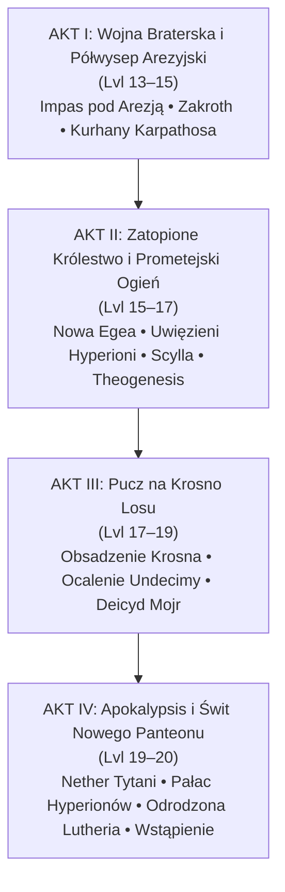

# Wielki Plan Kampanii: Nowa Era (Poziomy 13–20)

Niniejszy dokument stanowi nadrzędną mapę drogową oraz reżyserski przewodnik po **narracyjnym przepływie (*flow*)** kontynuacji kampanii *Odyseja Smoczych Władców*, rozpoczynającej się **piętnaście lat** po [[Sesja 83 - Zmierzch Ery Tytanów|Bitwie o Mytros]] i wydarzeniach z [[Sesja 84 - Świt Nowej Ery|Sesji 84]].

Plan integruje oficjalny materiał z **REMASTERU** (*The New Pantheon*, *The Siege of Aresia*, *The Aresian Peninsula*, *The Sunken Kingdom*, *Apokalypsis*, *Appendix D: The Divine Path*) z autorskimi fundamentami wypracowanymi w [[00 - Założenia Nowej Ery i Filary Świata|Założeniach Nowej Ery]] (deicyd [[Mojry|Mojr]], spisek [[Mistrz Cieni|Mistrza Cieni]], prawda o [[Narsus|Narsusie]] i tragedia [[Undecima|Undecimy/Ione]]).

---

## 1. Architektura Całości: Cztery Akty

Kampania dzieli się na cztery organicznie powiązane ze sobą akty, prowadzące drużynę od lokalnego konfliktu politycznego aż po kosmiczną przebudowę panteonu i praw rządzących światem:

---

## 2. Wizualna Mapa Przepływu (The Narrative Spine)

Każdy etap wynika przyczynowo-skutkowo z poprzedniego — brak sztucznych „szwów” fabularnych:

```mermaid
flowchart TD
    H0["HOOK 0: Kryzys Republiki i Sen Nony\n(Wezwanie Vallus • Impas pod Arezją)"] --> S1["ROZDZIAŁ 1: Otwarcie Bram Arezji\n(Demobilizacja Tarana • Dyplomacja Heleny • Wejście Ione)"]
    
    S1 -->|"Narsus ujawnia rytuał Theogenesis;\nArezyjskie Barrows są zaryglowane"| S2["ROZDZIAŁ 2: Pacyfikacja Półwyspu\n(Fort Zakrotha • Ambrozja • Pakt z Centaurami)"]
    
    S2 -->|"Helena otwiera Barrows w nagrodę za pakt;\nGracze mają Portret Karpathosa"| S3["ROZDZIAŁ 3: Kurhany Karpathosa i Zdrada Cieni\n(Kaduceusz • Nucklowie • Zamach Mistrza Cieni na Helenę)"]
    
    S3 -->|"Mają 2 relikwie; mapa Pyrrhy do 3. relikwii;\nArevon realizuje cel 15 lat; ucieczka przed zamachami"| S4["ROZDZIAŁ 4: Podmorska Odyseja — Nowa Egea\n(Merfolki vs Merrow • Dzielnica Świątynna Hyperionów)"]
    
    S4 -->|"Hyperioni wskazują Scyllę w Chasm;\nUratowanie Phaerosa i Ognia Prometejskiego"| S5["ROZDZIAŁ 5: Rytuał Theogenesis w Arezji\n(Iskra Boska • Kajdany Mojr • Zdemaskowanie 'Hodowli Bogów')"]
    
    S5 -->|"Gracze odkrywają dług Narsusa;\nIone słabnie w pułapce warkocza;\nVersir ujawnia plan puczu"| S6["ROZDZIAŁ 6: Rekrutacja Tkaczek i Przygotowanie Puczu\n(Wiedźma Lotosu • Versi • Dylemat III Kandydatki)"]
    
    S6 -->|"Obsadzenie 3 foteli Krosna;\nRozplecenie warkocza Ione • Ścięcie nici Mojr"| S7["ROZDZIAŁ 7: Deicyd na Wyspie Mojr\n(Kosmiczny Wstrząs • Złamanie Pieczęci Otchłani)"]
    
    S7 -->|"Śmierć Mojr uwalnia Nether Tytanów;\nKamień Apokalipsy aktywowany przez Lutherię"| S8["ROZDZIAŁ 8: Apokalypsis — Obrona Miast Thylei\n(Tarrasque, Kraken, Smok, Behemot • Wojna Totalna)"]
    
    S8 -->|"Pokonanie kolosów otwiera drogę do źródła;\nLokalizacja twierdzy wroga na szczycie"| S9["ROZDZIAŁ 9: Szturm na Pałac Hyperionów\n(Rozbicie sojuszu zdrajców • Dysonans pieśni Orestesa • Zniszczenie Kamienia)"]
    
    S9 -->|"20 Poziom • Czyny Apoteozy spełnione;\nŚwiat wznosi modły do Nowych Imion"| S10["EPILOG: Narodziny Nowego Panteonu\n(Wstąpienie • Nowe Krosno • Otwarcie Thylei na kosmos)"]
```

---

## 3. Szczegółowy Rozkład Aktów, Rozdziałów i Przejść

### AKT I: Wojna Braterska i Półwysep Arezyjski (Poziomy 13–15)
*Materiały źródłowe: Rozdziały 10 i 11 REMASTERU + [[03 - Wojna Mytros-Arezja (Drabina Eskalacji)]], [[04 - Narsus i Droga do Theogenesis]], [[05 - Mistrz Cieni, Kaduceusz i Powrót Lutherii]], [[06 - Undecima (Ione)]], [[07 - Scenariusz Otwarcia (Sesja 85)]].*

Główny cel: Rozbrojenie 3-letniego oblężenia [[Arezja|Arezji]], odkrycie sekretu *Theogenesis*, pacyfikacja półwyspu i zdobycie pierwszych dwóch Boskich Artefaktów.

#### Faza 1: Otwarcie i Rozwiązanie Oblężenia Arezji (Sesje 85–87)
- **Prolog na Wyspie Mojr & Teatr Bogów w Mytros (Sesja 85):**
  - Chłodny prolog przy Krośnie: aroganckie rzemieślniczki losu, brakujące 11. wrzeciono, ciepły wątek 3-letniego oblężenia, zapłata krwią Heleny obiecana przez Mistrza Cieni.
  - [[Vallus]] i Rada Mytros wzywają Bohaterów Przepowiedni — skarbiec republiki jest pusty, prestiż imperialny gnije w błocie, a wieść o sięgnięciu Arezji po boskość paraliżuje stolicę. Mandat: zakończyć wojnę dowolnymi środkami.
  - Sen Nony: przypomnienie obietnicy z [[Sesja 48 - Pakty z Mojrami i Zew Chimery|Sesji 48]] i z pozoru życzliwa wskazówka ułatwiająca pierwsze kroki w Arezji.
- **Wkroczenie do obozu pod Arezją:**
  - Konfrontacja z [[Taran Neurdagon|Taranem Neurdagonem]] (spekulantem wojennym czerpiącym zyski z monopolu dostaw) i brutalnym gladiatorem Maximusem.
  - Odkrycie beznadziei żołnierzy i potęgi *Palladium* (100-metrowe mury niewrażliwe na oblężenie, permanentny *Forbiddance*).
- **Zastosowanie Sprawczości Graczy (Trwałe Zakończenie Oblężenia):**
  - Drużyna wybiera metodę (dyplomacja [[Orestes|Orestesa]], instytucjonalne podatki wojenne [[Felicjan Janus Twardowski|Felicjana]], wyprowadzenie Narsusa lub tajna infiltracja z pomocą szpiega Dimitriosa).
  - **Przełom dyplomatyczny:** Rozwiązanie impasu działa w pełni — Taran traci dowództwo, wojska mytrosańskie rozpoczynają demobilizację, a [[Królowa Helena]] otwiera bramy na rokowania.
- **Wejście Ione (Undecimy):**
  - Córka [[Orion Xul|Oriona]] i [[Nona|Nony]] zjawia się w tawernie [[Ultros|Ultrosa]] lub w obozie. Mówi wprost o swoim pochodzeniu, ostrzega przed wzrokiem matki przez jej oko. Zostaje przygarnięta (przez Oriona lub Orestesa).

#### PRZEJŚCIE 1 ➔ 2: Z Murów Arezji do Dzikich Kniei Półwyspu
* **Zapalnik (*Trigger*):** W podziemnej Chamber of Beauty [[Narsus]] demaskuje propagandę o rzekomej niewoli i wyjawia rytuał **Theogenesis**. Potrzebuje trzech relikwii: Kaduceusza z kurhanów, Ambrozji z fortu Zakrotha i Ognia Prometejskiego.
* **Dlaczego nie idą od razu do Kurhanów?** Kurhany Karpathosa są otoczone przez elitarnych mnichów Yosfora, chronione królewską pieczęcią i rygorystycznym prawem Arezji. [[Królowa Helena]] stawia twardy warunek: *„Jeśli chcecie, bym otworzyła przeklęte grobowce moich przodków, musicie zneutralizować zagrożenie centaurów Zakrotha na północy. Zakroth porywa nasze dzieci i paraliżuje półwysep!”*.
* **Zasiane Poszlaki (*Breadcrumbs*):** W forcie Zakrotha gracze dowiadują się, że charyzma minotaura pochodzi z drugiego artefaktu — **Ambrozji**.
* **Efekt Przejścia:** Ruszając na Zakrotha, gracze nie wykonują „losowego questu pobocznego” — realizują warunek Heleny, ratują syna Agriusa (wdzięczność centaurów) i **od razu zdobywają 1. artefakt (Ambrozję)**!

#### Faza 2 & 3: Fort Zakrotha — Pacyfikacja Półwyspu (Sesje 88–90)
- **Ekspedycja na północ półwyspu:**
  - Przeprawa przez knieje patrolowane przez gigantów i centaury.
  - Odkrycie natury [[Zakroth|Zakrotha]]: dawny niewolnik z Mytros, który dzięki charyzmie z *Ambrozji* zjednoczył wrogie dotąd klany pod sztandarem „Wybrańca Hergerona”.
- **Infiltracja / Szturm Fortu Zakrotha:**
  - Kwestia czterech zakładników (synowie i córki wodzów centaurów, m.in. syn [[Agrius|Agriusa]]).
  - Pokonanie Zakrotha i zdobycie **Ambrozji**.
  - Zabezpieczenie trwałego pokoju na Półwyspie: uwolnienie zakładników i zawarcie paktu między wolnymi plemionami a Arezją/Mytros.

#### PRZEJŚCIE 2 ➔ 3: Z Dzikich Kniei do Mrocznych Kurhanów
* **Zapalnik (*Trigger*):** Zakroth pokonany, Ambrozja zabezpieczona, zakładnicy wolni. Królowa Helena dotrzymuje słowa i wystawia oficjalny edykt zezwalający na wejście do Barrows po **Kaduceusz**.
* **Klucz ze starych lat:** Gracze mają [[Portret Karpathosa]], zakupiony 15 lat wcześniej za 50 000 gp w Galerii Sztuki — jedyny sposób na zniszczenie wampirzego króla.

#### Faza 4: Kurhany Karpathosa i Zdrada Cieni (Sesje 91–93)
- **Zejście do Barrows pod Arezją:**
  - Przełamanie straży mnichów pod wodzą Yosfora z edyktem Heleny.
  - Zniszczenie [[Portret Karpathosa|Portretu Karpathosa]] w K9, co neutralizuje gazową formę wampira.
  - Odnalezienie **Kaduceusza** w sercu grobowca.
- **Trójstronne starcie z tykającym zegarem:**
  - W 10. minucie do grobowca wdzierają się **Nucklowie** (potworne sługi z głębin Otchłani), wybijają pieczęcie i budzą ponad 30 wampirzych pomiotów, próbując przechwycić Kaduceusz dla Lutherii.
  - [[Orestes]] zaczyna mimowolnie rezonować z glifami grobowymi — ujawnia się tajemnica jego zmartwychwstania z Sesji 84 (melodia biesiadna to Hymn Przebudzenia Lutherii).
- **Zasadzka na wyjściu i Kulminacja Aktu I — Morderstwo Królowej Heleny:**
  - Zabójcy [[Mistrz Cieni|Mistrza Cieni]] (Jocasty) atakują wyczerpaną drużynę, by odebrać Kaduceusz.
  - Podczas gdy drużyna walczyła w kurhanach, Mistrz Cieni (Jocasta) przeprowadza zamach na [[Królowa Helena|Królową Helenę]] i ją zabija.
  - **Ujawnienie prawdy:** Śmierć Heleny to nie przypadkowy mord polityczny, lecz **zapłata krwią, którą Mistrz Cieni musiał uiścić Mojrom za wywołanie 15-letniej wojny**. W Arezji wybucha kryzys sukcesyjny, a drużyna staje się jedynym gwarantem ładu.

---

### AKT II: Zatopione Królestwo i Prometejski Ogień (Poziomy 15–17)
*Materiały źródłowe: Rozdział 12 REMASTERU + [[02 - Ścieżka Boskości i Nowy Panteon]], [[04 - Narsus i Droga do Theogenesis]].*

Główny cel: Odnalezienie Zatopionego Królestwa Syren, zgłębienie tragedii anioła Phaerosa, zdobycie Ognia Prometejskiego i przeprowadzenie Theogenesis — połączone z odkryciem śmiertelnej pułapki Mojr.

#### PRZEJŚCIE 3 ➔ 4: Z Płonącej Polityki na Dno Oceanu
* **Zapalnik (*Trigger*):** Drużyna ma 2 z 3 relikwii (Ambrozję i Kaduceusz). W Arezji po zamachu na Helenę wrze. Narsus nalega: *„Potrzebujemy trzeciej relikwii: Ognia Prometejskiego. Bez niego rytuał spali nas na popiół. Pyrrha ma mapę do Zatopionego Królestwa!”*.
* **Osobisty Haczyk (*The Perfect Fit*):**
  * [[Arevon Elorrenthi|Arevon]]: Spełnienie jego 15-letnich poszukiwań. Szukał Zatopionego Królestwa całe downtime — mapa Pyrrhy to zwieńczenie życiowej obsesji.
  * [[Orestes]]: Potrzebuje wypłynąć na morze, by oczyścić głowę z melodii Lutherii rezonującej w murach Arezji.
* **Logistyka:** Wyprawa wymaga magii głębinowej — zaangażowanie Wyroczni [[Versi|Versi]] oraz gildii kupieckiej Akety.

#### Faza 1 & 2: Podmorska Odyseja do Nowej Egei (Sesje 94–98)
- **Zejście na dno Zatoki Cerulańskiej:**
  - Podmorska wyprawa do ruin Nowej Egei (New Aegea).
  - Społeczeństwo Merfolków toczące wojnę z plemionami Merrow.
- **Dzielnica Świątynna i Uwięzieni Bogowie:**
  - Spotkanie z 8 uwięzionymi bóstwami (**Hyperionami** — Kalydessa, Thalakron, Casius itd.).
  - Każde z bóstw przymila się do innego bohatera, obiecując mianowanie go „godnym następcą”.
- **Tragedia Phaerosa — Lustro Versira:**
  - Odkrycie prawdy: tysiące lat temu anioł [[Phaeros]] ukradł *Ogień Prometejski*, by dać śmiertelnikom boskość i obalić tyranię Tytanów. Wzniósł 8 czempionów do boskości.
  - Efekt: Tytani nasłali Scyllę i Kentimane'a, miasto zatonęło, a Lutheria podstępem uwięziła nowych bogów. Tysiąclecia w ciemności wypaczyły ich umysły — są zgorzkniali, żądni zemsty i bezwzględni.
  - *Dla [[Versir|Versira]]:* Ostrzeżenie, że obalenie starych bogów bez absolutnej kontroli nad naturą władzy tworzy nowe potwory. W ruinach spoczywa także uwięziony w kamieniu wuj Versira, [[Goloron Pierwszy]].

#### Faza 3: Otchłań (The Chasm), Scylla i Ogień Prometejski (Sesje 98–100)
- **Zejście w Rów Oceaniczny i Starcie ze Scyllą:**
  - Pokonanie pierwotnej bestii Kentimane'a.
  - Wydobycie z trzewi bestii anioła Phaerosa wraz z **Ogniem Prometejskim**.
  - Dramatyczny wybór: próba uleczenia oszalałego anioła czy skrócenie jego męki.
  - Uwolnienie Ognia zdejmuje pieczęcie z Hyperionów, którzy natychmiast uciekają na powierzchnię, znikając w niebiosach Thylei.

#### PRZEJŚCIE 4 ➔ 5: Z Otchłani Morskiej do Wielkiego Rytuału
* **Zapalnik (*Trigger*):** Komplet Trzech Boskich Artefaktów. Powrót do Arezji na wielki rytuał *Theogenesis* w Chamber of Beauty.

#### Faza 4: Rytuał Theogenesis i Odkrycie Pęt Mojr (Sesje 101–102)
- **Rytuał i Przebudzenie Boskiej Iskry (Divine Spark):**
  - Bohaterowie (poziom 15–16) otrzymują Boską Iskrę (odporności, nieśmiertelność ciała, aura domeny).
  - Narsus odzyskuje pełną boską postać i blask.
- **Wielki Zwrot Akcji — Klauzula Odroczona (*The Trap Revealed*):**
  - Na ciele Narsusa rozżarzają się eteryczne kajdany: *Oath of Service*.
  - Manifestacja Nony i Decimy: nowo narodzony bóg staje się wieczystym niewolnikiem Krosna.
  - Bohaterowie uświadamiają sobie, że każdy, kto wstąpi do boskości tą drogą, staje się marionetką trzech wiedźm.
- **Dramat Undecimy:** Ione słabnie — jej nić jarzy się upiornym blaskiem. Wyjawia, że jej nić jest wpleciona jako czwarte pasmo warkocza samych Mojr.
- **Decyzja drużyny:** Nie ma bezpiecznej boskości w Thylei, dopóki stoi Krosno. Plan Versira staje się jedyną drogą ocalenia.

---

### AKT III: Pucz na Krosno Losu i Przełamanie Fatum (Poziomy 17–19)
*Materiały źródłowe: Rozbudowa autorska — [[00 - Założenia Nowej Ery i Filary Świata]], [[06 - Undecima (Ione)]].*

Główny cel: Przeprowadzenie chirurgicznego uderzenia na Wyspę Mojr, obsadzenie Krosna przez trzy zaufane tkaczki, ocalenie Undecimy/Ione i zgładzenie Nony, Decimy oraz Morty na ich własnym krośnie.

#### PRZEJŚCIE 5 ➔ 6: Z Ofiar w Myśliwych — Przygotowanie Puczu
* **Punkt Wyjścia:** Versir ujawnia swój 15-letni sekret: *„Mojr nie da się zabić mieczem. Giną tylko wtedy, gdy ich nici zostaną odcięte przez zasiadające, prawomocne tkaczki na ich własnym krośnie”*.
* **Zapalnik (*Trigger*):** Wyścig z czasem, by zabezpieczyć trzy kandydatki przed ostatecznym skokiem:
  1. **Fotel I:** [[Wiedźma Lotosu]] (Wyspa Skorpiona) — wynegocjowanie jej lojalności w zamian za wieczyste prawo wglądu w nici czasu.
  2. **Fotel II:** [[Versi]] (Wyrocznia) — córka Sydona zgadza się tkać los z miłosierdziem.
  3. **Fotel III:** **Wielki dylemat moralny drużyny**:
     - [[Astra]]: Rozwiązuje problem starości u boku Versira, staje się bezczasowa, lecz bezpowrotnie traci człowieczeństwo i miłość.
     - [[Lyra]]: Zraniona przez Oriona; trzyma w rękach nożyce do nici Oriona i Ione — test zaufania i przebaczenia.
     - [[Despina]] / [[Hexia]]: Alternatywy z arkanicznym rodowodem.

#### Faza 2 & 3: Skok na Wyspę Mojr — Deicyd i Ocalenie Ione (Sesje 106–109)
- **Operacja „Pucz”:**
  - Wejście do wiecznie deszczowej jaskini pod gygańskimi ruinami.
  - Zaskoczenie arogancji Mojr: wiedźmy widziały ich przyjście, lecz traktowały to jako „kolejną wizytę dłużników”.
  - Błyskawiczny manewr: wprowadzenie trzech kandydatek na fotele tkackie.
- **Konfrontacja przy Smoczym Krośnie:**
  - Nowe tkaczki przejmują kontrolę nad czółenkiem.
  - Precyzyjne rozplecenie warkocza Ione (akt ojcowskiego poświęcenia Oriona i zerwanie dawnego kontraktu za broń).
  - **Przecięcie Nici Losu:** Nożyce idą w ruch. Nici Nony, Decimy i Morty zostają odcięte na ich własnym krośnie. Trzy prastare wiedźmy obracają się w proch.
- **Zapalnik Apokalipsy (*The Domino Effect*):**
  - Śmierć Mojr wywołuje pęknięcie najstarszych pieczęci powstrzymujących pradawne bestie.
  - W ułamku sekundy w Mytros i Otchłani zbiegli z dna morza Hyperioni oraz Świątynia Cieni aktywują **Kamień Apokalipsy (*Apokalypsis Stone*)** i odradzają **[[Lutheria|Lutherię]]**!

---

### AKT IV: Apokalypsis i Świt Nowego Panteonu (Poziomy 19–20)
*Materiały źródłowe: Rozdział 13 REMASTERU + [[02 - Ścieżka Boskości i Nowy Panteon]], [[05 - Mistrz Cieni, Kaduceusz i Powrót Lutherii]].*

Główny cel: Odparcie inwazji czterech Nether Tytanów, ocalenie cywilizacji Thylei, szturm na Pałac Hyperionów, zniszczenie Lutherii i Kamienia Apokalipsy oraz ostateczne Wstąpienie do Boskości.

#### Faza 1 & 2: Zew Zagłady i Obrona Thylei (Sesje 110–115)
- **Przebudzenie Czterech Nether Tytanów:**
  1. **Tarrasque** (maszeruje na Mytros).
  2. **Kraken** (blokuje zatokę i porty).
  3. **Smok Pustki (Nether Dragon)** (pali Estorię).
  4. **Behemot** (równa z ziemią południe, Arezję i osady bohaterów).
- **Mobilizacja Sojuszy (Zamiast mechaniki zagłady 4. miasta):**
  - Drużyna dowodzi połączonymi siłami: Smoczy Lordowie [[Felicjan Janus Twardowski|Felicjana]], falangi Arezji i centaury Zakrotha, flota minotaurów [[Orestes|Orestesa]], zbrojni Estorii pod wodzą [[Orion Xul|Oriona]] i Pythora, siły natury [[Arevon Elorrenthi|Arevona]], anioł Phaeros i amazonki na rhinotitanach.
  - Umiejętny podział sił pozwala ocalić wszystkie stolice z kontrolowanymi stratami.

#### Faza 3: Szturm na Pałac Hyperionów (Sesje 116–118)
- **Bastion na Szczycie Świata:**
  - Twierdza Hyperionów sprzymierzonych z powracającą Lutherią.
  - Przedarcie się przez straże gigantów burzowych i magiczne blokady.
- **Finałowe Starcie z Lutherią:**
  - Lutheria zasilana Kamieniem Apokalipsy. (Jeśli gracze obronili Kaduceusz w Akcie I — Lutheria walczy jako okaleczony cień/sen; jeśli wrogowie go skradli — staje w pełni potęgi fizycznej z regeneracją 100 HP).
  - [[Orestes]] odwraca rytuał: fałszuje Hymn Śmierci swoją piwowarską pieśnią, rozrywając jej arkaniczną więź z Otchłanią.
  - Drużyna niszczy Kamień Apokalipsy i unicestwia Lutherię na zawsze.

#### Faza 4 & Epilog: Spełnienie Apoteozy — Nowy Panteon (Sesje 119–120)
- **Spełnienie Mitycznych Czynów Domenowych (20 Poziom):**
  - Każdy bohater dopełnia swój Czyn Domeny, przezwyciężając życiową traumę (patrz [[02 - Ścieżka Boskości i Nowy Panteon]]).
- **Narodziny Nowych Bogów:**
  - Status bóstwa, cecha o wartości 30, boskie moce.
  - Decyzja: Wstąpienie na niebiosa LUB pozostanie Śmiertelnym Bogiem-Opiekunem stąpającym po ziemi.
  - Otwarcie granic: nowe Krosno w rękach mądrych tkaczek bez długu krwi; [Arevon](file:///home/karpiq/Code/OotD/content/02-People/Bohaterowie/Arevon%20Elorrenthi.md) z Antikytherą otwiera szlak ku gwiazdom i Eberronowi.

---

## 4. Identyfikacja Słabych Punktów i Poprawki REMASTERU

| # | Słaby Punkt w REMASTER | Dlaczego to problem przy stole? | Wdrożone Rozwiązanie / Poprawka |
|---|---|---|---|
| **1** | **Bierność Narsusa jako „zleceniodawcy”** | W podręczniku Narsus to statyczny NPC: „przynieście mi 3 rzeczy, a zrobię rytuał”. Gracze czują się jak kurierzy. | **Suwerenność graczy:** Narsus ma unikalną wiedzę arkaniczną, ale to drużyna dyktuje warunki. Rytuał jest potrzebny przede wszystkim im, by zrównoważyć brak bóstw w Thylei. |
| **2** | **Brak przejścia: Oblężenie → Zatopione Królestwo** | Po wojnie w Arezji drużyna nagle ma nurkować na dno zatoki bez silnej presji czasu. | **Stawka Arevona + Przeciek o Phaerosie:** Arevon szukał tego miejsca 15 lat. Ponadto Ogień Prometejski to jedyny stabilizator grobowego Kaduceusza. |
| **3** | **Motywacja Hyperionów w Rozdziale 13** | Hyperioni po uwolnieniu ze Scylli stają się sługami Lutherii bez wyjaśnienia (to ona ich uwięziła!). | **Wypaczenie przez eony i pakt z Lutherią:** Hyperioni nienawidzą śmiertelników za zapomnienie. Lutheria obiecała im podział Thylei na 8 domen po zmieceniu miast przez Nether Tytany. |
| **4** | **Miejsce Puczu na Mojry w strukturze** | W oficjalnym module Mojry w ogóle nie giną. Wątek Versira mógłby rozbić spójność fabuły. | **Akt III jako most:** Pucz następuje PO odkryciu pułapki Theogenesis (Akt II), a PRZED finałem. Deicyd Mojr łamie pradawne pieczęcie Otchłani, wyzwalając Nether Tytanów w Akcie IV! |
| **5** | **Zagrożenie dewaluacją triumfu z Sesji 82** | Powrót Lutherii z probówki mógłby sprawić wrażenie: „nasze dawne zwycięstwo nic nie znaczyło”. | **Cena powrotu i wariantowość Kaduceusza:** Powrót kosztował 15 lat krwawej wojny, odłamki kosy, zdradę Świątyni Cieni i Kaduceusz. Obrona Kaduceusza odbiera jej fizyczne ciało (patrz [[05 - Mistrz Cieni, Kaduceusz i Powrót Lutherii]]). |
| **6** | **Dylemat zniszczenia miast w Apokalypsis** | Zasada REMASTERU: 4. miasto ginie w 100%. Frustrujące dla graczy budujących krainę przez 15 lat. | **Nagroda za strategiczny podział sił:** Gracze rozdzielają sojuszników (Smoczy Lordowie, hoplici, centaury, flota, Latająca Forteca) — wszystkie miasta mogą przetrwać z kontrolowanymi stratami. |
| **7** | **Los królowej Heleny a stabilność Arezji** | Zabicie Heleny w złym momencie zablokuje dostęp do relikwii. | **Precyzyjny timing:** Mistrz Cieni dokonuje zamachu na Helenę dopiero w finale Aktu I (gdy gracze walczą w Kurhanach). Jej śmierć to spłata długu u Mojr za wywołanie wojny. |

---

## 5. Zestawienie Twardych Zależności (Dlaczego kolejność jest nierozerwalna)

| Odcinek | Co gracz MUSI mieć / wiedzieć z poprzedniego etapu? | Dlaczego nie może pójść gdzie indziej? |
|---|---|---|
| **Półwysep (Zakroth)** | Zgoda Heleny wymaga usunięcia zagrożenia centaurów | Bez pacyfikacji Zakrotha Helena nie wyda edyktu na otwarcie Kurhanów. |
| **Kurhany (Karpathos)** | Edykt Heleny + Portret Karpathosa kupiony w Galerii 15 lat wcześniej | Bez portretu wampir ma regenerację i postać gazową; bez edyktu mnisi Yosfora walczą na śmierć. |
| **Zatopione Królestwo** | Mapa od Pyrrhy (z Arezji) + potrzeba 3. artefaktu do Theogenesis | Bez mapy nikt nie zna koordynatów Nowej Egei; bez Ognia Prometejskiego rytuał boskości spali duszę. |
| **Pucz na Mojry** | Odkrycie pęt Narsusa (*The Trap*) + cierpienie Ione | Wcześniej drużyna nie ma powodu ryzykować kosmicznego puczu; dopiero widok niewolnictwa Narsusa daje mandat. |
| **Apokalypsis** | Śmierć Mojr łamie pradawne pieczęcie Kentimane'a | Potwory nie budzą się z przypadku — to metafizyczna konsekwencja deicydu i ingerencji Kamienia Apokalipsy. |
| **Pałac Hyperionów** | Hyperioni uciekli z dna morza w Akcie II | Złoczyńcy w finale to te same twarze, z którymi gracze rozmawiali na dnie oceanu — koło zdrady się domyka. |

---

## 6. Matryca Wątków Osobistych Bohaterów

```mermaid
classDiagram
    class Versir {
        Akt I: Negocjacje z Arezją, badanie Świątyni Cieni
        Akt II: Ostrzeżenie Phaerosa (lustro własnych ambicji)
        Akt III: Główny architekt puczu na Krosno i deicydu Mojr
        Akt IV: Zrównoważenie sił boskich i wstąpienie
    }
    class Orion_Xul {
        Akt I: Spotkanie z Undecimą (Ione), dylemat ojcostwa
        Akt II: Test męstwa w Zatopionym Królestwie
        Akt III: Rozplecenie warkocza córki, odkupienie długu wobec Nony
        Akt IV: Ochrona miast, konfrontacja z dziedzictwem Pythora
    }
    class Felicjan {
        Akt I: Równoważenie imperializmu Mytros, podatki wojenne
        Akt II: Badanie arkanów Theogenesis i natury Boskiej Iskry
        Akt III: Odzyskanie pełnego zdrowia z rąk Krosna, wsparcie arkaniczne
        Akt IV: Dowodzenie Zakonem Smoczych Lordów w wojnie powietrznej
    }
    class Orestes {
        Akt I: Most handlowy między Mytros i Arezją, patronat nad Ione
        Akt II: Walka z bestiami głębinowymi, rezonans pieśni
        Akt III: Rozliczenie z obietnicą Nony ze snów
        Akt IV: Sfałszowanie Hymnu Przebudzenia, zerwanie więzi Lutherii
    }
    class Arevon {
        Akt I: Zabezpieczenie dróg rzecznych i natury półwyspu
        Akt II: Spełnienie 15-letniej obsesji: Zatopione Królestwo
        Akt III: Odzyskanie utraconej szybkości z Krosna Mojr
        Akt IV: Obrona ziemi przed Behemotem i otwarcie wrót do Eberronu
    }
```

---

## 7. Praktyczna Ściągawka dla MG przy Stole

| Faza Kampanii | Główne Pytanie Graczy (*Dramatic Question*) | Co pcha ich do przodu (*Driver*) | Jakie poszlaki zasiać w tle (*Foreshadowing*) |
|---|---|---|---|
| **Akt I (Arezja)** | *„Jak zakończyć tę wojnę bez rzezi i kim jest Ione?”* | Widmo bankructwa Mytros i bezsensownej śmierci żołnierzy | Dziwne szepty mnichów cienia o „Królowej Snów”; mapa Pyrrhy |
| **Akt II (Morze)** | *„Co kryje się na dnie i dlaczego Phaeros oszalał?”* | Potrzeba 3. relikwii do rytuału boskości; obsesja Arevona | Ostrzeżenia Phaerosa: *„Nie bierzcie korony, jeśli nie znacie ceny Krosna!”* |
| **Akt III (Pucz)** | *„Jak ściąć wiedźmy i ocalić Ione, nie niszcząc świata?”* | Odkrycie, że Theogenesis to niewolnictwo u Mojr; pęta Narsusa | Niestabilność pieczęci w miarę osłabiania Krosna; koszmary o gigantach |
| **Akt IV (Zagłada)** | *„Które miasta ocalimy i jak zniszczyć źródło zła?”* | Cztery Nether Tytany maszerujące na stolice; zew przetrwania | Pieśń Orestesa jarząca się na Kamieniu Apokalipsy — klucz do kontrataku |
