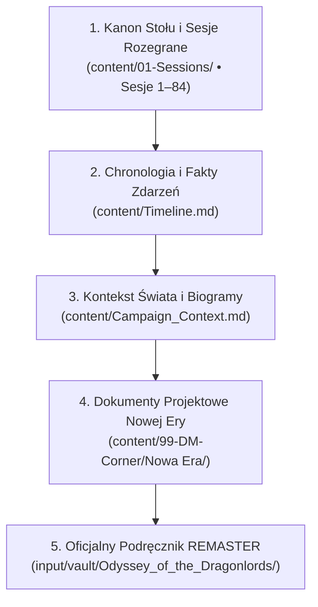

# 01 - Świat, Historia i Kanon Nowej Ery

Kompleksowe kompendium tła świata, chronologii 15 lat downtime'u, mechanizmów eskalacji wojny oraz zestawienia autorskiego kanonu kampanii z oficjalnym podręcznikiem *Odyssey of the Dragonlords (REMASTER)*.

---

# CZĘŚĆ I: Założenia Nowej Ery, Filary i Decyzje Kanoniczne

Notatki mistrza gry do kolejnego etapu kampanii *Odyseja Smoczych Władców*, rozpoczynającego się **piętnaście lat** po [[Sesja 83 - Zmierzch Ery Tytanów|Bitwie o Mytros]] i wydarzeniach z [[Sesja 84 - Świt Nowej Ery|Sesji 84]].

Materiał źródłowy: rozdziały REMASTERU *The New Pantheon*, *The Siege of Aresia*, *The Aresian Peninsula*, *The Sunken Kingdom*, *Apokalypsis* oraz *Appendix D: The Divine Path* — zaadaptowane i ustrukturyzowane pod historię drużyny.

---

## 1. Decyzje Kanoniczne

1. **Przeskok wynosi piętnaście lat.** Epilog gracza [[Versir|Versira]] wspominał o dziesięciu — kanonem kampanii jest [[Sesja 84 - Świt Nowej Ery|Sesja 84]], czyli dokładnie piętnaście lat. Wszystkie daty w tych notatkach liczą się od Bitwy o Mytros (rok 0).
2. **[[Mojry]] żyją i mają się dobrze.** Ich krosno pracuje bez przerwy. Nie są neutralnymi obserwatorkami — wiki opisuje je wprost: *„Mojry są uważane za całkowicie złe, ale dają wgląd w przyszłość.”* Prowadzą kosmiczną lichwę losu.
3. **[[Versir]] chce je zabić i zastąpić.** Nie chodzi o obsadzenie wakatu, tylko o chirurgiczny deicyd i wprowadzenie na ich fotele trzech zaufanych tkaczek. To jest oś spinająca całą drugą połowę kampanii.
4. **Mistrz Cieni kupił wojnę od Mojr.** Zrobił to, aby wywołać wieloletnie żniwo krwi i cierpienia potrzebne do obudzenia [[Lutheria|Lutherii]] oraz sparaliżować Thyleę przed wyłonieniem Nowego Panteonu. Zapłacił Mojrom *Traktatem o Prawach i Zobowiązaniach Krwi* ze skarbca Sydona oraz zobowiązaniem do zamordowania [[Królowa Helena|królowej Heleny]]. Nikt w świecie nie podejrzewa intrygi — wojna wygląda w 100% jak naturalny konflikt polityczno-gospodarczy.
5. **Bohaterowie mediowali w ciągu 15 lat (downtime) i im się udawało.** Trzykrotnie doprowadzili do rozejmu. Za każdym razem pokój rozpadał się z powodu drobnych anomalii fatum, których nie dało się przewidzieć ani nikomu przypisać. **Od Sesji 85 gracze wkraczają do gry z pełną sprawczością (agency)** — ich czyny przynoszą trwałe, nienaruszalne skutki.
6. **Poziom drużyny na start:** **13** (rozwój do poziomu 20 w toku 4 Aktów).
7. **[[Portret Karpathosa]]:** Zakupiony przez drużynę 15 lat wcześniej za 50 000 gp w Arezji (`Timeline.md`, Sesje 62–63). Spoczywa bezpiecznie w prywatnej kajucie [[Orestes|Orestesa]] na pokładzie tawerny-muzeum [[Ultros]] w porcie [[Mytros]].
8. **[[Kolos Pythora]]:** Stoi nienaruszony w porcie Mytros jako dumny monument obronny i odstraszacz. Senat kategorycznie zabrania wysyłania go pod Arezję w obawie przed ogołoceniem stolicy, lecz w Akcie IV drużyna może go obsadzić i poprowadzić przeciw [[Tarrasque|Tarrasque'owi]].

---

## 2. Trzy Połączone Tory Intrygi

| Tor | Kto | Cel | Co wie / Jaki Pakt |
|---|---|---|---|
| **Krosno** | [[Mojry]] vs [[Versir]] | Mojry hodują zadłużonych bogów; Versir chce dokonać deicydu za śmierć matki ([[Versi Pierwsza|Versi Pierwszej]]) i wspieranie Tytanów | Mojry widzą go na Krośnie, ale ignorują go z boską arogancją |
| **Boskość** | [[Narsus]], [[Taran Neurdagon]], Rada [[Mytros]], [[Królowa Helena]] | Wyniesienie śmiertelnika do boskości; Narsus ma wiedzę o *Theogenesis* | Narsus kupił wiedzę od Mojr za *Oath of Service*, bagatelizuje ten dług z próżności |
| **Powrót Lutherii** | [[Mistrz Cieni]] | Odrodzenie [[Lutheria|Lutherii]] z Otchłani poprzez żniwo wojny, odłamki kosy, rytuał i Kaduceusz | Kupił wojnę od Mojr za Traktat ze skarbca Sydona i zobowiązanie do zabicia Heleny |

Wszystkie trzy tory zbiegają się w [[Arezja|Arezji]], bo tam leżą wszystkie potrzebne elementy: Narsus, Kaduceusz w grobowcu Karpathosa, wojna zasilająca uśpioną Lutherię i oblężenie paraliżujące całą krainę.

---

## 3. Motywacja Versira: Deicyd za Matkę i Zdradę Przeznaczenia

Versir nie poluje na Mojry z pychy; jego motywacja jest głęboko osobista i polityczna:
1. **Zbrodnia przeciw Versi Pierwszej:** Mojry aktywnie wspierały Tytanów w Pierwszej Wojnie i to one uknuły spisek oraz pomogły [[Lutheria|Lutherii]] w zamordowaniu matki Versira — dawnej wyroczni, Versi Pierwszej.
2. **Kłamstwo Przeznaczenia:** W [[Sesja 47 - Wyspa Mojr|Sesji 47]] Mojry pokazały Versirowi wizję jego śmierci z rąk Lutherii. Nie stało się tak — Lutheria padła z ręki [[Orestes|Orestesa]]. Versir przekonał się na własne oczy, że Mojry nie są nieomylnymi strażniczkami losu, lecz wyrachowanymi oszustkami.
3. **Versir ma normalną nić na Krośnie:** Mojry widzą go doskonale, lecz patrzą na niego z **kosmiczną arogancją** — dla nich jest tylko kolejnym śmiertelnikiem miotającym się w tkaninie. Ta arogancja to jedyna przewaga Versira.

### Czego Mojry nie mogą (Zasada Deicydu)
Nie da się ich zabić mieczem ani magią — ścięte, natychmiast odtwarzają się przy krośnie. Giną wyłącznie wtedy, gdy **ich własne nici zostaną przecięte na ich własnym krośnie**, a to potrafi tylko zasiadająca, prawomocna tkaczka.  
Konsekwencja: **Versir musi najpierw przygotować trzy następczynie, a dopiero potem dokonać skoku.**

### Trzy Miejsca przy Krośnie
| Miejsce | Kandydatka | Status | Haczyk |
|---|---|---|---|
| **I** | [[Wiedźma Lotosu]] | wstępnie zgodziła się lata temu | Sfinks wygnany z [[Wyspa Czasu|Wyspy Czasu]]. Za co ją wygnano i jakich tajemnic szuka? |
| **II** | [[Versi]] (Wyrocznia) | propozycja z Sesji 84 | Mojry żądały jej jako daniny w Sesji 47. Czy wejście na fotel to triumf, czy spełnienie ich dawnego żądania? |
| **III** | **Do decyzji graczy** | wakat | Kandydatki: [[Astra]] (staje się bezczasowa, ale traci człowieczeństwo i miłość do Versira), [[Lyra]] (trzyma nożyce do losu Oriona i Ione), [[Despina]], [[Hexia]]. |

*Uwaga: [[Undecima|Undecima (Ione)]] NIE zajmuje fotela przy Krośnie — jej ocalenie i rozplecenie jej warkocza przed ścięciem Mojr to główny cel ratunkowy całego puczu (patrz [[04 - Dramatis Personae (Postacie i Frakcje)#7. Undecima / Ione Xul — Córka Oriona i Nony|Undecima (Ione)]]).*

---

## 4. Droga do Boskości i Przestroga Phaerosa

Mechanika z *Appendix D* (poziom 20 + Boska Iskra z *Theogenesis* + Czyn Domenowy) zostaje zrekonstruowana fabularnie:
- **Mojry prowadzą aukcję:** Tylko one wiedziały, jak sięgnąć po puste domeny.
- **Mojry hodują zadłużonych bogów:** Każdy bóg wstępujący tą drogą trafia na Olimp spętany *Przysięgą Służby (Oath of Service)*. Dług egzekwuje się od istoty, która nie może umrzeć.
- **Versir chce spalić dom aukcyjny:** Dopiero pucz na Wyspie Mojr uwalnia nowo powstający panteon od wiecznego długu.
- **Żywe ostrzeżenie — [[Phaeros]]:** Anioł strącony z niebios za to, że dał śmiertelnikom Ogień Prometejski. Wyniósł ośmioro czempionów do boskości — efektem było ośmioro uwięzionych, zgorzkniałych Hyperionów i zatopienie miasta przez Kentimane'a. Czeka na dnie Zatoki Cerulańskiej w [[Królestwo Syren|Zatopionym Królestwie Syren]] — tam, gdzie [[Arevon Elorrenthi|Arevon]] szukał przez 15 lat, i tam, gdzie uwięziony w kamieniu spoczywa wuj Versira, [[Goloron Pierwszy]].

---

## 5. Stawka dla Całej Drużyny

Jeśli Mojry zginą, co stanie się z ich dawnymi transakcjami?
- połową leczenia [[Felicjan Janus Twardowski|Felicjana]] (poświęconą w Sesji 48 za ulepszenie korony i smocze jaja),
- szybkością [[Arevon Elorrenthi|Arevona]] (oddaną w Sesji 48),
- losem dziecka [[Orion Xul|Oriona]] (Ione)?

Versir nie potrafi odpowiedzieć z góry. To sprawia, że deicyd Mojr nie jest prywatnym projektem jednego gracza, lecz **wspólną, moralną decyzją całej drużyny**.  
Jedyne otwarte, niezrealizowane zobowiązanie Mojr wobec drużyny to obietnica [[Nona|Nony]] wobec [[Orestes|Orestesa]] z Sesji 48 (*„Odwiedzimy cię jeszcze w twoich snach”*). Wiedźmy nie spieszą się ze spłatą — ich cierpliwość liczy się w stuleciach, a dług wisi w sferze fatum jako uśpione ostrzeżenie.

---

## 6. Rozstrzygnięte Węzły Fabularne
 
 1. **Wybór III Kandydatki:** Wybór w 100% należy do decyzji graczy przy stole. Przygotowane zostaną sceny prezentujące dylemat między [[Astra|Astrą]] (tragedia miłosna Versira — wieczność za cenę utraty człowieczeństwa i miłości), [[Lyra|Lyrą]] (konfrontacja z winą Oriona i próba przebaczenia; nożyce do losu Oriona i Ione) a pretendentkami arkanicznymi ([[Despina]], [[Hexia]]).
 2. **Zamach na Helenę i Mandat Arezji:** Mistrz Cieni (Jocasta) przeprowadza zamach na królową Helenę w pałacu, gdy gracze toczą bój w Kurhanach. Zabójczyni nie zostawia ciała do prostego wskrzeszenia za pomocą [[Kaduceusz|Kaduceusza]] — wycina jej serce/krew jako uiszczenie kontraktu z Mojrami i ofiarę dla Lutherii. Gracze docierają na ostatnie tchnienie monarchini, odbierając jej polityczny testament. Powołana natychmiast Rada Regencyjna ([[Taureus]] i [[Halcyon]]) oficjalnie zleca herosom zdobycie Ognia Prometejskiego, by dokończyć Theogenesis i ocalić osieroconą Arezję.

---

# CZĘŚĆ II: Wojna Mytros–Arezja — Drabina Eskalacji (15 Lat Impasu)

Wojnę od [[Mojry|Mojr]] kupił **[[Mistrz Cieni]]**. Potrzebował wieloletniego żniwa krwi, rozpaczy i śmierci, by obudzić uśpioną w Otchłani [[Lutheria|Lutherię]] oraz sparaliżować Thyleę przed jej powrotem.

**Żaden bohater, żaden NPC i żaden gracz nie podejrzewa, że ktokolwiek za tym stoi.** Wojna wygląda w 100% jak naturalny konflikt polityczno-gospodarczy.

---

## 1. Zasada Projektowa Drabiny

Każde wydarzenie ma **kompletne, naturalne wyjaśnienie polityczne lub materialne**, które wszyscy przyjmują bez zastrzeżeń — i **niewidzialną ingerencję Mojr**, która podcina każdy kompromis:

- **Bohaterowie są poza polityczną machiną:** W toku 15 lat (downtime) bohaterowie świadomie odsunęli się od partykularnych wojen i polityki dworskiej. Mediacje i traktaty prowadzili **śmiertelni politycy, instytucje i frakcje** (Rada Mytros, Królowa Vallus, Królowa Helena, Gildia Akety, posłowie z Estorii i Xanderii).
- **Strony przeplatają się:** Nigdy dwa razy z rzędu ta sama strona nie jest winna.
- **Przyczyny przeplatają się:** Po pogodzie idzie polityka, po polityce głupota, po głupocie zaraza, po zarazie religia. Powtórzony schemat zdradziłby autora.
- **Wielopoziomowa ingerencja Mojr:** Kowen nie rzuca gromów. Nona, Decima i Morta manipulują splotem: podsuwają zarodniki sporyszu, napinają tektonikę pod kopalniami, przesuwają prądy morskie, dociągają nici w chwilach gniewu śmiertelników. Każdy traktat podpisany przez ludzi działa logicznie, dopóki niewidzialny węzeł fatum nie doprowadzi do katastrofy.
- **Nigdy nie ma winnego do znalezienia:** Kiedy gracze zaczną badać źródła wojny, znajdą [[Taran Neurdagon|Tarana]] — chciwego oligarchę, spekulanta i jastrzębia wojennego, który jest w 100% niewinny kosmicznego spisku Mojr i służy jako idealna zasłona dymna.
- **Theogenesis to nie powód wojny, lecz punkt zwrotny w roku 15:** Wojna i 3-letnie oblężenie wybuchły z przyczyn czysto doczesnych (cła, spory graniczne, zaraza koni, ambicje Tarana). Sekret Theogenesis wycieka **dopiero w roku 15**, zamieniając lokalny impas w kosmiczne zagrożenie i dając Królowej Vallus powód, by wezwać herosów Tytanomachii.

---

## 2. Drabina Eskalacyjna (15 Lat)

| Rok | Wydarzenie | Wyjaśnienie doczesne (oficjalne) | Niewidzialna Ingerencja Mojr (Mechanizm Fatum) |
|---|---|---|---|
| 1 | Mytros wypłaca odszkodowania rodzinom 1200 poległych Arezyjczyków z Bitwy o Mytros. Ceremonia, pomnik, dobre słowa. | Poczucie wspólnoty po ocaleniu świata przed Tytanami. | — |
| 2 | Wspólna ekspedycja floty Mytros i Arezji przeciw piratom na [[Zatoka Cerulańska|Zatoce Cerulańskiej]]. Sukces. Oficerowie obu miast piją razem. | Likwidacja wspólnego zagrożenia handlowego. | — |
| 3 | Cena żelaza z [[Wyspa Indygo|Wyspy Indygo]] skacze o 50%. | Krasnoludy fedrowały głęboko poniżej dna morza w poszukiwaniu nowych żył. | **Decima napina nić tektoniczną:** Tąpnięcie podmorskiego uskoku zalewa trzy połączone sztolnie w jednym tygodniu, odcinając złoża. |
| 4 | Arezja podnosi cła na przeprawie przez [[Rzeka Thrake|Thrake]]. | Odwet handlowy na drożejące narzędzia z Mytros, w pełni legalny w prawie Thylei. | — |
| 4 | Umiera stary poseł arezyjski w Mytros, jedyny dyplomata szanowany przez obie rady. | Wiek (miał ponad 80 lat). | **Morta przecina nić o 3 lata za wcześnie:** Nowym posłem zostaje bezkompromisowy jastrząb ze stronnictwa [[Taureus|Taureusa]], gardzący republiką. |
| 5 | Zima bez zimy — sześć tygodni nieustających sztormów na Zatoce Cerulańskiej. | Anomalia pogodowa. Mytros wysyła ciężkie transportowce mimo sztormów, by ratować zaopatrzenie. | **Decima zaciska węzeł fal:** Trzy floty handlowe Mytros idą na dno. Arezja odmawia obniżenia ceł lądowych dla poszkodowanych kupców. |
| 6 | **Traktat Piwno-Zbożowy (Rozejm I):** Negocjacje Gildii Akety i Rady Seniorów Arezji przy mediacji posłów królowej [[Anora|Anory]] z [[Estoria|Estorii]]. Napięcie opada na dwa lata. | Wspólny interes handlowy: stabilizacja cen żywności i wymiana towarowa. | **Nona wstrzymuje czółenko:** Pozwala rozejmowi okrzepnąć, by uśpić czujność instytucji, szykując czarne pasmo piołunu. |
| 7 | Centaury [[Zakroth|Zakrotha]] najeżdżają i palą arezyjskie osady. [[Królowa Helena]] śle pilne poselstwo do Mytros z prośbą o posiłki. Mytros nie odpowiada. | Prośba nigdy nie dotarła — poseł przepadł bez wieści. W Mytros nikt nie wie o tragedii. | **Nona zawiązuje kurzawkę:** Zmęczony koń posła wpada w ruchome piaski na brodzie rzeki Thrake. Ciężki kirys wciąga kuriera w muł; zwój ginie w nurcie. |
| 7 | Arezja uznaje brak odpowiedzi Mytros za celową zdradę sojuszu z czasów Tytanomachii. Rozpoczyna się cichy rewanżyzm. | — | — |
| 8 | **Traktat o Rudzie i Granicy (Rozejm II):** Mieszany Trybunał Rozjemczy (arcykapłani i sędziowie obu miast) wypracowuje kompromis w sprawie kontyngentów żelaza. | Instytucjonalne prawo republiki i autorytet dawnych traktatów. | — |
| 9 | Arezyjski mistrz szkoły Miecza ginie w tawernie w Mytros w pijackiej bójce z najemnikiem [[Taran Neurdagon|Tarana Neurdagona]]. Sprawcę powieszono, lecz wybucha skandal dyplomatyczny. | Pijacka awantura weteranów. Sprawca był jednak powiązany z patrycjuszami finansującymi jastrzębie. | **Nona podsyca afekt:** Drobny spór o kości do gry zamienia się w krwawą jatkę; arezyjski honor nie pozwala puścić morderstwa płazem. |
| 9 | **Zaraza w stadninach Arezji:** Ginie ponad połowa koni bojowych. Arezja oskarża Mytros o użycie trucizny biologicznej. | Sporysz (ergotyzm) ze spleśniałego ziarna kupionego w spichlerzach Mytros. | **Morta kieruje pleśń:** Zarodniki sporyszu zaatakowały wyłącznie worki przeznaczone dla arezyjskich stajni wojskowych. |
| 10 | **Sprawa [[Ekoh]] i kryzys obyczajowo-religijny:** Oreada Ekoh przybywa do Mytros, oskarżając dwór w Arezji o bezprawne więzienie kultu [[Narsus|Narsusa]] i obrazę bogów. Jastrzębie w Senacie zyskują pretekst moralny. | Skandal obyczajowo-religijny. Nikt nie idzie na wojnę z powodu nimfy, lecz powstaje trwały, publiczny zarzut przeciw bezbożności Arezji. | [[Vallus]] próbuje łagodzić spór, lecz zarzut „niewolenia boga przez zepsuty dwór Heleny” rozpala nastroje ludu w Mytros. |
| 10 | Susza na Półwyspie Arezyjskim. Głód w trzech okręgach. Poselstwo Heleny do [[Estoria|Estorii]] spóźnia się o jeden dzień; Estoria podpisuje kontrakt na wyłączność z Mytros. | Po utracie koni posłowie szli pieszo. | **Decima opóźnia marsz:** Niewidzialne skręcenia kostek i osuwiska skalne sprawiają, że posłowie stają przed bramą Estorii dzień po podpisaniu paktu. |
| 11 | Zdesperowana Arezja próbuje użyć klanów [[Zakroth|Zakrotha]] jako siły buforowej na szlakach handlowych, lecz wódz centaurów zrywa się z uwięzi i łupi wszystkich. | Polityczna desperacja Heleny i brak wojsk polowych. | — |
| 11 | W Senacie Mytros podnoszą się głosy o „ostatecznym spacyfikowaniu arezyjskiej pychy”. Królowa [[Vallus]] z trudem blokuje wojnę. | Narastający nacisk opinii publicznej i kupców tracących towary. | — |
| 12 | **WYBUCH WOJNY: WIELKA WYPRAWA I PIERWSZE OBLĘŻENIE:** Senat Mytros ulega jastrzębiom. [[Taran Neurdagon]] finansuje wielką armię i flotę w zamian za naczelne dowództwo. | Spór o bezpieczeństwo granic, cła, sprawę Ekoh i chęć rzucenia Arezji na kolana. Zwykła wojna imperialna. | **Decima uderza szkwałem:** Flota Tarana rozbija się o skały przy lądowaniu. Desant pod stumetrowym Palladium Arezji zamienia się w rzeź — tysiące Mytrosan giną lub idą w niewolę. |
| 12/13 | **Rozejm III (Kruche Zawieszenie Broni):** Wykrwawione armie podpisują rozejm i wymianę jeńców dzięki mediacji arcykapłanów Świątyni Mytros i posłów z neutralnej [[Xanderia|Xanderii]]. | Szok po skali strat i wyczerpanie rezerw obu miast. Pokój trzyma przez niemal rok. | **Mojry czekają na właściwy zapalnik:** Taran zza kulis podkopuje rozejm, by nie stracić włożonego złota. |
| 13 | **Incydent Graniczny:** Młody patrol [[Smoczy Lordowie|Zakonu]] (rekruci bez udziału bohaterów) patrolujący granicę atakuje arezyjski oddział graniczny. Rozejm pęka bezpowrotnie. | Młoda smoczyca zaatakowała odruchowo, spłoszona nagłym rozbłyskiem. Jeździec stanął przed sądem, lecz Arezja nie wierzy w wypadek. | **Nona manipuluje światłem:** Nienaturalne odbicie słońca w tarczy arezyjskiego strażnika trafia w oko młodej bestii, wyzwalając paniczny ziew ognia. |
| 13 | Xanderia i miasta wybrzeża stają po stronie Arezji w obawie przed imperializmem Mytros. Rozpoczyna się **Drugie Oblężenie Arezji** — wojna totalna na wyniszczenie. | Równowaga sił na kontynencie; strach przed dominacją Mytros. | Taran Neurdagon rozbija warowny obóz pod murami Arezji. |
| 14 | Ostatnia próba mediacji: okręt poselski z Xanderii próbuje wpłynąć do zatoki z warunkami pokoju, lecz przepada bez wieści. Obie strony oskarżają się o skrytobójstwo. | Prądy w cieśninie zdziczały po śmierci Sydona; okręt omijał blokadę i wpadł w wir Charybdy. | **Decima zaciska pętlę toni:** Trzecia z rzędu misja pokojowa ginie w falach. Wszystkie mosty dyplomatyczne zostają spalone. |
| **15** | **IMPUS I POCZĄTEK NOWEJ ERY:** Drugie oblężenie trwa trzeci rok. Armia Mytros gnije w błocie, Taran spekuluje na dostawach, a Arezja tkwi za niezdobytym Palladium. **I WŁAŚNIE TERAZ WYBUCHA BOMBA: THEOGENESIS!** | Trzyletni impas polityczno-wojenny doprowadził skarbce obu miast do ruiny. | **Wyciek Theogenesis:** Z pałacu w Arezji dociera dowód, że dwór i Narsus posiedli formułę kreacji boga i szykują rytuał! To ten moment wywraca stolik — Królowa Vallus wzywa Bohaterów Przepowiedni! |

---

## 3. Logistyka 3-letniego Oblężenia

- **Dlaczego obóz Tarana trwa 3 lata?** Taran Neurdagon jest nie tylko dowódcą, ale i **głównym spekulantem wojennym**. Zmonopolizował transport morski, dostawy sucharów, solonego mięsa i oliwy z Mytros. Każdy miesiąc impasu to dla niego potężny zysk z kasy miejskiej, a skarbiec Mytros jest pustoszony. Woda pochodzi ze studni polowych na skraju lasu (rzeka Thrake jest zanieczyszczona ściekami z miasta).
- **Dlaczego Arezja nie przeprowadza wypadów za mury?** Arezja cierpi na traumę demograficzną (brak rezerw po 1200 poległych w Bitwie o Mytros i zarazie koni). Za stumetrowym murem chronionym przez *Palladium* miasto jest w 100% bezpieczne. Zamiast ryzykować ludzi w polu, Helena wystawia mistrzów do rytualnych pojedynków przed bramą, niszcząc morale najeźdźców.
- **Dlaczego Mytros tolerowało impas przez 3 lata?** Pułapka utopionych kosztów, upór Senatu i manipulacje oligarchów Tarana. Odwrót bez sukcesu oznaczałby bankructwo polityczne republiki.
- **Co zmienia rok 15?** Wiadomość o *Theogenesis*. Dopóki wojna była sporem granicznym i prestiżowym, bohaterowie odmawiali udziału w bratobójczym bagnie. Jednak wieść, że Arezja tworzy nowego boga, grozi zniszczeniem Mytros i zachwianiem całego porządku kosmicznego. To nie armia Tarana rozwiąże ten problem — to wezwanie dla herosów Tytanomachii.

---

## 4. Gdzie Byli Bohaterowie w Ciągu 15 Lat (Downtime)

Bohaterowie po zakończeniu Tytanomachii świadomie i konsekwentnie **odmówili brudzenia rąk w politycznych wojenkach i imperialnych ambicjach republik**. Każdy z nich poświęcił 15 lat na budowanie własnego dziedzictwa, leczenie ran i szukanie prawdy o świecie:

- **[[Felicjan Janus Twardowski|Felicjan]]** poświęcił się tworzeniu stabilnych instytucji akademickich i arkanicznych na smoczej skale (Aerie). Ogłosił ścisłą neutralność Zakonu Smoczych Lordów wobec wojen dynastycznych i miejskich. Odmówił wysłania smoków na Arezję mimo nacisków Tarana.
- **[[Arevon Elorrenthi|Arevon]]** spędził 15 lat na Wyspie Indygo i wodach Zatoki Cerulańskiej. Badał tajemnice fal, pomagał Plemieniu Delfina i poszukiwał śladów Zatopionego Królestwa, odrzucając wojnę na lądzie jako bezsensowną rzeź.
- **[[Orestes]]** stworzył w Orestessos browar i bezpieczną przystań dla minotaurów, satyrów i wyrzutków. Choć handlował z obiema stronami, nie stawał po żadnej z nich jako żołnierz — wolał karmić głodnych i gościć wędrowców.
- **[[Orion Xul|Orion]]** wędrował po Thylei z ojcem, [[Pythor|Pythorem]]. Próbował zrozumieć sens rzemiosła wojennego bez boskiej pychy, ćwicząc i zmagając się z narastającym rozczarowaniem cynizmem ojca.
- **[[Versir]]** żył u boku śmiertelnej [[Astra|Astry]] w cichym gaju na Wyspie Czasu, studiując pradawne biblioteki i obserwując bolesny upływ lat ukochanej, podczas gdy jego ciało aasimara pozostawało nietknięte.

**Od Sesji 85 gracze wracają do gry z pełną sprawczością (agency):** nie jako wykonawcy woli Tarana, lecz jako jedyna siła w Thylei zdolna rozbroić polityczną bombę i stawić czoła Theogenesis.

---

## 5. Iskra Roku 15: Wyciek Theogenesis i Wezwanie Bohaterów

Punkt zwrotny całej dekady następuje **dokładnie w 15. roku**. Do tej pory wojna była wyniszczającym sporem o żelazo, cła, honor, konie i oreadę Ekoh — tragicznym, lecz mieszczącym się w granicach śmiertelnej polityki.

Wiadomość, która wycieka zza murów Arezji w roku 15 — że **dwór Heleny i Narsus posiedli rytuał Theogenesis i są gotowi stworzyć nowego boga** — wywraca szachownicę. Żadne państwo w Thylei nie może pozwolić rywalowi na monopol na boskość. Armia pod murami staje się bezużyteczna wobec bóstwa, a Rada Mytros wpada w panikę.

Źródło przecieku: [[Narsus]] kupił wiedzę od Mojr kilkanaście lat temu, lecz dopiero w roku 15 dworskie przygotowania do rytuału w Wiszących Ogrodach stały się niemożliwe do ukrycia. Niewyparzony język półboga i czujność szpiegów doprowadziły do wycieku (patrz [[02 - Wielka Kampania i Główne Wątki#CZĘŚĆ II: Wątek Narsusa, Sekret Theogenesis i Trzy Boskie Artefakty|Wielka Kampania: Wątek Narsusa]]).

To właśnie ta wieść sprawia, że Królowa [[Vallus]] wysyła gońców do pięciu emerytowanych bohaterów.

---

# CZĘŚĆ III: Kanon Kampanii a Podręcznik Oficjalny (Kompendium Rozbieżności)

> *„Tradycja to przekazywanie ognia, a nie czczenie popiołów. Podręcznik dał nam fundamenty i zarys mitu, lecz to decyzje podjęte przy stole przez osiemdziesiąt cztery sesje tchnęły w Thyleę prawdziwe życie.”*  
> — **Zapiski Kronikarza Kampanii**

Niniejsze kompendium stanowi autorytatywne, drobiazgowe zestawienie bibliograficzne i analityczne wszystkich fundamentalnych rozbieżności pomiędzy oficjalnym podręcznikiem kampanii ***Odyssey of the Dragonlords (REMASTER)*** (wyd. Arcanum Worlds / Modiphius) a **autorskim kanonem stołu**, ukształtowanym w toku 84 sesji oraz utrwalonym w dokumentach projektowych kontynuacji — **Nowej Ery**.

Każda z rozbieżności została zbadana pod kątem jej genezy, cytatów źródłowych, decyzji graczy uzasadniających nadrzędność kanonu kampanii oraz bezpośrednich konsekwencji dla fabuły, mechaniki i dramaturgii Aktów I–IV Nowej Ery.

---

## I. Metodologia i Hierarchia Źródeł

Zgodnie z zasadami ustalonymi w `_Notatka_Bazowa.md` oraz `Campaign_Context.md`, w uniwersum Nowej Ery obowiązuje sztywna hierarchia źródeł dowodowych:

Wszelkie sprzeczności rozstrzygane są **bezwzględnie na korzyść źródeł 1–4**. Oficjalny podręcznik traktowany jest jako punkt wyjścia, inspiracja oraz rezerwuar mechaniczny, który w zderzeniu z wyborami graczy i dramaturgią kampanii został świadomie i celowo przekształcony.

---

## II. Zbiorcza Tabela Porównawcza (Executive Summary)

| # | Zagadnienie / Element | Oficjalny Podręcznik (REMASTER) | Autorski Kanon Kampanii (Nowa Era) | Kluczowy Powód Prymatu Kanonu |
|---|---|---|---|---|
| **1** | **Długość przeskoku czasowego** | Sugerowane 10–15 lat (domyślnie 10); pasywny downtime, losowe tabele małżeństw, brak wpływu graczy na politykę. | **Dokładnie 15 lat** (`Timeline.md`, S84); downtime budowy dziedzictwa przez herosów; instytucjonalne rozejmy rozrywane przez Mojry aż do wybuchu Theogenesis w 15. roku. | Spójność wieku Ione (15 lat) i dramaturgii starzenia się Astry u boku niezmiennego Versira; podmiotowość graczy. |
| **2** | **Mojry i Krosno Losu** | Bierne, groteskowe wiedźmy w jaskini (Rozdz. 4); neutralne wyrocznie od pojedynczych paktów znikające z fabuły po Zatoce. | **Bezduszne, kosmiczne lichwiarki losu**; hodują zadłużonych bogów; Versir planuje ich chirurgiczny deicyd i zastąpienie 3 tkaczkami (Akt III). | Osobista vendetta Versira za zamordowanie matki (Versi I) oraz fałszywą przepowiednię z S47; zlikwidowanie luki fabularnej. |
| **3** | **Geneza Wojny Mytros–Arezja** | Naturalny konflikt imperialny o dominację i „uwięzionego” Narsusa (Rozdz. 10). | **Wojna wyreżyserowana przez Mojry na zlecenie Mistrza Cieni**; Theogenesis ujawnione w r. 15 jako zarzewie apoteozy i impuls do wezwania herosów. | Logiczne wyjaśnienie rozpadu kolejnych rozejmów; powiązanie lokalnego impasu z kosmicznym powrotem Lutherii. |
| **4** | **Postać Ione / Undecimy** | **W ogóle nie istnieje** w oficjalnym podręczniku. | 15-letnia córka Oriona i hagi Nony; dziwaczna pół-wiedźma o niepokojących manierach; budzi nieufność drużyny; żywa tarcza Krosna. | Bezpośrednia, nieodwracalna konsekwencja decyzji gracza (Oriona) w S47; emocjonalne jądro puczu w Akcie III. |
| **5** | **Portret Karpathosa** | Brak portretu w grobowcu; Karpathos to zwykły wampir uciekający w mgłę do sarkofagu w K9 (Rozdz. 11). | **Kupiony 15 lat wcześniej za 50 000 gp w Galerii w Arezji** (S62–S63); nekromantyczne filakterium trzymające duszę wampira. | Wynagrodzenie gigantycznej inwestycji graczy sprzed 15 lat; logiczne wytłumaczenie, czemu grobowiec był nienaruszalny. |
| **6** | **Zmartwychwstanie Orestesa** | Brak w podręczniku; podręcznik nie przewiduje śmierci i powrotu postaci jako zombi. | Orestes zabity przez Lutherię (S81), odłamki kosy oddane Świątyni Cieni za ożywienie (S84); próba generalna przed wskrzeszeniem bogini. | Organiczny przebieg Sesji 81–84; biesiadna pieśń Orestesa staje się arkanicznym Hymnem Przebudzenia Lutherii. |
| **7** | **Postać Lutherii i Kaduceusz** | Dziura fabularna: Lutheria w finale pojawia się w pełni sił bez względu na los Kaduceusza w kurhanach (Rozdz. 11 vs 13). | **Rozgałęzienie zależne od obrony Kaduceusza:** Wariant A (sukces graczy): okaleczony cień/koszmar vs Wariant B (kradzież): pełne ciało i 100 HP regeneracji. | Prawdziwa sprawczość graczy; zabezpieczenie artefaktu realnie osłabia głównego antagonistę kampanii. |
| **8** | **Phaeros i Hyperioni** | Nielogiczność: uwolnieni ze Scylli Hyperioni nagle stają się sługami Lutherii, która ich uwięziła (Rozdz. 12 i 13). | Wypaczenie przez eony w mroku i nienawiść do śmiertelników; pakt z Lutherią na podział Thylei na 8 domen po zniszczeniu miast. | Psychologiczne i mitologiczne uzasadnienie zdrady bogów; Phaeros jako przestroga dla pychy Versira. |
| **9** | **Los miast w Apokalypsis** | Sztywna zasada mechaniczna: 4. ratowane miasto ulega całkowitej, nieodwracalnej zagładzie (Rozdz. 13). | **Możliwość ocalenia wszystkich 4 stolic** dzięki strategicznemu dowodzeniu i rozstawieniu sojuszników (Zakon, falangi, centaury, flota). | Szacunek dla 15 lat budowy świata przez graczy; nagroda za zjednoczenie kontynentu zamiast arbitralnej rzezi. |
| **10** | **Ścieżka Boskości (The Divine Path)** | Mechaniczna lista zakupów w Appendix D (grind potworów CR 100+, kucie przedmiotu) i przejście postaci na emeryturę jako NPC. | **3-stopniowa droga filozoficzno-mityczna** (Iskra → Próba Krosna → Czyn Apoteozy); wybór: Wstąpienie na Olimp vs Śmiertelny Bóg-Opiekun. | Pogłębienie dramaturgii; boskość jako odpowiedź na grzechy dawnych panteonów i przezwyciężenie traumy bohatera. |
| **11** | **Losy NPC po Bitwie o Mytros** | Acastus ginie w koloseum; Vallus traci boskość i wychodzi za PC; Darien ginie i szarżuje w finale; Pythor bez zmian. | **Acastus abdykuje** (S84); Vallus tworzy republikę; **Darien ginie w obronie Mytros** (S83); Pythor zawiera rozejm z Hexią i wędruje w pyle. | Dosłowne odzwierciedlenie dramatycznych wydarzeń przy stole w Sesjach 78–84; dojrzały, skomplikowany pejzaż polityczny. |

---

## III. Drobiazgowa Analiza Rozbieżności

---

### 1. Długość Przeskoku Czasowego i Aktywność Bohaterów (Downtime)

#### A. Element / Zagadnienie
Ramy czasowe dzielące upadek Bliźniaczych Tytanów od początku nowej osi fabularnej oraz charakter zaangażowania Bohaterów Przepowiedni w sprawy świata w okresie pokoju.

#### B. Wersja Podręcznikowa (REMASTER)
W Rozdziale 9 (*The New Pantheon*), w sekcji *Break Between Adventures* (s. 213), autorzy sugerują:
> *„The next part of the adventure works best if there has been a break in the story after the Battle of Mytros. This break works best if it is 10 to 15 years in length. During this time, the heroes have lived through an extended recovery period in the wake of their quest. [...] life in Thylea has returned to normal.”*

Podręcznik zakłada, że w trakcie tego okresu bohaterowie prowadzą życie statycznych emerytów lub lokalnych zarządców. Sekcja *The Passage of Time* (s. 216–218) redukuje ten czas do losowych rzutów kośćmi na wielkość rodziny (tabela *Family Size*, k12), profesję małżonka (tabela *Spouse*, k12) oraz cechy charakteru potomstwa (tabele *Young/Teenage Child Characteristics*, k10). Gdy w Rozdziale 10 (*The Siege of Aresia*, s. 219) wybucha wojna, podręcznik zakłada, że oblężenie trwa już od trzech lat, a bohaterowie nie kiwnęli palcem, by mu zapobiec, czekając bezczynnie, aż nimfa [[Ekoh]] zapuka do ich drzwi.

#### C. Kanon Kampanii
- **Źródła:** `Timeline.md` (Sesja 84), `00 - Założenia Nowej Ery i Filary Świata.md` (Sekcja 1), `03 - Wojna Mytros-Arezja (Drabina Eskalacji).md` (Sekcje 1–4).
- Kanoniczny przeskok wynosi **dokładnie 15 lat** od Bitwy o Mytros (Rok 0) do wyruszenia pod mury Arezji (Rok 15 / Sesja 85).
- Bohaterowie w trakcie tych 15 lat **aktywnie rządzili i trzykrotnie doprowadzili do rozejmu**:
  1. **Rok 6:** [[Orestes]] wynegocjował słynny traktat zbożowo-piwny, który całkowicie wygasił napięcia handlowe na dwa lata.
  2. **Rok 8:** [[Felicjan Janus Twardowski|Felicjan]] i [[Smoczy Lordowie|Zakon Smoczych Lordów]] arbitrażem rozstrzygnęli spór o kopalnie żelaza na [[Wyspa Indygo|Wyspie Indygo]] — werdykt został oficjalnie zaprzysiężony przez obie stolice.
  3. **Rok 12:** [[Arevon Elorrenthi|Arevon]] potajemnie zatopił trzy okręty pierwszej wyprawy wojennej Mytros, paraliżując militarystów i dając czas dyplomacji.
- Każdy wypracowany przez graczy pokój trwał miesiącami i rozpadał się wyłącznie w wyniku drobnych, niewytłumaczalnych anomalii fatum tkanych przez [[Mojry]].

#### D. Dlaczego Kanon Kampanii ma Pierwszeństwo?
1. **Dramaturgia Starzenia się i Czasu:** Dokładne 15 lat jest niezbędne, by córka [[Orion Xul|Oriona]], [[Undecima|Undecima (Ione)]], osiągnęła wiek 15 lat (dojrzałość w realiach antycznych). Z kolei dla [[Versir|Versira]] 15 lat to okres, w którym jego śmiertelna ukochana [[Astra]] widocznie się postarzała, podczas gdy on — jako aasimar i istota dotknięta wiecznością — nie zmienił się ani o dzień, co buduje jego osobisty bunt przeciw prawom czasu.
2. **Podmiotowość Graczy (Player Agency):** Uczynienie z herosów bezradnych obserwatorów, którzy przez dekadę ignorują tlącą się pod ich nosem wojnę dwóch największych miast, gwałciłoby charaktery postaci wykuwane przez 84 sesje.

#### E. Bezpośrednie Konsekwencje dla Scenariusza Nowej Ery
- Wkraczając w realia Sesji 85, gracze nie zaczynają od zera — znają mechanizmy polityczne obu miast, a ich dawne zasługi dyplomatyczne budują ich autorytet.
- Zgodnie z zasadą projektową: **od Sesji 85 fatum przestaje automatycznie niszczyć ich dzieła** — wkraczają z pełną sprawczością, a wynegocjowany przez nich pokój staje się trwały.

---

### 2. Mojry i Krosno Losu: Groteskowe Wiedźmy vs Kosmiczne Lichwiarki

#### A. Element / Zagadnienie
Rola metafizyczna, charakter, cele oraz możliwość eliminacji trzech [[Mojry|Mojr]] (Nony, Decimy i Morty) i ich Krosna Losu.

#### B. Wersja Podręcznikowa (REMASTER)
W Rozdziale 4 (*The Cerulean Gulf*), sekcja *Island of the Fates* (s. 48–52), Mojry przedstawione są jako klasyczny, groteskowy sabat wiedźm z D&D:
> *„The coven is led by a night hag named Granny Morta. The other two members of the coven are Morta’s revolting daughters, Nona and Decima. [...] She cheerfully snips at the Hags’ Loom with a pair of rusty scissors as she speaks, cackling frequently. Nona is resentful and angry. She drools as she watches visitors, clearly imagining how they would taste between her wicked teeth.”*

W podręczniku Mojry to bierne postacie tła w śmierdzącej jajami jaskini pełnej larw z ludzkimi twarzami. Gracze odwiedzają je wyłącznie po to, by popchnąć wątki swoich *Epic Backgrounds* (np. Doomed One), pohandlować za drobne przysługi i odpłynąć. Po opuszczeniu Zatoki Cerulańskiej wiedźmy całkowicie znikają z fabuły. Podręcznik nie przewiduje ich zniszczenia ani żadnego wpływu na wielki finał w Rozdziale 13.

#### C. Kanon Kampanii
- **Źródła:** `Campaign_Context.md`, `Timeline.md` (Sesja 47, 48), `00 - Założenia Nowej Ery...` (Sekcje 1–3), `01 - Wielki Plan Kampanii...` (Akt III), `07 - Scenariusz Otwarcia (Sesja 85)` (Sekcja 1).
- Mojry to **najpotężniejsze, bezduszne lichwiarki kosmicznego losu w Thylei**. Nie gromadzą złota, lecz bezcenne roszczenia ontologiczne: zdrowie, czas, płodność, przysięgi krwi i boskie prerogatywy.
- **Grzechy Mojr wobec drużyny:**
  1. Wspierały Tytanów w Pierwszej Wojnie i uknuły spisek z [[Lutheria|Lutherią]], doprowadzając do zamordowania matki Versira, pierwszej wyroczni [[Versi Pierwsza|Versi]].
  2. W Sesji 47 okłamały [[Versir|Versira]], ukazując mu fałszywą wizję jego śmierci z rąk Lutherii (którą ostatecznie ściął Orestes).
  3. Prowadzą **„hodowlę zadłużonych bogów”** — sprzedały rytuał *Theogenesis* Narsusowi za *Oath of Service*, czyniąc z każdego nowego boga wieczystego dłużnika Krosna.
- **Zasada Deicydu:** Mojr nie da się zabić mieczem ani czarami (odradzają się natychmiast przy czółenku). Giną wyłącznie wtedy, gdy **ich własne nici zostaną odcięte na ich własnym krośnie przez zasiadające na ich fotelach, prawomocne następczynie**.
- [[Versir]] przez całe 15 lat przygotowywał chirurgiczny pucz: zwerbowanie trzech tkaczek ([[Wiedźma Lotosu]], [[Versi]] Wyrocznia, oraz trzecia kandydatka — Astra/Lyra/Despina/Hexia), by zająć ich fotele i zlikwidować lichwiarstwo losu.

#### D. Dlaczego Kanon Kampanii ma Pierwszeństwo?
W oficjalnym module linia fabularna po pokonaniu Sydona staje się zbiorem niepowiązanych epizodów. Przekształcenie Mojr w głównych manipulatorów spina całą drugą połowę kampanii w logiczną całość, domykając osobisty wątek [[Versir|Versira]] i dając drużynie jasny, filozoficzny cel: wyzwolenie Thylei z niewolnictwa przeznaczenia.

#### E. Bezpośrednie Konsekwencje dla Scenariusza Nowej Ery
- Cały **Akt III (poziomy 17–19)** poświęcony jest operacji puczu na Wyspie Mojr.
- Ścięcie nici Nony, Decimy i Morty wywołuje potężny wstrząs metafizyczny, który pęka najstarsze pieczęcie głębinowe i bezpośrednio wyzwala inwazję Nether Tytanów w Akcie IV.

---

### 3. Geneza Wojny Mytros–Arezja: Konflikt Polityczny vs Zlecenie Krwi

#### A. Element / Zagadnienie
Prawdziwa przyczyna wybuchu wyniszczającej, 15-letniej wojny pomiędzy Mytros a Arezją oraz mechanizm utrzymywania 3-letniego oblężenia.

#### B. Wersja Podręcznikowa (REMASTER)
W Rozdziale 10 (*The Siege of Aresia*, s. 219–220), geneza wojny tłumaczona jest standardową dynamiką militarno-polityczną: Mytros po upadku Pięciu Bogów stało się aroganckim imperium ściągającym trybuty; Arezja poczuła się zagrożona i zbroiła wrogów Mytros; oreada [[Ekoh]] przypomniała o uwięzionym 500 lat temu przez królową Calliope bogu [[Narsus|Narsusie]]; a bogacz [[Taran Neurdagon|Taran Neurdagon]] sfinansował flotę w zamian za buławę dowódcy. Wojna jest w 100% naturalnym konfliktem śmiertelników.

#### C. Kanon Kampanii
- **Źródła:** `00 - Założenia Nowej Ery...` (Sekcja 1), `03 - Wojna Mytros-Arezja (Drabina Eskalacji).md`, `05 - Mistrz Cieni, Kaduceusz i Powrót Lutherii.md` (Sekcja 2).
- Wojna została **kupiona u Mojr przez [[Mistrz Cieni|Mistrza Cieni]] (kapłankę Jocastę)**.
- **Motywacja zakupu:** Mistrz Cieni potrzebował wieloletniego, nieustannego żniwa cierpienia, krwi, rozpaczy i śmierci setek wojowników, by zasilić budzącą się w głębinach Morza Otchłani [[Lutheria|Lutherię]] oraz uniemożliwić powstanie zjednoczonego Nowego Panteonu.
- **Cena uiszczona Mojrom:**
  1. [[Traktat o Prawach i Zobowiązaniach Krwi]] — prastary kodeks ze skarbca Sydona w Praxys (wykradziony w S83), zawierający luki prawne pozwalające Mojrom manipulować rasami nieludzkimi.
  2. **Zobowiązanie do zamordowania [[Królowa Helena|Królowej Heleny]]** i spłacenia Krosna jej krwią (likwidacja dynastii Calliope).
- **Zasada Drabiny Eskalacji:** Konflikt wygląda na wskroś naturalnie — każde zerwanie pokoju miało pozorne, racjonalne wytłumaczenie (sporysz w zbożu, tąpnięcie w kopalni, utopiony goniec), w które wpleciono jedno mikroskopijne zrządzenie fatum. Nawet [[Taran Neurdagon|Taran]] jest tylko chciwym spekulantem zarabiającym na dostawach sucharów, nieświadomym kosmicznego spisku.

#### D. Dlaczego Kanon Kampanii ma Pierwszeństwo?
Nadaje głęboki sens tragizmowi 15-letniego downtime'u. Sukcesy mediacyjne bohaterów nie poszły na marne z powodu ich błędów, lecz starły się z machiną metafizyczną, której nikt w Thylei nie podejrzewał. Czyni to z Aktu I mistrzowski kryminał polityczny.

#### E. Bezpośrednie Konsekwencje dla Scenariusza Nowej Ery
- Gracze w Akcie I nie tylko rozbijają impas militarny pod murami Arezji (usuwając Tarana), ale docierają do prawdy o morderstwie Heleny w finale rozdziału kurhanowego.
- Odkrycie, że cierpienie żołnierzy było „paszą” dla powracającej Lutherii, dramatycznie podbija stawkę całej kampanii.

---

### 4. Postać Ione / Undecimy: Nieistniejący NPC vs Córka Oriona i Żywa Tarcza

#### A. Element / Zagadnienie
Obecność, tożsamość i mechaniczna rola córki czempiona drużyny, zrodzonej z paktu z wiedźmami.

#### B. Wersja Podręcznikowa (REMASTER)
Postać o takim imieniu, genezie czy powiązaniach **w ogóle nie występuje** na kartach oficjalnego podręcznika *Odyssey of the Dragonlords*.

#### C. Kanon Kampanii
- **Źródła:** `Timeline.md` (Sesja 47), `00 - Założenia...` (Sekcja 3), `06 - Undecima (Ione).md`, `07 - Scenariusz Otwarcia...` (Sekcja 3.4).
- **Kim jest:** 15-letnia córka [[Orion Xul|Oriona Xula]] i hagi [[Nona|Nony]], poczęta w Sesji 47 jako cena za magiczne przekucie włóczni.
- **Dwoistość i Osobowość:** Nazywana przez kowen **Undecimą** (Jedenastą — zapasowym trybikiem w krośnie). Przedstawia się jako **Ione Xul**. Jest dziwna, obca i wyobcowana — wychowana w wilgotnej jaskini gygantów, mówi chłodnym żargonem tkackim, kompulsywnie pruje nitki z ubrań rozmówców, rozmawia z niewidzialnymi siostrami i wącha ludzi, oceniając „bliskość ich zbutwienia”. Kryje pod opaską jarzące się oko Nony, a jej źrenice mają kształt pionowych szczelin czółenka.
- **Niepewność Drużyny (Czy można jej ufać?):** Gracze i bohaterowie nie mają pewności, czy Ione uciekła z własnej woli, czy kowen celowo „uchylił drzwi”, czyniąc z niej doskonałego konia trojańskiego. Jej wskazówki są bezbłędnie trafne, lecz prowadzą drużynę coraz głębiej w pułapki fatum.
- **Pięć Warstw Intrygi:**
  1. *Niepewny Sojusz:* Ione przybywa sama, twierdząc, że odeszła od matki, by zobaczyć ojca i sprawdzić, czy jest wart swojej legendy.
  2. *Świadome Zagrożenie:* Przyznaje beznamiętnie: *„Matka patrzy przez moje czoło, kiedy tylko zechce. Nie mówcie przy mnie niczego, czego boicie się usłyszeć z ust wiedźmy”*.
  3. *Reżyseria Mojr:* Mojry celowo nie zabiły w niej buntu — jej „ucieczka” to starannie zaplanowany ruch kowenu.
  4. *Żywa Tarcza (Pułapka Warkocza):* Nić Ione została wpleciona jako **czwarte pasmo w nierozerwalny warkocz samych Mojr**. Jeśli gracze zabiją Mojry mieczem — Ione spłonie razem z nimi.
  5. *Ratunek:* Jedynym sposobem jej ocalenia jest obsadzenie Krosna przez 3 nowe tkaczki Versira i precyzyjne rozplecenie warkocza przed odcięciem starych wiedźm.

#### D. Dlaczego Kanon Kampanii ma Pierwszeństwo?
Jest to bezpośrednia, żelazna konsekwencja decyzji gracza podjętej przy stole w Sesji 47. Dodatkowo postać ta stanowi doskonałe lustro dramaturgiczne dla rodu Pythora — [[Orion Xul|Orion]] porzucił [[Lyra|Lyrę]] bez słowa dokładnie tak, jak [[Pythor]] przed wiekami porzucił [[Hexia|Hexię]]. Zderzenie z dziwaczną, niebezpieczną córką zmusza go do stanięcia twarzą w twarz z własnym egoizmem i zadośćuczynienia za dawne błędy.

#### E. Bezpośrednie Konsekwencje dla Scenariusza Nowej Ery
- Wchodzi do gry w Akcie I (Sesja 86–87), zmuszając bohaterów do trudnego wyboru: czy przyjąć pod swój dach istotę, która może być szpiegiem kowenu, czy porzucić dziecko Oriona na pastwę losu.
- W Akcie III stanowi centralny punkt kulminacji puczu na Krosno — deicyd nie może dojść do skutku bez ryzyka jej życia, co przekształca mechaniczne starcie w bolesny dylemat moralny.

---

### 5. Portret Karpathosa: Zwykły Wampir vs Zakupione Filakterium za 50 000 gp

#### A. Element / Zagadnienie
Mechanika nieśmiertelności pierwszego króla Arezji, wampira Karpathosa, oraz rola jego portretu w Kurhanach pod Arezją.

#### B. Wersja Podręcznikowa (REMASTER)
W Rozdziale 11 (*The Aresian Peninsula*), sekcja *Tomb of Karpathos* (s. 257–264), Karpathos w komorze K9 opisany jest jako klasyczny wampir (CR 13) uzbrojony w Kaduceusz. Gdy jego Punkty Wytrzymałości spadną do zera:
> *„The sarcophagus is his resting place, and he will return here in mist form when reduced to 0 Hit Points.”*

W oficjalnym module w grobowcu ani w Galerii Sztuki w Arezji (A23) **nie ma żadnego portretu Karpathosa**, a sam wampir nie posiada żadnego zewnętrznego filakterium.

#### C. Kanon Kampanii
- **Źródła:** `Timeline.md` (Sesja 62, 63), `01 - Wielki Plan Kampanii...` (Rozdział 3), `05 - Mistrz Cieni, Kaduceusz i Powrót Lutherii.md` (Sekcja 4).
- Podczas misji dyplomatycznej w Arezji przed Bitwą o Mytros (Sesje 62–63), bohaterowie odwiedzili Galerię Sztuki i za astronomiczną sumę **50 000 sztuk złota zakupili emanujący nekromancją [[Portret Karpathosa]]**.
- **Właściwości artefaktu:** Portret jest unikalnym, nekromantycznym filakterium, w którym uwięziono część duszy wampirzego monarchy.
- Dopóki portret istnieje, Karpathos w swoim grobowcu posiada **nieograniczoną regenerację (100 HP na rundę)** i jest całkowicie niewrażliwy na ostateczne zniszczenie (zawsze uchodzi w mgle).
- **Zniszczenie obrazu:** Gracze wciąż posiadają portret w swoim ekwipunku po 15 latach. Dopiero wniesienie go do komory K9 i rytualne spalenie/rozbicie odbiera Karpathosowi formę gazową i pozwala na jego ostateczne unicestwienie.

#### D. Dlaczego Kanon Kampanii ma Pierwszeństwo?
1. **Szacunek dla Ekonomii i Zasobów Graczy:** Wydanie 50 000 gp w Sesji 63 było jednym z największych wydatków majątkowych w historii kampanii. Zignorowanie tego zakupu w Nowej Erze byłoby kardynalnym błędem narracyjnym.
2. **Logika Świata:** Wyjaśnia, dlaczego przez 500 lat nikt w Arezji (w tym potężny Mistrz Cieni ani zakochana w Narsusie królowa) nie wszedł do Kurhanów po Kaduceusz — bez portretu wejście tam było misją samobójczą.

#### E. Bezpośrednie Konsekwencje dla Scenariusza Nowej Ery
- Wyprawa do Kurhanów w Akcie I (Sesja 91–92) wymaga od graczy pamiętania o zabraniu obrazu ze swoich skarbców.
- Zniszczenie portretu w komorze K9 staje się kluczowym, widowiskowym punktem zwrotnym starcia z wampirzym królem.

---

### 6. Zmartwychwstanie Orestesa i Melodia Lutherii

#### A. Element / Zagadnienie
Śmierć, powrót do życia minotaura [[Orestes|Orestesa]] oraz arkaniczna tajemnica jego biesiadnej pieśni warzelniczej.

#### B. Wersja Podręcznikowa (REMASTER)
Brak jakiegokolwiek odpowiednika. Podręcznik nie zakłada śmierci postaci gracza z rąk Lutherii przed finałem ani specyficznego rytuału nekromantycznego przeprowadzanego przez lokalne kulty.

#### C. Kanon Kampanii
- **Źródła:** `Timeline.md` (Sesje 81, 82, 84), `05 - Mistrz Cieni, Kaduceusz i Powrót Lutherii.md` (Sekcja 3), `01 - Wielki Plan Kampanii...` (Rozdział 9).
- **Śmierć i Zombie:** W Sesji 81 [[Lutheria]] zabiła Orestesa czarem *Finger of Death*. Minotaur powstał jako zombi, lecz dzięki sile woli zachował niezależność i ściął boginię w Sesji 82.
- **Rytuał w Świątyni Cieni (Sesja 84):** Orestes roztrzaskał Kryształową Kosę w Morzu Otchłani, uwalniając dusze rodziców, a jej odłamki oddał Mistrzowi Cieni w zamian za 9-godzinny rytuał przywrócenia do życia w Arezji.
- **Mroczna Prawda (Próba Generalna):** Ożywienie Orestesa było dla Świątyni Cieni **poligonem doświadczalnym** — sprawdzianem, czy da się przeciągnąć potężną duszę z powrotem przez Morze Otchłani przed planowanym wskrzeszeniem samej Lutherii!
- **Hymn Przebudzenia:** Monotonna, 9-godzinna inkantacja rytuału wyryła się w pamięci minotaura. Orestes przez 15 lat nucił ją przy warzeniu piwa w Orestessos Zythikē, układając do niej biesiadne słowa. W rzeczywistości jest to **Hymn Przebudzenia Królowej Snów**.

#### D. Dlaczego Kanon Kampanii ma Pierwszeństwo?
Zdarzenia z Sesji 81–84 były jednymi z najbardziej emocjonalnych momentów całej kampanii. Połączenie komediowo-obyczajowego motywu piwowarskiego Orestesa z ponurą tajemnicą nekromantyczną to szczytowe osiągnięcie dramaturgii stołu.

#### E. Bezpośrednie Konsekwencje dla Scenariusza Nowej Ery
- W Akcie I, podczas eksploracji ruin i świątyń, pradawne glify Lutherii rezonują i jarzą się w takt głosu Orestesa ku przerażeniu kapłanów.
- **Oręż w Akcie IV:** Orestes nie jest ofiarą — w finałowym starciu z Lutherią ryczy swoją biesiadną wersję pieśni, wywołując dysonans arkaniczny, który rozrywa rytuał zmartwychwstania Tytanki.

---

### 7. Postać Lutherii i Kaduceusz: Arbitralny Powrót vs Wariantowość Ciała

#### A. Element / Zagadnienie
Stan fizyczny i metafizyczny odradzającej się Tytanki [[Lutheria|Lutherii]] w finale kampanii w zależności od losu [[Kaduceusz Damona|Kaduceusza]] w Kurhanach Karpathosa.

#### B. Wersja Podręcznikowa (REMASTER)
Podręcznik cierpi na rażącą niespójność logiczną pomiędzy rozdziałami 11 i 13:
- W Rozdziale 11 (s. 257) w ramce *Resurrecting the Gods* autorzy wskazują, że słudzy martwych bogów (tacy jak Jocasta) pożądają Kaduceusza, by wskrzesić swoich panów.
- Tymczasem w Rozdziale 13 (*Apokalypsis*, s. 293 i 308) Lutheria po prostu pojawia się w Pałacu Hyperionów żywa, w pełnej boskiej formie, władając Kamieniem Apokalipsy — **całkowicie ignorując to, czy gracze w Rozdziale 11 zdobyli Kaduceusz, czy pozwolili go ukraść wrogom!** Decyzje graczy na bagnach nie mają żadnego wpływu na finał.

#### C. Kanon Kampanii
- **Źródła:** `05 - Mistrz Cieni, Kaduceusz i Powrót Lutherii.md` (Sekcje 6–8), `01 - Wielki Plan Kampanii...` (Rozdział 3 i 9).
- Kanon kampanii eliminuje tę dziurę logiczną poprzez **dwutorowe rozgałęzienie konsekwencji**:
  - **WARIANT A (Rekomendowany / Sukces Graczy w Kurhanach):**
    - Bohaterowie zabezpieczają Kaduceusz i używają go jako stabilizatora w rytuale *Theogenesis*.
    - **Lutheria NIE MOŻE odtworzyć fizycznego ciała.** Powraca wyłącznie jako **okaleczony cień/koszmar senny**, zmuszony do pasożytowania na Hyperionach i pieśni Orestesa.
    - Przebudzenie Nether Tytanów jest jej aktem czystej desperacji słabnącego bytu. W finale gracze walczą z osłabioną formą widmową zrośniętą z Kamieniem Apokalipsy.
  - **WARIANT B (Porażka Graczy / Kradzież Artefaktu przez Cienie):**
    - Hyperioni łamią laskę, rzucając *True Resurrection* na Lutherię.
    - Bogini odzyskuje pełne, niezniszczalne ciało z **regeneracją 100 HP na rundę**, osobiście dowodzi armiami, a słońce nad Thyleą gaśnie.

#### D. Dlaczego Kanon Kampanii ma Pierwszeństwo?
Zapewnia fundamentalną zasadę RPG: *actions have consequences*. Obrona lub utrata potężnego Boskiego Artefaktu w Akcie I musi bezpośrednio kształtować trudność i formę ostatecznego starcia w Akcie IV.

#### E. Bezpośrednie Konsekwencje dla Scenariusza Nowej Ery
- Bój w Kurhanach (Sesje 91–93) z Nucklami i skrytobójcami Cieni staje się dla graczy walką o realne okaleczenie głównego bossa kampanii.
- W Akcie IV MG może z dumą przypomnieć graczom: *„Gdybyście 15 sesji temu oddali Kaduceusz, ta bestia stałaby dziś przed wami w ciele ze stali i leczyła 100 ran na rundę!”*.

---

### 8. Phaeros i Hyperioni: Nieumotywowana Zdrada vs Eony w Mroku

#### A. Element / Zagadnienie
Geneza, psychologia i motywacja sojuszu ośmiu uwięzionych bóstw ([[Hyperioni]]) oraz upadłego anioła [[Phaeros|Phaerosa]] z ich dawną oprawczynią — Lutherią.

#### B. Wersja Podręcznikowa (REMASTER)
W Rozdziale 12 (*The Sunken Kingdom*, s. 268 i 291), Hyperioni to bóstwa uwięzione w ruinach Nowej Egei, którym anioł Phaeros pragnie przywrócić wolność. Po pokonaniu Scylli i śmierci Phaerosa bogowie ci dziękują graczom, obiecują opuścić Thyleę, po czym w Rozdziale 13 (*Apokalypsis*, s. 308) bez słowa wyjaśnienia stają się wiernymi poplecznikami Lutherii w jej pałacu na szczycie świata — mimo że to Lutheria i Tytani doprowadzili do zatopienia ich ojczyzny!

#### C. Kanon Kampanii
- **Źródła:** `00 - Założenia...` (Sekcja 4), `01 - Wielki Plan...` (Rozdział 4 i 9), `02 - Ścieżka Boskości...` (Sekcja 1).
- **Tragedia Prometejska:** Tysiące lat temu anioł Phaeros ukradł *Ogień Prometejski*, by znieść tyranię Tytanów i dać śmiertelnikom boskość. Wyniósł 8 czempionów do rangi bogów.
- **Skaza Pychy:** Nowi bogowie nie dojrzeli moralnie do potęgi. Tytani nasłali Kentimane'a i Scyllę, miasto runęło na dno, a Lutheria zamknęła Hyperionów w pułapce. Tysiąclecia w mrocznych głębinach kompletnie wypaczyły ich psychikę — zaczęli nienawidzić śmiertelników za to, że o nich zapomnieli.
- **Pakt z Lutherią:** Sojusz z odradzającą się Tytanką w Akcie IV nie jest kaprysem scenarzysty — Lutheria złożyła im cyniczną ofertę: gdy jej Nether Tytani zrównają z ziemią aroganckie stolice powierzchni (Mytros, Arezję, Estorię), Thylea zostanie podzielona na **osiem niezależnych królestw rządzonych przez Hyperionów**.

#### D. Dlaczego Kanon Kampanii ma Pierwszeństwo?
Likwiduje dziecinną naiwność podręcznikowego skryptu, wprowadzając motywacje oparte na traumie, resentymencie i politycznym cynizmie. Ponadto postać udręczonego Phaerosa służy jako bezpośrednie ostrzeżenie filozoficzne dla [[Versir|Versira]]: obalenie starych bogów bez kontroli nad naturą władzy rodzi potwory gorsze od poprzedników.

#### E. Bezpośrednie Konsekwencje dla Scenariusza Nowej Ery
- W Akcie II (Nowa Egea) spotkania z Hyperionami stają się niepokojącą konfrontacją z istotami moralnie zbankrutowanymi, przymilającymi się do bohaterów z fałszywymi obietnicami sukcesji.
- W Akcie IV szturm na Pałac Hyperionów jest ideologicznym starciem o kształt nowej boskości.

---

### 9. Los Miast w Apokalypsis: Rzeź Czworga vs Zjednoczona Obrona Kontynentu

#### A. Element / Zagadnienie
Przetrwanie stolic Thylei podczas ataku czterech Nether Tytanów w trakcie finałowego kataklizmu.

#### B. Wersja Podręcznikowa (REMASTER)
W Rozdziale 13 (*Apokalypsis*), w sekcji *Cancelling the Apokalypsis / Endangered Cities* (s. 301), podręcznik narzuca sztywną, okrutną mechanikę eliminacji miast:
> - *„First City Saved: This city is untouched.”*
> - *„Second City Saved: The walls of this city are shattered and hundreds of soldiers killed...”*
> - *„Third City Saved: The city walls are breached. Most of the soldiers are killed and a quarter of the population is killed...”*
> - *„Fourth City Saved: The city is entirely reduced to smoldering ruin. No one survives.”*

Podręcznik z góry skazuje jedno z czterech miast (często osadę zbudowaną przez graczy lub jedną ze stolic) na **stuprocentową zagładę biologiczną i architektoniczną**, chyba że drużyna podzieli się na dwie grupy bez żadnego wsparcia armii.

#### C. Kanon Kampanii
- **Źródła:** `01 - Wielki Plan Kampanii...` (Rozdział 8), `00 - Założenia...` (Sekcja 1).
- Zasada bezwzględnej zagłady czwartego miasta zostaje **odrzucona jako sprzeczna z duchem heroicznego eposu**.
- **Mobilizacja Totalna:** Przetrwanie miast zależy od strategicznego mistrzostwa graczy i dyslokacji zgromadzonych przez 15 lat sojuszników:
  - Mytros broni [[Felicjan Janus Twardowski|Felicjan]] na czele odrodzonego Zakonu Smoczych Lordów i Latającej Fortecy.
  - Arezję i szlaki południowe zabezpieczają zjednoczone falangi hoplitów oraz klany centaurów Zakrotha.
  - Wybrzeża i porty chroni minotaurza flota [[Orestes|Orestesa]].
  - Estorię i północ osłaniają zbrojni [[Orion Xul|Oriona]] wspierani przez zrehabilitowanego Pythora.
  - Naturę, florę i gaje ratują druidzi i kręgi gwiazd [[Arevon Elorrenthi|Arevona]].
  - Dodatkowe wsparcie zapewniają amazonki na rhinotitanach pod wodzą Hippolyty oraz zrehabilitowany Phaeros.
- **Efekt:** Umiejętne dowodzenie i podział sił pozwala na **ocalenie wszystkich czterech ośrodków cywilizacji** z bolesnymi, lecz kontrolowanymi stratami infrastrukturalnymi.

#### D. Dlaczego Kanon Kampanii ma Pierwszeństwo?
Karanie graczy arbitralnym wymordowaniem miasta, które pieczołowicie budowali, chronili i rozwijali przez 15 lat downtime'u, budzi frustrację i dewaluuje ich dotychczasowe osiągnięcia. Prawdziwy triumf polega na tym, że sojusze zawarte w trakcie 100 sesji realnie ratują świat przed zagładą.

#### E. Bezpośrednie Konsekwencje dla Scenariusza Nowej Ery
- Rozdział 8 staje się wielką fazą wojenno-sztabową: gracze rozdzielają legiony, smoki i dowódców na mapie Thylei, a następnie ruszają do osobistych pojedynków z kolosami (Tarrasque, Kraken, Nether Dragon, Behemot).

---

### 10. Ścieżka Boskości (The Divine Path): Lista Zakupów vs Mityczna Apoteoza

#### A. Element / Zagadnienie
Mechaniczne i narracyjne wymogi wstąpienia śmiertelnika do rangi bóstwa w panteonie Thylei oraz dalszy status postaci gracza.

#### B. Wersja Podręcznikowa (REMASTER)
W *Appendix D: The Divine Path* (s. 430–432), droga do boskości jest suchym, mechanicznym zestawem wytycznych przypominającym zadania z gier MMO:
- Wymóg: 20 poziom + Boska Iskra z Theogenesis.
- **Wymóg Domenowy (*Legendary Domain Feats*):**
  - Domena Śmierci: zabij potwory o łącznym CR 100+ w ciągu 24 godzin.
  - Domena Wiedzy: wykuj bardzo rzadki przedmiot magiczny.
  - Domena Życia: zgiń i daj się wskrzesić.
  - Domena Wojny: zadaj śmiertelny cios dowolnej istocie o CR 20+.
- **Finał:** Postać otrzymuje jedną cechę podniesioną do 30 i **musi przejść na emeryturę jako NPC**:
  > *„When a hero decides to ascend to godhood, they must retire their character. Gods have responsibilities to attend to which are beyond the scope of this book.”*

#### C. Kanon Kampanii
- **Źródła:** `02 - Ścieżka Boskości i Nowy Panteon.md`, `00 - Założenia...` (Sekcja 4).
- Zastąpienie mechanicznego grindu **Trzema Stopniami Ewolucji Filozoficzno-Mitycznej**:
  1. **Stopień I: Iskra Prometejska (Akt II, lvl 15–16):** Zdobycie 3 relikwii (Kaduceusz, Ambrozja, Ogień Prometejski) i zestrojenie ich w Arezji. Ciało zyskuje nieśmiertelność biologiczną, budzą się aury domen, lecz gracze odkrywają, że wstąpienie tą drogą pęta duszę *Przysięgą Służby (Oath of Service)* u Mojr.
  2. **Stopień II: Próba Krosna (Akt III, lvl 17–19):** Obalenie lichwiarzy losu na Wyspie Mojr. Prawdziwy bóg nie może być niewolnikiem Krosna — ścięcie starych wiedźm zrywa klauzule długu.
  3. **Stopień III: Czyn Apoteozy (Akt IV, lvl 20):** Zamiast zabijania CR 100, każdy bohater dokonuje **legendarnego aktu filozoficznego**, który przełamuje jego życiową traumę i definiuje nowy porządek świata:
     - [[Versir]] (*Czas i Sprawiedliwość*): Zamyka koło eonów, uwalnia esencje Zaginionych Tytanów z Rękawicy i daruje wolną wolę Thylei.
     - [[Orion Xul|Orion]] (*Wojna Obronna i Męstwo*): Staje jako żywa tarcza w wyłomie muru przed Nether Tytanem, odkupując winy ojca Pythora i własne grzechy wobec córki i Lyry.
     - [[Felicjan Janus Twardowski|Felicjan]] (*Magia i Rozum*): Scala załamującą się magię w wieczny pakt arkanów i smoków, tworząc fundamenty pod edukację i oświecenie śmiertelników.
     - [[Orestes]] (*Biesiada i Wyzwolenie Zmarłych*): Fałszuje hymn Lutherii śmiechem i pieśnią, rozbija w pył mękę dusz w zaświatach i otwiera bramy radości dla wyrzutków.
     - [[Arevon Elorrenthi|Arevon]] (*Gwiazdy i Kosmiczne Szlaki*): Rozprasza wieczną mgłę wokół kontynentu i za pomocą Antikythery otwiera Thyleę na gwiezdne szlaki wieloświata i Eberronu.
- **Wybór Finałowy:** Bohaterowie **nie są zmuszani do przejścia na emeryturę jako NPC** — stają przed dylematem: Wstąpienie na Olimp jako bóstwa niebios LUB pozostanie na ziemi jako Śmiertelni Bogowie-Opiekunowie stąpający pośród ludzi.

#### D. Dlaczego Kanon Kampanii ma Pierwszeństwo?
Czyni z apoteozy zwieńczenie 120 sesji dramatycznego rozwoju postaci, odpowiadając na pytanie, dlaczego poprzednie pokolenia bogów (Tytani, Pięciu, Hyperioni) upadły i czym Nowy Panteon różni się od tyranów przeszłości.

#### E. Bezpośrednie Konsekwencje dla Scenariusza Nowej Ery
- Wątek boskości przestaje być tabelką w podręczniku, stając się osią napędową dylematów etycznych od Sesji 85 aż po Epilog.

---

### 11. Losy Kluczowych Postaci (NPC) po Bitwie o Mytros

#### A. Element / Zagadnienie
Status polityczny i życiowy monarchów, bogów i sojuszników po zakończeniu Pierwszej Wojny z Tytanami.

#### B. Wersja Podręcznikowa (REMASTER)
- **Król Acastus:** W Rozdziale 8 (s. 207) wpada w obłęd i walczy na śmierć i życie z drużyną w koloseum:
  > *„Acastus and his Dragonlords will attack the heroes and fight to the death. When Acastus is reduced to 0 Hit Points... his selfishness is overcome by his love for his city. With his last strength, he will hand his Rod of Rulership to the closest hero...”*
  W razie jego śmierci Mytros traci władcę, a rządy obejmuje któryś z graczy lub królowa Vallus (Rozdz. 9, s. 214).
- **Królowa Vallus:** Traci boskie moce po wygaśnięciu Przysięgi Pokoju; w Rozdziale 9 może zostać żoną jednego z bohaterów.
- **Pythor:** Traci boskość, popada w letarg w Estorii.
- **Darien (Królowa Amazonek):** W Rozdziale 9 (s. 214) oraz Rozdziale 13 (s. 301) podręcznik zakłada, że Darien żyje i w finale osobiście prowadzi szarżę na rhinotitanach:
  > *„At their head is a warrior you know by sight: Darien, Queen of the Amazons. With her spear raised high, she rides not just to fight, but to turn the tide.”*

#### C. Kanon Kampanii
- **Źródła:** `Timeline.md` (Sesje 78, 83, 84), `Campaign_Context.md`, `_Notatka_Bazowa.md`.
- **Abdykacja [[Acastus|Acastusa]]:** W Sesji 78 w sali tronowej bohaterowie nie zabili Acastusa, lecz przekonali go do oddania *Rod of Rulership*, by obudzić Kolosa Pythora. W Sesji 84 Acastus wszedł do sali ubrany w strój podróżny i **dobrowolnie abdykował na rzecz Vallus**, prosząc jedynie o oszczędzenie stronników Sydona (*„Dość już nakarmiliśmy Otchłań”*).
- **Regencja i Republika [[Vallus]]:** Vallus nie szuka męża wśród herosów — przez 15 lat dźwiga brzemię wyczerpanego państwa, dzieląc władzę z Senatem i Radą, w której rośnie w siłę oligarcha [[Taran Neurdagon|Taran Neurdagon]]. W Sesji 85 to ona wzywa bohaterów do Teatru Bogów, stając w obliczu bankructwa Mytros.
- **Pojednanie i Tułaczka [[Pythor|Pythora]]:** W Sesji 84 Orion doprowadził do konfrontacji ojca ze starożytną smoczycą [[Hexia|Hexią]]. Po 500 latach nienawiści zawarto rozejm (Pythor wyszedł z jaskini z raną po ugryzieniu). Następnie obaj wędrowali po Thylei, lecz Pythor ostatecznie pogrążył się w cynizmie i alkoholowej apatii na południowym pograniczu.
- **Bohaterska Śmierć [[Darien]]:** W kanonie stołu królowa Darien **poległa bohaterską śmiercią w obronie Mytros w Sesji 83** (`Timeline.md`, linia 533). Wyspą Themis rządzi jej wierna towarzyszka, regentka [[Hippolyta]], a tytanka [[Yala]] odmówiła przyjęcia korony.

#### D. Dlaczego Kanon Kampanii ma Pierwszeństwo?
Zdarzenia te są owocem autentycznych rzutów kośćmi, negocjacji i dramatów rozegranych podczas Bitwy o Mytros. Śmierć Darien nadała obronie stolicy wymiar realnej ofiary krwi, a abdykacja Acastusa pozwoliła na przekształcenie Mytros w dojrzałą, niestabilną republikę konstytucyjną.

#### E. Bezpośrednie Konsekwencje dla Scenariusza Nowej Ery
- Mytros w Sesji 85 nie jest baśniowym królestwem, lecz pogrążonym w kryzysie państwem u progu rewolucji społecznej.
- Na Themis brak Darien otwiera pole do skomplikowanej dyplomacji z regentką Hippolytą.
- Orion w Nowej Erze musi nie tylko ratować świat, ale wyrwać z apatii własnego boskiego ojca.

---

## IV. Wytyczne Praktyczne dla Prowadzącego (DM Cheat Sheet)

1. **Nigdy nie prostuj wiedzy graczy podręcznikiem:** Jeśli oficjalny tekst twierdzi coś innego niż sesje 1–84, podręcznik się myli. Prawda stołu jest jedyną prawdą Thylei.
2. **Utrzymuj powagę i chłód Mojr:** Odgrywaj Nanonę, Decimę i Mortę nie jako chichoczące jędze znad kociołka, lecz jako lodowato profesjonalne urzędniczki kosmicznego banku przeznaczenia.
3. **Akcentuj wagę Portretu Karpathosa:** Gdy gracze wkroczą do Kurhanów, pozwól im poczuć satysfakcję, że wydatek 50 000 gp z Sesji 63 ratuje im dzisiaj życie.
4. **Wykorzystaj pieśń Orestesa:** Niech motyw Hymnu Przebudzenia pojawi się w tle już w tawernie obozu Tarana — niech gracze zorientują się w naturze tej melodii dopiero wtedy, gdy runy na grobowcu Karpathosa zaczną jej wtórować.
5. **Nagradzaj strategiczne myślenie w Apokalypsis:** Daj graczom pełną kontrolę nad armiami kontynentu — niech ich sojusze z centaurami, amazonkami i minotaurami będą tarczą, która ocali wszystkie stolice Thylei przed losem czwartego miasta.

---
*Raport sporządził i skodyfikował na potrzeby Zespołu Nowej Ery:*  
**Główny Bibliograf i Badacz Źródeł Kampanii OotD**  
*Data zatwierdzenia w archiwum:* 19 września 2026 r.
