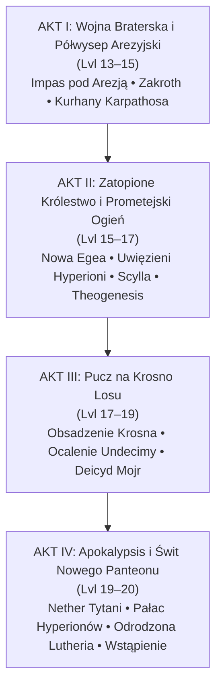
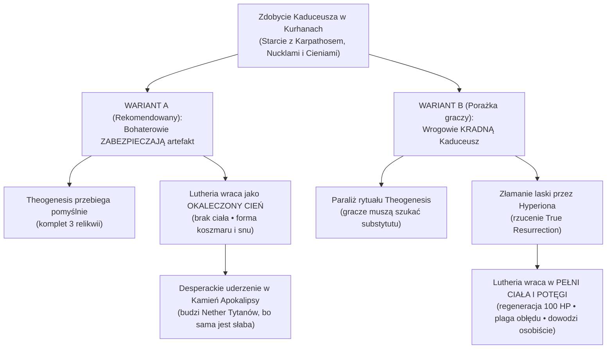

# 02 - Wielka Kampania i Główne Wątki (Poziomy 13–20)

Kompleksowy przewodnik reżyserski po narracyjnym przepływie (*flow*) 4 Aktów i 10 Rozdziałów kontynuacji kampanii, wraz ze szczegółową dekompozycją dwóch głównych silników intrygi: drogi Narsusa do *Theogenesis* oraz spisku Mistrza Cieni wokół Kaduceusza i powrotu Lutherii.

---

# CZĘŚĆ I: Architektura Kampanii, Przepływ Fabuły (Flow) i Rozdziały

Niniejszy dokument stanowi nadrzędną mapę drogową oraz reżyserski przewodnik po **narracyjnym przepływie (*flow*)** kontynuacji kampanii *Odyseja Smoczych Władców*, rozpoczynającej się **piętnaście lat** po [[Sesja 83 - Zmierzch Ery Tytanów|Bitwie o Mytros]] i wydarzeniach z [[Sesja 84 - Świt Nowej Ery|Sesji 84]].

Plan integruje oficjalny materiał z **REMASTERU** (*The New Pantheon*, *The Siege of Aresia*, *The Aresian Peninsula*, *The Sunken Kingdom*, *Apokalypsis*, *Appendix D: The Divine Path*) z autorskimi fundamentami wypracowanymi w [[01 - Świat, Historia i Kanon Nowej Ery|Założeniach Nowej Ery]] (deicyd [[Mojry|Mojr]], spisek [[Mistrz Cieni|Mistrza Cieni]], prawda o [[Narsus|Narsusie]] i tragedia [[Undecima|Undecimy/Ione]]).

---

## 1. Architektura Całości: Cztery Akty

Kampania dzieli się na cztery organicznie powiązane ze sobą akty, prowadzące drużynę od lokalnego konfliktu politycznego aż po kosmiczną przebudowę panteonu i praw rządzących światem:

---

## 2. Wizualna Mapa Przepływu (The Narrative Spine)

Każdy etap wynika przyczynowo-skutkowo z poprzedniego — brak sztucznych „szwów” fabularnych:

```mermaid
flowchart TD
    H0["HOOK 0: Kryzys Republiki i Sen Nony\n(Wezwanie Vallus • Impas pod Arezją)"] --> S1["ROZDZIAŁ 1: Otwarcie Bram Arezji\n(Demobilizacja Tarana • Dyplomacja Heleny • Wejście Ione)"]
    
    S1 -->|"Narsus ujawnia rytuał Theogenesis;\nArezyjskie Barrows są zaryglowane"| S2["ROZDZIAŁ 2: Pacyfikacja Półwyspu\n(Fort Zakrotha • Ambrozja • Pakt z Centaurami)"]
    
    S2 -->|"Helena otwiera Barrows w nagrodę za pakt;\nGracze mają Portret Karpathosa"| S3["ROZDZIAŁ 3: Kurhany Karpathosa i Zdrada Cieni\n(Kaduceusz • Nucklowie • Zamach Mistrza Cieni na Helenę)"]
    
    S3 -->|"Mają 2 relikwie; mapa Pyrrhy do 3. relikwii;\nArevon realizuje cel 15 lat; ucieczka przed zamachami"| S4["ROZDZIAŁ 4: Podmorska Odyseja — Nowa Egea\n(Merfolki vs Merrow • Dzielnica Świątynna Hyperionów)"]
    
    S4 -->|"Hyperioni wskazują Scyllę w Chasm;\nUratowanie Phaerosa i Ognia Prometejskiego"| S5["ROZDZIAŁ 5: Rytuał Theogenesis w Arezji\n(Iskra Boska • Kajdany Mojr • Zdemaskowanie 'Hodowli Bogów')"]
    
    S5 -->|"Gracze odkrywają dług Narsusa;\nIone słabnie w pułapce warkocza;\nVersir ujawnia plan puczu"| S6["ROZDZIAŁ 6: Rekrutacja Tkaczek i Przygotowanie Puczu\n(Wiedźma Lotosu • Versi • Dylemat III Kandydatki)"]
    
    S6 -->|"Obsadzenie 3 foteli Krosna;\nRozplecenie warkocza Ione • Ścięcie nici Mojr"| S7["ROZDZIAŁ 7: Deicyd na Wyspie Mojr\n(Kosmiczny Wstrząs • Złamanie Pieczęci Otchłani)"]
    
    S7 -->|"Śmierć Mojr uwalnia Nether Tytanów;\nKamień Apokalipsy aktywowany przez Lutherię"| S8["ROZDZIAŁ 8: Apokalypsis — Obrona Miast Thylei\n(Tarrasque, Kraken, Smok, Behemot • Wojna Totalna)"]
    
    S8 -->|"Pokonanie kolosów otwiera drogę do źródła;\nLokalizacja twierdzy wroga na szczycie"| S9["ROZDZIAŁ 9: Szturm na Pałac Hyperionów\n(Rozbicie sojuszu zdrajców • Dysonans pieśni Orestesa • Zniszczenie Kamienia)"]
    
    S9 -->|"20 Poziom • Czyny Apoteozy spełnione;\nŚwiat wznosi modły do Nowych Imion"| S10["EPILOG: Narodziny Nowego Panteonu\n(Wstąpienie • Nowe Krosno • Otwarcie Thylei na kosmos)"]
```

---

## 3. Szczegółowy Rozkład Aktów, Rozdziałów i Przejść

### AKT I: Wojna Braterska i Półwysep Arezyjski (Poziomy 13–15)
*Materiały źródłowe: Rozdziały 10 i 11 REMASTERU + [[01 - Świat, Historia i Kanon Nowej Ery#CZĘŚĆ II: Wojna Mytros–Arezja — Drabina Eskalacji (15 Lat Impasu)|Wojna Mytros–Arezja (Drabina Eskalacji)]], [[02 - Wielka Kampania i Główne Wątki#CZĘŚĆ II: Wątek Narsusa, Sekret Theogenesis i Trzy Boskie Artefakty|Wielka Kampania: Wątek Narsusa]], [[02 - Wielka Kampania i Główne Wątki#CZĘŚĆ III: Spisek Mistrza Cieni, Kaduceusz i Powrót Lutherii|Spisek Mistrza Cieni i Powrót Lutherii]], [[04 - Dramatis Personae (Postacie i Frakcje)#7. Undecima / Ione Xul — Córka Oriona i Nony|Undecima (Ione)]], [[06 - Scenariusz Otwarcia (Sesja 85)]].*

Główny cel: Rozbrojenie 3-letniego oblężenia [[Arezja|Arezji]], odkrycie sekretu *Theogenesis*, pacyfikacja półwyspu i zdobycie pierwszych dwóch Boskich Artefaktów.

#### Faza 1: Otwarcie i Rozwiązanie Oblężenia Arezji (Sesje 85–87)
- **Prolog na Wyspie Mojr & Teatr Bogów w Mytros (Sesja 85):**
  - Chłodny prolog przy Krośnie: aroganckie rzemieślniczki losu, brakujące 11. wrzeciono, tkanie węzłów 15-letniej wojny pod krwawe żniwo dla uśpionej Lutherii.
  - [[Vallus]] i Rada Mytros wzywają Bohaterów Przepowiedni w 15. roku: powodem wezwania nie jest samo 3-letnie oblężenie (które Senat uważał za brudną wojnę Tarana), lecz **nagły, wstrząsający wyciek wieści o Theogenesis**! Arezja posiadła formułę rytuału i jest o krok od stworzenia boga. Skarbiec republiki jest pusty, armia Tarana bezsilna wobec bóstwa, a porządek kosmiczny zagrożony. Mandat: zakończyć wojnę i powstrzymać monopol Arezji na boskość wszelkimi środkami.
- **Wkroczenie do obozu pod Arezją:**
  - Konfrontacja z [[Taran Neurdagon|Taranem Neurdagonem]] (spekulantem wojennym czerpiącym zyski z monopolu dostaw) i brutalnym gladiatorem Maximusem.
  - Odkrycie beznadziei żołnierzy i potęgi *Palladium* (100-metrowe mury niewrażliwe na oblężenie, permanentny *Forbiddance*).
- **Zastosowanie Sprawczości Graczy (Trwałe Zakończenie Oblężenia):**
  - Drużyna wybiera metodę (dyplomacja [[Orestes|Orestesa]], instytucjonalne podatki wojenne [[Felicjan Janus Twardowski|Felicjana]], wyprowadzenie Narsusa lub tajna infiltracja z pomocą szpiega Dimitriosa).
  - **Przełom dyplomatyczny:** Rozwiązanie impasu działa w pełni — Taran traci dowództwo, wojska mytrosańskie rozpoczynają demobilizację, a [[Królowa Helena]] otwiera bramy na rokowania.
- **Wejście Ione (Undecimy):**
  - 15-letnia córka [[Orion Xul|Oriona]] i hagi [[Nona|Nony]] zjawia się sama (w obozie lub w tawernie [[Ultros|Ultrosa]]).
  - Jest dziwna, obca i niepokojąca: kompulsywnie pruje nitki z płaszczy rozmówców, rozmawia z pustką, ocenia ludzi w kategoriach „zbutwienia nici”, a na czole kryje oko Nony. Drużyna waha się, czy można jej zaufać — czy uciekła z ciekawości do ojca, czy jest idealnym koniem trojańskim kowenu. Zostaje w drużynie pod czujnym okiem Oriona i Orestesa.

#### PRZEJŚCIE 1 ➔ 2: Z Murów Arezji do Dzikich Kniei Półwyspu
* **Zapalnik (*Trigger*):** W podziemnej Chamber of Beauty [[Narsus]] demaskuje propagandę o rzekomej niewoli i wyjawia rytuał **Theogenesis**. Potrzebuje trzech relikwii: Kaduceusza z kurhanów, Ambrozji z fortu Zakrotha i Ognia Prometejskiego.
* **Dlaczego nie idą od razu do Kurhanów?** Kurhany Karpathosa są otoczone przez elitarnych mnichów Yosfora, chronione królewską pieczęcią i rygorystycznym prawem Arezji. [[Królowa Helena]] stawia twardy warunek: *„Jeśli chcecie, bym otworzyła przeklęte grobowce moich przodków, musicie zneutralizować zagrożenie centaurów Zakrotha na północy. Zakroth porywa nasze dzieci i paraliżuje półwysep!”*.
* **Zasiane Poszlaki (*Breadcrumbs*):** W forcie Zakrotha gracze dowiadują się, że charyzma minotaura pochodzi z drugiego artefaktu — **Ambrozji**.
* **Efekt Przejścia:** Ruszając na Zakrotha, gracze nie wykonują „losowego questu pobocznego” — realizują warunek Heleny, ratują syna Agriusa (wdzięczność centaurów) i **od razu zdobywają 1. artefakt (Ambrozję)**!

#### Faza 2 & 3: Fort Zakrotha — Pacyfikacja Półwyspu (Sesje 88–90)
- **Ekspedycja na północ półwyspu:**
  - Przeprawa przez knieje patrolowane przez gigantów i centaury.
  - Odkrycie natury [[Zakroth|Zakrotha]]: dawny niewolnik z Mytros, który dzięki charyzmie z *Ambrozji* zjednoczył wrogie dotąd klany pod sztandarem „Wybrańca Hergerona”.
- **Infiltracja / Szturm Fortu Zakrotha:**
  - Kwestia czterech zakładników (synowie i córki wodzów centaurów, m.in. syn [[Agrius|Agriusa]]).
  - Pokonanie Zakrotha i zdobycie **Ambrozji**.
  - Zabezpieczenie trwałego pokoju na Półwyspie: uwolnienie zakładników i zawarcie paktu między wolnymi plemionami a Arezją/Mytros.

#### PRZEJŚCIE 2 ➔ 3: Z Dzikich Kniei do Mrocznych Kurhanów
* **Zapalnik (*Trigger*):** Zakroth pokonany, Ambrozja zabezpieczona, zakładnicy wolni. Królowa Helena dotrzymuje słowa i wystawia oficjalny edykt zezwalający na wejście do Barrows po **Kaduceusz**.
* **Klucz ze starych lat:** Gracze mają [[Portret Karpathosa]], zakupiony 15 lat wcześniej za 50 000 gp w Galerii Sztuki (przyniesiony przez [[Orestes|Orestesa]] z jego prywatnej kajuty na pokładzie [[Ultros|Ultrosa]]) — jedyny sposób na zniszczenie wampirzego króla.

#### Faza 4: Kurhany Karpathosa i Zdrada Cieni (Sesje 91–93)
- **Zejście do Barrows pod Arezją:**
  - Przełamanie straży mnichów pod wodzą Yosfora z edyktem Heleny.
  - Zniszczenie [[Portret Karpathosa|Portretu Karpathosa]] w K9, co neutralizuje gazową formę wampira.
  - Odnalezienie **Kaduceusza** w sercu grobowca.
- **Trójstronne starcie z tykającym zegarem:**
  - W 3. rundzie starcia z Karpathosem do grobowca wdzierają się **Nucklowie** (potworne sługi z głębin Otchłani), wybijają pieczęcie i budzą ponad 30 wampirzych pomiotów, próbując przechwycić Kaduceusz dla Lutherii.
  - [[Orestes]] zaczyna mimowolnie rezonować z glifami grobowymi — ujawnia się tajemnica jego zmartwychwstania z Sesji 84 (melodia biesiadna to Hymn Przebudzenia Lutherii).
- **Zasadzka na wyjściu i Kulminacja Aktu I — Morderstwo Królowej Heleny:**
  - Zabójcy [[Mistrz Cieni|Mistrza Cieni]] (Jocasty) atakują wyczerpaną drużynę na wyjściu z Kurhanów, by odebrać Kaduceusz.
  - Podczas gdy drużyna walczyła w kurhanach, Mistrz Cieni (Jocasta) przeprowadza zamach na [[Królowa Helena|Królową Helenę]]. Zabójczyni nie zostawia ciała do prostego wskrzeszenia za pomocą [[Kaduceusz|Kaduceusza]] — wycina jej serce i pobiera krew jako uiszczenie kontraktu z Mojrami i rytualną ofiarę dla Lutherii.
  - Drużyna dociera do pałacu w ostatnich sekundach życia monarchini — Helena przekazuje polityczny testament, zaklinając herosów na pamięć Przysięgi Pokoju, by ocalili Arezję przed zniszczeniem.
  - **Ujawnienie prawdy i stabilizacja:** Śmierć Heleny to **zapłata krwią, którą Mistrz Cieni musiał uiścić Mojrom za wywołanie 15-letniej wojny**. Zamiast uciekać z miasta w chaosie, bohaterowie stabilizują Arezję: powołują tymczasową Radę Regencyjną z zaufanymi mistrzami ([[Taureus]] i [[Halcyon]]).

---

### AKT II: Zatopione Królestwo i Prometejski Ogień (Poziomy 15–17)
*Materiały źródłowe: Rozdział 12 REMASTERU + [[03 - Bohaterowie Graczy i Ścieżka Boskości]], [[02 - Wielka Kampania i Główne Wątki#CZĘŚĆ II: Wątek Narsusa, Sekret Theogenesis i Trzy Boskie Artefakty|Wielka Kampania: Wątek Narsusa]].*

Główny cel: Odnalezienie Zatopionego Królestwa Syren, zgłębienie tragedii anioła Phaerosa, zdobycie Ognia Prometejskiego i przeprowadzenie Theogenesis — połączone z odkryciem śmiertelnej pułapki Mojr.

#### PRZEJŚCIE 3 ➔ 4: Z Płonącej Polityki na Dno Oceanu
* **Zapalnik (*Trigger*):** Drużyna zabezpieczyła 2 z 3 relikwii (Ambrozję i Kaduceusz), a obóz Tarana pod murami został zdemobilizowany. Przerażona śmiercią królowej Arezja potrzebuje tarczy — Rada Regencyjna i lud widzą w deifikacji [[Narsus|Narsusa]] jedyny ratunek dla miasta. Rada oficjalnie powierza herosom misję zdobycia trzeciej relikwii: **Ognia Prometejskiego**.
* **Osobisty Haczyk (*The Perfect Fit*):**
  * [[Arevon Elorrenthi|Arevon]]: Spełnienie 15-letniej obsesji. W Arezji odnajduje syrenę [[Pyrrha|Pyrrhę]], u której przez całe downtime leżała zaginiona mapa do Zatopionego Królestwa!
  * [[Felicjan Janus Twardowski|Felicjan]]: Bada arkaniczną strukturę Theogenesis, przygotowując rytuał integracji esencji.
  * [[Orestes]]: Potrzebuje wypłynąć na morze, by oczyścić głowę z melodii Lutherii rezonującej w murach Arezji.
* **Logistyka:** Wyprawa zyskuje pełne wsparcie okrętowe Arezji, magię głębinową Wyroczni [[Versi]] oraz gildii kupieckiej Akety.

#### Faza 1 & 2: Podmorska Odyseja do Nowej Egei (Sesje 94–98)
- **Zejście na dno Zatoki Cerulańskiej:**
  - Podmorska wyprawa do ruin Nowej Egei (New Aegea).
  - Społeczeństwo Merfolków toczące wojnę z plemionami Merrow.
- **Dzielnica Świątynna i Uwięzieni Bogowie:**
  - Spotkanie z 8 uwięzionymi bóstwami (**Hyperionami** — Kalydessa, Thalakron, Casius itd.).
  - Każde z bóstw przymila się do innego bohatera, obiecując mianowanie go „godnym następcą”.
- **Tragedia Phaerosa — Lustro Versira:**
  - Odkrycie prawdy: tysiące lat temu anioł [[Phaeros]] ukradł *Ogień Prometejski*, by dać śmiertelnikom boskość i obalić tyranię Tytanów. Wzniósł 8 czempionów do boskości.
  - Efekt: Tytani nasłali Scyllę i Kentimane'a, miasto zatonęło, a Lutheria podstępem uwięziła nowych bogów. Tysiąclecia w ciemności wypaczyły ich umysły — są zgorzkniali, żądni zemsty i bezwzględni.
  - *Dla [[Versir|Versira]]:* Ostrzeżenie, że obalenie starych bogów bez absolutnej kontroli nad naturą władzy tworzy nowe potwory. W ruinach spoczywa także uwięziony w kamieniu wuj Versira, [[Goloron Pierwszy]].

#### Faza 3: Otchłań (The Chasm), Scylla i Ogień Prometejski (Sesje 98–100)
- **Zejście w Rów Oceaniczny i Starcie ze Scyllą:**
  - Pokonanie pierwotnej bestii Kentimane'a.
  - Wydobycie z trzewi bestii anioła Phaerosa wraz z **Ogniem Prometejskim**.
  - Dramatyczny wybór: próba uleczenia oszalałego anioła czy skrócenie jego męki.
  - Uwolnienie Ognia zdejmuje pieczęcie z Hyperionów, którzy natychmiast uciekają na powierzchnię, znikając w niebiosach Thylei.

#### PRZEJŚCIE 4 ➔ 5: Z Otchłani Morskiej do Wielkiego Rytuału
* **Zapalnik (*Trigger*):** Komplet Trzech Boskich Artefaktów. Powrót do Arezji na wielki rytuał *Theogenesis* w Chamber of Beauty.

#### Faza 4: Rytuał Theogenesis i Odkrycie Pęt Mojr (Sesje 101–102)
- **Rytuał i Przebudzenie Boskiej Iskry (Divine Spark):**
  - Bohaterowie (poziom 15–16) otrzymują Boską Iskrę (odporności, nieśmiertelność ciała, aura domeny).
  - Narsus odzyskuje pełną boską postać i blask.
- **Wielki Zwrot Akcji — Klauzula Odroczona (*The Trap Revealed*):**
  - Na ciele Narsusa rozżarzają się eteryczne kajdany: *Oath of Service*.
  - Manifestacja Nony i Decimy: nowo narodzony bóg staje się wieczystym niewolnikiem Krosna.
  - Bohaterowie uświadamiają sobie, że każdy, kto wstąpi do boskości tą drogą, staje się marionetką trzech wiedźm.
- **Dramat Undecimy:** Ione słabnie — jej nić jarzy się upiornym blaskiem. Wyjawia, że jej nić jest wpleciona jako czwarte pasmo warkocza samych Mojr.
- **Decyzja drużyny:** Nie ma bezpiecznej boskości w Thylei, dopóki stoi Krosno. Plan Versira staje się jedyną drogą ocalenia.

---

### AKT III: Pucz na Krosno Losu i Przełamanie Fatum (Poziomy 17–19)
*Materiały źródłowe: Rozbudowa autorska — [[01 - Świat, Historia i Kanon Nowej Ery]], [[04 - Dramatis Personae (Postacie i Frakcje)#7. Undecima / Ione Xul — Córka Oriona i Nony|Undecima (Ione)]].*

Główny cel: Przeprowadzenie chirurgicznego uderzenia na Wyspę Mojr, obsadzenie Krosna przez trzy zaufane tkaczki, ocalenie Undecimy/Ione i zgładzenie Nony, Decimy oraz Morty na ich własnym krośnie.

#### PRZEJŚCIE 5 ➔ 6: Z Ofiar w Myśliwych — Przygotowanie Puczu
* **Punkt Wyjścia:** Versir ujawnia swój 15-letni sekret: *„Mojr nie da się zabić mieczem. Giną tylko wtedy, gdy ich nici zostaną odcięte przez zasiadające, prawomocne tkaczki na ich własnym krośnie”*.
* **Zapalnik (*Trigger*):** Wyścig z czasem, by zabezpieczyć trzy kandydatki przed ostatecznym skokiem:
  1. **Fotel I:** [[Wiedźma Lotosu]] (Wyspa Skorpiona) — wynegocjowanie jej lojalności w zamian za wieczyste prawo wglądu w nici czasu.
  2. **Fotel II:** [[Versi]] (Wyrocznia) — córka Sydona zgadza się tkać los z miłosierdziem.
  3. **Fotel III:** **Wielki dylemat moralny drużyny**:
     - [[Astra]]: Rozwiązuje problem starości u boku Versira, staje się bezczasowa, lecz bezpowrotnie traci człowieczeństwo i miłość.
     - [[Lyra]]: Zraniona przez Oriona; trzyma w rękach nożyce do nici Oriona i Ione — test zaufania i przebaczenia.
     - [[Despina]] / [[Hexia]]: Alternatywy z arkanicznym rodowodem.

#### Faza 2 & 3: Skok na Wyspę Mojr — Deicyd i Ocalenie Ione (Sesje 106–109)
- **Operacja „Pucz”:**
  - Wejście do wiecznie deszczowej jaskini pod gygańskimi ruinami.
  - Zaskoczenie arogancji Mojr: wiedźmy widziały ich przyjście, lecz traktowały to jako „kolejną wizytę dłużników”.
  - Błyskawiczny manewr: wprowadzenie trzech kandydatek na fotele tkackie.
- **Konfrontacja przy Smoczym Krośnie:**
  - Nowe tkaczki przejmują kontrolę nad czółenkiem.
  - Precyzyjne rozplecenie warkocza Ione (akt ojcowskiego poświęcenia Oriona i zerwanie dawnego kontraktu za broń).
  - **Przecięcie Nici Losu:** Nożyce idą w ruch. Nici Nony, Decimy i Morty zostają odcięte na ich własnym krośnie. Trzy prastare wiedźmy obracają się w proch.
- **Zapalnik Apokalipsy (*The Domino Effect*):**
  - Śmierć Mojr wywołuje pęknięcie najstarszych pieczęci powstrzymujących pradawne bestie.
  - W ułamku sekundy w Mytros i Otchłani zbiegli z dna morza Hyperioni oraz Świątynia Cieni aktywują **Kamień Apokalipsy (*Apokalypsis Stone*)** i odradzają **[[Lutheria|Lutherię]]**!

---

### AKT IV: Apokalypsis i Świt Nowego Panteonu (Poziomy 19–20)
*Materiały źródłowe: Rozdział 13 REMASTERU + [[03 - Bohaterowie Graczy i Ścieżka Boskości]], [[02 - Wielka Kampania i Główne Wątki#CZĘŚĆ III: Spisek Mistrza Cieni, Kaduceusz i Powrót Lutherii|Spisek Mistrza Cieni i Powrót Lutherii]].*

Główny cel: Odparcie inwazji czterech Nether Tytanów, ocalenie cywilizacji Thylei, szturm na Pałac Hyperionów, zniszczenie Lutherii i Kamienia Apokalipsy oraz ostateczne Wstąpienie do Boskości.

#### Faza 1 & 2: Zew Zagłady i Obrona Thylei (Sesje 110–115)
- **Przebudzenie Czterech Nether Tytanów:**
  1. **Tarrasque** (maszeruje na Mytros).
  2. **Kraken** (blokuje zatokę i porty).
  3. **Smok Pustki (Nether Dragon)** (pali Estorię).
  4. **Behemot** (równa z ziemią południe, Arezję i osady bohaterów).
- **Mobilizacja Sojuszy (Zamiast mechaniki zagłady 4. miasta — Allied Defense Allocation):**
  - Drużyna dowodzi połączonymi siłami: Smoczy Lordowie [[Felicjan Janus Twardowski|Felicjana]], falangi Arezji i centaury Zakrotha, flota minotaurów [[Orestes|Orestesa]], zbrojni Estorii pod wodzą [[Orion Xul|Oriona]] i Pythora, siły natury [[Arevon Elorrenthi|Arevona]], anioł Phaeros i amazonki na rhinotitanach oraz stojący dotąd w porcie mecha-bóg [[Kolos Pythora]] obsadzony i pilotowany przez herosów do walki z [[Tarrasque|Tarrasque'em]].
  - Umiejętny podział sił pozwala ocalić wszystkie stolice z kontrolowanymi stratami.

#### Faza 3: Szturm na Pałac Hyperionów (Sesje 116–118)
- **Bastion na Szczycie Świata:**
  - Twierdza Hyperionów sprzymierzonych z powracającą Lutherią.
  - Przedarcie się przez straże gigantów burzowych i magiczne blokady.
- **Finałowe Starcie z Lutherią:**
  - Lutheria zasilana Kamieniem Apokalipsy. (Jeśli gracze obronili Kaduceusz w Akcie I — Lutheria walczy jako okaleczony cień/sen; jeśli wrogowie go skradli — staje w pełni potęgi fizycznej z regeneracją 100 HP).
  - [[Orestes]] odwraca rytuał: fałszuje Hymn Śmierci swoją piwowarską pieśnią, rozrywając jej arkaniczną więź z Otchłanią.
  - Drużyna niszczy Kamień Apokalipsy i unicestwia Lutherię na zawsze.

#### Faza 4 & Epilog: Spełnienie Apoteozy — Nowy Panteon (Sesje 119–120)
- **Spełnienie Mitycznych Czynów Domenowych (20 Poziom):**
  - Każdy bohater dopełnia swój Czyn Domeny, przezwyciężając życiową traumę (patrz [[03 - Bohaterowie Graczy i Ścieżka Boskości]]).
- **Narodziny Nowych Bogów:**
  - Status bóstwa, cecha o wartości 30, boskie moce.
  - Decyzja: Wstąpienie na niebiosa LUB pozostanie Śmiertelnym Bogiem-Opiekunem stąpającym po ziemi.
  - Otwarcie granic: nowe Krosno w rękach mądrych tkaczek bez długu krwi; [Arevon](file:///home/karpiq/Code/OotD/content/02-People/Bohaterowie/Arevon%20Elorrenthi.md) z Antikytherą otwiera szlak ku gwiazdom i Eberronowi.

---

## 4. Identyfikacja Słabych Punktów i Poprawki REMASTERU

| # | Słaby Punkt w REMASTER | Dlaczego to problem przy stole? | Wdrożone Rozwiązanie / Poprawka |
|---|---|---|---|
| **1** | **Bierność Narsusa jako „zleceniodawcy”** | W podręczniku Narsus to statyczny NPC: „przynieście mi 3 rzeczy, a zrobię rytuał”. Gracze czują się jak kurierzy. | **Suwerenność graczy:** Narsus ma unikalną wiedzę arkaniczną, ale to drużyna dyktuje warunki. Rytuał jest potrzebny przede wszystkim im, by zrównoważyć brak bóstw w Thylei. |
| **2** | **Brak przejścia: Oblężenie → Zatopione Królestwo** | Po wojnie w Arezji drużyna nagle ma nurkować na dno zatoki bez silnej presji czasu. | **Stawka Arevona + Przeciek o Phaerosie:** Arevon szukał tego miejsca 15 lat. Ponadto Ogień Prometejski to jedyny stabilizator grobowego Kaduceusza. |
| **3** | **Motywacja Hyperionów w Rozdziale 13** | Hyperioni po uwolnieniu ze Scylli stają się sługami Lutherii bez wyjaśnienia (to ona ich uwięziła!). | **Wypaczenie przez eony i pakt z Lutherią:** Hyperioni nienawidzą śmiertelników za zapomnienie. Lutheria obiecała im podział Thylei na 8 domen po zmieceniu miast przez Nether Tytany. |
| **4** | **Miejsce Puczu na Mojry w strukturze** | W oficjalnym module Mojry w ogóle nie giną. Wątek Versira mógłby rozbić spójność fabuły. | **Akt III jako most:** Pucz następuje PO odkryciu pułapki Theogenesis (Akt II), a PRZED finałem. Deicyd Mojr łamie pradawne pieczęcie Otchłani, wyzwalając Nether Tytanów w Akcie IV! |
| **5** | **Zagrożenie dewaluacją triumfu z Sesji 82** | Powrót Lutherii z probówki mógłby sprawić wrażenie: „nasze dawne zwycięstwo nic nie znaczyło”. | **Cena powrotu i wariantowość Kaduceusza:** Powrót kosztował 15 lat krwawej wojny, odłamki kosy, zdradę Świątyni Cieni i Kaduceusz. Obrona Kaduceusza odbiera jej fizyczne ciało (patrz [[02 - Wielka Kampania i Główne Wątki#CZĘŚĆ III: Spisek Mistrza Cieni, Kaduceusz i Powrót Lutherii|Spisek Mistrza Cieni i Powrót Lutherii]]). |
| **6** | **Dylemat zniszczenia miast w Apokalypsis** | Zasada REMASTERU: 4. miasto ginie w 100%. Frustrujące dla graczy budujących krainę przez 15 lat. | **Nagroda za strategiczny podział sił:** Gracze rozdzielają sojuszników (Smoczy Lordowie, hoplici, centaury, flota, Latająca Forteca) — wszystkie miasta mogą przetrwać z kontrolowanymi stratami. |
| **7** | **Los królowej Heleny a stabilność Arezji** | Zabicie Heleny w złym momencie zablokuje dostęp do relikwii. | **Precyzyjny timing:** Mistrz Cieni dokonuje zamachu na Helenę dopiero w finale Aktu I (gdy gracze walczą w Kurhanach). Jej śmierć to spłata długu u Mojr za wywołanie wojny. |

---

## 5. Zestawienie Twardych Zależności (Dlaczego kolejność jest nierozerwalna)

| Odcinek | Co gracz MUSI mieć / wiedzieć z poprzedniego etapu? | Dlaczego nie może pójść gdzie indziej? |
|---|---|---|
| **Półwysep (Zakroth)** | Zgoda Heleny wymaga usunięcia zagrożenia centaurów | Bez pacyfikacji Zakrotha Helena nie wyda edyktu na otwarcie Kurhanów. |
| **Kurhany (Karpathos)** | Edykt Heleny + Portret Karpathosa kupiony w Galerii 15 lat wcześniej | Bez portretu wampir ma regenerację i postać gazową; bez edyktu mnisi Yosfora walczą na śmierć. |
| **Zatopione Królestwo** | Mapa od Pyrrhy (z Arezji) + potrzeba 3. artefaktu do Theogenesis | Bez mapy nikt nie zna koordynatów Nowej Egei; bez Ognia Prometejskiego rytuał boskości spali duszę. |
| **Pucz na Mojry** | Odkrycie pęt Narsusa (*The Trap*) + cierpienie Ione | Wcześniej drużyna nie ma powodu ryzykować kosmicznego puczu; dopiero widok niewolnictwa Narsusa daje mandat. |
| **Apokalypsis** | Śmierć Mojr łamie pradawne pieczęcie Kentimane'a | Potwory nie budzą się z przypadku — to metafizyczna konsekwencja deicydu i ingerencji Kamienia Apokalipsy. |
| **Pałac Hyperionów** | Hyperioni uciekli z dna morza w Akcie II | Złoczyńcy w finale to te same twarze, z którymi gracze rozmawiali na dnie oceanu — koło zdrady się domyka. |

---

## 6. Matryca Wątków Osobistych Bohaterów

```mermaid
classDiagram
    class Versir {
        Akt I: Negocjacje z Arezją, badanie Świątyni Cieni
        Akt II: Ostrzeżenie Phaerosa (lustro własnych ambicji)
        Akt III: Główny architekt puczu na Krosno i deicydu Mojr
        Akt IV: Zrównoważenie sił boskich i wstąpienie
    }
    class Orion_Xul {
        Akt I: Spotkanie z Undecimą (Ione), dylemat ojcostwa
        Akt II: Test męstwa w Zatopionym Królestwie
        Akt III: Rozplecenie warkocza córki, odkupienie długu wobec Nony
        Akt IV: Ochrona miast, konfrontacja z dziedzictwem Pythora
    }
    class Felicjan {
        Akt I: Równoważenie imperializmu Mytros, podatki wojenne
        Akt II: Badanie arkanów Theogenesis i natury Boskiej Iskry
        Akt III: Odzyskanie pełnego zdrowia z rąk Krosna, wsparcie arkaniczne
        Akt IV: Dowodzenie Zakonem Smoczych Lordów w wojnie powietrznej
    }
    class Orestes {
        Akt I: Most handlowy między Mytros i Arezją, patronat nad Ione
        Akt II: Walka z bestiami głębinowymi, rezonans pieśni
        Akt III: Rozliczenie z obietnicą Nony ze snów
        Akt IV: Sfałszowanie Hymnu Przebudzenia, zerwanie więzi Lutherii
    }
    class Arevon {
        Akt I: Zabezpieczenie dróg rzecznych i natury półwyspu
        Akt II: Spełnienie 15-letniej obsesji: Zatopione Królestwo
        Akt III: Odzyskanie utraconej szybkości z Krosna Mojr
        Akt IV: Obrona ziemi przed Behemotem i otwarcie wrót do Eberronu
    }
```

---

## 7. Praktyczna Ściągawka dla MG przy Stole

| Faza Kampanii | Główne Pytanie Graczy (*Dramatic Question*) | Co pcha ich do przodu (*Driver*) | Jakie poszlaki zasiać w tle (*Foreshadowing*) |
|---|---|---|---|
| **Akt I (Arezja)** | *„Jak zakończyć tę wojnę bez rzezi i kim jest Ione?”* | Widmo bankructwa Mytros i bezsensownej śmierci żołnierzy | Dziwne szepty mnichów cienia o „Królowej Snów”; mapa Pyrrhy |
| **Akt II (Morze)** | *„Co kryje się na dnie i dlaczego Phaeros oszalał?”* | Potrzeba 3. relikwii do rytuału boskości; obsesja Arevona | Ostrzeżenia Phaerosa: *„Nie bierzcie korony, jeśli nie znacie ceny Krosna!”* |
| **Akt III (Pucz)** | *„Jak ściąć wiedźmy i ocalić Ione, nie niszcząc świata?”* | Odkrycie, że Theogenesis to niewolnictwo u Mojr; pęta Narsusa | Niestabilność pieczęci w miarę osłabiania Krosna; koszmary o gigantach |
| **Akt IV (Zagłada)** | *„Które miasta ocalimy i jak zniszczyć źródło zła?”* | Cztery Nether Tytany maszerujące na stolice; zew przetrwania | Pieśń Orestesa jarząca się na Kamieniu Apokalipsy — klucz do kontrataku |

---

# CZĘŚĆ II: Wątek Narsusa, Sekret Theogenesis i Trzy Boskie Artefakty

## 1. Prawdziwa Sytuacja Narsusa

[[Narsus]] nie jest więźniem [[Arezja|Arezji]] i nigdy nim nie był. Mieszka w [[Wiszące Ogrody|Wiszących Ogrodach]] dobrowolnie, od pięciuset lat, bo jest tam rozpieszczany i podziwiany, a [[Królowa Helena]] jest w nim zakochana. Mytrosańska wersja o „bogu trzymanym w niewoli" to imperialna propaganda, w którą Mytros samo uwierzyło.

Bohaterowie znają go osobiście — w [[Sesja 61 - Arezja|Sesjach 61–63]] kupili jego głos w Radzie Pięciu Mistrzów **[[Słoneczny Granat|Słonecznym Granatem]]**. To jest wciąż ten sam człowiek: próżny, leniwy, zapatrzony w lustra, nie „geniusz zła", tylko po prostu głupi narcyz.

Chce jednego: **odzyskać boskość**, którą utracił, gdy odmówił pomocy śmiertelnym w Pierwszej Wojnie i został wydziedziczony przez matkę Mytros.

---

## 2. Sekretna Umowa z Mojrami

Kilkanaście lat temu [[Narsus]] zawarł sekretny układ z [[Mojry|Mojrami]]. Nie szukał ratunku z „niewoli", tylko powrotu na Olimp. W zamian za cenę dostał od wiedźm pełną wiedzę o rytuale **Theogenesis** oraz o położeniu trzech Boskich Artefaktów.

Narsus nikomu nie zdradza źródła tej wiedzy. Utrzymuje, że odkrył ją sam lub że drogę objawiła mu we śnie matka. Nikt w Thylei nie wie, skąd wziął się ten rytuał.

### Cena: Oath of Service (Przysięga Służby)
Ceną za wiedzę była **Przysięga Służby (*Oath of Service*)**, płatna **po** ponownym wstąpieniu do grona bogów:
- Narsus zobowiązał się do wieczystego posłuszeństwa i długu wobec Krosna w nowej erze boskiej.
- **Dlaczego się zgodził?** Z czystej pychy. Narsus bagatelizuje swój dług — jest głęboko przekonany, że gdy odzyska pełną boskość i nieśmiertelność, żadne trzy stare wiedźmy w ruinie nie będą w stanie niczego na nim wymusić.
- Nie chwali się tym długiem przed nikim. Dla świata kreuje się na wybrańca, który „przywróci Thylei prawdziwego boga piękna".

### Klauzula Odroczona: Hodowla Bogów
[[Mojry]] nie sprzedają boskości z altruizmu — one hodują podległych bogów. Każdy pretendent, który wstępuje na szczyt tą drogą, trafia tam już spętany Przysięgą Służby u trzech wiedźm. Dług egzekwuje się od istoty, która nie może umrzeć.

To jest prawdziwy kształt nowej ery i najmocniejszy argument za planem [[Versir|Versira]] — argument, którego Versir na początku kampanii jeszcze nie zna (odkrywa go dopiero w Akcie II podczas rytuału Theogenesis).

---

## 3. Wątek Ekoh i Zarzewie Wojny

- **[[Ekoh]]** — oreada-łowczyni, która uczciwie wygrała dawny konkurs Narsusa o jego rękę (przynosząc srebrne poroże białego jelenia). Nigdy nie odebrała nagrody przez zaborczość królowej Calliope i obojętność Narsusa. W roku 10 pojawia się w Mytros, stając się zarzewiem religijnego kryzysu (patrz [[01 - Świat, Historia i Kanon Nowej Ery#CZĘŚĆ II: Wojna Mytros–Arezja — Drabina Eskalacji (15 Lat Impasu)|Wojna Mytros–Arezja (Drabina Eskalacji)]]). Może być pretendentką do domeny Piękna.

---

## 4. Wyciek Theogenesis i Wezwanie Bohaterów (Rok 15)

Przez kilkanaście lat [[Narsus]] trzymał wiedzę o rytuale w tajemnicy, pławiąc się w luksusach i czekając na dogodny moment. Dopiero w 15. roku dworskie przygotowania do rytuału w podziemnej *Chamber of Beauty* weszły w decydującą fazę. Niewyparzony język próżnego półboga, który zaczął rozpowiadać służbie i kapłankom o swoim rychłym powrocie na niebiosa, doprowadził do przecieku za mury miasta.

Dla [[Mytros]] brzmi to jak wyrok: **Arezja jest o krok od stworzenia nowego boga.** Dotychczasowe, 3-letnie oblężenie pod wodzą Tarana — motywowane dotąd cłami, ambicjami i sporem granicznym — okazuje się całkowicie bezradne wobec groźby boskiej apoteozy. To ten wyciek w roku 15 zmienia lokalną wojnę polityków w kryzys kosmiczny i zmusza królową [[Vallus]] do natychmiastowego wezwania Bohaterów Przepowiedni.

---

## 5. Trzy Boskie Artefakty

| Artefakt | Gdzie się znajduje | Kto jeszcze go pożąda |
|---|---|---|
| **Kaduceusz** | grobowiec [[Karpathos|Karpathosa]] w Kurhanach pod Arezją | [[Mistrz Cieni]] — potrzebuje go do wskrzeszenia [[Lutheria|Lutherii]] (patrz [[02 - Wielka Kampania i Główne Wątki#CZĘŚĆ III: Spisek Mistrza Cieni, Kaduceusz i Powrót Lutherii|Spisek Mistrza Cieni i Powrót Lutherii]]) |
| **Ambrozja** | forteca [[Zakroth|Zakrotha]], dwa dni na północ | koalicja centaurów i minotaurów — źródło charyzmy Zakrotha |
| **Ogień Prometejski** | [[Królestwo Syren|Zatopione Królestwo Syren]] na dnie [[Zatoka Cerulańska|Zatoki Cerulańskiej]] | anioł [[Phaeros]], uwięzieni Hyperioni |

### Dlaczego Narsus nie sięgnął po Kaduceusz przez 15 lat?
1. **Kategoryczny zakaz Heleny i brak klucza:** [[Królowa Helena]], pamiętając koszmar wampiryzmu Calliope, zabroniła naruszania pieczęci Kurhanów pod karą śmierci. Wejście bez zniszczenia [[Portret Karpathosa|Portretu]] groziłoby przebudzeniem wampirzego rodu — a Portret Karpathosa spoczywał bezpiecznie w prywatnej kajucie [[Orestes|Orestesa]] na pokładzie [[Ultros|Ultrosa]] w porcie [[Mytros]].
2. **Tchórzostwo Narsusa:** Narsus kocha luksus i bezpieczeństwo. Zejście do grobowca pełnego wampirów uważał za barbarzyństwo — wolał czekać, aż ktoś inny (bohaterowie lub arezyjscy czempioni) zdobędzie artefakt dla niego.

Mapę do Zatopionego Królestwa ma **[[Pyrrha]]**, syrena usługująca Narsusowi w Wiszących Ogrodach Arezji — pamiątkę rodową, którą strzegła przez lata. Rzecz, której [[Arevon Elorrenthi|Arevon]] szukał bezskutecznie przez piętnaście lat, leży w strzeżonych ogrodach w mieście obok!

---

## 6. Iskra Boska a Wstąpienie (Mechanika i Fabuła)

Rytuał *Theogenesis* przeprowadzony w Arezji przy użyciu trzech artefaktów daje uczestnikom **Boską Iskrę (*Divine Spark*)** (poziomy 15–16) — zalążek nieśmiertelności, odporności i aury domeny. 

Pełne Wstąpienie (*Ascension*, cecha 30 i status boga) następuje dopiero na 20. poziomie po wykonaniu Legendarnego Czynu Domeny w trakcie kataklizmu *Apokalypsis* (patrz [[03 - Bohaterowie Graczy i Ścieżka Boskości]]).

---

# CZĘŚĆ III: Spisek Mistrza Cieni, Kaduceusz i Powrót Lutherii

Trzeci główny tor intrygi kampanii, ściśle powiązany z losem krainy i śmiercią królowej Heleny. **[[Mistrz Cieni]] (Jocasta) kupił wojnę od [[Mojry|Mojr]]**, aby przygotować grunt pod powrót swojej bogini, a sprawa **Kaduceusza** w Kurhanach Karpathosa rozstrzyga o formie, w jakiej [[Lutheria]] powróci do świata.

---

## 1. Kim jest Mistrz Cieni i Czego Chce

Zamaskowany, w kapturze, tożsamość formalnie skrywana przed Arezją (kapłanka Jocasta). Prowadzi [[Świątynia Cieni|Świątynię Cieni]] i rozległą siatkę szpiegowską [[Arezja|Arezji]] sięgającą do [[Mytros]], zasiada w arezyjskiej Radzie Pięciu Mistrzów.

Jej uczniowie **potajemnie czczą [[Lutheria|Lutherię]]**. Kolejne królowe Arezji od stuleci to podejrzewały i przymykały oko, bo świątynia i jej zabójcy byli zbyt użyteczni w obronie państwa.

Mistrz Cieni **wie, że Lutheria wróci**, i od piętnastu lat metodycznie kompletuje środki i warunki, żeby jej to umożliwić.

---

## 2. Pakt z Mojrami: Zakup Wojny

Mistrz Cieni przyszedł do Mojr z konkretną transakcją — potrzebował wybuchu wieloletniej, wyniszczającej wojny między dwoma potęgami Thylei.

### Po co mu wojna?
1. **Żniwo krwi i cierpienia:** Powrót [[Lutheria|Lutherii]] z głębin [[Morze Otchłani|Otchłani]] wymaga potężnego ładunku rozpaczy, agonii, głodu i setek przerwanych istnień. Piętnaście lat wojny to gigantyczne źródło energii zasilające jej powolne budzenie się.
2. **Paraliż polityczny Thylei:** Wyniszczone miasta i skłóceni Smoczy Lordowie nie byli w stanie stworzyć zjednoczonego Nowego Panteonu, który mógłby zapobiec powrotowi dawnych bogów.

### Co dał Mojrom w zamian?
1. **Traktat o Prawach i Zobowiązaniach Krwi** — unikalny zbiór Pierwszych Przysiąg Thylei (skodyfikowanych za czasów Kentimane i Tytanów), wydobyty dla niego przez drużynę ze skarbca [[Sydon|Sydona]] w [[Praxys]] ([[Sesja 83 - Zmierzch Ery Tytanów|Sesja 83]]). Traktat zawiera archaiczne luki prawne, które pozwalają Mojrom naginać losy pradawnych i nieludzkich ras bez łamania Przysięgi Pokoju.
2. **Śmierć [[Królowa Helena|Królowej Heleny]] z rąk Mistrza Cieni** — ostateczna likwidacja dynastii Calliope, która 500 lat temu wynegocjowała immunitet. Mojry zażądały jej śmierci jako części zapłaty za utkanie 15-letniej wojny — a Mistrz Cieni zobowiązał się osobiście przeprowadzić zamach i dostarczyć jej krew Krosnu.

---

## 3. Co Wydarzyło się w Sesji 84: Orestes jako Próba Generalna

**[[Orestes]] był próbą generalną.**

Świątynia Cieni potrzebowała dowodu, że potrafi przywrócić wolę do martwego ciała przez granicę [[Morze Otchłani|Otchłani]]. Minotaur z silną duszą i mocnym powodem, żeby wrócić, był idealnym materiałem — i **sam się o to prosił, płacąc im kompletem odłamków [[Kryształowa Kosa Lutherii|Kryształowej Kosy]]**.

Zadziałało:
- Dziewięć godzin rytuału: glify, świece, postacie w czerni nucące w nieznanym języku.
- Melodia, którą [[Orestes]] zapamiętał i z której układa biesiadne piosenki, **jest inkantacją rytuału wskrzeszenia**. Minotaur chodzi po Thylei i nuci instrukcję powrotu bogini śmierci.

### Jak to odpalić przy stole?
- **Odkrycie (Sesje 88–92):** W trakcie eksploracji Kurhanów lub Świątyni Cieni glify grobowe zaczynają rezonować i jarzyć się w rytm głosu Orestesa, a uczeni arkanów z przerażeniem pytają: *„Skąd znasz Hymn Przebudzenia Królowej Snów?!”*.
- **Oręż w rękach Orestesa:** Orestes nie jest bezsilną ofiarą. Zna melodię na pamięć i w finale (Akt IV) może **zniekształcić/sfałszować pieśń**, rycząc jej piwowarską wersję, co wprowadzi dysonans arkaniczny i zerwie rytuał Lutherii!

---

## 4. Rola Kaduceusza i Grobowiec Karpathosa

**Kaduceusz Damona** leży w grobowcu [[Karpathos|Karpathosa]] w Kurhanach pod Arezją, za stałym *Forbiddance*, strzeżony przez mnichów [[Yosfor|Yosfora]] oraz wampirzą parę królewską (Karpathosa i [[Nemosyne]]).

### Geneza Artefaktu
Laska została wykuta ponad 500 lat temu przez arcymaga Damona w pierwotnych wodach [[Morze Otchłani|Morza Otchłani]]. Została stworzona dla króla-smoczego lorda Karpathosa jako narzędzie dawania życia i leczenia poległych Smoczych Lordów. Karpathos dał się uwieść obietnicom Lutherii, zdradził sojuszników, a gdy złamał przysięgę, został ukarany zamianą w pierwszego wampira Thylei.

### Klucz do Grobowca: [[Portret Karpathosa]]
Drużyna kupiła w [[Galeria Sztuki|Galerii Sztuki]] w Arezji **Portret Karpathosa** za 50 000 sztuk złota — nekromantyczne filakterium trzymające duszę króla. **Gracze nadal go mają.**  
Zniszczenie portretu w komorze K9 odbiera Karpathosowi postać gazową i regenerację 100 HP na rundę. Bez portretu wampir w Kurhanach jest niezniszczalny.

### Dlaczego Mistrz Cieni sam nie wszedł do grobowca?
1. **Grobowiec to pułapka samobójcza:** Bez portretu wampiry wybiłyby zabójców Cieni w kilka minut.
2. **Cierpliwość:** Mistrz Cieni wiedział, że poszukiwacze *Theogenesis* w końcu otworzą grobowiec. Czekał na ten moment, by przechwycić artefakt na wyjściu.

---

## 5. Dynamika Starcia w Kurhanach i Zamach na Helenę

### Tykający Zegar w Grobowcu (Sesje 91–92)
1. **Faza 1 (Wejście):** Drużyna wchodzi z edyktem Heleny i [[Portret Karpathosa|Portretem]] (przyniesionym z kabiny Orestesa), niszczy obraz w K9 i walczy z Karpathosem o Kaduceusz.
2. **Faza 2 (Zwrot akcji — 3. runda):** Do grobowca wdzierają się **Nucklowie** (oceaniczne bestie zrodzone z woli Lutherii), wyłamują młyńskie kamienie w K3, K4 i K6, budzą wampirze pomioty i próbują wyrwać Kaduceusz, by oddać go Lutherii.
3. **Faza 3 (Zasadzka Cieni na wyjściu):** Wykrwawieni bohaterowie wychodzą na powierzchnię, gdzie uderza na nich elita zabójców Świątyni Cieni.

### Kulminacja: Morderstwo Królowej Heleny i Mandat Rady
W tym samym czasie, gdy drużyna toczy bój w podziemiach, Mistrz Cieni (Jocasta) osobiście morduje w pałacu [[Królowa Helena|Królową Helenę]].
- **Brak możliwości natychmiastowego wskrzeszenia:** Jocasta to profesjonalna kapłanka śmierci. Wybija straż, zabija królową i **wycina jej serce oraz pobiera krew**, by zanieść je w darze Mojrom i uśpionej Lutherii. Zgodnie z zasadami 5e uniemożliwia to natychmiastowe użycie *Revivify* z Kaduceusza (brak kompletnego serca/ciała, dusza spętana w Otchłani).
- **Testament Heleny:** Drużyna dociera do komnaty w ostatnich sekundach jej życia — Helena przekazuje testament polityczny, powierzając obronę Arezji bohaterom.
- **Rada Regencyjna i Mandat Morski:** Śmierć Heleny to **zapłata krwią za 15 lat wyreżyserowanej wojny**. Zamiast uciekać z osieroconego miasta, bohaterowie stabilizują sytuację, powołując Radę Regencyjną z zaufanymi mistrzami ([[Taureus]] i [[Halcyon]]). Przerażona Arezja widzi jedyny ratunek w deifikacji [[Narsus|Narsusa]] — Rada oficjalnie deleguje herosów do zdobycia Ognia Prometejskiego na dnie morza, gwarantując pełne wsparcie floty i zasobów.

---

## 6. Dziura Logiczna Podręcznika i Dwie Formy Powrotu

### Problem w REMASTERZE
Autorzy oficjalnego modułu zakładają, że wrogowie polują na Kaduceusz, by wskrzesić Lutherię. Jednak w Rozdziale 13 (*Apokalypsis*) Lutheria po prostu pojawia się żywa w Pałacu Hyperionów — ignorując całkowicie to, czy gracze obronili Kaduceusz w kurhanach, czy go stracili.

### Rozwiązanie: Rozgałęzienie Fabularne (Dwie Ścieżki)

#### WARIANT A: Bohaterowie Zabezpieczają Kaduceusz (Ścieżka Domyślna)
- **Dla Graczy:** Zabezpieczają stabilizator do *Theogenesis*. Zyskują potężny artefakt leczący (*Heal*, *Greater Restoration*, *Resurrection*), lecz obarczony mroczną aurą Otchłani.
- **Dla Lutherii:** **Brak fizycznego ciała.** Nie może zrekonstruować ściętej w Sesji 82 powłoki. Manifestuje się jako bezcielesny upiór snu pasożytujący na Hyperionach i pieśni Orestesa.
- **Motywacja do Apokalypsis:** Z powodu słabości ucieka się do przebudzenia Nether Tytanów (Tarrasque, Kraken, Smok, Behemot). Apokalipsa jest dla niej aktem desperacji.
- **Finał:** W Pałacu Hyperionów drużyna staje naprzeciw zniekształconej istoty stopionej z Kamieniem Apokalipsy. Obrona Kaduceusza odebrała jej połowę siły!

#### WARIANT B: Wrogowie Kradną Kaduceusz (Ścieżka Porażki)
- Tylko jeśli gracze poniosą ewidentną klęskę w kurhanach lub zlekceważą ochronę artefaktu.
- Jeden z Hyperionów łamie laskę, rzucając *True Resurrection* na Lutherię (*Appendix C*).
- Lutheria odzyskuje pełne, niezniszczalne boskie ciało pod koniec Aktu II. W całej Thylei gaśnie blask słońca, rzeki zamieniają się w piołun, a ludzie popadają w szaleństwo na jawie. W finale posiada 100 HP regeneracji na rundę i dowodzi tytanami.

---

## 7. Podwójna Natura Kaduceusza: Życie vs Śmierć

| Aspekt | Rola dla Graczy (Nowy Panteon) | Rola dla Sług Lutherii |
|---|---|---|
| **Domeny** | Życie, Odnowa, Most Arkanów | Śmierć, Wampiryzm, Wskrzeszenie Tytana |
| **Funkcja w Theogenesis** | **Stabilizator Ognia:** Ogień Prometejski niesie iskrę boską, lecz bez witalnej kotwicy Kaduceusza spaliłby duszę śmiertelnika na popiół. | **Katalizator Zmartwychwstania:** Złamanie laski przez Hyperiona uwalnia moc *True Resurrection* dla zmarłego boga. |
| **Ryzyko** | Laska nosi piętno Karpathosa — postać dostrojona miewa sny z Otchłani. | Zniszczenie laski bezpowrotnie niszczy najpotężniejsze narzędzie uzdrawiania w Thylei. |

---

## 8. Wskazówki Prowadzenia przy Stole

1. **Buduj Wagę Artefaktu w Kurhanach:** Gdy Nucklowie wdzierają się do grobowca, ich jedynym celem jest Kaduceusz. Gracze muszą poczuć, że walczą o coś, co zadecyduje o losie świata.
2. **Nagradzaj Czujność:** Jeśli gracze zabezpieczą Kaduceusz (np. schowają go w Worku Bez Dna Orestesa i wystawią warty), nagródź ich. Artefakt zostaje w ich rękach.
3. **Pokaż Skutki w Akcie IV:** Kiedy staną naprzeciw cienia Lutherii, powiedz wprost: *„Gdybyście nie ocalili Kaduceusza pod Arezją, ta bestia stałaby dziś przed wami z krwi i kości”*. To daje graczom najgłębsze poczucie sensu ich zwycięstw.
