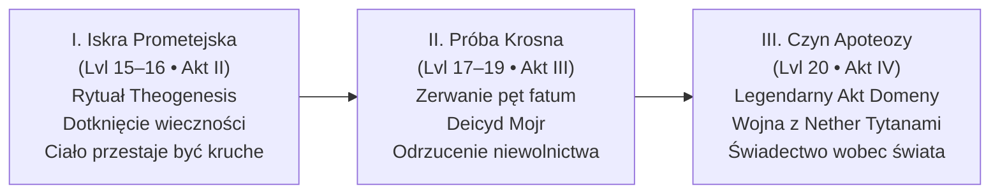

# Ścieżka Boskości i Nowy Panteon Thylei

> *„Śmiertelnicy marzą o nieśmiertelności. Nigdy nie marzą o tym, ile ona kosztuje.”*  
> — **Narsus**

Niniejszy dokument przedstawia **epicko-narracyjną rekonstrukcję Ścieżki Boskości (*The Divine Path*)** dla kontynuacji kampanii. Zastępuje on suchą, czysto mechaniczną „listę zakupów” z podręcznikowego *Appendix D* (zabij potwory o łącznym CR 100, ukuj przedmiot, daj się wskrzesić) wielopoziomowym dramatem mitycznym, w którym boskość jest **filozoficznym wyborem, przezwyciężeniem własnej klątwy i aktem ukształtowania nowego porządku świata**.

---

## 1. Natura Boskości w Thylei — Czym jest Apoteoza?

W świecie Thylei boskość nie jest kolejnym poziomem doświadczenia ani magicznym wzmocnieniem statystyk. Boskość to **stanie się filarem rzeczywistości**.

### Trzy Grzechy Poprzednich Pokoleń Bogów
Wszyscy poprzedni władcy Thylei ponieśli porażkę z powodu tej samej fundamentalnej skazy:
1. **Bliźniaczy Tytani (Sydon i Lutheria):** Utożsamiali boskość z bezwzględną tyranią i prawem silniejszego. Żądali ofiar z krwi i strachu, traktując śmiertelników jak bydło.
2. **Pięciu Bogów (Mytros, Volkan, Pythor, Vallus, Kyrah):** Byli lepsi, lecz związali się z jednym miastem, popadli w ludzkie nałogi i depresję ([[Pythor]]), cynizm lub bezradność, a ich moc wygasała wraz z upływem wieków.
3. **Uwięzieni Hyperioni (Zatopione Królestwo / Phaeros):** Przyjęli boskość od anioła Phaerosa jako prezent, bez moralnej dojrzałości. Tysiąclecia w mroku zamieniły ich w zgorzkniałe potwory żądne odwetu na świecie.
4. **Hodowla Mojr (Dług Krwi):** Każdy dotychczasowy pretendent (w tym [[Narsus]]) wstępował na Olimp spętany *Przysięgą Służby (Oath of Service)* u Krosna Losu. Ich boskość była kredytem, a [[Mojry]] były lichwiarzami.

### Nowa Teologia Bohaterów
Bohaterowie Przepowiedni nie mogą po prostu „zająć wolnych stołków”. Ich apoteoza to **zerwanie z cyklem pychy i długu**. Stają się bóstwami nie dlatego, że posiedli potęgę, lecz dlatego, że **wzięli na barki ciężar, którego nikt inny nie potrafił unieść**, zachowując ludzkie serce.

---

## 2. Trzy Stopnie Apoteozy (Fabuła zamiast Tabelki)

Ścieżka do boskości nie realizuje się w jednym rzucie kością. Jest to ewolucja rozłożona na całą drugą połowę kampanii (poziomy 13–20):

---

### Stopień I: Iskra Prometejska (*The Divine Spark*)
* **Kiedy:** Finał Aktu II (po zdobyciu Kaduceusza, Ambrozji i Ognia Prometejskiego w Zatopionym Królestwie).
* **Wymiar Fabularny:** Rytuał *Theogenesis* w Arezji. To zestrojenie trzech pierwotnych esencji:
  * **Ogień Prometejski** (światło stworzenia ukradzione przez anioła Phaerosa),
  * **Ambrozja** (charyzma i witalność czystego ducha),
  * **Kaduceusz** (władza nad granicą życia i śmierci).
* **Objawy u Bohaterów:**
  * Ciało przestaje ulegać chorobom i starości.
  * Oczy, głos lub cień bohatera zaczynają rezonować z jego rodzącą się domeną (np. kroki Orestesa pachną świeżym chmielem i miodem; wokół Felicjana powietrze drży czystą formułą arkaniczną; w cieniu Versira widać złote i srebrne promienie zaginionych tytanów; w spojrzeniu Arevona odbijają się konstelacje innego wymiaru; w głosie Oriona słychać odległy grzmot).
  * **Haczyk fabularny:** Bohaterowie widzą, jak Narsus zostaje spętany niewidzialnymi nićmi Mojr (*Oath of Service*). Dowiadują się, że ich Iskra jest niepełna — dopóki Mojry kontrolują Krosno, każda pełna boskość będzie niewolnictwem.

---

### Stopień II: Próba Krosna — Zerwanie Niewolnictwa (*The Crucible of Fate*)
* **Kiedy:** Akt III (Pucz na Wyspie Mojr).
* **Wymiar Fabularny:** Prawdziwy bóg nie może być czyimś dłużnikiem. Przejście przez Wyspę Mojr to **egzamin z suwerenności**:
  * Bohaterowie muszą skonfrontować się z własnymi paktami z przeszłości (poświęcone zdrowie [[Felicjan Janus Twardowski|Felicjana]], szybkość [[Arevon Elorrenthi|Arevona]], dziecko [[Orion Xul|Oriona]], śmierć [[Orestes|Orestesa]]).
  * Zamiast kupować łaskę losu — **biorą odpowiedzialność za los we własne ręce**.
  * Ścięcie nici Mojr przez trzy nowe tkaczki usuwa „klauzulę długu”. Od tej pory ich ścieżka do boskości zależy wyłącznie od ich własnych czynów i woli ludu Thylei.

---

### Stopień III: Czyn Apoteozy (*The Domain Apotheosis*)
* **Kiedy:** Kulminacja Aktu IV (w trakcie wojny z Nether Tytanami i upadku Pałacu Hyperionów).
* **Czym jest Czyn Domenowy?** 
  Zamiast podręcznikowego „zabij potwory o CR 100 w 24 godziny”, Czyn Apoteozy to **ostateczna próba filozoficzna**. To moment, w którym bohater w obliczu absolutnego kryzysu Thylei **definiuje, czym odtąd będzie jego domena w nowym panteonie**, przełamując klątwę swojego życia na oczach śmiertelników.

---

## 3. Domeny i Mityczna Droga dla Każdego z Bohaterów

---

### 1. [[Versir]] — Bóg Czasu, Przeznaczenia i Nowego Sądu
*(The God of Time, True Destiny, and the Golden Fruit)*

* **Tło i Archetyp:** Aasimar, syn pierwszej Wyroczni Versi, wychowany na Wyspie Czasu, noszący w Rękawicy esencję pomordowanych Zaginionych Tytanów (Yali, Chalcii, Talieusa Pierwszego).
* **Sugerowane Domeny:** **Czas i Wieczność (Time/Twilight) / Sprawiedliwość i Przeznaczenie (Order/Fate)**.
* **Tytuły Mityczne:** *Pan Złotego Owocu, Strażnik Nici, Wieczny Rozjemca, Syn Wyroczni*.
* **Symbol Święty:** Rękawica ze smoczej kości trzymająca złoty owoc na tle tarczy słoneczno-księżycowej.

#### Dylemat i Filozofia Boskości:
Versir przez stulecia uciekał przed czasem, a teraz widzi, jak śmiertelna [[Astra]] starzeje się u jego boku. Dotychczasowi bogowie przeznaczenia ([[Mojry]]) manipulowali losem jak lichwiarze. Versir ma stać się bóstwem, które **chroni czas przed manipulacją**, dając śmiertelnikom prawo do pisania własnej historii.

#### Legendarny Czyn Apoteozy (Zamiast mechaniki):
> **„Ukojenie Sturękiego i Zamknięcie Koła Eonów”**  
> W obliczu kataklizmu Apokalypsis, gdy pradawne pieczęcie pękają, Versir nie używa przemocy, by unicestwić swoje potworne dziedzictwo. Staje w sercu załamanego czasu, uwalnia esencje pomszczonych krewnych z Rękawicy, przekształcając ich ból w trwałe prawa chroniące śmiertelników, i kładzie kres eonowi nienawiści między dziećmi Kentimane'a a ludźmi. Jego aktem wstąpienia jest darowanie wolnej woli całemu kontynentowi.

---

### 2. [[Orion Xul]] — Bóg Honoru, Odwagi i Wyzwolenia spod Ojcowskiego Cienia
*(The God of Valor, Protective War, and Redemptive Paternity)*

* **Tło i Archetyp:** Półbóg, syn [[Pythor|Pythora]] (boga wojny i pijaństwa). Wojownik, który całe życie zabijał na rozkaz innych, porzucił [[Lyra|Lyrę]] tak samo jak ojciec Hexię, a za ulepszenie włóczni spłodził córkę z wiedźmą.
* **Sugerowane Domeny:** **Wojna Obronna i Męstwo (War - Protection/Valour) / Piorun i Przysięgi (Tempest/Honor)**.
* **Tytuły Mityczne:** *Tarcza Słabych, Grom Odkupienia, Włócznia Nowego Świtu, Pogromca Ojcowskiej Klątwy*.
* **Symbol Święty:** Strzaskany puchar na tle złotej włóczni spowitej błękitnym piorunem.

#### Dylemat i Filozofia Boskości:
Pythor był bogiem rzezi, chwały, a potem żałosnego upadku i ucieczki w alkohol. Orion musi przedefiniować pojęcie boga wojny: **wojna nie służy podbojom ani dumie królów — służy temu, by niewinni mogli spać spokojnie**. Boskość Oriona to także triumf dojrzałego ojcostwa nad egoizmem czempiona.

#### Legendarny Czyn Apoteozy (Zamiast mechaniki):
> **„Tarcza Przed Zagładą — Odkupienie Krwi”**  
> Gdy Nether Tytan (Behemot lub Smok Pustki) uderza na bezbronne miasto (Estorię lub osadę, w której schroniła się Ione/Lyra), Orion nie szuka własnej chwały. Staje samotnie w wyłomie muru, przyjmując na swoją tarczę cios, który miał zrównać z ziemią tysiące istnień. Przebijając bestię [[Odkupienie Pythora|Odkupieniem Pythora]], rozrywa nie tylko ciało potwora, ale i klątwę rodu Pythora: udowadnia, że prawdziwy bóg wojny ginie za swoich wyznawców, zamiast wysyłać ich na rzeź. W tej eksplozji światła wstępuje do niebios.

---

### 3. [[Felicjan Janus Twardowski]] — Bóg Magii, Mądrości i Nowego Przymierza
*(The God of Arcana, Rational Wisdom, and the Dragonbond)*

* **Tło i Archetyp:** Syn kowala, uczeń Epikura, który pokonał strach przed porażką. Wskrzesiciel Zakonu Smoczych Lordów, mąż Melanii, człowiek budujący instytucje prawne, szkoły i szpitale zamiast pałaców tyrana.
* **Sugerowane Domeny:** **Magia i Tajemnice (Arcana) / Wiedza i Porządek Społeczny (Knowledge/Order)**.
* **Tytuły Mityczne:** *Architekt Nowej Ery, Płomień Rozumu, Pan Przysięgi Smoczej, Patron Uczonych*.
* **Symbol Święty:** Otwarta księga ze srebrnym piórem, spoczywająca między skrzydłami smoka i młotem kowalskim.

#### Dylemat i Filozofia Boskości:
Felicjan całe życie widział, jak magia i boskość były używane do zniewalania ludzi (Sydon, Acastus, Taran). Jego wizja boskości jest **oświeceniowa**: wiedza i magia muszą należeć do wszystkich, a bogowie nie mają prawa blokować rozwoju śmiertelników. To bóg, który zakłada szkoły, a nie świątynie strachu.

#### Legendarny Czyn Apoteozy (Zamiast mechaniki):
> **„Wykucie Wiecznego Paktu Magii i Smoków”**  
> W chwili, gdy magia Thylei załamuje się pod wpływem Kamienia Apokalipsy, Felicjan jednoczy umysły wszystkich ocalałych smoków i arkanistów krainy. Zamiast uciekać się do boskiego cudu z niebios, tworzy genialną konstrukcję arkaniczną, która naprawia sfery rzeczywistości. Wypowiadając po raz kolejny pradawną przysięgę na grzbiecie [[Kairos|Kairosa]], staje się żywym ucieleśnieniem Magii Thylei — siły, która nie domaga się ślepej wiary, lecz zrozumienia i odwagi myślenia.

---

### 4. [[Orestes]] — Bóg Radości Życia, Wyzwolenia i Śmiechu w Twarz Śmierci
*(The God of Revelry, Liberation, Outcasts, and Defiance of Death)*

* **Tło i Archetyp:** Minotaur, wyrzutek z browaru satyrów, dawny pechowiec. Zabił Lutherię [[Topór Xandera|Toporem Xandera]], roztrzaskał Kryształową Kosę, uwolnił tysiące dusz (w tym rodziców), przeszedł przez śmierć i wrócił z zaświatów. Otworzył muzeum na [[Ultros|Ultrosie]] i warzy piwo w Orestessos.
* **Sugerowane Domeny:** **Biesiada i Wyzwolenie (Revelry/Freedom - Dionizyjski archetyp dobra) / Życie i Przejście (Life/Grave - obrońca przed męką zaświatów)**.
* **Tytuły Mityczne:** *Królobójca Koszmarów, Piwowar Wolnych Dusz, Pan Ostatniego Toastu, Opiekun Wyrzutków*.
* **Symbol Święty:** Pęknięta kryształowa czaszka zamieniona w kufel spienionego piwa, przepasana wieńcem chmielowym.

#### Dylemat i Filozofia Boskości:
Świat bał się śmierci, bo Lutheria uczyniła z zaświatów obóz tortur i koszmarów. Orestes jako jedyny spojrzał śmierci w twarz, zabił jej panią i wypił za to piwo z rodzicami. Jego boskość to **odczarowanie grozy**: śmierć ma być godnym spoczynkiem po dobrze przeżytym życiu, a za życia liczy się wspólnota, śpiew, wolność i pomoc tym, których nikt nie chce (minotaurom, banitom, kalekom).

#### Legendarny Czyn Apoteozy (Zamiast mechaniki):
> **„Ostatni Hymn i Wielki Toast Zaświatów”**  
> Gdy Lutheria próbuje zmartwychwstać i wciągnąć Thyleę w wieczny koszmar przez arkaniczny hymn z Sesji 84, Orestes wychodzi naprzeciw jej potęgi. Nie recytuje formuł magów — ryczy w niebiosa swoją własną, biesiadną wersję pieśni, którą ułożył w browarze. Dysonans arkaniczny rozrywa mroczny rytuał bogini śmierci na strzępy. Minotaur jednym ciosem topora rozbija w pył fundamenty męki dusz, ogłaszając, że odtąd zaświaty są wolną przystanią, a każdy śmiertelnik ma prawo do radości. W huku gromów i śmiechu biesiadników wstępuje jako bóg wolnych dusz.

---

### 5. [[Arevon Elorrenthi]] — Bóg Gwiazd, Kosmicznych Szlaków i Pamięci Świata
*(The God of the Stars, Horizonguides, and the Cosmic Weave)*

* **Tło i Archetyp:** Elf z domu Phiarlan w Eberronie. Katastrofa przeniosła go do zamkniętego wymiaru Thylei. Nawigator, druid kręgu gwiazd, przez 15 lat bezskutecznie szukający Zatopionego Królestwa, kronikarz i badacz zaginionych prawd.
* **Sugerowane Domeny:** **Gwiazdy i Kosmos (Stars/Twilight) / Natura i Morze (Nature/Tempest) / Podróż i Horyzont (Travel/Knowledge)**.
* **Tytuły Mityczne:** *Gwiezdny Żeglarz, Otwierający Bramy Sfer, Strażnik Prawdy, Pasterz Prądów*.
* **Symbol Święty:** Astrolabium [[Antikythera|Antikythery]] wpisane w ośmioramienną srebrną gwiazdę z liściem dębu w centrum.

#### Dylemat i Filozofia Boskości:
Thylea przez tysiąclecia była klaustrofobicznym więzieniem odciętym od reszty wieloświata przez tyranię Tytanów. Arevon reprezentuje tęsknotę za bezkresem, ciekawość innych światów i głęboki szacunek do natury, która nie jest własnością żadnego boga. Boskość Arevona to **otwarcie granic i zburzenie murów izolacjonizmu**.

#### Legendarny Czyn Apoteozy (Zamiast mechaniki):
> **„Wyrwanie Thylei z Otchłani Zapomnienia”**  
> Podczas szaleństwa Apokalypsis, gdy Kraken i bestie głębinowe próbują zatopić wybrzeża, a świat dusi się w chmurach popiołu, Arevon staje na szczycie najwyższego klifu z [[Antikythera|Antikytherą]]. Korzystając z mocy odzyskanego Ognia Prometejskiego i pamięci gwiazd swojego rodzinnego świata, druid rozprasza wieczną mgłę spowijającą Zapomniane Morze. Łączy prądy Thylei z gwiezdnymi rzekami kosmosu, ratując ekosystem kontynentu i wytyczając bezpieczny szlak żeglugi między wymiarami. Wstępuje w gwiezdnej poświacie jako bóg nawigatorów i wolnych podróżników.

---

## 4. Porównanie: Zasady z Podręcznika vs Propozycja Fabularna

| Aspekt | Wersja REMASTER (Appendix D) | Nowa Propozycja Fabularna |
|---|---|---|
| **Początek drogi** | Zakup rytuału u Narsusa na 13 lvl | Trudna ekspedycja po 3 relikwie; odkrycie, że Narsus jest zadłużony u Mojr |
| **Iskra Boska** | Mechaniczny buff do statystyk | Eteryczna przemiana ciała, manifestacja aury domeny, dylemat śmiertelności bliskich |
| **Kwalifikacja do Boskości** | Grind: zabij CR 100 w 24h, ukuj przedmiot | **Czyn Apoteozy:** Przełamanie życiowej traumy bohatera i ocalenie świata w obliczu Apokalipsy |
| **Rola Fatum i Przeznaczenia** | Brak wątku Krosna | **Pucz na Mojry (Akt III):** Obalenie lichwiarzy losu, by boskość nie była niewolnictwem |
| **Relacja ze Śmiertelnikami** | Gracz przechodzi na emeryturę jako NPC | **Wybór:** Wstąpienie na niebiosa (nowy Olimp) LUB pozostanie Śmiertelnym Bogiem-Opiekunem stąpającym po ziemi |

---

## 5. Jak Przeprowadzić to przy Stole (Wskazówki dla MG)

1. **Wprowadzaj Domeny Stopniowo:**
   * Nie każ graczom deklarować domen od razu w Sesji 85.
   * W Akcie I (Arezja) rzucaj subtelne pytania: *„Orestesie, kiedy patrzysz na tych przerażonych ludzi w błocie, jak myślisz, czego im najbardziej brakuje — siły do walki czy powodu, by uśmiechnąć się przy ognisku?”*.
   * W Akcie II (Zatopione Królestwo) skonfrontuj ich z wypaczonymi Hyperionami: niech każdy z 8 uwięzionych bogów będzie krzywym zwierciadłem któregoś z bohaterów.
2. **Katalizator Czynu Apoteozy:**
   * Czyny Apoteozy powinny nastąpić naturalnie podczas starć z Nether Tytanami w Akcie IV (Sesje 112–115). Każdy bohater powinien otrzymać swój moment chwały, w którym ratuje krainę w sposób zgodny ze swoją filozofią.
3. **Konsekracja Nowego Panteonu:**
   * W finale kampanii (Sesja 120) zorganizuj ceremonię, w której nowa Wyrocznia (lub ocalona Ione przy Krośnie) wyśpiewuje imiona i domeny Nowego Panteonu, a rzeźbiarze w Mytros, Arezji i Estorii po raz pierwszy stawiają posągi Pięciu Nowych Bogów.
