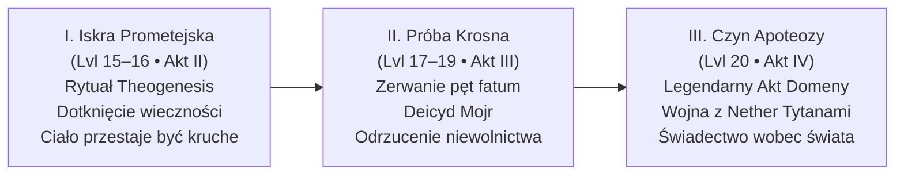

# 03 - Bohaterowie Graczy i Ścieżka Boskości (Poziomy 13–20)

Kompleksowa księga bohaterów graczy oraz mitycznej Ścieżki Boskości (*The Divine Path*). Zawiera filozofię Apoteozy, mechanikę Trzech Stopni Wstąpienia, szczegółowe dossier każdego z 5 Bohaterów Przepowiedni (domknięcia z S1–84, haki, dylematy, Czyny Apoteozy i Nowy Panteon) oraz analizę spotlightu i balansu drużyny.

---

# CZĘŚĆ I: Ścieżka Boskości, Theogenesis i Zasady Apoteozy

> *„Śmiertelnicy marzą o nieśmiertelności. Nigdy nie marzą o tym, ile ona kosztuje.”*  
> — **Narsus**

Niniejszy dokument przedstawia **epicko-narracyjną rekonstrukcję Ścieżki Boskości (*The Divine Path*)** dla kontynuacji kampanii. Zastępuje on suchą, czysto mechaniczną „listę zakupów” z podręcznikowego *Appendix D* (zabij potwory o łącznym CR 100, ukuj przedmiot, daj się wskrzesić) wielopoziomowym dramatem mitycznym, w którym boskość jest **filozoficznym wyborem, przezwyciężeniem własnej klątwy i aktem ukształtowania nowego porządku świata**.

---

## 1. Natura Boskości w Thylei — Czym jest Apoteoza?

W świecie Thylei boskość nie jest kolejnym poziomem doświadczenia ani magicznym wzmocnieniem statystyk. Boskość to **stanie się filarem rzeczywistości**.

### Trzy Grzechy Poprzednich Pokoleń Bogów
Wszyscy poprzedni władcy Thylei ponieśli porażkę z powodu tej samej fundamentalnej skazy:
1. **Bliźniaczy Tytani (Sydon i Lutheria):** Utożsamiali boskość z bezwzględną tyranią i prawem silniejszego. Żądali ofiar z krwi i strachu, traktując śmiertelników jak bydło.
2. **Pięciu Bogów (Mytros, Volkan, Pythor, Vallus, Kyrah):** Byli lepsi, lecz związali się z jednym miastem, popadli w ludzkie nałogi i depresję ([[Pythor]]), cynizm lub bezradność, a ich moc wygasała wraz z upływem wieków.
3. **Uwięzieni Hyperioni (Zatopione Królestwo / Phaeros):** Przyjęli boskość od anioła Phaerosa jako prezent, bez moralnej dojrzałości. Tysiąclecia w mroku zamieniły ich w zgorzkniałe potwory żądne odwetu na świecie.
4. **Hodowla Mojr (Dług Krwi):** Każdy dotychczasowy pretendent (w tym [[Narsus]]) wstępował na Olimp spętany *Przysięgą Służby (Oath of Service)* u Krosna Losu. Ich boskość była kredytem, a [[Mojry]] były lichwiarzami.

### Nowa Teologia Bohaterów
Bohaterowie Przepowiedni nie mogą po prostu „zająć wolnych stołków”. Ich apoteoza to **zerwanie z cyklem pychy i długu**. Stają się bóstwami nie dlatego, że posiedli potęgę, lecz dlatego, że **wzięli na barki ciężar, którego nikt inny nie potrafił unieść**, zachowując ludzkie serce.

---

## 2. Trzy Stopnie Apoteozy (Fabuła zamiast Tabelki)

Ścieżka do boskości nie realizuje się w jednym rzucie kością. Jest to ewolucja rozłożona na całą drugą połowę kampanii (poziomy 13–20):

---

### Stopień I: Iskra Prometejska (*The Divine Spark*)
* **Kiedy:** Finał Aktu II (po zdobyciu Kaduceusza, Ambrozji i Ognia Prometejskiego w Zatopionym Królestwie).
* **Wymiar Fabularny:** Rytuał *Theogenesis* w Arezji. To zestrojenie trzech pierwotnych esencji:
  * **Ogień Prometejski** (światło stworzenia ukradzione przez anioła Phaerosa),
  * **Ambrozja** (charyzma i witalność czystego ducha),
  * **Kaduceusz** (władza nad granicą życia i śmierci).
* **Objawy u Bohaterów:**
  * Ciało przestaje ulegać chorobom i starości.
  * Oczy, głos lub cień bohatera zaczynają rezonować z jego rodzącą się domeną (np. kroki Orestesa pachną świeżym chmielem i miodem; wokół Felicjana powietrze drży czystą formułą arkaniczną; w cieniu Versira widać złote i srebrne promienie zaginionych tytanów; w spojrzeniu Arevona odbijają się konstelacje innego wymiaru; w głosie Oriona słychać odległy grzmot).
  * **Haczyk fabularny:** Bohaterowie widzą, jak Narsus zostaje spętany niewidzialnymi nićmi Mojr (*Oath of Service*). Dowiadują się, że ich Iskra jest niepełna — dopóki Mojry kontrolują Krosno, każda pełna boskość będzie niewolnictwem.

---

### Stopień II: Próba Krosna — Zerwanie Niewolnictwa (*The Crucible of Fate*)
* **Kiedy:** Akt III (Pucz na Wyspie Mojr).
* **Wymiar Fabularny:** Prawdziwy bóg nie może być czyimś dłużnikiem. Przejście przez Wyspę Mojr to **egzamin z suwerenności**:
  * Bohaterowie muszą skonfrontować się z własnymi paktami z przeszłości (poświęcone zdrowie [[Felicjan Janus Twardowski|Felicjana]], szybkość [[Arevon Elorrenthi|Arevona]], dziecko [[Orion Xul|Oriona]], śmierć [[Orestes|Orestesa]]).
  * Zamiast kupować łaskę losu — **biorą odpowiedzialność za los we własne ręce**.
  * Ścięcie nici Mojr przez trzy nowe tkaczki usuwa „klauzulę długu”. Od tej pory ich ścieżka do boskości zależy wyłącznie od ich własnych czynów i woli ludu Thylei.

---

### Stopień III: Czyn Apoteozy (*The Domain Apotheosis*)
* **Kiedy:** Kulminacja Aktu IV (w trakcie wojny z Nether Tytanami i upadku Pałacu Hyperionów).
* **Czym jest Czyn Domenowy?** 
  Zamiast podręcznikowego „zabij potwory o CR 100 w 24 godziny”, Czyn Apoteozy to **ostateczna próba filozoficzna**. To moment, w którym bohater w obliczu absolutnego kryzysu Thylei **definiuje, czym odtąd będzie jego domena w nowym panteonie**, przełamując klątwę swojego życia na oczach śmiertelników.

---

## 3. Domeny i Mityczna Droga dla Każdego z Bohaterów

---

### 1. [[Versir]] — Bóg Czasu, Przeznaczenia i Nowego Sądu
*(The God of Time, True Destiny, and the Golden Fruit)*

* **Tło i Archetyp:** Aasimar, syn pierwszej Wyroczni Versi, wychowany na Wyspie Czasu, noszący w Rękawicy esencję pomordowanych Zaginionych Tytanów (Yali, Chalcii, Talieusa Pierwszego).
* **Sugerowane Domeny:** **Czas i Wieczność (Time/Twilight) / Sprawiedliwość i Przeznaczenie (Order/Fate)**.
* **Tytuły Mityczne:** *Pan Złotego Owocu, Strażnik Nici, Wieczny Rozjemca, Syn Wyroczni*.
* **Symbol Święty:** Rękawica ze smoczej kości trzymająca złoty owoc na tle tarczy słoneczno-księżycowej.

#### Dylemat i Filozofia Boskości:
Versir przez stulecia uciekał przed czasem, a teraz widzi, jak śmiertelna [[Astra]] starzeje się u jego boku. Dotychczasowi bogowie przeznaczenia ([[Mojry]]) manipulowali losem jak lichwiarze. Versir ma stać się bóstwem, które **chroni czas przed manipulacją**, dając śmiertelnikom prawo do pisania własnej historii.

#### Legendarny Czyn Apoteozy (Zamiast mechaniki):
> **„Ukojenie Sturękiego i Zamknięcie Koła Eonów”**  
> W obliczu kataklizmu Apokalypsis, gdy pradawne pieczęcie pękają, Versir nie używa przemocy, by unicestwić swoje potworne dziedzictwo. Staje w sercu załamanego czasu, uwalnia esencje pomszczonych krewnych z Rękawicy, przekształcając ich ból w trwałe prawa chroniące śmiertelników, i kładzie kres eonowi nienawiści między dziećmi Kentimane'a a ludźmi. Jego aktem wstąpienia jest darowanie wolnej woli całemu kontynentowi.

---

### 2. [[Orion Xul]] — Bóg Honoru, Odwagi i Wyzwolenia spod Ojcowskiego Cienia
*(The God of Valor, Protective War, and Redemptive Paternity)*

* **Tło i Archetyp:** Półbóg, syn [[Pythor|Pythora]] (boga wojny i pijaństwa). Wojownik, który całe życie zabijał na rozkaz innych, porzucił [[Lyra|Lyrę]] tak samo jak ojciec Hexię, a za ulepszenie włóczni spłodził córkę z wiedźmą.
* **Sugerowane Domeny:** **Wojna Obronna i Męstwo (War - Protection/Valour) / Piorun i Przysięgi (Tempest/Honor)**.
* **Tytuły Mityczne:** *Tarcza Słabych, Grom Odkupienia, Włócznia Nowego Świtu, Pogromca Ojcowskiej Klątwy*.
* **Symbol Święty:** Strzaskany puchar na tle złotej włóczni spowitej błękitnym piorunem.

#### Dylemat i Filozofia Boskości:
Pythor był bogiem rzezi, chwały, a potem żałosnego upadku i ucieczki w alkohol. Orion musi przedefiniować pojęcie boga wojny: **wojna nie służy podbojom ani dumie królów — służy temu, by niewinni mogli spać spokojnie**. Boskość Oriona to także triumf dojrzałego ojcostwa nad egoizmem czempiona.

#### Legendarny Czyn Apoteozy (Zamiast mechaniki):
> **„Tarcza Przed Zagładą — Odkupienie Krwi”**  
> Gdy Nether Tytan (Behemot lub Smok Pustki) uderza na bezbronne miasto (Estorię lub osadę, w której schroniła się Ione/Lyra), Orion nie szuka własnej chwały. Staje samotnie w wyłomie muru, przyjmując na swoją tarczę cios, który miał zrównać z ziemią tysiące istnień. Przebijając bestię [[Odkupienie Pythora|Odkupieniem Pythora]], rozrywa nie tylko ciało potwora, ale i klątwę rodu Pythora: udowadnia, że prawdziwy bóg wojny ginie za swoich wyznawców, zamiast wysyłać ich na rzeź. W tej eksplozji światła wstępuje do niebios.

---

### 3. [[Felicjan Janus Twardowski]] — Bóg Magii, Mądrości i Nowego Przymierza
*(The God of Arcana, Rational Wisdom, and the Dragonbond)*

* **Tło i Archetyp:** Syn kowala, uczeń Epikura, który pokonał strach przed porażką. Wskrzesiciel Zakonu Smoczych Lordów, mąż Melanii, człowiek budujący instytucje prawne, szkoły i szpitale zamiast pałaców tyrana.
* **Sugerowane Domeny:** **Magia i Tajemnice (Arcana) / Wiedza i Porządek Społeczny (Knowledge/Order)**.
* **Tytuły Mityczne:** *Architekt Nowej Ery, Płomień Rozumu, Pan Przysięgi Smoczej, Patron Uczonych*.
* **Symbol Święty:** Otwarta księga ze srebrnym piórem, spoczywająca między skrzydłami smoka i młotem kowalskim.

#### Dylemat i Filozofia Boskości:
Felicjan całe życie widział, jak magia i boskość były używane do zniewalania ludzi (Sydon, Acastus, Taran). Jego wizja boskości jest **oświeceniowa**: wiedza i magia muszą należeć do wszystkich, a bogowie nie mają prawa blokować rozwoju śmiertelników. To bóg, który zakłada szkoły, a nie świątynie strachu.

#### Legendarny Czyn Apoteozy (Zamiast mechaniki):
> **„Wykucie Wiecznego Paktu Magii i Smoków”**  
> W chwili, gdy magia Thylei załamuje się pod wpływem Kamienia Apokalipsy, Felicjan jednoczy umysły wszystkich ocalałych smoków i arkanistów krainy. Zamiast uciekać się do boskiego cudu z niebios, tworzy genialną konstrukcję arkaniczną, która naprawia sfery rzeczywistości. Wypowiadając po raz kolejny pradawną przysięgę na grzbiecie [[Kairos|Kairosa]], staje się żywym ucieleśnieniem Magii Thylei — siły, która nie domaga się ślepej wiary, lecz zrozumienia i odwagi myślenia.

---

### 4. [[Orestes]] — Bóg Radości Życia, Wyzwolenia i Śmiechu w Twarz Śmierci
*(The God of Revelry, Liberation, Outcasts, and Defiance of Death)*

* **Tło i Archetyp:** Minotaur, wyrzutek z browaru satyrów, dawny pechowiec. Zabił Lutherię [[Topór Xandera|Toporem Xandera]], roztrzaskał Kryształową Kosę, uwolnił tysiące dusz (w tym rodziców), przeszedł przez śmierć i wrócił z zaświatów. Otworzył muzeum na [[Ultros|Ultrosie]] i warzy piwo w Orestessos.
* **Sugerowane Domeny:** **Biesiada i Wyzwolenie (Revelry/Freedom - Dionizyjski archetyp dobra) / Życie i Przejście (Life/Grave - obrońca przed męką zaświatów)**.
* **Tytuły Mityczne:** *Królobójca Koszmarów, Piwowar Wolnych Dusz, Pan Ostatniego Toastu, Opiekun Wyrzutków*.
* **Symbol Święty:** Pęknięta kryształowa czaszka zamieniona w kufel spienionego piwa, przepasana wieńcem chmielowym.

#### Dylemat i Filozofia Boskości:
Świat bał się śmierci, bo Lutheria uczyniła z zaświatów obóz tortur i koszmarów. Orestes jako jedyny spojrzał śmierci w twarz, zabił jej panią i wypił za to piwo z rodzicami. Jego boskość to **odczarowanie grozy**: śmierć ma być godnym spoczynkiem po dobrze przeżytym życiu, a za życia liczy się wspólnota, śpiew, wolność i pomoc tym, których nikt nie chce (minotaurom, banitom, kalekom).

#### Legendarny Czyn Apoteozy (Zamiast mechaniki):
> **„Ostatni Hymn i Wielki Toast Zaświatów”**  
> Gdy Lutheria próbuje zmartwychwstać i wciągnąć Thyleę w wieczny koszmar przez arkaniczny hymn z Sesji 84, Orestes wychodzi naprzeciw jej potęgi. Nie recytuje formuł magów — ryczy w niebiosa swoją własną, biesiadną wersję pieśni, którą ułożył w browarze. Dysonans arkaniczny rozrywa mroczny rytuał bogini śmierci na strzępy. Minotaur jednym ciosem topora rozbija w pył fundamenty męki dusz, ogłaszając, że odtąd zaświaty są wolną przystanią, a każdy śmiertelnik ma prawo do radości. W huku gromów i śmiechu biesiadników wstępuje jako bóg wolnych dusz.

---

### 5. [[Arevon Elorrenthi]] — Bóg Gwiazd, Kosmicznych Szlaków i Pamięci Świata
*(The God of the Stars, Horizonguides, and the Cosmic Weave)*

* **Tło i Archetyp:** Elf z domu Phiarlan w Eberronie. Katastrofa przeniosła go do zamkniętego wymiaru Thylei. Nawigator, druid kręgu gwiazd, przez 15 lat bezskutecznie szukający Zatopionego Królestwa, kronikarz i badacz zaginionych prawd.
* **Sugerowane Domeny:** **Gwiazdy i Kosmos (Stars/Twilight) / Natura i Morze (Nature/Tempest) / Podróż i Horyzont (Travel/Knowledge)**.
* **Tytuły Mityczne:** *Gwiezdny Żeglarz, Otwierający Bramy Sfer, Strażnik Prawdy, Pasterz Prądów*.
* **Symbol Święty:** Astrolabium [[Antikythera|Antikythery]] wpisane w ośmioramienną srebrną gwiazdę z liściem dębu w centrum.

#### Dylemat i Filozofia Boskości:
Thylea przez tysiąclecia była klaustrofobicznym więzieniem odciętym od reszty wieloświata przez tyranię Tytanów. Arevon reprezentuje tęsknotę za bezkresem, ciekawość innych światów i głęboki szacunek do natury, która nie jest własnością żadnego boga. Boskość Arevona to **otwarcie granic i zburzenie murów izolacjonizmu**.

#### Legendarny Czyn Apoteozy (Zamiast mechaniki):
> **„Wyrwanie Thylei z Otchłani Zapomnienia”**  
> Podczas szaleństwa Apokalypsis, gdy Kraken i bestie głębinowe próbują zatopić wybrzeża, a świat dusi się w chmurach popiołu, Arevon staje na szczycie najwyższego klifu z [[Antikythera|Antikytherą]]. Korzystając z mocy odzyskanego Ognia Prometejskiego i pamięci gwiazd swojego rodzinnego świata, druid rozprasza wieczną mgłę spowijającą Zapomniane Morze. Łączy prądy Thylei z gwiezdnymi rzekami kosmosu, ratując ekosystem kontynentu i wytyczając bezpieczny szlak żeglugi między wymiarami. Wstępuje w gwiezdnej poświacie jako bóg nawigatorów i wolnych podróżników.

---

## 4. Porównanie: Zasady z Podręcznika vs Propozycja Fabularna

| Aspekt | Wersja REMASTER (Appendix D) | Nowa Propozycja Fabularna |
|---|---|---|
| **Początek drogi** | Zakup rytuału u Narsusa na 13 lvl | Trudna ekspedycja po 3 relikwie; odkrycie, że Narsus jest zadłużony u Mojr |
| **Iskra Boska** | Mechaniczny buff do statystyk | Eteryczna przemiana ciała, manifestacja aury domeny, dylemat śmiertelności bliskich |
| **Kwalifikacja do Boskości** | Grind: zabij CR 100 w 24h, ukuj przedmiot | **Czyn Apoteozy:** Przełamanie życiowej traumy bohatera i ocalenie świata w obliczu Apokalipsy |
| **Rola Fatum i Przeznaczenia** | Brak wątku Krosna | **Pucz na Mojry (Akt III):** Obalenie lichwiarzy losu, by boskość nie była niewolnictwem |
| **Relacja ze Śmiertelnikami** | Gracz przechodzi na emeryturę jako NPC | **Wybór:** Wstąpienie na niebiosa (nowy Olimp) LUB pozostanie Śmiertelnym Bogiem-Opiekunem stąpającym po ziemi |

---

## 5. Jak Przeprowadzić to przy Stole (Wskazówki dla MG)

1. **Wprowadzaj Domeny Stopniowo:**
   * Nie każ graczom deklarować domen od razu w Sesji 85.
   * W Akcie I (Arezja) rzucaj subtelne pytania: *„Orestesie, kiedy patrzysz na tych przerażonych ludzi w błocie, jak myślisz, czego im najbardziej brakuje — siły do walki czy powodu, by uśmiechnąć się przy ognisku?”*.
   * W Akcie II (Zatopione Królestwo) skonfrontuj ich z wypaczonymi Hyperionami: niech każdy z 8 uwięzionych bogów będzie krzywym zwierciadłem któregoś z bohaterów.
2. **Katalizator Czynu Apoteozy:**
   * Czyny Apoteozy powinny nastąpić naturalnie podczas starć z Nether Tytanami w Akcie IV (Sesje 112–115). Każdy bohater powinien otrzymać swój moment chwały, w którym ratuje krainę w sposób zgodny ze swoją filozofią.
3. **Konsekracja Nowego Panteonu:**
   * W finale kampanii (Sesja 120) zorganizuj ceremonię, w której nowa Wyrocznia (lub ocalona Ione przy Krośnie) wyśpiewuje imiona i domeny Nowego Panteonu, a rzeźbiarze w Mytros, Arezji i Estorii po raz pierwszy stawiają posągi Pięciu Nowych Bogów.

---

# CZĘŚĆ II: Księga Bohaterów — Dossier, Wątki, Haki i Czyny Apoteozy

**Data analizy:** 19 września 2026 r.  
**Autor:** Redakcja i Zespół Projektowania Narracji D&D 5e  
**Status dokumentu:** Oficjalna Recenzja Wewnętrzna (Design Review)  
**Dotyczy:** Bohaterowie Przepowiedni (Poziomy 13–20) w kontynuacji kampanii *Odyseja Smoczych Władców*  

---

## Streszczenie Wykonawcze (*Executive Summary*)

Niniejszy raport stanowi całościową ocenę dramaturgiczną, psychologiczną i mechaniczną pięciu postaci graczy (**Bohaterów Przepowiedni**) w projekcie kampanii *Nowa Era*. Analiza bada spójność wątków z minionych 84 sesji (oraz 15-letniego przeskoku czasowego), ocenia rozkład uwagi Mistrza Gry (*spotlight index*) w strukturze 4 Aktów oraz weryfikuje propozycje mitycznej Ścieżki Boskości (*The Divine Path* / Apoteoza).

W toku analizy zidentyfikowano szereg mocnych punktów — przede wszystkim mistrzowskie przekształcenie suchego podręcznikowego grindu CR 100 w **filozoficzny Czyn Apoteozy**, splecenie postaci [[Undecima|Undecimy (Ione)]] z grzechem [[Orion Xul|Oriona]] oraz zakotwiczenie powrotu [[Lutheria|Lutherii]] w pieśni [[Orestes|Orestesa]]. 

Jednocześnie zidentyfikowano **dwie luki krytyczne** i **cztery kwestie o wysokim priorytecie**:
1. **[KRYTYCZNY] Pasywność Versira w Akcie I:** [[Versir]] posiada najsilniejszy wątek w całej drugiej połowie kampanii (deicyd Mojr), lecz w Akcie I (Arezja) jest zepchnięty do roli biernego badacza bibliotek, podczas gdy inni bohaterowie gaszą pożary wojny. Wymaga to natychmiastowego zakorzenienia w intrydze Arezji (wątek Świątyni Cieni i immunitetu dynastii Calliope).
2. **[KRYTYCZNY] Niedoreprezentowanie Arevona w Aktach I i III:** [[Arevon Elorrenthi|Arevon]] dominuje w Akcie II (Zatopione Królestwo), lecz w Aktach I i III grozi mu syndrom „pasażera”. Zaproponowano włączenie go w ekologiczne śledztwo na Półwyspie Arezyjskim oraz powiązanie mechanizmu [[Antikythera|Antikythery]] z Krosnem Losu w Akcie III.
3. **[WAŻNY] Zagrożenie redukcją sprawczości Felicjana w zadaniach terenowych:** [[Felicjan Janus Twardowski|Felicjan]] bryluje w polityce Mytros, lecz potrzebuje twardych wyzwań arkanicznych w Kurhanach Karpathosa oraz Zatopionym Królestwie (dekompilacja *Theogenesis*).
4. **[WAŻNY] Rola Ione a iluzja wyboru:** Mechanika ocalenia Ione z Krosna nie może być czystym „skryptem MG” — musi wymagać realnej ofiary lub ryzyka ze strony Oriona.

Poniżej znajduje się szczegółowa ewaluacja każdego z 5 herosów, analiza balansu grupy oraz skonsolidowany rejestr uwag.

---

## Część I: Indywidualna Analiza Bohaterów Przepowiedni

---

### 1. [[Versir]] (Aasimar Paladin/Sorcerer — Epicka Ścieżka: [[Epickie Ścieżki#The Timeless One (Wieczny)|The Timeless One / Wieczny]])

#### A. Domykanie Wątków z Przeszłości
* **Śmierć matki ([[Versi Pierwsza]]):**  
  Dawna Wyrocznia została zamordowana przez [[Lutheria|Lutherię]] w cynicznym spisku z [[Mojry|Mojrami]]. Przez całą pierwszą część kampanii Versir odkrywał, że Mojry nie były neutralnymi obserwatorkami, lecz aktywnie wspierały Tytanów w Pierwszej Wojnie. W [[Sesja 47 - Wyspa Mojr|Sesji 47]] wiedźmy podsunęły mu fałszywą wizję jego śmierci z rąk Lutherii — fakt, że to [[Orestes]] ściął Tytankę w Sesji 82, definitywnie obnażył ich kłamstwa. W *Nowej Erze* wątek ten uzyskuje absolutne domknięcie: deicyd Mojr nie jest dla Versira aktem boskiej pychy, lecz sprawiedliwą, chirurgiczną egzekucją za zdradę matki.
* **Esencje Zaginionych Tytanów w Rękawicy:**  
  Versir nosi na ramieniu [[Hand of Kentiname|Rękawicę ze Smoczej Kości]] stopioną z jego kikutem (po utracie dłoni w Sferze Anihilacji w Sześcianie Więziennym, S65). Wchłonął dotąd esencje:
  * ciotki [[Yala Pierwsza|Yali Pierwszej]] (Hades, S61),
  * ciotki [[Chalcia Pierwsza|Chalcii Pierwszej]] (Wyspa Ognia, S38),
  * wuja [[Hergeron Pierwszy|Hergerona Pierwszego]] (Praxys, S75),
  * wuja [[Talieus Pierwszy|Talieusa Pierwszego]] (Hypnos, S84).  
  W jego rodowym panteonie brakuje już tylko jednego uwięzionego krewnego: wuja [[Goloron Pierwszy|Golorona Pierwszego]] (Tytana Mądrości).
* **Uwięziony Goloron Pierwszy w Zatopionym Królestwie:**  
  *Nowa Era* domyka tę sagę w Akcie II (Nowa Egea). Odnalezienie skamieniałego Golorona na dnie Zatoki Cerulańskiej i wchłonięcie/wyzwolenie jego esencji do Rękawicy stanowi logiczne dopełnienie rodowej spuścizny Versira tuż przed wielkim puczem na Krosno w Akcie III.
* **Glewia Sydona i Barka Hypnos:**  
  Przejęte w Sesji 84 artefakty stawiają Versira w pozycji morskiego i sferycznego protektora, dając mu narzędzia do żeglugi ku zapomnianym domenom.

#### B. Nowe Haki Osobiste
* **[[Astra]] i Przemijanie (Tragedia Wiecznego):**  
  Jako nienaruszony przez czas aasimar, Versir nie zestarzał się ani o dzień przez 15 lat downtime'u. Astra — śmiertelniczka — zestarzała się szlachetnie, siwiejąc i zbliżając się do jesieni życia (`07 - Scenariusz Otwarcia`, Sekcja 2.3.5). To generuje u Versira głęboki lęk przed bezsilnością, który popycha go do buntu przeciwko obiektywnym prawom czasu i prawom Krosna.
* **Deicyd Mojr i Pucz na Krosno:**  
  Odkrycie w Akcie II, że Mojry hodują spętanych bogów (*Oath of Service* u Narsusa), przekształca prywatną vendettę Versira w misję ocalenia całego panteonu Thylei. Versir wie, że Mojr nie da się zabić orężem — ich nici muszą zostać odcięte na ich własnym krośnie przez prawomocne sukcesorki.
* **Dylemat Moralny III Kandydatki na Krosno:**  
  Versir zabezpieczył dwa fotele: [[Wiedźma Lotosu]] (Fotel I) oraz [[Versi]] (Fotel II). Trzeci fotel to serce dramatyczne Aktu III:
  * *Opcja Astra:* Uratowałaby Astrę przed śmiercią i starością, czyniąc ją bezczasową tkaczką — lecz Krosno wypaliłoby w niej ludzkie emocje, empatię i miłość do Versira. Stałaby się chłodną istotą kosmiczną.
  * *Opcja Lyra:* Uleczenie ran rodu Pythora i Oriona, lecz oddanie w ręce porzuconej kobiety nożyc do losu jej dawnego kochanka.
  * *Opcja Despina / Hexia:* Nieprzewidywalne konsekwencje wprowadzenia arkanicznej lub smoczej siły do węzłów losu.

#### C. Moment Kulminacyjny i Czyn Apoteozy
* **Tytuł i Domeny:** Bóg Czasu, Przeznaczenia i Nowego Sądu (*The God of Time, True Destiny, and the Golden Fruit*). Domeny: **Czas/Zmierzch (Time/Twilight)** oraz **Porządek/Przeznaczenie (Order/Fate)**.
* **Czyn Apoteozy — „Ukojenie Sturękiego i Zamknięcie Koła Eonów”:**  
  W Akcie IV, gdy Kentimane lub szczeliny czasu zagrażają Thylei, Versir staje w epicentrum załamania. Zamiast niszczyć pierwotne siły, wyciąga [[Zlote Owoce|Złoty Owoc]] (odzyskany w S39/S83) i uwalnia pomszczone esencje Zaginionych Tytanów z Rękawicy, integrując ich cierpienie w nienaruszalne prawa chroniące śmiertelników. Nadaje czasowi Thylei stabilność, uwalniając ludzi od kosmicznej lichwy.

#### D. Analiza Roli w Aktach I–IV i Propozycje Poprawek
| Akt | Obecny Stan w Planie | Ocena | Propozycja Usprawnienia / Poprawki |
|---|---|---|---|
| **Akt I** | Pasywne tło w Mytros; badanie bibliotek; wyczekiwanie na rozwój wypadków w Arezji. | **KRYTYCZNY:** Gracz może czuć się wyobcowany z polityczno-militarnego kotła Arezji. | **Włączenie w śledztwo w Arezji:** To Versir (jako syn Wyroczni) powinien badać archiwa Świątyni Cieni i odkryć starożytny dekret o immunitecie dynastii Calliope. Niech to Versir zdemaskuje wampiryczną nekromancję Karpathosa jako pogwałcenie praw czasu i śmierci. |
| **Akt II** | Ostrzeżenie Phaerosa jako lustro pychy; odnalezienie wuja Golorona. | **BARDZO DOBRY:** Mocny emocjonalny rezonans z aniołem i rodziną tytanów. | Pogłębić scenę uwalniania Golorona Pierwszego — niech Goloron przekaże Versirowi kluczową wskazówkę dotyczącą konstrukcji Krosna Mojr. |
| **Akt III** | Główny reżyser puczu na Krosno; wybór tkaczek; deicyd. | **DOSKONAŁY:** Absolutny szczyt spotlightu Versira. | Zadbać, by wybór III kandydatki był debatą całej drużyny, a nie solową decyzją Versira. |
| **Akt IV** | Przejęcie domeny Czasu; rozjemca w starciu ze Sturękim; apoteoza. | **BARDZO DOBRY:** Epickie zwieńczenie. | Zapewnić mechaniczne wsparcie dla aury Czasu w starciu z Nether Tytanami (np. manipulacja inicjatywą i reakcjami sojuszników). |

---

### 2. [[Orion Xul]] (Half-Elf Fighter — Epicka Ścieżka: [[Epickie Ścieżki#The Demi-God (Półbóg)|Demigod / Półbóg]])

#### A. Domykanie Wątków z Przeszłości
* **[[Pythor]] i Klątwa Ojcowskiego Egoizmu:**  
  Orion przez 84 sesje zmagał się z dziedzictwem ojca — boga bitwy, który uciekał w alkohol, melancholię i rzeź. W Sesji 84 Orion doprowadził do rozejmu Pythora z [[Hexia|Hexią]], lecz ostatnie 15 lat spędził na bezcelowym treningu w pyle na pograniczu (`07 - Scenariusz Otwarcia`, Sekcja 2.3.4), obserwując jak ojciec topi resztki boskości w winie.
* **Grzech Wobec [[Lyra|Lyry]] (Powtórzenie Winy Ojca):**  
  Najciemniejsza plama na honorze Oriona: w Sesji 84 porzucił bezgranicznie oddaną mu Lyrę bez rozmowy i bez pożegnania — powtarzając w skali 1:1 grzech, jaki Pythor popełnił wobec Hexii 500 lat wcześniej. W *Nowej Erze* Orion musi stanąć twarzą w twarz z tą hańbą.
* **Pakt z [[Nona|Noną]] z Sesji 47:**  
  Orion był jedynym bohaterem, który zgodził się na intymny, upokarzający układ z wiedźmą na Wyspie Mojr: oddał swoje nasienie w zamian za naostrzenie i ulepszenie włóczni [[Odkupienie Pythora]]. Cena tego egoistycznego aktu uderza w niego po 15 latach.

#### B. Nowe Haki Osobiste
* **[[Undecima|Undecima (Ione Xul)]] — 15-letnia Córka:**  
  Ione to żywe ucieleśnienie jego winy z Sesji 47. Dziewczyna jest dziwna, obca i niepokojąca: kompulsywnie pruje nitki z ubrań rozmówców, waży w palcach napięcie wątku cudzego życia, ocenia ludzi w kategoriach „bliskości zbutwienia”, a pod opaską na czole kryje jarzące się oko Nony. Drużyna waha się, czy można jej zaufać — czy uciekła z ciekawości do ojca, czy jest idealnym koniem trojańskim kowenu. Patrzy na Oriona bez czułości, ważąc go wzrokiem: *„Jesteś zrobiony z grubej, szorstkiej wełny, Orionie. Dużo krwi w ciebie wsiąkło. Pokaż mi tę włócznię, za którą mnie sprzedałeś. Chcę zobaczyć, czy było warto”*.
* **Pułapka Warkocza Krosna (Żywa Tarcza):**  
  Nić Ione jest wpleciona jako czwarte pasmo warkocza samych Mojr. Ścięcie wiedźm przez Versira bez wcześniejszego rozplecenia warkocza oznacza natychmiastowe spalenie duszy Ione. Orion musi podjąć heroiczny wysiłek ojcowskiego odkupienia, by rozsupłać ten węzeł.
* **Konfrontacja z Lyrą:**  
  Lyra powraca w toku kampanii (potencjalna III tkaczka lub dowódczyni w Mytros/Estorii). Orion nie zyska boskości wojennej opartej na honorze, dopóki nie przeprosi kobiety, którą porzucił.

#### C. Moment Kulminacyjny i Czyn Apoteozy
* **Tytuł i Domeny:** Bóg Honoru, Wojny Obronnej i Wyzwolenia spod Ojcowskiego Cienia (*The God of Valor, Protective War, and Redemptive Paternity*). Domeny: **Wojna Obronna (War - Protection/Valour)** oraz **Piorun/Przysięgi (Tempest/Honor)**.
* **Czyn Apoteozy — „Tarcza Przed Zagładą — Odkupienie Krwi”:**  
  Podczas najazdu Nether Tytanów (np. Behemota na Estorię lub uderzenia Smoka Pustki na schronienie Ione/Lyry), Orion nie szuka własnej chwały. Staje samotnie w wyłomie muru, przyjmując na tarczę cios niszczący góry. Przebijając bestię włócznią [[Odkupienie Pythora]], definiuje na nowo istotę boga wojny: bóg wojny nie posyła innych na śmierć dla własnego ego — bóg wojny staje się tarczą, by niewinni mogli żyć.

#### D. Analiza Roli w Aktach I–IV i Propozycje Poprawek
| Akt | Obecny Stan w Planie | Ocena | Propozycja Usprawnienia / Poprawki |
|---|---|---|---|
| **Akt I** | Demobilizacja obozu pod Arezją; wejście Ione (S86–87); starcie z Zakrothem. | **BARDZO DOBRY:** Pojawienie się Ione natychmiast wstrząsa psychiką gracza. | **Wzmocnienie wątku militarnego:** Niech Orion skonfrontuje się w obozie z gladiatorem Maximusem i fanatycznymi kultystami Pythora, którzy wypaczają imię jego ojca. |
| **Akt II** | Eksploracja Nowej Egei; konfrontacja z Hyperionem Thalakronem (wypaczonym bogiem rzezi). | **DOBRY:** Thalakron służy jako zwierciadło upadku wojownika. | Dodać scenę, w której Orion uczy Ione podstaw samoobrony i walki wręcz, przełamując jej chłód wiedźmy prostą ojcowską troską. |
| **Akt III** | Rozplecenie warkocza Ione na Wyspie Mojr; zerwanie paktu z Noną. | **KRYTYCZNY / KLUCZOWY:** To musi być wielki moment dramatyczny. | **Wymóg ofiary:** Rozplecenie warkocza nie może udać się samym rzutem na Athletics/Sleight of Hand. Orion musi wbić [[Odkupienie Pythora]] w Krosno lub przyjąć na siebie klątwę Nony, ryzykując utratę własnej boskiej krwi. |
| **Akt IV** | Ostateczna obrona Estorii; poprowadzenie armii śmiertelników; wstąpienie. | **DOSKONAŁY:** Klasyczne, potężne zwieńczenie archetypu obrońcy. | Scena pojednania z Pythorem: stary bóg z dumą oddaje synowi puchar i broń, odchodząc na zasłużony spoczynek. |

---

### 3. [[Felicjan Janus Twardowski]] (Human Wizard — Epicka Ścieżka: [[Epickie Ścieżki#The Gifted One (Utalentowany)|The Gifted One / Utalentowany]])

#### A. Domykanie Wątków z Przeszłości
* **Dziedzictwo Despiny i Oczyszczenie Rodu:**  
  Prababka Despina, zdrajczyni Smoczych Lordów, znalazła spokój w Sesji 81, gdy jej dusza zasiedliła ciało poległej smoczycy [[Nephele (Smok)|Nephele]]. Felicjan zdjął klątwę zdrady ciążącą na jego nazwisku.
* **Pakt z Mojrami i Utrata Połowy Leczenia (Sesja 48):**  
  Felicjan oddał Mojrom połowę efektywności wszelkiego leczenia (*„każde zaklęcie leczące przywraca mu połowę punktów życia”*) w zamian za ulepszenie korony i ocalenie smoczych jaj. Od 15 lat żyje z nieustanną świadomością kruchości swojego ciała — każda rana goi się z trudem.
* **Wskrzeszenie Zakonu Smoczych Lordów na Yonder:**  
  W Sesji 48 Felicjan jako pierwszy od wieków wypowiedział działającą formułę przysięgi, wiążąc się z brązowym smokiem [[Kairos|Kairosem]]. Przez 15 lat odbudował twierdzę na [[Wyspa Yonder|Wyspie Yonder]], zabezpieczył bibliotekę glinianych tabliczek Gyganów i stworzył nową kadrę jeźdźców (`07 - Scenariusz Otwarcia`, Sekcja 2.3.1).

#### B. Nowe Haki Osobiste
* **Architektura Republiki Mytros vs Imperializm:**  
  Felicjan to uczeń Epikura i syn kowala — nie wierzy w monarchię absolutną ani w rządy prawa silniejszego. Przez 15 lat tworzył instytucje miejskie, szkoły arkaniczne i system podatkowy.
* **Neutralność Zakonu a Militaryzm Tarana:**  
  [[Taran Neurdagon]] żądał wysłania smoków Felicjana, by spalić spichlerze Arezji z powietrza. Felicjan twardo zablokował te zapędy, nakładając na machinę wojenną Tarana drakońskie podatki i kontrolę senacką (`03 - Wojna Mytros-Arezja`, Sekcja 4).
* **Badanie Arkanów Theogenesis i Wolność Wiedzy:**  
  Jako arcymag, Felicjan bada zjawisko Theogenesis z pozycji naukowej. Nie interesuje go ślepy kult — chce zrozumieć metafizyczną mechanikę boskości. Odkrycie, że rytuał Mojr to lichwiarska smycz (*Oath of Service*), czyni z niego kluczowego analityka wyprawy.

#### C. Moment Kulminacyjny i Czyn Apoteozy
* **Tytuł i Domeny:** Bóg Magii, Rozumu i Nowego Przymierza (*The God of Arcana, Rational Wisdom, and the Dragonbond*). Domeny: **Magia i Tajemnice (Arcana)** oraz **Wiedza i Porządek Społeczny (Knowledge/Order)**.
* **Czyn Apoteozy — „Wykucie Wiecznego Paktu Magii i Smoków”:**  
  Gdy Kamień Apokalipsy i śmierć starych bóstw doprowadzają do destabilizacji Splotu Magii w Thylei, Felicjan nie modli się o cud. Tworzy monumentalną konstrukcję arkaniczną, łączącą umysły wszystkich smoków i czarodziejów Thylei w samonaprawiającą się sieć rzeczywistości. Otwiera dostęp do wiedzy dla każdego śmiertelnika, ustanawiając boskość jako oświecenie, a nie tyranię.

#### D. Analiza Roli w Aktach I–IV i Propozycje Poprawek
| Akt | Obecny Stan w Planie | Ocena | Propozycja Usprawnienia / Poprawki |
|---|---|---|---|
| **Akt I** | Demobilizacja Tarana w obozie (podatki wojenne); asysta w forcie i kurhanach. | **DOBRY, ALE ZAGROŻONY RUTYNĄ:** W podziemiach Kurhanów przeważa sieczka z wampirami. | **Zadanie arkaniczne w Kurhanach:** Kaduceusz Damona to arcydzieło magii. To Felicjan musi złamać runy zabezpieczające komorę K9 oraz rozpoznać, że laska jest stabilizatorem Ognia Prometejskiego, powstrzymując Nucklów przed wysadzeniem grobowca. |
| **Akt II** | Eksploracja Zatopionego Królestwa; przygotowanie rytuału Theogenesis. | **ŚREDNI (Zbyt pasywny badacz):** Wodny świat faworyzuje druida Arevona. | **Dekompilacja Rytuału Theogenesis:** W Dzielnicy Świątynnej Hyperionów to Felicjan musi odkryć „haczyk prawno-magiczny” w rytuale Mojr. To on ostrzega drużynę: *„Ten rytuał nie daje wolności — on instaluje w duszy magiczną obrożę!”*. |
| **Akt III** | Odzyskanie pełni leczenia po ścięciu nici Mojr; wsparcie arkaniczne puczu. | **BARDZO DOBRY:** Wielka osobista ulga (koniec 15-letniej kary na leczeniu). | Felicjan arkanicznie pieczętuje Krosno przed zniszczeniem w trakcie walki z Mojrami, zapobiegając implozji czasoprzestrzeni. |
| **Akt IV** | Dowodzenie siłami powietrznymi Zakonu; naprawa magii świata; apoteoza. | **DOSKONAŁY:** Wielka skala strategiczna i filozoficzna. | Starcie z Nether Dragonem (Smokiem Pustki) w powietrzu na grzbiecie Kairosa jako osobisty pojedynek arcymaga-jeźdźca. |

---

### 4. [[Orestes]] (Minotaur Barbarian — Epicka Ścieżka: [[Epickie Ścieżki#The Doomed One (Zgubiony)|The Doomed One / Zgubiony]])

#### A. Domykanie Wątków z Przeszłości
* **Śmierć z Rąk Lutherii i Powstanie jako Zombie (Sesje 81–82):**  
  Zabity zaklęciem *Finger of Death*, zachował własną wolę i wiarę w przyjaciół, walcząc do końca. W Sesji 82 zadał ostateczny cios Pani Snów, ścinając jej głowę Toporem Xandera.
* **Rozbicie Kryształowej Kosy i Uwolnienie Rodziców (Sesja 84):**  
  W Morzu Otchłani roztrzaskał kosę jednym uderzeniem topora, uwalniając tysiące dusz. Dwie z nich — jego rodzice — dotknęły jego ramienia na pożegnanie, zdejmując z niego piętno przeklętego sieroty.
* **9-godzinny Rytuał Ożywienia w Świątyni Cieni (Sesja 84):**  
  Oddał odłamki kosy [[Mistrz Cieni|Mistrzowi Cieni]] (Jocaście) w zamian za przywrócenie do życia. Nie wiedział, że jego wskrzeszenie było próbą generalną przed odrodzeniem Lutherii!
* **Niezrealizowana Obietnica Nony z Sesji 48:**  
  Nona złożyła obietnicę (*„Odwiedzimy cię jeszcze w twoich snach”*). To zobowiązanie wisi nad minotaurem jako uśpione ostrzeżenie fatum. Mojry nie pospieszyły się z jej realizacją — ich rachuby są chłodne i bezlitosne, a dług czeka na właściwy moment przy Krośnie.

#### B. Nowe Haki Osobiste
* **Biesiadna Melodia jako Hymn Przebudzenia Lutherii:**  
  Genialny zabieg narracyjny. Melodia, którą Orestes nuci przy warzeniu piwa w Orestessos i którą podchwyciły tawerny całej Thylei, to w rzeczywistości arkaniczna inkantacja rytuału zmartwychwstania Lutherii. W Sesji 85 piana w kadzi układa się w fioletowe glify, a w Kurhanach Karpathosa podziemia zaczynają rezonować z jego głosem.
* **Dyplomacja Zbożowo-Piwna i Pływający Bar Ultros:**  
  Orestes zamienił dawny postrach mórz w zacumowane muzeum-bar w Mytros, a w Orestessos z Volkanem stworzył potęgę piwowarską. Ponieważ handlował z obiema stolicami przez 15 lat, jest **jedynym człowiekiem w Thylei, którego Arezja wpuści za bramę** bez walki.
* **Opiekun Wyrzutków i Relacja z Ione:**  
  Orestes zawsze stawał w obronie odrzuconych (niewolników, kalek, satyrów). Kiedy w Sesji 86 wchodzi dziwaczna, wyobcowana Ione z okiem wiedźmy na czole, prująca nerwowo rąbek obrusu i mówiąca do niewidzialnych sióstr, Orestes jako pierwszy przełamuje lód — stawia przed nią miskę gorącej strawy i kufel naparu, oferując schronienie, choć sam zachowuje czujność wobec potęgi Krosna.
* **Konfrontacja Ideologiczna z Zakrothem:**  
  Minotaur Zakroth to jego mroczne alter ego — wódz, który uwierzył, że siła i Ambrozja dają prawo do porywania dzieci i tyranii. Orestes musi udowodnić barbarzyńcom wyższość wolności nad uciskiem.

#### C. Moment Kulminacyjny i Czyn Apoteozy
* **Tytuł i Domeny:** Bóg Radości Życia, Wyzwolenia i Śmiechu w Twarz Śmierci (*The God of Revelry, Liberation, Outcasts, and Defiance of Death*). Domeny: **Biesiada i Wolność (Revelry/Freedom)** oraz **Życie i Przejście (Life/Grave)**.
* **Czyn Apoteozy — „Ostatni Hymn i Wielki Toast Zaświatów”:**  
  W Akcie IV, gdy odradzająca się Lutheria próbuje powrócić przez arkaniczną pieśń, Orestes wychodzi naprzeciw koszmaru. Nie walczy zaklęciami — ryczy w niebiosa swoją własną, rubaszną, pełną życia biesiadną wersję pieśni! Dysonans arkaniczny rozrywa rytuał bogini śmierci na strzępy. Uderzeniem topora rozbija metafizyczne kajdany dusz, ogłaszając, że zaświaty nie należą już do potworów, lecz są miejscem wiecznego odpoczynku i świętowania dla wolnych istot.

#### D. Analiza Roli w Aktach I–IV i Propozycje Poprawek
| Akt | Obecny Stan w Planie | Ocena | Propozycja Usprawnienia / Poprawki |
|---|---|---|---|
| **Akt I** | Klucz do bram Arezji; pacyfikacja Zakrotha; odkrycie rezonansu głosu w Kurhanach. | **WYBITNY:** Centralna postać rozładowania impasu wojennego. | W forcie Zakrotha dać Orestesowi scenę pojedynku zapaśniczego na oczach centaurów, w której odrzuca przemoc na rzecz braterstwa. |
| **Akt II** | Walka z bestiami głębinowymi; zderzenie z losem potępionych dusz w Nowej Egei. | **DOBRY:** Ciężka walka fizyczna. | Niech Orestes spotka pod wodą duchy dawnych marynarzy Ultrosa, którym obiecał spokój w Sesji 24. |
| **Akt III** | Konfrontacja z kowenem Mojr; obrona Ione przed śmiercią na Krośnie; rozliczenie wiszącego długu z S48. | **BARDZO DOBRY:** Emocjonalne rozliczenie długu. | Scena, w której Orestes stawia kufel piwa przed przerażoną Ione i uczy ją śmiać się na głos pośród ponurej jaskini Mojr. |
| **Akt IV** | Zafałszowanie pieśni Lutherii; zniszczenie Kamienia Apokalipsy; apoteoza. | **DOSKONAŁY:** Unikalny, niespotykany w D&D sposób pokonania głównego bossa (dysonans pieśni zamiast samego HP-grindu). | Upewnić się, że gracz Orestesa otrzyma mechaniczny rzut na Performance / Charyzmę wspomagany furią barbarzyńcy podczas dekonstrukcji hymnu! |

---

### 5. [[Arevon Elorrenthi]] (Elf Druid — Epicka Ścieżka: [[Epickie Ścieżki#The Seeking One (Poszukujący)|The Seeking One / Poszukujący]])

#### A. Domykanie Wątków z Przeszłości
* **Pochodzenie z Eberronu (Dom Phiarlan):**  
  Przybysz z innego wymiaru, rozbitek ze statku *The Tranquility*, który przez całą kampanię tęsknił za gwiazdami swojego świata i badał granice kieszonkowego wymiaru Thylei.
* **Utrata Szybkości u Mojr (Sesja 48):**  
  W zamian za dodanie potężnych czarów do artefaktu oddał Mojrom część swojej legendarnej elfickiej zwinności i szybkości. Od 15 lat czuje w kościach ten ubytek.
* **15 Lat Bezowocnych Poszukiwań Zatopionego Królestwa:**  
  Przez całe downtime Arevon przeczesywał Zatokę Cerulańską z bazy na Wyspie Indygo (`content/02-People/Bohaterowie/Arevon Elorrenthi.md`, linia 48). Piętnaście lat porażek zmęczyło jego ducha i zepchnęło w melancholijną beztroskę wśród Plemienia Delfina.
* **Wysłanie Lii i Ivella do Domu (Sesja 84):**  
  Gdy mechanizm [[Antikythera|Antikythery]] ożył i wyznaczył kurs, Arevon odesłał swoich krajan ([[Lia Amakiir]] i [[Ivello Ostren]]) w niebezpieczny rejs ku sferom, samemu zostając na straży Thylei.

#### B. Nowe Haki Osobiste
* **Ironia Losu — Mapa Pyrrhy w Arezji:**  
  Szokujące odkrycie: mapa do Zatopionego Królestwa, którego Arevon szukał przez 15 lat na otwartym morzu, cały ten czas leżała w pałacowych komnatach Narsusa w Arezji, w posiadaniu syreny [[Pyrrha|Pyrrhy]] (`04 - Narsus...`, Sekcja 5)! To genialny motor pchający go do zakończenia oblężenia miasta.
* **Nawigacja Głębinowa w Nowej Egei:**  
  Arevon jest jedynym członkiem drużyny zdolnym poprowadzić podwodną ekspedycję przez zdziczałe prądy Zatoki Cerulańskiej i otworzyć wrota Nowej Egei.
* **Tragedia Anioła [[Phaeros|Phaerosa]]:**  
  Phaeros ukradł Ogień Prometejski dla ludzi i został strącony w paszczę Scylli. Dla druida szukającego prawdy o kosmosie los anioła jest dramatycznym ostrzeżeniem przed ignorowaniem naturalnego porządku świata.
* **Antikythera i Otwarcie Granic Wieloświata:**  
  Prastary astrolabium to dla Arevona klucz do zburzenia izolacjonizmu Thylei.

#### C. Moment Kulminacyjny i Czyn Apoteozy
* **Tytuł i Domeny:** Bóg Gwiazd, Kosmicznych Szlaków i Pamięci Świata (*The God of the Stars, Horizonguides, and the Cosmic Weave*). Domeny: **Gwiazdy/Zmierzch (Stars/Twilight)**, **Natura/Morze (Nature/Tempest)** oraz **Podróż/Przestrzeń (Travel/Knowledge)**.
* **Czyn Apoteozy — „Wyrwanie Thylei z Otchłani Zapomnienia”:**  
  W trakcie Apokalypsis, gdy bestie Kentimane'a i Kraken grożą zatopieniem wybrzeży, Arevon staje na najwyższym klifie z Antikytherą i odzyskanym Ogniem Prometejskim. Rozprasza pradawną mgłę odcinającą kontynent od Planu Materialnego, neutralizuje skażenie wód i wytycza bezpieczny, wieczny szlak nawigacyjny łączący Thyleę z Eberronem i resztą multiwersum.

#### D. Analiza Roli w Aktach I–IV i Propozycje Poprawek
| Akt | Obecny Stan w Planie | Ocena | Propozycja Usprawnienia / Poprawki |
|---|---|---|---|
| **Akt I** | W Scenariuszu Otwarcia wezwany z Wyspy Indygo; w pacyfikacji Arezji i Kurhanach pełni rolę wsparcia. | **KRYTYCZNY (Zagrożenie nudą gracza):** Brak twardego, osobistego zadania na lądzie w Sesjach 85–92. | **1. Śledztwo ekologiczne i Pakt z Centaurami:** To Arevon powinien odkryć zatrucie rzeki Thrake i spichlerzy przez zarazę ergotyzmu (sporyszu). Niech to on wyleczy stada centaurów Agriusa, zapewniając ich sojusz! **2. Śledztwo w sprawie Pyrrhy:** Arevon osobiście infiltruje Wiszące Ogrody, by odnaleźć syrenę Pyrrhę i skonfrontować ją z faktem ukrywania mapy przez 15 lat. |
| **Akt II** | Absolutny lider Aktu: nawigacja głębinowa, ruiny Nowej Egei, starcie ze Scyllą, ocalenie Phaerosa. | **WYBITNY:** Żywioł druida Kręgu Gwiazd. | Rozbudować mistyczny dialog z uwięzionym w trzewiach Scylli aniołem Phaerosom o naturze gwiezdnych szlaków. |
| **Akt III** | Asysta w pucz na Krosno; odzyskanie utraconej Szybkości. | **ŚREDNI (W cieniu Versira i Oriona):** Pucz jest zdominowany przez dylematy Versira i Ione. | **Zestrojenie Krosna z Gwiazdami:** Krosno Losu to w rzeczywistości kosmiczne astrolabium. Nowe tkaczki nie opanują czółenka bez nawigacyjnej wiedzy Arevona i mocy Antikythery! Arevon staje się inżynierem nowego ładu planetarnego. |
| **Akt IV** | Walka z Krakenem; otwarcie wrót do Eberronu; wstąpienie do gwiazd. | **DOSKONAŁY:** Poetyckie, idealnie domknięte zakończenie wędrówki rozbitka. | Wybór w epilogu: czy odwiedza Eberron jako bóg, czy wysyła tam jedynie gwiezdne światło, pozostając patronem żeglarzy w Thylei. |

---

## Część II: Analiza Ogólna Balansu Grupy

---

### 1. Spotlight Index: Rozkład Uwagi MG w Strukturze 4 Aktów

W skali 1–5 punktów (gdzie 1 oznacza tło/asystę, a 5 oznacza absolutny prymat fabularny i podejmowanie kluczowych decyzji):

| Postać | Akt I (Arezja & Półwysep) | Akt II (Nowa Egea & Theogenesis) | Akt III (Pucz na Krosno) | Akt IV (Apokalypsis & Apoteoza) | Średnia Ważona |
|---|:---:|:---:|:---:|:---:|:---:|
| **[[Versir]]** | 2.5 *(z poprawkami 4.0)* | 4.0 | 5.0 | 4.5 | **3.9** *(4.4)* |
| **[[Orion Xul]]** | 4.5 | 3.5 | 5.0 | 4.5 | **4.4** |
| **[[Felicjan Janus Twardowski]]** | 4.0 | 3.5 *(z poprawkami 4.5)* | 3.5 | 5.0 | **4.0** *(4.3)* |
| **[[Orestes]]** | 5.0 | 3.5 | 4.0 | 5.0 | **4.4** |
| **[[Arevon Elorrenthi]]** | 2.0 *(z poprawkami 4.0)* | 5.0 | 3.0 *(z poprawkami 4.5)* | 4.5 | **3.6** *(4.5)* |

```mermaid
xychart-beta
    title "Spotlight Index (Rozkład Akcentów Fabularnych przed poprawkami)"
    x-axis ["Akt I", "Akt II", "Akt III", "Akt IV"]
    y-axis "Poziom Zaangażowania (1-5)" 1 --> 5
    bar [2.5, 4.0, 5.0, 4.5]
    bar [4.5, 3.5, 5.0, 4.5]
    bar [4.0, 3.5, 3.5, 5.0]
    bar [5.0, 3.5, 4.0, 5.0]
    bar [2.0, 5.0, 3.0, 4.5]
```

*(Kolejność słupków w każdym akcie: Versir, Orion, Felicjan, Orestes, Arevon)*

### 2. Główne Nierównowagi i Diagnoza Zagrożeń

1. **Wąskie Gardło Aktu I (Arezja):**
   * *Problem:* Akt I jest zdominowany przez charyzmę i koneksje [[Orestes|Orestesa]] (handel piwem, minotaury, zaufanie Heleny) oraz kryzys rodzinny [[Orion Xul|Oriona]] (wejście córki Ione). [[Versir]] i [[Arevon Elorrenthi|Arevon]] funkcjonują niemal wyłącznie jako wsparcie bojowe.
   * *Skutek przy stole:* Gracze Versira i Arevona mogą poczuć spadek sprawczości w pierwszych 5–7 sesjach kampanii.
   * *Kompensacja:* Natychmiastowe wdrożenie zadań dedykowanych: śledztwo w sprawie dynastii Calliope i run Świątyni Cieni dla Versira oraz śledztwo ekologiczno-nawigacyjne (zatruta rzeka, sporysz, poszukiwania Pyrrhy) dla Arevona.

2. **Dwoistość Aktu III (Wyspa Mojr):**
   * *Problem:* Akt III jest głęboko spersonalizowany pod Versira (zemsta za matkę, obsadzenie Krosna) i Oriona (ocalenie córki). Pozostali bohaterowie mają do odebrania dawne długi (leczenie Felicjana, szybkość Arevona, sen Orestesa), ale mogą czuć, że uczestniczą w „prywatnej misji kolegi”.
   * *Kompensacja:* Mechanika Krosna musi wymagać **równoczesnego zaangażowania wszystkich profesji**:
     * *Arevon* harmonizuje Krosno z gwiezdnymi sferami przy użyciu Antikythery,
     * *Felicjan* tworzy arkaniczne pole siłowe stabilizujące pradawny splot i zapobiega zapadnięciu się rzeczywistości,
     * *Orestes* staje fizycznie między kowenem a Ione, absorbując psioniczne wyładowania konających wiedźm,
     * *Orion* rozplata warkocz córki,
     * *Versir* wprowadza nowe tkaczki na fotele i przecina nici dawnych bogiń.

---

### 3. Matryca Kluczowych Wyborów Moralnych

Każdy gracz staje przed fundamentalnym dylematem, w którym nie ma „czysto mechanicznego” ani „w 100% dobrego” rozwiązania:

| Bohater | Ostateczny Wybór Moralny (*The Core Moral Dilemma*) | Konsekwencja Ścieżki A | Konsekwencja Ścieżki B |
|---|---|---|---|
| **[[Versir]]** | **Los Astry na Krośnie Losu** | **Posadzenie Astry na Fotelu III:** Ocalenie jej przed starością i śmiercią, lecz całkowita utrata jej człowieczeństwa, ciepła i miłości (Astra staje się wiecznym, chłodnym mechanizmem losu). | **Pozostawienie Astry śmiertelniczką:** Pozwolenie jej na naturalne zestarzenie się i śmierć u jego boku, znosząc ból żałoby jako nieśmiertelny bóg. |
| **[[Orion Xul]]** | **Rozplecenie Warkocza Ione a Pokuta za Lyrę** | **Poświęcenie Włóczni i Krwi:** Zniszczenie [[Odkupienie Pythora]] lub oddanie boskiej cząstki, by zerwać pakt z Noną i ocalić córkę, definitywnie odrzucając wojenną pychę. | **Skorzystanie z Zimnego Cięcia:** Zaryzykowanie życia Ione w zamian za zachowanie pełnej potęgi bojowej na wojnę z Nether Tytanami. |
| **[[Felicjan Janus Twardowski]]** | **Demokratyzacja Magii vs Monopol Arkanów** | **Powszechny Splot Wiedzy:** Otwarcie arkanów Theogenesis i magii dla całego ludu Thylei — ryzyko, że śmiertelnicy wywołają nowe wojny bóstw, lecz zyskanie absolutnej wolności. | **Arkaniczna Elita Zakonu:** Pozostawienie kontroli nad boskością i magią wyłącznie w rękach zreformowanego Zakonu Smoczych Lordów na Yonder (porządek za cenę paternalizmu). |
| **[[Orestes]]** | **Los Plemion Minotaurów Zakrotha** | **Pojednanie i Łaska:** Wybaczenie zbuntowanym barbarzyńcom Zakrotha, integracja ich w wolne społeczeństwo browaru i Mytros, ryzykując niestabilność pokoju. | **Bezwzględna Pacyfikacja:** Zgładzenie przywódców buntu ku przestrodze, stając się srogim sędzią i przyjmując rolę kata własnej rasy. |
| **[[Arevon Elorrenthi]]** | **Powrót do Eberronu vs Wieczna Straż Thylei** | **Powrót ku Domowi:** Skorzystanie z Antikythery i powrót do Domu Phiarlan w Eberronie — spełnienie marzenia tułacza, lecz opuszczenie Thylei po zniknięciu starych bogów. | **Apoteoza Gwiezdnego Żeglarza:** Pozostanie w Thylei jako nowy Bóg Gwiazd i Horyzontu, będący wieczną latarnią morską dla wszystkich zagubionych dusz. |

---

## Część III: Zbiorcze Zestawienie Uwag i Zaleceń Redakcyjnych

Zestawienie uwag wg priorytetów projektowych dla całego zespołu:

### Kategoria 1: Błędy Krytyczne (*Critical Design Flaws*)
1. **[KRYTYCZNY] Pasywność Versira w Akcie I:**
   * *Problem:* Brak osobistej agendy Versira w pierwszych 6–8 sesjach. Wątek deicydu nie może czekać na Akt III.
   * *Działanie:* Wprowadzić do Aktu I śledztwo Versira w Arezji. To on odkrywa, że Świątynia Cieni manipuluje przepowiedniami od 15 lat, a immunitet królowej Heleny opiera się na archaicznym pakcie z Mojrami ze skarbca Sydona.
2. **[KRYTYCZNY] Pustka Fabularna Arevona w Aktach I i III:**
   * *Problem:* Skupienie Arevona wyłącznie na Zatopionym Królestwie (Akt II) zamienia go w pasażera w pozostałych fazach.
   * *Działanie:* Uczynić z Arevona głównego negocjatora z centaurami na północy (uzdrowienie ziemi, pacyfikacja) oraz nadać mu kluczową rolę techniczną przy przestrajaniu Krosna Mojr za pomocą Antikythery w Akcie III.
3. **[KRYTYCZNY] Ryzyko „Skryptu MG” przy Ocaleniu Ione:**
   * *Problem:* Jeśli rozplecenie warkocza Ione w Akcie III nastąpi automatycznie dzięki „planowi Versira”, gracz Oriona straci poczucie stawki.
   * *Działanie:* Rozplecenie warkocza musi wymagać od Oriona osobistego aktu ekspiacji: oddania ulepszenia włóczni z S47 lub przyjęcia śmiertelnego ciosu z Krosna na klatkę piersiową.

### Kategoria 2: Uwagi Ważne (*Major Narrative Improvements*)
4. **[WAŻNY] Dekompilacja Theogenesis przez Felicjana w Akcie II:**
   * *Problem:* Zbyt pasywna rola maga podczas eksploracji ruin Nowej Egei.
   * *Działanie:* Zaprojektować spotkanie w Dzielnicy Świątynnej, w którym Felicjan dekompiluje formułę rytuału Theogenesis z glifów Phaerosa, odkrywając ukrytą w nim Przysięgę Służby (*Oath of Service*).
5. **[WAŻNY] Dramatyzacja Konfrontacji Oriona z Lyrą:**
   * *Problem:* Porzucenie Lyry w S84 nie może pozostać bez echa.
   * *Działanie:* Wprowadzić Lyrę w Akcie I lub III jako wpływową postać (np. kapłankę lub potencjalną III tkaczkę). Scena, w której Lyra patrzy na Ione i na Oriona, musi paść przed ostatecznym bojem.
6. **[WAŻNY] Świadomość Rezonansu Hymnu u Orestesa:**
   * *Problem:* Gracz Orestesa nie powinien dowiedzieć się o naturze swojej pieśni dopiero w finale Aktu IV.
   * *Działanie:* Prowadzić stopniową eskalację w Aktach I–III (reakcja piany piwnej w S85, drżenie glifów w Kurhanach Karpathosa w S91, przerażenie kultystów Lutherii w S95).
7. **[WAŻNY] Spotkanie Golorona Pierwszego w Akcie II:**
   * *Problem:* Wuj Versira nie może być jedynie dekoracją w tle podwodnego miasta.
   * *Działanie:* Przełamanie kamiennej klątwy Golorona Pierwszego powinno dać Versirowi pełną mądrość Zaginionych Tytanów i zamknąć sagę jego rodziny.

### Kategoria 3: Uwagi Kosmetyczne i Spójnościowe (*Minor Polish*)
8. **[KOSMETYCZNY] Detale Więzi ze Smokami:**
   * *Działanie:* Podkreślać w opisach majestat dorosłego brązowego smoka [[Kairos|Kairosa]] u boku Felicjana oraz więź Oriona z [[Raspytrion|Raspytrionem]].
9. **[KOSMETYCZNY] Kult Bohaterów w Mytros:**
   * *Działanie:* W scenie w Teatrze Bogów (S85) napomknąć mimochodem o kapliczkach i wotach dziękczynnych składanych przez mieszkańców pod posągami Orestesa, Felicjana i Oriona.
10. **[KOSMETYCZNY] Pamiątki po Dawnych Sesjach:**
    * *Działanie:* Upewnić się, że w ekwipunku drużyny pojawiają się przedmioty z kluczowych sesji: Portret Karpathosa (S63), Antikythera (S30/S84), Worek Bez Dna z piwem (S48) oraz Rękawica ze smoczej kości (S38/S65).

---

## Wnioski Końcowe

Przedstawiony w dokumentacji *Nowej Ery* model poprowadzenia Bohaterów Przepowiedni oceniam jako **wybitnie obiecujący**. Zastąpienie podręcznikowych tabel mechanicznych głębokim dramatem moralnym, w którym boskość jest wynikiem przezwyciężenia życiowej traumy i wzięcia odpowiedzialności za świat, doskonale rezonuje z duchem 84 sesji stołu.

Wdrożenie poprawek dotyczących włączenia Versira i Arevona w mechanikę intrygi Aktu I oraz wzmocnienie wyzwań arkanicznych Felicjana sprawi, że żaden z 5 graczy nie doświadczy spadku tempa, a finałowa Apoteoza w Akcie IV stanie się niezapomnianym zwieńczeniem całej kampanii.
