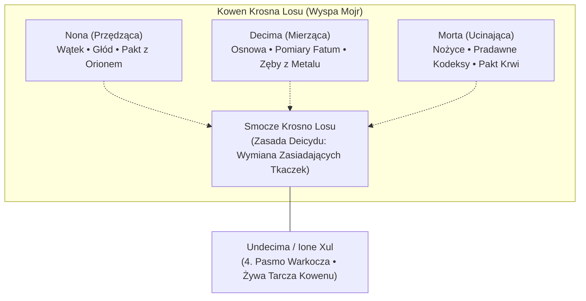
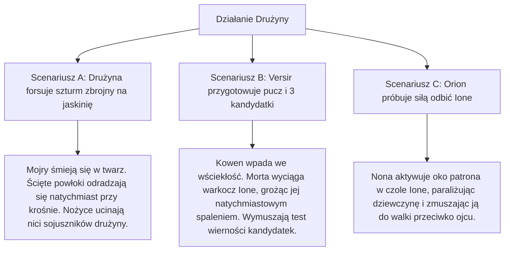
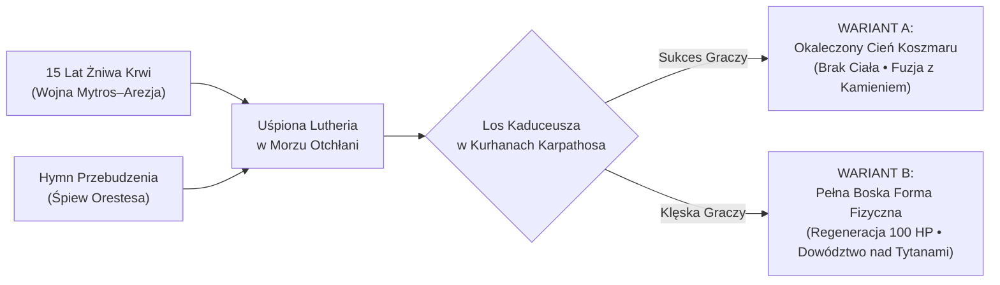
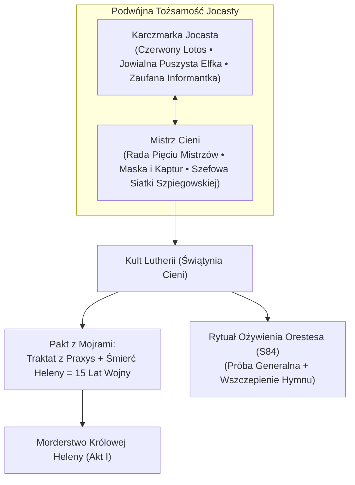
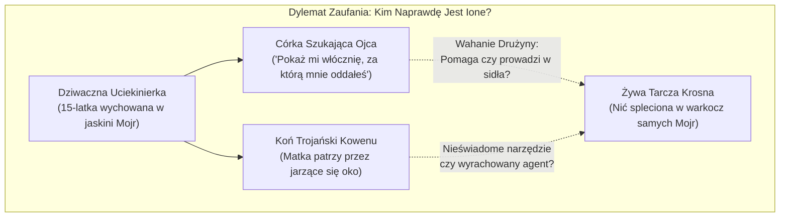
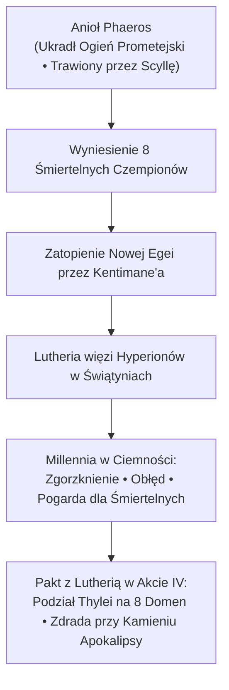

# 04 - Dramatis Personae (Postacie i Frakcje)

Niniejszy dokument stanowi kompleksowe, wielowymiarowe dossier postaci niezależnych (NPC) oraz recenzję scenariuszową ich motywacji dla kontynuacji kampanii *Odyseja Smoczych Władców* (Nowa Era), osadzonej dokładnie **piętnaście lat** po Bitwie o Mytros ([[Sesja 83 - Zmierzch Ery Tytanów|Sesja 83]]) i wydarzeniach epilogu ([[Sesja 84 - Świt Nowej Ery|Sesja 84]]).

Raport integruje oficjalny materiał z podręcznika **REMASTER** (*The New Pantheon*, *The Siege of Aresia*, *The Aresian Peninsula*, *The Sunken Kingdom*, *Apokalypsis*, *Appendix D: The Divine Path*) z kanonem stołu i autorskimi fundamentami kampanii: planowanym deicydem [[Mojry|Mojr]], spiskiem [[Mistrz Cieni|Mistrza Cieni]], prawdą o próżności [[Narsus|Narsusa]], prometejskim ostrzeżeniem [[Phaeros|Phaerosa]] oraz tragedią [[Undecima|Undecimy (Ione Xul)]].

---

## Metodologia i Architektura Motywacji

Każdy z opisywanych NPC został przeanalizowany pod kątem spójności psychologicznej, zakorzenienia w historii sesji 1–84 oraz funkcji dramaturgicznej. Zrezygnowano z płaskich archetypów fantasy na rzecz wyrazistych, wielowarstwowych motywacji:
1. **Zasada Sprawczości Graczy (*Player Agency*):** W downtime (lata 1–15) fatum niweczyło mediacje bohaterów poprzez subtelne zbiegi okoliczności tkane przez Mojry. Od Sesji 85 gracze wkraczają do gry z pełną sprawczością — ich decyzje przynoszą trwałe, nienaruszalne skutki polityczne i metafizyczne.
2. **Krosno jako Kosmiczny Bank:** [[Mojry]] nie są bezstronnymi strażniczkami losu ani karykaturalnymi wiedźmami z bajek; to bezduszne lichwiarki prowadzące transakcje w prawie krwi, długu i suwerenności.
3. **Cena Boskości:** Boskość nie jest nagrodą z katalogu, lecz ciężarem niosącym ryzyko zniewolenia (*Oath of Service*) lub spaczenia (los Hyperionów).

---

## 1. Mojry (Nona, Decima, Morta) — Kowen Krosna Losu

### 1.1. Kowen jako Jedność Metafizyczna

#### Status, Rola, Wygląd i Forma
Prastare bóstwa przeznaczenia, sprowadzone do Thylei przez samą pramatkę [[Thylea|Thyleę]] dziesięć tysięcy lat temu do nadzorowania tkaniny rzeczywistości. Rezudują w zalewanej wiecznym deszczem jaskini pod cyklopimi ruinami gygantów na [[Wyspa Mojr]]. Kowen funkcjonuje jak bezwzględna korporacja prawno-finansowa wszechświata. Używają czółenka ze smoczej kości, a osnową ich tkaniny są ścięgna, gwiezdny jedwab oraz krew istot żywych.

#### Co robiły przez 15 lat?
1. **Sprzedały 15-letnią wojnę:** Zawarły tajny kontrakt z [[Mistrz Cieni|Mistrzem Cieni]] ([[02 - Wielka Kampania i Główne Wątki#CZĘŚĆ III: Spisek Mistrza Cieni, Kaduceusz i Powrót Lutherii|Spisek Mistrza Cieni i Powrót Lutherii]]), inkasując *Traktat o Prawach i Zobowiązaniach Krwi* ze skarbca Sydona oraz obietnicę krwi królowej [[Królowa Helena|Heleny]].
2. **Wplatały wojenne mikro-anomalie:** Systematycznie podważały rozejmy negocjowane przez bohaterów w downtime, wplatając w tkaninę „niewidzialne nieszczęścia” (kurzawka na rzece Thrake, zaraza sporyszu w stadninach Arezji, pijacka burda w Mytros).
3. **Sprzedały rytuał Theogenesis Narsusowi:** Zainkasowały od upadłego boga-smoka Narsusa (Arystonara) *Przysięgę Służby (Oath of Service)*, przygotowując go do roli wieczystego niewolnika na tronie niebios.
4. **Wyhodowały Undecimę:** Wychowały 15-letnią córkę Oriona i Nony, celowo aranżując jej „ucieczkę” i wplatając jej nić jako czwarte pasmo własnego warkocza.

#### Czego chcą?
- **Krótkoterminowo:** Doprowadzić do dopełnienia kontraktu Mistrza Cieni (śmierć Heleny), spętać nowo narodzonego boga Narsusa w kajdany *Oath of Service* i zneutralizować zagrożenie ze strony Bohaterów Przepowiedni.
- **Długoterminowo:** Utrzymać monopol na sterowanie historią Thylei, hodować kolejne pokolenia zadłużonych bogów i wyeliminować wszelkie próby suwerenności śmiertelników.

#### Dlaczego? (Głęboka Motywacja)
Przed eonami zaczęły jako służba. Uznały, że za zarządzanie wszechświatem należy się wieczysta zapłata. Nie gromadzą złota — ich walutą są niezbywalne prawa, skrawki dusz, przymierza i długi z odroczonym terminem płatności.

#### Czego się boją?
**Obsadzonego krzesła przy Krośnie.** Mojr nie można zabić mieczem, magią ani boską mocą — rozcięte natychmiast odtwarzają się przy czółenku. Giną **wyłącznie** wtedy, gdy ich nici zostaną odcięte przez prawomocne następczynie zasiadające na ich trzech fotelach. Panicznie boją się skoordynowanego puczu tkackiego.

#### Co wiedzą?
- Znają treść każdego paktu zawartego w Thylei od czasów Kentimane'a.
- Widzą dokładną datę i przyczynę śmierci każdej istoty w krainie (z wyjątkiem nieprzewidywalnych anomalii wolnej woli).
- Wiedzą o uśpionej Lutherii, o uwięzionych Hyperionach na dnie Zatoki i o naturze Ognia Prometejskiego.

---

### 1.2. Nona (Przędząca)
- **Status i Wygląd:** Najmłodsza z trójki (choć liczy tysiąclecia). Potrafi przybierać kształt bladej, nieludzko pociągającej kobiety lub drapieżnej harpii. Na środku czoła posiada pojedyncze, jarzące się srebrzystym blaskiem oko. Nosi diadem przypominający trzepoczące, czarne skrzydła. Przędzie surową nić ze sznurów ścięgien i wnętrzności.
- **Psychologia:** Nienasycona, perwersyjnie ciekawska, pełna stłumionej wściekłości. Patrzy na śmiertelników jak na mięso i dłużników.
- **Wątek Osobisty (Sesja 47):** Matka [[Undecima|Undecimy (Ione)]]. W zamian za wzmocnienie włóczni [[Odkupienie Pythora]] zażądała nasienia [[Orion Xul|Oriona]]. Spłodziła córkę nie z pożądania, lecz z wyrachowania — stworzyła doskonałą, żywą tarczę przeciwko ojcu.
- **Otwarte Zobowiązanie (Sesja 48):** Złożyła obietnicę Orestesowi: *„Odwiedzimy cię jeszcze w twoich snach”*. Mojry nie spieszą się z realizacją obietnicy — wiedzą, że dług wisi w sferze fatum i nie marnują go na tanie manifestacje, czekając na decydujący moment przy Krośnie.

### 1.3. Decima (Mierząca)
- **Status i Wygląd:** Potężnie zbudowana, o skórze twardej i szarej jak bazalt. Na głowie nosi diadem z żywych, metalicznych węży, a jej usta kryją ostre, spiżowe zęby. To fizyczna siła i miernicza kowenu — odmierza prętem długość ludzkiego żywota.
- **Psychologia:** Brutalna, sarkastyczna, lubująca się w upokarzaniu wojowników. Wytyka śmiertelnikom ich fizyczną kruchość i hipokryzję.
- **Rola w Intrydze:** Osobiście wyliczała proporcje krwi i czasu potrzebne do wywołania 15-letniego impasu pod Arezją.

### 1.4. Morta / Babcia Morta (Ucinająca)
- **Status i Wygląd:** Najstarsza z sióstr, licząca ponad dziesięć tysięcy lat. Bezzębna, zgarbiona starucha z jednym pustym, ropiejącym oczodołem. Siedzi przy parującym kotle wydzielającym słodkawy odór rozkładu. Dzierży zardzewiałe, lecz bezlitosne nożyce ze smoczej kości, którymi przecina żywoty.
- **Psychologia:** Architektka kowenu. Odrzuca gwałtowne kataklizmy na rzecz powolnego gnicia instytucji i ludzkiej głupoty. Cechuje ją lodowaty cynizm.
- **Rola w Intrydze:** Trzyma w rękach butwiejący kodeks *Traktatu o Prawach i Zobowiązaniach Krwi*. To ona wymyśliła splecenie warkocza Undecimy z nićmi samych Mojr, szachując Oriona i drużynę.

---

### 1.5. Matryca Relacji z Bohaterami Graczy: Mojry

| Bohater Gracza | Stosunek Mojr do Bohatera | Historia Interakcji (Kanon S1–S84) | Dźwignia Psychologiczna / Haczyk |
|---|---|---|---|
| **[[Versir]]** | Pogarda zmieszana z arogancją; uważają go za „kolejną bezsilną nić”. | Mojry pomogły Lutherii zamordować jego matkę [[Versi Pierwsza\|Versi Pierwszą]]. W S47 pokazały mu fałszywą wizję śmierci z rąk Lutherii. | Uważają, że nie jest w stanie ich zaskoczyć, bo widzą go na krośnie. Ta arogancja to jego jedyna szansa. |
| **[[Orion Xul\|Orion]]** | Cyniczne rozbawienie; traktują go jak dłużnika i narzędzie reprodukcyjne. | W S47 oddał nasienie Nonie za wzmocnienie włóczni. W S84 porzucił Lyrę, kopiując grzech Pythora. | Szantaż emocjonalny córką [[Undecima\|Undecimą]]: *„Zabij nas, a spalisz własne dziecko”*. |
| **[[Felicjan Janus Twardowski\|Felicjan]]** | Szacunek jak do trudnego klienta banku; badają jego konstrukcje prawne. | W S48 oddał połowę potencjału leczenia za smocze jaja i ulepszenie korony. | Felicjan jest świadom ich lichwy i buduje instytucje odporne na klątwy losu. |
| **[[Orestes]]** | Ciekawość; widzą w nim anomalię, która wymknęła się ze świata umarłych. | Zabił Lutherię Toporem Xandera w S82. W S48 odrzucił ich ofertę. Nona obiecała mu nawiedzenie we śnie. | Trzymają jego dług jako otwarty rachunek; wiedzą, że minotaur wciąż nieświadomie nuci arkaniczny hymn Lutherii. |
| **[[Arevon Elorrenthi\|Arevon]]** | Chłodna obojętność wobec „obcego elementu” spoza kosmologii Thylei. | W S48 oddał cząstkę swojej szybkości za pakt. Przez 15 lat nie potrafił znaleźć Zatopionego Królestwa. | Skrywały przed nim mapę Pyrrhy, drwiąc z jego bezowocnych poszukiwań. |

---

### 1.6. Scenariusze Reakcji Mojr na Działania Drużyny

---

### 1.7. Ocena i Propozycje Wzmocnienia (Mojry)
- **Słaby punkt w REMASTERZE:** W oficjalnym module Mojry są statycznymi wyroczniami w jaskini, których gracze nie mogą tknąć, a ich motywacja ogranicza się do bycia „złymi NPC-ami od questów”.
- **Propozycja 1 (Priorytet: KRYTYCZNY):** Utrzymanie w pełnej mocy zasady deicydu: śmierć wyłącznie przez prawomocne tkaczki na fotelach. Pucz na Krosno w Akcie III musi być operacją chirurgiczną, a nie zwykłym dungeon crawlem.
- **Propozycja 2 (Priorytet: WAŻNY):** Manifestacja wpływu Mojr poprzez drabinę eskalacji — kowen metodycznie przędzie splot nienawiści i podsyca wojnę Mytros z Arezją, zbierając krew niezbędną do obudzenia Lutherii w Otchłani.
- **Propozycja 3 (Priorytet: KOSMETYCZNY):** Wprowadzenie motywu dźwiękowego przy stole — za każdym razem, gdy Mojry ingerują w scenę, w tle rozbrzmiewa głuchy, rytmiczny stukot kościanego czółenka (*klap-klap*).

---

## 2. Lutheria — Uśpiona Pani Snów i Śmierci

### 2.1. Profil Postaci i Stan Obecny
- **Kim jest teraz:** Ścięta przez Orestesa w [[Sesja 82 - Bitwa o Mytros: Śmierć Pani Snów|Sesji 82]]. Jej boska powłoka rozsypała się w proch, a esencja zapadła w wieczny sen na dnie [[Morze Otchłani|Morza Otchłani]]. Jest bezcielesnym upiorem snu, którego świadomość powoli scala się dzięki cierpieniu docierającemu z powierzchni.
- **Co robiła przez 15 lat?** Chłonęła energię z 15-letniej rzezi, głodu i agonii wojny mytrosańsko-arezyjskiej kupionej od Mojr przez jej wierną kapłankę Jocastę. Przesyłała koszmary swoim sługom (menadom w Forcie Zakrotha, Nucklom w Otchłani).
- **Rola Pieśni Orestesa:** W Sesji 84 w trakcie 9-godzinnego rytuału ożywienia Orestesa w [[Świątynia Cieni|Świątyni Cieni]], słudzy Lutherii użyli minotaura jako przekaźnika. Piosenka biesiadna, którą Orestes nuci od 15 lat przy warzeniu piwa, to w rzeczywistości **Hymn Przebudzenia Lutherii**. Orestes chodzi po świecie i nieświadomie rozsiewa arkaniczną wibrację jej zmartwychwstania.
- **Dwie Formy Powrotu (Wariantowość Kaduceusza — [[02 - Wielka Kampania i Główne Wątki#CZĘŚĆ III: Spisek Mistrza Cieni, Kaduceusz i Powrót Lutherii|Spisek Mistrza Cieni i Powrót Lutherii]]):**
  - **Wariant A (Gracze zabezpieczają Kaduceusz w Kurhanach):** Lutheria nie posiada fizycznego ciała. Wraca w Akcie IV jako bezcielesny cień/koszmar stopiony z Kamieniem Apokalipsy. Budzi Nether Tytanów z bezsilności, a jej pokonanie jest znacznie prostsze.
  - **Wariant B (Wrogowie kradną Kaduceusz):** Jeden z Hyperionów łamie laskę, rzucając *True Resurrection*. Lutheria odradza się w pełni boskiego ciała, z regeneracją 100 HP na rundę, zsyłając plagę obłędu na całą Thyleę.

### 2.2. Motywacje, Psychologia i Lęki
- **Czego chce?** Przebudzić się z Otchłani, obalić raczkujący Nowy Panteon, ukarać zdradzieckich śmiertelników i otworzyć wrota dla pradawnego chaosu (Yotenów).
- **Dlaczego?** Została upokorzona. W Sesji 82 dobrowolnie poddała partię, mówiąc: *„No to była dobra partia. Na pewno was wszystkich zapamiętam”*. Jej duma Tytanki nie zniesie, by jej światem rządzili dawni czempioni.
- **Czego się boi?** **Samotności i zapomnienia.** W Sesji 82 Versir obnażył jej największy koszmar: *„Ty od tysięcy lat boisz się samotności”*. Boi się unicestwienia Kamienia Apokalipsy i zafałszowania jej hymnu przez Orestesa, co odcięłoby ją od świata na wieczność.
- **Co wie?** Zna sekrety pierwotnej Otchłani, geometrię snów, słabości Hyperionów (których sama uwięziła tysiące lat temu) oraz formuły zniszczenia barier Kentimane'a.

### 2.3. Relacje z 5 Bohaterami

| Bohater | Relacja z Lutherią |
|---|---|
| **[[Versir]]** | Osobisty wróg; to ona zamordowała jego matkę Versi Pierwszą i drwiła z jego dziedzictwa tytanów. Versir przejrzył jej samotność w Sesji 82. |
| **[[Orestes]]** | Jej zabójca z Sesji 82 (ściął jej głowę) i jednocześnie jej mimowolna arka rezonansowa (Hymn Przebudzenia). |
| **[[Felicjan Janus Twardowski\|Felicjan]]** | Przeciwnik intelektualny; to on w Sesji 82 wygasił jej fantazmaty i złamał domenę snów promieniami słońca. |
| **[[Orion Xul\|Orion]]** | Gardzi nim jako marionetką bogów; pamięta, jak bez litości zabił jej sługi w Sesji 81–82. |
| **[[Arevon Elorrenthi\|Arevon]]** | Uważa go za intruza z obcego kosmosu, którego gwiazdy nie mają prawa świecić nad jej morzem. |

### 2.4. Scenariusze Reakcji Lutherii
- **Jeśli gracze chronią Kaduceusz:** Wpada we wściekłość w Otchłani. Zamiast czekać na pełne odrodzenie, uderza w Kamień Apokalipsy przedwcześnie, przyspieszając przebudzenie Nether Tytanów.
- **W konfrontacji z pieśnią Orestesa:** Gdy minotaur w finale (Akt IV) zacznie ryczeć biesiadną wersję pieśni, Lutheria zacznie tracić kontrolę nad osnową Otchłani — wstrząs dysonansowy paraliżuje jej zdolności legendarne.

### 2.5. Ocena i Propozycje Wzmocnienia (Lutheria)
- **Słaby punkt w REMASTERZE:** Brak wpływu obrony Kaduceusza na finałowe starcie z Lutherią w Rozdziale 13.
- **Propozycja 1 (Priorytet: KRYTYCZNY):** Ścisłe powiązanie formy Lutherii w finale z losem Kaduceusza z Aktu I. Jeśli gracze obronią laskę, należy wprost zakomunikować przy stole: *„Gdybyście nie obronili Kaduceusza w grobowcu Karpathosa, stałaby dziś przed wami w ciele z krwi i kości!”*.
- **Propozycja 2 (Priorytet: WAŻNY):** Uczynienie z pieśni Orestesa mechaniki starcia — Orestes wykonuje testy Charyzmy (Występy/Perswazja), by rozrywać koncentrację bogini i neutralizować jej aury obłędu.

---

## 3. Królowa Helena — Władczyni Arezji

### 3.1. Profil Postaci i Stan Obecny
- **Kim jest teraz:** Dumna, nieugięta monarchini zmilitaryzowanej [[Arezja|Arezji]]. Kobieta po pięćdziesiątce, o rysach zaciętych surowym żołnierskim honorem. Nosi ciemnobrązowy chiton ze spiżowymi sprzączkami i kirys rodowy. Otacza się wyłącznie męską gwardią eunuchów i weteranów. Przewodzi Radzie Pięciu Mistrzów.
- **Co robiła przez 15 lat?**
  - Dźwigała traumę **1200 poległych hoplitów** wysłanych na prośbę bohaterów do obrony Mytros ([[Sesja 63 - Werdykt Arezji|Sesje 63]] i [[Sesja 84 - Świt Nowej Ery|84]]).
  - Zmagała się z kryzysem demograficznym, zarazą koni bojowych (rok 9) i buntami centaurów Zakrotha na północy półwyspu.
  - Od 3 lat dowodzi obroną miasta za 100-metrowymi murami i nienaruszalną barierą *Palladium*, odmawiając jakichkolwiek ustępstw wobec obozu Tarana.
  - Zakochana w [[Narsus|Narsusie]], trzyma go w luksusie w [[Wiszące Ogrody|Wiszących Ogrodach]], chroniąc go przed światem zewnętrznym.
  - Zaryglowała Kurhany Karpathosa potrójną pieczęcią, pamiętając tragedię wampiryzmu królowej Calliope.

### 3.2. Motywacje, Psychologia i Lęki
- **Czego chce?**
  - **Krótkoterminowo:** Zmusić Mytros do bezwarunkowego zwinięcia oblężenia, spacyfikować barbarzyńców Zakrotha na północy i zabezpieczyć sukcesję.
  - **Długoterminowo:** Ocalić suwerenność Arezji i doprowadzić do wyniesienia Narsusa do rangi bóstwa-opiekuna miasta, co da Arezji przewagę metafizyczną nad resztą kontynentu.
- **Dlaczego?** Jej duma została zraniona. Poświęciła elitę swojej armii dla ratowania Mytros, a w zamian republika odpowiedziała wojną handlową, roszczeniami o Narsusa i inwazją pod jej murami.
- **Czego się boi?**
  - Przebudzenia wampirzego rodu Karpathosa (dlatego wejście do kurhanów obłożyła karą śmierci).
  - Utraty Narsusa (jego ewentualne odejście lub śmierć złamałyby jej serce i zniszczyły morale Arezji).
  - Wewnętrznego rozpadu miasta z powodu głodu i strat wojennych.
- **Co wie?** Zna sekrety obrony *Palladium*, wie o istnieniu Kaduceusza w grobowcu Karpathosa, zna nastroje w Radzie Pięciu Mistrzów, lecz **nie ma pojęcia**, że zasiadający w jej radzie Mistrz Cieni (Jocasta) podpisał na nią wyrok śmierci u Mojr.

### 3.3. Relacje z 5 Bohaterami

| Bohater | Relacja z Heleną |
|---|---|
| **[[Versir]]** | Szanuje jego stoicyzm i królewski autorytet aasimara; widzi w nim jedynego mediatora godnego zaufania. |
| **[[Orestes]]** | Ma do niego szczególną słabość — w S62 Orestes pokonał w zapasach Mistrza Halcyona, a przez całe 15 lat wojen dostarczał piwo do Arezji. Orestes ma wstęp za mury bez straży. |
| **[[Felicjan Janus Twardowski\|Felicjan]]** | Szanuje go jako męża stanu, lecz ma żal za to, że Zakon Smoczych Lordów nie powstrzymał wyprawy wojennej Tarana. |
| **[[Orion Xul\|Orion]]** | Podziwia jego kunszt wojenny, widząc w nim uosobienie cnót hoplity, ale niepokoi ją jego porywczość. |
| **[[Arevon Elorrenthi\|Arevon]]** | Pamięta, że Arevon szukał wiedzy o morzu; wie, że syrena Pyrrha posiada mapę głębin. |

### 3.4. Rola w Intrydze i Cel Zamachu
Helena stawia graczom warunek: otworzy Kurhany Karpathosa po Kaduceusz **tylko wtedy**, gdy gracze wyeliminują zagrożenie Zakrotha na północy półwyspu.  
Gdy gracze walczą w Kurhanach (Sesje 91–93), **Mistrz Cieni (Jocasta) przeprowadza zamach i morduje Helenę w jej pałacu**. Śmierć Heleny to spłata długu krwi u Mojr za wyreżyserowanie 15-letniej wojny.

### 3.5. Ocena i Propozycje Wzmocnienia (Helena)
- **Słaby punkt w REMASTERZE:** W podręczniku Helena jest postacią chłodną i bierną, a jej śmierć może wydać się losowym wydarzeniem politycznym.
- **Propozycja 1 (Priorytet: KRYTYCZNY):** Śmierć Heleny musi być jednoznacznie powiązana z kontraktem Mojr. Drużyna w komnacie zamordowanej królowej powinna odnaleźć pergamin ze znakiem czółenka i pieczęcią ze smoczej kości.
- **Propozycja 2 (Priorytet: WAŻNY):** Pogłębienie sceny rokowań w Sesji 86 — Helena powinna osobiście wykrzyczeć bohaterom w twarz ból po 1200 poległych z Bitwy o Mytros, zmuszając drużynę do moralnego zmierzenia się z kosztami ich dawnego zwycięstwa.

---

## 4. Mistrz Cieni (Kapłanka Jocasta)

### 4.1. Profil Postaci i Stan Obecny
- **Kim jest teraz:** Najbardziej niebezpieczna operatorka polityczna Thylei. Na co dzień występuje jako **Jocasta** — urocza, puszysta elfka o jowialnym uśmiechu, prowadząca najpopularniejszą tawernę w Arezji, [[Czerwony Lotos]]. Pod maską i głębokim kapturem zasiada w Radzie Pięciu Mistrzów jako **Mistrz Cieni**, dowodząc elitarną siatką szpiegów, skrytobójców i nekromantów w [[Świątynia Cieni|Świątyni Cieni]].
- **Co robiła przez 15 lat?**
  - Kupiła od Mojr 15-letnią wojnę, płacąc *Traktatem o Prawach i Zobowiązaniach Krwi* ze skarbca Sydona (odzownym przez bohaterów w S83).
  - W Sesji 84 przeprowadziła 9-godzinny rytuał ożywienia Orestesa za komplet odłamków Kryształowej Kosy — była to **próba generalna** przed wskrzeszeniem Lutherii.
  - Koordynowała infiltrację Mytros, manipulowała spekulantem Taranem i podsycała wojenne jastrzębie w obu stolicach.

### 4.2. Motywacje, Psychologia i Lęki
- **Czego chce?** Obudzić Lutherię z Otchłani, spłacić kontrakt Mojr krwią Heleny, przechwycić Kaduceusz z rąk drużyny i zlikwidować dynastię Calliope.
- **Dlaczego?** Jest fanatyczną arcykapłanką Lutherii. Wierzy, że rządy Tytanów były erą prawdy i siły, a śmiertelnicy zasługują jedynie na bycie bydłem w krainie snów.
- **Czego się boi?** Zdemaskowania jej podwójnej tożsamości przed Radą Arezji, utraty Kaduceusza na rzecz nowego panteonu oraz przedwczesnego odkrycia jej powiązań z Mojrami przez Versira.
- **Co wie?** Zna każdy korytarz Arezji, sekrety Kurhanów Karpathosa, arkaniczne właściwości Kryształowej Kosy oraz luki prawne w Pierwszych Przysięgach.

### 4.3. Relacje z 5 Bohaterami

| Bohater | Relacja z Mistrzem Cieni / Jocastą |
|---|---|
| **[[Versir]]** | Boi się jego przenikliwości i znajomości bibliotek tytanów; unika bezpośredniego kontaktu magicznego. |
| **[[Orestes]]** | Uważa go za swój największy triumf nekromantyczny — uczyniła z niego żywy instrument niosący melodię wskrzeszenia bogini. |
| **[[Felicjan Janus Twardowski\|Felicjan]]** | Ostrzegał przed nią w S84. Jocasta wie, że Felicjan ma obsesję na punkcie rozliczania relikwii, więc stale zaciera przed nim ślady. |
| **[[Orion Xul\|Orion]]** | Traktuje go jak tępego mięśniaka, którego można łatwo zmanipulować walką i honorem. |
| **[[Arevon Elorrenthi\|Arevon]]** | W S83 to Arevon wręczył jej *Traktat* w ruinach baru w Mytros; Jocasta uważa go za naiwnego pacyfistę. |

### 4.4. Scenariusze Reakcji Mistrza Cieni
- **Gdy drużyna wkracza do Czerwonego Lotosu (Sesja 86):** Jako Jocasta wita ich z otwartymi ramionami, stawia wino, podpytuje o nastroje w obozie Tarana i rzuca „życzliwe plotki” o Narsusie.
- **W Kurhanach (Sesje 91–93):** Nasyła Nucklów i zabójców z zasadzką na wyjściu z grobowca, podczas gdy sama likwiduje Helenę w pałacu.
- **W przypadku zdemaskowania:** Zrzuca maskę jowialnej barmanki, teleportując się cieniem do pałacu Hyperionów.

### 4.5. Ocena i Propozycje Wzmocnienia (Mistrz Cieni)
- **Słaby punkt w REMASTERZE:** Brak połączenia postaci Jocasty z Mistrzem Cieni w spójny dramat szpiegowski.
- **Propozycja 1 (Priorytet: KRYTYCZNY):** Utrzymanie podwójnej roli Jocasty. Pozwól graczom polubić Jocastę w Akcie I, by jej zdrada i zamach na Helenę wstrząsnęły stołem.
- **Propozycja 2 (Priorytet: WAŻNY):** Zasiej subtelne poszlaki w Czerwonym Lotosie — zapach grobowego kadzidła i ziół ze Świątyni Cieni na jej fartuchu, który może wychwycić Arevon lub Orestes testem Percepcji (DC 18).

---

## 5. Narsus — Zdetronizowany Bóg-Smok i Droga do Theogenesis

### 5.1. Profil Postaci i Stan Obecny
- **Kim jest teraz:** W rzeczywistości starożytny brązowy smok **[[Arystonar]]**, syn [[Balmytria|Balmytrii]] i [[Volkan|Volkana]] (Sybolkoraxa), rodzony brat królowej [[Vallus]] (Tysophale), [[Pythor|Pythora]] (Raspytriona) i [[Kyrah]] (Arkyranii). Niegdyś Bóg Piękna, jeden z Pięciu Bogów Thylei. W Arezji występuje pod ludzką postacią olśniewającego mężczyzny o nieludzko perfekcyjnej urodzie, szmaragdowych oczach i złotych lokach (dzięki wrodzonej magii *Change Shape*). Mieszka w opływających złotem i winem [[Wiszące Ogrody|Wiszących Ogrodach]] w Arezji dobrowolnie od stuleci, pławiąc się w uwielbieniu dworu i zakochanej w nim Heleny.
- **Co robił przez 15 lat?** Po wygaśnięciu [[Przysięga Pokoju|Przysięgi Pokoju]] w [[Sesja 75 - Koniec Przysięgi|Sesji 75]] i utracie boskiej domeny panicznie ukrywał swoją smoczą naturę przed Arezyjczykami. Próżnował, przymierzał szaty, przeglądał się w zwierciadłach i snuł plany powrotu do panteonu bóstw Thylei.
- **Sekretny Pakt z Mojrami ([[02 - Wielka Kampania i Główne Wątki#CZĘŚĆ II: Wątek Narsusa, Sekret Theogenesis i Trzy Boskie Artefakty|Wielka Kampania: Wątek Narsusa]]):** Kilkanaście lat temu kupił od Mojr pełną wiedzę o rytuale *Theogenesis* i położeniu 3 artefaktów. Ceną była **Przysięga Służby (*Oath of Service*)**, płatna po ponownym wstąpieniu do boskości. Bagatelizuje ten dług z pychy — wierzy, że jako nieśmiertelny bóg zlekceważy wiedźmy.
- **Zarzewie Kryzysu (Wyciek Theogenesis w 15. roku):** Przez lata dwór w Arezji trzymał formułę w tajemnicy. Dopiero w 15. roku, gdy przygotowania w *Chamber of Beauty* weszły w decydującą fazę, próżny Narsus zaczął chwalić się służbie i kapłankom. Wieść o rychłej apoteozie wyciekła za mury i wywołała panikę w Mytros, stając się bezpośrednim powodem wezwania Bohaterów Przepowiedni.

### 5.2. Motywacje, Psychologia i Lęki
- **Czego chce?** Przeprowadzić rytuał *Theogenesis*, odzyskać utraconą w Sesji 75 pełną boskość, błyszczeć na niebiosach i być wielbionym przez wszystkie narody Thylei.
- **Dlaczego?** Nie potrafi pogodzić się z rolą „zwykłego smoka bez boskich domen”, zepchniętego z piedestału po upadku Przysięgi Pokoju. Cierpi na potężny kompleks niższości maskowany megalomanią.
- **Czego się boi?** Demaskacji swojej smoczej tożsamości przed Arezyjczykami, fizycznego bólu (zranienie mogłoby na ułamek sekundy obnażyć brązowe łuski), brzydoty, bezpośredniej walki (panicznie boi się zebrania Kaduceusza z Kurhanów) oraz kompromitacji przed śmiertelnikami.
- **Co wie?** Zna formułę *Theogenesis*, wie, gdzie leżą artefakty (Kaduceusz w Kurhanach, Ambrozja u Zakrotha, Ogień Prometejski na dnie morza), a jego służka Pyrrha ma mapę do Nowej Egei.

### 5.3. Relacja z Ekoh
Oreada-łowczyni Ekoh wygrała dawny konkurs o jego rękę (srebrne poroże białego jelenia). Narsus zignorował ją ze strachu przed Calliope. W roku 10 Ekoh przybyła do Mytros, wywołując kryzys religijny. Ekoh jest potencjalną, szlachetną pretendentką do domeny Piękna, stanowiąc moralne przeciwieństwo Narsusa.

### 5.4. Relacje z 5 Bohaterami

| Bohater | Relacja z Narsusem |
|---|---|
| **[[Versir]]** | W S44 Versir powiedział Kyrah, że Narsus jest największym głupcem w Thylei. Narsus czuje przed nim respekt, ale uważa go za sztywnego fanatyka. |
| **[[Orion Xul\|Orion]]** | Narsus patrzy na niego z zazdrością (Orion dokonał wielkich czynów wojennych), ale drwi z jego braku ogłady i manier. |
| **[[Felicjan Janus Twardowski\|Felicjan]]** | Boi się intelektu Felicjana; obawia się, że czarodziej przejrzy luki w rytuale Theogenesis. |
| **[[Orestes]]** | W S63 Orestes wręczył mu Słoneczny Granat. Narsus traktuje minotaura jak poczciwego, silnego sługę, któremu można rzucać resztki z pańskiego stołu. |
| **[[Arevon Elorrenthi\|Arevon]]** | Traktuje druida instrumentalnie — potrzebuje jego umiejętności żeglarskich, by dopłynąć z mapą Pyrrhy do Zatopionego Królestwa. |

### 5.5. Reakcje Narsusa i Propozycje Wzmocnienia
- **Reakcja w Akcie II (Sesje 101–102):** Podczas Theogenesis na ciele Narsusa rozżarzają się eteryczne kajdany Mojr. Gdy uświadamia sobie, że stał się niewolnikiem Krosna, wpada w histeryczny płacz i błaga bohaterów o ratunek.
- **Propozycja 1 (Priorytet: KRYTYCZNY):** Narsus nie może być biernym zleceniodawcą. Gracze muszą widzieć jego narcystyczną bezradność — to drużyna dyktuje warunki ekspedycji, a Narsus jest bezużyteczny bez ich ochrony.
- **Propozycja 2 (Priorytet: WAŻNY):** Wprowadzenie konfrontacji z Ekoh w Mytros lub Arezji przed wyruszeniem na dno morza, jako testu sumienia dla pretendentów do boskości.

---

## 6. Taran Neurdagon — Magnat i Spekulant Wojenny

### 6.1. Profil Postaci i Stan Obecny
- **Kim jest teraz:** Głowa najbogatszego rodu patrycjuszy w Mytros, potomek smoczego lorda Adonisa Neurdagona. Mężczyzna po sześćdziesiątce, o siwiejących, starannie trefionych włosach, odziany w purpurowe togi haftowane złotem. Oficjalny wódz Wielkiej Wyprawy Mytros, dowodzący 3-letnim, gnijącym w błocie obozem oblężniczym pod stumetrowymi murami Arezji.
- **Co robił przez 15 lat?**
  - Finansował odbudowę stolicy w zamian za monopole, dziesięciny portowe i miejsca w radzie ([[Sesja 84 - Świt Nowej Ery|Sesja 84]]).
  - Sfinansował flotę wojenną w zamian za naczelne dowództwo nad oblężeniem.
  - Zmonopolizował dostawy żywności, sucharów, solonego mięsa i uzbrojenia dla armii — **każdy miesiąc impasu pod Arezją przynosi mu gigantyczny zysk z kasy miejskiej**.
  - Posiada mroczne powiązania rodowe z fabrykami bioautomatonów i [[Egida Mytros|Egidą Mytros]] (wypłynęło to w Sesji 49 przy tragedii Althai na Wyspie Forlorn).

### 6.2. Motywacje, Psychologia i Lęki
- **Czego chce?** Utrzymania wojennego status quo tak długo, jak to możliwe; wydrenowania skarbca Mytros; politycznego zniszczenia wpływów Zakonu Smoczych Lordów; zmuszenia Arezji do kapitulacji na jego warunkach handlowych.
- **Dlaczego?** Nienasycona chciwość i rodowa pycha. Wierzy, że ród Neurdagonów powinien być faktycznym władcą republiki.
- **Niewinność Metafizyczna (Fałszywa Flaga):** Taran jest bezwzględny i skorumpowany, lecz **w 100% niewinny spisku Mojr**. Kiedy drużyna szuka autora wojny, znajduje Tarana — idealnego kozła ofiarnego, który zasłania prawdziwą intrygę Mistrza Cieni i Krosna.
- **Czego się boi?** Dymisji przez Radę Mytros, instytucjonalnych kontroli skarbowych Felicjana, buntu głodujących żołnierzy pod wodzą gladiatora Maximusa oraz ujawnienia prawdy o bioautomatonach.
- **Co wie?** Zna mechanizmy korupcji w senacie Mytros, szlaki dostaw morskich, stan finansów republiki; nie ma pojęcia o Theogenesis ani o planach odrodzenia Lutherii.

### 6.3. Relacje z 5 Bohaterami

| Bohater | Relacja z Taranem |
|---|---|
| **[[Felicjan Janus Twardowski\|Felicjan]]** | Śmiertelny wróg polityczny. Felicjan uważał go za zarodek zepsucia już w S84 i nałożył drakońskie podatki na jego majątek. Taran nienawidzi Zakonu za neutralność. |
| **[[Orestes]]** | Robi interesy z jego browarem. Taran traktuje Orestesa pobłażliwie, uważając, że „każdego można kupić”. |
| **[[Orion Xul\|Orion]]** | W S19 zaoferował Orionowi złoto za zabicie Moxeny. Uważa Oriona za żołnierza do wynajęcia. |
| **[[Versir]]** | Boi się chłodnego autorytetu aasimara i unika z nim sporów prawnych. |
| **[[Arevon Elorrenthi\|Arevon]]** | Nie rozumie druida, uważając go za nieszkodliwego leśnego dziwaka. |

### 6.4. Reakcje Tarana i Propozycje Wzmocnienia
- **Gdy bohaterowie wkraczają do obozu (Sesja 85–86):** Próbuje wkupić się w ich łaski, oferuje bankiet, zrzuca winę na nieustępliwość Heleny i żąda, by Felicjan przysłał smoki do spalenia spichlerzy Arezji.
- **Gdy Felicjan i rada go odwołują:** Próbuje wzniecić pucz rękami najemników Maximusa, lecz w obliczu potęgi drużyny kapituluje i ucieka do Mytros, by ratować majątek.
- **Propozycja 1 (Priorytet: KRYTYCZNY):** Utrzymać zasadę natychmiastowej demobilizacji obozu Tarana po interwencji graczy. Taran traci dowództwo, a gracze czują realną sprawczość.
- **Propozycja 2 (Priorytet: WAŻNY):** Wpleść wątek bioautomatonów jako zabezpieczenia jego osobistej straży — jeśli dojdzie do konfrontacji, Taran wystawia zmodyfikowane konstrukty oparte na patentach z Wyspy Forlorn.

---

## 7. Undecima / Ione Xul — Córka Oriona i Nony

### 7.1. Profil Fizyczny i Aparycja
- **Kim jest teraz:** Piętnastoletnia pół-wiedźma, pół-śmiertelniczka. Córka [[Orion Xul|Oriona Xula]] i hagi [[Nona|Nony]], poczęta w [[Sesja 47 - Wyspa Mojr|Sesji 47]] jako zapłata za ulepszenie włóczni [[Odkupienie Pythora]]. Kowen nazywa ją **Undecima** (Jedenasta — zapasowa szpulka w krośnie). Przedstawia się z upartą, cichą dumą jako **Ione**, a gdy ktoś próbuje ją zlekceważyć: **Ione Xul**.
- **Wygląd i Fizjonomia:**
  - Niezwykle szczupła, niemal woskowa, o skórze bladej jak marmur w grobowcu (przez 15 lat nie widziała słońca).
  - Gęste, kruczoczarne włosy, w które odruchowo wplata strzępy nitek, sznurków, rzemyków, a nawet pasma zasuszonych włosów zmarłych.
  - Na czole nosi ciasną, poszarzałą opaskę z surowego płótna. Pod nią kryje się pionowa szrama i **Oko Nony** — gdy Ione tka magię lub gdy matka nasłuchuje, spod opaski sączy się trupioblady, fosforyzujący blask.
  - Jej własne oczy mają barwę wypłowiałego bursztynu, a źrenice nie są okrągłe — to wąskie, pionowe szczeliny przypominające otwór wrzeciona lub czółenka tkackiego.
  - Odziana w szatę zgrzebną, uszytą z niedopasowanych płatów sukna i lnu, połączonych grubym, czarnym ściegiem. W dłoni stale obraca **kościane czółenko ze smoczej kości** — wyślizgane od dotyku, służące jej jako sztylet, igła, rylec i przedmiot skupienia.

---

### 7.2. Psychologia, Dziwactwa i Manieryzmy (Quirks)

Ione nie jest typową nastolatką z problemami emocjonalnymi. To istota ukształtowana przez 15 lat w wilgotnej jaskini gygantów pod nieustanny, miarowy stukot Krosna Losu:

1. **Kompulsywne prucie i ważenie nici:**  
   Podczas rozmowy nie patrzy w oczy, lecz na ramiona i rękawy rozmówcy. Bezwiednie wyciąga palce, chwyta luźną nitkę z czyjegoś płaszcza, delikatnie ją napina, sprawdza jej elastyczność i wącha. Nie rozumie pojęcia przestrzeni osobistej. Na protest odpowiada ze stoickim zdziwieniem: *„Sprawdzam tylko, czy twój splot jest ciasny. Słaby len. Pęknie przy pierwszym pchnięciu”*.
2. **Medyczno-tkacki język i brak konwenansów:**  
   Ludzi postrzega jako surowiec sukienniczy i dłużników czasu. Nie mówi „ten człowiek jest chory”, lecz: *„Jego osnowa butwieje od brzucha”*. Potrafi podejść do generała lub króla, powąchać jego skórę i stwierdzić bez cienia złośliwości: *„Pachniesz już trzecią zimą i zbutwiałym liściem. Twój węzeł leży bardzo blisko nożyc Morty”*.
3. **Zastyganie w pół słowa i rozmowy z Krosnem:**  
   Potrafi nagle zamilknąć w trakcie zdania, przekrzywić głowę pod nienaturalnym kątem, nasłuchując szmeru niewidzialnych włókien w powietrzu, po czym rzucić w pusty kąt pokoju: *„Cicho bądź, Morto. Jeszcze nie zawiązali węzła”* albo *„Wiem, że krew brudzi przędzę, nie musisz mi brzęczeć w uchu”*.
4. **Zmysłowy głód śmiertelnego świata:**  
   Nie boi się krwi, flaków, potworów ani ciemności — to była jej codzienność. Za to gwałtownie i hipnotycznie fascynują ją rzeczy, których w jaskini Mojr nie było: smak gorącego chleba, miód, chrupnięcie jabłka, dotyk rozgrzanej monety (przyciska ją do warg i zębów), śpiew ptaków czy śmiech minotaura. Gdy dostaje miskę gorącej strawy, zastyga w ekstazie i pyta cicho: *„Dlaczego wy to jecie codziennie i wciąż chce wam się umierać?”*.

---

### 7.3. Dylemat Zaufania: Bohaterowie Powinni się Wahać

Najważniejszą osią dramaturgiczną Ione jest **niepewność drużyny co do jej lojalności**:

- **Zagadka Ucieczki:** Ione twierdzi, że uciekła łodzią przez sztorm, bo „stare wiedźmy śmierdziały stęchłym tłuszczem, a krosno śpiewało o Orionie”. Ale na pytanie, jak śmiertelna dziewczyna mogła uciec z wyspy strzeżonej przez chimery, syreny i wszechwiedzące wiedźmy, odpowiada z chłodnym, niepokojącym uśmiechem:  
  *„Przecież wiecie, że od nich się nie ucieka. One po prostu... zapomniały zasunąć rygla. Albo bardzo chciały, żebym tu była. Wybierzcie sobie tę bajkę, przy której łatwiej wam będzie zasnąć”*.
- **Świadomy Koń Trojański:** Mówi otwarcie o swoim oku: *„Matka patrzy, kiedy chce. Czasem mrugam szybko, żeby jej zamigotało, ale to niewiele daje. Jeśli planujecie zabić wiedźmy, nie mówcie tego głośno w moim namiocie”*. Ta rozbrajająca szczerość paraliżuje graczy — czy to dowód lojalności, czy genialna zasłona dymna szpiega doskonałego?
- **Prawda, która Prowadzi w Sidła:** Wskazówki, które daje drużynie (o przejściu przez Palladium, o słabości Zakrotha, o długu Narsusa), są w 100% prawdziwe i niezwykle pomocne. Lecz każda z nich pcha drużynę dokładnie w te miejsca i decyzje, których pożądają Mojry!
- **Dylemat Drużyny:** Czy odesłać ją precz (skazując córkę Oriona na samotność i zemstę kowenu)? Czy trzymać ją blisko, ryzykując, że kowen zna każdy ich krok? A jeśli w decydującej chwili Nona przejmie jej ciało?

---

### 7.4. Pięć Warstw Tragedii Undecimy
- **Warstwa 1 (Pozory):** Dziwaczna uciekinierka z jaskini szukająca ojca i ciekawości świata śmiertelników.
- **Warstwa 2 (Bolesna Szczerość):** Ostrzega przed okiem matki i daje prawdziwe informacje taktyczne.
- **Warstwa 3 (Reżyseria Mojr):** Mojry celowo wypuściły Ione, by sprowadziła Oriona i drużynę z powrotem na Wyspę Mojr w Akcie III.
- **Warstwa 4 (Żywa Tarcza):** Nić Ione jest wpleciona jako **czwarte pasmo w warkocz samych Mojr**. W Akcie III Morta rzuca Orionowi prosto w twarz: *„Śetnij nas mieczem, a twoja córka spłonie z nami w jednej sekundzie!”*.
- **Warstwa 5 (Wyzwolenie przez Pucz):** Ocalenie Ione wymaga chirurgicznego planu Versira — 3 nowe tkaczki muszą przejąć Krosno i fizycznie rozpleść warkocz Ione, podczas gdy Orion przyjmuje na siebie gniew Krosna.

---

### 7.5. Relacje z 5 Bohaterami Graczy

| Bohater | Relacja i Dynamika Dramatyczna |
|---|---|
| **[[Orion Xul\|Orion]]** | **Żywe oskarżenie i bolesna próba ojcostwa.** Ione nie rzuca mu się na szyję. Dotyka jego pancerza i mówi: *„Jesteś zrobiony z ciężkiej, ciemnej wełny, Orionie. Dużo krwi w ciebie wsiąkło. Pokaż mi tę włócznię, za którą mnie sprzedałeś. Chcę zobaczyć, czy było warto”*. Orion widzi w niej odbicie swojej największej hańby i klątwy Pythora. Musi udowodnić jej, że potrafi chronić, a nie tylko zabijać. |
| **[[Orestes]]** | **Ciepła przystań i dysonans bezpieczeństwa.** Orestes jako pierwszy przełamuje jej chłód — karmi ją w tawernie Ultrosa, daje jej ciepły chleb, uczy ją śmiać się i nucić melodie. Ione czuje się przy nim bezpiecznie, lecz potrafi nagle powiedzieć mu z przerażającym spokojem: *„Twoja pieśń pachnie trupem z głębin morza, byczku. Dlaczego śpiewasz to, co śni się Lutherii?”*. |
| **[[Felicjan Janus Twardowski\|Felicjan]]** | **Arkaniczna nieufność i próba deszyfracji.** Felicjan patrzy na nią jak na żywy podsłuch Mojr. Bada konstrukcję jej paktu czarnoksięskiego, próbuje skonstruować ołowiany diadem blokujący pole widzenia Nony i bezustannie sprawdza, czy jej słowa nie są konstrukcją manipulacyjną. Ione lubi pruć jego bogate togi ze Smoczej Skały. |
| **[[Versir]]** | **Chłodna analiza i pionek w równaniu.** Versir dostrzega w niej brakujące 11. wrzeciono kowenu. Wie, że jej życie jest warunkiem powodzenia puczu. Ione patrzy na aasimara z respektem: *„Twoja nić nie ma zmarszczek, Versirze. Świeci jak srebro, ale jest naciągnięta tak mocno, że aż dzwoni. Kiedyś pękniesz z wielkim hukiem”*. |
| **[[Arevon Elorrenthi\|Arevon]]** | **Obserwator aury i powiew obcego nieba.** Arevon widzi, że aura Ione jest nienaturalnie spleciona ze smoczą kością i śmiercią. Uczy ją patrzeć w gwiazdy i słuchać morza, próbując wyciszyć dudnienie krosna w jej głowie. Ione jest zafascynowana faktem, że Arevon pochodzi spoza splotu Thylei. |

---

### 7.6. Jak Ją Odgrywać przy Stole (Wskazówki dla MG)

- **Mów cicho, rzeczowo, bez intonacji emocjonalnej**, a potem nagle zachwyć się czymś skrajnie błahym (np. ciepłą oliwką, strukturą drewnianego stołu).
- **Trzymaj w dłoniach rekwizyt** (ołówek, nożyczki, sznurek) i podczas mówienia bez przerwy nawijaj go na palce, pociągaj za nitki w rękawie lub stukaj rytmicznie o stół (*klap... klap... klap...*).
- **Nigdy nie tłumacz się z własnych słów.** Gdy ktoś pyta: „Co to miało znaczyć?”, Ione odpowiada: *„To, co usłyszałeś. Przecież słowa też się prują”*.
- **Dopilnuj, by gracze czuli dyskomfort zaufania:** Gdy Ione podaje im klucz do bramy Arezji, niech doda z obcym uśmiechem: *„Idźcie tamtędy. Strażnicy będą spali. Matka bardzo chciała, żebyście nie musieli wyważać wrót”*.

---

### 7.7. Profil Mechaniczny NPC

W walce i mechanice eksploracji Ione korzysta z oficjalnego statbloku **Dusk Hag** (CR 6, *Eberron: Rising from the Last War*, s. 292).
- **Reskin fabularny:** Reprezentuje jej wrodzoną pół-wiedźmią krew córki Nony — manipulację snami, widzenie przyszłości i wrodzoną magię przeznaczenia bez potrzeby wprowadzania customowych mechanik.
- **Rola przy stole:** Funkcjonuje jako postać wspierająca dla drużyny Tier 3/4. Dzięki solidnej obronie i zaklęciom utility nie ginie od przypadkowych ataków obszarowych i nie zabiera graczom czasu antenowego w walce.

---

## 8. Anioł Phaeros & Uwięzieni Hyperioni

### 8.1. Anioł Phaeros (Upadły Prometeusz)
- **Kim jest teraz:** Dawny Solar (anioł światła), strącony z niebios tysiące lat temu za kradzież **Ognia Prometejskiego** (*Promethean Fire*). Uwięziony i trawiony przez eony w żołądku pierwotnej bestii Scylli w najgłębszym rowie oceanicznym (*The Chasm*) pod Nową Egeą.
- **Tragedia Prometejska:** Pragnął wyzwolić śmiertelników spod tyranii Tytanów, dając im boski ogień. Wyniósł ośmioro czempionów do rangi bogów. Efekt był katastrofalny: Tytani nasłali Scyllę i Kentimane'a, miasto zatonęło, a nowi bogowie okazali się potworami.
- **Stan psychiczny:** Oszalały z bólu i rozpaczy. Po uwolnieniu ze Scylli atakuje bohaterów w ślepym szale, widząc w nich kolejnych uzurpatorów.
- **Lustro Versira:** Phaeros jest żywym ostrzeżeniem dla Versira — obalenie starych bogów i rozdanie boskości bez absolutnej dojrzałości moralnej tworzy nową tyranię.

### 8.2. Ośmioro Uwięzionych Hyperionów (Zatopiony Panteon)

#### Anatomia Spaczenia Hyperionów
Ośmioro bóstw uwięzionych w Dzielnicy Świątynnej Nowej Egei (dno Zatoki Cerulańskiej):
1. **Sky Father (D1):** Centaur, potężny wojownik w srebrnej zbroi. Skrajny arogant, gardzący słabymi; przemienia zawiedzionych żołnierzy w potwory ichthys.
2. **Fire King (D2):** Cyklop z metalicznymi przeszczepami, pracujący przy podmorskiej kuźni w bańce powietrza; oferuje przeklętą broń niosącą szał mordu.
3. **Lord of Ghosts / Casius (D3):** Dwudziestostopowy gygan o pergaminowej skórze; bawi się iluzjami i hoduje mięsożerną bestię charyb.
4. **Fish Queen (D4):** Szesnastostopowa syrena w pancerzu z żywego koralu; oferuje wierzchowca — białego rekina, który po 7 dniach pożera jeźdźca.
5. **Moon Maiden (D5):** Naiada o chłodnym pięknie, otoczona rozkochanymi merrowami; obdarza darem piękna zamieniającym się w klątwę brzydoty.
6. **Great Hunter (D6):** Barbarzyński watażka na tronie z kości lewiatanów, wspierany przez gigantów burzowych; zsyła koszmary z polowania na wieloryba Oceanusa.
7. **Sun Goddess / Kalydessa (D7):** Przywódczyni panteonu, syrena o złotych skrzydłach medytująca w wieży światła; oślepia każdego, kto się zbliży.
8. **Vile Trickster (D8):** Niewidzialny satyr-iluzjonista w zrujnowanej świątyni; miesza prawdę z błazeństwem.

#### Psychologia i Rola w Akcie IV
Hyperioni nienawidzą śmiertelników za wieki zapomnienia. Zostali podstępem uwięzieni przez Lutherię, lecz po uwolnieniu w Akcie II sprzymierzają się z nią w Akcie IV (*Apokalypsis*). Lutheria obiecuje im podział Thylei na 8 domen po zmieceniu miast przez Nether Tytanów. W finale w Pałacu Hyperionów Lutheria zdradza ich po raz kolejny, używając ich dusz do zasilenia Kamienia Apokalipsy.

### 8.3. Ocena i Propozycje Wzmocnienia (Phaeros & Hyperioni)
- **Słaby punkt w REMASTERZE:** W podręczniku sojusz Hyperionów z Lutherią w Rozdziale 13 jest pozbawiony sensu (to ona ich uwięziła!).
- **Propozycja 1 (Priorytet: KRYTYCZNY):** Uzasadnienie psychologiczne paktu: Hyperioni są tak zaślepieni nienawiścią do nowego świata i głodem boskości, że wierzą w kłamliwą przysięgę Lutherii o rytuale Theogenesis, stając się jej tragicznymi marionetkami.
- **Propozycja 2 (Priorytet: WAŻNY):** Wykorzystanie 8 Hyperionów jako krzywych zwierciadeł dla 5 Bohaterów — każdy Hyperion powinien kusić konkretnego gracza obietnicą mianowania go „godnym następcą”, co stanowi moralny test przed ich własną Apoteozą.

---

## 9. Zakroth — Minotaur-Watażka Północy

### 9.1. Profil Postaci i Stan Obecny
- **Kim jest teraz:** Dawny zbiegły niewolnik i gladiator z aren Mytros. Ogromny minotaur o potężnych rogach okutych brązem, noszący płytową zbroję z brązu (AC 18). Dzierży legendarny *Mithral Honorblade* wygrany w pojedynku od mistrza Fechunku w Arezji.
- **Siedziba i Władza:** Dowodzi czteropiętrowym fortem z ubitej ziemi (*The Prison Fort*) w świerkowych lasach na północy Półwyspu Arezyjskiego.
- **Źródło Potęgi — [[02 - Wielka Kampania i Główne Wątki#CZĘŚĆ II: Wątek Narsusa, Sekret Theogenesis i Trzy Boskie Artefakty|Ambrozja]]:** Posiada antyczną amforę z Ambrozją (jeden z 3 artefaktów Theogenesis), która podniosła jego Charyzmę do 20 i daje mu moc rzucania czaru *Command* (DC 18) jako akcji dodatkowej.
- **Koalicja Północy:** Dzięki nienaturalnej charyzmie zjednoczył pod swoim sztandarem barbarzyńców, gigantów i centaury, ogłaszając się **„Wybrańcem Hergerona”**.

### 9.2. Motywacje, Psychologia i Lęki
- **Czego chce?** Zbudować niezależne imperium wolnych ras na Półwyspie Arezyjskim, zniszczyć niewolnictwo w Mytros i ukarać Arezję za wieki arogancji.
- **Dlaczego?** Został zrodzony w kajdanach, walczył dla uciechy patrycjuszy Mytros. Nienawidzi „cywilizowanych” miast za hipokryzję.
- **Słaby Punkt — Zakładnicy:** Aby utrzymać sojusz z klanami centaurów, więzi synów i córki wodzów, w tym Perimedesa — syna wielkiego wodza Agriusa. Córka Agriusa, Lesia, przybywa do fortu na rokowania.
- **Czego się boi?** Utraty Ambrozji (bez niej pryśnie jego magiczny magnetyzm) oraz zdemaskowania przez prawdziwych czempionów.
- **Manipulacja w tle:** W forcie rezyduje nimfa Belladona oraz menady przysłane potajemnie przez Lutherię, które podsycają jego obłęd.

### 9.3. Relacja z Orestesem
Zakroth to mroczne odbicie [[Orestes|Orestesa]]. Obaj są minotaurami, obaj byli wyrzutkami i niewolnikami. Lecz podczas gdy Orestes wybrał wolność, piwowarstwo i wspólnotę wolnych dusz, Zakroth wybrał tyranię, przemoc i zakładników. Spotkanie Orestesa z Zakrothem to kluczowy pojedynek filozoficzny i fizyczny Aktu I.

### 9.4. Ocena i Propozycje Wzmocnienia (Zakroth)
- **Słaby punkt w REMASTERZE:** W podręczniku fort Zakrotha jest traktowany jako odcięta lokacja lochowa bez powiązania z polityką stolicy.
- **Propozycja 1 (Priorytet: KRYTYCZNY):** Połączenie pacyfikacji Zakrotha z warunkiem Heleny na otwarcie Kurhanów. Gracze idą do fortu nie „dla expa”, lecz by zrealizować warunek królowej, zdobyć 1. artefakt (Ambrozję) i zawrzeć trwały pakt z centaurami Agriusa.
- **Propozycja 2 (Priorytet: WAŻNY):** Zapewnienie Orestesowi sceny pojedynku wodzów — Orestes może rzucić Zakrothowi wyzwanie w obecności centaurów, odbierając mu autorytet bez konieczności wyrzynania całego garnizonu.

---

## 10. Królowa Vallus — Bogini Mądrości / Smoczyca Tysophale

### 10.1. Profil Postaci i Stan Obecny
- **Kim jest teraz:** Władczyni Mytros po abdykacji Acastusa ([[Sesja 84 - Świt Nowej Ery|Sesja 84]]). Córka [[Balmytria|Balmytrii]] i [[Volkan|Volkana]] (Sybolkoraxa), rodzona siostra [[Pythor|Pythora]], [[Kyrah]] oraz [[Arezja/Narsus|Narsusa (Arystonara)]]. Tradycyjnie czczona jako Bogini Mądrości. W rzeczywistości jest starożytną brązową smoczycą **[[Tysophale]]**, wierzchowcem pierwszego smoczego lorda Telamoka Arkelandera. Jej boska domena wróciła do Tytanów w Sesji 75 — rządzi bez magii bóstwa, opierając się wyłącznie na smoczej mądrości i autorytecie.
- **Co robiła przez 15 lat?**
  - Odbudowywała zrujnowaną stolicę, powstrzymując czystki polityczne po stronnikach Acastusa i Sydona.
  - Zmagała się z kryzysem republiki: pustym skarbcem, inflacją, naciskami magnata Tarana Neurdagona oraz niepopularną, 3-letnią wojną z Arezją.
  - Balansowała między senatem a frakcjami wojennymi, tracąc kontrolę nad eskalacją konfliktu.

### 10.2. Motywacje, Psychologia i Lęki
- **Czego chce?** Zakończyć wojnę z Arezją za wszelką cenę, zapobiec monopolowi rywala na nowych bogów i zachować demokratyczny ład republiki.
- **Dlaczego?** Złożyła przysięgę ochrony ludu Mytros. Wie, że przedłużający się impas doprowadzi do bankructwa i zniszczenia dzieła jej życia.
- **Czego się boi?** Rozpadu instytucji prawa, powrotu tyranii tytanów oraz ujawnienia przed ludem prawdy o smoczej naturze Piątki Bogów (co podkopałoby wiarę w sercach mieszkańców).
- **Co wie?** Zna historię Pierwszej Wojny, tajemnice biblioteki na Wyspie Yonder, sekrety pradawnych traktatów; wie, że puste domeny Sydona i Lutherii czekają na nowych dzierżycieli.

### 10.3. Rola w Sesji 85 (Teatr Bogów)
Vallus osobiście wzywa pięciu Bohaterów Przepowiedni do Teatru Bogów w Mytros. Daje im wolną rękę: *„Zakończcie tę wojnę. Nie pytam o metodę — pytam o skutek”*. Jej wezwanie rozpoczyna oficjalną akcję Nowej Ery.

### 10.4. Ocena i Propozycje Wzmocnienia (Vallus)
- **Słaby punkt w REMASTERZE:** W oficjalnym module Vallus jest bierną figurantką na tronie.
- **Propozycja 1 (Priorytet: WAŻNY):** Podkreślenie zmęczenia i determinacji królowej w Sesji 85. Vallus nie przemawia jako wyniosła bogini, lecz jako wyczerpana monarchini stojąca w obliczu bankructwa państwa.

---

## 11. Pythor — Zdetronizowany Bóg Bitwy / Smok Raspytrion

### 11.1. Profil Postaci i Stan Obecny
- **Kim jest teraz:** Ojciec [[Orion Xul|Oriona Xula]]. Dawny Bóg Bitwy i król Estorii. Potężny, rudowłosy wojownik o spiżowych mięśniach. W rzeczywistości szmaragdowy/brązowy smok **[[Raspytrion]]**, syn Sybolkoraxa (Volkana) i Balmytrii. Stracił boską domenę w Sesji 75, a w Sesji 79 został ciężko poturbowany przez glewię Sydona.
- **Co robił przez 15 lat?**
  - Zostawił tron Estorii córce [[Anora|Anorze]].
  - Ograniczył pijaństwo (przestał zalewać się na umór, choć nie rozstał się z winem).
  - W Sesji 84 za namową syna poleciał na Wyspę Smoka rozmówić się z porzuconą 500 lat wcześniej żoną — zieloną smoczycą [[Hexia|Hexią]]. Wyszedł z jaskini ze świeżą blizną po ugryzieniu i kruchym rozejmem.
  - Wędrował z Orionem po rubieżach Thylei, polując i trenując w pyle pogranicza.

### 11.2. Motywacje, Psychologia i Lęki
- **Stan Ducha:** Pogrążony w melancholii, cynizmie i apatii. Uważa, że jego era minęła, a świat nie potrzebuje już starych bogów rzezi.
- **Relacja z Orionem:** Jedyna rzecz w życiu, która mu się udała. Kocha syna, lecz czuje wstyd za własną słabość i za to, że porzucił go w dzieciństwie. W Sesji 85 obserwuje ćwiczenia Oriona, drwiąc z bezsensu wojny pod Arezją: *„Dla kogo ta włócznia, Orionie?”*.
- **Czego się boi?** Spotkania z matką Oriona, Opheą (musiałby spojrzeć jej w oczy po wiekach milczenia) oraz tego, że Orion powtórzy jego błędy (co Orion już zrobił, porzucając Lyrę).

### 11.3. Ocena i Propozycje Wzmocnienia (Pythor)
- **Propozycja 1 (Priorytet: WAŻNY):** Wykorzystanie Pythora jako katalizatora przemiany Oriona. Pythor w Akcie IV musi stanąć u boku syna w obronie Estorii, zrzucając apatię i oddając życie lub błogosławieństwo na rzecz wstąpienia Oriona do Nowego Panteonu.

---

## 12. Astra — Śmiertelna Ukochana Versira

### 12.1. Profil Postaci i Stan Obecny
- **Kim jest teraz:** Śmiertelna kobieta, dawna działaczka podziemia [[Kult Węża|Kultu Węża]], partnerka życiowa [[Versir|Versira]]. Mieszka z nim w spokojnym gaju oliwnym na [[Wyspa Czasu|Wyspie Czasu]].
- **Tragedia 15 Lat:** Astra zestarzała się godnie — na jej skroniach pojawiła się siwizna, a wokół oczu zmarszczki. Versir jako aasimar pozostał nietknięty przez czas. Każdy rok powiększa przepaść między ich ciałami.
- **Postawa Życiowa:** Dojrzała, spokojna, pełna miłości. Odrzuca histeryczne próby ratowania jej młodości: *„Życie śmiertelnych jest piękne właśnie dlatego, że ma swój kres. Nie patrz na mnie jak na wyrok”*.

### 12.2. Dylemat III Fotela Krosna Losu
W Akcie III Versir musi obsadzić 3 fotele przy Krośnie Mojr, by przeprowadzić deicyd.  
**Astra jest jedną z kandydatek na Fotel III:**
- **Zysk:** Zajęcie fotela uczyni ją nieśmiertelną i bezczasową — Versir nigdy jej nie straci.
- **Tragiczna Cena:** Jako tkaczka kosmicznego losu bezpowrotnie utraci ludzkie emocje, empatię i zdolność do kochania Versira. Stanie się chłodnym elementem mechanizmu wszechświata.

### 12.3. Ocena i Propozycje Wzmocnienia (Astra)
- **Propozycja 1 (Priorytet: KRYTYCZNY):** Rozegranie dylematu Astry w Sesji 104–105 jako najgłębszego dramatu miłosnego kampanii. Gracz Versira musi sam dokonać wyboru między własnym egoizmem (chęć zatrzymania jej na zawsze) a szacunkiem dla jej człowieczeństwa.

---

## 13. Kandydatki na Fotele Krosna: Wiedźma Lotosu & Versi Wyrocznia

### 13.1. Wiedźma Lotosu (Kandydatka na Fotel I)
- **Status i Rola:** Potężny gynosfinks, wygnanka z Wyspy Czasu, rezydująca w czarnej wieży bez okien i drzwi na [[Wyspa Skorpiona]]. Strażniczka historii i pamięci.
- **Historia z Sesji 41 & 84:** W Sesji 41 poddała drużynę próbie wieku. W Sesji 84 potwierdzono, że Versir zapytał ją lata temu o objęcie Krosna — wstępnie wyraziła zgodę.
- **Motywacja do Krosna:** Pragnie wieczystego wglądu w nici historii i kosmicznych sfer, by żadna wiedza w uniwersum nie została utracona.
- **Haczyk:** Sfinks wymaga absolutnego szacunku dla prawdy dziejowej — nie pozwoli tkać losu pod dyktando doraźnych zachcianek śmiertelników.

### 13.2. Versi Wyrocznia (Kandydatka na Fotel II)
- **Status i Rola:** Córka Sydona i Delphei, wodna nimfa o złotym diademie i trzecim oku na czole, rezydentka [[Świątynia Wyroczni]]. Autorka Przepowiedni o Zagładzie Thylei.
- **Historia i Motywacja:** Kocha śmiertelników zaborczą, macierzyńską miłością. Zgadzając się zasiąść przy Krośnie, pragnie tkać przeznaczenie z miłosierdziem i empatią, których brakowało Mojrom.
- **Dramatyczny Haczyk:** W [[Sesja 47 - Wyspa Mojr|Sesji 47]] Mojry żądały Versi jako daniny krwi! Czy jej wejście na fotel tkacki w Akcie III to ostateczny triumf nad losem, czy też przewrotne spełnienie dawnego żądania starych wiedźm?

---

## 14. Zbiorcze Macierze Analityczne

### 14.1. Główna Macierz Relacji NPC vs Bohaterowie Graczy

| NPC | [[Versir]] | [[Orion Xul\|Orion]] | [[Felicjan Janus Twardowski\|Felicjan]] | [[Orestes]] | [[Arevon Elorrenthi\|Arevon]] |
|---|---|---|---|---|---|
| **Mojry** | Kosmiczna arogancja; ignorują jego spisek | Szantaż córką Ione; egzekucja dawnego paktu | Respekt przed umysłem prawnym; badanie paktów | Spełnienie obietnicy snu z S48 w Sesji 85 | Obojętność wobec „obcego z Eberronu” |
| **Lutheria** | Nienawiść za demaskację samotności w S82 | Pogarda dla żołnierza; pamięć starcia w S81 | Respekt za złamanie domeny snów promieniami słońca | Morderca z S82; nieświadomy nośnik Hymnu Przebudzenia | Pogarda dla obcego druida zakłócającego prądy Otchłani |
| **Królowa Helena** | Uznaje za równego rangą męża stanu | Podziw dla kunsztu walki; obawa przed porywczością | Żal za brak zbrojnej interwencji przeciw Taranowi | Ulubiony gość; dług wdzięczności za handel i zapaśnictwo | Sojusznik wiedzy morskiej; klucz do mapy Pyrrhy |
| **Mistrz Cieni** | Unika kontaktu arkanicznego; strach przed demaskacją | Manipuluje honorem wojownika na arenie | Zaciera ślady przed jego instytucjami skarbowymi | Uznaje za swój wielki sukces; nosiciel hymnu bogini | Pamięta przekazanie Traktatu z S83; uważa za naiwnego |
| **Narsus** | Boi się chłodu aasimara; uważa go za sztywniaka | Zazdrość o sławę wojenną; drwina z braku ogłady | Strach przed demaskacją luk rytuału Theogenesis | Traktuje jak silnego sługę do przynoszenia darów | Potrzebuje jego żeglugi, by dotrzeć do Nowej Egei |
| **Taran Neurdagon** | Boi się jego majestatu | Traktuje jak miecz do wynajęcia za złoto | Śmiertelny wróg polityczny niszczący monopole | Partner handlowy z browaru; próba przekupstwa | Ignoruje jako niegroźnego leśnego pustelnika |
| **Undecima (Ione)** | Szacunek i lęk przed jego chłodnym planem | Tęsknota za ojcem; bolesny test dojrzałości | Fascynacja magią i próba ochrony przed okiem | Przyjaciel i bezpieczna przystań; uczy się człowieczeństwa | Spokój; uczy się medytacji gwiazd, by uciszyć matkę |
| **Phaeros** | Lustro i przestroga przed obalaniem panteonów | Brak relacji; widzi w nim ślepego wojownika | Ostrzeżenie przed rozdawaniem magii bez kontroli | Szok na widok upadku anioła | Pokrewieństwo dusz poszukujących światła prawdy |
| **Hyperioni** | Zawiść o esencje Tytanów w Rękawicy | Kuszą obietnicą militarnego mecenatu | Boją się jego formuł naprawy sfer rzeczywistości | Drwią z minotaura; żądają hołdu pod groźbą śmierci | Szantażują wiedzą o gwiezdnych bramach |
| **Zakroth** | Odrzuca jego tyranię; widzi w nim potwora | Rywal na polu bitwy; pojedynek na włócznie | Analizuje spaczenie Ambrozji w jego ciele | Osobiste zwierciadło: wybór wolności vs tyranii | Potępia niszczenie lasów i porywanie dzieci |
| **Vallus** | Pełne zaufanie; powierza mu losy republiki | Liczy na jego siłę w powstrzymaniu rzezi w obozie | Partner w budowaniu praworządnych instytucji | Widzi w nim jedyny klucz dyplomatyczny do Heleny | Wzywa na pomoc przy anomaliach morskich |
| **Pythor** | Szacunek dla dawnego boga; dystans do nałogu | Głęboka miłość ojcowska zmieszana ze wstydem i winą | Pamięta spory z czasów wojny o dyscyplinę armii | Towarzysz biesiadny; szanuje jego browarniczy kunszt | Nie rozumie obcego druida; podziwia spokój |
| **Astra** | Wieczna miłość; dylemat śmiertelności | Szanuje jako towarzyszkę broni Versira | Przyjaciółka z czasów walki z kultem Moxeny | Ciepła więź; chętnie gości go w gaju oliwnym | Spokojna rozmowa o eliksirach i przemijaniu |

---

### 14.2. Macierz Reakcji NPC na Kluczowe Decyzje Graczy

| Wybór Graczy | Królowa Helena | Mistrz Cieni (Jocasta) | Taran Neurdagon | Mojry |
|---|---|---|---|---|
| **A. Pokojowe odwołanie Tarana i demobilizacja (Dyplomacja Orestesa / Podatki Felicjana)** | Otwiera bramy na rokowania; wdzięczność za zachowanie honoru miasta. | Zaskoczenie; przyspiesza plan zamachu na Helenę, by nie dopuścić do trwałego pokoju. | Wściekłość; ucieka do Mytros, grozi procesami sądowymi, traci wpływy. | Ignorują to z uśmiechem; wiedzą, że krew Heleny i tak spłaci kontrakt. |
| **B. Zabicie Zakrotha i uwolnienie zakładników centaurów** | Dotrzymuje słowa; wydaje oficjalny edykt otwierający Kurhany Karpathosa. | Wycofuje zabójców z północy i koncentruje ich wokół wejścia do Kurhanów. | Brak reakcji; liczy straty handlowe na szlaku północnym. | Cieszą się ze zdobycia Ambrozji przez drużynę — zbliża to Theogenesis. |
| **C. Obrona Kaduceusza w Kurhanach (Zabezpieczenie Artefaktu)** | Śmierć przed powrotem drużyny (zamordowana przez Jocastę w pałacu). | Klęska taktyczna; zmuszona uciekać do Pałacu Hyperionów bez ciała Lutherii. | Próbuje kupić relikwię przez podstawionych kupców w Mytros. | Zezwalają na Theogenesis, przygotowując pułapkę pęt na Narsusie. |
| **D. Ocalenie Ione i pucz na Krosno w Akcie III** | Pośmiertny triumf jej sprawiedliwości nad machiną wojny. | Przeliczenie sił; traci wsparcie kowenu przed finałowym starciem. | Zneutralizowany politycznie; proces przed trybunałem republiki. | **Panika i agonia:** nici starych wiedźm zostają przecięte na ich własnym krośnie. |

---

## 15. Zestawienie Uwag i Poprawek Scenariuszowych z Priorytetami

Poniższa tabela stanowi syntetyczne podsumowanie rekomendacji redaktorskich, korygujących wady modułu REMASTER i wzmacniających tkankę narracyjną Nowej Ery:

| # | NPC / Wątek | Dotychczasowa Słabość (REMASTER) | Rekomendowane Rozwiązanie Narracyjne | Priorytet |
|---|---|---|---|---|
| **1** | **Mojry (Deicyd)** | Mechaniczna nietykalność w jaskini; brak możliwości zgładzenia wiedźm. | Ścisłe wdrożenie Zasady Deicydu: śmierć wyłącznie przez prawomocne tkaczki na fotelach Smoczego Krosna. | **KRYTYCZNY** |
| **2** | **Undecima (Ione)** | Postać epizodyczna bez powiązania z drużyną. | Uczynienie z niej córki Oriona i Nony (owoc S47), wplecionej jako 4. pasmo warkocza Mojr — żywa tarcza kowenu. | **KRYTYCZNY** |
| **3** | **Lutheria (Kaduceusz)** | Brak wpływu obrony Kaduceusza na formę powrotu Lutherii w Rozdziale 13. | Wariantowość: obrona artefaktu = bezcielesny cień koszmaru; utrata = fizyczne ciało z regeneracją 100 HP. | **KRYTYCZNY** |
| **4** | **Helena (Zamach)** | Losowy mord polityczny osłabiający logistykę Aktu I. | Śmierć Heleny to zapłata krwią uiszczona Mojrom przez Mistrza Cieni za wywołanie 15-letniej wojny. | **KRYTYCZNY** |
| **5** | **Phaeros & Hyperioni** | Hyperioni służą Lutherii w Rozdziale 13 bez logicznego uzasadnienia. | Wypaczenie przez eony i fałszywa obietnica Lutherii o podziale Thylei na 8 domen po zniszczeniu miast. | **KRYTYCZNY** |
| **6** | **Astra (Dylemat III Fotela)** | Brak osobistych stawek emocjonalnych w obsadzeniu Krosna. | Dylemat Versira: ocalenie starzejącej się Astry za cenę utraty jej człowieczeństwa i miłości do niego. | **KRYTYCZNY** |
| **7** | **Narsus (Theogenesis)** | Płaski „quest giver” czekający na dostarczenie 3 artefaktów. | Narcystyczny dłużnik Mojr spętany *Oath of Service*; drużyna przejmuje stery nad rytuałem boskości. | **WAŻNY** |
| **8** | **Mistrz Cieni (Jocasta)** | Brak powiązania wesołej karczmarki Jocasty ze złowrogim Mistrzem Cieni. | Utrzymanie podwójnej tożsamości szpiegowskiej; zdrada w finale Aktu I jako punkt zwrotny kampanii. | **WAŻNY** |
| **9** | **Orestes (Pieśń)** | Ożywienie z S84 potraktowane jako zwykły zabieg fabularny. | Ożywienie było próbą generalną; biesiadna pieśń Orestesa to Hymn Przebudzenia i broń przeciw Lutherii. | **WAŻNY** |
| **10** | **Taran Neurdagon** | Schematyczny chciwy szlachcic bez powiązań z mechaniką oblężenia. | Spekulant wojenny czerpiący zyski z monopolu dostaw; idealna „fałszywa flaga” zasłaniająca spisek Mojr. | **WAŻNY** |
| **11** | **Zakroth** | Standardowy berserker w leśnym lochu. | Mroczne lustro Orestesa; wódz koalicji trzymający zakładników, manipulowany przez menady z Otchłani. | **WAŻNY** |
| **12** | **Pythor** | Stereotypowy zgorzkniały wojownik w karczmie. | Szmaragdowy smok Raspytrion; kruchy rozejm z Hexią po 500 latach; ojcowskie zwierciadło błędów Oriona. | **WAŻNY** |
| **13** | **Motyw Dźwiękowy Mojr** | Brak atmosferycznego wyróżnika interwencji fatum. | Wprowadzenie rytmicznego dźwięku kościanego czółenka (*klap-klap*) przy scenach z ingerencją Krosna. | **KOSMETYCZNY** |
| **14** | **Zapach Świątyni Cieni** | Brak zmysłowych poszlak demaskujących Jocastę. | Wonność grobowego balsamu i mirry wyczuwalna na fartuchu karczmarki testem Percepcji DC 18. | **KOSMETYCZNY** |
