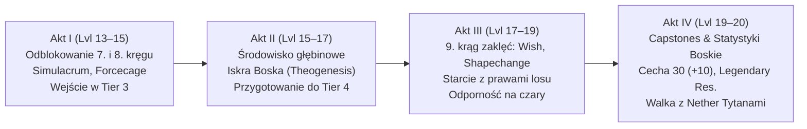
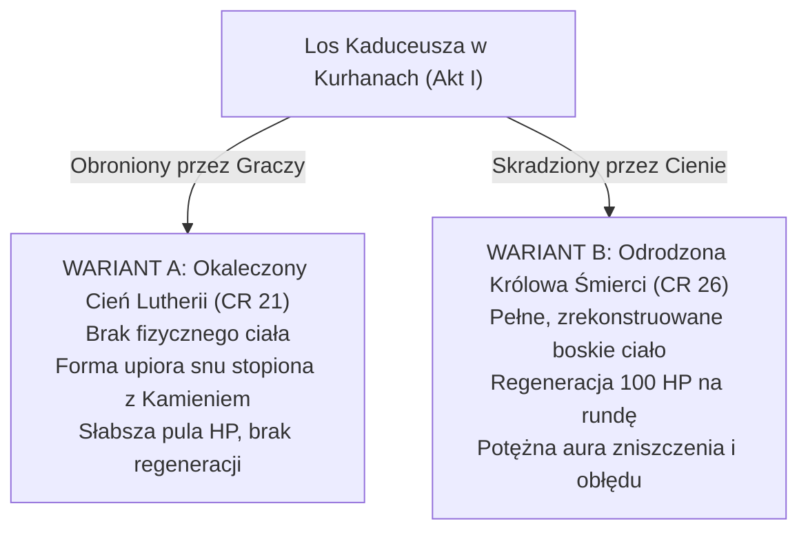
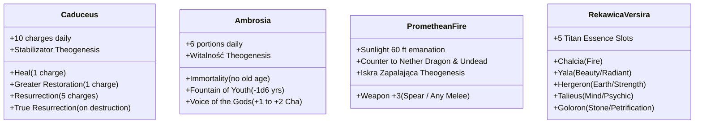
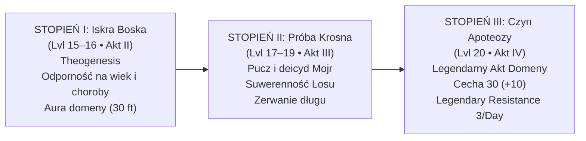

# 05 - Mechanika, Balans i Statbloki (Tier 3–4)

Kompleksowy podręcznik mechaniki D&D 5e dla poziomów 13–20 w kampanii *Nowa Era*. Zawiera analizę ekonomii akcji, wytyczne balansu czarów wysokich kręgów, projekty kluczowych spotkań bojowych (*encounter design*), pełne statbloki bossów (Zakroth CR 15, Karpathos, Scylla z zasadą Swallow Whole, Krosno Mojr, Nether Tytany), mechaniki Boskich Artefaktów, zasady Theogenesis oraz statystyki pojazdu bojowego Kolos Pythora.

---

**Projekt:** Odyseja Smoczych Władców — Nowa Era (Sesje 85–120)  
**Kategoria analizy:** Mechanika D&D 5e, Encounter Design, Ekonomia Akcji, Artefakty i Ścieżka Boskości  
**Autor:** Główny Projektant Mechaniki D&D 5e  
**Data sporządzenia:** Wrzesień 2026  
**Status:** Raport Recenzyjny / Gotowy do wdrożenia mechanicznego  

---

## 1. Wstęp Metodologiczny i Ramy Balansu Tier 3 & Tier 4

Projekt kontynuacji kampanii *Odyseja Smoczych Władców* (Nowa Era) stawia przed Mistrzem Gry i projektantami mechaniki jedno z najtrudniejszych wyzwań w D&D 5e: **zarządzanie rozgrywką w przedziale poziomów 13–20 (Tier 3 i Tier 4)**.

Na tych poziomach tradycyjny balans matematyczny D&D 5e ulega załamaniu, jeśli stosuje się wyłącznie standardowe wytyczne z *Dungeon Master’s Guide* czy surowe statbloki z oficjalnych modułów. Dostęp do magii 7., 8. i 9. kręgu, potężnych zdolności klasowych oraz legendarnych artefaktów sprawia, że:
1. Pojedyncze potwory (nawet o CR 20+) bez odpowiedniej ochrony ekonomii akcji giną w ciągu 1–2 rund.
2. Zdolności kontroli pola bitwy (*Forcecage*, *Maze*, *Simulacrum*, *Reverse Gravity*) potrafią natychmiast wyłączyć bossa z walki bez rzutu obronnego.
3. Wyzwania eksploracyjne (głód, oddychanie pod wodą, podróż przez kontynent) przestają istnieć bez wprowadzenia specyficznych środowiskowych barier arkanicznych.

Niniejsza analiza dokonuje krytycznego przeglądu mechanik zaproponowanych w dokumentach Nowej Ery (`00`–`07`), weryfikuje je względem zasad podręcznikowych (*Odyssey of the Dragonlords REMASTER*, rozdziały 10–13 oraz dodatki B, C, D) i dostarcza kompletnych, grywalnych narzędzi mechanicznych dla stołu.

---

## 2. Poziom Drużyny i Tempo Rozwoju (Krzywa Potęgi Lvl 13–20)

Progresja kampanii zakłada podział na cztery akty:
- **Akt I (Lvl 13 ➔ 15):** Wojna Braterska i Półwysep Arezyjski
- **Akt II (Lvl 15 ➔ 17):** Zatopione Królestwo i Prometejski Ogień
- **Akt III (Lvl 17 ➔ 19):** Pucz na Krosno Losu i Deicyd Mojr
- **Akt IV (Lvl 19 ➔ 20):** Apokalypsis i Świt Nowego Panteonu

### 2.1. Zderzenie Progresji Klasowej z Magią Wysokich Kręgów

Drużyna składa się z 5 doświadczonych postaci o wyrazistych rolach:
1. **[[Versir]]** (Aasimar Paladin / Sorcerer — multiclass charakteryzujący się potężnym *Nova Damage* ze Smite'ów, aurą obronną +4/+5 do wszystkich rzutów obronnych w promieniu 10/30 stóp oraz dostępem do metamagii i czarów arkanicznych).
2. **[[Orion Xul|Orion]]** (Half-Elf Fighter — wieloatakowy juggernaut, Action Surge, Indomitable, dysponujący bronią [[Odkupienie Pythora]]; potrafi zadać ponad 100 obrażeń fizycznych w jednej turze).
3. **[[Felicjan Janus Twardowski|Felicjan]]** (Human Wizard — pełny caster arkaniczny, wskrzesiciel Zakonu Smoczych Lordów na smoku [[Kairos|Kairosie]], operujący czarami kontrolnymi, przywołaniami i [[Klonicjan|Klonicjanem]]).
4. **[[Orestes]]** (Minotaur Barbarian — gigantyczna pula punktów życia z redukcją obrażeń w szale, Reckless Attack, Brutal Critical, dzierżący [[Topór Xandera]]).
5. **[[Arevon Elorrenthi|Arevon]]** (Elf Druid Kręgu Gwiazd — pełny caster boski/natury, wszechstronna forma gwiezdna, leczenie, czary obszarowe, unikanie kar w walce).

#### Poziom 13 ➔ 14 (Akt I): Przełom 7. Kręgu Magii
- **Odblokowane zasoby:** Magowie i druidzi zyskują sloty 7. kręgu. Kluczowe zaklęcia: *Forcecage*, *Simulacrum*, *Teleport*, *Reverse Gravity*, *Plane Shift*.
- **Problem mechaniczny:** *Forcecage* nie wymaga rzutu obronnego i więzi istoty niemające teleportacji w klatce bez możliwości ucieczki. Standardowy minotaur czy wampir z podręcznika staje się bezradny.
- **Rekomendacja balansu:** Każdy boss w Akcie I i kolejnych musi posiadać albo wbudowaną zdolność teleportacji (*Misty Step*, *Dimension Door*, *Gaseous Form*), albo cechę *Siege Monster / Shattering Roar*, pozwalającą na test charyzmy/siły w celu naruszenia barier arkanicznych.

#### Poziom 15 ➔ 16 (Akt II): Wejście 8. Kręgu i Iskra Boska
- **Odblokowane zasoby:** Sloty 8. kręgu (*Maze*, *Antimagic Field*, *Sunburst*, *Earthquake*, *Tsunami*).
- **Wpływ na środowisko:** Zaklęcie *Water Breathing* rzucane jest jako 3-poziomowy rytuał trwający 24 godziny dla 10 istot — eksploracja podwodna nie może opierać się na prostym „braku powietrza”. Zagrożeniem musi być ciśnienie głębinowe, prądy Nether Sea oraz efekty rozpraszające magię (*Dispel Magic / Antimagic zones*).

#### Poziom 17 ➔ 18 (Akt III): Progresja do 9. Kręgu (Tier 4)
- **Odblokowane zasoby:** Zaklęcia 9. kręgu (*Wish*, *Meteor Swarm*, *True Polymorph*, *Foresight*, *Shapechange*). Odblokowanie *Spell Mastery* u Felicjana (darmowe *Shield* i *Misty Step* co rundę!).
- **Problem mechaniczny:** Na poziomie 17 drużyna może rzucić *Meteor Swarm* (zadające 40d6 obrażeń na gigantycznym obszarze) lub *Shapechange* w dorosłego smoka / planetara. Zwykłe wiedźmy z podręcznika (*Green Hag* CR 3, *Night Hag* CR 5) zostałyby zmiecione w rundzie niespodzianki.
- **Rekomendacja balansu:** Konfrontacja z Mojrami nie może być pojedynkiem na HP. Musi być starciem konceptualno-rytualnym z barierą absolutnej niewrażliwości (*Cosmic Weave*), gdzie obrażenia nie mają znaczenia dopóki nie zostaną obsadzone fotele Krosna.

#### Poziom 19 ➔ 20 (Akt IV): Mityczne Capstones i Apoteoza
- **Odblokowane zasoby:** 4 ataki bazowe wojownika (8 w Action Surge), nielimitowany szał barbarzyńcy i cechy +4 Str / +4 Con (do 24), nielimitowany Wild Shape u druida, boskie cechy o wartości 30 (+10) z *Appendix D*.
- **Wymóg spotkań:** Nether Tytani muszą generować zagrożenie rzędu CR 24–28, operować automatycznymi aurami niszczącymi sloty czarów (*Engine of Undoing*) oraz posiadać legendarne reakcje przerywające tury graczy.

---

## 3. Encounter Design & Action Economy (Szczegółowa Rewizja Aktów)

### 3.1. AKT I: Półwysep Arezyjski i Kurhany Karpathosa

#### 3.1.1. Fort Zakrotha — Problem CR 11 i Pacyfikacja Półwyspu
W oficjalnym podręczniku (*The Aresian Peninsula*, s. 248) [[Zakroth]] posiada statystyki zwykłego **Minotaur Berserker** (CR 11, 189 HP, AC 16/18 w pancerzu płytowym, Cha 20, DC 18 *Command* z Ambrozji).
- **Ocena balansu:** **KRYTYCZNIE ZA SŁABY.** Dla pięciu bohaterów na 13.–14. poziomie o łącznym DPR (obrażeniach na rundę) przekraczającym 150 pkt, Zakroth bez Legendarnych Akcji ginie w 1. rundzie zanim zdąży wykonać ruch. Jego czar *Command* jako bonus action jest łatwo negowany przez aurę Versira (+5 do rzutów obronnych).

##### Nowy Statblok: Zakroth, Wybraniec Hergerona (CR 15)
*Large Monstrosity (Minotaur), Neutral Evil*
- **Armor Class:** 19 (Mithral Plate + Ring of Defense)
- **Hit Points:** 275 (22d10 + 154) | **Regeneracja:** 15 HP na początku tury, dopóki ma przy sobie Ambrozję.
- **Speed:** 40 ft., Bull Form 60 ft.
- **STR:** 24 (+7) | **DEX:** 14 (+2) | **CON:** 24 (+7) | **INT:** 10 (+0) | **WIS:** 16 (+3) | **CHA:** 20 (+5)
- **Saving Throws:** Str +12, Con +12, Wis +8, Cha +10
- **Skills:** Athletics +12, Intimidation +10, Perception +8
- **Damage Resistances:** Bludgeoning, Piercing, and Slashing from Nonmagical Attacks
- **Condition Immunities:** Charmed, Frightened
- **Senses:** Darkvision 60 ft., Passive Perception 18
- **Challenge:** 15 (13,000 XP) | **Proficiency Bonus:** +5

**Cechy Specjalne:**
- **Ambrosia Radiance:** Zakroth emituje 15-stopową aurę majestatu. Każdy wróg rozpoczynający turę w aurze musi wykonać rzut obronny na Wisdom (DC 18) lub otrzymać stan *Frightened* lub *Charmed* (wybór Zakrotha) do końca swojej tury.
- **Indomitable Will (3/Day):** W przypadku nieudanego rzutu obronnego Zakroth może przerzucić kość.
- **Reckless Assault:** Może zyskać ułatwienie w atakach wręcz, dając ułatwienie atakującym go do następnej tury.

**Akcje:**
- **Multiattack:** Zakroth wykonuje trzy ataki *Mithral Honorblade* lub kopytami, oraz jeden atak rogami (*Gore*).
- **Mithral Honorblade:** *Melee Weapon Attack:* +12 do trafienia, zasięg 5 ft. *Trafienie:* 20 (2d12 + 7) obrażeń ciętych. Niszczy niemagiczne tarcze.
- **Gore (Rogi):** *Melee Weapon Attack:* +12 do trafienia, zasięg 5 ft. *Trafienie:* 18 (2d10 + 7) obrażeń kłutych. Przy szarży min. 20 ft. cel otrzymuje dodatkowe 21 (6d6) obrażeń i testuje Strength DC 20 (przewrócenie na ziemię).

**Akcje Bonusowe:**
- **Voice of the Warlord (Recharge 4–6):** Zakroth rzuca zaklęcie *Command* (DC 18) na maksymalnie 3 cele jednocześnie bez użycia slotu.

**Legendarne Akcje (3/Rundę):**
1. **Atak Bronią (1 Koszt):** Zakroth wykonuje jeden atak mieczem.
2. **Tąpnięcie Ziemi Hergerona (2 Koszty):** Wstrząsa ziemią w promieniu 15 stóp. Wszystkie istoty na ziemi testują Dex DC 20 lub otrzymują 14 (4d6) obrażeń obuchowych i lądują *Prone*.
3. **Rozkaz Wodza (2 Koszty):** Sprzymierzony gigant lub centaur natychmiast wykonuje jedną akcję ataku w ramach swojej reakcji.

**Mechanika Zakładników (Ekonomia Czasu):**
W komorze Z11 czterech zakładników (synowie Agriusa) wisi w żelaznych klatkach nad dołem z wrzącą smołą. Co rundę na inicjatywie 20 mechanizm zębaty opuszcza klatki o 5 stóp (na wysokości 0 stóp zakładnicy giną w 3. rundzie). Drużyna musi podzielić zasoby: część bohaterów blokuje Zakrotha i wiedźmy, podczas gdy druga manipuluje kołowrotem (Strength/Athletics DC 18) lub niszczy łańcuchy (AC 19, HP 30).

---

#### 3.1.2. Kurhany Karpathosa — Portret, Regeneracja i Tykający Zegar
W podręczniku (*The Aresian Peninsula*, s. 258–264) [[Karpathos]] dzierży [[Caduceus|Kaduceusz]], regeneruje 100 HP dotykiem, a po 10 minutach wkracza 4 Nuckle uwalniających 30 wampirzych pomiotów.

##### Błędy Podręcznika:
1. **Regeneracja 100 HP:** W tekście przygody napisano: *„Karpathos wields the Caduceus. He can use a Bonus action to touch another undead creature and cause it to regain 100 Hit Points”*. RAW nie pozwala mu uleczyć samego siebie!
2. **Problem 10 minut:** 10 minut w 5e to 100 rund walki lub 1/6 krótkiego odpoczynku. Jeśli drużyna nie odpoczywa, walka z Karpathosem kończy się w 3–4 rundy (poniżej 1 minuty) i gracze wychodzą ze skarbcem zanim Nucklowie w ogóle dotrą do grobowca!

##### Nowa Architektura Starcia:
- **Karpathos the Wolf Lord (CR 16):** HP 220, AC 18. Dzierżąc Kaduceusz, może użyć akcji bonusowej, by przywrócić 100 HP sobie LUB innemu nieumarłemu (max 2 razy w trakcie walki).
- **Rola Portretu Karpathosa (Filakterium):** Gracze posiadają portret kupiony w Galerii w Arezji za 50k gp.
  - *Dopóki Portret jest nienaruszony:* Karpathos posiada stałą regenerację 30 HP na rundę (nie zatrzymywaną przez obrażenia od światłości ani wodę święconą!). Gdy spadnie do 0 HP, automatycznie zamienia się w mgłę i regeneruje w sarkofagu.
  - *Zniszczenie Portretu:* Portret ma AC 13, HP 40 (podatność na ogień i cięcie). Po zniszczeniu: regeneracja Karpathosa spada do standardowych 20 HP i zostaje zablokowana na 1 rundę po otrzymaniu obrażeń od światłości; traci odporność na ostateczną śmierć.
- **Dynamiczny Zegar (Necrotic Breach):**
  Zamiast czekać 10 minut czasu fabularnego, wejście Nuckli zostaje powiązane z naruszeniem sarkofagu w K9:
  - **Runda 2 walki z Karpathosem:** Ziemia drży. W korytarzach K3, K4 i K6 pękają płyty grobowe.
  - **Runda 3:** Do komory wdzierają się **4 Nuckle** (CR 8), a za nimi fala wampirzych pomiotów. Nucklowie ignorują Karpathosa i skupiają się wyłącznie na wyrwaniu Kaduceusza: próbują rozbroić trzymającego laskę (test przeciwstawny Athletics) i uciec z nią w stronę wyjścia (Captive Charge, Dash 60 ft.).
  - Powstaje dynamiczne, trójstronne starcie: Bohaterowie vs Karpathos i Nemosyne vs Sługi Lutherii (Nucklowie).

---

### 3.2. AKT II: Podmorska Odyseja, Scylla i Phaeros

#### 3.2.1. Walka Podwodna w Nowej Egei
Podręcznikowe zasady walki pod wodą (PHB s. 198 / DMG s. 116):
- Brak Swim Speed = utrudnienie (*Disadvantage*) na ataki bronią białą inną niż sztylet, oszczep, krótki miecz, włócznia, trójząb. Orestes z toporem dwuręcznym ma permanentne utrudnienie (lub musi niwelować je Reckless Attack, dając wrogom ułatwienie).
- Ranged weapon attacks = automatyczne pudło poza zasięgiem bazowym, utrudnienie w zasięgu bazowym (wyjątek: kusze, broń miotana).
- Odporność na ogień dla wszystkich obiektów i istot zanurzonych w wodzie.

##### Mechanika Coven Power Wiedźm Merrow:
W Nowej Egei występują **Merrow Hags** (CR 7). Posiadają zdolność *Coven Power*:
- *Constitution Save DC 14:* W przypadku porażki cel traci zdolność oddychania pod wodą (nawet z czaru *Water Breathing*!) do końca swojej następnej tury i otrzymuje 1 poziom wyczerpania (*Exhaustion*).
- **Komentarz balansu:** Jest to doskonałe, śmiertelne zagrożenie taktyczne w głębinach, które wymusza natychmiastowe zdjęcie wiedźm przez magów z dystansu.

#### 3.2.2. Scylla (CR 24) — Dziura w Statbloku i Brak Połykania
W *Appendix B* Scylla ma wspaniały opis fabularny: *„She sleeps at the bottom of the Chasm... Phaeros is trapped in her stomach... digestions takes thousands of years”*. Jednak w statbloku w podręczniku:
- **Brak akcji Swallow Whole!** Scylla może chwycić cel w paszcze (Grappled/Restrained), ale mechanicznie nie ma jak go połknąć!
- **Putrid Blood Reaction:** Przy stanie *Bloodied* (poniżej 259 HP) Scylla zmusza wszystkie istoty w promieniu **300 stóp** do rzutu obronnego Con DC 24 lub zostają sparaliżowane (*Paralyzed*) do końca swojej następnej tury. DC 24 na poziomie 15–16 bez aury Paladyna oznacza 85–95% szans na paraliż całej drużyny, co w połączeniu z 6 atakami Scylli grozi natychmiastowym TPK!

##### Oficjalna Poprawka Statbloku Scylli:
1. **Dodanie akcji Swallow (Akcja Bonusowa):**
   *Połknięcie:* Scylla podejmuje próbę połknięcia jednej istoty o rozmiarze Dużym lub mniejszym, którą trzyma w paszczy (*Grappled*). Cel musi wykonać rzut obronny na Dexterity (DC 22). W przypadku porażki cel zostaje połknięty. Połknięta istota jest oślepiona, skrępowana (*Restrained*), ma całkowitą osłonę przed atakami z zewnątrz i otrzymuje 35 (10d6) obrażeń od kwasu na początku każdej tury Scylli. Jeśli Scylla otrzyma 60 lub więcej obrażeń w jednej turze od istoty wewnątrz, musi wykonać rzut obronny na Con (DC 20) — przy porażce zwraca połkniętą istotę.
2. **Korekta Putrid Blood:**
   Zasięg reakcji zredukowany z 300 stóp do **60 stóp**, a stopień trudności rzutu obronnego ustalony na **DC 21 Constitution** (zamiast niemożliwego DC 24).
3. **Macki Kentimane'a (Legendarna Akcja — 2 Koszty):**
   *Tentacle Slam:* Zasięg 30 ft., +16 do trafienia. Obrażenia: 22 (3d8 + 9) obuchowe + cel jest przyciągany o 20 stóp w stronę paszcz Scylli.

#### 3.2.3. Status Anioła Phaerosa (Solar vs Planetar)
Podręcznik w tekście lokacji G8 nazywa Phaerosa *Solar*, podczas gdy w innych miejscach mówi o nim jak o upadłym/osłabionym posłańcu.
- **Problem balansu:** Pełny Solar (CR 21, 400 HP, flying 150 ft, Slaying Longbow zadający 4d8 + 8d8 radiant z natychmiastową śmiercią przy nieudanym DC 15 Con, czary *Heal* 3/day) przewyższa siłą bojową całą drużynę na 15. poziomie i sprowadza graczy do roli widzów.
- **Rekomendacja mechaniczna:** Phaeros po tysiącleciach w żołądku Scylli i działaniu kwasu Nether Sea jest **Osłabionym Solarem (Weakened Solar — profil Planetara CR 16)**:
  - HP: 210, AC 19.
  - Skrzydła są częściowo strawione (Speed 30 ft., Swim 40 ft., Fly 40 ft.).
  - Utracił swój *Slaying Bow*; dzierży płonący miecz zasilany [[Promethean Fire|Ogniem Prometejskim]] (+12 do trafienia, 4d6 slashing + 4d8 radiant).
  - Posiada tylko 1 użycie czaru *Heal*. Stanowi potężnego, ale nie dominującego sojusznika.

---

### 3.3. AKT III: Pucz na Krosno Losu (Mechanika Kowenu i Deicydu)

W oficjalnym module Mojry ([[Nona]], [[Decima]], [[Morta]]) to zwykłe wiedźmy z *Monster Manual* (CR 3 i CR 5). Na poziomach 17–19 drużyna zmiotłaby je w 6 sekund. Co gorsza, fabularny fundament Nowej Ery zakłada, że **Mojr nie da się zabić konwencjonalnym mieczem ani czarem**, dopóki tkają los przy Krośnie.

#### 3.3.1. Mechanika Zagadki Bojowej: Trójtorowe Starcie (The Triple-Track Encounter)

Starcie w wilgotnej jaskini Krosna Losu dzieli się na trzy równolegle trwające mechaniki:

```mermaid
flowchart TD
    subgraph Track1["TOR 1: Tarcza Kosmicznego Krosna"]
        LoomImmunity["Mojry mają Immunity to All Damage\nAtaki i czary są cofane w czasie"]
        Dislodge["Odepchnięcie Mojry z tronu\n(Athletics/Arcana DC 22)"]
        Seat["Obsadzenie fotela przez nową tkaczkę\n(1 pełna runda podtrzymania koncentracji)"]
        LoomImmunity --> Dislodge --> Seat
    end

    subgraph Track2["TOR 2: Warkocz Undecimy (Ione)"]
        Braid["Nić Ione wpleciona jako 4. pasmo Mojr"]
        Risk["Każdy cios w Mojry zadaje 50% dmg Ione"]
        Unweave["Rozplatanie warkocza: 3 sukcesy DC 20\n(Sleight of Hand / Arcana / Ofiara Oriona)"]
        Braid --> Risk --> Unweave
    end

    subgraph Track3["TOR 3: Faza Deicydu"]
        Vulnerable["Po obsadzeniu 3 foteli i uwolnieniu Ione:\nMojry tracą niewrażliwość"]
        Shears["Zgładzenie przez Nożyce Przeznaczenia\n(Przecięcie nici ich własnego żywota)"]
        Vulnerable --> Shears
    end
```

1. **Niewrażliwość Krosna (*Cosmic Loom Ward*):**
   - Dopóki co najmniej dwie Mojry dotykają Krosna, mają całkowitą odporność na wszystkie obrażenia i stany. Zaklęcia takie jak *Forcecage* czy *Banishment* natychmiast ulegają rozproszeniu, gdy Krosno przepisuje trajektorię arkanów.
   - Aby pozbawić Mojrę kontaktu z fotelem, bohater musi wygrać test przeciwstawny Siły (Athletics) lub Magii (Arcana/Spellcasting) przeciwko DC 22 Mojry, odpychając ją na co najmniej 15 stóp.
   - W pustym fotelu musi natychmiast zasiąść przygotowana kandydatka ([[Wiedźma Lotosu]], [[Versi]], [[Astra]]/[[Lyra]]). Nowa tkaczka musi utrzymać pozycję przez 1 pełną rundę (rzuty na Concentration DC 18 przy atakach sług Mojr), aby zestroić się z wrzecionem.

2. **Warkocz Undecimy (Ione) jako Żywa Tarcza:**
   - Nić Ione stanowi czwarte pasmo warkocza losu.
   - Jeśli którakolwiek Mojra otrzyma obrażenia lub zostanie odrzucona siłą, Ione otrzymuje 35 (10d6) obrażeń od siły (*Force*) i zyskuje 1 poziom wyczerpania.
   - **Rozplatanie Nici:** Wymaga akcji bohatera znajdującego się w odległości 5 stóp od Ione i udanego testu Dexterity (Sleight of Hand) lub Intelligence (Arcana) DC 20. Wymagane są 3 skumulowane sukcesy.
   - **Akt Ojcowskiego Poświęcenia Oriona:** Orion może zamiast testu zadeklarować przyjęcie karmicznego rozdarcia na siebie — poświęca swoje punkty życia (automatyczne 50 dmg niemożliwe do zredukowania) i 1 użycie Action Surge, by natychmiastowo rozpleść nić córki jednym ciosem włóczni.

3. **Statystyki Bojowe Kowenu w Fazie Deicydu (CR 19 Coven):**
   Po zerwaniu więzi z Krosnem, Mojry manifestują swoje potężne, pradawne formy:
   - **Morta the Fate-Severer (CR 18):** HP 240, AC 18. Zaklęcia: *Power Word Stun*, *Finger of Death*, *Time Ravager* (10d12 necrotic, DC 20 Con).
   - **Nona the Thread-Spinner (CR 16):** HP 195, AC 17. Zdolność *Spindle Entanglement* (DC 19 Str save lub unieruchomienie w niciach z obrażeniami psychicznymi).
   - **Decima the Measure-Caster (CR 16):** HP 190, AC 17. Zdolność *Twist Probability* (3/rundę reakcja: zmiana rzutu d20 gracza na wynik 1 lub rzutu sojusznika na 20).
   - **Warunek Śmierci:** Zredukowanie ich do 0 HP nie zabija ich trwale (rozpływają się w mgłę losu i wracają po 1d4 dniach). Ostateczny deicyd następuje wyłącznie wtedy, gdy nowa tkaczka na fotelu Morty użyje *Nożyc Przeznaczenia*, by przeciąć ich fizyczne nici wiszące nad Krosnem.

---

### 3.4. AKT IV: Apokalypsis, Obrona Stolic i Finał z Lutherią

#### 3.4.1. Cztery Nether Tytany — Profile i Ramy Mechaniczne

| Tytan | CR | HP / AC | Główne Zagrożenie Mechaniczne | Słabość / Klucz Taktyczny |
|---|:---:|:---:|---|---|
| **[[Tarrasque]]** | 30 | 676 / 25 | Reflective Carapace (odbija czary na 1–5 na d6), Siege Monster, 5 ataków | Poświęcenie na Złotym Sercu zdejmuje pancerz i daje wrażliwość na Radiant LUB zaklęcie *Maze* (Int 3) |
| **[[Kraken]]** | 23 | 472 / 18 | 10 macek, rzucanie istotami (Fling 60 ft), Ink Cloud, Lightning Storm | Wrażliwość na zaklęcia manipulacji umysłem (*Charm Monster*, DC 17 Wis), *Trójząb Andromedy* |
| **[[Nether Dragon]]** | 24 | 546 / 22 | Nether Breath (90 ft cone, 45 fire + 45 necrotic, DC 24 Dex), ataki nocne | **Sunlight Vulnerability:** 20 dmg radiant na turę w słońcu oraz utrudnienie na wszystkie rzuty; Ogień Prometejski |
| **[[Behemoth]]** | 28 | 615 / 20 | *Engine of Undoing* (kradzież slotów czarów co rundę!), *Annihilation Breath* (126 force dmg, DC 26 Con), *Devour Reality* | Uwolnienie bliźniaczki Ariadne z Sześcianu LUB zabicie czarem *Wish* w trakcie regeneracji |

#### 3.4.2. Zasady Masowej Obrony Stolic (Allied Defense Allocation System)
W oficjalnym module autorzy zmuszają MG do zniszczenia 4. atakowanego miasta bez względu na działania graczy. W Nowej Erze zastępujemy to **Systemem Przydziału Sojuszników**:

Drużyna dysponuje zgromadzonymi przez 15 lat zasobami:
1. **Smoczy Lordowie i dojrzały Kairos** (Zakon Felicjana)
2. **Falanga Arezyjska i Mnisi Yosfora** (Arezja)
3. **Wolne Plemiona Centaurów i Minotaurów** (Agrius i uwolnieni zakładnicy)
4. **Wojenna Flota Minotaurów i Piratów** (Orestes i wrak Ultrosa)
5. **Armia Estorii i Weterani Wojenni** (Pythor i Orion)
6. **Latająca Forteca Smoczych Lordów** (antyczna baza)
7. **Anioł Phaeros i Amazonki na Rhinotitanach** (Themis)

##### Mechanika Teatrów Wojny:
Gracze wysyłają co najmniej jeden potężny kontyngent do obrony miast, podczas gdy sami stawiają czoła jednemu z Tytanów osobiście:
- **Dopasowanie Taktyczne:** Jeśli gracze wyślą zasób kontrujący naturę potwora (np. Phaeros ze światłością do Estorii przeciw Nether Dragonowi; Falanga z machinami i Kolosem Pythora do Mytros przeciw Tarrasque'owi; Flota z syrenami przeciw Krakenowi), obrońcy uzyskują **Sukces Strategiczny**.
- **Skutek Sukcesu:** Miasto zostaje ocalone, zniszczenia ograniczają się do zewnętrznych murów i portu (poniżej 15% strat w ludności), a sojusznicy dołączają do drużyny w szturmie na Pałac Hyperionów.
- **Porażka / Brak wsparcia:** Miasto obraca się w ruinę, generując tysiące uchodźców i podnosząc poziom rozpaczy w finale.

---

#### 3.4.3. Finałowe Starcie: Lutheria i Kamień Apokalipsy

W podręczniku Lutheria w ogóle nie walczy z graczami w finale — zostaje rozproszona przez Furie za złamanie przysięgi wobec Hyperionów. To skrajnie rozczarowujące rozwiązanie zostaje zastąpione **Dwuwariantowym Starciem z Boginią Śmierci**:

##### WARIANT A: Okaleczony Cień Lutherii (Ścieżka Domyślna — Kaduceusz Ocalony)
- **Koncepcja:** Lutheria nie zdołała zrekonstruować ciała ściętego w Sesji 82. Manifestuje się jako bezcielesny, gigantyczny koszmar ze snów spleciony z Kamieniem Apokalipsy.
- **CR:** 21 (HP: 340, AC 18).
- **Odporności:** Niewrażliwość na obrażenia niemagiczne, nekrotyczne, truciznę, psychiczne. Postać bezcielesna (*Incorporeal Movement*).
- **Ataki:** *Nightmare Scythe* (+14 do trafienia, 4d8+7 force + 4d8 psychic), *Call of the Deep Sleep* (DC 21 Wis save lub zapadnięcie w śpiączkę z koszmarami).
- **Kontra Orestesa (Dysonans Hymnu):** W 3. rundzie Orestes może użyć akcji, by zaryczeć biesiadną wersję hymnu ożywienia, wyuczoną w browarze. Powoduje to natychmiastowe **75 obrażeń od siły (*Force*)** dla cienia Lutherii, przerywa jej koncentrację i nakłada na nią stan *Stunned* do końca jej następnej tury!

##### WARIANT B: Odrodzona Królowa Śmierci (Porażka w Akcie I — Kaduceusz Utracony)
- **Koncepcja:** Złamanie laski przez Hyperiona rzuciło *True Resurrection*. Lutheria powróciła w pełnym ciele i boskiej chwale.
- **CR:** 26 (HP: 520, AC 22).
- **Regeneracja 100 HP:** Na początku każdej swojej tury Lutheria odzyskuje **100 Hit Points**. 
  - *Złamanie regeneracji:* Regeneracja zostaje zablokowana do początku jej kolejnej tury TYLKO wtedy, gdy w ciągu jednej rundy otrzyma łącznie co najmniej **50 obrażeń od światłości (*Radiant*) oraz 50 obrażeń od siły (*Force*)**, LUB jeśli ktoś zdoła dotknąć jej Kaduceuszem Damona i zdać test przeciwstawny Spellcasting DC 22.
- **Legendary Resistance:** 5/Day.
- **Call of Oblivion (Aura 1 Mili):** Istoty ze stanem *Bloodied* mają utrudnienie na wszystkie rzuty obronne. Każde leczenie otrzymywane przez graczy w promieniu 120 stóp od Lutherii jest zmniejszone o połowę.

##### Kamień Apokalipsy (Mechanika Obiektu w Walce):
- **Statystyki:** Gargantuan object, AC 22, HP 350, Damage Threshold 20 (ataki zadające mniej niż 20 pkt obrażeń zadają 0).
- **Połączenie z Lutherią:** Dopóki Kamień stoi, Lutheria ma opór (*Resistance*) na wszystkie typy obrażeń oraz niewrażliwość na nekrotyczne i psychiczne (*Blood of the Yoten*).
- **Zniszczenie Kamienia:** Gracze muszą podzielić ataki: część bije Lutherię, część rozbija Kamień. Przy 0 HP Kamień eksploduje falą energii (DC 22 Dex save, 14d6 force dmg), portal do Lost Lands zamyka się na zawsze, a Lutheria traci wszystkie odporności i regenerację!

---

## 4. Ekonomia i Potęga Boskich Artefaktów

Wprowadzenie Boskich Artefaktów do ekwipunku graczy wymaga ścisłego określenia zasad dostrajania (*Attunement*), limitów użyć i synergii, aby uniknąć załamania ekonomii zasobów drużyny.

### 4.1. Kaduceusz Damona (The Caduceus)
- **Typ:** Różdżka/Laska, Artefakt (Wymaga dostrojenia przez spellcastera — sugerowany Felicjan lub Versir).
- **Zasoby:** 10 ładunków, odnawiane codziennie o świcie.
- **Zaklęcia:**
  - *Heal* (6. krąg, 70 HP) — koszt: **1 ładunek**. (Rekomendacja: max 2 użycia na odpoczynek krótki, aby nie zamienić laski w nieskończoną aptekę).
  - *Greater Restoration* — koszt: **1 ładunek**.
  - *Resurrection* (7. krąg) — koszt: **5 ładunków**.
- **Funkcja Kosmiczna:** **Stabilizator Duszy.** Podczas rytuału *Theogenesis* zapobiega spaleniu śmiertelnego układu nerwowego przez Ogień Prometejski.
- **Klątwa/Zagrożenie:** Użycie czarnej magii laski (*Create Undead* za 2 ładunki lub wskrzeszenie wampira) wymaga rzutu obronnego Wisdom DC 18 — przy porażce postać zyskuje skazę nekromantyczną (wrażliwość na obrażenia od światłości na 24h).

### 4.2. Ambrozja (Ambrosia)
- **Typ:** Cudowny Przedmiot, Legendarny. Amfora zawiera 6 porcji dziennie, odnawianych o świcie.
- **Właściwości Podręcznikowe:** Brak starzenia; cofanie wieku o 1d6 lat; +1 do Charyzmy (do max 20) na 24h.
- **Korekta Projektowa dla Graczy Lvl 13+:** Większość postaci opartych na Charyzmie (np. Versir) ma już Charyzmę na poziomie 20. Zgodnie z RAW z podręcznika przedmiot byłby dla nich bezużyteczny!
  - **Ulepszenie:** Ambrozja zwiększa Charyzmę o +2, **przekraczając naturalne maksimum do limitu 22**.
  - **Efekt Witalności:** Wypicie porcji daje dodatkowo **25 tymczasowych punktów życia** oraz przewagę (*Advantage*) w rzutach obronnych przeciwko truciznom i chorobom na 8 godzin.

### 4.3. Ogień Prometejski (Promethean Fire)
- **Typ:** Broń (+3 Włócznia lub dowolna broń biała po dostrojeniu), Legendarny (Wymaga dostrojenia — idealna dla Oriona lub Versira).
- **Promieniowanie Słoneczne:** Emituje prawdziwe światło słoneczne (*True Sunlight*) w promieniu 60 stóp jasnego światła i kolejne 60 stóp przyćmionego.
  - **Znaczenie taktyczne:** W promieniu światła wampiry w Kurhanach tracą regenerację i otrzymują 20 obrażeń co rundę; Nether Dragon otrzymuje 20 obrażeń radiant na początku swojej tury i ma utrudnienie na wszystkie ataki.
- **Rola w Theogenesis:** Działa jak iskra zapłonowa, która rozszczepia śmiertelną powłokę i instaluje zarodek boskości.

### 4.4. Rękawica Versira (Hand of Kentimane)
Rękawica ze smoczej kości noszona przez Versira od Sesji 38, gromadząca esencje Zaginionych Tytanów. W Sesji 84 posiada 4 esencje, a w Zatopionym Królestwie czeka piąta (Goloron).

##### Zbalansowany Model Mechaniczny Rękawicy (5 Slotów):
Rękawica posiada **5 Punktów Rezonansu Tytanów (Titan Points)**, odnawianych po długim odpoczynku. Versir może wydać punkty na aktywację unikalnych mocy swoich krewnych:
1. **Esencja Chalcii (Ogień — S38):** 
   - *Pasywnie:* Odporność na ogień. 
   - *Aktywnie (1 pkt):* Jako bonus action dodaje 2d8 obrażeń od ognia do wszystkich ataków bronią na 1 minutę LUB rzuca *Fireball* (8. krąg, DC 19).
2. **Esencja Yali (Piękno/Światłość — S61):**
   - *Pasywnie:* Przewaga w testach Persuasion.
   - *Aktywnie (1 pkt):* Oślepiający błysk (30 ft emanation, Con save DC 19 lub stan *Blinded* na 1 minutę) LUB rzucenie *Dawn* bez koncentracji.
3. **Esencja Hergerona (Ziemia/Siła — S75):**
   - *Pasywnie:* Siła traktowana jako 22 (+6), jeśli była niższa.
   - *Aktywnie (2 pkt):* Titanic Strike — uderzenie w ziemię wywołujące efekt *Destructive Wave* (obrażenia force/radiant) z przewróceniem celów.
4. **Esencja Talieusa (Sny/Umysł — S84):**
   - *Pasywnie:* Odporność na obrażenia psychiczne i niewrażliwość na uśpienie magią.
   - *Aktywnie (1 pkt):* Telepatia 1 mila LUB rzucenie *Synaptic Static* (DC 19).
5. **Esencja Golorona (Kamień/Wieczność — Akt II):**
   - *Pasywnie:* Naturalny pancerz +1 do AC.
   - *Aktywnie (2 pkt):* Rzucenie *Flesh to Stone* (DC 19) lub natychmiastowe uleczenie petryfikacji z sojusznika.

---

## 5. Przeniesienie i Rekonstrukcja Zasad z *Appendix D: The Divine Path*

Oficjalny *Appendix D* zawierał suchy, czysto mechaniczny grind (zabij potwory o CR 100 w 24h, ukuj przedmiot, daj się zabić i wskrzesić), po czym postać gracza stawała się NPC-em. Nowa Era przekształca to w **Trzystopniową Ścieżkę Apoteozy**:

### 5.1. Stopień I: Iskra Boska (*The Divine Spark* — Lvl 15–16)
Zdobywana podczas rytuału *Theogenesis* w Chamber of Beauty w Arezji przy użyciu 3 relikwii.

##### Cechy Mechaniczne Iskry Boskiej:
1. **Ciało poza czasem (Timeless Vessel):** Postać staje się niewrażliwa na choroby, trucizny (obrażenia i stan *Poisoned*) oraz efekty magicznego postarzania. Nie umiera ze starości.
2. **Aura Domeny (Domain Resonance — 30 ft):** Bohater emanuje aurą rodzącej się domeny. Wszyscy sprzymierzeńcy w promieniu 30 stóp zyskują bonus **+1 do rzutów obronnych** powiązanych z główną cechą bóstwa (np. Charyzma dla Versira, Siła/Kondycja dla Oriona, Inteligencja dla Felicjana, Mądrość dla Arevona, Kondycja dla Orestesa).
3. **Boski Impuls (Divine Surge — 1/Długi Odpoczynek):** Gracz może zadeklarować maksymalizację obrażeń z jednego ataku/czaru LUB zamienić wynik dowolnego rzutu d20 na czyste 18 przed rzutem.
4. **Pętla Krosna (Wada ukryta):** Dopóki Mojry kontrolują Krosno, Iskra niesie ukryte jarzmo. Przy rzutach obronnych przeciwko magii uroków rzucanych przez wiedźmy i Mojry postać ma utrudnienie (*Disadvantage*), dopóki nie nastąpi Pucz w Akcie III.

### 5.2. Stopień II: Próba Krosna (*The Crucible of Fate* — Lvl 17–19)
Następuje w finale Aktu III po ścięciu nici Mojr na Smoczym Krośnie.
- **Suwerenność Losu (Sovereignty of Fate):** Znosi wadę pętli Krosna. Postać staje się kowalem własnego przeznaczenia.
- **Mechanika:** 1 raz na długi odpoczynek postać może zanegować dowolny rzut krytyczny wymierzony w nią lub zmusić przeciwnika do natychmiastowego przerzucenia udanego rzutu obronnego.

### 5.3. Stopień III: Czyn Apoteozy i Statystyki na Lvl 20 (Akt IV)

Zastępujemy tabelę grindu z podręcznika spójnymi mitycznymi czynami domeny:

#### Zestawienie Czynów Domenowych i Efektów Mechanicznych na Lvl 20:

| Bohater | Wybrana Domena | Czyn Apoteozy w Akcie IV | Efekt Mechaniczny po Wstąpieniu |
|---|---|---|---|
| **[[Versir]]** | Czas i Sprawiedliwy Sąd (*Time / Order*) | Ukojenie Sturękiego Kentimane'a i uwolnienie esencji Tytanów z Rękawicy bez rozlewu krwi | **CHA 30 (+10)**, Legendary Resistance (3/Day), Immortality, Aura Spowolnienia Czasu dla wrogów |
| **[[Orion Xul\|Orion]]** | Wojna Obronna i Męstwo (*War / Protection*) | Samotna obrona wyłomu w murze Estorii i zabicie Nether Tytana włócznią [[Odkupienie Pythora]] | **STR lub CON 30 (+10)**, Legendary Resistance (3/Day), Immortality, Tarcza Ochronna absorbująca 100 dmg/rest |
| **[[Felicjan Janus Twardowski\|Felicjan]]** | Magia i Nowe Przymierze (*Arcana / Knowledge*) | Wykucie Wiecznego Paktu Magii i Smoków na grzbiecie [[Kairos\|Kairosa]] i naprawa sfer | **INT 30 (+10)**, Legendary Resistance (3/Day), Immortality, nielimitowane przygotowanie czarów do 5. kręgu |
| **[[Orestes]]** | Biesiada i Wolne Dusze (*Revelry / Life-Grave*) | Rozbicie hymnu Lutherii biesiadną pieśnią i zniszczenie Kamienia Apokalipsy | **CON lub STR 30 (+10)**, Legendary Resistance (3/Day), Immortality, Szał nie kończy się od utraty przytomności |
| **[[Arevon Elorrenthi\|Arevon]]** | Gwiazdy i Horyzont (*Stars / Travel*) | Rozproszenie mgieł Thylei za pomocą [[Antikythera\|Antikythery]] i Ognia; otwarcie szlaku do Eberronu | **WIS 30 (+10)**, Legendary Resistance (3/Day), Immortality, stała postać gwiezdna z podwójną konstelacją |

##### Zdolności Półboga na Poziomie 20 (Dla wszystkich wstępujących):
1. **Boski Atrybut (Divine Attribute):** Wybrana cecha wzrasta trwale do **30** (modyfikator +10).
2. **Legendarna Odporność (Legendary Resistance — 3/Dzień):** Jeśli postać nie zda rzutu obronnego, może wybrać sukces.
3. **Nieśmiertelność (True Immortality):** W przypadku śmierci fizycznej, dusza nie wędruje do Hadesu ani Otchłani — materializuje się w pełni sił w wybranej świątyni lub u stóp nowego Krosna po 1d10 dniach.
4. **Boska Ranga (Divine Rank 1):** Postać może wysłuchiwać modlitw i udzielać czarów kapłanom do 5. kręgu. Może wybrać pozostanie na ziemi jako Bóg-Opiekun lub wstąpienie na nowy Olimp.

---

## 6. Nietypowe Mechaniki Kampanii

### 6.1. Profil Mechaniczny NPC: Undecima / Ione Xul

Ione korzysta bezpośrednio z oficjalnego statbloku **Dusk Hag** (CR 6, *Eberron: Rising from the Last War*, s. 292).

- **Uzasadnienie projektowe:** Zrezygnowano z customowej podklasy czarnoksiężnika na rzecz gotowego, oficjalnego statbloku. Jako córka hagi Nony, Ione naturalnie dysponuje mocami wiedźmy zmierzchu (manipulacja snami, ataki psychiczne, wrodzona magia wróżbiarska i widzenie przyszłości).
- **Rola przy stole:** Funkcjonuje jako zbalansowane wsparcie dla drużyny poziomu 13–17 (Tier 3/4). Posiada solidną defensywę, nie dominuje walki i nie wymaga od Mistrza Gry mikro-zarządzania zasobami.

---

### 6.2. Zarządzanie Klonicjanem (Simulacrum Felicjana)

Wysokopoziomowe *Simulacrum* to jedna z najbardziej podatnych na nadużycia mechanik w 5e (pętla klonowania przez sloty 7.+ kręgu, monopolizowanie czasu przy stole).

##### Domowe Reguły Stołu dla Klonicjana:
1. **Ograniczenie Kręgów Magii (No-High-Tier Duplication):**
   Klonicjan nie posiada slotów 7., 8. ani 9. kręgu. Jego najwyższym dostępnym slotem jest slot 6. kręgu. Klonicjan **nie może rzucić zaklęcia *Simulacrum*** ani *Wish*.
2. **Odnawianie Zasobów (Arcane Calibration Ritual):**
   Zgodnie z RAW 5e, Simulacrum nigdy nie odzyskuje slotów. Wprowadzamy regułę warsztatową:
   - Podczas długiego odpoczynku Felicjan może poświęcić 1 godzinę na *Kalibrację Arkaniczną* i wydać 100 gp w odczynnikach alchemicznych, aby przywrócić Klonicjanowi sloty **1., 2. i 3. kręgu**.
   - Sloty 4., 5. i 6. kręgu nie podlegają regeneracji — po ich wyczerpaniu Felicjan musi stworzyć nowego klona (1500 gp, 12 godzin pracy).
3. **Ekonomia Akcji przy Stole (Streamlined Combat Turn):**
   Aby zapobiec wydłużaniu rund, Klonicjan działa w inicjatywie natychmiast po Felicjanie. W walce Klonicjan domyślnie wykonuje akcję *Dodge* i porusza się obok maga. Wydanie mu rozkazu ataku lub rzucenia zaklęcia kosztuje Felicjana **Akcję Bonusową** (*Bonus Action*).
4. **Naprawa Punktów Życia:**
   Klonicjan ma 50% bazowych punktów życia Felicjana. Może być naprawiany podczas odpoczynku za pomocą zaklęcia *Mending* i mikstur leczniczych w cenie 10 gp za każdy odzyskany punkt życia (zamiast 100 gp/HP z podręcznika).

---

### 6.3. Pilotowanie Mecha-Boga: Kolos Pythora (Bronze Colossus)

W Sesjach 81–84 bohaterowie użyli [[Kolos Pythora|Kolosa Pythora]] w obronie Mytros. W Akcie IV machina staje się potężnym orężem w obronie stolic przeciwko Tarrasque'owi lub Behemotowi.

##### Statystyki Pojazdu Bojowego: Kolos Pythora
*Gargantuan Construct (Vehicle), Armor Class 20, Hit Points 450, Damage Threshold 15*
- **Wymóg sterowania:** Wymaga pilota w komorze głowy (Pythor, Orion lub Felicjan z interfejsem arkanicznym) oraz do 3 członków załogi.

##### Role Załogi (Station Actions):
1. **Pilot Główny (Kapitan — wymaga Akcji):**
   - Kontroluje ruch Kolosa (Speed 50 ft.) oraz wykonuje atak **Giant Mithral Spear**: *Melee Weapon Attack:* +17 do trafienia, zasięg 25 ft. *Trafienie:* 32 (4d10 + 10) obrażeń kłutych + 14 (4d6) obrażeń od piorunów.
2. **Operator Artylerii / Pancerza (Crew 1 — wymaga Akcji):**
   - Wykonuje atak **Titan Stomp** (obszar 15 ft wokół stóp, Dex save DC 22, 45 (10d8) bludgeoning dmg i powalenie *Prone*) LUB wystrzeliwuje harpun kotwiczący na łańcuchu.
3. **Inżynier Rdzenia Arkanicznego (Crew 2 — wymaga Akcji):**
   - Może poświęcić slot czaru 3.+ kręgu, aby przeciążyć rdzeń: Kolos zyskuje 40 tymczasowych HP i +10 ft szybkości na 1 rundę LUB wystrzeliwuje promień piorunów w linii 120 ft (Dex save DC 20, 8d8 lightning dmg).
4. **Koordynator Obrony (Crew 3 — wymaga Reakcji):**
   - Używa reakcji do aktywacji *Płyt Obronnych Volkana*: zmniejsza otrzymane obrażenia z jednego ataku o 30 pkt LUB zużywa 1 z 3 dziennych *Legendary Resistance* Kolosa.

##### Słabość Kolosa (Vulnerability to Piercing):
Jeśli pojedynczy atak zada Kolosowi ponad **30 punktów obrażeń kłutych**, pancerz zostaje przebity. Kolos traci 40 HP na początku każdej rundy z powodu wycieku boskiego ichoru, dopóki inżynier nie zalepi wyłomu testem Arcana/Athletics DC 20 w ramach akcji.

---

## 7. Zestawienie Uwag i Rekomendacji z Priorytetami

Poniższa tabela syntetyzuje wszystkie zidentyfikowane problemy mechaniczne, przypisując im wagę oraz konkretne rozwiązanie projektowe.

| Lp. | Obszar Mechaniki | Zidentyfikowany Problem i Ryzyko | Priorytet | Rekomendowane Rozwiązanie Mechaniczne |
|:---:|---|---|:---:|---|
| **1** | **Boss Zakroth (Akt I)** | Zakroth jako Minotaur Berserker CR 11 ma tylko 189 HP i AC 18 — ginie w 1. turze od 5 graczy Lvl 13–14. | **KRYTYCZNY** | Wdrożyć statblok **Warlord of Hergeron (CR 15)**: 275 HP, regeneracja 15 HP/rundę, 3 Legendarne Akcje, rzuty obronne Str/Con/Wis/Cha +8 do +12, mechanika ratowania zakładników w 3 rundy. |
| **2** | **Kowen Mojr (Akt III)** | Mojry w podręczniku to Night Hag CR 5 i Green Hags CR 3. Na Lvl 17–19 giną od jednego *Meteor Swarm* lub Action Surge Oriona. | **KRYTYCZNY** | Zastosować **Trójtorowe Starcie (The Triple-Track Encounter)**: absolutna niewrażliwość Krosna, konieczność fizycznego obsadzenia 3 foteli przez nowe tkaczki, warkocz Ione jako żywa tarcza, deicyd przez Nożyce. |
| **3** | **Finał Lutherii (Akt IV)** | W oficjalnym podręczniku Lutheria w ogóle nie walczy — Furies rozwiązują ją za złamanie przysięgi. Antyklimaks kampanii. | **KRYTYCZNY** | Wdrożyć dwuwariantowego bossa: **Wariant A (Okaleczony Cień CR 21)** przy obronie Kaduceusza; **Wariant B (Odrodzona Bogini CR 26)** ze 100 HP regeneracji na rundę, jeśli wrogowie zdobyli Kaduceusz. Dysonans pieśni Orestesa jako broń. |
| **4** | **Reakcja Scylli (Akt II)** | Reakcja *Putrid Blood* w podręczniku ma zasięg 300 stóp i DC 24 Con save pod rygorem paraliżu — niemal gwarantowany TPK na Lvl 15. | **KRYTYCZNY** | Zmniejszyć zasięg do **60 stóp**, obniżyć trudność do **DC 21 Constitution**. Dodać brakującą w statbloku akcję *Swallow Whole* i *Tentacle Slam*. |
| **5** | **Zegar Kurhanów (Akt I)** | Reguła 10 minut do wejścia Nuckli w 5e oznacza, że gracze zabiją Karpathosa w 4 rundy i wyjdą, omijając starcie z Nucklami. | **WAŻNY** | Zsynchronizować wejście Nuckli: wkraczają dokładnie w **3. rundzie walki z Karpathosem**, tworząc trójstronne starcie o Kaduceusz. |
| **6** | **Portret Karpathosa (Akt I)** | Karpathos leczy dotykiem 100 HP tylko „innych nieumarłych”. Brak mechanicznego połączenia z kupionym przez graczy portretem. | **WAŻNY** | Karpathos może uleczyć siebie (max 2/walkę). Portret działa jak filakterium: dopóki istnieje, Karpathos ma 30 HP regeneracji/rundę, której nie blokuje radiant dmg. Zniszczenie portretu otwiera drogę do ostatecznej śmierci. |
| **7** | **Phaeros (Akt II)** | Opisany w jednym miejscu jako Solar (CR 21). Solar przyćmiewa całą drużynę 15. poziomu i zabija wyzwanie. | **WAŻNY** | Zastosować profil **Osłabionego Solara (CR 16 / statystyki Planetara)**: spalone skrzydła, brak łuku zagłady, jedno użycie *Heal*, potężny sojusznik, ale nie DMPC. |
| **8** | **Ambrozja dla Graczy** | Zgodnie z RAW z Appendix C, Ambrozja daje +1 do Cha tylko do max 20. Gracze na Lvl 13+ mają już 20 Cha — artefakt byłby dla nich bezużyteczny. | **WAŻNY** | Ambrozja podnosi Charyzmę **do maksimum 22** oraz daje 25 tymczasowych HP i przewagę przeciw truciznom na 24h. |
| **9** | **Ekonomia Klonicjana** | Nieograniczony klon maga rzucający wysokie sloty i wydłużający rundy destabilizuje Tier 3/4. | **WAŻNY** | Zakaz slotów 7.+ kręgu dla Klonicjana; odnawianie slotów 1–3 rytuałem za 100 gp; rozkazywanie klonowi kosztuje Felicjana Akcję Bonusową. |
| **10** | **Walka Podwodna (Akt II)** | Gracze ignorują kary walki pod wodą czarem *Water Breathing*, zapominając o braku Swim Speed. | **KOSMETYCZNY** | Przypomnieć MG: *Water Breathing* nie daje Swim Speed. Wymusić zdobycie skafandrów (*Dive Suits*) w Arezji lub mikstur pływania, by Orestes i Orion nie walczyli z utrudnieniem. |
| **11** | **Rękawica Versira** | Brak sztywnych ram mechanicznych dla 5 esencji Tytanów w Rękawicy ze Smoczej Kości. | **KOSMETYCZNY** | Skodyfikować system 5 Punktów Rezonansu Tytanów powiązanych z Chalcją, Yalą, Hergeronem, Talieusem i Goloronem. |
| **12** | **Kolos Pythora (Akt IV)** | Brak zasad kooperacyjnego pilotowania kolosa jako machiny wojennej. | **KOSMETYCZNY** | Wdrożyć 4 stanowiska bojowe: Pilot (Kapitan), Operator Broni, Inżynier Rdzenia, Koordynator Obrony. |

---

## 8. Podsumowanie i Werdykt Projektanta Mechaniki

Proponowana architektura mechaniczna dla poziomów 13–20 w Nowej Erze skutecznie neutralizuje największe patologie wysokopoziomowego D&D 5e:
1. **Zdejmuje z bossów odium „worków z punktami życia”**, wprowadzając mechaniki wielotorowe, cele środowiskowe (ratowanie zakładników, wyłączanie portali, trójstronne starcia) oraz precyzyjnie skalowane legendarne akcje.
2. **Zachowuje autentyczną wagę wyborów graczy** — obrona Kaduceusza w Akcie I nie jest tylko pustym questem, lecz realnie decyduje o tym, czy w finale gracze zmierzą się z osłabionym cieniem Lutherii (CR 21), czy z pełną boginią regenerującą 100 HP na rundę (CR 26).
3. **Zastępuje archaiczny grind z Appendix D spójnymi ramami mitycznej Apoteozy**, w której cecha 30 i ranga bóstwa są ukoronowaniem drogi filozoficznej i heroicznej każdego z bohaterów.

Wszystkie przedstawione statbloki, stopnie trudności (DC) oraz reguły domowe są w pełni kompatybilne z mechaniką 5e i natychmiast gotowe do zastosowania przy stole.
