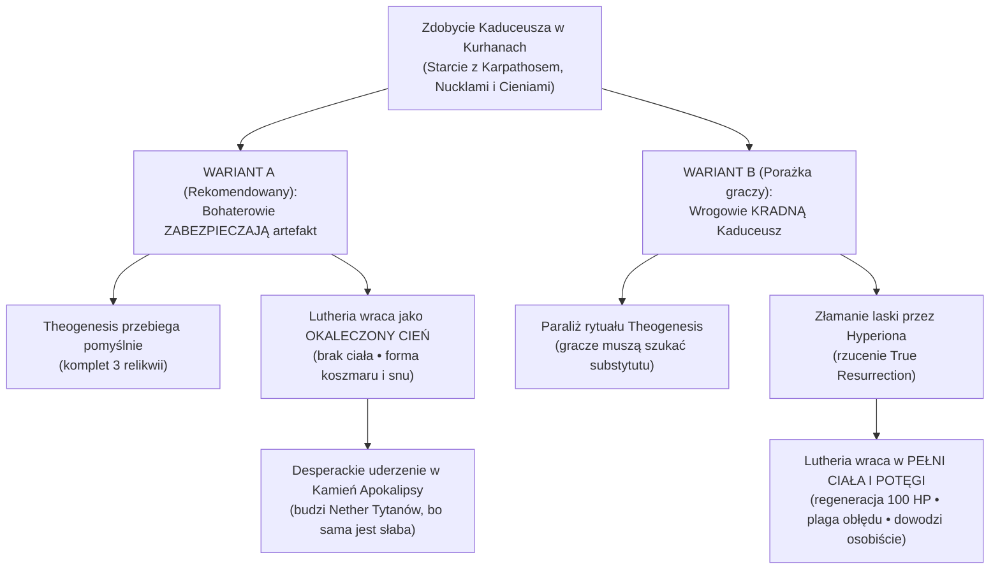

# Mistrz Cieni, Kaduceusz i Powrót Lutherii

Trzeci główny tor intrygi kampanii, ściśle powiązany z losem krainy i śmiercią królowej Heleny. **[[Mistrz Cieni]] (Jocasta) kupił wojnę od [[Mojry|Mojr]]**, aby przygotować grunt pod powrót swojej bogini, a sprawa **Kaduceusza** w Kurhanach Karpathosa rozstrzyga o formie, w jakiej [[Lutheria]] powróci do świata.

---

## 1. Kim jest Mistrz Cieni i Czego Chce

Zamaskowany, w kapturze, tożsamość formalnie skrywana przed Arezją (kapłanka Jocasta). Prowadzi [[Świątynia Cieni|Świątynię Cieni]] i rozległą siatkę szpiegowską [[Arezja|Arezji]] sięgającą do [[Mytros]], zasiada w arezyjskiej Radzie Pięciu Mistrzów.

Jej uczniowie **potajemnie czczą [[Lutheria|Lutherię]]**. Kolejne królowe Arezji od stuleci to podejrzewały i przymykały oko, bo świątynia i jej zabójcy byli zbyt użyteczni w obronie państwa.

Mistrz Cieni **wie, że Lutheria wróci**, i od piętnastu lat metodycznie kompletuje środki i warunki, żeby jej to umożliwić.

---

## 2. Pakt z Mojrami: Zakup Wojny

Mistrz Cieni przyszedł do Mojr z konkretną transakcją — potrzebował wybuchu wieloletniej, wyniszczającej wojny między dwoma potęgami Thylei.

### Po co mu wojna?
1. **Żniwo krwi i cierpienia:** Powrót [[Lutheria|Lutherii]] z głębin [[Morze Otchłani|Otchłani]] wymaga potężnego ładunku rozpaczy, agonii, głodu i setek przerwanych istnień. Piętnaście lat wojny to gigantyczne źródło energii zasilające jej powolne budzenie się.
2. **Paraliż polityczny Thylei:** Wyniszczone miasta i skłóceni Smoczy Lordowie nie byli w stanie stworzyć zjednoczonego Nowego Panteonu, który mógłby zapobiec powrotowi dawnych bogów.

### Co dał Mojrom w zamian?
1. **Traktat o Prawach i Zobowiązaniach Krwi** — unikalny zbiór Pierwszych Przysiąg Thylei (skodyfikowanych za czasów Kentimane i Tytanów), wydobyty dla niego przez drużynę ze skarbca [[Sydon|Sydona]] w [[Praxys]] ([[Sesja 83 - Zmierzch Ery Tytanów|Sesja 83]]). Traktat zawiera archaiczne luki prawne, które pozwalają Mojrom naginać losy pradawnych i nieludzkich ras bez łamania Przysięgi Pokoju.
2. **Śmierć [[Królowa Helena|Królowej Heleny]] z rąk Mistrza Cieni** — ostateczna likwidacja dynastii Calliope, która 500 lat temu wynegocjowała immunitet. Mojry zażądały jej śmierci jako części zapłaty za utkanie 15-letniej wojny — a Mistrz Cieni zobowiązał się osobiście przeprowadzić zamach i dostarczyć jej krew Krosnu.

---

## 3. Co Wydarzyło się w Sesji 84: Orestes jako Próba Generalna

**[[Orestes]] był próbą generalną.**

Świątynia Cieni potrzebowała dowodu, że potrafi przywrócić wolę do martwego ciała przez granicę [[Morze Otchłani|Otchłani]]. Minotaur z silną duszą i mocnym powodem, żeby wrócić, był idealnym materiałem — i **sam się o to prosił, płacąc im kompletem odłamków [[Kryształowa Kosa Lutherii|Kryształowej Kosy]]**.

Zadziałało:
- Dziewięć godzin rytuału: glify, świece, postacie w czerni nucące w nieznanym języku.
- Melodia, którą [[Orestes]] zapamiętał i z której układa biesiadne piosenki, **jest inkantacją rytuału wskrzeszenia**. Minotaur chodzi po Thylei i nuci instrukcję powrotu bogini śmierci.

### Jak to odpalić przy stole?
- **Odkrycie (Sesje 88–92):** W trakcie eksploracji Kurhanów lub Świątyni Cieni glify grobowe zaczynają rezonować i jarzyć się w rytm głosu Orestesa, a uczeni arkanów z przerażeniem pytają: *„Skąd znasz Hymn Przebudzenia Królowej Snów?!”*.
- **Oręż w rękach Orestesa:** Orestes nie jest bezsilną ofiarą. Zna melodię na pamięć i w finale (Akt IV) może **zniekształcić/sfałszować pieśń**, rycząc jej piwowarską wersję, co wprowadzi dysonans arkaniczny i zerwie rytuał Lutherii!

---

## 4. Rola Kaduceusza i Grobowiec Karpathosa

**Kaduceusz Damona** leży w grobowcu [[Karpathos|Karpathosa]] w Kurhanach pod Arezją, za stałym *Forbiddance*, strzeżony przez mnichów [[Yosfor|Yosfora]] oraz wampirzą parę królewską (Karpathosa i [[Nemosyne]]).

### Geneza Artefaktu
Laska została wykuta ponad 500 lat temu przez arcymaga Damona w pierwotnych wodach [[Morze Otchłani|Morza Otchłani]]. Została stworzona dla króla-smoczego lorda Karpathosa jako narzędzie dawania życia i leczenia poległych Smoczych Lordów. Karpathos dał się uwieść obietnicom Lutherii, zdradził sojuszników, a gdy złamał przysięgę, został ukarany zamianą w pierwszego wampira Thylei.

### Klucz do Grobowca: [[Portret Karpathosa]]
Drużyna kupiła w [[Galeria Sztuki|Galerii Sztuki]] w Arezji **Portret Karpathosa** za 50 000 sztuk złota — nekromantyczne filakterium trzymające duszę króla. **Gracze nadal go mają.**  
Zniszczenie portretu w komorze K9 odbiera Karpathosowi postać gazową i regenerację 100 HP na rundę. Bez portretu wampir w Kurhanach jest niezniszczalny.

### Dlaczego Mistrz Cieni sam nie wszedł do grobowca?
1. **Grobowiec to pułapka samobójcza:** Bez portretu wampiry wybiłyby zabójców Cieni w kilka minut.
2. **Cierpliwość:** Mistrz Cieni wiedział, że poszukiwacze *Theogenesis* w końcu otworzą grobowiec. Czekał na ten moment, by przechwycić artefakt na wyjściu.

---

## 5. Dynamika Starcia w Kurhanach i Zamach na Helenę

### Tykający Zegar w Grobowcu (Sesje 91–92)
1. **Faza 1 (Wejście):** Drużyna wchodzi z edyktem Heleny i Portretem, niszczy obraz w K9 i walczy z Karpathosem o Kaduceusz.
2. **Faza 2 (Zwrot akcji — 10. minuta):** Zgodnie z REMASTEREM, do grobowca wdzierają się **Nucklowie** (oceaniczne bestie zrodzone z woli Lutherii). Wyłamują młyńskie kamienie w K3, K4 i K6, budzą 30+ wampirzych pomiotów i próbują wyrwać Kaduceusz, by oddać go Lutherii.
3. **Faza 3 (Zasadzka Cieni na wyjściu):** Wykrwawieni bohaterowie wychodzą na powierzchnię, gdzie uderza na nich elita zabójców Świątyni Cieni.

### Kulminacja: Morderstwo Królowej Heleny
W tym samym czasie, gdy drużyna toczy bój w podziemiach, Mistrz Cieni (Jocasta) osobiście morduje w pałacu [[Królowa Helena|Królową Helenę]].
- Śmierć Heleny to **uiszczenie długu krwi wobec Mojr za 15 lat wyreżyserowanej wojny**.
- Arezja pogrąża się w kryzysie sukcesyjnym, a drużyna staje się jedynym stabilizatorem ładu.

---

## 6. Dziura Logiczna Podręcznika i Dwie Formy Powrotu

### Problem w REMASTERZE
Autorzy oficjalnego modułu zakładają, że wrogowie polują na Kaduceusz, by wskrzesić Lutherię. Jednak w Rozdziale 13 (*Apokalypsis*) Lutheria po prostu pojawia się żywa w Pałacu Hyperionów — ignorując całkowicie to, czy gracze obronili Kaduceusz w kurhanach, czy go stracili.

### Rozwiązanie: Rozgałęzienie Fabularne (Dwie Ścieżki)

#### WARIANT A: Bohaterowie Zabezpieczają Kaduceusz (Ścieżka Domyślna)
- **Dla Graczy:** Zabezpieczają stabilizator do *Theogenesis*. Zyskują potężny artefakt leczący (*Heal*, *Greater Restoration*, *Resurrection*), lecz obarczony mroczną aurą Otchłani.
- **Dla Lutherii:** **Brak fizycznego ciała.** Nie może zrekonstruować ściętej w Sesji 82 powłoki. Manifestuje się jako bezcielesny upiór snu pasożytujący na Hyperionach i pieśni Orestesa.
- **Motywacja do Apokalypsis:** Z powodu słabości ucieka się do przebudzenia Nether Tytanów (Tarrasque, Kraken, Smok, Behemot). Apokalipsa jest dla niej aktem desperacji.
- **Finał:** W Pałacu Hyperionów drużyna staje naprzeciw zniekształconej istoty stopionej z Kamieniem Apokalipsy. Obrona Kaduceusza odebrała jej połowę siły!

#### WARIANT B: Wrogowie Kradną Kaduceusz (Ścieżka Porażki)
- Tylko jeśli gracze poniosą ewidentną klęskę w kurhanach lub zlekceważą ochronę artefaktu.
- Jeden z Hyperionów łamie laskę, rzucając *True Resurrection* na Lutherię (*Appendix C*).
- Lutheria odzyskuje pełne, niezniszczalne boskie ciało pod koniec Aktu II. W całej Thylei gaśnie blask słońca, rzeki zamieniają się w piołun, a ludzie popadają w szaleństwo na jawie. W finale posiada 100 HP regeneracji na rundę i dowodzi tytanami.

---

## 7. Podwójna Natura Kaduceusza: Życie vs Śmierć

| Aspekt | Rola dla Graczy (Nowy Panteon) | Rola dla Sług Lutherii |
|---|---|---|
| **Domeny** | Życie, Odnowa, Most Arkanów | Śmierć, Wampiryzm, Wskrzeszenie Tytana |
| **Funkcja w Theogenesis** | **Stabilizator Ognia:** Ogień Prometejski niesie iskrę boską, lecz bez witalnej kotwicy Kaduceusza spaliłby duszę śmiertelnika na popiół. | **Katalizator Zmartwychwstania:** Złamanie laski przez Hyperiona uwalnia moc *True Resurrection* dla zmarłego boga. |
| **Ryzyko** | Laska nosi piętno Karpathosa — postać dostrojona miewa sny z Otchłani. | Zniszczenie laski bezpowrotnie niszczy najpotężniejsze narzędzie uzdrawiania w Thylei. |

---

## 8. Wskazówki Prowadzenia przy Stole

1. **Buduj Wagę Artefaktu w Kurhanach:** Gdy Nucklowie wdzierają się do grobowca, ich jedynym celem jest Kaduceusz. Gracze muszą poczuć, że walczą o coś, co zadecyduje o losie świata.
2. **Nagradzaj Czujność:** Jeśli gracze zabezpieczą Kaduceusz (np. schowają go w Worku Bez Dna Orestesa i wystawią warty), nagródź ich. Artefakt zostaje w ich rękach.
3. **Pokaż Skutki w Akcie IV:** Kiedy staną naprzeciw cienia Lutherii, powiedz wprost: *„Gdybyście nie ocalili Kaduceusza pod Arezją, ta bestia stałaby dziś przed wami z krwi i kości”*. To daje graczom najgłębsze poczucie sensu ich zwycięstw.
